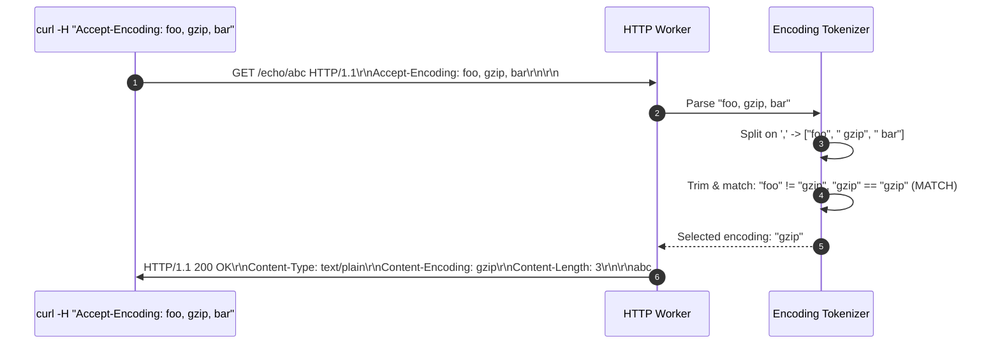
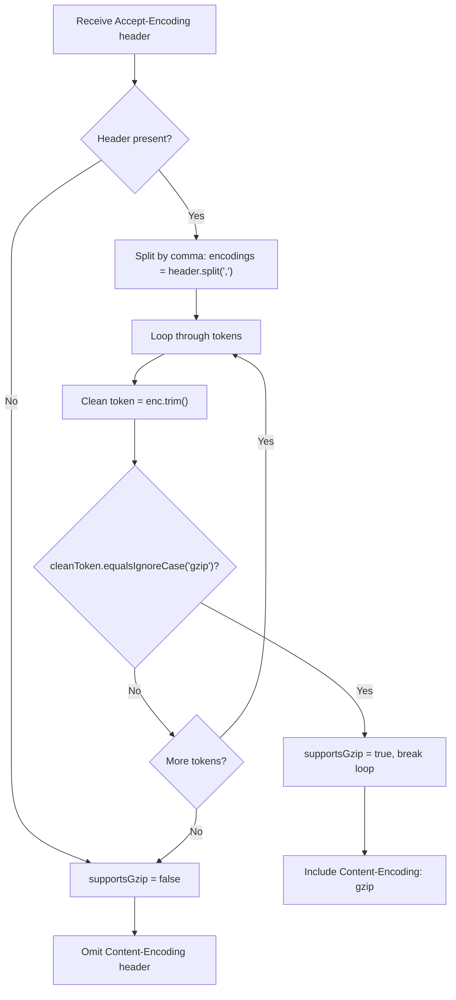

# Stage 10: Multiple compression schemes

## In one line
Parsing comma-separated `Accept-Encoding` tokens with whitespace trimming enables the server to negotiate a mutually supported compression algorithm (such as `gzip`) from a priority list of client capabilities.

## Self-test (cover the answers below and answer these first)
1. **How are multiple compression algorithms specified in an `Accept-Encoding` header?**
   - *Answer*: As a comma-separated list of encoding tokens (e.g. `gzip, deflate, br`).
2. **Why is it essential to call `.trim()` on each token after splitting by comma?**
   - *Answer*: HTTP header syntax permits optional whitespace around list delimiters (`OWS "," OWS`), meaning tokens like `" gzip"` or `"gzip "` must be stripped before string comparison.
3. **What happens if a client lists `gzip` alongside several unrecognized compression schemes?**
   - *Answer*: The server selects `gzip`, ignores the unsupported schemes, and responds with `Content-Encoding: gzip`.
4. **What should the server respond if the client lists multiple encodings, but none are supported?**
   - *Answer*: Deliver the body uncompressed and omit the `Content-Encoding` header.
5. **How does RFC 9110 define the `identity` encoding in content negotiation?**
   - *Answer*: `identity` refers to the default encoding where no transformation or compression is applied to the payload.

---

## The problem it solved
Modern web browsers and HTTP clients rarely request a single compression scheme; they transmit a preference list (e.g., `Accept-Encoding: gzip, deflate, br, zstd`). If a server only performs naive whole-string matching (`header.equals("gzip")`), any client advertising multiple algorithms would receive uncompressed responses. This stage implements tokenized comma-separated parsing of `Accept-Encoding`.

---

## Thought Process & Architectural Model

### Negotiation Algorithm
1. Look up `Accept-Encoding` header (case-insensitively).
2. If absent: return uncompressed payload without `Content-Encoding`.
3. If present:
   - Split header string on `,`: `String[] candidates = acceptEncoding.split(",")`.
   - Iterate through each candidate token:
     - Strip whitespace: `String token = candidate.trim()`.
     - Check if `token.equalsIgnoreCase("gzip")`.
     - If matched: select `gzip` as the negotiated codec and break early.
4. If `gzip` selected:
   - Include `Content-Encoding: gzip\r\n`.
5. If no supported codec matched:
   - Omit `Content-Encoding` header.

### Sequence Diagram


### Flowchart


---

## Full Solution

```java
import java.io.BufferedReader;
import java.io.IOException;
import java.io.InputStreamReader;
import java.io.OutputStream;
import java.net.ServerSocket;
import java.net.Socket;
import java.nio.charset.StandardCharsets;
import java.nio.file.Files;
import java.nio.file.Path;
import java.nio.file.Paths;
import java.util.Map;
import java.util.TreeMap;
import java.util.concurrent.ExecutorService;
import java.util.concurrent.Executors;

public class Main {
  private static String directory = null;

  public static void main(String[] args) {
    for (int i = 0; i < args.length; i++) {
      if (args[i].equals("--directory") && i + 1 < args.length) {
        directory = args[i + 1];
      }
    }

    ExecutorService executor = Executors.newCachedThreadPool();
    try (ServerSocket serverSocket = new ServerSocket(4221)) {
      serverSocket.setReuseAddress(true);
      while (true) {
        Socket clientSocket = serverSocket.accept();
        executor.submit(() -> handleClient(clientSocket));
      }
    } catch (IOException e) {
      System.err.println("IOException: " + e.getMessage());
    } finally {
      executor.shutdown();
    }
  }

  private static void handleClient(Socket clientSocket) {
    try (clientSocket;
         BufferedReader reader = new BufferedReader(new InputStreamReader(clientSocket.getInputStream(), StandardCharsets.UTF_8));
         OutputStream out = clientSocket.getOutputStream()) {
      
      String requestLine = reader.readLine();
      if (requestLine == null || requestLine.isEmpty()) {
        return;
      }

      String[] parts = requestLine.split(" ");
      if (parts.length < 2) {
        return;
      }

      String method = parts[0];
      String path = parts[1];

      Map<String, String> headers = new TreeMap<>(String.CASE_INSENSITIVE_ORDER);
      String headerLine;
      while ((headerLine = reader.readLine()) != null && !headerLine.isEmpty()) {
        int colonIdx = headerLine.indexOf(':');
        if (colonIdx != -1) {
          String name = headerLine.substring(0, colonIdx).trim();
          String val = headerLine.substring(colonIdx + 1).trim();
          headers.put(name, val);
        }
      }

      int contentLength = 0;
      if (headers.containsKey("Content-Length")) {
        try {
          contentLength = Integer.parseInt(headers.get("Content-Length"));
        } catch (NumberFormatException ignored) {}
      }

      char[] bodyChars = new char[contentLength];
      int totalRead = 0;
      while (totalRead < contentLength) {
        int read = reader.read(bodyChars, totalRead, contentLength - totalRead);
        if (read == -1) break;
        totalRead += read;
      }
      String requestBody = new String(bodyChars, 0, totalRead);

      if (method.equalsIgnoreCase("POST") && path.startsWith("/files/")) {
        String filename = path.substring(7);
        if (directory != null) {
          Path filePath = Paths.get(directory, filename);
          if (filePath.getParent() != null) {
            Files.createDirectories(filePath.getParent());
          }
          Files.write(filePath, requestBody.getBytes(StandardCharsets.UTF_8));
          out.write("HTTP/1.1 201 Created\r\n\r\n".getBytes(StandardCharsets.UTF_8));
        } else {
          out.write("HTTP/1.1 404 Not Found\r\n\r\n".getBytes(StandardCharsets.UTF_8));
        }
      } else if (path.equals("/")) {
        String response = "HTTP/1.1 200 OK\r\n\r\n";
        out.write(response.getBytes(StandardCharsets.UTF_8));
      } else if (path.startsWith("/echo/")) {
        String echoStr = path.substring(6);
        byte[] bodyBytes = echoStr.getBytes(StandardCharsets.UTF_8);

        boolean supportsGzip = false;
        String acceptEncoding = headers.get("Accept-Encoding");
        if (acceptEncoding != null) {
          String[] encodings = acceptEncoding.split(",");
          for (String enc : encodings) {
            if (enc.trim().equalsIgnoreCase("gzip")) {
              supportsGzip = true;
              break;
            }
          }
        }

        StringBuilder response = new StringBuilder("HTTP/1.1 200 OK\r\n");
        response.append("Content-Type: text/plain\r\n");
        if (supportsGzip) {
          response.append("Content-Encoding: gzip\r\n");
        }
        response.append("Content-Length: ").append(bodyBytes.length).append("\r\n\r\n");
        response.append(echoStr);

        out.write(response.toString().getBytes(StandardCharsets.UTF_8));
      } else if (path.equals("/user-agent")) {
        String userAgent = headers.getOrDefault("User-Agent", "");
        byte[] bodyBytes = userAgent.getBytes(StandardCharsets.UTF_8);
        String response = "HTTP/1.1 200 OK\r\n"
            + "Content-Type: text/plain\r\n"
            + "Content-Length: " + bodyBytes.length + "\r\n\r\n"
            + userAgent;
        out.write(response.getBytes(StandardCharsets.UTF_8));
      } else if (path.startsWith("/files/")) {
        String filename = path.substring(7);
        if (directory != null) {
          Path filePath = Paths.get(directory, filename);
          if (Files.exists(filePath) && Files.isRegularFile(filePath)) {
            byte[] fileBytes = Files.readAllBytes(filePath);
            String responseHeader = "HTTP/1.1 200 OK\r\n"
                + "Content-Type: application/octet-stream\r\n"
                + "Content-Length: " + fileBytes.length + "\r\n\r\n";
            out.write(responseHeader.getBytes(StandardCharsets.UTF_8));
            out.write(fileBytes);
          } else {
            out.write("HTTP/1.1 404 Not Found\r\n\r\n".getBytes(StandardCharsets.UTF_8));
          }
        } else {
          out.write("HTTP/1.1 404 Not Found\r\n\r\n".getBytes(StandardCharsets.UTF_8));
        }
      } else {
        String response = "HTTP/1.1 404 Not Found\r\n\r\n";
        out.write(response.getBytes(StandardCharsets.UTF_8));
      }

      out.flush();
    } catch (IOException e) {
      System.err.println("Client handling error: " + e.getMessage());
    }
  }
}
```

---

## Concepts (the transferable part)
- **Token Lists in HTTP Headers**: Many HTTP headers follow the `#rule` ABNF convention where elements are separated by commas with optional whitespace: `1#element = element *( OWS "," OWS element )`.
- **Quality Values (q-values)**: In full HTTP content negotiation, tokens may be assigned weights (e.g. `gzip;q=1.0, deflate;q=0.5`). When weights are omitted, the default `q=1.0` is assumed.
- **Header Parsing Resilience**: Robust parsers must tolerate extra spacing, tabs, and case discrepancies without failing.

---

## Wire Format / Protocol

```text
GET /echo/abc HTTP/1.1\r\n
Host: localhost:4221\r\n
Accept-Encoding: invalid-1, gzip, invalid-2\r\n
\r\n
```

```text
HTTP/1.1 200 OK\r\n
Content-Type: text/plain\r\n
Content-Encoding: gzip\r\n
Content-Length: 3\r\n
\r\n
abc
```

---

## What breaks it (failure modes)
- **Omission of `.trim()`**: Failing to trim each token results in comparing `" gzip"` against `"gzip"`, causing supported algorithms following commas to be rejected.
- **Substring Matching Traps**: Checking `header.contains("gzip")` matches false positives like `Accept-Encoding: not-gzip, x-gzip-disabled`. Token splitting prevents this.
- **Empty Token Elements**: Double commas (e.g. `gzip,,br`) can produce empty strings when split; `.trim()` and check ensure no exceptions.

---

## Tradeoffs
- **Linear Scan vs Pre-computed Set**:
  - Scanning tokens with a loop is fast and zero-allocation beyond the split array for small header lists.
  - Using a `Set<String>` is useful when supporting dozens of compression formats.

---

## Java Specifics
- `String.split(",")`: Partitions string into array across comma boundaries.
- `String.trim()`: Removes ASCII whitespace characters (spaces, tabs, newlines).
- `String.equalsIgnoreCase(String other)`: Case-insensitive equality check.

---

## Rebuild Checklist
- [ ] Split `Accept-Encoding` header value on `,`.
- [ ] Trim each token of surrounding whitespace.
- [ ] Match each token case-insensitively against `"gzip"`.
- [ ] Set `supportsGzip = true` if matched.
- [ ] Include `Content-Encoding: gzip` if matched, omit otherwise.
