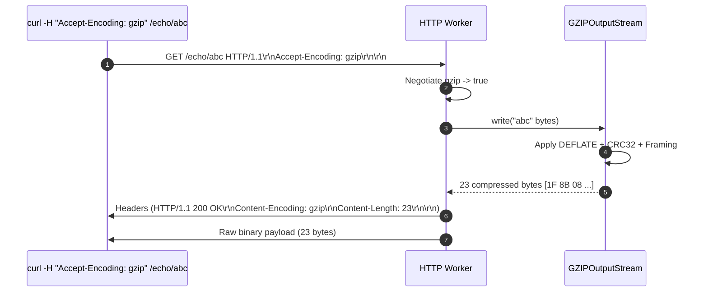
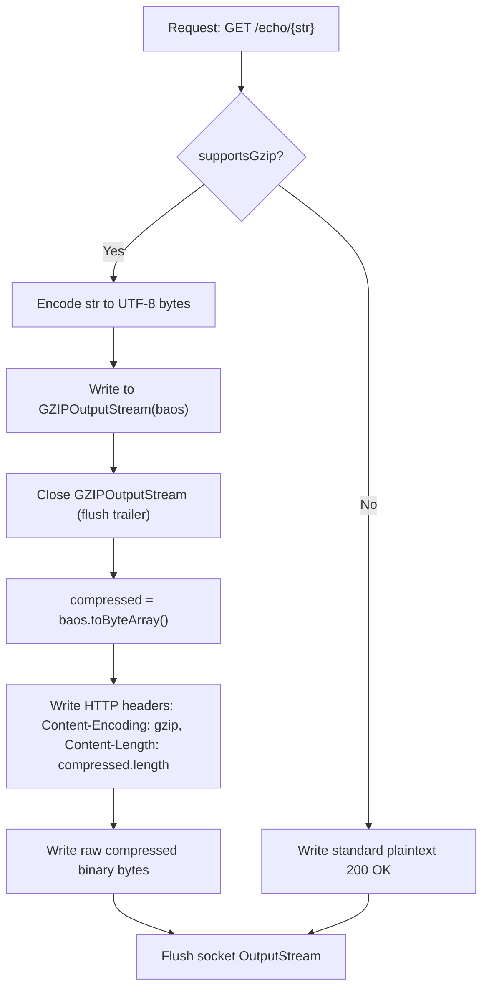

# Stage 11: Gzip compression

## In one line
Compressing HTTP response bodies with the DEFLATE algorithm wrapped in RFC 1952 GZIP framing reduces wire payload size while requiring binary byte-stream handling and updated `Content-Encoding: gzip` and `Content-Length` headers.

## Self-test (cover the answers below and answer these first)
1. **What magic bytes identify the start of a GZIP stream?**
   - *Answer*: `0x1F 0x8B` (in hex) as defined by RFC 1952.
2. **Why must `GZIPOutputStream.close()` or `finish()` be called before extracting compressed bytes?**
   - *Answer*: To flush pending compressed blocks and write the mandatory 8-byte GZIP trailer (32-bit CRC-32 checksum and 32-bit uncompressed size modulo $2^{32}$).
3. **Why can compressing a tiny string like `"abc"` result in a larger output than the input?**
   - *Answer*: GZIP format overhead includes a 10-byte fixed header, an 8-byte trailer, and block metadata, totaling at least 18 bytes of framing overhead regardless of payload size.
4. **Why should the compressed payload be written directly to `OutputStream` rather than converted to a `String`?**
   - *Answer*: Compressed data is raw arbitrary binary octets. Interpreting arbitrary binary sequences as UTF-8 characters corrupts invalid byte sequences and breaks checksum integrity.
5. **What compression algorithm underpins the GZIP format?**
   - *Answer*: DEFLATE, a combination of LZ77 sliding-window dictionary matching and Huffman entropy coding.

---

## The problem it solved
Previous stages verified header negotiation but still delivered uncompressed bodies. When `Accept-Encoding: gzip` is negotiated, the server must actually compress the response payload before transmission, compute the exact size of the compressed byte stream for `Content-Length`, and deliver binary bytes over TCP.

---

## Thought Process & Architectural Model

### GZIP Compression Pipeline
1. Client requests `GET /echo/{str}` with `Accept-Encoding: gzip`.
2. Server detects `gzip` support.
3. Compress payload using Java's standard library `java.util.zip.GZIPOutputStream`:
   ```java
   ByteArrayOutputStream baos = new ByteArrayOutputStream();
   try (GZIPOutputStream gzip = new GZIPOutputStream(baos)) {
       gzip.write(echoStr.getBytes(StandardCharsets.UTF_8));
   }
   byte[] compressedBytes = baos.toByteArray();
   ```
4. Construct HTTP response:
   - Header text:
     ```text
     HTTP/1.1 200 OK\r\n
     Content-Type: text/plain\r\n
     Content-Encoding: gzip\r\n
     Content-Length: <compressedBytes.length>\r\n
     \r\n
     ```
   - Binary body: `compressedBytes`.
5. Transmit header followed directly by binary byte array.

### Sequence Diagram


### Flowchart


---

## Full Solution

```java
import java.io.BufferedReader;
import java.io.ByteArrayOutputStream;
import java.io.IOException;
import java.io.InputStreamReader;
import java.io.OutputStream;
import java.net.ServerSocket;
import java.net.Socket;
import java.nio.charset.StandardCharsets;
import java.nio.file.Files;
import java.nio.file.Path;
import java.nio.file.Paths;
import java.util.Map;
import java.util.TreeMap;
import java.util.concurrent.ExecutorService;
import java.util.concurrent.Executors;
import java.util.zip.GZIPOutputStream;

public class Main {
  private static String directory = null;

  public static void main(String[] args) {
    for (int i = 0; i < args.length; i++) {
      if (args[i].equals("--directory") && i + 1 < args.length) {
        directory = args[i + 1];
      }
    }

    ExecutorService executor = Executors.newCachedThreadPool();
    try (ServerSocket serverSocket = new ServerSocket(4221)) {
      serverSocket.setReuseAddress(true);
      while (true) {
        Socket clientSocket = serverSocket.accept();
        executor.submit(() -> handleClient(clientSocket));
      }
    } catch (IOException e) {
      System.err.println("IOException: " + e.getMessage());
    } finally {
      executor.shutdown();
    }
  }

  private static void handleClient(Socket clientSocket) {
    try (clientSocket;
         BufferedReader reader = new BufferedReader(new InputStreamReader(clientSocket.getInputStream(), StandardCharsets.UTF_8));
         OutputStream out = clientSocket.getOutputStream()) {
      
      String requestLine = reader.readLine();
      if (requestLine == null || requestLine.isEmpty()) {
        return;
      }

      String[] parts = requestLine.split(" ");
      if (parts.length < 2) {
        return;
      }

      String method = parts[0];
      String path = parts[1];

      Map<String, String> headers = new TreeMap<>(String.CASE_INSENSITIVE_ORDER);
      String headerLine;
      while ((headerLine = reader.readLine()) != null && !headerLine.isEmpty()) {
        int colonIdx = headerLine.indexOf(':');
        if (colonIdx != -1) {
          String name = headerLine.substring(0, colonIdx).trim();
          String val = headerLine.substring(colonIdx + 1).trim();
          headers.put(name, val);
        }
      }

      int contentLength = 0;
      if (headers.containsKey("Content-Length")) {
        try {
          contentLength = Integer.parseInt(headers.get("Content-Length"));
        } catch (NumberFormatException ignored) {}
      }

      char[] bodyChars = new char[contentLength];
      int totalRead = 0;
      while (totalRead < contentLength) {
        int read = reader.read(bodyChars, totalRead, contentLength - totalRead);
        if (read == -1) break;
        totalRead += read;
      }
      String requestBody = new String(bodyChars, 0, totalRead);

      if (method.equalsIgnoreCase("POST") && path.startsWith("/files/")) {
        String filename = path.substring(7);
        if (directory != null) {
          Path filePath = Paths.get(directory, filename);
          if (filePath.getParent() != null) {
            Files.createDirectories(filePath.getParent());
          }
          Files.write(filePath, requestBody.getBytes(StandardCharsets.UTF_8));
          out.write("HTTP/1.1 201 Created\r\n\r\n".getBytes(StandardCharsets.UTF_8));
        } else {
          out.write("HTTP/1.1 404 Not Found\r\n\r\n".getBytes(StandardCharsets.UTF_8));
        }
      } else if (path.equals("/")) {
        String response = "HTTP/1.1 200 OK\r\n\r\n";
        out.write(response.getBytes(StandardCharsets.UTF_8));
      } else if (path.startsWith("/echo/")) {
        String echoStr = path.substring(6);

        boolean supportsGzip = false;
        String acceptEncoding = headers.get("Accept-Encoding");
        if (acceptEncoding != null) {
          String[] encodings = acceptEncoding.split(",");
          for (String enc : encodings) {
            if (enc.trim().equalsIgnoreCase("gzip")) {
              supportsGzip = true;
              break;
            }
          }
        }

        if (supportsGzip) {
          byte[] compressed = gzipCompress(echoStr.getBytes(StandardCharsets.UTF_8));
          String responseHeader = "HTTP/1.1 200 OK\r\n"
              + "Content-Type: text/plain\r\n"
              + "Content-Encoding: gzip\r\n"
              + "Content-Length: " + compressed.length + "\r\n\r\n";
          out.write(responseHeader.getBytes(StandardCharsets.UTF_8));
          out.write(compressed);
        } else {
          byte[] bodyBytes = echoStr.getBytes(StandardCharsets.UTF_8);
          String response = "HTTP/1.1 200 OK\r\n"
              + "Content-Type: text/plain\r\n"
              + "Content-Length: " + bodyBytes.length + "\r\n\r\n"
              + echoStr;
          out.write(response.getBytes(StandardCharsets.UTF_8));
        }
      } else if (path.equals("/user-agent")) {
        String userAgent = headers.getOrDefault("User-Agent", "");
        byte[] bodyBytes = userAgent.getBytes(StandardCharsets.UTF_8);
        String response = "HTTP/1.1 200 OK\r\n"
            + "Content-Type: text/plain\r\n"
            + "Content-Length: " + bodyBytes.length + "\r\n\r\n"
            + userAgent;
        out.write(response.getBytes(StandardCharsets.UTF_8));
      } else if (path.startsWith("/files/")) {
        String filename = path.substring(7);
        if (directory != null) {
          Path filePath = Paths.get(directory, filename);
          if (Files.exists(filePath) && Files.isRegularFile(filePath)) {
            byte[] fileBytes = Files.readAllBytes(filePath);
            String responseHeader = "HTTP/1.1 200 OK\r\n"
                + "Content-Type: application/octet-stream\r\n"
                + "Content-Length: " + fileBytes.length + "\r\n\r\n";
            out.write(responseHeader.getBytes(StandardCharsets.UTF_8));
            out.write(fileBytes);
          } else {
            out.write("HTTP/1.1 404 Not Found\r\n\r\n".getBytes(StandardCharsets.UTF_8));
          }
        } else {
          out.write("HTTP/1.1 404 Not Found\r\n\r\n".getBytes(StandardCharsets.UTF_8));
        }
      } else {
        String response = "HTTP/1.1 404 Not Found\r\n\r\n";
        out.write(response.getBytes(StandardCharsets.UTF_8));
      }

      out.flush();
    } catch (IOException e) {
      System.err.println("Client handling error: " + e.getMessage());
    }
  }

  private static byte[] gzipCompress(byte[] data) throws IOException {
    ByteArrayOutputStream baos = new ByteArrayOutputStream();
    try (GZIPOutputStream gzipOut = new GZIPOutputStream(baos)) {
      gzipOut.write(data);
    }
    return baos.toByteArray();
  }
}
```

---

## Concepts (the transferable part)
- **RFC 1952 GZIP Structure**:
  - 10-byte Header: Magic `0x1F 0x8B`, Compression method `0x08` (DEFLATE), Flags, MTIME, XFL, OS.
  - Compressed blocks: Dynamic or fixed Huffman encoded LZ77 tokens.
  - 8-byte Trailer: CRC-32 checksum (4 bytes, little-endian) and ISIZE (uncompressed input size modulo $2^{32}$, 4 bytes, little-endian).
- **Binary vs Character Boundaries**: HTTP message framing defines headers as US-ASCII / UTF-8 lines, but payload bodies as raw octets. Converting raw binary to Strings inevitably corrupts non-decodable byte sequences.

---

## Wire Format / Protocol

```text
HTTP/1.1 200 OK\r\n
Content-Type: text/plain\r\n
Content-Encoding: gzip\r\n
Content-Length: 23\r\n
\r\n
<23 binary octets>
```

Hexadecimal dump of 23-byte compressed body for `"abc"`:
```text
1F 8B 08 00 00 00 00 00 00 03 4B 4C 4A 06 00 C2 41 24 35 03 00 00 00
```
- `1F 8B`: GZIP ID1 and ID2 magic numbers.
- `08`: Deflate compression method.
- `00`: Header flags.
- `00 00 00 00`: Modification timestamp.
- `00 03`: Extra flags, OS code (Unix).
- `4B 4C 4A 06 00`: Compressed DEFLATE block containing `"abc"`.
- `C2 41 24 35`: CRC-32 of `"abc"`.
- `03 00 00 00`: Uncompressed size (3 bytes).

---

## What breaks it (failure modes)
- **Missing Trailer**: Forgetting to close the `GZIPOutputStream` before calling `baos.toByteArray()` leaves off the CRC-32 and length trailer, causing client decompression errors (`unexpected end of file`).
- **Wrong Content-Length**: Using uncompressed string length instead of `compressed.length` causes clients to hang or truncate the compressed stream.
- **String Encoding Binary**: Passing compressed bytes through `new String(compressed, StandardCharsets.UTF_8)` corrupts binary values that do not represent valid UTF-8 code points.

---

## Tradeoffs
- **Compression Level**: `GZIPOutputStream` defaults to `Deflater.DEFAULT_COMPRESSION` (level 6), balancing CPU cycles and bandwidth savings. For real-time high-throughput servers, `BEST_SPEED` (level 1) is often preferred.
- **Payload Size Threshold**: Compressing payloads smaller than ~150 bytes often increases total transfer size due to header overhead. Real-world servers (e.g. Nginx) enforce a `gzip_min_length 256` threshold.

---

## Java Specifics
- `java.util.zip.GZIPOutputStream`: Standard library filter stream implementing RFC 1952 compression.
- `ByteArrayOutputStream`: In-memory output sink capturing compressed byte chunks.
- Try-with-resources: Ensures `gzipOut.close()` is executed deterministically, completing stream compression before extracting bytes.

---

## Rebuild Checklist
- [ ] Implement `gzipCompress(byte[] data)` helper using `GZIPOutputStream` and `ByteArrayOutputStream`.
- [ ] Ensure `GZIPOutputStream` is cleanly closed prior to calling `toByteArray()`.
- [ ] Check `supportsGzip` condition in `/echo/{str}` route.
- [ ] Format header with `Content-Encoding: gzip` and `Content-Length: compressed.length`.
- [ ] Write headers to `out`, followed by raw binary `compressed` byte array.
- [ ] Verify using `curl -v -H "Accept-Encoding: gzip" http://localhost:4221/echo/abc | hexdump -C`.
