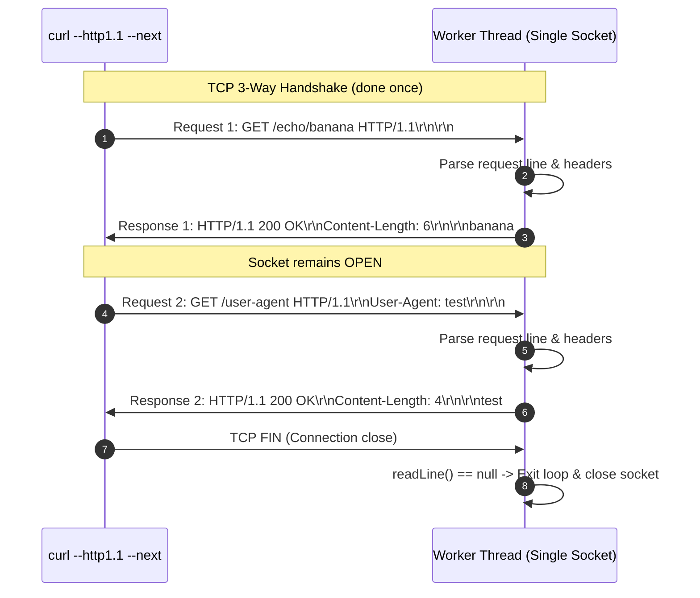
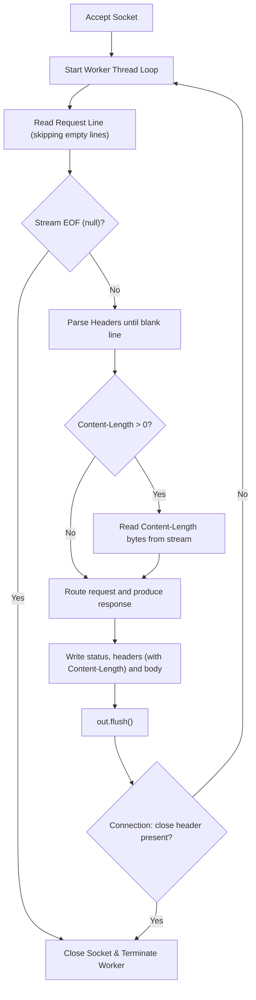

# Stage 12: Persistent connections

## In one line
HTTP/1.1 persistent connections (keep-alive) allow multiple HTTP request/response exchanges over a single underlying TCP connection by repeatedly parsing discrete message frames until the client terminates the connection or sends `Connection: close`.

## Self-test (cover the answers below and answer these first)
1. **What is the default connection persistence model in HTTP/1.1?**
   - *Answer*: Persistent (keep-alive) by default; connections remain open unless explicitly closed.
2. **What request header signals that the server should terminate the TCP connection after responding?**
   - *Answer*: `Connection: close`.
3. **How does an HTTP client distinguish where one response ends and the next begins over a persistent connection?**
   - *Answer*: Via explicit payload framing, primarily using the `Content-Length` header or `Transfer-Encoding: chunked`.
4. **Why should a persistent request parser ignore leading empty CRLF lines before the request line?**
   - *Answer*: RFC 9112 §2.2 recommends ignoring leading CRLF lines between sequential requests to tolerate pipelining or client newline padding robustly.
5. **What performance cost is eliminated by persistent connections?**
   - *Answer*: The 3-way TCP handshake round-trip latency and slow-start congestion window penalties for subsequent requests.

---

## The problem it solved
In HTTP/1.0, every request/response cycle required opening and closing a separate TCP socket. Establishing TCP connections incurs a 3-way handshake round-trip time (RTT) and resets congestion windows, introducing substantial latency when loading multiple assets. HTTP/1.1 standardizes persistent connections, allowing multiple sequential requests to reuse the same established socket.

---

## Thought Process & Architectural Model

### Persistent Connection Request Loop
1. Worker thread receives an accepted `Socket`.
2. Enter request-processing loop `while (true)`:
   - Read lines, discarding leading blank lines.
   - If stream ends (`requestLine == null`), break loop and close socket.
   - Parse request line (`method`, `path`).
   - Parse headers into map until empty line `\r\n`.
   - Read body if `Content-Length > 0`.
   - Process route and write response.
   - `out.flush()` so client receives complete response immediately.
   - Inspect `Connection` header:
     - If `headers.get("Connection").equalsIgnoreCase("close")`, break loop.
     - Otherwise continue loop to wait for subsequent requests.
3. Upon loop exit or `IOException`, close socket resources.

### Sequence Diagram


### Flowchart


---

## Full Solution

```java
import java.io.BufferedReader;
import java.io.ByteArrayOutputStream;
import java.io.IOException;
import java.io.InputStreamReader;
import java.io.OutputStream;
import java.net.ServerSocket;
import java.net.Socket;
import java.nio.charset.StandardCharsets;
import java.nio.file.Files;
import java.nio.file.Path;
import java.nio.file.Paths;
import java.util.Map;
import java.util.TreeMap;
import java.util.concurrent.ExecutorService;
import java.util.concurrent.Executors;
import java.util.zip.GZIPOutputStream;

public class Main {
  private static String directory = null;

  public static void main(String[] args) {
    for (int i = 0; i < args.length; i++) {
      if (args[i].equals("--directory") && i + 1 < args.length) {
        directory = args[i + 1];
      }
    }

    ExecutorService executor = Executors.newCachedThreadPool();
    try (ServerSocket serverSocket = new ServerSocket(4221)) {
      serverSocket.setReuseAddress(true);
      while (true) {
        Socket clientSocket = serverSocket.accept();
        executor.submit(() -> handleClient(clientSocket));
      }
    } catch (IOException e) {
      System.err.println("IOException: " + e.getMessage());
    } finally {
      executor.shutdown();
    }
  }

  private static void handleClient(Socket clientSocket) {
    try (clientSocket;
         BufferedReader reader = new BufferedReader(new InputStreamReader(clientSocket.getInputStream(), StandardCharsets.UTF_8));
         OutputStream out = clientSocket.getOutputStream()) {
      
      while (true) {
        String requestLine;
        while ((requestLine = reader.readLine()) != null && requestLine.isEmpty()) {
          // Skip leading CRLF between persistent requests
        }
        if (requestLine == null) {
          break;
        }

        String[] parts = requestLine.split(" ");
        if (parts.length < 2) {
          break;
        }

        String method = parts[0];
        String path = parts[1];

        Map<String, String> headers = new TreeMap<>(String.CASE_INSENSITIVE_ORDER);
        String headerLine;
        while ((headerLine = reader.readLine()) != null && !headerLine.isEmpty()) {
          int colonIdx = headerLine.indexOf(':');
          if (colonIdx != -1) {
            String name = headerLine.substring(0, colonIdx).trim();
            String val = headerLine.substring(colonIdx + 1).trim();
            headers.put(name, val);
          }
        }

        int contentLength = 0;
        if (headers.containsKey("Content-Length")) {
          try {
            contentLength = Integer.parseInt(headers.get("Content-Length"));
          } catch (NumberFormatException ignored) {}
        }

        char[] bodyChars = new char[contentLength];
        int totalRead = 0;
        while (totalRead < contentLength) {
          int read = reader.read(bodyChars, totalRead, contentLength - totalRead);
          if (read == -1) break;
          totalRead += read;
        }
        String requestBody = new String(bodyChars, 0, totalRead);

        if (method.equalsIgnoreCase("POST") && path.startsWith("/files/")) {
          String filename = path.substring(7);
          if (directory != null) {
            Path filePath = Paths.get(directory, filename);
            if (filePath.getParent() != null) {
              Files.createDirectories(filePath.getParent());
            }
            Files.write(filePath, requestBody.getBytes(StandardCharsets.UTF_8));
            out.write("HTTP/1.1 201 Created\r\n\r\n".getBytes(StandardCharsets.UTF_8));
          } else {
            out.write("HTTP/1.1 404 Not Found\r\n\r\n".getBytes(StandardCharsets.UTF_8));
          }
        } else if (path.equals("/")) {
          String response = "HTTP/1.1 200 OK\r\n\r\n";
          out.write(response.getBytes(StandardCharsets.UTF_8));
        } else if (path.startsWith("/echo/")) {
          String echoStr = path.substring(6);

          boolean supportsGzip = false;
          String acceptEncoding = headers.get("Accept-Encoding");
          if (acceptEncoding != null) {
            String[] encodings = acceptEncoding.split(",");
            for (String enc : encodings) {
              if (enc.trim().equalsIgnoreCase("gzip")) {
                supportsGzip = true;
                break;
              }
            }
          }

          if (supportsGzip) {
            byte[] compressed = gzipCompress(echoStr.getBytes(StandardCharsets.UTF_8));
            String responseHeader = "HTTP/1.1 200 OK\r\n"
                + "Content-Type: text/plain\r\n"
                + "Content-Encoding: gzip\r\n"
                + "Content-Length: " + compressed.length + "\r\n\r\n";
            out.write(responseHeader.getBytes(StandardCharsets.UTF_8));
            out.write(compressed);
          } else {
            byte[] bodyBytes = echoStr.getBytes(StandardCharsets.UTF_8);
            String response = "HTTP/1.1 200 OK\r\n"
                + "Content-Type: text/plain\r\n"
                + "Content-Length: " + bodyBytes.length + "\r\n\r\n"
                + echoStr;
            out.write(response.getBytes(StandardCharsets.UTF_8));
          }
        } else if (path.equals("/user-agent")) {
          String userAgent = headers.getOrDefault("User-Agent", "");
          byte[] bodyBytes = userAgent.getBytes(StandardCharsets.UTF_8);
          String response = "HTTP/1.1 200 OK\r\n"
              + "Content-Type: text/plain\r\n"
              + "Content-Length: " + bodyBytes.length + "\r\n\r\n"
              + userAgent;
          out.write(response.getBytes(StandardCharsets.UTF_8));
        } else if (path.startsWith("/files/")) {
          String filename = path.substring(7);
          if (directory != null) {
            Path filePath = Paths.get(directory, filename);
            if (Files.exists(filePath) && Files.isRegularFile(filePath)) {
              byte[] fileBytes = Files.readAllBytes(filePath);
              String responseHeader = "HTTP/1.1 200 OK\r\n"
                  + "Content-Type: application/octet-stream\r\n"
                  + "Content-Length: " + fileBytes.length + "\r\n\r\n";
              out.write(responseHeader.getBytes(StandardCharsets.UTF_8));
              out.write(fileBytes);
            } else {
              out.write("HTTP/1.1 404 Not Found\r\n\r\n".getBytes(StandardCharsets.UTF_8));
            }
          } else {
            out.write("HTTP/1.1 404 Not Found\r\n\r\n".getBytes(StandardCharsets.UTF_8));
          }
        } else {
          String response = "HTTP/1.1 404 Not Found\r\n\r\n";
          out.write(response.getBytes(StandardCharsets.UTF_8));
        }

        out.flush();

        String connectionHeader = headers.get("Connection");
        if ("close".equalsIgnoreCase(connectionHeader)) {
          break;
        }
      }
    } catch (IOException e) {
      // Connection closed or client disconnected
    }
  }

  private static byte[] gzipCompress(byte[] data) throws IOException {
    ByteArrayOutputStream baos = new ByteArrayOutputStream();
    try (GZIPOutputStream gzipOut = new GZIPOutputStream(baos)) {
      gzipOut.write(data);
    }
    return baos.toByteArray();
  }
}
```

---

## Concepts (the transferable part)
- **Persistent HTTP/1.1 Connections (RFC 9112 §9.3)**: In HTTP/1.1, all connections are considered persistent unless indicated otherwise by the `Connection: close` header.
- **Framing Invariance**: Without connection termination to mark end-of-body, strict framing via `Content-Length` or chunked transfer encoding is mandatory.
- **Connection Header Parsing**: Any token `close` inside `Connection` requires closing the connection after completing the response.

---

## Wire Format / Protocol

```text
> GET /echo/banana HTTP/1.1\r\n
> Host: localhost:4221\r\n
> \r\n

< HTTP/1.1 200 OK\r\n
< Content-Type: text/plain\r\n
< Content-Length: 6\r\n
< \r\n
< banana

[Socket remains open]

> GET /user-agent HTTP/1.1\r\n
> Host: localhost:4221\r\n
> User-Agent: blueberry/apple-blueberry\r\n
> \r\n

< HTTP/1.1 200 OK\r\n
< Content-Type: text/plain\r\n
< Content-Length: 25\r\n
< \r\n
< blueberry/apple-blueberry
```

---

## What breaks it (failure modes)
- **Closing the Socket After First Request**: Immediate return from `handleClient()` closes the TCP socket, causing curl's sequential `--next` request to fail with `connection reset by peer` or `broken pipe`.
- **Missing `out.flush()`**: If buffered output isn't flushed immediately after writing the first response, the client hangs waiting for response bytes before it can send the second request.
- **Failing to Honor `Connection: close`**: If a client sends `Connection: close` and the server leaves the socket open indefinitely, the client's connection pool may stall.

---

## Tradeoffs
- **Persistent Loop vs Thread Starvation**:
  - Keeping worker threads blocked on idle persistent connections can exhaust thread pool capacity.
  - Production servers utilize non-blocking I/O (NIO / epoll / kqueue) or virtual threads (Project Loom) along with keep-alive idle timeouts to release idle sockets.

---

## Java Specifics
- `BufferedReader.readLine()` returns `null` when the peer cleanly closes the TCP socket (FIN packet received).
- `SocketException` is caught gracefully when a peer abruptly terminates the connection (RST packet).

---

## Rebuild Checklist
- [ ] Wrap per-connection handling logic inside `while (true)`.
- [ ] Skip empty lines between requests (`readLine().isEmpty()`).
- [ ] Check for EOF (`requestLine == null`) to terminate the loop cleanly.
- [ ] Flush output stream after each response (`out.flush()`).
- [ ] Check `Connection: close` header to break loop when requested.
