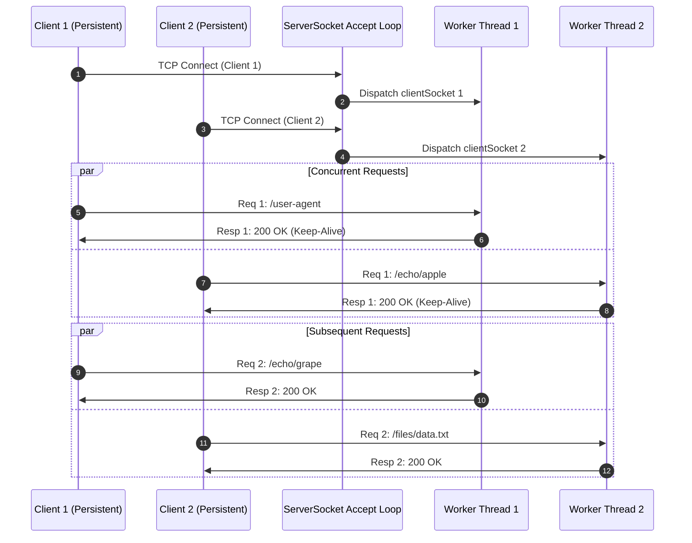
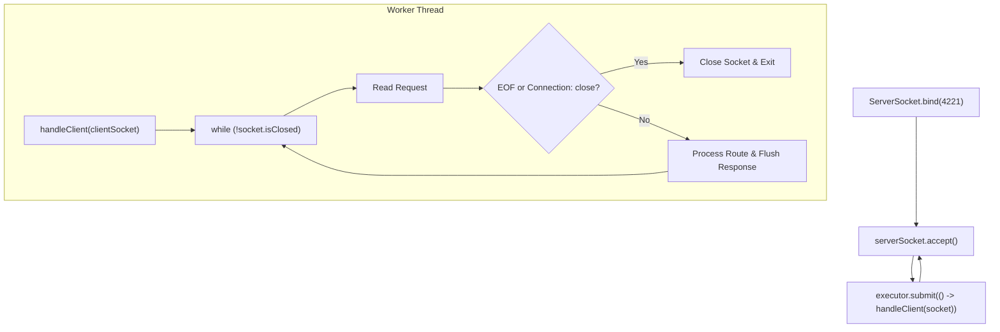

# Stage 13: Concurrent persistent connections

## In one line
Decoupling connection acceptance from persistent HTTP protocol parsing via a dynamic thread pool allows an arbitrary number of concurrent clients to independently maintain long-lived keep-alive TCP sessions without blocking one another.

## Self-test (cover the answers below and answer these first)
1. **Why does a single-threaded server hang when handling persistent connections from multiple clients?**
   - *Answer*: Because a persistent connection stays open waiting for future requests; a single-threaded server would stay blocked inside `reader.readLine()` on client 1, never returning to `accept()` client 2.
2. **How does `Executors.newCachedThreadPool()` handle variable concurrency for persistent connections?**
   - *Answer*: It dynamically creates new worker threads as connections arrive and reclaims threads that remain idle for over 60 seconds.
3. **What is head-of-line (HoL) blocking at the HTTP/1.1 connection level?**
   - *Answer*: On a single persistent HTTP/1.1 connection, requests must be answered strictly in order; a slow request on that connection delays all subsequent responses behind it.
4. **How do multiple connections alleviate HTTP/1.1 head-of-line blocking?**
   - *Answer*: By establishing separate parallel TCP connections, slow requests on connection A do not block fast requests on connection B.
5. **What state must be maintained independently per connection?**
   - *Answer*: Socket handles, input/output stream buffers, negotiated compression preferences, and keep-alive lifecycle state.

---

## The problem it solved
If a server only supports sequential persistent connections, the first client to connect monopolizes the single listener loop. Subsequent clients cannot even complete TCP handshakes or must wait indefinitely until the first client disconnects. This stage combines thread pool concurrency with persistent keep-alive loops so multiple clients can stream requests concurrently.

---

## Thought Process & Architectural Model

### Concurrency + Persistence Topology
- **Listener Thread**: Runs in an infinite loop doing `serverSocket.accept()`. It does no protocol parsing.
- **Worker Threads**: Each accepted `Socket` is handed off to an executor task (`executor.submit(() -> handleClient(clientSocket))`).
- **Connection Isolation**: Each worker maintains its own `BufferedReader`, `OutputStream`, header map, and keep-alive loop. If Client A idles, Client B's requests are executed immediately on an independent core.

### Sequence Diagram


### Flowchart


---

## Full Solution

```java
import java.io.BufferedReader;
import java.io.ByteArrayOutputStream;
import java.io.IOException;
import java.io.InputStreamReader;
import java.io.OutputStream;
import java.net.ServerSocket;
import java.net.Socket;
import java.nio.charset.StandardCharsets;
import java.nio.file.Files;
import java.nio.file.Path;
import java.nio.file.Paths;
import java.util.Map;
import java.util.TreeMap;
import java.util.concurrent.ExecutorService;
import java.util.concurrent.Executors;
import java.util.zip.GZIPOutputStream;

public class Main {
  private static String directory = null;

  public static void main(String[] args) {
    for (int i = 0; i < args.length; i++) {
      if (args[i].equals("--directory") && i + 1 < args.length) {
        directory = args[i + 1];
      }
    }

    ExecutorService executor = Executors.newCachedThreadPool();
    try (ServerSocket serverSocket = new ServerSocket(4221)) {
      serverSocket.setReuseAddress(true);
      while (true) {
        Socket clientSocket = serverSocket.accept();
        executor.submit(() -> handleClient(clientSocket));
      }
    } catch (IOException e) {
      System.err.println("IOException: " + e.getMessage());
    } finally {
      executor.shutdown();
    }
  }

  private static void handleClient(Socket clientSocket) {
    try (clientSocket;
         BufferedReader reader = new BufferedReader(new InputStreamReader(clientSocket.getInputStream(), StandardCharsets.UTF_8));
         OutputStream out = clientSocket.getOutputStream()) {
      
      while (true) {
        String requestLine;
        while ((requestLine = reader.readLine()) != null && requestLine.isEmpty()) {
          // Skip leading CRLF between persistent requests
        }
        if (requestLine == null) {
          break;
        }

        String[] parts = requestLine.split(" ");
        if (parts.length < 2) {
          break;
        }

        String method = parts[0];
        String path = parts[1];

        Map<String, String> headers = new TreeMap<>(String.CASE_INSENSITIVE_ORDER);
        String headerLine;
        while ((headerLine = reader.readLine()) != null && !headerLine.isEmpty()) {
          int colonIdx = headerLine.indexOf(':');
          if (colonIdx != -1) {
            String name = headerLine.substring(0, colonIdx).trim();
            String val = headerLine.substring(colonIdx + 1).trim();
            headers.put(name, val);
          }
        }

        int contentLength = 0;
        if (headers.containsKey("Content-Length")) {
          try {
            contentLength = Integer.parseInt(headers.get("Content-Length"));
          } catch (NumberFormatException ignored) {}
        }

        char[] bodyChars = new char[contentLength];
        int totalRead = 0;
        while (totalRead < contentLength) {
          int read = reader.read(bodyChars, totalRead, contentLength - totalRead);
          if (read == -1) break;
          totalRead += read;
        }
        String requestBody = new String(bodyChars, 0, totalRead);

        if (method.equalsIgnoreCase("POST") && path.startsWith("/files/")) {
          String filename = path.substring(7);
          if (directory != null) {
            Path filePath = Paths.get(directory, filename);
            if (filePath.getParent() != null) {
              Files.createDirectories(filePath.getParent());
            }
            Files.write(filePath, requestBody.getBytes(StandardCharsets.UTF_8));
            out.write("HTTP/1.1 201 Created\r\n\r\n".getBytes(StandardCharsets.UTF_8));
          } else {
            out.write("HTTP/1.1 404 Not Found\r\n\r\n".getBytes(StandardCharsets.UTF_8));
          }
        } else if (path.equals("/")) {
          String response = "HTTP/1.1 200 OK\r\n\r\n";
          out.write(response.getBytes(StandardCharsets.UTF_8));
        } else if (path.startsWith("/echo/")) {
          String echoStr = path.substring(6);

          boolean supportsGzip = false;
          String acceptEncoding = headers.get("Accept-Encoding");
          if (acceptEncoding != null) {
            String[] encodings = acceptEncoding.split(",");
            for (String enc : encodings) {
              if (enc.trim().equalsIgnoreCase("gzip")) {
                supportsGzip = true;
                break;
              }
            }
          }

          if (supportsGzip) {
            byte[] compressed = gzipCompress(echoStr.getBytes(StandardCharsets.UTF_8));
            String responseHeader = "HTTP/1.1 200 OK\r\n"
                + "Content-Type: text/plain\r\n"
                + "Content-Encoding: gzip\r\n"
                + "Content-Length: " + compressed.length + "\r\n\r\n";
            out.write(responseHeader.getBytes(StandardCharsets.UTF_8));
            out.write(compressed);
          } else {
            byte[] bodyBytes = echoStr.getBytes(StandardCharsets.UTF_8);
            String response = "HTTP/1.1 200 OK\r\n"
                + "Content-Type: text/plain\r\n"
                + "Content-Length: " + bodyBytes.length + "\r\n\r\n"
                + echoStr;
            out.write(response.getBytes(StandardCharsets.UTF_8));
          }
        } else if (path.equals("/user-agent")) {
          String userAgent = headers.getOrDefault("User-Agent", "");
          byte[] bodyBytes = userAgent.getBytes(StandardCharsets.UTF_8);
          String response = "HTTP/1.1 200 OK\r\n"
              + "Content-Type: text/plain\r\n"
              + "Content-Length: " + bodyBytes.length + "\r\n\r\n"
              + userAgent;
          out.write(response.getBytes(StandardCharsets.UTF_8));
        } else if (path.startsWith("/files/")) {
          String filename = path.substring(7);
          if (directory != null) {
            Path filePath = Paths.get(directory, filename);
            if (Files.exists(filePath) && Files.isRegularFile(filePath)) {
              byte[] fileBytes = Files.readAllBytes(filePath);
              String responseHeader = "HTTP/1.1 200 OK\r\n"
                  + "Content-Type: application/octet-stream\r\n"
                  + "Content-Length: " + fileBytes.length + "\r\n\r\n";
              out.write(responseHeader.getBytes(StandardCharsets.UTF_8));
              out.write(fileBytes);
            } else {
              out.write("HTTP/1.1 404 Not Found\r\n\r\n".getBytes(StandardCharsets.UTF_8));
            }
          } else {
            out.write("HTTP/1.1 404 Not Found\r\n\r\n".getBytes(StandardCharsets.UTF_8));
          }
        } else {
          String response = "HTTP/1.1 404 Not Found\r\n\r\n";
          out.write(response.getBytes(StandardCharsets.UTF_8));
        }

        out.flush();

        String connectionHeader = headers.get("Connection");
        if ("close".equalsIgnoreCase(connectionHeader)) {
          break;
        }
      }
    } catch (IOException e) {
      // Connection closed or client disconnected
    }
  }

  private static byte[] gzipCompress(byte[] data) throws IOException {
    ByteArrayOutputStream baos = new ByteArrayOutputStream();
    try (GZIPOutputStream gzipOut = new GZIPOutputStream(baos)) {
      gzipOut.write(data);
    }
    return baos.toByteArray();
  }
}
```

---

## Concepts (the transferable part)
- **Thread-per-Connection vs Event-Driven Architecture**:
  - Thread-per-connection uses synchronous I/O with one thread per client socket. Simpler mental model, ideal for moderate concurrency (hundreds to thousands of connections).
  - Event-driven (NIO / Netty / epoll) registers sockets with a selector, waking an event loop thread only when data is ready to read or write. Ideal for tens of thousands of idle connections (C10K problem).
- **Socket Resource Leaks**: If client sockets are not closed upon client disconnect or timeout, file descriptors accumulate, eventually hitting `java.io.IOException: Too many open files`.

---

## Wire Format / Protocol

```text
Connection 1:
> GET /user-agent HTTP/1.1\r\n
> User-Agent: orange/mango-grape\r\n\r\n
< HTTP/1.1 200 OK\r\nContent-Type: text/plain\r\nContent-Length: 18\r\n\r\norange/mango-grape
[Connection 1 remains open]
> GET /echo/apple HTTP/1.1\r\n\r\n
< HTTP/1.1 200 OK\r\nContent-Type: text/plain\r\nContent-Length: 5\r\n\r\napple

Connection 2 (Interleaved / Concurrent):
> GET /echo/banana HTTP/1.1\r\n\r\n
< HTTP/1.1 200 OK\r\nContent-Type: text/plain\r\nContent-Length: 6\r\n\r\nbanana
```

---

## What breaks it (failure modes)
- **Shared State Mutation without Synchronization**: If mutable per-request state (like `Map<String, String> headers`) was declared `static`, concurrent requests on different threads would corrupt each other's headers. Declaring state local to `handleClient` guarantees thread safety.
- **Fixed-Size Thread Pool Saturation**: A `newFixedThreadPool(1)` or `(2)` locks up completely if all worker threads are waiting on idle keep-alive connections. `newCachedThreadPool()` spawns additional threads on demand.

---

## Tradeoffs
- **Cached Thread Pool vs Virtual Threads**:
  - `Executors.newCachedThreadPool()` creates operating system platform threads (1MB stack per thread).
  - In Java 21+, `Executors.newVirtualThreadPerTaskExecutor()` replaces OS threads with lightweight user-mode virtual threads, allowing millions of concurrent persistent connections with minimal memory footprint.

---

## Java Specifics
- `Executors.newCachedThreadPool()`: Core pool size 0, max integer pool size, 60-second keep-alive time with `SynchronousQueue`.
- Local variable scoping: Allocating parser data structures inside the method stack ensures complete thread-safety across concurrent workers.

---

## Rebuild Checklist
- [ ] Ensure `ServerSocket.accept()` loop continuously submits tasks to `executor`.
- [ ] Run the persistent request loop independently inside each worker task.
- [ ] Keep all request and header parsing data structures thread-local.
- [ ] Test multiple concurrent clients using parallel `curl` or testing suites.
