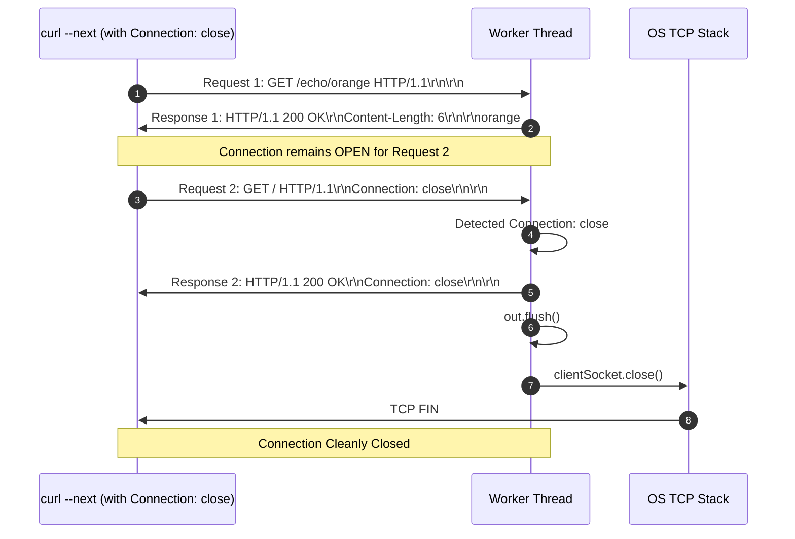
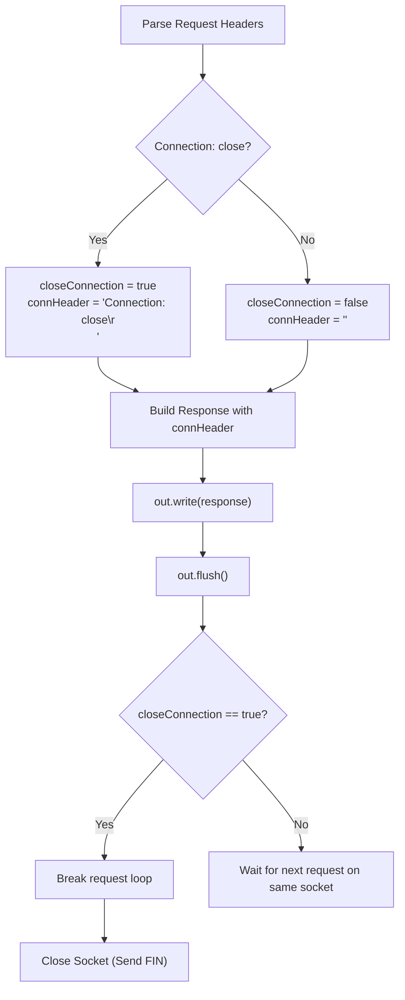

# Stage 14: Connection closure

## In one line
Graceful connection teardown in HTTP/1.1 occurs when either peer transmits `Connection: close`, obligating the server to mirror `Connection: close` in its response header block and close the underlying TCP socket immediately after flushing all response bytes.

## Self-test (cover the answers below and answer these first)
1. **What header does a client send to indicate it intends to terminate a persistent connection?**
   - *Answer*: `Connection: close`.
2. **What header must the server include in its response when honoring a `Connection: close` request?**
   - *Answer*: `Connection: close\r\n`.
3. **When should the server close the TCP socket?**
   - *Answer*: After completely transmitting and flushing the response status line, headers, and body bytes.
4. **Why is `out.flush()` critical before closing the socket?**
   - *Answer*: Buffered socket output in memory must be flushed to the network interface before closing; closing prematurely can send a TCP RST packet and discard pending data.
5. **Does `Connection: close` require an HTTP error status?**
   - *Answer*: No. Any valid HTTP response (such as `200 OK`, `201 Created`, or `404 Not Found`) can carry `Connection: close`.

---

## The problem it solved
While persistent connections improve throughput, long-lived idle connections consume operating system file descriptors and thread memory. Both clients and servers need a standardized mechanism to negotiate clean connection termination. When a client sends `Connection: close`, the server must acknowledge the closure by appending `Connection: close` to the response headers and shutting down the socket.

---

## Thought Process & Architectural Model

### Graceful Teardown Flow
1. Parse incoming request headers into case-insensitive map.
2. Check `closeConnection = "close".equalsIgnoreCase(headers.get("Connection"))`.
3. If `closeConnection` is true:
   - Prepare connection header string: `connHeader = "Connection: close\r\n"`.
4. If `closeConnection` is false:
   - `connHeader = ""`.
5. Attach `connHeader` into the serialized HTTP response header block.
6. Write response headers and body to `out`.
7. Call `out.flush()` to ensure the client receives all octets.
8. If `closeConnection` is true, break out of the request-processing loop.
9. Leaving `try-with-resources` triggers `clientSocket.close()`, transmitting a clean TCP FIN packet to the client.

### Sequence Diagram


### Flowchart


---

## Full Solution

```java
import java.io.BufferedReader;
import java.io.ByteArrayOutputStream;
import java.io.IOException;
import java.io.InputStreamReader;
import java.io.OutputStream;
import java.net.ServerSocket;
import java.net.Socket;
import java.nio.charset.StandardCharsets;
import java.nio.file.Files;
import java.nio.file.Path;
import java.nio.file.Paths;
import java.util.Map;
import java.util.TreeMap;
import java.util.concurrent.ExecutorService;
import java.util.concurrent.Executors;
import java.util.zip.GZIPOutputStream;

public class Main {
  private static String directory = null;

  public static void main(String[] args) {
    for (int i = 0; i < args.length; i++) {
      if (args[i].equals("--directory") && i + 1 < args.length) {
        directory = args[i + 1];
      }
    }

    ExecutorService executor = Executors.newCachedThreadPool();
    try (ServerSocket serverSocket = new ServerSocket(4221)) {
      serverSocket.setReuseAddress(true);
      while (true) {
        Socket clientSocket = serverSocket.accept();
        executor.submit(() -> handleClient(clientSocket));
      }
    } catch (IOException e) {
      System.err.println("IOException: " + e.getMessage());
    } finally {
      executor.shutdown();
    }
  }

  private static void handleClient(Socket clientSocket) {
    try (clientSocket;
         BufferedReader reader = new BufferedReader(new InputStreamReader(clientSocket.getInputStream(), StandardCharsets.UTF_8));
         OutputStream out = clientSocket.getOutputStream()) {
      
      while (true) {
        String requestLine;
        while ((requestLine = reader.readLine()) != null && requestLine.isEmpty()) {
          // Skip leading CRLF between persistent requests
        }
        if (requestLine == null) {
          break;
        }

        String[] parts = requestLine.split(" ");
        if (parts.length < 2) {
          break;
        }

        String method = parts[0];
        String path = parts[1];

        Map<String, String> headers = new TreeMap<>(String.CASE_Insensitive_ORDER);
        String headerLine;
        while ((headerLine = reader.readLine()) != null && !headerLine.isEmpty()) {
          int colonIdx = headerLine.indexOf(':');
          if (colonIdx != -1) {
            String name = headerLine.substring(0, colonIdx).trim();
            String val = headerLine.substring(colonIdx + 1).trim();
            headers.put(name, val);
          }
        }

        boolean closeConnection = "close".equalsIgnoreCase(headers.get("Connection"));
        String connHeader = closeConnection ? "Connection: close\r\n" : "";

        int contentLength = 0;
        if (headers.containsKey("Content-Length")) {
          try {
            contentLength = Integer.parseInt(headers.get("Content-Length"));
          } catch (NumberFormatException ignored) {}
        }

        char[] bodyChars = new char[contentLength];
        int totalRead = 0;
        while (totalRead < contentLength) {
          int read = reader.read(bodyChars, totalRead, contentLength - totalRead);
          if (read == -1) break;
          totalRead += read;
        }
        String requestBody = new String(bodyChars, 0, totalRead);

        if (method.equalsIgnoreCase("POST") && path.startsWith("/files/")) {
          String filename = path.substring(7);
          if (directory != null) {
            Path filePath = Paths.get(directory, filename);
            if (filePath.getParent() != null) {
              Files.createDirectories(filePath.getParent());
            }
            Files.write(filePath, requestBody.getBytes(StandardCharsets.UTF_8));
            String response = "HTTP/1.1 201 Created\r\n" + connHeader + "\r\n";
            out.write(response.getBytes(StandardCharsets.UTF_8));
          } else {
            String response = "HTTP/1.1 404 Not Found\r\n" + connHeader + "\r\n";
            out.write(response.getBytes(StandardCharsets.UTF_8));
          }
        } else if (path.equals("/")) {
          String response = "HTTP/1.1 200 OK\r\n" + connHeader + "\r\n";
          out.write(response.getBytes(StandardCharsets.UTF_8));
        } else if (path.startsWith("/echo/")) {
          String echoStr = path.substring(6);

          boolean supportsGzip = false;
          String acceptEncoding = headers.get("Accept-Encoding");
          if (acceptEncoding != null) {
            String[] encodings = acceptEncoding.split(",");
            for (String enc : encodings) {
              if (enc.trim().equalsIgnoreCase("gzip")) {
                supportsGzip = true;
                break;
              }
            }
          }

          if (supportsGzip) {
            byte[] compressed = gzipCompress(echoStr.getBytes(StandardCharsets.UTF_8));
            String responseHeader = "HTTP/1.1 200 OK\r\n"
                + "Content-Type: text/plain\r\n"
                + "Content-Encoding: gzip\r\n"
                + connHeader
                + "Content-Length: " + compressed.length + "\r\n\r\n";
            out.write(responseHeader.getBytes(StandardCharsets.UTF_8));
            out.write(compressed);
          } else {
            byte[] bodyBytes = echoStr.getBytes(StandardCharsets.UTF_8);
            String response = "HTTP/1.1 200 OK\r\n"
                + "Content-Type: text/plain\r\n"
                + connHeader
                + "Content-Length: " + bodyBytes.length + "\r\n\r\n"
                + echoStr;
            out.write(response.getBytes(StandardCharsets.UTF_8));
          }
        } else if (path.equals("/user-agent")) {
          String userAgent = headers.getOrDefault("User-Agent", "");
          byte[] bodyBytes = userAgent.getBytes(StandardCharsets.UTF_8);
          String response = "HTTP/1.1 200 OK\r\n"
              + "Content-Type: text/plain\r\n"
              + connHeader
              + "Content-Length: " + bodyBytes.length + "\r\n\r\n"
              + userAgent;
          out.write(response.getBytes(StandardCharsets.UTF_8));
        } else if (path.startsWith("/files/")) {
          String filename = path.substring(7);
          if (directory != null) {
            Path filePath = Paths.get(directory, filename);
            if (Files.exists(filePath) && Files.isRegularFile(filePath)) {
              byte[] fileBytes = Files.readAllBytes(filePath);
              String responseHeader = "HTTP/1.1 200 OK\r\n"
                  + "Content-Type: application/octet-stream\r\n"
                  + connHeader
                  + "Content-Length: " + fileBytes.length + "\r\n\r\n";
              out.write(responseHeader.getBytes(StandardCharsets.UTF_8));
              out.write(fileBytes);
            } else {
              String response = "HTTP/1.1 404 Not Found\r\n" + connHeader + "\r\n";
              out.write(response.getBytes(StandardCharsets.UTF_8));
            }
          } else {
            String response = "HTTP/1.1 404 Not Found\r\n" + connHeader + "\r\n";
            out.write(response.getBytes(StandardCharsets.UTF_8));
          }
        } else {
          String response = "HTTP/1.1 404 Not Found\r\n" + connHeader + "\r\n";
          out.write(response.getBytes(StandardCharsets.UTF_8));
        }

        out.flush();

        if (closeConnection) {
          break;
        }
      }
    } catch (IOException e) {
      // Connection closed or client disconnected
    }
  }

  private static byte[] gzipCompress(byte[] data) throws IOException {
    ByteArrayOutputStream baos = new ByteArrayOutputStream();
    try (GZIPOutputStream gzipOut = new GZIPOutputStream(baos)) {
      gzipOut.write(data);
    }
    return baos.toByteArray();
  }
}
```

---

## Concepts (the transferable part)
- **Graceful Shutdown vs Abrupt RST**: Graceful teardown requires completing the current transaction and sending a TCP FIN handshake (`clientSocket.close()`).
- **Header Synchronization**: RFC 9112 stipulates that when a server decides to close a connection, it MUST send `Connection: close` in the response header so the client does not reuse the socket.
- **Connection Header Scope**: The `Connection` header is a hop-by-hop header, meaning it governs only the immediate connection between the current sender and recipient.

---

## Wire Format / Protocol

```text
Request 1:
GET /echo/orange HTTP/1.1\r\n
Host: localhost:4221\r\n
\r\n

Response 1:
HTTP/1.1 200 OK\r\n
Content-Type: text/plain\r\n
Content-Length: 6\r\n
\r\n
orange

[Socket remains open]

Request 2:
GET / HTTP/1.1\r\n
Host: localhost:4221\r\n
Connection: close\r\n
\r\n

Response 2:
HTTP/1.1 200 OK\r\n
Connection: close\r\n
\r\n

[Socket closed by server]
```

---

## What breaks it (failure modes)
- **Closing Before Flushing**: Omitting `out.flush()` before `break` can cause the operating system to send a FIN packet before buffered data bytes are acknowledged, causing the client to encounter connection drop errors.
- **Forgetting the Response Header**: Exiting the loop without sending `Connection: close` leaves the client anticipating further requests on the connection.
- **Case-Sensitive Header Matching**: Comparing `headers.get("Connection").equals("close")` fails if the client sends `Connection: Close` or `Connection: CLOSE`.

---

## Tradeoffs
- **Explicit Closure vs Inactivity Timeouts**: Explicit `Connection: close` allows immediate reclamation of resources without waiting for idle socket timeouts.

---

## Java Specifics
- `try-with-resources` on `Socket`: Automatically invokes `Socket.close()`, which flushes native TCP buffers and initiates the TCP 4-way FIN handshake.

---

## Rebuild Checklist
- [ ] Inspect headers for `Connection` header value.
- [ ] Set `closeConnection = "close".equalsIgnoreCase(connectionHeader)`.
- [ ] Include `Connection: close\r\n` in the response headers when `closeConnection` is true.
- [ ] Call `out.flush()`.
- [ ] Break out of the persistent loop when `closeConnection` is true.
- [ ] Ensure socket closes cleanly on loop exit.
