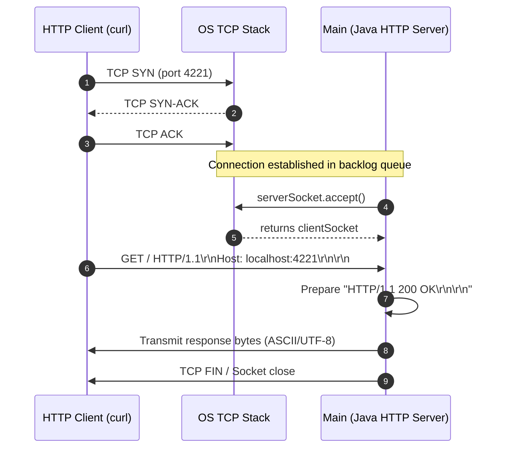
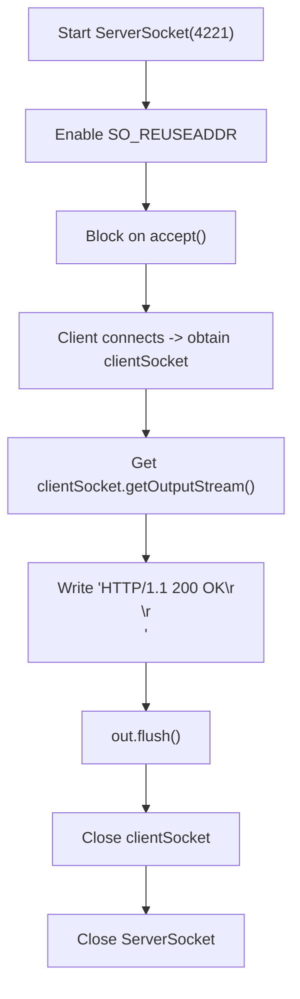

# Stage 2: Respond with 200

## In one line
An HTTP/1.1 response at its absolute minimum consists of a status line terminating with CRLF followed by an empty header section terminating with a second CRLF: `HTTP/1.1 200 OK\r\n\r\n`.

## Self-test (cover the answers below and answer these first)
1. **What are the mandatory components of every HTTP/1.1 response?**
   - *Answer*: The status line (`HTTP-Version SP Status-Code SP Reason-Phrase CRLF`) followed by headers (which can be 0 headers) ending with an empty line delimiter (`CRLF`).
2. **Why does `HTTP/1.1 200 OK\r\n` alone fail to be a valid HTTP response?**
   - *Answer*: The client HTTP parser will wait indefinitely for the header section to end. An extra `\r\n` is required to signal the end of the header block.
3. **What is the exact ASCII byte sequence for CRLF?**
   - *Answer*: Carriage Return (`0x0D` / `\r`) followed by Line Feed (`0x0A` / `\n`).
4. **Why is `out.flush()` essential before closing or waiting on a TCP socket?**
   - *Answer*: Application buffers (or stream buffers) might hold bytes in user space; flushing forces buffered bytes into the kernel socket buffer for TCP segment transmission.
5. **Does an HTTP response with no body require a `Content-Length: 0` header in HTTP/1.1 if the connection is closed?**
   - *Answer*: No. If the connection closes immediately after the response, the client recognizes EOF as the end of the response body.

---

## The problem it solved
Up to this stage, the TCP server only accepted connections and terminated without sending application bytes. Browsers and HTTP clients like `curl` connecting to port 4221 expect a syntactically valid HTTP message back. This stage establishes the minimal viable HTTP response by transmitting `HTTP/1.1 200 OK\r\n\r\n` across the connected client socket.

---

## Thought Process & Architectural Model

An HTTP transaction flows over an established TCP transport connection:
1. TCP 3-way handshake completes (`SYN` -> `SYN-ACK` -> `ACK`).
2. `serverSocket.accept()` unblocks and returns a client `Socket`.
3. The client sends an HTTP request (e.g. `GET / HTTP/1.1\r\nHost: localhost:4221\r\n\r\n`).
4. The server writes bytes to `socket.getOutputStream()` matching RFC 9112 specification.
5. Sockets are flushed and closed.

### Sequence Diagram


### Execution Flowchart


---

## Full Solution

```java
import java.io.IOException;
import java.io.OutputStream;
import java.net.ServerSocket;
import java.net.Socket;
import java.nio.charset.StandardCharsets;

public class Main {
  public static void main(String[] args) {
    try (ServerSocket serverSocket = new ServerSocket(4221)) {
      serverSocket.setReuseAddress(true);
      try (Socket clientSocket = serverSocket.accept()) {
        OutputStream out = clientSocket.getOutputStream();
        String response = "HTTP/1.1 200 OK\r\n\r\n";
        out.write(response.getBytes(StandardCharsets.UTF_8));
        out.flush();
      }
    } catch (IOException e) {
      System.err.println("IOException: " + e.getMessage());
    }
  }
}
```

---

## Concepts (the transferable part)
- **HTTP Message Framing**: HTTP/1.1 is a text-based, newline-delimited protocol up to the message body.
- **Status Line**: Consists of three tokens separated by single SP (space `0x20`): HTTP version (`HTTP/1.1`), 3-digit status code (`200`), and human-readable reason phrase (`OK`), followed by `\r\n`.
- **Header Section Boundary**: The transition from headers to body is marked by an empty line consisting solely of `\r\n`. Without this second CRLF, HTTP clients block waiting for further headers.
- **TCP Byte Stream**: Sockets do not have concept of messages or lines; they are raw byte streams. Strings must be explicitly encoded to byte arrays using standard character encoding (`StandardCharsets.UTF_8` / US-ASCII).

---

## Wire Format / Protocol

The raw byte sequence sent over TCP is 19 bytes:

```text
H  T  T  P  /  1  .  1     2  0  0     O  K \r \n \r \n
48 54 54 50 2F 31 2E 31 20 32 30 30 20 4F 4B 0D 0A 0D 0A
```

| Field | Content | Byte representation |
| :--- | :--- | :--- |
| Version | `HTTP/1.1` | `48 54 54 50 2f 31 2e 31` |
| Delimiter | ` ` (SP) | `20` |
| Status Code | `200` | `32 30 30` |
| Delimiter | ` ` (SP) | `20` |
| Reason Phrase | `OK` | `4f 4b` |
| End of Line | `\r\n` (CRLF) | `0d 0a` |
| End of Headers | `\r\n` (CRLF) | `0d 0a` |

---

## What breaks it (failure modes)
- **Single CRLF (`\r\n`)**: If only one `\r\n` is sent, `curl` or a browser hangs until read timeout because it assumes more headers may arrive.
- **Unix LF (`\n`) instead of CRLF (`\r\n`)**: Strict HTTP parsers reject responses or stall if lines are delimited by only `\n` without `\r`.
- **Platform Default Charset**: Using `response.getBytes()` without specifying UTF-8 or US-ASCII can result in encoding corruption on non-standard operating systems or localized environments.
- **Buffer Retention without Flush**: Writing to buffered streams without flushing can delay packet transmission until JVM shutdown.

---

## Tradeoffs
- **Single Connection vs. Connection Loop**: Handling a single connection satisfies the test contract cleanly without requiring thread pools or event loops before concurrent handling is introduced in later stages.
- **Hardcoded Byte Array vs. Dynamic Builder**: A static string byte array minimizes CPU overhead and allocations for invariant responses.

---

## Java Specifics
- `Socket.getOutputStream()`: Returns the output byte stream connected to the remote peer.
- `StandardCharsets.UTF_8`: Ensures cross-platform canonical byte encoding without throwing checked `UnsupportedEncodingException`.
- `try-with-resources`: Automatically closes `Socket` and `ServerSocket`, which triggers TCP connection teardown (`FIN`).

---

## Rebuild Checklist
- [ ] Initialize `ServerSocket(4221)` with address reuse enabled.
- [ ] Accept client socket via `serverSocket.accept()`.
- [ ] Format status line with HTTP/1.1 version, 200 code, OK phrase, and double CRLF.
- [ ] Encode string to bytes explicitly using UTF-8 / US-ASCII.
- [ ] Write bytes to output stream and flush.
- [ ] Ensure sockets are safely closed inside try-with-resources blocks.
