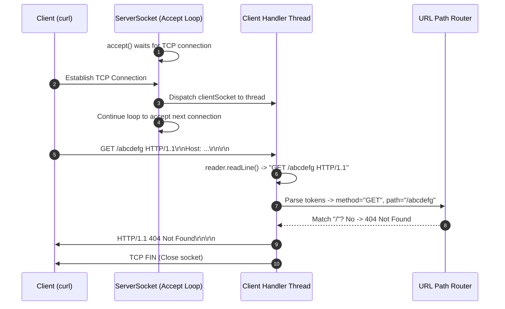
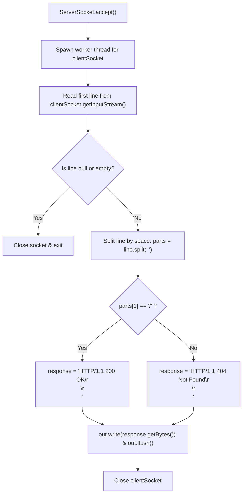

# Stage 3: Extract URL path

## In one line
An HTTP request begins with a request line containing the method, request target (URL path in origin-form), and protocol version separated by single spaces: `GET /path HTTP/1.1\r\n`.

## Self-test (cover the answers below and answer these first)
1. **What are the three tokens in an HTTP/1.1 request line?**
   - *Answer*: HTTP Method (e.g. `GET`), Request-URI / Target (e.g. `/index.html`), and HTTP Version (e.g. `HTTP/1.1`).
2. **What character separates the tokens in the request line, and what terminates the line?**
   - *Answer*: Tokens are separated by a single space character (`SP` / `0x20`), and the line terminates with Carriage Return and Line Feed (`\r\n` / CRLF).
3. **What is the difference between origin-form and absolute-form request targets?**
   - *Answer*: Origin-form (`/path`) contains only the absolute path and query string, used when communicating directly with an origin server. Absolute-form (`http://example.com/path`) includes the scheme and host, typically used with forward proxies.
4. **Why must the server run an accept loop instead of terminating after one connection?**
   - *Answer*: Real servers must service multiple requests across successive or concurrent TCP connections without shutting down after the first client finishes.
5. **What HTTP status code is expected when the requested resource does not exist on the server?**
   - *Answer*: `404 Not Found`.

---

## The problem it solved
Previous stages either did not parse inbound bytes or returned an invariant `200 OK` regardless of what path the client requested. Real web servers route traffic based on the URL target. In this stage, the server reads the initial request line, extracts the requested path, checks if it equals `/`, and differentiates responses between `200 OK` for the root path and `404 Not Found` for nonexistent paths.

---

## Thought Process & Architectural Model

### Architecture
1. The server enters an infinite connection accept loop (`while (true)`).
2. For each incoming connection, `serverSocket.accept()` yields a new `Socket`.
3. To avoid blocking the accept loop on slow network I/O, client handling runs in a dedicated thread.
4. The client's input stream is read up to the first CRLF delimiter to obtain the request line.
5. The request line is tokenized by space:
   - `parts[0]` = Method (`GET`)
   - `parts[1]` = Target (`/` or `/abcdefg`)
   - `parts[2]` = Protocol (`HTTP/1.1`)
6. Path routing evaluates `parts[1]`:
   - `/` $\rightarrow$ `HTTP/1.1 200 OK\r\n\r\n`
   - otherwise $\rightarrow$ `HTTP/1.1 404 Not Found\r\n\r\n`
7. Response bytes are dispatched to `clientSocket.getOutputStream()` and flushed before closing.

### Sequence Diagram


### Flowchart


---

## Full Solution

```java
import java.io.BufferedReader;
import java.io.IOException;
import java.io.InputStreamReader;
import java.io.OutputStream;
import java.net.ServerSocket;
import java.net.Socket;
import java.nio.charset.StandardCharsets;

public class Main {
  public static void main(String[] args) {
    try (ServerSocket serverSocket = new ServerSocket(4221)) {
      serverSocket.setReuseAddress(true);
      while (true) {
        Socket clientSocket = serverSocket.accept();
        new Thread(() -> handleClient(clientSocket)).start();
      }
    } catch (IOException e) {
      System.err.println("IOException: " + e.getMessage());
    }
  }

  private static void handleClient(Socket clientSocket) {
    try (clientSocket;
         BufferedReader reader = new BufferedReader(new InputStreamReader(clientSocket.getInputStream(), StandardCharsets.UTF_8));
         OutputStream out = clientSocket.getOutputStream()) {
      
      String requestLine = reader.readLine();
      if (requestLine == null || requestLine.isEmpty()) {
        return;
      }

      String[] parts = requestLine.split(" ");
      if (parts.length < 2) {
        return;
      }

      String path = parts[1];
      String response;
      if (path.equals("/")) {
        response = "HTTP/1.1 200 OK\r\n\r\n";
      } else {
        response = "HTTP/1.1 404 Not Found\r\n\r\n";
      }

      out.write(response.getBytes(StandardCharsets.UTF_8));
      out.flush();
    } catch (IOException e) {
      System.err.println("Client handling error: " + e.getMessage());
    }
  }
}
```

---

## Concepts (the transferable part)
- **Request Line Anatomy**: RFC 9112 §3 specifies `method SP request-target SP HTTP-version CRLF`.
- **Origin-Form URL Path**: The path part of the URI identifying the resource on this origin server. Begins with a forward slash (`/`).
- **Status Code Categorization**:
  - `2xx (Success)`: Request was received, understood, and accepted (`200 OK`).
  - `4xx (Client Error)`: The client requested an invalid or nonexistent resource (`404 Not Found`).
- **Connection Multiplexing via Threads**: An accept loop on the main thread delegates socket read/write cycles to worker threads, preventing head-of-line blocking at the TCP connection boundary.

---

## Wire Format / Protocol

### Inbound Request Example
```text
GET /abcdefg HTTP/1.1\r\n
Host: localhost:4221\r\n
User-Agent: curl/7.64.1\r\n
Accept: */*\r\n
\r\n
```

### Outbound Response (404 Not Found)
```text
HTTP/1.1 404 Not Found\r\n\r\n
```

| Component | Raw ASCII | Bytes |
| :--- | :--- | :--- |
| Status Line | `HTTP/1.1 404 Not Found\r\n` | `48 54 54 50 2F 31 2E 31 20 34 30 34 20 4E 6F 74 20 46 6F 75 6E 64 0D 0A` |
| End of Headers | `\r\n` | `0D 0A` |

---

## What breaks it (failure modes)
- **Early Socket Disconnect**: If a client opens a connection and closes it before transmitting bytes, `reader.readLine()` returns `null`. Splitting a null string throws `NullPointerException` if unvalidated.
- **Malformed Request Lines**: If a client sends an empty line or fewer than 2 tokens, checking `parts[1]` without verifying `parts.length >= 2` triggers `ArrayIndexOutOfBoundsException`.
- **Query Strings and Anchors**: If a client requests `/?query=val` or `/path#section`, naive string matching against `/` fails unless stripped or handled.
- **Blocking the Accept Loop**: Handling requests serially on the main thread causes subsequent connections to queue in the OS backlog or timeout if an earlier client is slow.

---

## Tradeoffs
- **`BufferedReader.readLine()` vs. Raw Byte Scanning**:
  - `BufferedReader` handles line endings (`\r\n` or `\n`) and UTF-8 decoding simply.
  - Raw byte buffers avoid extra memory copying and allow exact binary body length tracking without char conversion overhead.
- **Thread-per-Connection vs. Virtual Threads / Event Loop**:
  - Thread-per-connection is clear and standard in Java for basic connection volumes.
  - Non-blocking I/O (`java.nio.channels.Selector`) scales to tens of thousands of concurrent idle connections with minimal memory footprint.

---

## Java Specifics
- `BufferedReader.readLine()`: Strips trailing `\r`, `\n`, or `\r\n` and returns the line content as a `String`.
- `String.split(" ")`: Divides the string around space delimiters.
- `try (clientSocket; reader; out)`: Multi-resource try-with-resources syntax available since Java 9.

---

## Rebuild Checklist
- [ ] Implement an infinite `while (true)` loop around `serverSocket.accept()`.
- [ ] Offload incoming client socket to a separate thread.
- [ ] Wrap socket input stream in `InputStreamReader` and `BufferedReader`.
- [ ] Safely read the first line and guard against `null` or insufficient tokens.
- [ ] Extract `path = parts[1]`.
- [ ] Route `/` to `200 OK` and all other paths to `404 Not Found`.
- [ ] Flush output stream and close resources safely.
