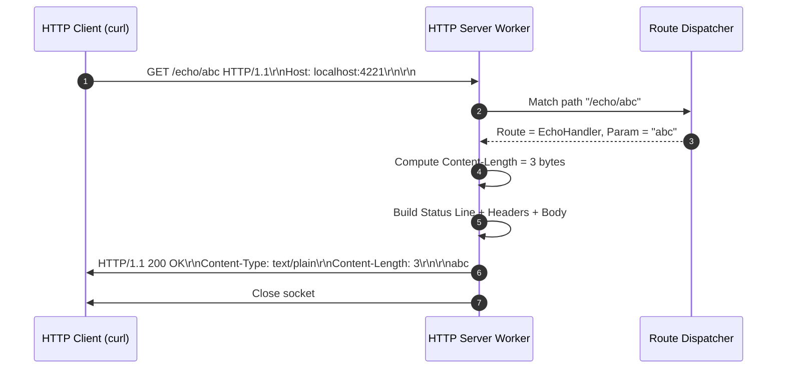
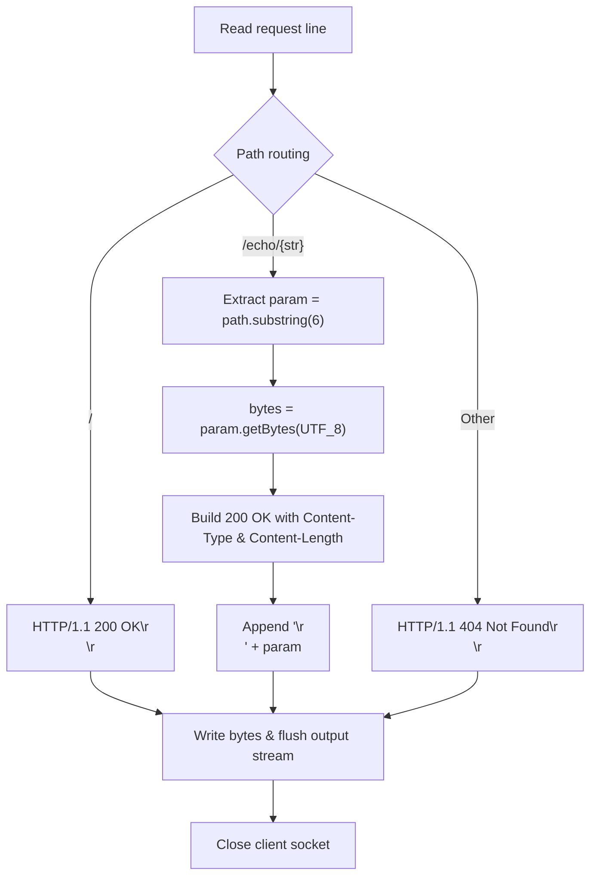

# Stage 4: Respond with body

## In one line
Returning an HTTP response body requires transmitting metadata headers (`Content-Type` for MIME framing and `Content-Length` for exact byte framing) followed by the empty line delimiter `\r\n` and raw payload bytes.

## Self-test (cover the answers below and answer these first)
1. **Why must `Content-Length` represent the number of bytes rather than the number of characters?**
   - *Answer*: Multi-byte UTF-8 characters (like emojis or non-ASCII characters) occupy more than one byte. HTTP framing operates strictly on octets/bytes over the TCP stream.
2. **What happens if `Content-Length` is smaller than the actual body bytes transmitted?**
   - *Answer*: The client will read only `Content-Length` bytes as the body and treat remaining trailing bytes as pipelined requests or protocol errors.
3. **What happens if `Content-Length` is larger than the actual body bytes sent?**
   - *Answer*: The client blocks waiting for the remaining bytes until socket read timeout or connection termination.
4. **What header informs the client how to interpret the payload bytes (e.g. text vs json vs html)?**
   - *Answer*: `Content-Type` (e.g. `text/plain`, `application/json`, `text/html`).
5. **How does the client distinguish between the header section and the beginning of the body?**
   - *Answer*: The empty line marked by `\r\n` following the headers.

---

## The problem it solved
Previous stages returned only status headers without payload bodies. Most web server interactions require returning payloads—text, JSON, images, or HTML. This stage introduces dynamic path routing on `/echo/{str}`, extracting `{str}` from the URL, generating appropriate metadata headers (`Content-Type: text/plain` and `Content-Length: N`), and streaming the body bytes back to the client.

---

## Thought Process & Architectural Model

### Dynamic Endpoint Handling
When a client issues `GET /echo/abc HTTP/1.1`:
1. Request line is read: `path` is `/echo/abc`.
2. Prefix match detects `/echo/`.
3. Substring extracts parameter: `path.substring(6)` yields `abc`.
4. Payload byte length is calculated: `abc.getBytes(StandardCharsets.UTF_8).length` = 3.
5. Response headers are constructed:
   ```text
   HTTP/1.1 200 OK\r\n
   Content-Type: text/plain\r\n
   Content-Length: 3\r\n
   \r\n
   abc
   ```
6. The full message is written to the client's output stream and flushed.

### Sequence Diagram


### Flowchart


---

## Full Solution

```java
import java.io.BufferedReader;
import java.io.IOException;
import java.io.InputStreamReader;
import java.io.OutputStream;
import java.net.ServerSocket;
import java.net.Socket;
import java.nio.charset.StandardCharsets;

public class Main {
  public static void main(String[] args) {
    try (ServerSocket serverSocket = new ServerSocket(4221)) {
      serverSocket.setReuseAddress(true);
      while (true) {
        Socket clientSocket = serverSocket.accept();
        new Thread(() -> handleClient(clientSocket)).start();
      }
    } catch (IOException e) {
      System.err.println("IOException: " + e.getMessage());
    }
  }

  private static void handleClient(Socket clientSocket) {
    try (clientSocket;
         BufferedReader reader = new BufferedReader(new InputStreamReader(clientSocket.getInputStream(), StandardCharsets.UTF_8));
         OutputStream out = clientSocket.getOutputStream()) {
      
      String requestLine = reader.readLine();
      if (requestLine == null || requestLine.isEmpty()) {
        return;
      }

      String[] parts = requestLine.split(" ");
      if (parts.length < 2) {
        return;
      }

      String path = parts[1];
      if (path.equals("/")) {
        String response = "HTTP/1.1 200 OK\r\n\r\n";
        out.write(response.getBytes(StandardCharsets.UTF_8));
      } else if (path.startsWith("/echo/")) {
        String echoStr = path.substring(6);
        byte[] bodyBytes = echoStr.getBytes(StandardCharsets.UTF_8);
        String response = "HTTP/1.1 200 OK\r\n"
            + "Content-Type: text/plain\r\n"
            + "Content-Length: " + bodyBytes.length + "\r\n\r\n"
            + echoStr;
        out.write(response.getBytes(StandardCharsets.UTF_8));
      } else {
        String response = "HTTP/1.1 404 Not Found\r\n\r\n";
        out.write(response.getBytes(StandardCharsets.UTF_8));
      }

      out.flush();
    } catch (IOException e) {
      System.err.println("Client handling error: " + e.getMessage());
    }
  }
}
```

---

## Concepts (the transferable part)
- **Framing & Demarcation**: Because TCP has no inherent message boundaries, HTTP uses headers (`Content-Length` or `Transfer-Encoding: chunked`) to inform receiver exactly where the body ends.
- **MIME Types (`Content-Type`)**: Informs the client software how to deserialize or display the payload bytes (`text/plain; charset=utf-8`).
- **Octet Length vs String Length**: In Java, `str.length()` returns number of UTF-16 code units. `str.getBytes(StandardCharsets.UTF_8).length` returns actual number of bytes transmitted on the wire.

---

## Wire Format / Protocol

```text
HTTP/1.1 200 OK\r\n
Content-Type: text/plain\r\n
Content-Length: 3\r\n
\r\n
abc
```

| Component | Format | Example |
| :--- | :--- | :--- |
| Status Line | `HTTP-Version SP Status-Code SP Reason CRLF` | `HTTP/1.1 200 OK\r\n` |
| Header 1 | `Field-Name: SP Field-Value CRLF` | `Content-Type: text/plain\r\n` |
| Header 2 | `Field-Name: SP Field-Value CRLF` | `Content-Length: 3\r\n` |
| Header Terminator | `CRLF` | `\r\n` |
| Message Body | Raw Bytes | `abc` |

---

## What breaks it (failure modes)
- **String length instead of Byte length**: If string contains multi-byte characters (e.g. `café` or `🚀`), `str.length()` is less than `bytes.length`, truncating the payload.
- **Missing second CRLF**: Omitting `\r\n` between headers and body causes the client to parse the body as part of the header block.
- **Empty echo string**: Calling `path.substring(6)` on `/echo/` returns empty string `""` with `Content-Length: 0`, which is valid, but calling on `/echo` without trailing slash throws `StringIndexOutOfBoundsException`.

---

## Tradeoffs
- **Immediate Response vs Buffered Streaming**: For small payloads, assembling the full message string in memory is fast and simple. For large files or streams, writing directly to `OutputStream` in chunks avoids heap exhaustion.
- **Hardcoded Headers vs Map-based Header Collection**: Direct string concatenation avoids object allocations for static header pairs in micro-benchmarks.

---

## Java Specifics
- `String.substring(int beginIndex)`: Extracts sub-sequence from index to end of string.
- `String.getBytes(Charset charset)`: Encodes string characters into byte array using specified charset.
- `String.startsWith(String prefix)`: Efficient prefix match.

---

## Rebuild Checklist
- [ ] Parse request target from request line.
- [ ] Match `/echo/` prefix and extract substring argument.
- [ ] Convert payload to UTF-8 bytes and obtain `.length`.
- [ ] Include `Content-Type: text/plain\r\n`.
- [ ] Include `Content-Length: <len>\r\n`.
- [ ] Terminate header section with `\r\n`.
- [ ] Append body content, write to output stream, and flush.
