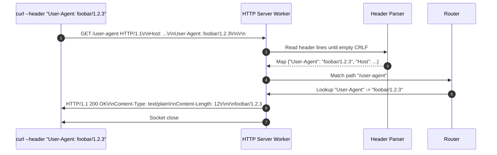
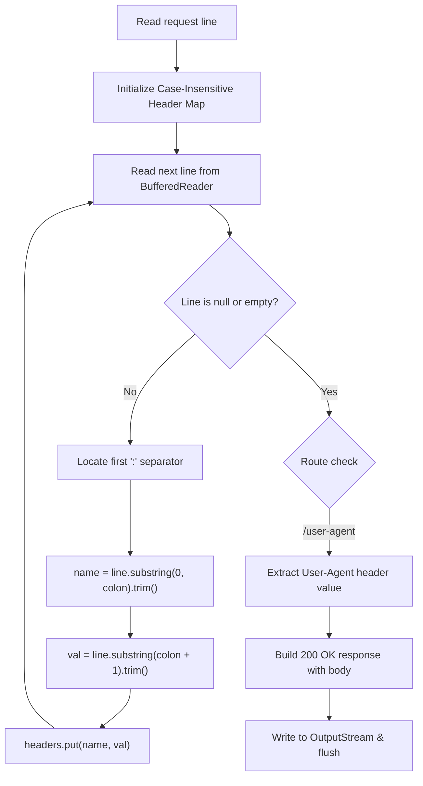

# Stage 5: Read header

## In one line
HTTP request headers are colon-delimited, case-insensitive key-value pairs (`Field-Name: OWS Field-Value OWS CRLF`) terminating with an empty CRLF line before the message body.

## Self-test (cover the answers below and answer these first)
1. **Are HTTP header field names case-sensitive according to RFC 9110 / 9112?**
   - *Answer*: No. Field names are case-insensitive (`User-Agent`, `user-agent`, and `USER-AGENT` refer to the same header).
2. **How does the parser know that all headers have been received?**
   - *Answer*: An empty line consisting solely of CRLF (`\r\n`) marks the end of the header section.
3. **What is OWS in the HTTP grammar (`Field-Name ":" OWS Field-Value OWS CRLF`)?**
   - *Answer*: Optional White Space (spaces or horizontal tabs) surrounding field values, which should be trimmed by the receiver.
4. **Why is `TreeMap<String, String>(String.CASE_INSENSITIVE_ORDER)` effective for HTTP headers?**
   - *Answer*: It provides case-insensitive lookup out of the box without requiring manual lowercase normalization on every lookup key.
5. **What is the purpose of the `User-Agent` request header?**
   - *Answer*: It identifies the client software, library, operating system, or application originating the HTTP request (e.g., `curl/7.64.1`, `Mozilla/5.0`).

---

## The problem it solved
Prior stages ignored all request headers following the request line. HTTP communication relies extensively on headers for content negotiation, authentication, cache control, compression, and client telemetry. This stage introduces header parsing into the HTTP server and implements the `/user-agent` endpoint to extract and echo the client's `User-Agent` header value in the response body.

---

## Thought Process & Architectural Model

### Header Parsing Pipeline
1. After reading the request line, the server enters a loop reading successive lines until `line.isEmpty()`.
2. Each line is split on the first colon (`:`):
   - Left side: Header name (`User-Agent`).
   - Right side: Header value, trimmed of leading/trailing whitespace (`foobar/1.2.3`).
3. Store in a case-insensitive map (`TreeMap` with `String.CASE_INSENSITIVE_ORDER`).
4. In route `/user-agent`:
   - Retrieve `headers.getOrDefault("User-Agent", "")`.
   - Calculate payload byte length via UTF-8 encoding.
   - Format response with `Content-Type: text/plain` and `Content-Length: <len>`.
   - Transmit response.

### Sequence Diagram


### Flowchart


---

## Full Solution

```java
import java.io.BufferedReader;
import java.io.IOException;
import java.io.InputStreamReader;
import java.io.OutputStream;
import java.net.ServerSocket;
import java.net.Socket;
import java.nio.charset.StandardCharsets;
import java.util.Map;
import java.util.TreeMap;

public class Main {
  public static void main(String[] args) {
    try (ServerSocket serverSocket = new ServerSocket(4221)) {
      serverSocket.setReuseAddress(true);
      while (true) {
        Socket clientSocket = serverSocket.accept();
        new Thread(() -> handleClient(clientSocket)).start();
      }
    } catch (IOException e) {
      System.err.println("IOException: " + e.getMessage());
    }
  }

  private static void handleClient(Socket clientSocket) {
    try (clientSocket;
         BufferedReader reader = new BufferedReader(new InputStreamReader(clientSocket.getInputStream(), StandardCharsets.UTF_8));
         OutputStream out = clientSocket.getOutputStream()) {
      
      String requestLine = reader.readLine();
      if (requestLine == null || requestLine.isEmpty()) {
        return;
      }

      String[] parts = requestLine.split(" ");
      if (parts.length < 2) {
        return;
      }

      String path = parts[1];

      Map<String, String> headers = new TreeMap<>(String.CASE_INSENSITIVE_ORDER);
      String headerLine;
      while ((headerLine = reader.readLine()) != null && !headerLine.isEmpty()) {
        int colonIdx = headerLine.indexOf(':');
        if (colonIdx != -1) {
          String name = headerLine.substring(0, colonIdx).trim();
          String val = headerLine.substring(colonIdx + 1).trim();
          headers.put(name, val);
        }
      }

      if (path.equals("/")) {
        String response = "HTTP/1.1 200 OK\r\n\r\n";
        out.write(response.getBytes(StandardCharsets.UTF_8));
      } else if (path.startsWith("/echo/")) {
        String echoStr = path.substring(6);
        byte[] bodyBytes = echoStr.getBytes(StandardCharsets.UTF_8);
        String response = "HTTP/1.1 200 OK\r\n"
            + "Content-Type: text/plain\r\n"
            + "Content-Length: " + bodyBytes.length + "\r\n\r\n"
            + echoStr;
        out.write(response.getBytes(StandardCharsets.UTF_8));
      } else if (path.equals("/user-agent")) {
        String userAgent = headers.getOrDefault("User-Agent", "");
        byte[] bodyBytes = userAgent.getBytes(StandardCharsets.UTF_8);
        String response = "HTTP/1.1 200 OK\r\n"
            + "Content-Type: text/plain\r\n"
            + "Content-Length: " + bodyBytes.length + "\r\n\r\n"
            + userAgent;
        out.write(response.getBytes(StandardCharsets.UTF_8));
      } else {
        String response = "HTTP/1.1 404 Not Found\r\n\r\n";
        out.write(response.getBytes(StandardCharsets.UTF_8));
      }

      out.flush();
    } catch (IOException e) {
      System.err.println("Client handling error: " + e.getMessage());
    }
  }
}
```

---

## Concepts (the transferable part)
- **Header Line Delimitation**: Headers are separated from each other by CRLF (`\r\n`).
- **Colon Separator with Optional Whitespace**: RFC 9110 specifies no space between field name and colon, with optional whitespace (OWS) before and after the field value: `field-name ":" OWS field-value OWS`.
- **Case-Insensitivity**: Protocols specify field names as US-ASCII case-insensitive.
- **Header Termination**: An empty line (`""` from `readLine()`) indicates the boundary between headers and optional body.

---

## Wire Format / Protocol

```text
GET /user-agent HTTP/1.1\r\n
Host: localhost:4221\r\n
User-Agent: foobar/1.2.3\r\n
Accept: */*\r\n
\r\n
```

```text
HTTP/1.1 200 OK\r\n
Content-Type: text/plain\r\n
Content-Length: 12\r\n
\r\n
foobar/1.2.3
```

---

## What breaks it (failure modes)
- **Multiple Colons in Header Value**: Splitting with `line.split(":")` breaks headers containing colons (like `Host: localhost:4221` or URLs). Using `indexOf(':')` and `substring()` properly preserves values containing colons.
- **Case Sensitivity Bug**: Looking up `headers.get("User-Agent")` in a standard `HashMap` returns `null` if the client sends `user-agent:` or `USER-AGENT:`.
- **Hanging on Missing CRLF**: Failing to check for empty line before exiting the header read loop causes the server to block waiting for client input indefinitely.

---

## Tradeoffs
- **`TreeMap(String.CASE_INSENSITIVE_ORDER)` vs Normalization to Lowercase**:
  - `TreeMap` preserves original header casing while allowing case-insensitive lookups.
  - Lowercasing keys in a `HashMap` is $O(1)$ instead of $O(\log N)$ but mutates the original casing.

---

## Java Specifics
- `String.indexOf(':')`: Locates the first occurrence of character in string.
- `String.substring(int begin, int end)`: Extracts slice without regex overhead.
- `java.lang.String.CASE_INSENSITIVE_ORDER`: Comparator comparing strings lexicographically ignoring case.

---

## Rebuild Checklist
- [ ] Read header lines in a loop until line is empty or null.
- [ ] Partition each header line on the first colon into key and value.
- [ ] Strip surrounding whitespace with `.trim()`.
- [ ] Use case-insensitive map for header lookups.
- [ ] Extract `User-Agent` and compute payload byte count.
- [ ] Transmit `200 OK` response with `Content-Type: text/plain` and payload.
