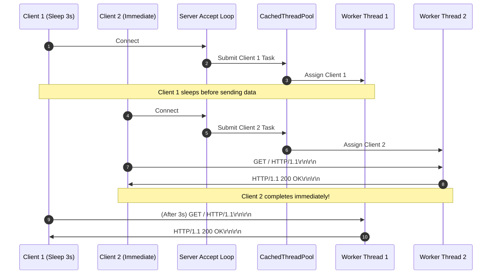
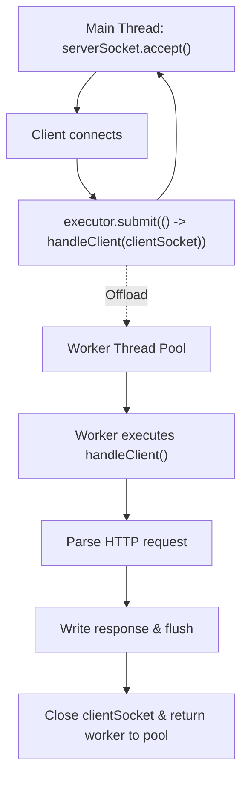

# Stage 6: Concurrent connections

## In one line
Decoupling the TCP accept loop from socket I/O using a thread pool allows multiple clients to connect, hold connections open, and stream HTTP transactions concurrently without head-of-line blocking.

## Self-test (cover the answers below and answer these first)
1. **What is head-of-line blocking at the server connection layer?**
   - *Answer*: When a single-threaded server blocks on reading from or writing to one client (e.g. `(sleep 3 && printf ...) | nc`), preventing any other queued connections from being accepted or processed.
2. **Why does `ExecutorService executor = Executors.newCachedThreadPool()` fit variable connection spikes?**
   - *Answer*: It reuses previously created threads if available and creates new ones dynamically as needed, terminating idle threads after a 60-second keepalive period.
3. **What is the OS TCP backlog queue?**
   - *Answer*: The operating system kernel queue holding TCP connections that have finished the 3-way handshake (`ESTABLISHED`) but have not yet been accepted by application code via `accept()`.
4. **Why should `executor.shutdown()` be called during server shutdown?**
   - *Answer*: It initiates an orderly shutdown in which previously submitted tasks are executed before worker threads exit, avoiding thread leaks.
5. **How does concurrent socket handling prevent denial of service from slow clients (Slowloris)?**
   - *Answer*: Isolating each connection to an independent thread ensures a slow client delaying byte transmission cannot prevent other clients from receiving immediate service.

---

## The problem it solved
In previous stages, client requests were handled either synchronously or through ad-hoc unmanaged threads. If a client opened a connection and delayed sending data (as simulated by `sleep 3`), a sequential server would freeze, starving all other clients. This stage introduces thread pool execution via Java's `ExecutorService`, allowing concurrent client sockets to be accepted and served in parallel.

---

## Thought Process & Architectural Model

### Architecture
1. The server initializes a reusable thread pool (`Executors.newCachedThreadPool()`).
2. The main thread runs a tight loop executing `serverSocket.accept()`.
3. As soon as a connection handshake completes, the resulting `clientSocket` is submitted to the thread pool (`executor.submit(...)`).
4. The main thread immediately resumes waiting for the next connection on `accept()`.
5. Each worker thread handles reading the request line, headers, and streaming responses independently.

### Sequence Diagram


### Flowchart


---

## Full Solution

```java
import java.io.BufferedReader;
import java.io.IOException;
import java.io.InputStreamReader;
import java.io.OutputStream;
import java.net.ServerSocket;
import java.net.Socket;
import java.nio.charset.StandardCharsets;
import java.util.Map;
import java.util.TreeMap;
import java.util.concurrent.ExecutorService;
import java.util.concurrent.Executors;

public class Main {
  public static void main(String[] args) {
    ExecutorService executor = Executors.newCachedThreadPool();
    try (ServerSocket serverSocket = new ServerSocket(4221)) {
      serverSocket.setReuseAddress(true);
      while (true) {
        Socket clientSocket = serverSocket.accept();
        executor.submit(() -> handleClient(clientSocket));
      }
    } catch (IOException e) {
      System.err.println("IOException: " + e.getMessage());
    } finally {
      executor.shutdown();
    }
  }

  private static void handleClient(Socket clientSocket) {
    try (clientSocket;
         BufferedReader reader = new BufferedReader(new InputStreamReader(clientSocket.getInputStream(), StandardCharsets.UTF_8));
         OutputStream out = clientSocket.getOutputStream()) {
      
      String requestLine = reader.readLine();
      if (requestLine == null || requestLine.isEmpty()) {
        return;
      }

      String[] parts = requestLine.split(" ");
      if (parts.length < 2) {
        return;
      }

      String path = parts[1];

      Map<String, String> headers = new TreeMap<>(String.CASE_INSENSITIVE_ORDER);
      String headerLine;
      while ((headerLine = reader.readLine()) != null && !headerLine.isEmpty()) {
        int colonIdx = headerLine.indexOf(':');
        if (colonIdx != -1) {
          String name = headerLine.substring(0, colonIdx).trim();
          String val = headerLine.substring(colonIdx + 1).trim();
          headers.put(name, val);
        }
      }

      if (path.equals("/")) {
        String response = "HTTP/1.1 200 OK\r\n\r\n";
        out.write(response.getBytes(StandardCharsets.UTF_8));
      } else if (path.startsWith("/echo/")) {
        String echoStr = path.substring(6);
        byte[] bodyBytes = echoStr.getBytes(StandardCharsets.UTF_8);
        String response = "HTTP/1.1 200 OK\r\n"
            + "Content-Type: text/plain\r\n"
            + "Content-Length: " + bodyBytes.length + "\r\n\r\n"
            + echoStr;
        out.write(response.getBytes(StandardCharsets.UTF_8));
      } else if (path.equals("/user-agent")) {
        String userAgent = headers.getOrDefault("User-Agent", "");
        byte[] bodyBytes = userAgent.getBytes(StandardCharsets.UTF_8);
        String response = "HTTP/1.1 200 OK\r\n"
            + "Content-Type: text/plain\r\n"
            + "Content-Length: " + bodyBytes.length + "\r\n\r\n"
            + userAgent;
        out.write(response.getBytes(StandardCharsets.UTF_8));
      } else {
        String response = "HTTP/1.1 404 Not Found\r\n\r\n";
        out.write(response.getBytes(StandardCharsets.UTF_8));
      }

      out.flush();
    } catch (IOException e) {
      System.err.println("Client handling error: " + e.getMessage());
    }
  }
}
```

---

## Concepts (the transferable part)
- **Concurrency Models**:
  - **Thread-per-connection**: Traditional model mapping each connection to a thread. Easy to reason about with synchronous blocking I/O.
  - **Virtual Threads (Project Loom)**: Lightweight JVM-managed threads allowing millions of concurrent tasks with blocking I/O syntax.
  - **Event-Driven Non-blocking I/O (Reactor/Proactor)**: Single or few threads managing thousands of sockets via OS notifications (`epoll`/`kqueue`/`IOCP`).
- **Resource Management**: Unbounded thread creation (`new Thread(...)` on every connection) risks OutOfMemoryError under load. Managed thread pools provide lifecycle governance.

---

## Wire Format / Protocol
Identical to Stage 2 wire format:
```text
HTTP/1.1 200 OK\r\n\r\n
```

---

## What breaks it (failure modes)
- **Thread Exhaustion (OOM)**: Spawning unmanaged native OS threads can exceed OS memory limits or process thread limits under heavy concurrent load.
- **Shared State Race Conditions**: If requests modify shared state without synchronization or concurrent collections, race conditions and data corruption occur. Sockets and handlers in this design are strictly isolated.
- **Unhandled Exceptions inside Tasks**: Exceptions thrown inside `executor.submit()` are swallowed by the `Future` unless caught inside the runnable. Wrapping the task body in `try/catch` ensures errors are logged.

---

## Tradeoffs
- **`Executors.newCachedThreadPool()` vs `Executors.newFixedThreadPool(N)`**:
  - Cached thread pool scales elastically to handle dynamic bursts of short-lived requests.
  - Fixed thread pool prevents thread runaway by capping maximum concurrent threads, queuing excess requests.
- **Virtual Threads (`Executors.newVirtualThreadPerTaskExecutor()`)**:
  - Eliminates thread allocation overhead and memory footprint while retaining clean synchronous code.

---

## Java Specifics
- `java.util.concurrent.ExecutorService`: High-level interface managing asynchronous execution.
- `Executors.newCachedThreadPool()`: Thread pool that creates threads on demand and reclaims idle threads after 60 seconds.
- `executor.submit(Runnable)`: Submits task for execution on a pool thread.

---

## Rebuild Checklist
- [ ] Create an `ExecutorService` instance before entering the server loop.
- [ ] Keep the accept loop on the main thread minimal: `accept()` followed by task submission.
- [ ] Encapsulate all per-connection reading, parsing, writing, and cleanup inside the task.
- [ ] Catch exceptions within the task to prevent silent worker thread death.
- [ ] Guarantee thread pool shutdown in a `finally` block on server exit.
