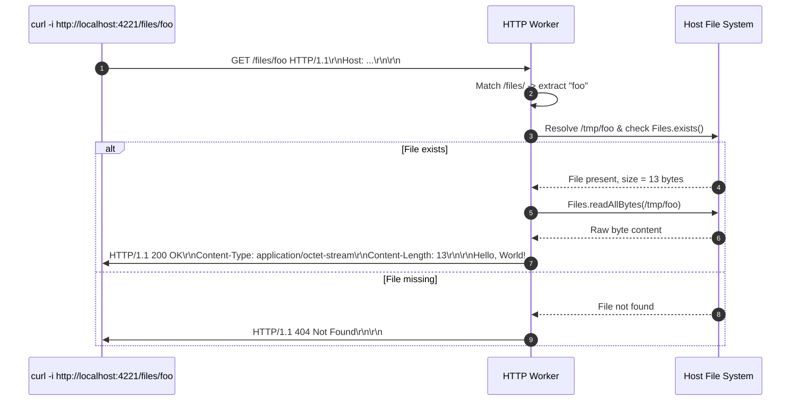
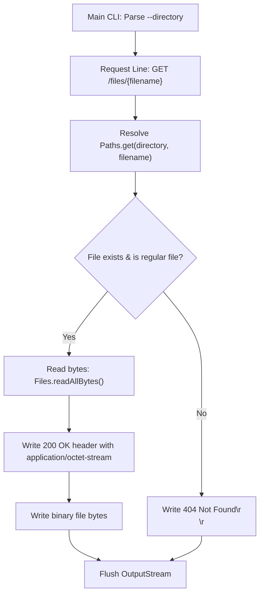

# Stage 7: Return a file

## In one line
Serving static filesystem files over HTTP requires resolving paths against a configured root directory, verifying existence and file attributes, streaming binary content, and setting `Content-Type: application/octet-stream` with exact byte `Content-Length`.

## Self-test (cover the answers below and answer these first)
1. **What is `application/octet-stream` in MIME nomenclature?**
   - *Answer*: The default binary arbitrary-byte stream media type used when the specific MIME format is unknown or when treating the content as an uninterpreted binary download.
2. **Why must `Content-Length` match the exact byte size on disk?**
   - *Answer*: Discrepancies between `Content-Length` and bytes delivered will cause client file downloads to truncate or hang waiting for missing bytes.
3. **What vulnerability occurs if `/files/../../etc/passwd` is resolved naively?**
   - *Answer*: Path Traversal (Directory Traversal), allowing clients to escape the designated root directory and access arbitrary system files.
4. **Why should `Files.isRegularFile(path)` be checked in addition to `Files.exists(path)`?**
   - *Answer*: To prevent the server from attempting to read directories, device files, or symbolic link loops as normal byte sequences.
5. **How are command-line flags like `--directory <dir>` typically parsed in Java without external CLI libraries?**
   - *Answer*: By iterating over `args[]` with an index loop, identifying matching flag tokens, and extracting the adjacent argument token `args[i + 1]`.

---

## The problem it solved
Up to this stage, responses returned static strings generated in memory. A fundamental responsibility of web servers is serving static assets (files, images, documents) from the local filesystem. This stage implements command-line configuration of a root files directory (`--directory /tmp/`) and serves binary file contents over the `/files/{filename}` endpoint, returning `200 OK` if the file exists and `404 Not Found` if it does not.

---

## Thought Process & Architectural Model

### File Serving Pipeline
1. Main entrypoint parses `--directory <dir>` from `args`.
2. When a `GET /files/{filename}` request arrives:
   - Extract filename: `path.substring(7)`.
   - Resolve target path: `Paths.get(directory, filename)`.
   - Validate existence and regular file status: `Files.exists(filePath) && Files.isRegularFile(filePath)`.
3. If file exists:
   - Read byte payload: `Files.readAllBytes(filePath)`.
   - Formulate status line and headers:
     ```text
     HTTP/1.1 200 OK\r\n
     Content-Type: application/octet-stream\r\n
     Content-Length: <fileBytes.length>\r\n
     \r\n
     ```
   - Stream header bytes, followed immediately by raw binary file bytes.
4. If file does not exist:
   - Return `HTTP/1.1 404 Not Found\r\n\r\n`.

### Sequence Diagram


### Flowchart


---

## Full Solution

```java
import java.io.BufferedReader;
import java.io.IOException;
import java.io.InputStreamReader;
import java.io.OutputStream;
import java.net.ServerSocket;
import java.net.Socket;
import java.nio.charset.StandardCharsets;
import java.nio.file.Files;
import java.nio.file.Path;
import java.nio.file.Paths;
import java.util.Map;
import java.util.TreeMap;
import java.util.concurrent.ExecutorService;
import java.util.concurrent.Executors;

public class Main {
  private static String directory = null;

  public static void main(String[] args) {
    for (int i = 0; i < args.length; i++) {
      if (args[i].equals("--directory") && i + 1 < args.length) {
        directory = args[i + 1];
      }
    }

    ExecutorService executor = Executors.newCachedThreadPool();
    try (ServerSocket serverSocket = new ServerSocket(4221)) {
      serverSocket.setReuseAddress(true);
      while (true) {
        Socket clientSocket = serverSocket.accept();
        executor.submit(() -> handleClient(clientSocket));
      }
    } catch (IOException e) {
      System.err.println("IOException: " + e.getMessage());
    } finally {
      executor.shutdown();
    }
  }

  private static void handleClient(Socket clientSocket) {
    try (clientSocket;
         BufferedReader reader = new BufferedReader(new InputStreamReader(clientSocket.getInputStream(), StandardCharsets.UTF_8));
         OutputStream out = clientSocket.getOutputStream()) {
      
      String requestLine = reader.readLine();
      if (requestLine == null || requestLine.isEmpty()) {
        return;
      }

      String[] parts = requestLine.split(" ");
      if (parts.length < 2) {
        return;
      }

      String path = parts[1];

      Map<String, String> headers = new TreeMap<>(String.CASE_INSENSITIVE_ORDER);
      String headerLine;
      while ((headerLine = reader.readLine()) != null && !headerLine.isEmpty()) {
        int colonIdx = headerLine.indexOf(':');
        if (colonIdx != -1) {
          String name = headerLine.substring(0, colonIdx).trim();
          String val = headerLine.substring(colonIdx + 1).trim();
          headers.put(name, val);
        }
      }

      if (path.equals("/")) {
        String response = "HTTP/1.1 200 OK\r\n\r\n";
        out.write(response.getBytes(StandardCharsets.UTF_8));
      } else if (path.startsWith("/echo/")) {
        String echoStr = path.substring(6);
        byte[] bodyBytes = echoStr.getBytes(StandardCharsets.UTF_8);
        String response = "HTTP/1.1 200 OK\r\n"
            + "Content-Type: text/plain\r\n"
            + "Content-Length: " + bodyBytes.length + "\r\n\r\n"
            + echoStr;
        out.write(response.getBytes(StandardCharsets.UTF_8));
      } else if (path.equals("/user-agent")) {
        String userAgent = headers.getOrDefault("User-Agent", "");
        byte[] bodyBytes = userAgent.getBytes(StandardCharsets.UTF_8);
        String response = "HTTP/1.1 200 OK\r\n"
            + "Content-Type: text/plain\r\n"
            + "Content-Length: " + bodyBytes.length + "\r\n\r\n"
            + userAgent;
        out.write(response.getBytes(StandardCharsets.UTF_8));
      } else if (path.startsWith("/files/")) {
        String filename = path.substring(7);
        if (directory != null) {
          Path filePath = Paths.get(directory, filename);
          if (Files.exists(filePath) && Files.isRegularFile(filePath)) {
            byte[] fileBytes = Files.readAllBytes(filePath);
            String responseHeader = "HTTP/1.1 200 OK\r\n"
                + "Content-Type: application/octet-stream\r\n"
                + "Content-Length: " + fileBytes.length + "\r\n\r\n";
            out.write(responseHeader.getBytes(StandardCharsets.UTF_8));
            out.write(fileBytes);
          } else {
            out.write("HTTP/1.1 404 Not Found\r\n\r\n".getBytes(StandardCharsets.UTF_8));
          }
        } else {
          out.write("HTTP/1.1 404 Not Found\r\n\r\n".getBytes(StandardCharsets.UTF_8));
        }
      } else {
        String response = "HTTP/1.1 404 Not Found\r\n\r\n";
        out.write(response.getBytes(StandardCharsets.UTF_8));
      }

      out.flush();
    } catch (IOException e) {
      System.err.println("Client handling error: " + e.getMessage());
    }
  }
}
```

---

## Concepts (the transferable part)
- **MIME Media Types**: Standardized identifiers for file formats and binary data formats. `application/octet-stream` is defined by RFC 2046 as uninterpreted 8-bit binary data.
- **Path Separation and Resolution**: `Paths.get(base, relative)` joins path fragments with the platform-native file separator (`/` on POSIX, `\` on Windows).
- **Separation of Header and Body Streams**: Text headers are encoded to ASCII/UTF-8 bytes; file bodies are already raw bytes and written directly to the socket output stream without string conversion.

---

## Wire Format / Protocol

```text
HTTP/1.1 200 OK\r\n
Content-Type: application/octet-stream\r\n
Content-Length: 13\r\n
\r\n
Hello, World!
```

| Header | Value | Purpose |
| :--- | :--- | :--- |
| `Content-Type` | `application/octet-stream` | Informs client of raw binary octets |
| `Content-Length` | `13` | Byte count of file content |

---

## What breaks it (failure modes)
- **Null or Missing Directory Flag**: Running without `--directory` leaves `directory = null`. Accessing `directory` directly without null check causes `NullPointerException`.
- **Directory as File**: If `/files/dir` points to a subdirectory, reading bytes with `Files.readAllBytes` throws `IOException` or `AccessDeniedException`.
- **Binary Data via String**: Attempting to read a binary file (e.g. image or compiled archive) into a `String` and encoding back to bytes corrupts non-UTF-8 byte sequences. Binary files must stay as raw byte arrays.

---

## Tradeoffs
- **`Files.readAllBytes` vs Streaming `InputStream.transferTo(out)`**:
  - `readAllBytes` loads entire file into heap memory. Fast and trivial for small files, but risks memory pressure on large files.
  - Streaming in chunks (`4KB` or `8KB`) or using `transferTo` keeps memory usage constant regardless of file size.

---

## Java Specifics
- `java.nio.file.Paths.get(String first, String... more)`: Constructs a `Path` object.
- `java.nio.file.Files.exists(Path path)`: Checks if file exists on disk.
- `java.nio.file.Files.isRegularFile(Path path)`: Confirms path is a file and not a directory or symlink.
- `java.nio.file.Files.readAllBytes(Path path)`: Reads all bytes from a file into a byte array.

---

## Rebuild Checklist
- [ ] Parse `--directory` command-line argument in `main()`.
- [ ] Parse `/files/{filename}` path in client handler.
- [ ] Resolve full path using `Paths.get(directory, filename)`.
- [ ] Guard with `Files.exists()` and `Files.isRegularFile()`.
- [ ] Set `Content-Type: application/octet-stream` and `Content-Length: <size>`.
- [ ] Write binary bytes directly to `OutputStream`.
- [ ] Return `404 Not Found` for missing files or missing directory configuration.
