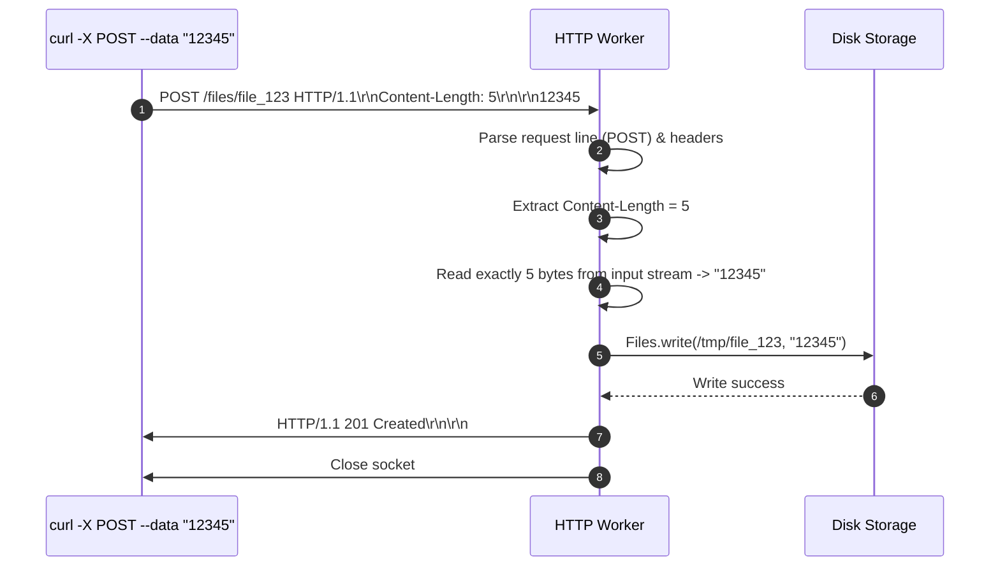
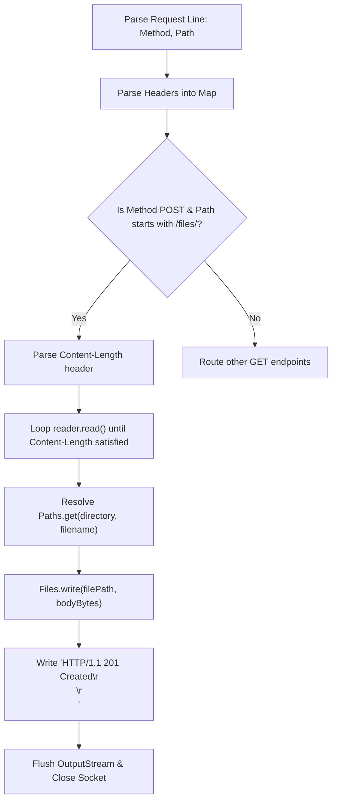

# Stage 8: Read request body

## In one line
Reading an HTTP request body requires inspecting `Content-Length` from the parsed header block, consuming exactly that many bytes from the input stream, and responding with `201 Created` upon successfully writing the payload to the filesystem.

## Self-test (cover the answers below and answer these first)
1. **How does the server know how many bytes to read for a POST request body?**
   - *Answer*: By reading and parsing the `Content-Length` header in the request headers.
2. **Why can't you just call `reader.readLine()` to read the request body?**
   - *Answer*: The request body may contain multiple lines, no trailing newline, or arbitrary binary data. `readLine()` expects line breaks and will block or read incomplete data.
3. **What status code indicates that a resource has been successfully created?**
   - *Answer*: `201 Created`.
4. **Why is `reader.read(char[], offset, remaining)` called in a loop instead of a single call?**
   - *Answer*: In TCP networking, `read()` is not guaranteed to return all requested bytes in a single call; TCP segments may arrive fragmented across multiple read cycles.
5. **What happens if `Content-Length` is missing in a non-chunked POST request?**
   - *Answer*: The server cannot determine payload boundaries, which according to RFC 9112 warrants a `411 Length Required` response.

---

## The problem it solved
Previous stages only handled `GET` requests where all parameters and targets were conveyed in the URL path and headers. Web servers must also accept data submitted by clients via `POST` requests. This stage implements body reading based on the `Content-Length` header, persists the payload to disk under `{directory}/{filename}`, and returns `HTTP/1.1 201 Created`.

---

## Thought Process & Architectural Model

### POST Body Ingestion Pipeline
1. Parse request line: `method = "POST"`, `path = "/files/{filename}"`.
2. Parse headers: extract `Content-Length` integer value.
3. Allocate buffer sized to `contentLength`.
4. Read in a loop until `totalRead == contentLength` or EOF (`-1`).
5. Resolve target file path: `Paths.get(directory, filename)`.
6. Ensure parent directories exist (`Files.createDirectories(...)`).
7. Write payload bytes directly to disk via `Files.write(...)`.
8. Send response status: `HTTP/1.1 201 Created\r\n\r\n`.

### Sequence Diagram


### Flowchart


---

## Full Solution

```java
import java.io.BufferedReader;
import java.io.IOException;
import java.io.InputStreamReader;
import java.io.OutputStream;
import java.net.ServerSocket;
import java.net.Socket;
import java.nio.charset.StandardCharsets;
import java.nio.file.Files;
import java.nio.file.Path;
import java.nio.file.Paths;
import java.util.Map;
import java.util.TreeMap;
import java.util.concurrent.ExecutorService;
import java.util.concurrent.Executors;

public class Main {
  private static String directory = null;

  public static void main(String[] args) {
    for (int i = 0; i < args.length; i++) {
      if (args[i].equals("--directory") && i + 1 < args.length) {
        directory = args[i + 1];
      }
    }

    ExecutorService executor = Executors.newCachedThreadPool();
    try (ServerSocket serverSocket = new ServerSocket(4221)) {
      serverSocket.setReuseAddress(true);
      while (true) {
        Socket clientSocket = serverSocket.accept();
        executor.submit(() -> handleClient(clientSocket));
      }
    } catch (IOException e) {
      System.err.println("IOException: " + e.getMessage());
    } finally {
      executor.shutdown();
    }
  }

  private static void handleClient(Socket clientSocket) {
    try (clientSocket;
         BufferedReader reader = new BufferedReader(new InputStreamReader(clientSocket.getInputStream(), StandardCharsets.UTF_8));
         OutputStream out = clientSocket.getOutputStream()) {
      
      String requestLine = reader.readLine();
      if (requestLine == null || requestLine.isEmpty()) {
        return;
      }

      String[] parts = requestLine.split(" ");
      if (parts.length < 2) {
        return;
      }

      String method = parts[0];
      String path = parts[1];

      Map<String, String> headers = new TreeMap<>(String.CASE_INSENSITIVE_ORDER);
      String headerLine;
      while ((headerLine = reader.readLine()) != null && !headerLine.isEmpty()) {
        int colonIdx = headerLine.indexOf(':');
        if (colonIdx != -1) {
          String name = headerLine.substring(0, colonIdx).trim();
          String val = headerLine.substring(colonIdx + 1).trim();
          headers.put(name, val);
        }
      }

      int contentLength = 0;
      if (headers.containsKey("Content-Length")) {
        try {
          contentLength = Integer.parseInt(headers.get("Content-Length"));
        } catch (NumberFormatException ignored) {}
      }

      char[] bodyChars = new char[contentLength];
      int totalRead = 0;
      while (totalRead < contentLength) {
        int read = reader.read(bodyChars, totalRead, contentLength - totalRead);
        if (read == -1) break;
        totalRead += read;
      }
      String requestBody = new String(bodyChars, 0, totalRead);

      if (method.equalsIgnoreCase("POST") && path.startsWith("/files/")) {
        String filename = path.substring(7);
        if (directory != null) {
          Path filePath = Paths.get(directory, filename);
          if (filePath.getParent() != null) {
            Files.createDirectories(filePath.getParent());
          }
          Files.write(filePath, requestBody.getBytes(StandardCharsets.UTF_8));
          out.write("HTTP/1.1 201 Created\r\n\r\n".getBytes(StandardCharsets.UTF_8));
        } else {
          out.write("HTTP/1.1 404 Not Found\r\n\r\n".getBytes(StandardCharsets.UTF_8));
        }
      } else if (path.equals("/")) {
        String response = "HTTP/1.1 200 OK\r\n\r\n";
        out.write(response.getBytes(StandardCharsets.UTF_8));
      } else if (path.startsWith("/echo/")) {
        String echoStr = path.substring(6);
        byte[] bodyBytes = echoStr.getBytes(StandardCharsets.UTF_8);
        String response = "HTTP/1.1 200 OK\r\n"
            + "Content-Type: text/plain\r\n"
            + "Content-Length: " + bodyBytes.length + "\r\n\r\n"
            + echoStr;
        out.write(response.getBytes(StandardCharsets.UTF_8));
      } else if (path.equals("/user-agent")) {
        String userAgent = headers.getOrDefault("User-Agent", "");
        byte[] bodyBytes = userAgent.getBytes(StandardCharsets.UTF_8);
        String response = "HTTP/1.1 200 OK\r\n"
            + "Content-Type: text/plain\r\n"
            + "Content-Length: " + bodyBytes.length + "\r\n\r\n"
            + userAgent;
        out.write(response.getBytes(StandardCharsets.UTF_8));
      } else if (path.startsWith("/files/")) {
        String filename = path.substring(7);
        if (directory != null) {
          Path filePath = Paths.get(directory, filename);
          if (Files.exists(filePath) && Files.isRegularFile(filePath)) {
            byte[] fileBytes = Files.readAllBytes(filePath);
            String responseHeader = "HTTP/1.1 200 OK\r\n"
                + "Content-Type: application/octet-stream\r\n"
                + "Content-Length: " + fileBytes.length + "\r\n\r\n";
            out.write(responseHeader.getBytes(StandardCharsets.UTF_8));
            out.write(fileBytes);
          } else {
            out.write("HTTP/1.1 404 Not Found\r\n\r\n".getBytes(StandardCharsets.UTF_8));
          }
        } else {
          out.write("HTTP/1.1 404 Not Found\r\n\r\n".getBytes(StandardCharsets.UTF_8));
        }
      } else {
        String response = "HTTP/1.1 404 Not Found\r\n\r\n";
        out.write(response.getBytes(StandardCharsets.UTF_8));
      }

      out.flush();
    } catch (IOException e) {
      System.err.println("Client handling error: " + e.getMessage());
    }
  }
}
```

---

## Concepts (the transferable part)
- **HTTP Methods**:
  - `GET`: Safe, idempotent retrieval of resource state.
  - `POST`: Non-idempotent submission of data to create or process a resource.
- **Request Framing via Content-Length**: Tells the recipient how many octets follow the double CRLF boundary.
- **Stream Exhaustion & Partial Reads**: Socket streams may deliver payload data in multiple packets. Code must accumulate until `totalRead == contentLength`.
- **Status 201 Created**: RFC 9110 specifies that `201 Created` indicates the request has been fulfilled and resulted in one or more new resources being created.

---

## Wire Format / Protocol

### Inbound POST Request
```text
POST /files/file_123 HTTP/1.1\r\n
Host: localhost:4221\r\n
User-Agent: curl/7.64.1\r\n
Content-Type: application/octet-stream\r\n
Content-Length: 5\r\n
\r\n
12345
```

### Outbound 201 Created Response
```text
HTTP/1.1 201 Created\r\n\r\n
```

---

## What breaks it (failure modes)
- **Single `read()` Call Assumption**: Expecting `reader.read(buf)` to fill the entire buffer in one call breaks when network packet boundaries fragment the body.
- **Reading Past Content-Length**: Continuing to read from the socket stream beyond `Content-Length` blocks waiting for subsequent requests on persistent connections.
- **Missing Parent Directories**: Writing to `Paths.get("/tmp/sub/file")` throws `NoSuchFileException` if intermediate directories are missing. `Files.createDirectories()` avoids this.

---

## Tradeoffs
- **Buffering in Memory vs Streaming directly to File**:
  - Buffering the full body into memory is straightforward for small payloads.
  - Streaming directly from `socket.getInputStream()` to `FileOutputStream` bounded by `BoundedInputStream` handles arbitrarily large uploads without heap starvation.

---

## Java Specifics
- `BufferedReader.read(char[] cbuf, int off, int len)`: Reads characters into an array slice, pulling from internal buffer first before reading the underlying stream.
- `java.nio.file.Files.write(Path path, byte[] bytes)`: Atomically opens, writes, and closes file.
- `java.nio.file.Files.createDirectories(Path dir)`: Creates parent directory tree if not present.

---

## Rebuild Checklist
- [ ] Parse HTTP method from request line.
- [ ] Inspect headers for `Content-Length`.
- [ ] Allocate buffer of length `Content-Length`.
- [ ] Read in a `while` loop until `totalRead == contentLength` or EOF.
- [ ] Route `POST /files/{filename}` to file writing routine.
- [ ] Write bytes to filesystem using `Files.write`.
- [ ] Send `HTTP/1.1 201 Created\r\n\r\n`.
