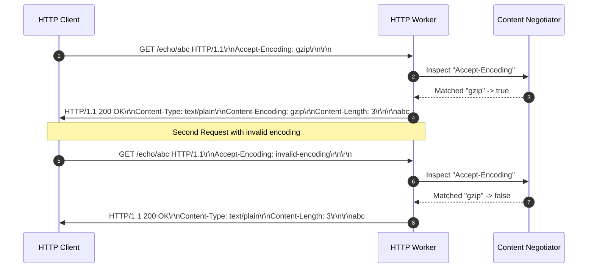
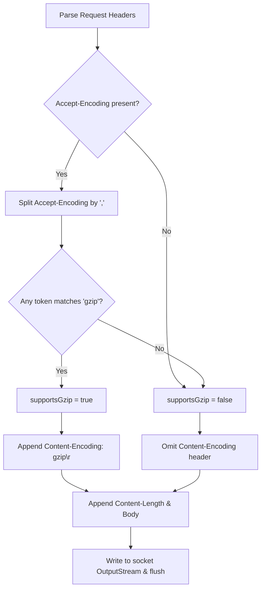

# Stage 9: Compression headers

## In one line
HTTP content negotiation uses the `Accept-Encoding` request header to discover supported compression algorithms and the `Content-Encoding` response header to announce the selected compression scheme applied to the payload.

## Self-test (cover the answers below and answer these first)
1. **What header does an HTTP client send to list compression algorithms it can decode?**
   - *Answer*: `Accept-Encoding` (e.g. `gzip`, `deflate`, `br`, `zstd`).
2. **What response header must the server return if it compresses the payload with gzip?**
   - *Answer*: `Content-Encoding: gzip`.
3. **What should the server do if none of the encodings requested in `Accept-Encoding` are supported?**
   - *Answer*: Send the response uncompressed and omit the `Content-Encoding` header (or return `406 Not Acceptable` if uncompressed representation is forbidden).
4. **How are multiple compression schemes delimited in `Accept-Encoding`?**
   - *Answer*: By commas (e.g. `gzip, deflate, br`).
5. **Does `Content-Encoding` replace `Content-Type`?**
   - *Answer*: No. `Content-Type` indicates the media format of the original uncompressed entity (e.g. `text/plain`), while `Content-Encoding` indicates the transformation applied during transmission.

---

## The problem it solved
Transmitting uncompressed HTTP bodies across bandwidth-constrained networks increases latency and data transfer costs. HTTP content negotiation allows clients and servers to agree on compression codecs. In this stage, the server parses the `Accept-Encoding` request header, detects whether `gzip` is supported, and conditionally attaches `Content-Encoding: gzip` to the response headers.

---

## Thought Process & Architectural Model

### Content Negotiation Workflow
1. Request arrives for `/echo/{str}`.
2. Read `Accept-Encoding` from header map:
   - If missing, `supportsGzip = false`.
   - If present, split on commas: `tokens = acceptEncoding.split(",")`.
   - Check if any trimmed token case-insensitively matches `"gzip"`.
3. Build response header:
   - Always include `HTTP/1.1 200 OK\r\n` and `Content-Type: text/plain\r\n`.
   - If `supportsGzip` is true, append `Content-Encoding: gzip\r\n`.
   - Append `Content-Length: <len>\r\n\r\n`.
   - Append body.
4. If `Accept-Encoding` does not contain `gzip` (e.g. `invalid-encoding`), omit `Content-Encoding`.

### Sequence Diagram


### Flowchart


---

## Full Solution

```java
import java.io.BufferedReader;
import java.io.IOException;
import java.io.InputStreamReader;
import java.io.OutputStream;
import java.net.ServerSocket;
import java.net.Socket;
import java.nio.charset.StandardCharsets;
import java.nio.file.Files;
import java.nio.file.Path;
import java.nio.file.Paths;
import java.util.Map;
import java.util.TreeMap;
import java.util.concurrent.ExecutorService;
import java.util.concurrent.Executors;

public class Main {
  private static String directory = null;

  public static void main(String[] args) {
    for (int i = 0; i < args.length; i++) {
      if (args[i].equals("--directory") && i + 1 < args.length) {
        directory = args[i + 1];
      }
    }

    ExecutorService executor = Executors.newCachedThreadPool();
    try (ServerSocket serverSocket = new ServerSocket(4221)) {
      serverSocket.setReuseAddress(true);
      while (true) {
        Socket clientSocket = serverSocket.accept();
        executor.submit(() -> handleClient(clientSocket));
      }
    } catch (IOException e) {
      System.err.println("IOException: " + e.getMessage());
    } finally {
      executor.shutdown();
    }
  }

  private static void handleClient(Socket clientSocket) {
    try (clientSocket;
         BufferedReader reader = new BufferedReader(new InputStreamReader(clientSocket.getInputStream(), StandardCharsets.UTF_8));
         OutputStream out = clientSocket.getOutputStream()) {
      
      String requestLine = reader.readLine();
      if (requestLine == null || requestLine.isEmpty()) {
        return;
      }

      String[] parts = requestLine.split(" ");
      if (parts.length < 2) {
        return;
      }

      String method = parts[0];
      String path = parts[1];

      Map<String, String> headers = new TreeMap<>(String.CASE_INSENSITIVE_ORDER);
      String headerLine;
      while ((headerLine = reader.readLine()) != null && !headerLine.isEmpty()) {
        int colonIdx = headerLine.indexOf(':');
        if (colonIdx != -1) {
          String name = headerLine.substring(0, colonIdx).trim();
          String val = headerLine.substring(colonIdx + 1).trim();
          headers.put(name, val);
        }
      }

      int contentLength = 0;
      if (headers.containsKey("Content-Length")) {
        try {
          contentLength = Integer.parseInt(headers.get("Content-Length"));
        } catch (NumberFormatException ignored) {}
      }

      char[] bodyChars = new char[contentLength];
      int totalRead = 0;
      while (totalRead < contentLength) {
        int read = reader.read(bodyChars, totalRead, contentLength - totalRead);
        if (read == -1) break;
        totalRead += read;
      }
      String requestBody = new String(bodyChars, 0, totalRead);

      if (method.equalsIgnoreCase("POST") && path.startsWith("/files/")) {
        String filename = path.substring(7);
        if (directory != null) {
          Path filePath = Paths.get(directory, filename);
          if (filePath.getParent() != null) {
            Files.createDirectories(filePath.getParent());
          }
          Files.write(filePath, requestBody.getBytes(StandardCharsets.UTF_8));
          out.write("HTTP/1.1 201 Created\r\n\r\n".getBytes(StandardCharsets.UTF_8));
        } else {
          out.write("HTTP/1.1 404 Not Found\r\n\r\n".getBytes(StandardCharsets.UTF_8));
        }
      } else if (path.equals("/")) {
        String response = "HTTP/1.1 200 OK\r\n\r\n";
        out.write(response.getBytes(StandardCharsets.UTF_8));
      } else if (path.startsWith("/echo/")) {
        String echoStr = path.substring(6);
        byte[] bodyBytes = echoStr.getBytes(StandardCharsets.UTF_8);

        boolean supportsGzip = false;
        String acceptEncoding = headers.get("Accept-Encoding");
        if (acceptEncoding != null) {
          String[] encodings = acceptEncoding.split(",");
          for (String enc : encodings) {
            if (enc.trim().equalsIgnoreCase("gzip")) {
              supportsGzip = true;
              break;
            }
          }
        }

        StringBuilder response = new StringBuilder("HTTP/1.1 200 OK\r\n");
        response.append("Content-Type: text/plain\r\n");
        if (supportsGzip) {
          response.append("Content-Encoding: gzip\r\n");
        }
        response.append("Content-Length: ").append(bodyBytes.length).append("\r\n\r\n");
        response.append(echoStr);

        out.write(response.toString().getBytes(StandardCharsets.UTF_8));
      } else if (path.equals("/user-agent")) {
        String userAgent = headers.getOrDefault("User-Agent", "");
        byte[] bodyBytes = userAgent.getBytes(StandardCharsets.UTF_8);
        String response = "HTTP/1.1 200 OK\r\n"
            + "Content-Type: text/plain\r\n"
            + "Content-Length: " + bodyBytes.length + "\r\n\r\n"
            + userAgent;
        out.write(response.getBytes(StandardCharsets.UTF_8));
      } else if (path.startsWith("/files/")) {
        String filename = path.substring(7);
        if (directory != null) {
          Path filePath = Paths.get(directory, filename);
          if (Files.exists(filePath) && Files.isRegularFile(filePath)) {
            byte[] fileBytes = Files.readAllBytes(filePath);
            String responseHeader = "HTTP/1.1 200 OK\r\n"
                + "Content-Type: application/octet-stream\r\n"
                + "Content-Length: " + fileBytes.length + "\r\n\r\n";
            out.write(responseHeader.getBytes(StandardCharsets.UTF_8));
            out.write(fileBytes);
          } else {
            out.write("HTTP/1.1 404 Not Found\r\n\r\n".getBytes(StandardCharsets.UTF_8));
          }
        } else {
          out.write("HTTP/1.1 404 Not Found\r\n\r\n".getBytes(StandardCharsets.UTF_8));
        }
      } else {
        String response = "HTTP/1.1 404 Not Found\r\n\r\n";
        out.write(response.getBytes(StandardCharsets.UTF_8));
      }

      out.flush();
    } catch (IOException e) {
      System.err.println("Client handling error: " + e.getMessage());
    }
  }
}
```

---

## Concepts (the transferable part)
- **HTTP Content Negotiation (RFC 9110 §12)**: Mechanism enabling selection of the best representation when multiple representations are available.
- **`Accept-Encoding`**: Informs the server which content encodings (usually compression algorithms) are acceptable in the response.
- **`Content-Encoding`**: Informs the client what codec was used to encode the payload so the client can decode it before presenting to the application layer.

---

## Wire Format / Protocol

### With Supported Encoding (`gzip`)
```text
GET /echo/abc HTTP/1.1\r\n
Host: localhost:4221\r\n
Accept-Encoding: gzip\r\n
\r\n
```

```text
HTTP/1.1 200 OK\r\n
Content-Type: text/plain\r\n
Content-Encoding: gzip\r\n
Content-Length: 3\r\n
\r\n
abc
```

### With Unsupported Encoding (`invalid-encoding`)
```text
GET /echo/abc HTTP/1.1\r\n
Host: localhost:4221\r\n
Accept-Encoding: invalid-encoding\r\n
\r\n
```

```text
HTTP/1.1 200 OK\r\n
Content-Type: text/plain\r\n
Content-Length: 3\r\n
\r\n
abc
```

---

## What breaks it (failure modes)
- **Substring Match False Positives**: Using `acceptEncoding.contains("gzip")` falsely matches `gzip-not-supported` or `notgzip`. Splitting into individual comma-delimited tokens avoids this.
- **Case Inconsistency**: Matching `"gzip"` with `.equals("gzip")` without ignoring case fails if a client sends `GZIP` or `Gzip`.
- **Null Reference on Missing Header**: Forgetting to check `if (acceptEncoding != null)` before splitting throws `NullPointerException` on plain requests.

---

## Tradeoffs
- **Negotiating vs Forcing**: Honoring client `Accept-Encoding` ensures older or embedded clients incapable of decompression still receive understandable plaintext responses.

---

## Java Specifics
- `String.split(",")`: Splits multiple comma-delimited header directives into individual encoding tokens.
- `String.trim()`: Removes leading and trailing whitespace from each parsed token.
- `String.equalsIgnoreCase("gzip")`: Case-insensitive token match.

---

## Rebuild Checklist
- [ ] Read `Accept-Encoding` header from parsed request headers.
- [ ] Split on commas and check tokens for `gzip` (case-insensitively).
- [ ] Conditionally append `Content-Encoding: gzip\r\n` to response headers when matched.
- [ ] Omit `Content-Encoding` when `gzip` is absent or unrequested.
- [ ] Verify both positive (`gzip`) and negative (`invalid-encoding`) client tests pass.
