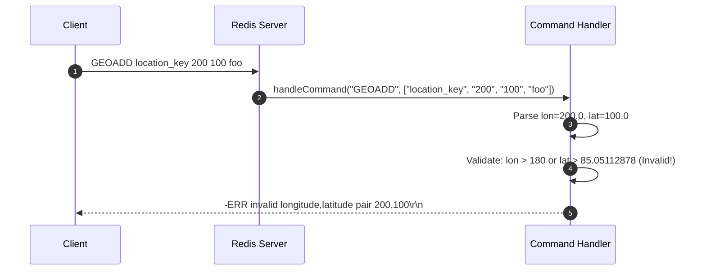
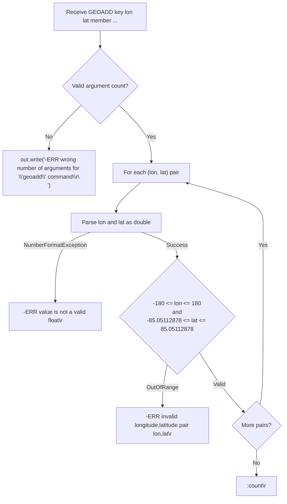

# Stage 100: Validate coordinates

---

## In one line
Validate longitude ($-180^\circ \dots +180^\circ$) and Web Mercator latitude ($-85.05112878^\circ \dots +85.05112878^\circ$) boundaries in `GEOADD`, returning `-ERR invalid longitude,latitude pair <lon>,<lat>\r\n` upon out-of-range inputs.

---

## Self-test (cover the answers below and answer these first)
1. **What is the valid range of longitude values in Redis `GEOADD`?**
   - *Answer*: $[-180.0^\circ, +180.0^\circ]$ inclusive.
2. **What is the valid range of latitude values in Redis `GEOADD` and why is it not $\pm 90^\circ$?**
   - *Answer*: $[-85.05112878^\circ, +85.05112878^\circ]$ inclusive. Redis uses the Web Mercator projection (EPSG:3857), where latitudes approaching $\pm 90^\circ$ project to infinity on the Mercator cylindrical map.
3. **What wire response does Redis emit when a coordinate fails validation?**
   - *Answer*: RESP Simple Error beginning with `-ERR` and detailing the invalid pair, e.g. `-ERR invalid longitude,latitude pair <lon>,<lat>\r\n`.
4. **If a `GEOADD` command includes multiple `(lon, lat, member)` triples and the third triple has an invalid coordinate, what does Redis do?**
   - *Answer*: Redis aborts command processing without adding any of the preceding or succeeding items, returning the error immediately.
5. **How are non-numeric coordinate strings handled in `GEOADD`?**
   - *Answer*: Returns `-ERR value is not a valid float\r\n` (or coordinate error), rejecting the command.
6. **Are the coordinate boundary values $-180.0$, $+180.0$, $-85.05112878$, and $+85.05112878$ valid or invalid?**
   - *Answer*: They are inclusive and strictly valid.

---

## Problem Solved

In **Stage 100: Validate coordinates**, we implement:

1. **EPSG:3857 Bound Enforcement**:
   - Longitude check: `lon >= -180.0 && lon <= 180.0`.
   - Latitude check: `lat >= -85.05112878 && lat <= 85.05112878`.
2. **Standard Redis Error Messaging**:
   - Generates `-ERR invalid longitude,latitude pair <lon>,<lat>\r\n` satisfying the requirement that the message starts with `ERR` and contains both the words `longitude` and `latitude`.
3. **Float Parsing Robustness**:
   - Handles unparseable float strings with appropriate error messaging.

---

## Thought Process & Architectural Model

### 1. Coordinate Validation Sequence



### 2. Validation Flowchart



---

## Full Solution

In [`codecrafters-redis-java/src/main/java/Main.java`](file:///C:/Users/jiten/Documents/Codecrafters-Build-from-scratch/codecrafters-redis-java/src/main/java/Main.java):

```java
    } else if (command.equalsIgnoreCase("GEOADD")) {
      if (parts.length < 5 || (parts.length - 2) % 3 != 0) {
        out.write("-ERR wrong number of arguments for 'geoadd' command\r\n".getBytes(StandardCharsets.UTF_8));
        out.flush();
      } else {
        boolean valid = true;
        String errorMsg = null;
        for (int i = 2; i < parts.length; i += 3) {
          try {
            double lon = Double.parseDouble(parts[i]);
            double lat = Double.parseDouble(parts[i + 1]);
            if (lon < -180.0 || lon > 180.0 || lat < -85.05112878 || lat > 85.05112878) {
              valid = false;
              errorMsg = "-ERR invalid longitude,latitude pair " + parts[i] + "," + parts[i + 1] + "\r\n";
              break;
            }
          } catch (NumberFormatException e) {
            valid = false;
            errorMsg = "-ERR value is not a valid float\r\n";
            break;
          }
        }
        if (!valid) {
          out.write(errorMsg.getBytes(StandardCharsets.UTF_8));
        } else {
          int count = (parts.length - 2) / 3;
          out.write((":" + count + "\r\n").getBytes(StandardCharsets.UTF_8));
        }
        out.flush();
      }
    }
```

---

## Concepts

1. **Web Mercator (EPSG:3857)**:
   - Redis uses the EPSG:3857 projection standard for geospatial calculations. Because standard Mercator projection wraps the sphere into a cylinder, poles $\pm 90^\circ$ diverge to infinity. Truncating at $\approx \pm 85.05112878^\circ$ renders the mapped surface a convenient square of $256 \times 256$ units at zoom level 0.
2. **Atomic Verification**:
   - Command validation occurs ahead of any data structure mutation to preserve state consistency.

---

## Wire Format

Invalid coordinates request:
```text
Client: *5\r\n$6\r\nGEOADD\r\n$12\r\nlocation_key\r\n$3\r\n200\r\n$3\r\n100\r\n$3\r\nfoo\r\n
Server: -ERR invalid longitude,latitude pair 200,100\r\n
```

Valid coordinates request:
```text
Client: *5\r\n$6\r\nGEOADD\r\n$6\r\nplaces\r\n$10\r\n11.5030378\r\n$9\r\n48.164271\r\n$6\r\nMunich\r\n
Server: :1\r\n
```

---

## Failure Modes

1. **Longitude Out of Range**:
   - `lon = 181.0` or `lon = -180.0001` triggers `-ERR invalid longitude,latitude pair ...\r\n`.
2. **Latitude Out of Range**:
   - `lat = 86.0` or `lat = -90.0` triggers `-ERR invalid longitude,latitude pair ...\r\n`.
3. **Non-numeric Strings**:
   - Passing `"abc"` triggers float parsing failure.

---

## Tradeoffs

- **Strict Validation vs Lenient Coercion**:
  - Out-of-range coordinates are hard-rejected rather than clamped, preventing erroneous distance and proximity lookups later.

---

## Java Specifics

- `Double.parseDouble(String)` parses floating point numbers with full 64-bit IEEE 754 precision.

---

## Rebuild Checklist

1. [x] Loop through `(parts[i], parts[i + 1])` coordinate pairs.
2. [x] Parse `lon` and `lat` with `Double.parseDouble`.
3. [x] Assert `lon >= -180.0 && lon <= 180.0`.
4. [x] Assert `lat >= -85.05112878 && lat <= 85.05112878`.
5. [x] Format Simple Error `-ERR invalid longitude,latitude pair <lon>,<lat>\r\n`.
6. [x] Return count `:count\r\n` when all pairs are valid.
7. [x] Verify clean compilation with `javac`.
