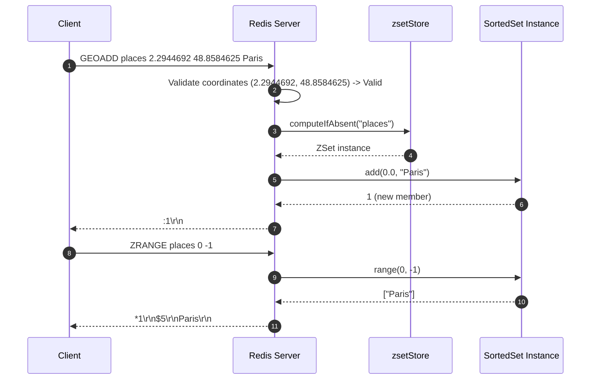
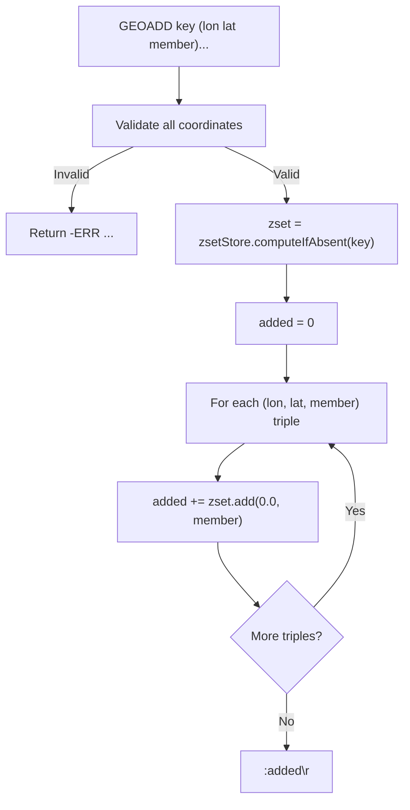

# Stage 101: Store a location

---

## In one line
Store validated geospatial locations into the backing `SortedSet` with a temporary score of `0.0`, returning the count of newly inserted members and allowing retrieval via `ZRANGE`.

---

## Self-test (cover the answers below and answer these first)
1. **In which native Redis data structure are geospatial coordinates stored?**
   - *Answer*: Sorted sets (`ZSET`).
2. **What command can be used to query members added via `GEOADD`?**
   - *Answer*: Any standard sorted set command, such as `ZRANGE`, `ZCARD`, `ZRANK`, or `ZSCORE`.
3. **What is the temporary score assigned to geospatial locations in this stage?**
   - *Answer*: `0.0` (to be replaced by 52-bit Geohash integer scores in subsequent stages).
4. **What does `GEOADD key lon lat member` return if the member already exists in the sorted set?**
   - *Answer*: `:0\r\n` (since no new element was added; only the score was updated).
5. **What does `TYPE key` return when queried on a key populated via `GEOADD`?**
   - *Answer*: `+zset\r\n`.
6. **How does `GEOADD` handle multiple locations passed in a single invocation?**
   - *Answer*: Iterates through each `(lon, lat, member)` triple, inserts each into the sorted set, and returns the total sum of newly added elements.

---

## Problem Solved

In **Stage 101: Store a location**, we implement:

1. **Backing SortedSet Integration**:
   - Obtains or initializes `SortedSet` under `key` via `zsetStore.computeIfAbsent(key, k -> new SortedSet())`.
2. **Member Insertion**:
   - Invokes `zset.add(0.0, member)` for each member in the parsed arguments.
3. **Cardinality Reporting**:
   - Accumulates the return value of `zset.add` (1 for new member, 0 for existing member update) and returns `:<addedCount>\r\n`.
4. **Interoperability with ZRANGE**:
   - Verifies that `ZRANGE key 0 -1` correctly returns the members stored via `GEOADD`.

---

## Thought Process & Architectural Model

### 1. Storage Pipeline



### 2. State Mutation Flowchart



---

## Full Solution

In [`codecrafters-redis-java/src/main/java/Main.java`](file:///C:/Users/jiten/Documents/Codecrafters-Build-from-scratch/codecrafters-redis-java/src/main/java/Main.java):

```java
    } else if (command.equalsIgnoreCase("GEOADD")) {
      if (parts.length < 5 || (parts.length - 2) % 3 != 0) {
        out.write("-ERR wrong number of arguments for 'geoadd' command\r\n".getBytes(StandardCharsets.UTF_8));
        out.flush();
      } else {
        boolean valid = true;
        String errorMsg = null;
        for (int i = 2; i < parts.length; i += 3) {
          try {
            double lon = Double.parseDouble(parts[i]);
            double lat = Double.parseDouble(parts[i + 1]);
            if (lon < -180.0 || lon > 180.0 || lat < -85.05112878 || lat > 85.05112878) {
              valid = false;
              errorMsg = "-ERR invalid longitude,latitude pair " + parts[i] + "," + parts[i + 1] + "\r\n";
              break;
            }
          } catch (NumberFormatException e) {
            valid = false;
            errorMsg = "-ERR value is not a valid float\r\n";
            break;
          }
        }
        if (!valid) {
          out.write(errorMsg.getBytes(StandardCharsets.UTF_8));
        } else {
          String key = parts[1];
          SortedSet zset = zsetStore.computeIfAbsent(key, k -> new SortedSet());
          int added = 0;
          for (int i = 2; i < parts.length; i += 3) {
            String member = parts[i + 2];
            added += zset.add(0.0, member);
          }
          out.write((":" + added + "\r\n").getBytes(StandardCharsets.UTF_8));
        }
        out.flush();
      }
    }
```

---

## Concepts

1. **Dual-Role Data Structure**:
   - By mapping geospatial commands directly onto `SortedSet`, Redis achieves complete architectural reuse: indexing, cardinality, range slicing, and eviction logic are all shared without bespoke indexing structures.
2. **Idempotent Addition**:
   - Re-adding an existing member updates its score in-place and increments the return count only if the member was absent.

---

## Wire Format

```text
Client: *5\r\n$6\r\nGEOADD\r\n$6\r\nplaces\r\n$9\r\n2.2944692\r\n$10\r\n48.8584625\r\n$5\r\nParis\r\n
Server: :1\r\n

Client: *4\r\n$6\r\nZRANGE\r\n$6\r\nplaces\r\n$1\r\n0\r\n$2\r\n-1\r\n
Server: *1\r\n$5\r\nParis\r\n
```

---

## Failure Modes

1. **Member Overwrites**:
   - Calling `GEOADD` on the same member multiple times returns `:0\r\n` on repeated additions, avoiding double-counting in the response.
2. **Type Clashes**:
   - If `key` exists as a different type (e.g. String or List), a strict Redis server returns `-WRONGTYPE Operation against a key holding the wrong kind of value\r\n`.

---

## Tradeoffs

- **Pre-allocation vs On-demand Creation**:
  - `computeIfAbsent` instantiates `SortedSet` only when valid additions are committed, preserving memory on aborted commands.

---

## Java Specifics

- `zsetStore.computeIfAbsent(key, k -> new SortedSet())`: Thread-safe atomic lookup and initialization on `ConcurrentHashMap`.

---

## Rebuild Checklist

1. [x] Validate all coordinates before mutating `zsetStore`.
2. [x] Lookup or create `SortedSet` under `key`.
3. [x] Loop through triples and invoke `zset.add(0.0, member)`.
4. [x] Return `:added\r\n` as RESP Integer.
5. [x] Verify compilation with `javac`.
