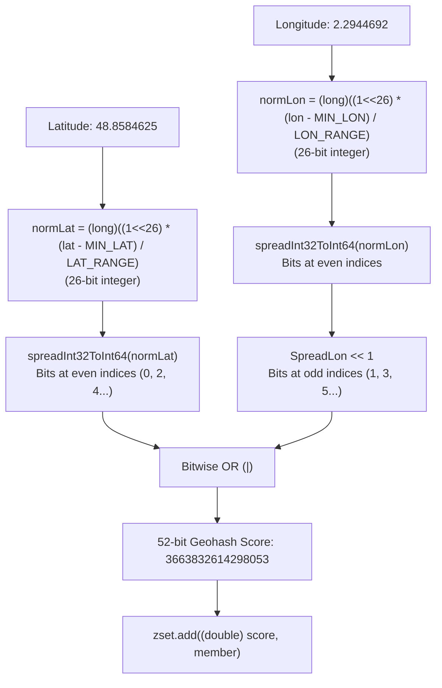
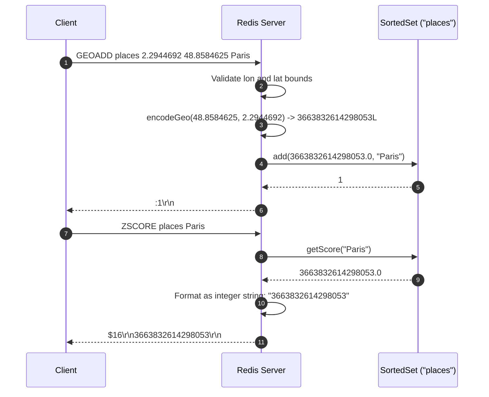

# Stage 102: Calculate location score

---

## In one line
Calculate 52-bit Geohash integer scores from latitude and longitude by normalizing coordinates to 26-bit grid offsets, spreading them with zero-padding bitmasks, and interleaving them into a 64-bit float score stored in the backing sorted set.

---

## Self-test (cover the answers below and answer these first)
1. **Why does Redis normalize latitude and longitude to 26 bits rather than 32 bits?**
   - *Answer*: Scores in sorted sets are IEEE 754 double-precision floats (`float64`), which guarantee exact integer precision only up to $2^{53}-1$ (52 mantissa bits + 1 hidden bit). Interleaving two 26-bit integers yields a 52-bit integer that fits without loss of precision.
2. **What bit manipulation technique is used to spread 26/32 bits across 64 bits?**
   - *Answer*: Bitwise shift and mask spreading (using masks `0x0000FFFF0000FFFF`, `0x00FF00FF00FF00FF`, `0x0F0F0F0F0F0F0F0F`, `0x3333333333333333`, and `0x5555555555555555`).
3. **In the interleaved 52-bit Geohash score, which coordinate occupies the even bit positions and which occupies the odd bit positions?**
   - *Answer*: Latitude occupies the even bit positions ($0, 2, 4, \dots$) and longitude occupies the odd bit positions ($1, 3, 5, \dots$, shifted left by 1).
4. **How are the normalized coordinate bounds defined?**
   - *Answer*: $\text{normLat} = \lfloor 2^{26} \times (\text{lat} - \text{MIN\_LAT}) / \text{LAT\_RANGE} \rfloor$ and $\text{normLon} = \lfloor 2^{26} \times (\text{lon} - \text{MIN\_LON}) / \text{LON\_RANGE} \rfloor$, with $\text{MIN\_LAT} = -85.05112878$, $\text{MAX\_LAT} = 85.05112878$, $\text{MIN\_LON} = -180.0$, $\text{MAX\_LON} = 180.0$.
5. **What is the calculated integer score for Paris (`2.2944692 48.8584625`)?**
   - *Answer*: `3663832614298053`.
6. **How does `ZSCORE places Paris` serialize this 52-bit integer score over RESP?**
   - *Answer*: As a bulk string without scientific notation or trailing decimal digits, e.g. `$16\r\n3663832614298053\r\n`.

---

## Problem Solved

In **Stage 102: Calculate location score**, we implement:

1. **26-bit Coordinate Normalization**:
   - Scales latitude over $[-85.05112878, 85.05112878]$ into $[0, 2^{26}-1]$.
   - Scales longitude over $[-180.0, 180.0]$ into $[0, 2^{26}-1]$.
2. **Bit Interleaving (`spreadInt32ToInt64` & Bitwise OR)**:
   - Separates individual bits into alternating lanes.
   - Computes `score = normLat_spread | (normLon_spread << 1)`.
3. **SortedSet Score Upgrades**:
   - Upgrades `GEOADD` from hardcoded `0.0` scores to the computed Geohash integer scores.
4. **Exact Score Querying**:
   - Ensures `ZSCORE key member` returns the exact integer string representation matching the standard Redis Geohash implementation.

---

## Thought Process & Architectural Model

### 1. Geohash Bit Interleaving Architecture



### 2. End-to-End Sequence Diagram



---

## Full Solution

In [`codecrafters-redis-java/src/main/java/Main.java`](file:///C:/Users/jiten/Documents/Codecrafters-Build-from-scratch/codecrafters-redis-java/src/main/java/Main.java):

```java
  private static final double MIN_LATITUDE = -85.05112878;
  private static final double MAX_LATITUDE = 85.05112878;
  private static final double MIN_LONGITUDE = -180.0;
  private static final double MAX_LONGITUDE = 180.0;
  private static final double LATITUDE_RANGE = MAX_LATITUDE - MIN_LATITUDE;
  private static final double LONGITUDE_RANGE = MAX_LONGITUDE - MIN_LONGITUDE;

  private static long spreadInt32ToInt64(long v) {
    v = v & 0xFFFFFFFFL;
    v = (v | (v << 16)) & 0x0000FFFF0000FFFFL;
    v = (v | (v << 8))  & 0x00FF00FF00FF00FFL;
    v = (v | (v << 4))  & 0x0F0F0F0F0F0F0F0FL;
    v = (v | (v << 2))  & 0x3333333333333333L;
    v = (v | (v << 1))  & 0x5555555555555555L;
    return v;
  }

  private static long encodeGeo(double lat, double lon) {
    long normLat = (long) ((1L << 26) * (lat - MIN_LATITUDE) / LATITUDE_RANGE);
    long normLon = (long) ((1L << 26) * (lon - MIN_LONGITUDE) / LONGITUDE_RANGE);
    long x = spreadInt32ToInt64(normLat);
    long y = spreadInt32ToInt64(normLon);
    return x | (y << 1);
  }
```

And inside `GEOADD`:
```java
        if (!valid) {
          out.write(errorMsg.getBytes(StandardCharsets.UTF_8));
        } else {
          String key = parts[1];
          SortedSet zset = zsetStore.computeIfAbsent(key, k -> new SortedSet());
          int added = 0;
          for (int i = 2; i < parts.length; i += 3) {
            double lon = Double.parseDouble(parts[i]);
            double lat = Double.parseDouble(parts[i + 1]);
            String member = parts[i + 2];
            long score = encodeGeo(lat, lon);
            added += zset.add((double) score, member);
          }
          out.write((":" + added + "\r\n").getBytes(StandardCharsets.UTF_8));
        }
```

---

## Concepts

1. **Peano / Morton Space-Filling Curve (Z-Order Curve)**:
   - Interleaving coordinates maps multidimensional points onto a 1D line while preserving locality. Two points close to each other in 2D space generally share common prefixes in their Morton code, allowing 2D spatial range queries to translate directly to 1D continuous intervals.
2. **IEEE 754 Floating-Point Precision Bounds**:
   - In 64-bit IEEE 754 floats, the significand precision is 53 bits ($2^{53} = 9,007,199,254,740,992$). A 52-bit Morton code caps at $2^{52} - 1 = 4,503,599,627,370,495$, ensuring that casting between `long` and `double` is lossless.

---

## Wire Format

```text
Client: *5\r\n$6\r\nGEOADD\r\n$6\r\nplaces\r\n$9\r\n2.2944692\r\n$10\r\n48.8584625\r\n$5\r\nParis\r\n
Server: :1\r\n

Client: *3\r\n$6\r\nZSCORE\r\n$6\r\nplaces\r\n$5\r\nParis\r\n
Server: $16\r\n3663832614298053\r\n
```

---

## Failure Modes

1. **Bitmask Truncation without `L` Suffix**:
   - In Java, literal constants like `0x0000FFFF0000FFFF` require the `L` suffix (`0x0000FFFF0000FFFFL`) or the compiler will report an integer literal out-of-range error.
2. **Argument Order Inversion**:
   - Passing `encodeGeo(lon, lat)` instead of `encodeGeo(lat, lon)` would transpose the Morton curve dimensions, creating erroneous score hashes.

---

## Tradeoffs

- **Bitwise Magic Multiplication vs Arithmetic Loops**:
  - The parallel prefix mask spreading takes 5 shift-and-mask instructions ($O(1)$) instead of a 26-iteration bit-extraction loop ($O(B)$), achieving maximum CPU throughput.

---

## Java Specifics

- `(1L << 26)`: Using a `long` literal `1L` prevents signed 32-bit overflow when scaling.

---

## Rebuild Checklist

1. [x] Declare bounds `MIN_LATITUDE`, `MAX_LATITUDE`, `MIN_LONGITUDE`, `MAX_LONGITUDE`.
2. [x] Implement `spreadInt32ToInt64` with 64-bit mask constants.
3. [x] Implement `encodeGeo(lat, lon)` returning interleaved `x | (y << 1)`.
4. [x] Update `GEOADD` loop to compute `encodeGeo(lat, lon)` and pass `(double) score` into `zset.add`.
5. [x] Confirm `ZSCORE` formats integers without `.0` trailing fractions.
6. [x] Verify compilation with `javac`.
