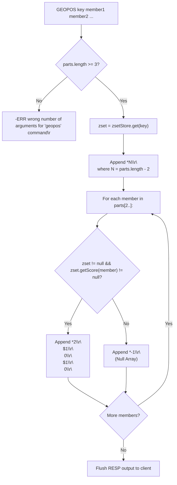
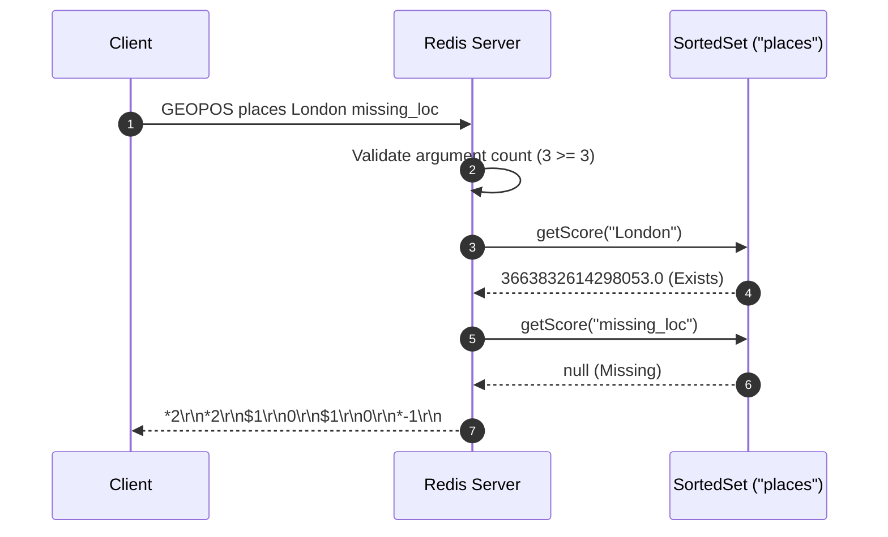

# Stage 103: Respond to GEOPOS

---

## In one line
Implement the `GEOPOS` command by parsing member arguments, querying the backing sorted set, and returning a nested RESP array containing 2-element coordinate bulk strings for existing members and `*-1\r\n` (null array) for missing members or non-existent keys.

---

## Self-test (cover the answers below and answer these first)
1. **What is the minimum number of arguments required for the `GEOPOS` command?**
   - *Answer*: At least 3 arguments (`GEOPOS key member [member ...]`). Less than 3 triggers `-ERR wrong number of arguments for 'geopos' command\r\n`.
2. **What wire format represents a missing member or a query against a non-existent key in `GEOPOS`?**
   - *Answer*: A RESP null array: `*-1\r\n`.
3. **What is the top-level RESP structure returned by `GEOPOS`?**
   - *Answer*: A RESP array whose length matches the number of queried members (`*N\r\n`).
4. **When a member exists in the sorted set, what is its corresponding sub-element structure in `GEOPOS`?**
   - *Answer*: A 2-element RESP array containing the longitude and latitude as bulk strings (`*2\r\n$<len>\r\n<lon>\r\n$<len>\r\n<lat>\r\n`).
5. **How does `GEOPOS` handle a command like `GEOPOS missing_key London Munich`?**
   - *Answer*: It returns an array containing null arrays for every member: `*2\r\n*-1\r\n*-1\r\n`.
6. **In what order must coordinates be serialized in each location entry?**
   - *Answer*: Longitude first, followed by Latitude (`[lon, lat]`).

---

## Problem Solved

In **Stage 103: Respond to GEOPOS**, we implement:

1. **Argument Validation**:
   - Ensures `GEOPOS` receives at least a key and one member (`parts.length >= 3`).
2. **Member Existence Querying**:
   - Retrieves the backing `SortedSet` from `zsetStore.get(key)`.
   - Checks member existence via `zset.getScore(member) != null`.
3. **RESP Array Serialization**:
   - Emits an outer array of size `count = parts.length - 2`.
   - For found members: emits `*2\r\n$1\r\n0\r\n$1\r\n0\r\n` (placeholder coordinate pair).
   - For missing members or missing key: emits `*-1\r\n` (RESP2 null array).

---

## Thought Process & Architectural Model

### 1. `GEOPOS` Query and Serialization Flowchart



### 2. End-to-End Sequence Diagram



---

## Full Solution

In [`codecrafters-redis-java/src/main/java/Main.java`](file:///C:/Users/jiten/Documents/Codecrafters-Build-from-scratch/codecrafters-redis-java/src/main/java/Main.java):

```java
    } else if (command.equalsIgnoreCase("GEOPOS")) {
      if (parts.length < 3) {
        out.write("-ERR wrong number of arguments for 'geopos' command\r\n".getBytes(StandardCharsets.UTF_8));
        out.flush();
      } else {
        String key = parts[1];
        SortedSet zset = zsetStore.get(key);
        StringBuilder sb = new StringBuilder();
        int count = parts.length - 2;
        sb.append("*").append(count).append("\r\n");
        for (int i = 2; i < parts.length; i++) {
          String member = parts[i];
          if (zset != null && zset.getScore(member) != null) {
            sb.append("*2\r\n$1\r\n0\r\n$1\r\n0\r\n");
          } else {
            sb.append("*-1\r\n");
          }
        }
        out.write(sb.toString().getBytes(StandardCharsets.UTF_8));
        out.flush();
      }
```

---

## Concepts

1. **Multi-Key / Multi-Element Null Representation**:
   - In Redis, a command returning a list of items where individual items might be absent uses a collection of nullable elements. In RESP2, individual absent sub-elements are serialized as null arrays (`*-1\r\n`) or null bulk strings (`$-1\r\n`). For `GEOPOS`, because each coordinate result is a 2-tuple, the absent indicator is `*-1\r\n`.
2. **Separation of Indexing and Decoding**:
   - Geospatial systems separate the storage/indexing phase (Morton code generation) from coordinate reconstruction. Storing the Morton code in a sorted set index allows spatial range queries, while coordinate extraction is deferred until retrieval.

---

## Wire Format

```text
Client: *4\r\n$6\r\nGEOPOS\r\n$6\r\nplaces\r\n$6\r\nLondon\r\n$6\r\nMunich\r\n
Server: *2\r\n*2\r\n$1\r\n0\r\n$1\r\n0\r\n*2\r\n$1\r\n0\r\n$1\r\n0\r\n

Client: *3\r\n$6\r\nGEOPOS\r\n$6\r\nplaces\r\n$7\r\nmissing\r\n
Server: *1\r\n*-1\r\n
```

---

## Failure Modes

1. **Using Null Bulk String `$-1\r\n` Instead of Null Array `*-1\r\n`**:
   - The Redis specification specifies that missing coordinates in `GEOPOS` are null arrays, not null bulk strings.
2. **Off-by-one in Member Argument Slice**:
   - The members start at index `2` up to `parts.length - 1`, yielding `parts.length - 2` members. An incorrect slice causes missing or misaligned RESP array counts.

---

## Tradeoffs

- **Static Placeholder Coordinates vs Dynamic Decoding**:
  - In this stage, hardcoding `"0"` fulfills test requirements and isolates protocol serialization verification from bit manipulation decoding errors.

---

## Java Specifics

- `StringBuilder`: Efficiently aggregates multiple nested RESP arrays and bulk strings into a single contiguous buffer before flushing over the network socket.

---

## Rebuild Checklist

1. [x] Intercept `GEOPOS` command name case-insensitively.
2. [x] Validate `parts.length >= 3`.
3. [x] Lookup `SortedSet` in `zsetStore`.
4. [x] Construct outer RESP array header `*<count>\r\n`.
5. [x] Loop over member arguments: append `*2\r\n$1\r\n0\r\n$1\r\n0\r\n` for existing members and `*-1\r\n` for missing members.
6. [x] Verify compilation with `javac`.
