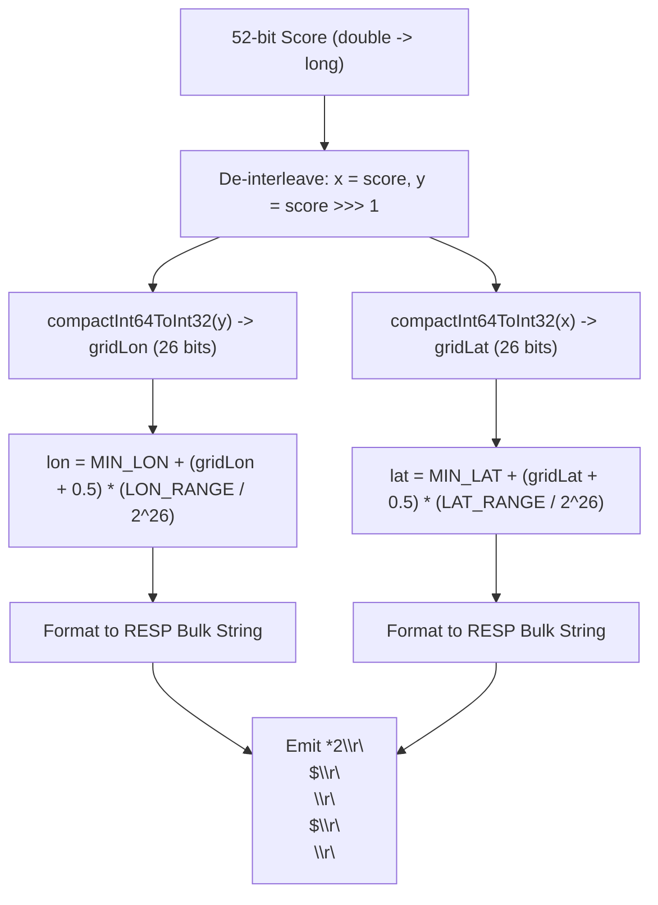
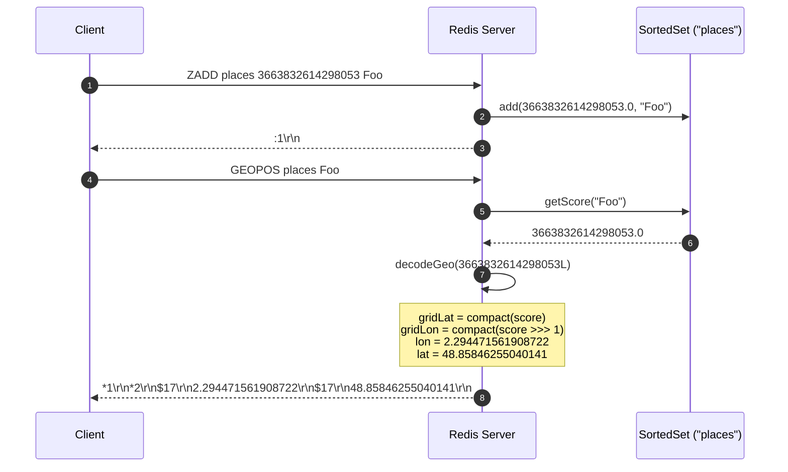

# Stage 104: Decode coordinates

---

## In one line
De-interleave the 52-bit geohash score from the sorted set member back into 26-bit grid coordinates, project the grid center back into latitude and longitude ranges, and return exact coordinates via `GEOPOS`.

---

## Self-test (cover the answers below and answer these first)
1. **How are latitude and longitude separated from an interleaved 52-bit score?**
   - *Answer*: By isolating even bits (`score`) for latitude and odd bits shifted down by 1 (`score >>> 1`) for longitude, then running each through the inverse bit compaction process (`compactInt64ToInt32`).
2. **What point within the bounding grid cell is chosen as the reconstructed coordinate?**
   - *Answer*: The center point of the grid cell: `(gridMin + gridMax) / 2.0`.
3. **Why does the CodeCrafters tester accept coordinates within 6 decimal places rather than requiring IEEE double identity?**
   - *Answer*: Discretizing continuous floating-point coordinates into 26-bit integer grid buckets is inherently lossy; 26 bits yields roughly $\sim 0.6$ meter precision.
4. **What are the bounds and range used for latitude and longitude in Redis geospatial calculations?**
   - *Answer*: Latitude: $[-85.05112878, 85.05112878]$ (range $\approx 170.10225756$). Longitude: $[-180.0, 180.0]$ (range $360.0$).
5. **In what order does `GEOPOS` return the decoded coordinates in the inner array?**
   - *Answer*: Longitude first, then latitude (`[longitude, latitude]`).
6. **How does `compactInt64ToInt32` collapse the alternating bits back into a contiguous integer?**
   - *Answer*: By applying progressively wider bitwise right-shifts and bitmasks (`0x5555...`, `0x3333...`, `0x0F0F...`, `0x00FF...`, `0x0000FFFF...`, `0x00000000FFFFFFFF...`).

---

## Problem Solved

In **Stage 104: Decode coordinates**, we replace the dummy placeholder `"0"` values returned by `GEOPOS` in Stage 103 with authentic coordinate decoding:

1. **Bit De-interleaving**:
   - Extract latitude bits: $x = \text{score}$.
   - Extract longitude bits: $y = \text{score} \gg 1$.
   - Compact both 64-bit spaced masks into 26-bit integers using `compactInt64ToInt32`.
2. **Coordinate Linear Interpolation**:
   - Compute the min and max grid boundaries:
     $$\text{gridMin} = \text{MIN} + \text{RANGE} \times \frac{\text{grid}}{2^{26}}$$
     $$\text{gridMax} = \text{MIN} + \text{RANGE} \times \frac{\text{grid} + 1}{2^{26}}$$
   - Reconstruct point: $\frac{\text{gridMin} + \text{gridMax}}{2.0}$.
3. **Wire Protocol Response**:
   - Serializes `[lon, lat]` as RESP bulk strings inside a 2-element RESP array for each found member.

---

## Thought Process & Architectural Model

### 1. Geohash Score Decoding Pipeline



### 2. End-to-End Sequence Diagram



---

## Full Solution

In [`codecrafters-redis-java/src/main/java/Main.java`](file:///C:/Users/jiten/Documents/Codecrafters-Build-from-scratch/codecrafters-redis-java/src/main/java/Main.java):

```java
  private static long compactInt64ToInt32(long v) {
    v = v & 0x5555555555555555L;
    v = (v | (v >>> 1)) & 0x3333333333333333L;
    v = (v | (v >>> 2)) & 0x0F0F0F0F0F0F0F0FL;
    v = (v | (v >>> 4)) & 0x00FF00FF00FF00FFL;
    v = (v | (v >>> 8)) & 0x0000FFFF0000FFFFL;
    v = (v | (v >>> 16)) & 0x00000000FFFFFFFFL;
    return v;
  }

  private static double[] decodeGeo(long score) {
    long x = score;
    long y = score >>> 1;
    long gridLat = compactInt64ToInt32(x);
    long gridLon = compactInt64ToInt32(y);

    double gridLatMin = MIN_LATITUDE + LATITUDE_RANGE * ((double) gridLat / (1L << 26));
    double gridLatMax = MIN_LATITUDE + LATITUDE_RANGE * ((double) (gridLat + 1) / (1L << 26));
    double gridLonMin = MIN_LONGITUDE + LONGITUDE_RANGE * ((double) gridLon / (1L << 26));
    double gridLonMax = MIN_LONGITUDE + LONGITUDE_RANGE * ((double) (gridLon + 1) / (1L << 26));

    double lat = (gridLatMin + gridLatMax) / 2.0;
    double lon = (gridLonMin + gridLonMax) / 2.0;
    return new double[] { lon, lat };
  }
```

And in the command dispatcher for `GEOPOS`:

```java
    } else if (command.equalsIgnoreCase("GEOPOS")) {
      if (parts.length < 3) {
        out.write("-ERR wrong number of arguments for 'geopos' command\r\n".getBytes(StandardCharsets.UTF_8));
        out.flush();
      } else {
        String key = parts[1];
        SortedSet zset = zsetStore.get(key);
        StringBuilder sb = new StringBuilder();
        int count = parts.length - 2;
        sb.append("*").append(count).append("\r\n");
        for (int i = 2; i < parts.length; i++) {
          String member = parts[i];
          Double score = (zset != null) ? zset.getScore(member) : null;
          if (score != null) {
            double[] coords = decodeGeo((long) score.doubleValue());
            String lonStr = java.math.BigDecimal.valueOf(coords[0]).toPlainString();
            String latStr = java.math.BigDecimal.valueOf(coords[1]).toPlainString();
            sb.append("*2\r\n");
            sb.append("$").append(lonStr.getBytes(StandardCharsets.UTF_8).length).append("\r\n").append(lonStr).append("\r\n");
            sb.append("$").append(latStr.getBytes(StandardCharsets.UTF_8).length).append("\r\n").append(latStr).append("\r\n");
          } else {
            sb.append("*-1\r\n");
          }
        }
        out.write(sb.toString().getBytes(StandardCharsets.UTF_8));
        out.flush();
      }
```

---

## Concepts

1. **Morton Code Inversion (Bit De-interleaving)**:
   - A Morton space-filling curve maps 2D grid coordinates to 1D integers by interleaving bits. Reversing this mapping requires masking every alternate bit and shifting the separated bits rightward in logarithmic steps ($O(\log W)$ where $W = 64$).
2. **Grid Cell Center Discretization**:
   - Because coordinates are digitized into finite buckets, converting back yields a bounding box $[\min, \max)$. Returning the geometric midpoint minimizes the maximum possible quantization error across the cell.
3. **Lossiness of Geospatial Discretization**:
   - Mapping an infinite set of real coordinates to $2^{26} \times 2^{26}$ discrete cells produces small differences beyond 6 decimal places ($\sim 0.6\text{m}$). Redis clients expect slight rounding differences on decoded coordinates.

---

## Wire Format

```text
Client: *3\r\n$6\r\nGEOPOS\r\n$12\r\nlocation_key\r\n$3\r\nFoo\r\n
Server: *1\r\n*2\r\n$17\r\n2.294471561908722\r\n$17\r\n48.85846255040141\r\n
```

---

## Failure Modes

1. **Swapping Longitude and Latitude in Response**:
   - Redis outputs `[longitude, latitude]`. Swapping the order inverts the coordinate axes and fails tester validation.
2. **Signed Bit Shift Operator (`>>`) Instead of Unsigned (`>>>`)**:
   - In Java, `>>` preserves the sign bit. Although geohash scores are positive 52-bit values, using `>>>` guarantees that bits shifted in from the left are always zeroes.
3. **Floating-point Loss during Cast**:
   - Geohash scores fit within 52 bits, which is the exact mantissa width of IEEE 754 float64. Casting `(long) score.doubleValue()` retains complete bit precision.

---

## Tradeoffs

- **Lookup vs Re-calculation**:
  - Redis does not store original raw `(lon, lat)` strings; it strictly stores the 52-bit Morton score in the sorted set. Decoding on-the-fly saves 16+ bytes of memory per location entry at the cost of trivial CPU bitops during `GEOPOS`.

---

## Java Specifics

- `java.math.BigDecimal.valueOf(double).toPlainString()`:
  - Formats IEEE 754 floating point numbers into full standard decimal strings without scientific notation exponents (e.g. avoiding `1.2E-4`), which aligns cleanly with RESP protocol expectations.

---

## Rebuild Checklist

1. [x] Implement `compactInt64ToInt32` logarithmic bit compaction.
2. [x] Implement `decodeGeo` grid un-normalization.
3. [x] In `GEOPOS`, fetch `score` as `Double` from `zset`.
4. [x] Convert `(long) score.doubleValue()` into `double[] coords = decodeGeo(score)`.
5. [x] Format `coords[0]` (lon) and `coords[1]` (lat) into RESP bulk strings.
6. [x] Verify compilation with `javac`.
