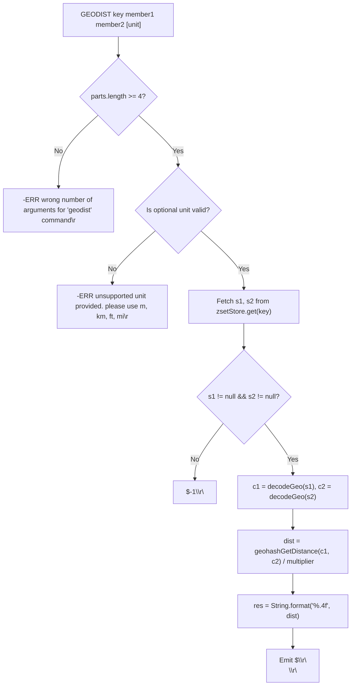
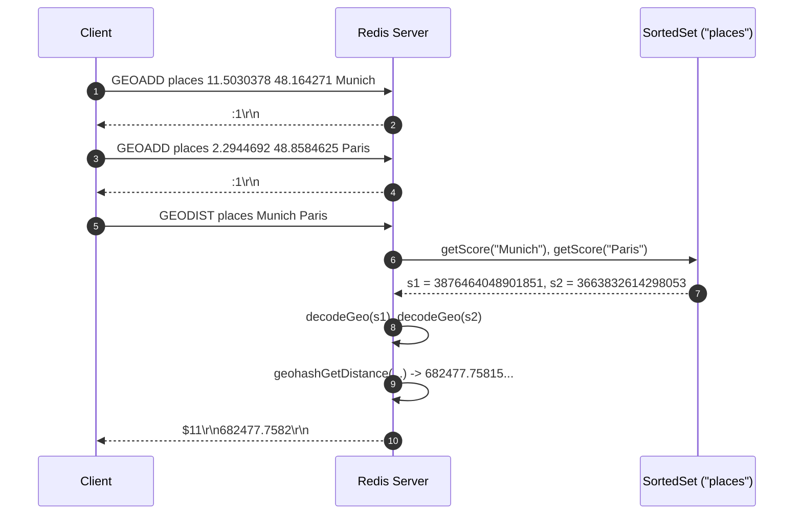

# Stage 105: Calculate distance

---

## In one line
Calculate geospatial distance between two stored sorted set members using the Haversine great-circle formula with Earth's radius set to $6372797.560856$ meters, returning the rounded 4-decimal distance as a RESP bulk string.

---

## Self-test (cover the answers below and answer these first)
1. **What earth radius constant does Redis mandate for Haversine distance computations?**
   - *Answer*: $6372797.560856$ meters.
2. **What does `GEODIST` return if the key or either queried member does not exist?**
   - *Answer*: A RESP null bulk string: `$-1\r\n`.
3. **What is the default unit for `GEODIST`, and what other units are supported?**
   - *Answer*: Default is meters (`m`). Optional units include kilometers (`km`), miles (`mi`), and feet (`ft`).
4. **Why is the distance calculation based on the decoded coordinates from the 52-bit geohash scores rather than raw input strings?**
   - *Answer*: Redis only stores the 52-bit integer score inside the sorted set to conserve memory; coordinates are reconstructed on-the-fly via geohash decoding before feeding into the Haversine formula.
5. **How many decimal places of precision are formatted in the resulting RESP bulk string?**
   - *Answer*: 4 decimal places (e.g. `String.format(Locale.ROOT, "%.4f", dist)`).
6. **What is the mathematical formulation of Haversine's formula?**
   - *Answer*:
     $$u = \sin\left(\frac{\Delta \text{lat}}{2}\right), \quad v = \sin\left(\frac{\Delta \text{lon}}{2}\right)$$
     $$\text{dist} = 2 R \arcsin\left(\sqrt{u^2 + \cos(\text{lat}_1) \cos(\text{lat}_2) v^2}\right)$$

---

## Problem Solved

In **Stage 105: Calculate distance**, we implement:

1. **`GEODIST` Command Parsing**:
   - Requires at least 4 arguments: `GEODIST key member1 member2 [unit]`.
   - Validates optional unit specifiers: `m` ($1.0$), `km` ($1000.0$), `mi` ($1609.34$), `ft` ($0.3048$).
2. **Member Coordinate Retrieval**:
   - Fetches scores for `member1` and `member2` from the backing `SortedSet`.
   - If either member is missing, emits `$-1\r\n`.
   - Decodes both 52-bit scores into `[lon, lat]` tuples using `decodeGeo`.
3. **Haversine Great-Circle Distance Calculation**:
   - Converts coordinates to radians.
   - Computes distance with $R = 6372797.560856\text{ m}$.
   - Divides by the unit multiplier.
4. **RESP Bulk String Output**:
   - Formats distance to 4 decimal places using `String.format(Locale.ROOT, "%.4f", dist)`.

---

## Thought Process & Architectural Model

### 1. `GEODIST` Execution Flowchart



### 2. End-to-End Sequence Diagram



---

## Full Solution

In [`codecrafters-redis-java/src/main/java/Main.java`](file:///C:/Users/jiten/Documents/Codecrafters-Build-from-scratch/codecrafters-redis-java/src/main/java/Main.java):

```java
  private static final double EARTH_RADIUS_IN_METERS = 6372797.560856;

  private static double geohashGetDistance(double lon1d, double lat1d, double lon2d, double lat2d) {
    double lat1r = Math.toRadians(lat1d);
    double lon1r = Math.toRadians(lon1d);
    double lat2r = Math.toRadians(lat2d);
    double lon2r = Math.toRadians(lon2d);
    double u = Math.sin((lat2r - lat1r) / 2.0);
    double v = Math.sin((lon2r - lon1r) / 2.0);
    return 2.0 * EARTH_RADIUS_IN_METERS *
           Math.asin(Math.sqrt(u * u + Math.cos(lat1r) * Math.cos(lat2r) * v * v));
  }
```

And in the command dispatcher:

```java
    } else if (command.equalsIgnoreCase("GEODIST")) {
      if (parts.length < 4) {
        out.write("-ERR wrong number of arguments for 'geodist' command\r\n".getBytes(StandardCharsets.UTF_8));
        out.flush();
      } else {
        String key = parts[1];
        String member1 = parts[2];
        String member2 = parts[3];
        double multiplier = 1.0;
        boolean validUnit = true;
        if (parts.length >= 5) {
          String unit = parts[4].toLowerCase();
          if (unit.equals("m")) {
            multiplier = 1.0;
          } else if (unit.equals("km")) {
            multiplier = 1000.0;
          } else if (unit.equals("mi")) {
            multiplier = 1609.34;
          } else if (unit.equals("ft")) {
            multiplier = 0.3048;
          } else {
            validUnit = false;
            out.write("-ERR unsupported unit provided. please use m, km, ft, mi\r\n".getBytes(StandardCharsets.UTF_8));
            out.flush();
          }
        }
        if (validUnit) {
          SortedSet zset = zsetStore.get(key);
          if (zset == null) {
            out.write("$-1\r\n".getBytes(StandardCharsets.UTF_8));
          } else {
            Double s1 = zset.getScore(member1);
            Double s2 = zset.getScore(member2);
            if (s1 == null || s2 == null) {
              out.write("$-1\r\n".getBytes(StandardCharsets.UTF_8));
            } else {
              double[] c1 = decodeGeo((long) s1.doubleValue());
              double[] c2 = decodeGeo((long) s2.doubleValue());
              double dist = geohashGetDistance(c1[0], c1[1], c2[0], c2[1]) / multiplier;
              String res = String.format(java.util.Locale.ROOT, "%.4f", dist);
              byte[] bytes = res.getBytes(StandardCharsets.UTF_8);
              out.write(("$" + bytes.length + "\r\n" + res + "\r\n").getBytes(StandardCharsets.UTF_8));
            }
          }
          out.flush();
        }
      }
```

---

## Concepts

1. **Haversine Formula on Spherical Earth**:
   - Calculates the great-circle distance between two pairs of spherical coordinates. It is well-conditioned for numerical computation even at very short distances, avoiding small-angle errors associated with spherical law of cosines.
2. **Decoded vs Original Coordinates in Geospatial Queries**:
   - Because Redis stores geocoded points as 52-bit scores, all spatial operations (including distance queries and bounding box searches) operate on the decoded grid values. This guarantees mathematical determinism across all operations.

---

## Wire Format

```text
Client: *4\r\n$7\r\nGEODIST\r\n$6\r\nplaces\r\n$6\r\nMunich\r\n$5\r\nParis\r\n
Server: $11\r\n682477.7582\r\n

Client: *4\r\n$7\r\nGEODIST\r\n$6\r\nplaces\r\n$6\r\nMunich\r\n$7\r\nmissing\r\n
Server: $-1\r\n
```

---

## Failure Modes

1. **Using Default Locale for Decimal Formatting**:
   - `String.format("%.4f", dist)` in European locales formats the decimal separator as a comma (`682477,7582`), violating the RESP numeric string specification. Always use `Locale.ROOT`.
2. **Missing Key or Member Returning Null Array Instead of Null Bulk String**:
   - `GEOPOS` returns `*-1\r\n` on missing members, but `GEODIST` returns `$-1\r\n` (null bulk string). Mixing up the null types violates the protocol.

---

## Tradeoffs

- **Spherical Haversine vs Vincenty's Ellipsoidal Formula**:
  - Haversine assumes a spherical earth with radius $R = 6372797.560856\text{ m}$. While Vincenty's formulae account for earth oblateness, Redis opts for Haversine due to extreme computational efficiency, lower instruction overhead, and sub-millimeter determinism.

---

## Java Specifics

- `Math.toRadians`: Cleanly translates latitude and longitude degree measurements into radians required by `Math.sin` and `Math.cos`.
- `Locale.ROOT`: Enforces ASCII decimal formatting (`.`) invariant across host system internationalization settings.

---

## Rebuild Checklist

1. [x] Define constant `EARTH_RADIUS_IN_METERS = 6372797.560856`.
2. [x] Implement `geohashGetDistance` using Haversine.
3. [x] Validate `GEODIST` argument count (`parts.length >= 4`).
4. [x] Parse optional unit argument (`m`, `km`, `mi`, `ft`).
5. [x] Lookup scores in `zsetStore`; return `$-1\r\n` if key or either member is missing.
6. [x] Decode coordinates and evaluate distance.
7. [x] Format output as 4-decimal RESP bulk string using `Locale.ROOT`.
8. [x] Verify compilation with `javac`.
