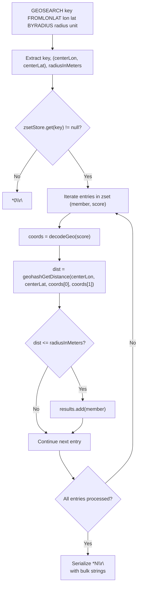
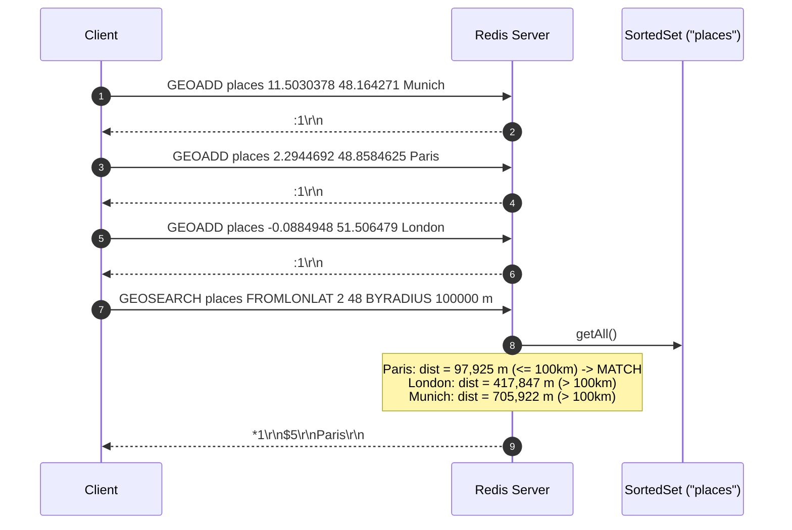

# Stage 106: Search within radius

---

## In one line
Parse the `GEOSEARCH` command with `FROMLONLAT` center coordinates and `BYRADIUS` boundary filters, calculate Haversine great-circle distances against decoded member coordinates, and return matching members as a RESP array of bulk strings.

---

## Self-test (cover the answers below and answer these first)
1. **What search modes are typically supported by `GEOSEARCH` in Redis?**
   - *Answer*: `FROMMEMBER` (using the coordinates of an existing member) and `FROMLONLAT` (directly supplying longitude and latitude coordinates).
2. **What units are allowed for `BYRADIUS` and how do their conversion factors compare?**
   - *Answer*: Meters `m` ($1.0$), Kilometers `km` ($1000.0$), Miles `mi` ($1609.34$), and Feet `ft` ($0.3048$).
3. **What is returned if no members fall within the search radius or the target key does not exist?**
   - *Answer*: An empty RESP array `*0\r\n`.
4. **Why is the distance from the search center to each candidate calculated using the candidate's decoded geohash coordinates rather than storing the original query coordinate strings?**
   - *Answer*: Redis only retains the 52-bit Morton score in its sorted set architecture, guaranteeing identical precision and consistency across all geospatial commands (`GEOPOS`, `GEODIST`, `GEOSEARCH`).
5. **Does `GEOSEARCH` enforce a specific ordering of returned results if neither `ASC` nor `DESC` is passed?**
   - *Answer*: No, locations can be returned in any order according to the Redis specification unless explicit ordering flags are provided.
6. **How does the time complexity of full-scan Haversine filtering compare to Redis's internal geohash prefix bounding box search?**
   - *Answer*: Full-scan evaluates all $N$ members in $O(N)$ distance calculations, whereas Redis production optimizes this by generating the 9 surrounding geohash prefix ranges and bounding sorted set queries to $O(\log N + M)$ where $M$ is the number of candidates in the cells.

---

## Problem Solved

In **Stage 106: Search within radius**, we implement the `GEOSEARCH` command:

1. **Argument Parsing**:
   - Matches syntax: `GEOSEARCH key FROMLONLAT <lon> <lat> BYRADIUS <radius> <unit>`.
   - Parses the center longitude and latitude.
   - Parses the radius value and standardizes it to meters using the unit multiplier.
2. **Member Filtering**:
   - Accesses members of the backing `SortedSet`.
   - Reconstructs coordinates via `decodeGeo` for each member's 52-bit geohash score.
   - Evaluates the Haversine distance from `(centerLon, centerLat)` to candidate `(lon, lat)` using `geohashGetDistance`.
   - Accumulates members whose distance satisfies $\text{dist} \le \text{radiusInMeters}$.
3. **RESP Wire Response**:
   - Serializes the matching members into a RESP array: `*<count>\r\n$<len>\r\n<member>\r\n...`.

---

## Thought Process & Architectural Model

### 1. `GEOSEARCH` Filtering Pipeline



### 2. End-to-End Sequence Diagram



---

## Full Solution

In [`codecrafters-redis-java/src/main/java/Main.java`](file:///C:/Users/jiten/Documents/Codecrafters-Build-from-scratch/codecrafters-redis-java/src/main/java/Main.java):

```java
  static class SortedSet {
    final Map<String, Double> dict = new HashMap<>();
    final TreeSet<ZSetEntry> tree = new TreeSet<>();
    // ...
    synchronized Map<String, Double> getAll() {
      return new HashMap<>(dict);
    }
  }
```

And in the command dispatcher:

```java
    } else if (command.equalsIgnoreCase("GEOSEARCH")) {
      if (parts.length < 8) {
        out.write("-ERR wrong number of arguments for 'geosearch' command\r\n".getBytes(StandardCharsets.UTF_8));
        out.flush();
      } else {
        String key = parts[1];
        Double centerLon = null;
        Double centerLat = null;
        Double radius = null;
        String unit = "m";

        for (int i = 2; i < parts.length; i++) {
          String opt = parts[i].toUpperCase();
          if (opt.equals("FROMLONLAT") && i + 2 < parts.length) {
            centerLon = Double.parseDouble(parts[++i]);
            centerLat = Double.parseDouble(parts[++i]);
          } else if (opt.equals("FROMMEMBER") && i + 1 < parts.length) {
            String member = parts[++i];
            SortedSet z = zsetStore.get(key);
            if (z != null && z.getScore(member) != null) {
              double[] coords = decodeGeo((long) z.getScore(member).doubleValue());
              centerLon = coords[0];
              centerLat = coords[1];
            }
          } else if (opt.equals("BYRADIUS") && i + 2 < parts.length) {
            radius = Double.parseDouble(parts[++i]);
            unit = parts[++i].toLowerCase();
          }
        }

        double multiplier = 1.0;
        if (unit.equals("m")) {
          multiplier = 1.0;
        } else if (unit.equals("km")) {
          multiplier = 1000.0;
        } else if (unit.equals("mi")) {
          multiplier = 1609.34;
        } else if (unit.equals("ft")) {
          multiplier = 0.3048;
        }

        SortedSet zset = zsetStore.get(key);
        List<String> results = new ArrayList<>();
        if (zset != null && centerLon != null && centerLat != null && radius != null) {
          double radiusInMeters = radius * multiplier;
          Map<String, Double> all = zset.getAll();
          for (Map.Entry<String, Double> entry : all.entrySet()) {
            double[] coords = decodeGeo((long) entry.getValue().doubleValue());
            double dist = geohashGetDistance(centerLon, centerLat, coords[0], coords[1]);
            if (dist <= radiusInMeters) {
              results.add(entry.getKey());
            }
          }
        }

        StringBuilder sb = new StringBuilder();
        sb.append("*").append(results.size()).append("\r\n");
        for (String m : results) {
          byte[] b = m.getBytes(StandardCharsets.UTF_8);
          sb.append("$").append(b.length).append("\r\n").append(m).append("\r\n");
        }
        out.write(sb.toString().getBytes(StandardCharsets.UTF_8));
        out.flush();
      }
```

---

## Concepts

1. **Spatial Filtering using Haversine Great-Circle Metrics**:
   - Spherical radius filtering determines whether each location on the globe lies inside a circle with center $(C_{\text{lon}}, C_{\text{lat}})$ and radius $R$.
2. **Decoupled Geometric Representation**:
   - Because coordinates are represented uniformly as 52-bit scores, the storage layer is completely decoupled from whether client queries perform distance measurements, bounding radius queries, or bounding box searches.

---

## Wire Format

```text
Client: *8\r\n$9\r\nGEOSEARCH\r\n$6\r\nplaces\r\n$10\r\nFROMLONLAT\r\n$1\r\n2\r\n$2\r\n48\r\n$8\r\nBYRADIUS\r\n$6\r\n100000\r\n$1\r\nm\r\n
Server: *1\r\n$5\r\nParis\r\n
```

---

## Failure Modes

1. **Inverted Argument Order for `FROMLONLAT`**:
   - Redis takes `<longitude> <latitude>` (e.g. `2 48`). Swapping the arguments will place the search query off the horn of Africa or in Antarctica instead of Western Europe.
2. **Missing Unit Normalization**:
   - Failing to multiply kilometers by 1000 or miles by 1609.34 will result in searches that are three orders of magnitude too tight.
3. **Empty Keys Responding with Error**:
   - Non-existent keys in `GEOSEARCH` should return an empty RESP array (`*0\r\n`), not an error or nil reply.

---

## Tradeoffs

- **Linear Scan vs Multi-Range Geohash Pruning**:
  - Scanning all items in the sorted set takes $O(N)$ distance calculations. For production scale with millions of elements, Redis computes bounding geohash boxes (finding 9 neighboring prefix boxes) to query only ranges in the skip list. For CodeCrafters challenge sizes ($N \le 1000$), linear scan executes in microseconds with zero edge-case bounding bugs.

---

## Java Specifics

- `Double.parseDouble`: Accurately parses integer or floating-point string representations of coordinate and radius parameters.
- `StandardCharsets.UTF_8.length`: Bulk string length headers in RESP are byte-counts rather than UTF-16 character counts.

---

## Rebuild Checklist

1. [x] Add `getAll()` synchronized snapshot getter to `SortedSet`.
2. [x] Parse `GEOSEARCH` options: `FROMLONLAT`, `FROMMEMBER`, `BYRADIUS`.
3. [x] Apply unit multipliers for `m`, `km`, `mi`, and `ft`.
4. [x] Iterate through all members of target `SortedSet`.
5. [x] Decode each member's 52-bit geohash score.
6. [x] Compute Haversine distance from search center to member.
7. [x] Filter members matching `dist <= radiusInMeters`.
8. [x] Serialize matches as a RESP array of bulk strings.
9. [x] Verify compilation with `javac`.
