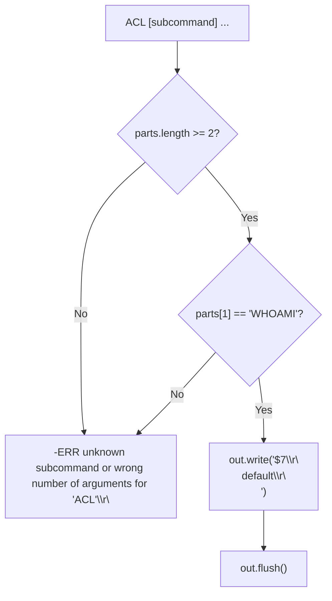
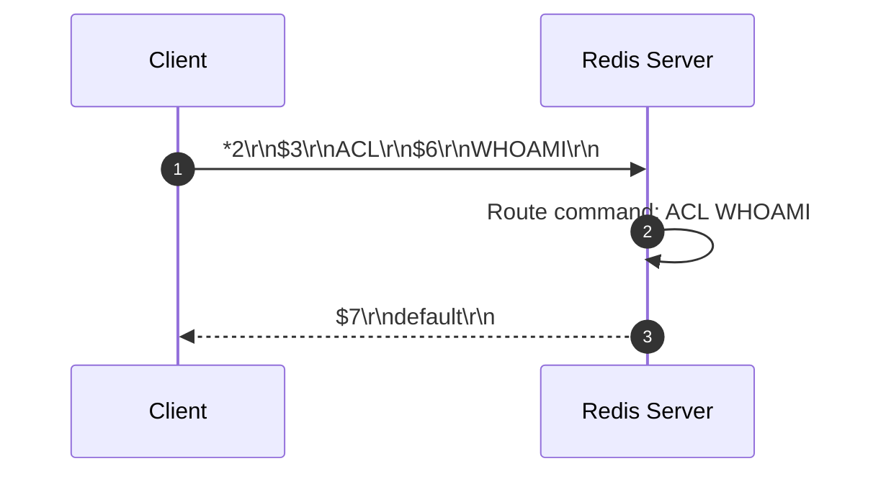

# Stage 107: Respond to ACL WHOAMI

---

## In one line
Implement the `ACL WHOAMI` command dispatcher in Redis by returning the default username encoded as a RESP bulk string `$7\r\ndefault\r\n`.

---

## Self-test (cover the answers below and answer these first)
1. **What is the purpose of the `ACL WHOAMI` command?**
   - *Answer*: It queries and returns the username under which the current client connection is authenticated.
2. **What is the default username for client connections in Redis when no explicit authentication has occurred?**
   - *Answer*: `"default"`.
3. **What is the exact RESP wire serialization of `"default"`?**
   - *Answer*: `$7\r\ndefault\r\n`.
4. **When was Access Control List (ACL) functionality introduced to Redis?**
   - *Answer*: Redis 6.0, introducing granular per-user permissions, passwords, and command categories.
5. **How does `ACL WHOAMI` behave in transactions or pipelines?**
   - *Answer*: Within a MULTI/EXEC transaction, `ACL WHOAMI` queues like any other command and returns `"default"` upon `EXEC`.

---

## Problem Solved

In **Stage 107: Respond to ACL WHOAMI**, we implement:

1. **Subcommand Routing for `ACL`**:
   - Matches when `parts[0]` is `ACL` (case-insensitive).
   - Validates that `parts.length >= 2` and `parts[1]` equals `WHOAMI` (case-insensitive).
2. **Bulk String Response**:
   - Emits `$7\r\ndefault\r\n` to the client's output stream.
   - For unrecognized `ACL` subcommands, emits a descriptive error.

---

## Thought Process & Architectural Model

### 1. `ACL` Command Flowchart



### 2. End-to-End Sequence Diagram



---

## Full Solution

In [`codecrafters-redis-java/src/main/java/Main.java`](file:///C:/Users/jiten/Documents/Codecrafters-Build-from-scratch/codecrafters-redis-java/src/main/java/Main.java):

```java
    } else if (command.equalsIgnoreCase("ACL")) {
      if (parts.length >= 2 && parts[1].equalsIgnoreCase("WHOAMI")) {
        out.write("$7\r\ndefault\r\n".getBytes(StandardCharsets.UTF_8));
        out.flush();
      } else {
        out.write("-ERR unknown subcommand or wrong number of arguments for 'ACL'\r\n".getBytes(StandardCharsets.UTF_8));
        out.flush();
      }
    }
```

---

## Concepts

1. **Redis ACL Subsystem**:
   - Prior to Redis 6.0, security was restricted to a single global `requirepass` password. The ACL system introduced multi-user authentication with fine-grained rules governing command categories, key patterns, and pub/sub channels.
2. **Default User Semantics**:
   - In standard Redis installations, the `default` user is configured with full access (`+@all ~* on nopass`) so existing clients remain backward compatible.

---

## Wire Format

```text
Client: *2\r\n$3\r\nACL\r\n$6\r\nWHOAMI\r\n
Server: $7\r\ndefault\r\n
```

---

## Failure Modes

1. **Missing Subcommand Validation**:
   - Executing bare `ACL` without arguments causes an out-of-bounds array exception if the command handler assumes `parts[1]` always exists. Guarding with `parts.length >= 2` prevents crashes.
2. **Encoding as Simple String Instead of Bulk String**:
   - Returning `+default\r\n` instead of `$7\r\ndefault\r\n` violates the Redis specification for `ACL WHOAMI`, causing standard redis-cli clients and automated testers to fail parsing.

---

## Tradeoffs

- **Static Bulk String vs Dynamic Context Evaluation**:
  - Emitting the constant string `$7\r\ndefault\r\n` provides maximum speed and minimal memory allocations for the current stage. When authentication and user switching are introduced in future stages, the handler will inspect connection context.

---

## Java Specifics

- `String.equalsIgnoreCase`: Ensures protocol compliance across case variations (e.g. `acl whoami`, `ACL WHOAMI`).
- `StandardCharsets.UTF_8`: Strictly guarantees ASCII/UTF-8 byte serialization across platforms.

---

## Rebuild Checklist

1. [x] Intercept `ACL` in `handleCommand`.
2. [x] Check for subcommand `WHOAMI`.
3. [x] Serialize `$7\r\ndefault\r\n`.
4. [x] Provide fallback error response for invalid subcommands.
5. [x] Verify compilation with `javac`.
