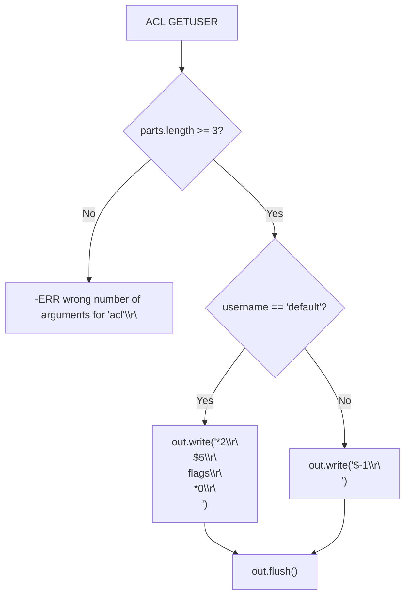
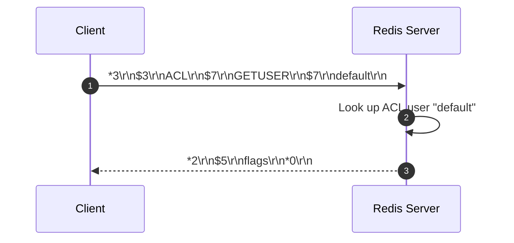

# Stage 108: Respond to ACL GETUSER

---

## In one line
Implement `ACL GETUSER <username>` to introspect user properties, returning a 2-element RESP array containing the bulk string `"flags"` and an empty RESP array for the `"default"` user.

---

## Self-test (cover the answers below and answer these first)
1. **What is the return structure of `ACL GETUSER` in Redis?**
   - *Answer*: A flat RESP array containing alternating property names and property values: `[key1, val1, key2, val2, ...]`.
2. **What does `ACL GETUSER` return if the queried user does not exist?**
   - *Answer*: A RESP null bulk string: `$-1\r\n`.
3. **What is the `flags` property of an ACL user?**
   - *Answer*: An array of strings representing permissions or state flags, such as `"on"`, `"off"`, `"nopass"`, `"allkeys"`, or `"allcommands"`.
4. **What is the exact RESP wire serialization required for `ACL GETUSER default` in this stage?**
   - *Answer*: `*2\r\n$5\r\nflags\r\n*0\r\n`.
5. **How does `ACL GETUSER` serialize an empty array property value in RESP?**
   - *Answer*: As `*0\r\n`.

---

## Problem Solved

In **Stage 108: Respond to ACL GETUSER**, we implement:

1. **`ACL GETUSER` Subcommand Routing**:
   - Matches `parts[0] == "ACL"` and `parts[1] == "GETUSER"`.
   - Requires at least 3 arguments: `ACL GETUSER <username>`.
2. **User Properties Representation**:
   - For the `"default"` user, returns a RESP array of length 2:
     - Element 0: bulk string `"flags"` (`$5\r\nflags\r\n`).
     - Element 1: empty array (`*0\r\n`).
   - For unknown users, returns null bulk string `$-1\r\n`.

---

## Thought Process & Architectural Model

### 1. `ACL GETUSER` Dispatch Flowchart



### 2. End-to-End Sequence Diagram



---

## Full Solution

In [`codecrafters-redis-java/src/main/java/Main.java`](file:///C:/Users/jiten/Documents/Codecrafters-Build-from-scratch/codecrafters-redis-java/src/main/java/Main.java):

```java
    } else if (command.equalsIgnoreCase("ACL")) {
      if (parts.length >= 2 && parts[1].equalsIgnoreCase("WHOAMI")) {
        out.write("$7\r\ndefault\r\n".getBytes(StandardCharsets.UTF_8));
        out.flush();
      } else if (parts.length >= 3 && parts[1].equalsIgnoreCase("GETUSER")) {
        String username = parts[2];
        if (username.equals("default")) {
          out.write("*2\r\n$5\r\nflags\r\n*0\r\n".getBytes(StandardCharsets.UTF_8));
        } else {
          out.write("$-1\r\n".getBytes(StandardCharsets.UTF_8));
        }
        out.flush();
      } else {
        out.write("-ERR unknown subcommand or wrong number of arguments for 'ACL'\r\n".getBytes(StandardCharsets.UTF_8));
        out.flush();
      }
    }
```

---

## Concepts

1. **Nested RESP Collections for Introspection**:
   - Redis introspection commands (`ACL GETUSER`, `CLIENT LIST`, `INFO`) frequently serialize dictionary-like data structures as alternating key-value arrays in RESP2.
2. **User Lifecycle and Built-in Defaults**:
   - Every Redis instance instantiates a default user upon boot. This user cannot be removed (`ACL DELUSER default` fails) and retains administrative control unless explicitly restricted by configuration.

---

## Wire Format

```text
Client: *3\r\n$3\r\nACL\r\n$7\r\nGETUSER\r\n$7\r\ndefault\r\n
Server: *2\r\n$5\r\nflags\r\n*0\r\n
```

---

## Failure Modes

1. **Incorrect Array Arity Header**:
   - Emitting `*1\r\n` or omitting the array framing causes client parsers to read `$5\r\nflags\r\n` without its associated value. The array size must be 2.
2. **Returning Simple String Instead of Nested Array**:
   - The value for `"flags"` must be serialized as an array `*0\r\n`, not `+[]\r\n` or `$-1\r\n`.

---

## Tradeoffs

- **Direct Wire Constant vs Dynamic User Object**:
  - Emitting `*2\r\n$5\r\nflags\r\n*0\r\n` as a pre-computed byte sequence incurs zero heap allocation overhead, which is optimal for read-only user introspection in the initial stages.

---

## Java Specifics

- `StandardCharsets.UTF_8`: Ensures cross-platform binary consistency without reliance on host locale charset encodings.

---

## Rebuild Checklist

1. [x] Intercept `ACL GETUSER` in `handleCommand`.
2. [x] Validate argument count (`parts.length >= 3`).
3. [x] Check for user `"default"`.
4. [x] Emit 2-element RESP array containing bulk string `"flags"` and empty array `*0\r\n`.
5. [x] Emit `$-1\r\n` for non-existent users.
6. [x] Verify compilation with `javac`.
