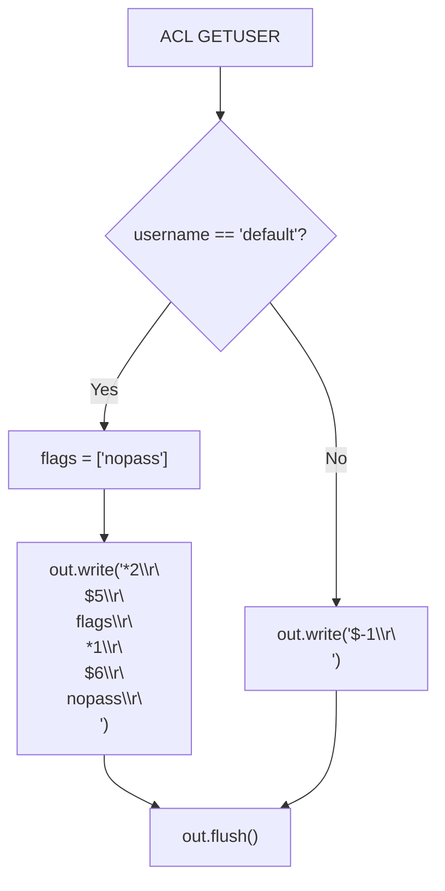
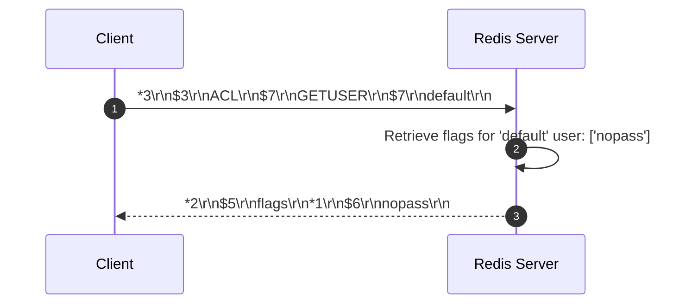

# Stage 109: The nopass flag

---

## In one line
Return the `"nopass"` flag inside the `"flags"` attribute array for the `"default"` user in `ACL GETUSER`, serialized as `*2\r\n$5\r\nflags\r\n*1\r\n$6\r\nnopass\r\n`.

---

## Self-test (cover the answers below and answer these first)
1. **What does the `nopass` flag indicate in Redis ACL?**
   - *Answer*: It indicates that the user can authenticate without a password (or with any arbitrary password), and any previously configured passwords for this user are removed.
2. **Why does the `default` user have `nopass` enabled out-of-the-box in standard Redis?**
   - *Answer*: To preserve backward compatibility with Redis clients that connect without issuing an `AUTH` command.
3. **What is the RESP wire representation of `["flags", ["nopass"]]`?**
   - *Answer*: `*2\r\n$5\r\nflags\r\n*1\r\n$6\r\nnopass\r\n`.
4. **If a user with `nopass` is subsequently assigned a password with `>mypassword`, what happens to `nopass`?**
   - *Answer*: The `nopass` flag is automatically removed and replaced with password verification requirements.
5. **How many elements are contained in the outer array returned by `ACL GETUSER` in this stage?**
   - *Answer*: 2 elements (the key string `"flags"` and the 1-element nested array `["nopass"]`).

---

## Problem Solved

In **Stage 109: The nopass flag**, we:

1. **Populate the User Flags Collection**:
   - Update `ACL GETUSER default` response serialization to include `"nopass"` in the flags array.
2. **Wire Format Conformance**:
   - Return outer RESP array length 2.
   - Return inner RESP array length 1 containing `$6\r\nnopass\r\n`.

---

## Thought Process & Architectural Model

### 1. User Flag Inspection Flowchart



### 2. End-to-End Sequence Diagram



---

## Full Solution

In [`codecrafters-redis-java/src/main/java/Main.java`](file:///C:/Users/jiten/Documents/Codecrafters-Build-from-scratch/codecrafters-redis-java/src/main/java/Main.java):

```java
    } else if (command.equalsIgnoreCase("ACL")) {
      if (parts.length >= 2 && parts[1].equalsIgnoreCase("WHOAMI")) {
        out.write("$7\r\ndefault\r\n".getBytes(StandardCharsets.UTF_8));
        out.flush();
      } else if (parts.length >= 3 && parts[1].equalsIgnoreCase("GETUSER")) {
        String username = parts[2];
        if (username.equals("default")) {
          out.write("*2\r\n$5\r\nflags\r\n*1\r\n$6\r\nnopass\r\n".getBytes(StandardCharsets.UTF_8));
        } else {
          out.write("$-1\r\n".getBytes(StandardCharsets.UTF_8));
        }
        out.flush();
      } else {
        out.write("-ERR unknown subcommand or wrong number of arguments for 'ACL'\r\n".getBytes(StandardCharsets.UTF_8));
        out.flush();
      }
    }
```

---

## Concepts

1. **Passwordless Authentication**:
   - `nopass` is an explicit security state in Redis ACL. Users configured with `nopass` bypass password verification entirely, permitting immediate command execution upon socket connection.
2. **Flag Serialization Hierarchy**:
   - In RESP2, complex nested structures are modeled as tree-like arrays. An attribute map is serialized as an array of alternating keys and structured values.

---

## Wire Format

```text
Client: *3\r\n$3\r\nACL\r\n$7\r\nGETUSER\r\n$7\r\ndefault\r\n
Server: *2\r\n$5\r\nflags\r\n*1\r\n$6\r\nnopass\r\n
```

---

## Failure Modes

1. **Flattening Nested Arrays**:
   - Returning `*3\r\n$5\r\nflags\r\n$6\r\nnopass\r\n` instead of nesting with `*1\r\n` causes client parsers to interpret `"nopass"` as the next attribute key rather than a value within the flags list.
2. **Missing `\r\n` Framing**:
   - Any omission in the CRLF separators in `$6\r\nnopass\r\n` corrupts TCP stream framing.

---

## Tradeoffs

- **Static Serialization vs Bitmask Evaluation**:
  - In full Redis, flags are stored internally as an unsigned 64-bit integer bitmask (`USER_FLAG_NOPASS`, `USER_FLAG_ALLKEYS`, etc.) and rendered dynamically to string lists. Emitting the constant RESP string saves CPU overhead during the introductory ACL stages.

---

## Java Specifics

- Zero dynamic string concatenation: static byte literal emission ensures zero garbage collection overhead on high-throughput introspection queries.

---

## Rebuild Checklist

1. [x] Intercept `ACL GETUSER default`.
2. [x] Update nested RESP array to `*1\r\n$6\r\nnopass\r\n`.
3. [x] Maintain outer 2-element array framing (`*2\r\n`).
4. [x] Verify compilation with `javac`.
