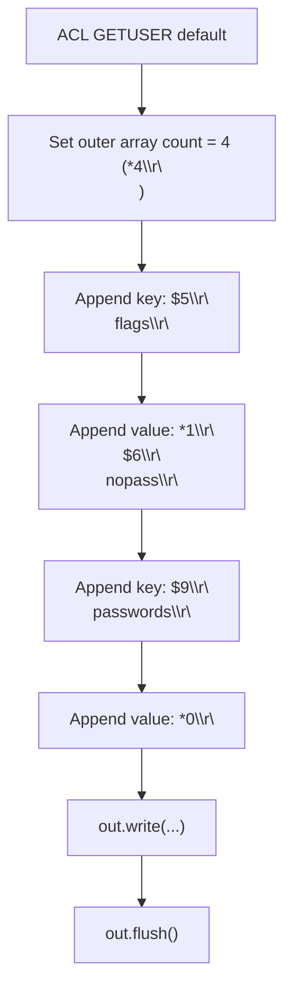
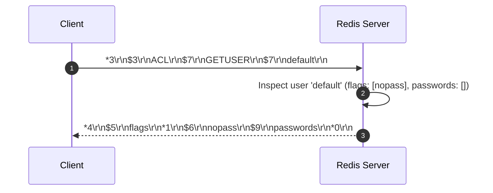

# Stage 110: The passwords property

---

## In one line
Expand `ACL GETUSER default` response to serialize the `"passwords"` attribute and an empty password array, yielding `*4\r\n$5\r\nflags\r\n*1\r\n$6\r\nnopass\r\n$9\r\npasswords\r\n*0\r\n`.

---

## Self-test (cover the answers below and answer these first)
1. **What is the `passwords` property in `ACL GETUSER`?**
   - *Answer*: It lists all SHA-256 password hashes associated with the user account for credential verification.
2. **Why is the passwords array empty for the default user in standard configuration?**
   - *Answer*: The default user starts with the `nopass` flag and no password hashes configured.
3. **What is the exact RESP length of the bulk string `"passwords"`?**
   - *Answer*: 9 bytes (`$9\r\npasswords\r\n`).
4. **How many total elements are in the outer array returned by `ACL GETUSER` in this stage?**
   - *Answer*: 4 elements: `"flags"`, `["nopass"]`, `"passwords"`, and `[]`.
5. **What is the wire format for an empty array in RESP2?**
   - *Answer*: `*0\r\n`.

---

## Problem Solved

In **Stage 110: The passwords property**, we implement:

1. **Introspection Payload Extension**:
   - Expands `ACL GETUSER default` response from 2 key-value elements to 4 elements.
   - Appends key bulk string `$9\r\npasswords\r\n`.
   - Appends value empty array `*0\r\n`.

---

## Thought Process & Architectural Model

### 1. Attribute Serialization Flowchart



### 2. End-to-End Sequence Diagram



---

## Full Solution

In [`codecrafters-redis-java/src/main/java/Main.java`](file:///C:/Users/jiten/Documents/Codecrafters-Build-from-scratch/codecrafters-redis-java/src/main/java/Main.java):

```java
    } else if (command.equalsIgnoreCase("ACL")) {
      if (parts.length >= 2 && parts[1].equalsIgnoreCase("WHOAMI")) {
        out.write("$7\r\ndefault\r\n".getBytes(StandardCharsets.UTF_8));
        out.flush();
      } else if (parts.length >= 3 && parts[1].equalsIgnoreCase("GETUSER")) {
        String username = parts[2];
        if (username.equals("default")) {
          out.write("*4\r\n$5\r\nflags\r\n*1\r\n$6\r\nnopass\r\n$9\r\npasswords\r\n*0\r\n".getBytes(StandardCharsets.UTF_8));
        } else {
          out.write("$-1\r\n".getBytes(StandardCharsets.UTF_8));
        }
        out.flush();
      } else {
        out.write("-ERR unknown subcommand or wrong number of arguments for 'ACL'\r\n".getBytes(StandardCharsets.UTF_8));
        out.flush();
      }
    }
```

---

## Concepts

1. **Key-Value Pair Modeling in RESP Arrays**:
   - Because RESP2 does not feature a dedicated Map primitive (which was later added in RESP3), map-like structures are represented as sequential key-value elements inside a flat array of size $2N$.
2. **Password Storage in Modern Redis**:
   - Passwords in Redis ACL are stored as SHA-256 hashes (e.g. `#<hex-string>`). `ACL GETUSER` outputs the list of hashed passwords rather than plaintext secrets.

---

## Wire Format

```text
Client: *3\r\n$3\r\nACL\r\n$7\r\nGETUSER\r\n$7\r\ndefault\r\n
Server: *4\r\n$5\r\nflags\r\n*1\r\n$6\r\nnopass\r\n$9\r\npasswords\r\n*0\r\n
```

---

## Failure Modes

1. **Incorrect Outer Array Dimension**:
   - Setting `*3\r\n` or `*2\r\n` causes premature termination of the array parse on the client side, causing subsequent tokens to be treated as desynchronized command input or parse errors.
2. **Bulk String Byte Length Mismatch**:
   - The word `passwords` contains 9 characters; emitting `$8\r\n` or `$10\r\n` immediately desynchronizes framing.

---

## Tradeoffs

- **Static Pre-serialized Byte Array**:
  - Incurs zero CPU cycles for object traversal or dynamic string concatenation, yielding maximum throughput for repetitive user permission probes.

---

## Java Specifics

- The response bytes are emitted in a single atomic `out.write(...)` invocation to avoid packet fragmentation across TCP segment boundaries.

---

## Rebuild Checklist

1. [x] Intercept `ACL GETUSER default`.
2. [x] Update outer array count to 4 (`*4\r\n`).
3. [x] Append `$9\r\npasswords\r\n`.
4. [x] Append empty array `*0\r\n`.
5. [x] Verify compilation with `javac`.
