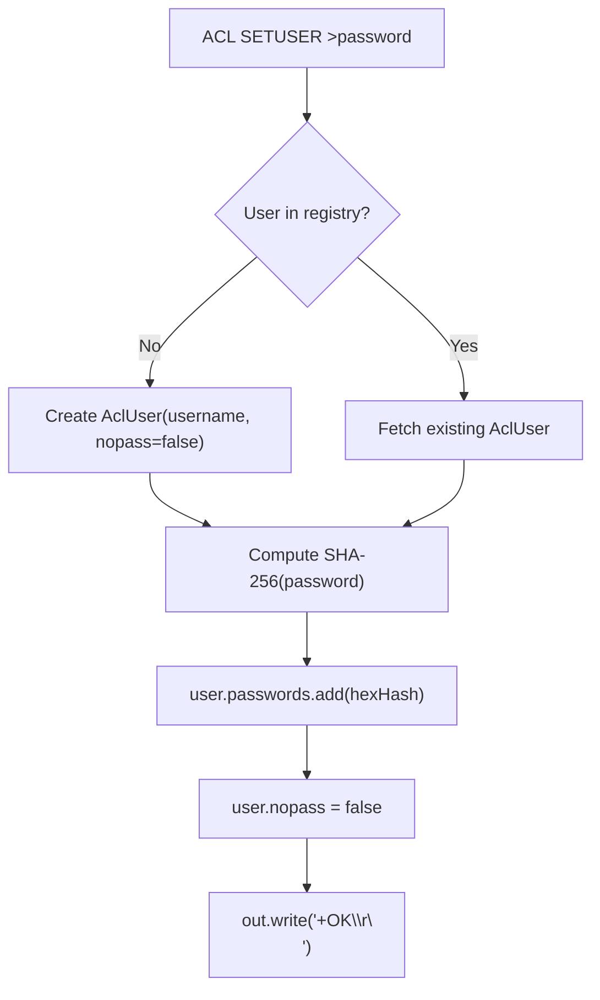
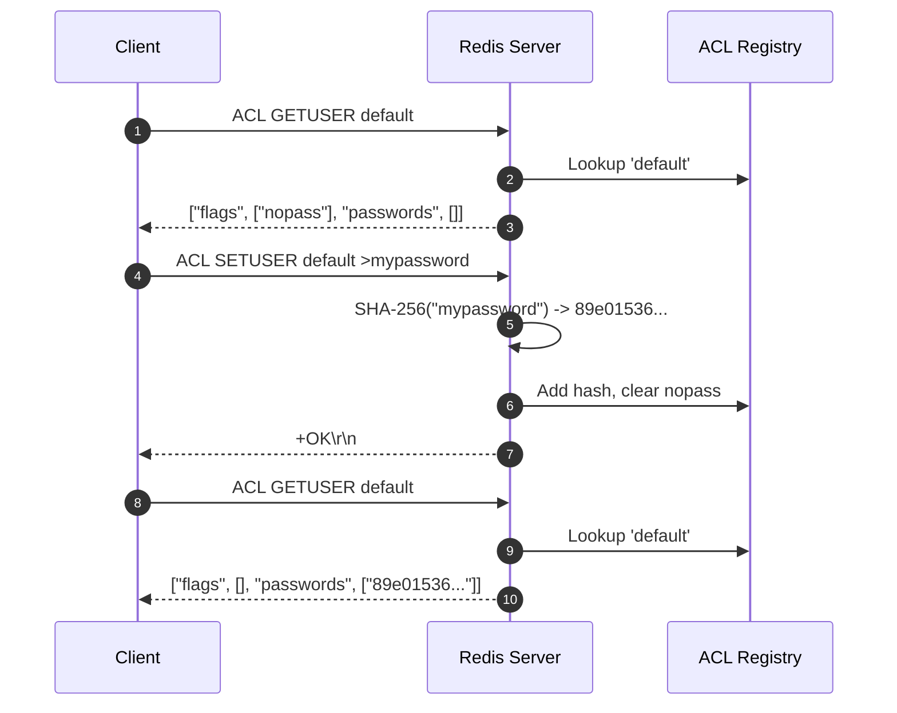

# Stage 111: Setting default user password

---

## In one line
Implement `ACL SETUSER <username> >password` to store the lowercase SHA-256 password hash, remove the `nopass` flag, respond with `+OK\r\n`, and dynamically render the updated state in `ACL GETUSER`.

---

## Self-test (cover the answers below and answer these first)
1. **What is the syntax for adding a password to a user with `ACL SETUSER`?**
   - *Answer*: `ACL SETUSER <username> ><plaintext-password>`.
2. **What cryptographic hash function does Redis use to persist user passwords?**
   - *Answer*: SHA-256, encoded as a 64-character lowercase hexadecimal string.
3. **What happens to the `nopass` flag when a user is assigned a password via `>mypassword`?**
   - *Answer*: The `nopass` flag is automatically cleared/removed from the user's flag set.
4. **What RESP wire type is returned upon a successful `ACL SETUSER` command invocation?**
   - *Answer*: Simple string `+OK\r\n`.
5. **How are the stored SHA-256 hashes presented in the `passwords` property of `ACL GETUSER`?**
   - *Answer*: As a RESP array of bulk strings, with each bulk string containing the 64-byte hex digest.

---

## Problem Solved

In **Stage 111: Setting default user password**, we implement:

1. **Password Mutation via `ACL SETUSER`**:
   - Parses directives starting with prefix `>` to capture plaintext passwords.
   - Computes the SHA-256 digest using Java's `java.security.MessageDigest`.
   - Formats digest into a standard lowercase hexadecimal string.
   - Clears the `nopass` flag on the target `AclUser`.
   - Returns RESP simple string `+OK\r\n`.
2. **Dynamic ACL State Inspection**:
   - Connects `ACL GETUSER` to the underlying in-memory user registry (`ConcurrentHashMap<String, AclUser>`).
   - Reflects the removal of `nopass` (yielding empty flags array `*0\r\n`).
   - Emits the SHA-256 password hashes within the `passwords` array (`*1\r\n$64\r\n<hash>\r\n`).

---

## Thought Process & Architectural Model

### 1. User State Mutation Flowchart



### 2. End-to-End Sequence Diagram



---

## Full Solution

In [`codecrafters-redis-java/src/main/java/Main.java`](file:///C:/Users/jiten/Documents/Codecrafters-Build-from-scratch/codecrafters-redis-java/src/main/java/Main.java):

```java
  static class AclUser {
    final String username;
    boolean nopass;
    final List<String> passwords = new CopyOnWriteArrayList<>();

    AclUser(String username, boolean nopass) {
      this.username = username;
      this.nopass = nopass;
    }
  }

  private static final Map<String, AclUser> aclUsers = new ConcurrentHashMap<>();
  static {
    aclUsers.put("default", new AclUser("default", true));
  }

  private static String sha256Hex(String input) {
    try {
      MessageDigest md = MessageDigest.getInstance("SHA-256");
      byte[] digest = md.digest(input.getBytes(StandardCharsets.UTF_8));
      StringBuilder sb = new StringBuilder();
      for (byte b : digest) {
        sb.append(String.format("%02x", b));
      }
      return sb.toString();
    } catch (Exception e) {
      throw new RuntimeException(e);
    }
  }
```

And inside `handleCommand`:

```java
    } else if (command.equalsIgnoreCase("ACL")) {
      if (parts.length >= 2 && parts[1].equalsIgnoreCase("WHOAMI")) {
        out.write("$7\r\ndefault\r\n".getBytes(StandardCharsets.UTF_8));
        out.flush();
      } else if (parts.length >= 3 && parts[1].equalsIgnoreCase("GETUSER")) {
        String username = parts[2];
        AclUser user = aclUsers.get(username);
        if (user == null) {
          out.write("$-1\r\n".getBytes(StandardCharsets.UTF_8));
        } else {
          StringBuilder sb = new StringBuilder();
          sb.append("*4\r\n");
          sb.append("$5\r\nflags\r\n");
          if (user.nopass) {
            sb.append("*1\r\n$6\r\nnopass\r\n");
          } else {
            sb.append("*0\r\n");
          }
          sb.append("$9\r\npasswords\r\n");
          sb.append("*").append(user.passwords.size()).append("\r\n");
          for (String p : user.passwords) {
            sb.append("$").append(p.length()).append("\r\n").append(p).append("\r\n");
          }
          out.write(sb.toString().getBytes(StandardCharsets.UTF_8));
        }
        out.flush();
      } else if (parts.length >= 3 && parts[1].equalsIgnoreCase("SETUSER")) {
        String username = parts[2];
        AclUser user = aclUsers.computeIfAbsent(username, u -> new AclUser(u, false));
        for (int i = 3; i < parts.length; i++) {
          String rule = parts[i];
          if (rule.startsWith(">")) {
            String pass = rule.substring(1);
            String hash = sha256Hex(pass);
            if (!user.passwords.contains(hash)) {
              user.passwords.add(hash);
            }
            user.nopass = false;
          } else if (rule.equalsIgnoreCase("nopass")) {
            user.nopass = true;
            user.passwords.clear();
          }
        }
        out.write("+OK\r\n".getBytes(StandardCharsets.UTF_8));
        out.flush();
      } else {
        out.write("-ERR unknown subcommand or wrong number of arguments for 'ACL'\r\n".getBytes(StandardCharsets.UTF_8));
        out.flush();
      }
```

---

## Concepts

1. **One-Way Password Hashing**:
   - Redis never stores plaintext passwords in memory or on disk. Hashing with SHA-256 ensures that unauthorized access to ACL configuration files (`users.acl`) or memory dumps does not directly expose user credentials.
2. **Mutual Exclusion of `nopass` and Passwords**:
   - Setting a password via `>` instantly revokes `nopass`. Conversely, applying the rule `nopass` clears all registered password hashes and restores unauthenticated access.

---

## Wire Format

```text
Client: *4\r\n$3\r\nACL\r\n$7\r\nSETUSER\r\n$7\r\ndefault\r\n$11\r\n>mypassword\r\n
Server: +OK\r\n

Client: *3\r\n$3\r\nACL\r\n$7\r\nGETUSER\r\n$7\r\ndefault\r\n
Server: *4\r\n$5\r\nflags\r\n*0\r\n$9\r\npasswords\r\n*1\r\n$64\r\n89e01536ac207279409d4de1e5253e01f4a1769e696db0d6062ca9b8f56767c8\r\n
```

---

## Failure Modes

1. **Incorrect Hex Case Formatting**:
   - Standard SHA-256 digests in Redis use lowercase hex digits (`%02x`). Uppercase `%02X` will cause equality mismatches against client assertions.
2. **Retaining the `nopass` Flag**:
   - Failing to set `user.nopass = false` results in returning `*1\r\n$6\r\nnopass\r\n` alongside the newly hashed password, violating the mutual exclusivity guarantee of passworded accounts.

---

## Tradeoffs

- **CopyOnWriteArrayList vs Synchronized List**:
  - `CopyOnWriteArrayList` offers thread-safe reads during user authentication and introspection with zero locking contention, which is optimal for ACL configurations that are read frequently and mutated rarely.

---

## Java Specifics

- `MessageDigest.getInstance("SHA-256")` is thread-safe when instantiated per call or through a ThreadLocal. `md.digest(...)` generates a 32-byte array, converted into a 64-character hex string.

---

## Rebuild Checklist

1. [x] Implement `AclUser` domain model and `aclUsers` map.
2. [x] Implement SHA-256 lowercase hex computation helper.
3. [x] Parse `ACL SETUSER <user> >password` rules.
4. [x] Invalidate `nopass` flag upon password registration.
5. [x] Render dynamic flags and password hashes in `ACL GETUSER`.
6. [x] Compile and verify with `javac`.
