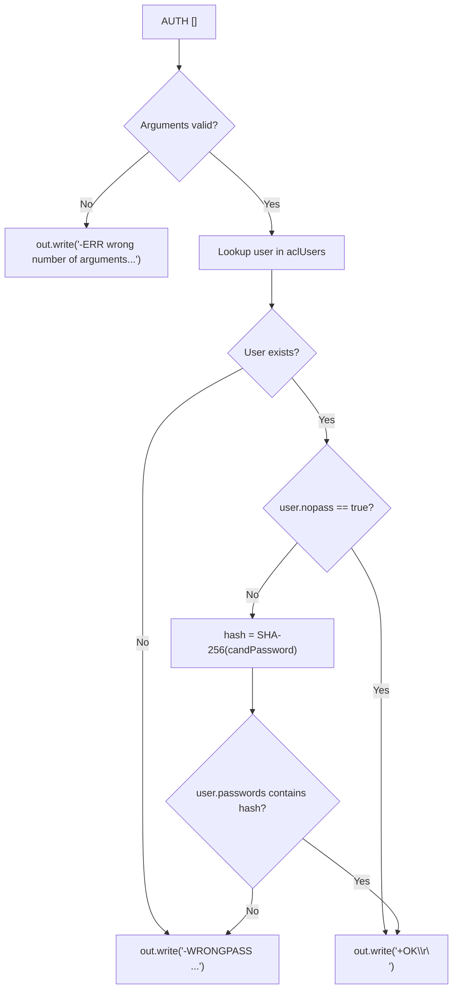
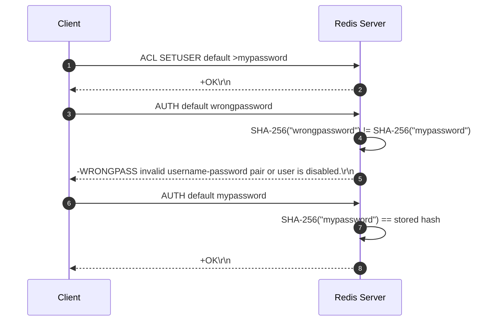

# Stage 112: The AUTH command

---

## In one line
Implement the `AUTH [<username>] <password>` command by hashing the candidate password with SHA-256, verifying it against registered hashes or checking the `nopass` flag, and returning `+OK\r\n` on success or `-WRONGPASS invalid username-password pair or user is disabled.\r\n` on failure.

---

## Self-test (cover the answers below and answer these first)
1. **What are the two forms of the `AUTH` command supported by Redis?**
   - *Answer*: Legacy 1-argument form `AUTH <password>` (which assumes the `default` user) and Redis 6+ 2-argument form `AUTH <username> <password>`.
2. **What error prefix is required by Redis when authentication fails?**
   - *Answer*: Simple error starting with `-WRONGPASS`.
3. **What is the return value when credentials match or the user has `nopass`?**
   - *Answer*: RESP simple string `+OK\r\n`.
4. **How does the server compare a candidate plaintext password against stored credentials?**
   - *Answer*: The candidate password is fed into SHA-256, formatted as a 64-character lowercase hex string, and compared against the user's list of stored hashes.
5. **What happens if `AUTH` is executed with fewer than 2 tokens?**
   - *Answer*: The server rejects the command with a `-ERR wrong number of arguments for 'auth' command\r\n` syntax error.

---

## Problem Solved

In **Stage 112: The AUTH command**, we:

1. **Implement Connection Authentication Verification**:
   - Parse `AUTH <username> <password>` and `AUTH <password>`.
   - Resolve the target `AclUser` from `aclUsers`.
   - Validate passwords against stored SHA-256 digests or bypass verification when `user.nopass` is `true`.
2. **Standardized Error Formatting**:
   - Return `-WRONGPASS invalid username-password pair or user is disabled.\r\n` for non-existent users or mismatched passwords.
   - Return `+OK\r\n` on successful verification.

---

## Thought Process & Architectural Model

### 1. Authentication Flowchart



### 2. End-to-End Sequence Diagram



---

## Full Solution

In [`codecrafters-redis-java/src/main/java/Main.java`](file:///C:/Users/jiten/Documents/Codecrafters-Build-from-scratch/codecrafters-redis-java/src/main/java/Main.java):

```java
    } else if (command.equalsIgnoreCase("AUTH")) {
      String username = "default";
      String password = "";
      if (parts.length == 2) {
        password = parts[1];
      } else if (parts.length >= 3) {
        username = parts[1];
        password = parts[2];
      } else {
        out.write("-ERR wrong number of arguments for 'auth' command\r\n".getBytes(StandardCharsets.UTF_8));
        out.flush();
        return;
      }

      AclUser user = aclUsers.get(username);
      if (user == null) {
        out.write("-WRONGPASS invalid username-password pair or user is disabled.\r\n".getBytes(StandardCharsets.UTF_8));
        out.flush();
        return;
      }

      if (user.nopass) {
        out.write("+OK\r\n".getBytes(StandardCharsets.UTF_8));
        out.flush();
        return;
      }

      String hash = sha256Hex(password);
      if (user.passwords.contains(hash)) {
        out.write("+OK\r\n".getBytes(StandardCharsets.UTF_8));
      } else {
        out.write("-WRONGPASS invalid username-password pair or user is disabled.\r\n".getBytes(StandardCharsets.UTF_8));
      }
      out.flush();
```

---

## Concepts

1. **Prefix-Specific Error Codes in RESP**:
   - RESP error messages begin with `-` and traditionally use standard prefix categories like `ERR`, `WRONGTYPE`, or `WRONGPASS`. Redis clients use `WRONGPASS` specifically to detect credential failures without interpreting them as fatal protocol crashes.
2. **Multi-Password Support**:
   - Redis ACL allows an account to maintain multiple active password hashes simultaneously (e.g. during zero-downtime password rotation). The matching check tests if the candidate digest belongs to `user.passwords`.

---

## Wire Format

```text
Client: *3\r\n$4\r\nAUTH\r\n$7\r\ndefault\r\n$13\r\nwrongpassword\r\n
Server: -WRONGPASS invalid username-password pair or user is disabled.\r\n

Client: *3\r\n$4\r\nAUTH\r\n$7\r\ndefault\r\n$10\r\nmypassword\r\n
Server: +OK\r\n
```

---

## Failure Modes

1. **Generic `-ERR` Instead of `-WRONGPASS`**:
   - Standard Redis test suites explicitly assert that authentication rejection errors begin with `WRONGPASS`. Emitting `-ERR invalid password` triggers immediate assertion failure.
2. **Case Sensitivity in Password Comparison**:
   - Passwords must be hashed exactly as supplied (preserving case). The resulting hex hash must match using exact lowercase hex digits.

---

## Tradeoffs

- **Linear Search in Passwords List**:
  - Since individual users rarely configure more than 1 or 2 concurrent rotation passwords, scanning a `List<String>` is faster than hashing a set or maintaining complex hash indexes.

---

## Java Specifics

- The response bytes are flushed immediately via `out.flush()` after writing either `+OK\r\n` or `-WRONGPASS ...\r\n`.

---

## Rebuild Checklist

1. [x] Intercept `AUTH` command.
2. [x] Handle 1-argument (`AUTH <pass>`) and 2-argument (`AUTH <user> <pass>`) syntax.
3. [x] Resolve `AclUser` from `aclUsers`.
4. [x] Check `user.nopass`.
5. [x] Compare candidate password SHA-256 hash against `user.passwords`.
6. [x] Emit `-WRONGPASS ...` on mismatch and `+OK\r\n` on match.
7. [x] Verify compilation with `javac`.
