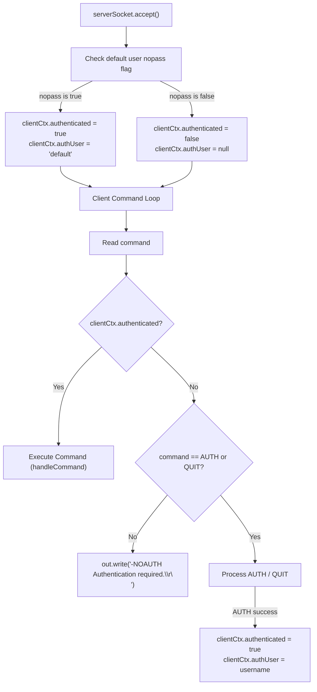
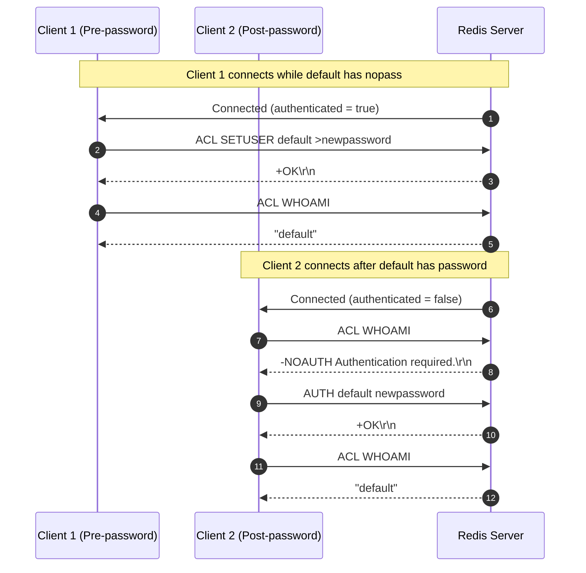

# Stage 113: Enforce authentication

---

## In one line
Gate client command processing with connection-level authentication state initialized from the `default` user's `nopass` flag at connection time, rejecting unauthenticated commands with `-NOAUTH Authentication required.\r\n` while allowing `AUTH` to authenticate the session.

---

## Self-test (cover the answers below and answer these first)
1. **When does Redis determine whether a new connection starts as authenticated?**
   - *Answer*: At connection accept time; if `default` user has the `nopass` flag active, the connection begins authenticated as `default`.
2. **What happens to connections that were established prior to setting a password on `default`?**
   - *Answer*: Existing connections stay authenticated; setting a password does not retroactively disconnect or de-authenticate active clients.
3. **What error message is emitted when an unauthenticated client tries to run a command?**
   - *Answer*: `-NOAUTH Authentication required.\r\n`.
4. **Which command must bypass the authentication gate on an unauthenticated connection?**
   - *Answer*: `AUTH` (and optionally `QUIT`), allowing clients to present credentials and transition to authenticated state.
5. **How does successful invocation of `AUTH` update connection state?**
   - *Answer*: It sets `clientCtx.authenticated = true` and `clientCtx.authUser = username`.

---

## Problem Solved

In **Stage 113: Enforce authentication**, we:

1. **Track Per-Connection Authentication State**:
   - Added `boolean authenticated` and `String authUser` to `ClientContext`.
   - On socket accept, initialized authentication based on whether `aclUsers.get("default").nopass` is `true`.
2. **Implement the Authentication Barrier**:
   - Guarded the client command loop: if `!clientCtx.authenticated` and command is not `AUTH` or `QUIT`, immediately emit `-NOAUTH Authentication required.\r\n`.
3. **Update State on `AUTH` and `ACL WHOAMI`**:
   - Successful `AUTH` updates the connection's `clientCtx.authenticated = true` and `clientCtx.authUser`.
   - `ACL WHOAMI` reports the connection's authenticated username.

---

## Thought Process & Architectural Model

### 1. Connection Lifecycle and Auth Gate Flowchart



### 2. End-to-End Sequence Diagram



---

## Full Solution

In [`codecrafters-redis-java/src/main/java/Main.java`](file:///C:/Users/jiten/Documents/Codecrafters-Build-from-scratch/codecrafters-redis-java/src/main/java/Main.java):

```java
  private static class ClientContext {
    final Set<String> watchedKeys = ConcurrentHashMap.newKeySet();
    volatile boolean dirtyCas = false;
    final Set<String> subscribedChannels = ConcurrentHashMap.newKeySet();
    OutputStream out;
    boolean authenticated = true;
    String authUser = "default";
  }
```

Connection initialization in the accept loop:

```java
      while (true) {
        Socket clientSocket = serverSocket.accept();

        new Thread(() -> {
          ClientContext clientCtx = new ClientContext();
          AclUser defUser = aclUsers.get("default");
          if (defUser != null && defUser.nopass) {
            clientCtx.authenticated = true;
            clientCtx.authUser = "default";
          } else {
            clientCtx.authenticated = false;
            clientCtx.authUser = null;
          }
```

Authentication barrier in client processing loop:

```java
              String command = parts[0];

              if (command.equalsIgnoreCase("QUIT")) {
                out.write("+OK\r\n".getBytes(StandardCharsets.UTF_8));
                out.flush();
                break;
              }

              if (!clientCtx.authenticated) {
                if (!command.equalsIgnoreCase("AUTH")) {
                  out.write("-NOAUTH Authentication required.\r\n".getBytes(StandardCharsets.UTF_8));
                  out.flush();
                  continue;
                }
              }
```

Dynamic connection elevation on `AUTH`:

```java
      if (user.nopass) {
        if (clientCtx != null) {
          clientCtx.authenticated = true;
          clientCtx.authUser = username;
        }
        out.write("+OK\r\n".getBytes(StandardCharsets.UTF_8));
        out.flush();
        return;
      }

      String hash = sha256Hex(password);
      if (user.passwords.contains(hash)) {
        if (clientCtx != null) {
          clientCtx.authenticated = true;
          clientCtx.authUser = username;
        }
        out.write("+OK\r\n".getBytes(StandardCharsets.UTF_8));
      } else {
        out.write("-WRONGPASS invalid username-password pair or user is disabled.\r\n".getBytes(StandardCharsets.UTF_8));
      }
      out.flush();
```

---

## Concepts

1. **Stateful Connection-Level Authentication**:
   - Authentication is a property of the active transport session (`ClientContext`), not a global or per-query toggle. Existing open sockets preserve their authentication token across global user mutations.
2. **The `NOAUTH` Protocol Barrier**:
   - RFC/RESP specification mandates that unauthenticated connections receive `-NOAUTH ...` for any command attempt except authentication commands.

---

## Wire Format

```text
Client 1: *4\r\n$3\r\nACL\r\n$7\r\nSETUSER\r\n$7\r\ndefault\r\n$12\r\n>newpassword\r\n
Server: +OK\r\n
Client 1: *2\r\n$3\r\nACL\r\n$6\r\nWHOAMI\r\n
Server: $7\r\ndefault\r\n

Client 2 (New Connection):
Client 2: *2\r\n$3\r\nACL\r\n$6\r\nWHOAMI\r\n
Server: -NOAUTH Authentication required.\r\n
Client 2: *3\r\n$4\r\nAUTH\r\n$7\r\ndefault\r\n$11\r\nnewpassword\r\n
Server: +OK\r\n
Client 2: *2\r\n$3\r\nACL\r\n$6\r\nWHOAMI\r\n
Server: $7\r\ndefault\r\n
```

---

## Failure Modes

1. **Retroactively Invalidating Active Connections**:
   - Invalidating already-connected clients when `ACL SETUSER default >pass` executes will break Redis clients that logged in prior to the credential change.
2. **Blocking the `AUTH` Command**:
   - Checking authentication before verifying if `command.equalsIgnoreCase("AUTH")` creates a deadlock where unauthenticated clients can never authenticate.

---

## Tradeoffs

- **Per-Socket Flag vs Global Token**:
  - Managing boolean flags on `ClientContext` incurs negligible memory footprint (1 byte boolean + reference) while avoiding synchronized token lookups per incoming command.

---

## Java Specifics

- The overload `handleCommand(String[] parts, OutputStream out, ClientContext clientCtx)` cleanly decouples internal invocations (like AOF playback or replica command handling) from client socket state.

---

## Rebuild Checklist

1. [x] Add `boolean authenticated` and `String authUser` to `ClientContext`.
2. [x] Initialize client auth state from `aclUsers.get("default").nopass` on socket accept.
3. [x] Intercept unauthenticated commands and reply with `-NOAUTH Authentication required.\r\n`.
4. [x] Whitelist `AUTH` (and `QUIT`) in the auth gate.
5. [x] Elevate `clientCtx` on successful `AUTH`.
6. [x] Return authenticated user in `ACL WHOAMI`.
7. [x] Verify compilation with `javac`.
