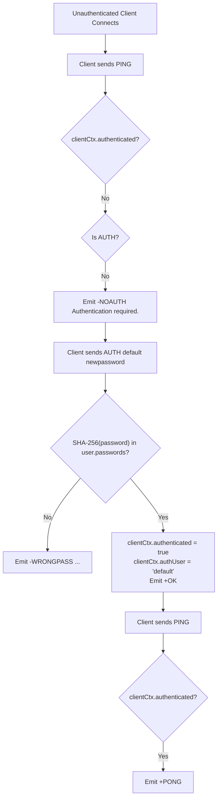
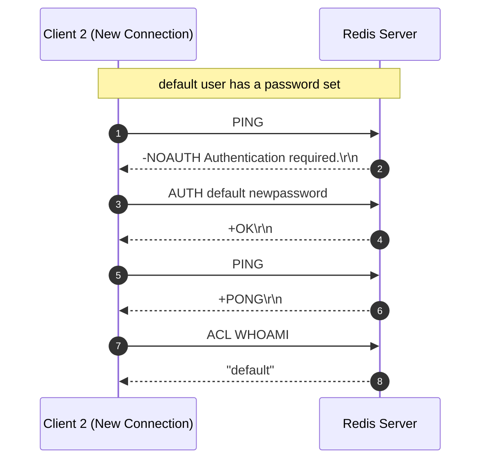

# Stage 114: Authenticate using AUTH

---

## In one line
Transition unauthenticated client connections to authenticated state upon successful verification of credentials supplied via `AUTH <password>` or `AUTH <username> <password>`, clearing the `NOAUTH` barrier for all subsequent commands on the connection.

---

## Self-test (cover the answers below and answer these first)
1. **Does authentication expire automatically per command or persist across the connection lifecycle?**
   - *Answer*: It persists across the entire connection lifecycle unless explicitly mutated.
2. **What response is returned when an unauthenticated client sends a `PING` command?**
   - *Answer*: `-NOAUTH Authentication required.\r\n`.
3. **What response is returned when `AUTH default newpassword` succeeds?**
   - *Answer*: `+OK\r\n`.
4. **What response is returned to a `PING` command immediately after a successful `AUTH`?**
   - *Answer*: `+PONG\r\n`.
5. **Which command is permitted to execute even when `clientCtx.authenticated` is false?**
   - *Answer*: `AUTH` (and `QUIT`).

---

## Problem Solved

In **Stage 114: Authenticate using AUTH**, we:

1. **Enforce Pre-Authentication Command Rejection**:
   - Every command (e.g. `PING`, `GET`, `SET`, `ACL WHOAMI`) arriving on an unauthenticated connection receives `-NOAUTH Authentication required.\r\n`.
2. **Permit In-Flight Authentication via `AUTH`**:
   - The connection loop specifically allows `AUTH` requests to bypass the `NOAUTH` barrier.
3. **Session Elevation upon Password Match**:
   - When the supplied password SHA-256 hash matches the user's registered password hashes, `clientCtx.authenticated` is set to `true` and `clientCtx.authUser` is set to the authenticated username.
4. **Post-Authentication Command Processing**:
   - All subsequent commands on the elevated connection execute normally without requiring further authentication.

---

## Thought Process & Architectural Model

### 1. Connection Authentication Flowchart



### 2. End-to-End Sequence Diagram



---

## Full Solution

In [`codecrafters-redis-java/src/main/java/Main.java`](file:///C:/Users/jiten/Documents/Codecrafters-Build-from-scratch/codecrafters-redis-java/src/main/java/Main.java):

Connection context tracking:

```java
  private static class ClientContext {
    final Set<String> watchedKeys = ConcurrentHashMap.newKeySet();
    volatile boolean dirtyCas = false;
    final Set<String> subscribedChannels = ConcurrentHashMap.newKeySet();
    OutputStream out;
    boolean authenticated = true;
    String authUser = "default";
  }
```

Pre-authentication command gate:

```java
              String command = parts[0];

              if (command.equalsIgnoreCase("QUIT")) {
                out.write("+OK\r\n".getBytes(StandardCharsets.UTF_8));
                out.flush();
                break;
              }

              if (!clientCtx.authenticated) {
                if (!command.equalsIgnoreCase("AUTH")) {
                  out.write("-NOAUTH Authentication required.\r\n".getBytes(StandardCharsets.UTF_8));
                  out.flush();
                  continue;
                }
              }
```

Handling the `AUTH` command and session elevation:

```java
    } else if (command.equalsIgnoreCase("AUTH")) {
      String username = "default";
      String password = "";
      if (parts.length == 2) {
        password = parts[1];
      } else if (parts.length >= 3) {
        username = parts[1];
        password = parts[2];
      } else {
        out.write("-ERR wrong number of arguments for 'auth' command\r\n".getBytes(StandardCharsets.UTF_8));
        out.flush();
        return;
      }

      AclUser user = aclUsers.get(username);
      if (user == null) {
        out.write("-WRONGPASS invalid username-password pair or user is disabled.\r\n".getBytes(StandardCharsets.UTF_8));
        out.flush();
        return;
      }

      if (user.nopass) {
        if (clientCtx != null) {
          clientCtx.authenticated = true;
          clientCtx.authUser = username;
        }
        out.write("+OK\r\n".getBytes(StandardCharsets.UTF_8));
        out.flush();
        return;
      }

      String hash = sha256Hex(password);
      if (user.passwords.contains(hash)) {
        if (clientCtx != null) {
          clientCtx.authenticated = true;
          clientCtx.authUser = username;
        }
        out.write("+OK\r\n".getBytes(StandardCharsets.UTF_8));
      } else {
        out.write("-WRONGPASS invalid username-password pair or user is disabled.\r\n".getBytes(StandardCharsets.UTF_8));
      }
      out.flush();
```

---

## Concepts

1. **Authentication State Machine**:
   - Sockets begin in `UNAUTHENTICATED` state when default user has password protection enabled.
   - Sockets transition monotonically from `UNAUTHENTICATED` to `AUTHENTICATED` when `AUTH` receives valid credentials.
2. **Exemption of Handshake Commands**:
   - `AUTH` and `QUIT` are fundamentally exempt from the auth gate; without `AUTH` being exempt, an unauthenticated connection could never authorize itself.

---

## Wire Format

```text
Client: *1\r\n$4\r\nPING\r\n
Server: -NOAUTH Authentication required.\r\n

Client: *3\r\n$4\r\nAUTH\r\n$7\r\ndefault\r\n$11\r\nnewpassword\r\n
Server: +OK\r\n

Client: *1\r\n$4\r\nPING\r\n
Server: +PONG\r\n
```

---

## Failure Modes

1. **Re-authenticating Per Command**:
   - If `clientCtx.authenticated` were reset between requests, clients would be forced to authenticate repeatedly. State is saved on the `ClientContext` instance servicing the persistent TCP connection.
2. **Case Insensitivity**:
   - Redis commands are case-insensitive. `AUTH`, `auth`, and `Auth` must all bypass the `NOAUTH` check.

---

## Tradeoffs

- **Direct Mutation of ClientContext**:
  - Updating `clientCtx.authenticated` directly within the thread executing `handleCommand` requires no thread synchronization because each client connection runs in its own dedicated thread.

---

## Java Specifics

- `StandardCharsets.UTF_8` is used for consistent encoding and string comparison.
- `sha256Hex` computes the hex digest without third-party dependencies using standard JDK `java.security.MessageDigest`.

---

## Rebuild Checklist

1. [x] Intercept commands on unauthenticated sockets and reply with `-NOAUTH Authentication required.\r\n`.
2. [x] Exclude `AUTH` and `QUIT` from the `NOAUTH` check.
3. [x] Verify credentials using SHA-256 against `user.passwords`.
4. [x] Set `clientCtx.authenticated = true` upon credential verification.
5. [x] Process subsequent commands normally.
6. [x] Verify compilation with `javac`.
