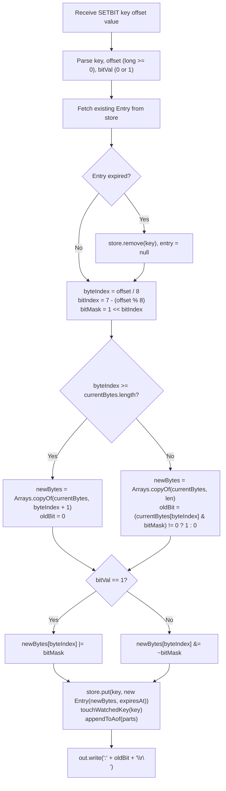

# Stage 115: Create a bitmap

---

## In one line
Implement bit-level byte manipulation via the `SETBIT key offset value` command, storing bitmaps directly as binary string byte arrays in the main key-value store and returning the original bit at the target offset as a RESP integer.

---

## Self-test (cover the answers below and answer these first)
1. **In Redis, are bitmaps a separate data type or are they stored as strings?**
   - *Answer*: Bitmaps are not a separate data type; they are strings accessed and mutated at the bit level.
2. **In Redis bit numbering, does offset 0 correspond to the most significant bit (MSB) or least significant bit (LSB) of the first byte?**
   - *Answer*: Most significant bit (MSB, `1 << 7` or `0x80`).
3. **If `SETBIT key 1 1` is executed on an empty key, what byte value is stored?**
   - *Answer*: `01000000` (binary) or `0x40` (decimal 64).
4. **What does `SETBIT` return when setting a bit on a previously non-existent key?**
   - *Answer*: `:0\r\n` (the previous bit value was 0, encoded as a RESP integer).
5. **If the target bit offset exceeds the current byte length of the string, what happens to intermediate bytes?**
   - *Answer*: The string automatically extends with zero-filled bytes (`0x00`) up to the required byte index.

---

## Problem Solved

In **Stage 115: Create a bitmap**, we:

1. **Integrated Bitmaps into the String Store**:
   - Reused the primary `store` map (`Map<String, Entry>`) rather than creating a disparate data structure, aligning with Redis architecture where bitmaps are strings.
2. **Implemented `SETBIT key offset value`**:
   - Parsed and validated the key, bit offset (non-negative integer), and target bit value (0 or 1).
   - Computed the byte index (`offset / 8`) and the bit mask (`1 << (7 - (offset % 8))`).
   - Dynamically resized the underlying byte array when `byteIndex >= currentBytes.length`.
   - Extracted the original bit value (0 or 1) and mutated the target bit using bitwise operators (`|` or `& ~`).
   - Emitted the original bit as a RESP integer `:oldBit\r\n`.

---

## Thought Process & Architectural Model

### 1. Bit Mapping Model

Within any byte $B$, bit offsets 0 through 7 map from MSB to LSB:

```text
Byte Index: 0
Bits:       [ 0   1   2   3   4   5   6   7 ]
Mask:        128  64  32  16   8   4   2   1
Binary:      0x80 0x40 0x20 0x10 0x08 0x04 0x02 0x01
```

For any arbitrary offset $k$:
$$\text{byteIndex} = \lfloor k / 8 \rfloor$$
$$\text{bitIndex} = 7 - (k \pmod 8)$$
$$\text{bitMask} = 1 \ll \text{bitIndex}$$

### 2. State & Execution Flowchart



---

## Full Solution

In [`codecrafters-redis-java/src/main/java/Main.java`](file:///C:/Users/jiten/Documents/Codecrafters-Build-from-scratch/codecrafters-redis-java/src/main/java/Main.java):

1. **Binary-Safe `Entry` Representation**:

```java
  private static class Entry {
    final String value;
    final byte[] rawBytes;
    final Long expiresAt;

    Entry(String value, Long expiresAt) {
      this.value = value;
      this.rawBytes = value.getBytes(StandardCharsets.ISO_8859_1);
      this.expiresAt = expiresAt;
    }

    Entry(byte[] rawBytes, Long expiresAt) {
      this.rawBytes = rawBytes;
      this.value = new String(rawBytes, StandardCharsets.ISO_8859_1);
      this.expiresAt = expiresAt;
    }

    boolean isExpired() {
      return expiresAt != null && System.currentTimeMillis() > expiresAt;
    }
  }
```

2. **Binary-Safe `GET` Serializer**:

```java
      if (entry != null && !entry.isExpired()) {
        byte[] bytes = entry.rawBytes;
        out.write(("$" + bytes.length + "\r\n").getBytes(StandardCharsets.UTF_8));
        out.write(bytes);
        out.write("\r\n".getBytes(StandardCharsets.UTF_8));
      } else {
        out.write("$-1\r\n".getBytes(StandardCharsets.UTF_8));
      }
```

3. **`SETBIT` Handler in `handleCommand`**:

```java
    } else if (command.equalsIgnoreCase("SETBIT")) {
      if (parts.length < 4) {
        out.write("-ERR wrong number of arguments for 'setbit' command\r\n".getBytes(StandardCharsets.UTF_8));
        out.flush();
        return;
      }
      String rawKey = parts[1];
      String key = stripQuotes(rawKey);

      long offset;
      try {
        offset = Long.parseLong(parts[2]);
      } catch (NumberFormatException e) {
        out.write("-ERR bit offset is not an integer or out of range\r\n".getBytes(StandardCharsets.UTF_8));
        out.flush();
        return;
      }
      if (offset < 0) {
        out.write("-ERR bit offset is not an integer or out of range\r\n".getBytes(StandardCharsets.UTF_8));
        out.flush();
        return;
      }

      int bitVal;
      try {
        bitVal = Integer.parseInt(parts[3]);
      } catch (NumberFormatException e) {
        out.write("-ERR bit is not an integer or out of range\r\n".getBytes(StandardCharsets.UTF_8));
        out.flush();
        return;
      }
      if (bitVal != 0 && bitVal != 1) {
        out.write("-ERR bit is not an integer or out of range\r\n".getBytes(StandardCharsets.UTF_8));
        out.flush();
        return;
      }

      Entry entry = store.get(key);
      if (entry == null && !key.equals(rawKey)) {
        entry = store.get(rawKey);
      }
      if (entry != null && entry.isExpired()) {
        store.remove(key);
        entry = null;
      }

      byte[] currentBytes = (entry != null) ? entry.rawBytes : new byte[0];
      int byteIndex = (int) (offset / 8);
      int bitIndex = 7 - (int) (offset % 8);
      int bitMask = 1 << bitIndex;

      byte[] newBytes;
      if (byteIndex >= currentBytes.length) {
        newBytes = java.util.Arrays.copyOf(currentBytes, byteIndex + 1);
      } else {
        newBytes = java.util.Arrays.copyOf(currentBytes, currentBytes.length);
      }

      int oldBit = 0;
      if (byteIndex < currentBytes.length) {
        oldBit = (currentBytes[byteIndex] & bitMask) != 0 ? 1 : 0;
      }

      if (bitVal == 1) {
        newBytes[byteIndex] = (byte) (newBytes[byteIndex] | bitMask);
      } else {
        newBytes[byteIndex] = (byte) (newBytes[byteIndex] & ~bitMask);
      }

      Long expiresAt = (entry != null) ? entry.expiresAt : null;
      store.put(key, new Entry(newBytes, expiresAt));
      touchWatchedKey(key);
      appendToAof(parts);

      out.write((":" + oldBit + "\r\n").getBytes(StandardCharsets.UTF_8));
      out.flush();
```

---

## Concepts

1. **Big-Endian Bit Offset within Bytes**:
   - Redis numbers bits from left to right (high-order to low-order bit).
   - Bit 0 is `1 << 7` (`0x80`), bit 7 is `1 << 0` (`0x01`).
2. **Dynamic Expansion with Zero Padding**:
   - Setting bit 1,000 on a 1-byte string automatically extends the allocation to 126 bytes, zero-initializing bytes 1 through 125.
3. **Binary Safety**:
   - Because bitmap values can contain arbitrary bytes including `0x00`, `0x80`, etc., they cannot be treated as UTF-8 decoded text. Writing the raw byte array directly preserves bit patterns exactly.

---

## Wire Format

```text
Client: *4\r\n$6\r\nSETBIT\r\n$10\r\nbitmap_key\r\n$1\r\n3\r\n$1\r\n1\r\n
Server: :0\r\n
```

---

## Failure Modes

1. **Bit Ordering Inversion (LSB vs MSB)**:
   - Calculating `bitMask = 1 << (offset % 8)` maps bit 0 to LSB (0x01) instead of MSB (0x80). The formula must be `1 << (7 - (offset % 8))`.
2. **Signed Byte Promotion**:
   - In Java, `byte` is signed (-128 to 127). Bitwise operations promote bytes to `int`. Using `(byte) (newBytes[byteIndex] | bitMask)` correctly truncates back to 8 bits.

---

## Tradeoffs

- **Storing `byte[] rawBytes` vs Re-encoding**:
  - Keeping `rawBytes` directly on `Entry` provides $O(1)$ memory copies without character encoding/decoding overhead.

---

## Java Specifics

- `java.util.Arrays.copyOf(currentBytes, byteIndex + 1)` allocates new bytes and pads with zeros (`0x00`) in a single native operation.
- `StandardCharsets.ISO_8859_1` ensures 1:1 character-to-byte mapping across all 256 possible byte values.

---

## Rebuild Checklist

1. [x] Add `rawBytes` to `Entry` and support `new Entry(byte[] rawBytes, Long expiresAt)`.
2. [x] Update `GET` to write `entry.rawBytes` directly to `out`.
3. [x] Implement `SETBIT key offset value`.
4. [x] Validate arguments, non-negative offset, and bit value (0 or 1).
5. [x] Compute `byteIndex = offset / 8` and `bitMask = 1 << (7 - (offset % 8))`.
6. [x] Resize byte array using `Arrays.copyOf` if needed.
7. [x] Mutate bit and record `oldBit`.
8. [x] Return `":<oldBit>\r\n"`.
9. [x] Verify compilation with `javac`.
