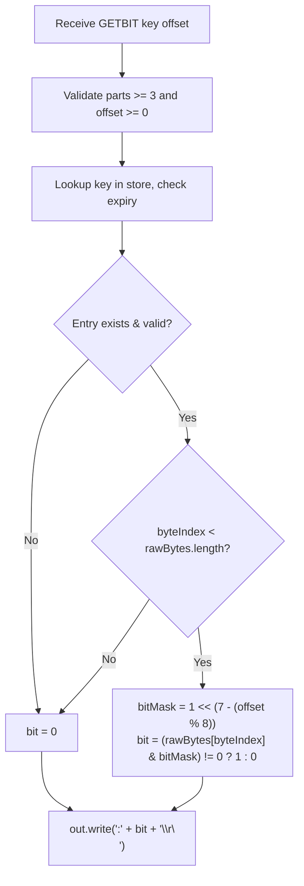

# Stage 116: Retrieve a bit

---

## In one line
Implement the `GETBIT key offset` command, querying the bit at the specified zero-indexed offset within the binary string byte array, returning 0 for out-of-range offsets or missing keys as a RESP integer.

---

## Self-test (cover the answers below and answer these first)
1. **What does `GETBIT` return when called on a key that does not exist?**
   - *Answer*: `:0\r\n` (Redis treats nonexistent keys as all zeros).
2. **What does `GETBIT` return when the offset is greater than or equal to the total bit length of the string?**
   - *Answer*: `:0\r\n` (offsets past the end of the string evaluate to 0 without mutating or growing the string).
3. **If a string byte at index 0 has value `0x40` (`01000000`), what does `GETBIT key 1` return?**
   - *Answer*: `:1\r\n`.
4. **On the same byte `0x40`, what does `GETBIT key 0` return?**
   - *Answer*: `:0\r\n`.
5. **Does `GETBIT` modify the key or touch watched transaction keys?**
   - *Answer*: No. `GETBIT` is a read-only query command.

---

## Problem Solved

In **Stage 116: Retrieve a bit**, we:

1. **Implemented `GETBIT key offset`**:
   - Validated arguments and parsed `offset` as a non-negative integer.
   - Checked key existence and expiry in `store`.
   - Determined if `offset / 8` lies within `rawBytes.length`.
   - Extracted bit value: `(rawBytes[byteIndex] & (1 << (7 - (offset % 8)))) != 0 ? 1 : 0`.
   - Emitted `:bit\r\n` as a RESP integer.

---

## Thought Process & Architectural Model

### 1. Bit Extraction Formula

For any target offset $k$:
$$\text{byteIndex} = \lfloor k / 8 \rfloor$$
$$\text{bitIndex} = 7 - (k \pmod 8)$$
$$\text{bitMask} = 1 \ll \text{bitIndex}$$

$$\text{bit} = \begin{cases} 
0 & \text{if } \text{entry is null or expired} \\
0 & \text{if } \text{byteIndex} \ge \text{len}(\text{rawBytes}) \\
1 & \text{if } (\text{rawBytes}[\text{byteIndex}] \mathbin{\&} \text{bitMask}) \ne 0 \\
0 & \text{otherwise}
\end{cases}$$

### 2. Execution Flowchart



---

## Full Solution

In [`codecrafters-redis-java/src/main/java/Main.java`](file:///C:/Users/jiten/Documents/Codecrafters-Build-from-scratch/codecrafters-redis-java/src/main/java/Main.java):

```java
    } else if (command.equalsIgnoreCase("GETBIT")) {
      if (parts.length < 3) {
        out.write("-ERR wrong number of arguments for 'getbit' command\r\n".getBytes(StandardCharsets.UTF_8));
        out.flush();
        return;
      }
      String rawKey = parts[1];
      String key = stripQuotes(rawKey);

      long offset;
      try {
        offset = Long.parseLong(parts[2]);
      } catch (NumberFormatException e) {
        out.write("-ERR bit offset is not an integer or out of range\r\n".getBytes(StandardCharsets.UTF_8));
        out.flush();
        return;
      }
      if (offset < 0) {
        out.write("-ERR bit offset is not an integer or out of range\r\n".getBytes(StandardCharsets.UTF_8));
        out.flush();
        return;
      }

      Entry entry = store.get(key);
      if (entry == null && !key.equals(rawKey)) {
        entry = store.get(rawKey);
      }
      if (entry != null && entry.isExpired()) {
        store.remove(key);
        entry = null;
      }

      int bit = 0;
      if (entry != null) {
        byte[] currentBytes = entry.rawBytes;
        int byteIndex = (int) (offset / 8);
        if (byteIndex < currentBytes.length) {
          int bitIndex = 7 - (int) (offset % 8);
          int bitMask = 1 << bitIndex;
          bit = (currentBytes[byteIndex] & bitMask) != 0 ? 1 : 0;
        }
      }

      out.write((":" + bit + "\r\n").getBytes(StandardCharsets.UTF_8));
      out.flush();
```

---

## Concepts

1. **Virtual Infinite Zero-Padding**:
   - In Redis bitmap semantics, unallocated bits beyond the current physical allocation or on non-existent keys are considered logically present with value `0`.
2. **Read-Only Non-Mutating Semantic**:
   - Unlike `SETBIT`, which extends the string byte array to accommodate the offset, `GETBIT` never allocates memory or creates keys.

---

## Wire Format

```text
Client: *3\r\n$6\r\nGETBIT\r\n$7\r\nbit_key\r\n$1\r\n2\r\n
Server: :1\r\n

Client: *3\r\n$6\r\nGETBIT\r\n$7\r\nbit_key\r\n$1\r\n3\r\n
Server: :0\r\n

Client: *3\r\n$6\r\nGETBIT\r\n$7\r\nnew_key\r\n$1\r\n2\r\n
Server: :0\r\n
```

---

## Failure Modes

1. **IndexOutOfBoundsException on Beyond-Range Offsets**:
   - Guarding with `if (byteIndex < currentBytes.length)` ensures safe read operations for arbitrary offsets.
2. **Key Expiration Handling**:
   - Actively purging expired entries prevents reading stale bits from keys whose TTL has elapsed.

---

## Tradeoffs

- **Direct Indexing**:
  - Direct array indexing `currentBytes[byteIndex]` provides strictly $O(1)$ constant-time lookup.

---

## Java Specifics

- In Java, bitwise `&` promotes `byte` to `int` sign-extended. Because `bitMask` is positive (`1 << bitIndex` between 1 and 128), `(currentBytes[byteIndex] & bitMask) != 0` evaluates correctly regardless of byte sign bit.

---

## Rebuild Checklist

1. [x] Implement `GETBIT key offset` in `handleCommand`.
2. [x] Validate arguments and non-negative integer offset.
3. [x] Return `":0\r\n"` if key missing, expired, or offset beyond byte length.
4. [x] Extract bit via bitmask `1 << (7 - (offset % 8))` if within bounds.
5. [x] Return `":<bit>\r\n"`.
6. [x] Verify compilation with `javac`.
