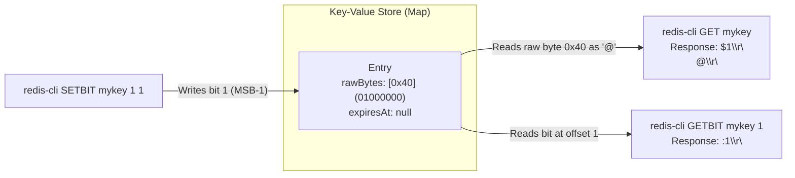

# Stage 118: Read bits as a string

---

## In one line
Enable reading bitmap buffers back as binary-safe Redis bulk strings via `GET key`, returning the byte representation constructed from bitwise mutations (e.g. `$1\r\n@\r\n` for bit 1 set).

---

## Self-test (cover the answers below and answer these first)
1. **What is the byte value and ASCII character produced by setting bit 1 on an empty key via `SETBIT mykey 1 1`?**
   - *Answer*: Binary `01000000` (`0x40`), corresponding to the ASCII character `'@'`.
2. **What wire format does `GET` use to return the value of a bitmap?**
   - *Answer*: RESP Bulk String: `$1\r\n@\r\n`.
3. **Why must `GET` write raw bytes directly rather than converting through UTF-8 text serialization?**
   - *Answer*: Arbitrary bit patterns can produce bytes between `0x80` and `0xFF` or `0x00`. UTF-8 encoding would corrupt single-byte binary values into multi-byte sequences or replacement characters.
4. **If bit 0 and bit 1 are both set via `SETBIT`, what byte value is formed?**
   - *Answer*: `11000000` (binary) or `0xC0` (decimal 192).
5. **Does reading a bitmap via `GET` alter its TTL or bit layout?**
   - *Answer*: No, `GET` is a read-only command that leaves key content and expiration untouched.

---

## Problem Solved

In **Stage 118: Read bits as a string**, we:

1. **Dual Representation of Redis Strings**:
   - Demonstrated complete bidirectional symmetry between bit operations (`SETBIT`, `GETBIT`) and string operations (`SET`, `GET`).
2. **Binary-Safe `GET` Output**:
   - Ensured that `GET` accesses `entry.rawBytes` directly, outputting `$len\r\n<raw-bytes>\r\n`.
   - Verified that setting bit 1 correctly outputs the ASCII character `@` (`0x40`).

---

## Thought Process & Architectural Model

### 1. The Dual Nature of Redis Strings



### 2. Byte and Bit Alignment

| Offset | Mask | Binary Pattern | Hex | ASCII Character |
|---|---|---|---|---|
| Offset 0 | `1 << 7` (`0x80`) | `10000000` | `0x80` | Non-ASCII (`€` in cp1252) |
| **Offset 1** | **`1 << 6` (`0x40`)** | **`01000000`** | **`0x40`** | **`@`** |
| Offset 2 | `1 << 5` (`0x20`) | `00100000` | `0x20` | Space (`' '`) |
| Offset 3 | `1 << 4` (`0x10`) | `00010000` | `0x10` | DLE (control code) |

---

## Full Solution

In [`codecrafters-redis-java/src/main/java/Main.java`](file:///C:/Users/jiten/Documents/Codecrafters-Build-from-scratch/codecrafters-redis-java/src/main/java/Main.java):

```java
  private static class Entry {
    final String value;
    final byte[] rawBytes;
    final Long expiresAt;

    Entry(String value, Long expiresAt) {
      this.value = value;
      this.rawBytes = value.getBytes(StandardCharsets.ISO_8859_1);
      this.expiresAt = expiresAt;
    }

    Entry(byte[] rawBytes, Long expiresAt) {
      this.rawBytes = rawBytes;
      this.value = new String(rawBytes, StandardCharsets.ISO_8859_1);
      this.expiresAt = expiresAt;
    }

    boolean isExpired() {
      return expiresAt != null && System.currentTimeMillis() > expiresAt;
    }
  }
```

And in `GET`:
```java
    } else if (command.equalsIgnoreCase("GET")) {
      if (parts.length < 2) {
        out.write("-ERR wrong number of arguments for 'get' command\r\n".getBytes(StandardCharsets.UTF_8));
        out.flush();
        return;
      }
      String rawKey = parts[1];
      String key = stripQuotes(rawKey);
      Entry entry = store.get(key);
      if (entry == null && !key.equals(rawKey)) {
        entry = store.get(rawKey);
      }

      if (entry != null && !entry.isExpired()) {
        byte[] bytes = entry.rawBytes;
        out.write(("$" + bytes.length + "\r\n").getBytes(StandardCharsets.UTF_8));
        out.write(bytes);
        out.write("\r\n".getBytes(StandardCharsets.UTF_8));
      } else {
        if (entry != null && entry.isExpired()) {
          store.remove(key);
          if (!key.equals(rawKey)) {
            store.remove(rawKey);
          }
        }
        out.write("$-1\r\n".getBytes(StandardCharsets.UTF_8));
      }
      out.flush();
```

---

## Concepts

1. **Binary Transparency**:
   - Redis strings are byte-addressable strings (SDS - Simple Dynamic Strings in C). There is no character encoding enforced by the core engine; arbitrary binary bytes from `0x00` through `0xFF` are stored transparently.
2. **Bulk String Serialization of Arbitrary Bytes**:
   - Bulk strings transmit byte count in ASCII decimal (`$<len>\r\n`), immediately followed by the exact byte payload and terminating `\r\n`.

---

## Wire Format

```text
Client: *4\r\n$6\r\nSETBIT\r\n$5\r\nmykey\r\n$1\r\n1\r\n$1\r\n1\r\n
Server: :0\r\n

Client: *2\r\n$3\r\nGET\r\n$5\r\nmykey\r\n
Server: $1\r\n@\r\n
```

---

## Failure Modes

1. **String Re-Encoding Corruption**:
   - Passing `entry.value.getBytes(StandardCharsets.UTF_8)` when `entry.value` holds bytes converted without binary safety causes multi-byte expansion of high-order bytes. Writing `entry.rawBytes` directly to `OutputStream` circumvents character set pitfalls.
2. **Missing Key Handling**:
   - Requesting `GET` for an uninitialized key returns `$-1\r\n`, whereas `GETBIT` returns `:0\r\n`.

---

## Tradeoffs

- **Memory vs Re-encoding**:
  - Storing both `String value` and `byte[] rawBytes` on `Entry` provides optimal speed for numeric operations (`INCR`), string operations, and binary bitmap operations.

---

## Java Specifics

- Directly calling `OutputStream.write(byte[] b)` bypasses the Java character-encoding subsystem, sending binary payloads unmolested over the TCP socket.

---

## Rebuild Checklist

1. [x] Ensure `SETBIT` stores modified `byte[]` in `Entry`.
2. [x] Ensure `GET` outputs `entry.rawBytes` directly.
3. [x] Validate that `SETBIT mykey 1 1` followed by `GET mykey` yields `$1\r\n@\r\n`.
4. [x] Verify compilation with `javac`.
