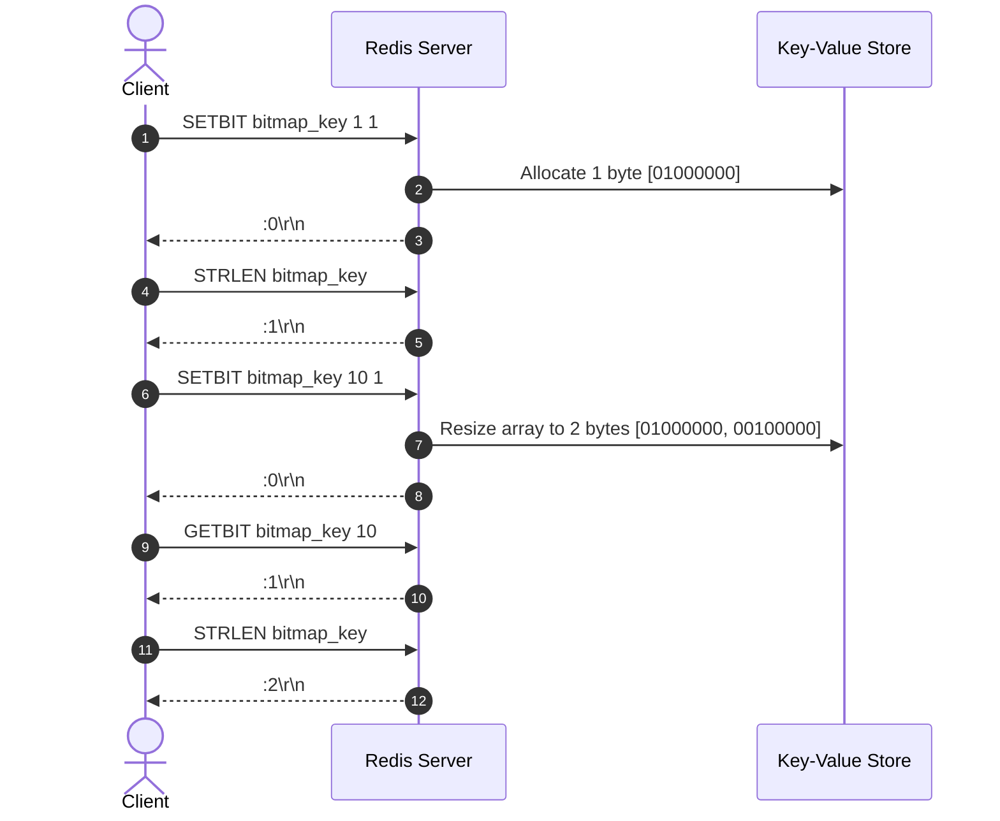

# Stage 119: Grow a bitmap

---

## In one line
Implement dynamic byte array expansion in `SETBIT` when addressing offsets past the current allocation with zero-padding, and implement the `STRLEN key` command returning total string byte length as a RESP integer.

---

## Self-test (cover the answers below and answer these first)
1. **What is the length in bytes of a bitmap after setting bit offset 10 on a previously empty or 1-byte key?**
   - *Answer*: 2 bytes ($\lfloor 10 / 8 \rfloor + 1 = 1 + 1 = 2$).
2. **What value do newly allocated bytes between the old end-of-string and the new offset contain?**
   - *Answer*: `0x00` (zero-padding).
3. **What does `STRLEN missing_key` return?**
   - *Answer*: `:0\r\n` (missing or expired keys have byte length 0).
4. **Does `STRLEN` report length in bits or in bytes?**
   - *Answer*: In bytes.
5. **If a string has 2 bytes, what are the zero-indexed bit offsets that fit within it?**
   - *Answer*: Bits 0 through 15. Offset 16 begins the 3rd byte.

---

## Problem Solved

In **Stage 119: Grow a bitmap**, we:

1. **Dynamic Bitmap Extension**:
   - Ensured `SETBIT` automatically calculates $\text{requiredLength} = \lfloor \text{offset} / 8 \rfloor + 1$.
   - Expanded the underlying byte buffer using `Arrays.copyOf(currentBytes, requiredLength)` which initialises intermediate bytes with `0x00`.
2. **Implemented `STRLEN key`**:
   - Handled argument validation and key lookup with expiration check.
   - Returned `entry.rawBytes.length` formatted as a RESP integer `:<len>\r\n` (or `:0\r\n` if key does not exist).

---

## Thought Process & Architectural Model

### 1. Memory Allocation and Offset Mapping

Setting bit at offset 1:
$$\text{byteIndex} = 0 \implies \text{length} = 1 \implies [01000000_2]$$

Setting bit at offset 10:
$$\text{byteIndex} = \lfloor 10 / 8 \rfloor = 1 \implies \text{requiredLength} = 2$$
$$\text{bitIndex} = 7 - (10 \pmod 8) = 7 - 2 = 5 \implies \text{bitMask} = 1 \ll 5 = 00100000_2$$
Resulting buffer:
$$[01000000_2, \ 00100000_2]$$
$$\text{STRLEN} = 2$$



---

## Full Solution

In [`codecrafters-redis-java/src/main/java/Main.java`](file:///C:/Users/jiten/Documents/Codecrafters-Build-from-scratch/codecrafters-redis-java/src/main/java/Main.java):

```java
    } else if (command.equalsIgnoreCase("STRLEN")) {
      if (parts.length < 2) {
        out.write("-ERR wrong number of arguments for 'strlen' command\r\n".getBytes(StandardCharsets.UTF_8));
        out.flush();
        return;
      }
      String rawKey = parts[1];
      String key = stripQuotes(rawKey);
      Entry entry = store.get(key);
      if (entry == null && !key.equals(rawKey)) {
        entry = store.get(rawKey);
      }
      if (entry != null && entry.isExpired()) {
        store.remove(key);
        if (!key.equals(rawKey)) {
          store.remove(rawKey);
        }
        entry = null;
      }

      int len = (entry != null && entry.rawBytes != null) ? entry.rawBytes.length : 0;
      out.write((":" + len + "\r\n").getBytes(StandardCharsets.UTF_8));
      out.flush();
```

---

## Concepts

1. **On-Demand Capacity Scaling**:
   - Redis bitmaps dynamically scale to accommodate write offsets on the fly, growing by standard byte increments rather than fixed powers of two.
2. **`STRLEN` Semantics**:
   - `STRLEN` operates uniformly on text strings and bitmaps, exposing the physical memory size of the underlying byte buffer.

---

## Wire Format

```text
Client: *4\r\n$6\r\nSETBIT\r\n$10\r\nbitmap_key\r\n$1\r\n1\r\n$1\r\n1\r\n
Server: :0\r\n

Client: *2\r\n$6\r\nSTRLEN\r\n$10\r\nbitmap_key\r\n
Server: :1\r\n

Client: *4\r\n$6\r\nSETBIT\r\n$10\r\nbitmap_key\r\n$2\r\n10\r\n$1\r\n1\r\n
Server: :0\r\n

Client: *3\r\n$6\r\nGETBIT\r\n$10\r\nbitmap_key\r\n$2\r\n10\r\n
Server: :1\r\n

Client: *2\r\n$6\r\nSTRLEN\r\n$10\r\nbitmap_key\r\n
Server: :2\r\n
```

---

## Failure Modes

1. **Uninitialized Zero Padding**:
   - Java's `Arrays.copyOf` guarantees that new trailing elements in primitive `byte[]` arrays are initialized to `(byte) 0`, ensuring clean zero-padding without undefined data.
2. **Missing Key Querying**:
   - Nonexistent keys must yield `:0\r\n` rather than throwing `NullPointerException`.

---

## Tradeoffs

- **Linear Copy Overhead**:
  - `Arrays.copyOf` copies existing bytes on reallocation. For standard bitmap sizes in typical Redis workflows, allocation time is negligible.

---

## Java Specifics

- `Arrays.copyOf(byte[] original, int newLength)` truncates or pads with zeros depending on whether `newLength` is smaller or larger than `original.length`.

---

## Rebuild Checklist

1. [x] Check dynamic resizing in `SETBIT key offset value`.
2. [x] Implement `STRLEN key` command handler.
3. [x] Return `:0\r\n` for missing or expired keys.
4. [x] Return `:<byte-length>\r\n` for existing keys.
5. [x] Verify compilation with `javac`.
