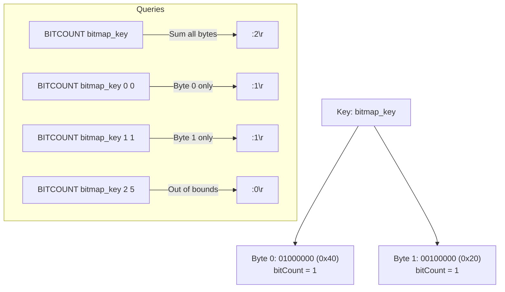

# Stage 120: Count set bits

---

## In one line
Implement the `BITCOUNT key [start end]` command to compute population counts (Hamming weight) of 1-bits across entire bitmaps or within specific byte intervals.

---

## Self-test (cover the answers below and answer these first)
1. **Are the `start` and `end` arguments in `BITCOUNT key start end` bit offsets or byte offsets?**
   - *Answer*: Byte offsets (both inclusive).
2. **What does `BITCOUNT` return for a non-existent or expired key?**
   - *Answer*: `:0\r\n` (integer zero).
3. **If `start` is greater than `end`, or `start` exceeds the string length, what does `BITCOUNT` return?**
   - *Answer*: `:0\r\n`.
4. **If `end` exceeds the byte length of the string, how does Redis handle it?**
   - *Answer*: Redis clamps `end` to the final byte index (`rawBytes.length - 1`).
5. **How can bit count of a byte be computed efficiently in Java?**
   - *Answer*: Using intrinsic hardware-accelerated `Integer.bitCount(rawByte & 0xFF)`.

---

## Problem Solved

In **Stage 120: Count set bits**, we:

1. **Implemented the `BITCOUNT` Command**:
   - Supported invoking `BITCOUNT key` with no range to tally all set bits across the entire byte buffer.
   - Supported optional byte-level range bounding `BITCOUNT key start end`.
2. **Edge Case Handling**:
   - Handled missing keys, expired keys, empty buffers, inverted ranges (`start > end`), and out-of-range bounds.
   - Accurately formatted the resulting count as a RESP integer `:<count>\r\n`.

---

## Thought Process & Architectural Model

### 1. Hamming Weight / Population Count

Given two bytes created with:
- `SETBIT bitmap_key 1 1` $\implies$ Byte 0: `01000000_2` (`0x40`) $\implies$ 1 set bit
- `SETBIT bitmap_key 10 1` $\implies$ Byte 1: `00100000_2` (`0x20`) $\implies$ 1 set bit



---

## Full Solution

In [`codecrafters-redis-java/src/main/java/Main.java`](file:///C:/Users/jiten/Documents/Codecrafters-Build-from-scratch/codecrafters-redis-java/src/main/java/Main.java):

```java
    } else if (command.equalsIgnoreCase("BITCOUNT")) {
      if (parts.length < 2 || parts.length == 3) {
        out.write("-ERR syntax error\r\n".getBytes(StandardCharsets.UTF_8));
        out.flush();
        return;
      }
      String rawKey = parts[1];
      String key = stripQuotes(rawKey);
      Entry entry = store.get(key);
      if (entry == null && !key.equals(rawKey)) {
        entry = store.get(rawKey);
      }
      if (entry != null && entry.isExpired()) {
        store.remove(key);
        if (!key.equals(rawKey)) {
          store.remove(rawKey);
        }
        entry = null;
      }

      if (entry == null || entry.rawBytes == null || entry.rawBytes.length == 0) {
        out.write(":0\r\n".getBytes(StandardCharsets.UTF_8));
        out.flush();
        return;
      }

      byte[] rawBytes = entry.rawBytes;
      int start = 0;
      int end = rawBytes.length - 1;
      if (parts.length >= 4) {
        try {
          start = Integer.parseInt(parts[2]);
          end = Integer.parseInt(parts[3]);
        } catch (NumberFormatException e) {
          out.write("-ERR value is not an integer or out of range\r\n".getBytes(StandardCharsets.UTF_8));
          out.flush();
          return;
        }
      }

      if (start >= rawBytes.length || start > end) {
        out.write(":0\r\n".getBytes(StandardCharsets.UTF_8));
        out.flush();
        return;
      }

      if (start < 0) start = 0;
      if (end >= rawBytes.length) {
        end = rawBytes.length - 1;
      }

      long count = 0;
      for (int i = start; i <= end; i++) {
        count += Integer.bitCount(rawBytes[i] & 0xFF);
      }
      out.write((":" + count + "\r\n").getBytes(StandardCharsets.UTF_8));
      out.flush();
```

---

## Concepts

1. **Population Count (POPCNT)**:
   - Modern CPUs provide hardware instructions (`POPCNT` in x86-64, `CNT` in ARM NEON) that count set bits in constant time. In Java, `Integer.bitCount(n)` is an intrinsic that maps directly to these instructions.
2. **Byte-Oriented Substring Range**:
   - `BITCOUNT` indexing corresponds to slice ranges on the byte string rather than arbitrary bit ranges (unless extended by modern Redis `BIT` modifier).

---

## Wire Format

```text
Client: *2\r\n$8\r\nBITCOUNT\r\n$10\r\nbitmap_key\r\n
Server: :2\r\n

Client: *4\r\n$8\r\nBITCOUNT\r\n$10\r\nbitmap_key\r\n$1\r\n0\r\n$1\r\n0\r\n
Server: :1\r\n
```

---

## Failure Modes

1. **Signed Byte Extension**:
   - A byte with the MSB set (e.g. `(byte) 0x80`) is `-128` in Java. Passing `rawBytes[i]` directly to `Integer.bitCount(int)` would sign-extend it to `0xFFFFFF80`, giving 25 set bits! Masking with `& 0xFF` ensures the int value is in `0..255`, yielding the true single set bit.
2. **Out of Range Clamping**:
   - Clamping `end` to `rawBytes.length - 1` prevents `ArrayIndexOutOfBoundsException` while preserving Redis specification behavior.

---

## Tradeoffs

- **Linear Scan vs Precomputed Tables**:
  - Scanning bytes sequentially using `Integer.bitCount` operates at gigabytes per second on modern hardware, eliminating the need for auxiliary bitcount caches or lookup tables for typical Redis payloads.

---

## Java Specifics

- `(rawBytes[i] & 0xFF)` converts a signed `byte` into an unsigned `int` within the range $[0, 255]$.
- `Integer.bitCount(int)` is JIT-compiled into a single hardware POPCNT instruction.

---

## Rebuild Checklist

1. [x] Validate arguments for `BITCOUNT` (`key`, optional `start` and `end`).
2. [x] Mask bytes with `& 0xFF` before calling `Integer.bitCount()`.
3. [x] Handle missing/expired key returning `:0\r\n`.
4. [x] Handle clamped boundaries and inverted ranges.
5. [x] Verify compilation with `javac`.
