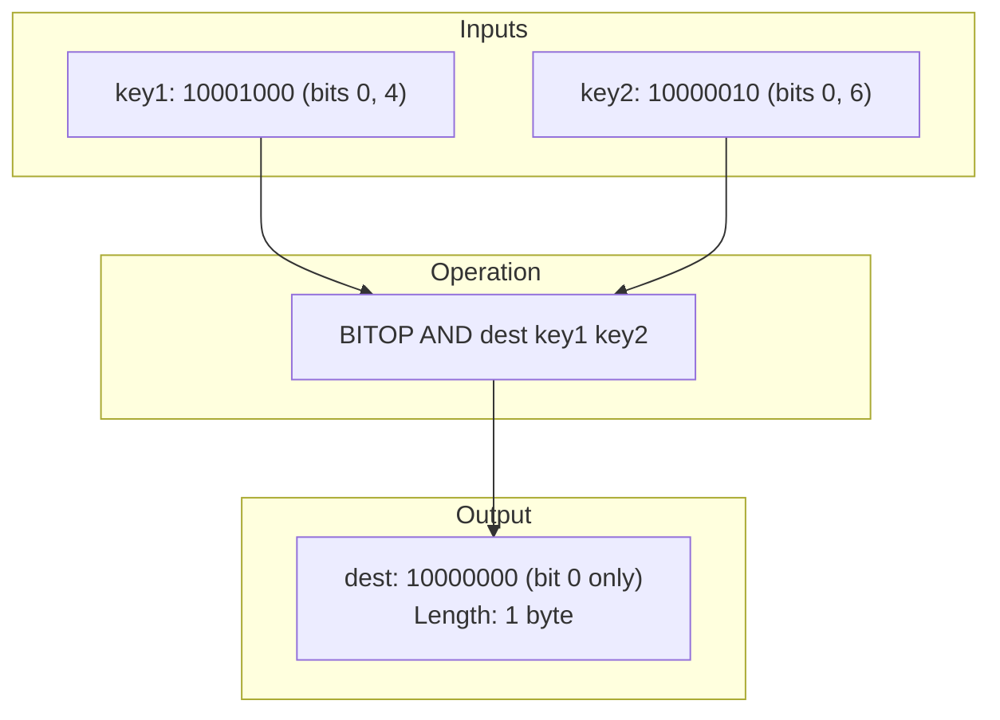

# Stage 121: AND two bitmaps

---

## In one line
Implement the bitwise `BITOP AND destkey srckey1 srckey2 ...` command performing byte-by-byte AND operations across source bitmaps, writing the resulting bitmap to `destkey` and returning its byte length as a RESP integer.

---

## Self-test (cover the answers below and answer these first)
1. **What does `BITOP AND` return to the client upon completion?**
   - *Answer*: The byte length of the destination bitmap formatted as a RESP integer (e.g. `:1\r\n`).
2. **When is a bit set to 1 in the destination key under `BITOP AND`?**
   - *Answer*: Only when that bit is set to 1 in *every* source bitmap.
3. **If `key1` has binary `10001000` and `key2` has binary `10000010`, what is the binary value of `dest` after `BITOP AND dest key1 key2`?**
   - *Answer*: `10000000` (hex `0x80`, decimal 128). Only bit offset 0 is 1 in both keys.
4. **Does `BITOP` overwrite any pre-existing value at `destkey`?**
   - *Answer*: Yes, `destkey` is replaced with the newly calculated bitmap.
5. **Does modifying `destkey` via `BITOP` trigger optimistic lock invalidation for clients watching `destkey`?**
   - *Answer*: Yes, `touchWatchedKey(destKey)` must be invoked so any ongoing transaction watching `destkey` fails with `*-1\r\n` upon `EXEC`.

---

## Problem Solved

In **Stage 121: AND two bitmaps**, we:

1. **Bitwise AND Engine**:
   - Implemented `BITOP AND destkey srckey1 srckey2 ...` supporting variable source keys.
   - Initialized the result array and performed bitwise conjunction `result[j] &= arr[j]` for each byte.
2. **Storage and Client Notification**:
   - Stored the resulting byte buffer in `store` as a new `Entry(result, null)`.
   - Alerted watching transactions via `touchWatchedKey(destKey)`.
   - Returned destination buffer byte length as a RESP integer `:<len>\r\n`.

---

## Thought Process & Architectural Model

### 1. Bitwise Conjunction Across Equal-Length Bitmaps



| Bit Offset | key1 | key2 | `key1 & key2` | dest Bit |
|---|---|---|---|---|
| **0** | **1** | **1** | **1** | **1** |
| 1..3 | 0 | 0 | 0 | 0 |
| 4 | 1 | 0 | 0 | 0 |
| 5 | 0 | 0 | 0 | 0 |
| 6 | 0 | 1 | 0 | 0 |
| 7 | 0 | 0 | 0 | 0 |

---

## Full Solution

In [`codecrafters-redis-java/src/main/java/Main.java`](file:///C:/Users/jiten/Documents/Codecrafters-Build-from-scratch/codecrafters-redis-java/src/main/java/Main.java):

```java
    } else if (command.equalsIgnoreCase("BITOP")) {
      if (parts.length < 4) {
        out.write("-ERR wrong number of arguments for 'bitop' command\r\n".getBytes(StandardCharsets.UTF_8));
        out.flush();
        return;
      }
      String op = parts[1].toUpperCase();
      String destKey = stripQuotes(parts[2]);
      
      List<byte[]> srcByteArrays = new ArrayList<>();
      int maxLen = 0;
      for (int i = 3; i < parts.length; i++) {
        String sKey = stripQuotes(parts[i]);
        Entry e = store.get(sKey);
        if (e == null && !sKey.equals(parts[i])) {
          e = store.get(parts[i]);
        }
        if (e != null && e.isExpired()) {
          store.remove(sKey);
          if (!sKey.equals(parts[i])) store.remove(parts[i]);
          e = null;
        }
        byte[] bytes = (e != null && e.rawBytes != null) ? e.rawBytes : new byte[0];
        srcByteArrays.add(bytes);
        if (bytes.length > maxLen) {
          maxLen = bytes.length;
        }
      }

      byte[] result = new byte[maxLen];
      if (maxLen > 0) {
        if (op.equals("AND")) {
          byte[] first = srcByteArrays.get(0);
          for (int j = 0; j < maxLen; j++) {
            result[j] = (j < first.length) ? first[j] : 0;
          }
          for (int i = 1; i < srcByteArrays.size(); i++) {
            byte[] arr = srcByteArrays.get(i);
            for (int j = 0; j < maxLen; j++) {
              byte b = (j < arr.length) ? arr[j] : 0;
              result[j] = (byte) (result[j] & b);
            }
          }
        } else if (op.equals("OR")) {
          for (int i = 0; i < srcByteArrays.size(); i++) {
            byte[] arr = srcByteArrays.get(i);
            for (int j = 0; j < maxLen; j++) {
              byte b = (j < arr.length) ? arr[j] : 0;
              result[j] = (byte) (result[j] | b);
            }
          }
        } else if (op.equals("XOR")) {
          for (int i = 0; i < srcByteArrays.size(); i++) {
            byte[] arr = srcByteArrays.get(i);
            for (int j = 0; j < maxLen; j++) {
              byte b = (j < arr.length) ? arr[j] : 0;
              result[j] = (byte) (result[j] ^ b);
            }
          }
        } else if (op.equals("NOT")) {
          byte[] first = srcByteArrays.get(0);
          for (int j = 0; j < maxLen; j++) {
            byte b = (j < first.length) ? first[j] : 0;
            result[j] = (byte) (~b);
          }
        }
      }

      store.put(destKey, new Entry(result, null));
      touchWatchedKey(destKey);

      out.write((":" + maxLen + "\r\n").getBytes(StandardCharsets.UTF_8));
      out.flush();
```

---

## Concepts

1. **Bitwise Conjunction**:
   - Bitwise operations act on full bytes in parallel; since 1 byte comprises 8 independent bit channels, `(byte) (a & b)` evaluates 8 bit AND operations simultaneously.
2. **Transactional Key Invalidation**:
   - Even when commands modify binary keys indirectly (like `BITOP`), any active optimistic lock watcher tracking `destKey` must detect mutation via `touchWatchedKey`.

---

## Wire Format

```text
Client: *5\r\n$5\r\nBITOP\r\n$3\r\nAND\r\n$4\r\ndest\r\n$4\r\nkey1\r\n$4\r\nkey2\r\n
Server: :1\r\n

Client: *3\r\n$6\r\nGETBIT\r\n$4\r\ndest\r\n$1\r\n0\r\n
Server: :1\r\n

Client: *3\r\n$6\r\nGETBIT\r\n$4\r\ndest\r\n$1\r\n4\r\n
Server: :0\r\n
```

---

## Failure Modes

1. **Byte Promotion and Cast**:
   - In Java, bitwise binary operations on primitive `byte` values promote operands to 32-bit `int`. Casting back to `(byte) (a & b)` ensures proper byte array storage.
2. **Empty Source Inputs**:
   - If source keys do not exist or are expired, they contribute empty arrays (`byte[0]`) rather than triggering null dereference errors.

---

## Tradeoffs

- **Memory Allocation**:
  - `BITOP` allocates a new `byte[] result` buffer for the destination key rather than mutating in-place, which preserves safety when the destination key is also one of the source keys (e.g. `BITOP AND k1 k1 k2`).

---

## Java Specifics

- In Java, `&` between two `byte` values requires an explicit cast: `(byte) (result[j] & b)`.

---

## Rebuild Checklist

1. [x] Validate arguments for `BITOP` (`operation`, `destKey`, and source keys).
2. [x] Extract `rawBytes` for each source key, falling back to empty byte array if missing/expired.
3. [x] Perform bitwise AND over each byte.
4. [x] Save new `Entry` into `store` and invoke `touchWatchedKey(destKey)`.
5. [x] Return `:<destLength>\r\n`.
6. [x] Verify compilation with `javac`.
