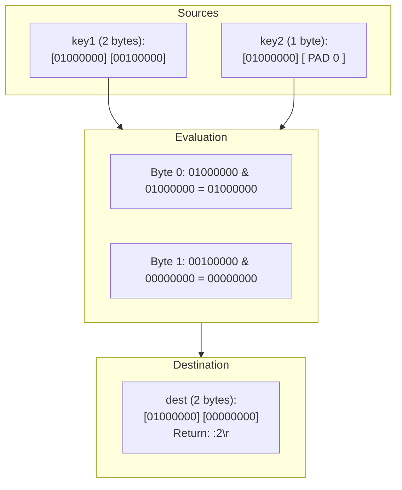

# Stage 122: AND bitmaps of different lengths

---

## In one line
Extend `BITOP AND` to support heterogeneous bitmap lengths by dynamically treating shorter inputs and missing keys as zero-padded byte streams extending to the length of the longest source bitmap.

---

## Self-test (cover the answers below and answer these first)
1. **When two bitmaps of lengths $L_1$ and $L_2$ (where $L_1 > L_2$) are combined with `BITOP AND`, what is the length of the destination bitmap?**
   - *Answer*: $L_1$ bytes (the length of the longest input bitmap).
2. **What value are missing bytes in the shorter bitmap treated as during `BITOP AND`?**
   - *Answer*: Zero bytes (`0x00`).
3. **What is the bitwise AND of any bit with a zero-padded bit?**
   - *Answer*: Always 0 (`x & 0 == 0`).
4. **If a source key does not exist or is expired, how does `BITOP` treat it?**
   - *Answer*: As an all-zero byte string of the maximum length among the sources.
5. **What does `BITOP AND dest key1 key2` return when `key1` has 2 bytes and `key2` has 1 byte?**
   - *Answer*: `:2\r\n` (integer 2, the length of the destination in bytes).

---

## Problem Solved

In **Stage 122: AND bitmaps of different lengths**, we:

1. **Length Normalization via Zero-Padding**:
   - Calculated `maxLen = max(length(key_i))`.
   - Guaranteed that any access beyond a source string's byte boundary `j >= arr.length` evaluates as `0x00`.
2. **Handling Missing Keys**:
   - Missing or expired keys default to empty byte arrays (`new byte[0]`), participating as streams of zero bytes.
3. **Result Dimensioning**:
   - Created `result = new byte[maxLen]`, ensuring the output matches the maximum source length and returning `:maxLen\r\n`.

---

## Thought Process & Architectural Model

### 1. Conceptual Alignment with Zero-Padding



---

## Full Solution

In [`codecrafters-redis-java/src/main/java/Main.java`](file:///C:/Users/jiten/Documents/Codecrafters-Build-from-scratch/codecrafters-redis-java/src/main/java/Main.java):

```java
    } else if (command.equalsIgnoreCase("BITOP")) {
      if (parts.length < 4) {
        out.write("-ERR wrong number of arguments for 'bitop' command\r\n".getBytes(StandardCharsets.UTF_8));
        out.flush();
        return;
      }
      String op = parts[1].toUpperCase();
      String destKey = stripQuotes(parts[2]);
      
      List<byte[]> srcByteArrays = new ArrayList<>();
      int maxLen = 0;
      for (int i = 3; i < parts.length; i++) {
        String sKey = stripQuotes(parts[i]);
        Entry e = store.get(sKey);
        if (e == null && !sKey.equals(parts[i])) {
          e = store.get(parts[i]);
        }
        if (e != null && e.isExpired()) {
          store.remove(sKey);
          if (!sKey.equals(parts[i])) store.remove(parts[i]);
          e = null;
        }
        byte[] bytes = (e != null && e.rawBytes != null) ? e.rawBytes : new byte[0];
        srcByteArrays.add(bytes);
        if (bytes.length > maxLen) {
          maxLen = bytes.length;
        }
      }

      byte[] result = new byte[maxLen];
      if (maxLen > 0) {
        if (op.equals("AND")) {
          byte[] first = srcByteArrays.get(0);
          for (int j = 0; j < maxLen; j++) {
            result[j] = (j < first.length) ? first[j] : 0;
          }
          for (int i = 1; i < srcByteArrays.size(); i++) {
            byte[] arr = srcByteArrays.get(i);
            for (int j = 0; j < maxLen; j++) {
              byte b = (j < arr.length) ? arr[j] : 0;
              result[j] = (byte) (result[j] & b);
            }
          }
        } else if (op.equals("OR")) {
          for (int i = 0; i < srcByteArrays.size(); i++) {
            byte[] arr = srcByteArrays.get(i);
            for (int j = 0; j < maxLen; j++) {
              byte b = (j < arr.length) ? arr[j] : 0;
              result[j] = (byte) (result[j] | b);
            }
          }
        } else if (op.equals("XOR")) {
          for (int i = 0; i < srcByteArrays.size(); i++) {
            byte[] arr = srcByteArrays.get(i);
            for (int j = 0; j < maxLen; j++) {
              byte b = (j < arr.length) ? arr[j] : 0;
              result[j] = (byte) (result[j] ^ b);
            }
          }
        } else if (op.equals("NOT")) {
          byte[] first = srcByteArrays.get(0);
          for (int j = 0; j < maxLen; j++) {
            byte b = (j < first.length) ? first[j] : 0;
            result[j] = (byte) (~b);
          }
        }
      }

      store.put(destKey, new Entry(result, null));
      touchWatchedKey(destKey);

      out.write((":" + maxLen + "\r\n").getBytes(StandardCharsets.UTF_8));
      out.flush();
```

---

## Concepts

1. **Implicit Byte Stream Extension**:
   - Bitwise operations naturally treat missing tails of bit vectors as infinite streams of zeros.
2. **In-Memory Alignment**:
   - Normalizing length to `maxLen` avoids array index out of bounds exceptions while mathematically reflecting the identity $b \land 0 = 0$.

---

## Wire Format

```text
Client: *5\r\n$5\r\nBITOP\r\n$3\r\nAND\r\n$4\r\ndest\r\n$4\r\nkey1\r\n$4\r\nkey2\r\n
Server: :2\r\n

Client: *3\r\n$6\r\nGETBIT\r\n$4\r\ndest\r\n$1\r\n1\r\n
Server: :1\r\n

Client: *3\r\n$6\r\nGETBIT\r\n$4\r\ndest\r\n$2\r\n10\r\n
Server: :0\r\n
```

---

## Failure Modes

1. **`ArrayIndexOutOfBoundsException`**:
   - Accessing `arr[j]` without verifying `j < arr.length` would crash when strings have asymmetric lengths. Guarding with `(j < arr.length) ? arr[j] : 0` eliminates this risk.
2. **Premature Truncation**:
   - Sizing `result` to the shortest array rather than `maxLen` would incorrectly truncate the destination string.

---

## Tradeoffs

- **Pre-allocating `result` of size `maxLen`**:
  - Memory cost is bounded by the single largest input string (at most 512MB in standard Redis). This avoids multiple reallocations during bitwise passes.

---

## Java Specifics

- The ternary operator `(j < arr.length) ? arr[j] : 0` yields zero without needing physical memory zero-filling for omitted bytes.

---

## Rebuild Checklist

1. [x] Compute `maxLen` across all source operands.
2. [x] Allocate `new byte[maxLen]`.
3. [x] Handle shorter and absent keys with virtual zero bytes.
4. [x] Store destination `Entry` and trigger `touchWatchedKey(destKey)`.
5. [x] Return `:<maxLen>\r\n`.
6. [x] Validate compilation with `javac`.
