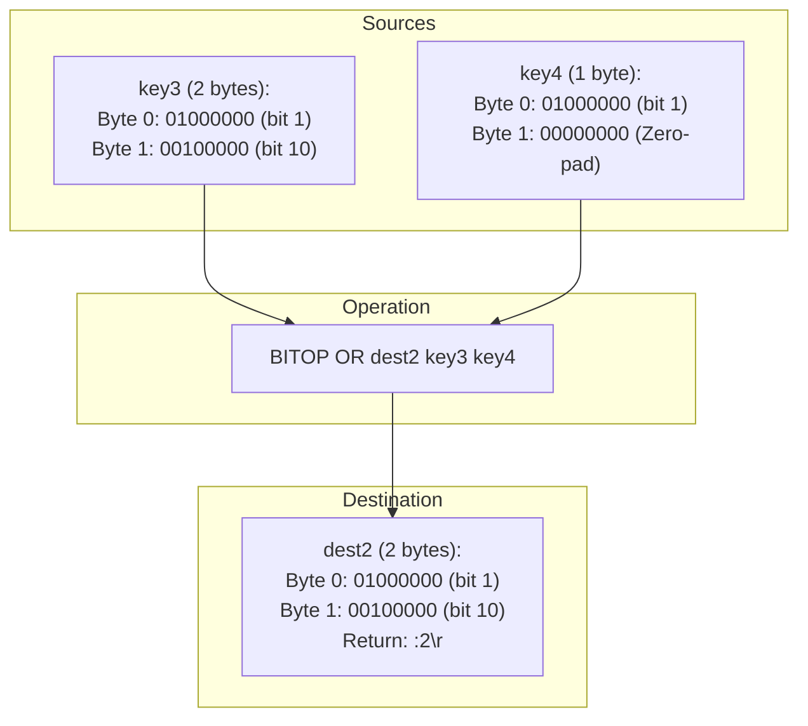

# Stage 123: OR two bitmaps

---

## In one line
Implement the `BITOP OR destkey srckey1 srckey2 ...` command performing bitwise disjunction across one or more source bitmaps, zero-padding shorter bitmaps to the maximum source length, storing the result at `destkey`, and returning the destination byte length as a RESP integer.

---

## Self-test (cover the answers below and answer these first)
1. **When is a bit set to 1 in `BITOP OR`?**
   - *Answer*: When that bit is set to 1 in at least one source bitmap ($b_1 \lor b_2 \lor \dots \lor b_n$).
2. **If `key1` has length 2 bytes and `key2` has length 1 byte, what is the length of the result of `BITOP OR dest key1 key2`?**
   - *Answer*: 2 bytes (the maximum length among the sources).
3. **If a bit is set only in the second byte of `key1` while `key2` is only 1 byte long, is that bit set in `dest`?**
   - *Answer*: Yes, because the missing byte in `key2` is treated as `0x00`, and `1 | 0 == 1`.
4. **What RESP type does `BITOP` return?**
   - *Answer*: RESP integer `:<len>\r\n`.
5. **How does `BITOP OR` behave if more than two source keys are supplied?**
   - *Answer*: It computes the disjunction across all supplied source keys simultaneously.

---

## Problem Solved

In **Stage 123: OR two bitmaps**, we:

1. **Bitwise Disjunction (`OR`)**:
   - Implemented `BITOP OR destkey srckey1 srckey2 ...`.
   - Iterated over all source byte buffers, accumulating bits with `result[j] |= b`.
2. **Heterogeneous Input Length Handling**:
   - Padded shorter source keys to `maxLen` with zero bytes so bits in longer bitmaps are preserved ($x \lor 0 = x$).
3. **Storage & Notification**:
   - Placed the computed `byte[]` in `store` under `destKey`.
   - Notified optimistic locking watchers via `touchWatchedKey(destKey)`.
   - Returned `:<maxLen>\r\n`.

---

## Thought Process & Architectural Model

### 1. Bitwise Disjunction with Asymmetric Lengths



| Bit Offset | Byte Index | key3 Bit | key4 Bit | `key3 \| key4` |
|---|---|---|---|---|
| 1 | Byte 0 | 1 | 1 | **1** |
| 4 | Byte 0 | 0 | 0 | **0** |
| 6 | Byte 0 | 0 | 0 | **0** |
| 10 | Byte 1 | 1 | 0 (padded) | **1** |

---

## Full Solution

In [`codecrafters-redis-java/src/main/java/Main.java`](file:///C:/Users/jiten/Documents/Codecrafters-Build-from-scratch/codecrafters-redis-java/src/main/java/Main.java):

```java
    } else if (command.equalsIgnoreCase("BITOP")) {
      if (parts.length < 4) {
        out.write("-ERR wrong number of arguments for 'bitop' command\r\n".getBytes(StandardCharsets.UTF_8));
        out.flush();
        return;
      }
      String op = parts[1].toUpperCase();
      String destKey = stripQuotes(parts[2]);
      
      List<byte[]> srcByteArrays = new ArrayList<>();
      int maxLen = 0;
      for (int i = 3; i < parts.length; i++) {
        String sKey = stripQuotes(parts[i]);
        Entry e = store.get(sKey);
        if (e == null && !sKey.equals(parts[i])) {
          e = store.get(parts[i]);
        }
        if (e != null && e.isExpired()) {
          store.remove(sKey);
          if (!sKey.equals(parts[i])) store.remove(parts[i]);
          e = null;
        }
        byte[] bytes = (e != null && e.rawBytes != null) ? e.rawBytes : new byte[0];
        srcByteArrays.add(bytes);
        if (bytes.length > maxLen) {
          maxLen = bytes.length;
        }
      }

      byte[] result = new byte[maxLen];
      if (maxLen > 0) {
        if (op.equals("AND")) {
          byte[] first = srcByteArrays.get(0);
          for (int j = 0; j < maxLen; j++) {
            result[j] = (j < first.length) ? first[j] : 0;
          }
          for (int i = 1; i < srcByteArrays.size(); i++) {
            byte[] arr = srcByteArrays.get(i);
            for (int j = 0; j < maxLen; j++) {
              byte b = (j < arr.length) ? arr[j] : 0;
              result[j] = (byte) (result[j] & b);
            }
          }
        } else if (op.equals("OR")) {
          for (int i = 0; i < srcByteArrays.size(); i++) {
            byte[] arr = srcByteArrays.get(i);
            for (int j = 0; j < maxLen; j++) {
              byte b = (j < arr.length) ? arr[j] : 0;
              result[j] = (byte) (result[j] | b);
            }
          }
        } else if (op.equals("XOR")) {
          for (int i = 0; i < srcByteArrays.size(); i++) {
            byte[] arr = srcByteArrays.get(i);
            for (int j = 0; j < maxLen; j++) {
              byte b = (j < arr.length) ? arr[j] : 0;
              result[j] = (byte) (result[j] ^ b);
            }
          }
        } else if (op.equals("NOT")) {
          byte[] first = srcByteArrays.get(0);
          for (int j = 0; j < maxLen; j++) {
            byte b = (j < first.length) ? first[j] : 0;
            result[j] = (byte) (~b);
          }
        }
      }

      store.put(destKey, new Entry(result, null));
      touchWatchedKey(destKey);

      out.write((":" + maxLen + "\r\n").getBytes(StandardCharsets.UTF_8));
      out.flush();
```

---

## Concepts

1. **Bitwise Disjunction Identity**:
   - In Boolean logic, $x \lor 0 = x$. When extending shorter arrays with zero bytes, all set bits in longer arrays naturally survive without alteration.
2. **Multi-Source Reduction**:
   - Starting with an all-zero accumulator `result = new byte[maxLen]` allows iterative folding of arbitrary numbers of source bitmaps using simple `result[j] |= b`.

---

## Wire Format

```text
Client: *5\r\n$5\r\nBITOP\r\n$2\r\nOR\r\n$4\r\ndest\r\n$4\r\nkey1\r\n$4\r\nkey2\r\n
Server: :1\r\n

Client: *5\r\n$5\r\nBITOP\r\n$2\r\nOR\r\n$5\r\ndest2\r\n$4\r\nkey3\r\n$4\r\nkey4\r\n
Server: :2\r\n
```

---

## Failure Modes

1. **Destructive Mutation**:
   - Modifying a source array directly would corrupt input data if `destKey` matches one of the `srcKey` inputs before other operands are folded. Creating a dedicated `result` array prevents this.
2. **Missing Key NullPointer**:
   - When a key does not exist, `e.rawBytes` is null; defaulting to `new byte[0]` provides seamless zero-padding.

---

## Tradeoffs

- **Zero-Accumulator Loop**:
  - Initializing `result` with zeros and OR-ing all sources in a uniform loop is cleaner and less error-prone than special-casing the first operand.

---

## Java Specifics

- `(byte) (result[j] | b)` guarantees narrowing from `int` after primitive promotion.

---

## Rebuild Checklist

1. [x] Recognize `BITOP OR`.
2. [x] Find maximum byte length among all sources.
3. [x] Fold each source byte array with bitwise OR `|`.
4. [x] Store destination entry and notify watched key listeners.
5. [x] Return byte length as RESP integer `:<len>\r\n`.
6. [x] Verify compilation with `javac`.
