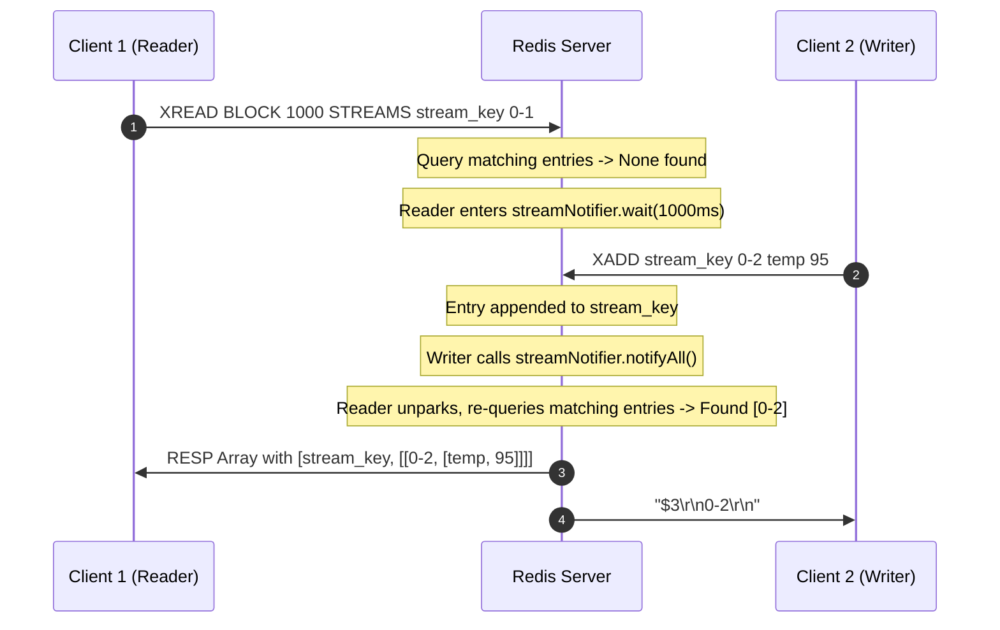

# Stage 29: Blocking reads

---

## Problem Solved

In Stage 28, `XREAD` operated as a purely synchronous polling mechanism: if matching entries existed for the requested streams and cursor IDs, it returned them immediately; otherwise, it responded with a null array (`*-1\r\n`).

In distributed event streaming and message queuing systems, polling for new data creates severe performance and architectural drawbacks:
1. **Busy-Waiting Overhead**: If consumer services poll periodically (e.g., every 50ms), they saturate the network and waste CPU cycles on the Redis server evaluating empty range queries.
2. **End-to-End Latency Jitter**: The time between when an event is appended to a stream and when a polling consumer detects it is bounded by the polling frequency. Reducing latency requires increasing polling frequency, which exacerbates CPU and network saturation.
3. **Connection Inefficiency**: Clients must constantly initiate requests and process empty replies, preventing idle connection efficiency.

To solve this, Redis provides the `BLOCK <milliseconds>` option in `XREAD`:
```
XREAD [BLOCK <milliseconds>] STREAMS <key1> ... <keyN> <id1> ... <idN>
```

Key behaviors implemented in this stage:
1. **Optional `BLOCK` Flag Extraction**: Inspect command arguments before `STREAMS`. If `BLOCK` is found, parse the accompanying timeout in milliseconds (`blockTimeout`).
2. **Immediate Return on Existing Matches**: Query all requested streams against their respective cursor IDs. If any stream contains entries strictly greater than its start ID, return the matching entries immediately without blocking.
3. **Indefinite vs. Bounded Blocking**:
   - If `blockTimeout == 0`, the client connection blocks indefinitely until at least one entry matching the criteria is appended to one of the monitored streams.
   - If `blockTimeout > 0`, the client waits up to `blockTimeout` milliseconds.
4. **Inter-Thread Signaling & Waking**: When any thread executes `XADD` and appends an entry to a stream, it issues a broadcast notification (`streamNotifier.notifyAll()`). Any blocked `XREAD` connection threads wake up, re-evaluate their cursor queries, and unblock if new matching records exist.
5. **Timeout Handling**: If `blockTimeout` expires before any matching entry appears across the monitored streams, the server responds with a RESP null array (`*-1\r\n`).

---

## Thought Process & Architectural Model

**1. Syntax Parsing & Argument Layout:**

The command tokens arrive in RESP format. When blocking is requested, `BLOCK` and its timeout value precede `STREAMS`:
```
parts: ["XREAD", "BLOCK", "1000", "STREAMS", "mystream", "0-1"]
```
- We scan `parts` from index 1:
  - If `parts[i].equalsIgnoreCase("BLOCK")`: parse `blockTimeout = Long.parseLong(parts[i + 1])`, advancing the pointer past the numeric token.
  - If `parts[i].equalsIgnoreCase("STREAMS")`: record `streamsIndex = i` and terminate header parsing.
- Validate: `streamsIndex != -1` and remaining arguments `rem = parts.length - (streamsIndex + 1)` must be positive and even (`rem % 2 == 0`).
- Partition into $N = rem / 2$ streams:
  - `keys[i] = parts[streamsIndex + 1 + i]`
  - `startIds[i] = parts[streamsIndex + 1 + N + i]`

**2. Condition Synchronization Model (Monitor Pattern):**

Streams represent continuous append-only logs. An `XREAD` client specifies a predicate across $N$ streams:
$$\mathcal{P} = \exists i \in [0, N-1] : \text{Stream}(keys[i]) \text{ contains entry with ID } > startIds[i]$$

Using Java's intrinsic monitor on a static coordinator object (`streamNotifier`):
- **Writer (`XADD`)**:
  1. Append entry to `streamStore.get(key)`.
  2. Inside `synchronized (streamNotifier)`: call `streamNotifier.notifyAll()`.
- **Reader (`XREAD`)**:
  1. Calculate `deadline = (blockTimeout == 0) ? Long.MAX_VALUE : (System.currentTimeMillis() + blockTimeout)`.
  2. Perform initial query: `matching = queryMatchingEntries(keys, startIds)`.
  3. If `matching.isEmpty()` and `blockTimeout >= 0`:
     - Enter `synchronized (streamNotifier)` monitor lock.
     - Re-check predicate to close the race window between initial query and lock acquisition.
     - Loop while `matching.isEmpty()`:
       - Calculate remaining time: `remMs = deadline - System.currentTimeMillis()`.
       - If `blockTimeout > 0 && remMs <= 0`, break due to deadline expiration.
       - Call `streamNotifier.wait(remMs)` (or `streamNotifier.wait()` for indefinite).
       - Re-query matching entries upon wakeup.



---

## Full Solution

```java
import java.io.BufferedReader;
import java.io.IOException;
import java.io.InputStream;
import java.io.InputStreamReader;
import java.io.OutputStream;
import java.net.ServerSocket;
import java.net.Socket;
import java.nio.charset.StandardCharsets;
import java.util.ArrayList;
import java.util.Collections;
import java.util.LinkedHashMap;
import java.util.List;
import java.util.Map;
import java.util.Queue;
import java.util.concurrent.CompletableFuture;
import java.util.concurrent.ConcurrentHashMap;
import java.util.concurrent.ConcurrentLinkedQueue;
import java.util.concurrent.TimeUnit;
import java.util.concurrent.TimeoutException;

public class Main {
  private static class Entry {
    final String value;
    final Long expiresAt;

    Entry(String value, Long expiresAt) {
      this.value = value;
      this.expiresAt = expiresAt;
    }

    boolean isExpired() {
      return expiresAt != null && System.currentTimeMillis() > expiresAt;
    }
  }

  private static class StreamEntry {
    final String id;
    final Map<String, String> fields;

    StreamEntry(String id, Map<String, String> fields) {
      this.id = id;
      this.fields = fields;
    }
  }

  private static class StreamResult {
    final String key;
    final List<StreamEntry> entries;

    StreamResult(String key, List<StreamEntry> entries) {
      this.key = key;
      this.entries = entries;
    }
  }

  private static final Map<String, Entry> store = new ConcurrentHashMap<>();
  private static final Map<String, List<String>> listStore = new ConcurrentHashMap<>();
  private static final Map<String, List<StreamEntry>> streamStore = new ConcurrentHashMap<>();
  private static final Map<String, Queue<CompletableFuture<String>>> blockedWaiters = new ConcurrentHashMap<>();
  private static final Map<String, Object> keyLocks = new ConcurrentHashMap<>();
  private static final Object streamNotifier = new Object();

  private static Object getLock(String key) {
    return keyLocks.computeIfAbsent(key, k -> new Object());
  }

  private static int compareStreamId(long ms1, long seq1, long ms2, long seq2) {
    if (ms1 != ms2) {
      return Long.compare(ms1, ms2);
    }
    return Long.compare(seq1, seq2);
  }

  private static List<StreamResult> queryMatchingEntries(String[] keys, String[] startIds) {
    List<StreamResult> results = new ArrayList<>();
    for (int i = 0; i < keys.length; i++) {
      String key = keys[i];
      String startIdStr = startIds[i];

      long startMs, startSeq;
      if (startIdStr.contains("-")) {
        String[] p = startIdStr.split("-");
        startMs = Long.parseLong(p[0]);
        startSeq = Long.parseLong(p[1]);
      } else {
        startMs = Long.parseLong(startIdStr);
        startSeq = 0;
      }

      List<StreamEntry> stream = streamStore.get(key);
      List<StreamEntry> matching = new ArrayList<>();
      if (stream != null) {
        synchronized (stream) {
          for (StreamEntry entry : stream) {
            String[] partsId = entry.id.split("-");
            long entryMs = Long.parseLong(partsId[0]);
            long entrySeq = Long.parseLong(partsId[1]);

            if (compareStreamId(entryMs, entrySeq, startMs, startSeq) > 0) {
              matching.add(entry);
            }
          }
        }
      }

      if (!matching.isEmpty()) {
        results.add(new StreamResult(key, matching));
      }
    }
    return results;
  }

  public static void main(String[] args) {
    System.out.println("Logs from your program will appear here!");

    int port = 6379;

    try {
      ServerSocket serverSocket = new ServerSocket(port);
      serverSocket.setReuseAddress(true);

      while (true) {
        Socket clientSocket = serverSocket.accept();

        new Thread(() -> {
          try {
            OutputStream out = clientSocket.getOutputStream();
            InputStream in = clientSocket.getInputStream();
            BufferedReader reader = new BufferedReader(new InputStreamReader(in));

            while (true) {
              String line = reader.readLine();
              if (line == null) break; // client disconnected

              int n = Integer.parseInt(line.substring(1));

              String[] parts = new String[n];
              for (int i = 0; i < n; i++) {
                reader.readLine();            // Skip "$<len>"
                parts[i] = reader.readLine(); // Payload
              }

              String command = parts[0];

              if (command.equalsIgnoreCase("PING")) {
                out.write("+PONG\r\n".getBytes(StandardCharsets.UTF_8));
              } else if (command.equalsIgnoreCase("ECHO")) {
                String arg = parts[1];
                byte[] bytes = arg.getBytes(StandardCharsets.UTF_8);
                String response = "$" + bytes.length + "\r\n" + arg + "\r\n";
                out.write(response.getBytes(StandardCharsets.UTF_8));
              } else if (command.equalsIgnoreCase("SET")) {
                String key = parts[1];
                String value = parts[2];
                Long expiresAt = null;

                if (parts.length >= 5) {
                  if (parts[3].equalsIgnoreCase("PX")) {
                    long pxMillis = Long.parseLong(parts[4]);
                    expiresAt = System.currentTimeMillis() + pxMillis;
                  } else if (parts[3].equalsIgnoreCase("EX")) {
                    long exSeconds = Long.parseLong(parts[4]);
                    expiresAt = System.currentTimeMillis() + (exSeconds * 1000);
                  }
                }

                store.put(key, new Entry(value, expiresAt));
                out.write("+OK\r\n".getBytes(StandardCharsets.UTF_8));
              } else if (command.equalsIgnoreCase("GET")) {
                String key = parts[1];
                Entry entry = store.get(key);

                if (entry != null && !entry.isExpired()) {
                  byte[] bytes = entry.value.getBytes(StandardCharsets.UTF_8);
                  String response = "$" + bytes.length + "\r\n" + entry.value + "\r\n";
                  out.write(response.getBytes(StandardCharsets.UTF_8));
                } else {
                  if (entry != null && entry.isExpired()) {
                    store.remove(key);
                  }
                  out.write("$-1\r\n".getBytes(StandardCharsets.UTF_8));
                }
              } else if (command.equalsIgnoreCase("TYPE")) {
                if (parts.length < 2) {
                  out.write("-ERR wrong number of arguments for 'type' command\r\n".getBytes(StandardCharsets.UTF_8));
                } else {
                  String key = parts[1];
                  Entry entry = store.get(key);
                  if (entry != null) {
                    if (entry.isExpired()) {
                      store.remove(key);
                      entry = null;
                    }
                  }

                  if (entry != null) {
                    out.write("+string\r\n".getBytes(StandardCharsets.UTF_8));
                  } else {
                    List<String> list = listStore.get(key);
                    if (list != null && !list.isEmpty()) {
                      out.write("+list\r\n".getBytes(StandardCharsets.UTF_8));
                    } else if (streamStore.containsKey(key)) {
                      out.write("+stream\r\n".getBytes(StandardCharsets.UTF_8));
                    } else {
                      out.write("+none\r\n".getBytes(StandardCharsets.UTF_8));
                    }
                  }
                }
              } else if (command.equalsIgnoreCase("XADD")) {
                if (parts.length < 5 || (parts.length - 3) % 2 != 0) {
                  out.write("-ERR wrong number of arguments for 'xadd' command\r\n".getBytes(StandardCharsets.UTF_8));
                } else {
                  String key = parts[1];
                  String id = parts[2];
                  Map<String, String> fields = new LinkedHashMap<>();
                  for (int i = 3; i < parts.length - 1; i += 2) {
                    fields.put(parts[i], parts[i + 1]);
                  }

                  List<StreamEntry> stream = streamStore.computeIfAbsent(key, k -> Collections.synchronizedList(new ArrayList<>()));

                  if (id.equals("*")) {
                    long time = System.currentTimeMillis();
                    synchronized (stream) {
                      long seq;
                      if (stream.isEmpty()) {
                        seq = 0;
                      } else {
                        StreamEntry lastEntry = stream.get(stream.size() - 1);
                        String[] lastParts = lastEntry.id.split("-");
                        long lastTime = Long.parseLong(lastParts[0]);
                        long lastSeq = Long.parseLong(lastParts[1]);

                        if (time == lastTime) {
                          seq = lastSeq + 1;
                        } else if (time > lastTime) {
                          seq = 0;
                        } else {
                          time = lastTime;
                          seq = lastSeq + 1;
                        }
                      }

                      String generatedId = time + "-" + seq;
                      stream.add(new StreamEntry(generatedId, fields));
                      synchronized (streamNotifier) {
                        streamNotifier.notifyAll();
                      }
                      byte[] idBytes = generatedId.getBytes(StandardCharsets.UTF_8);
                      String response = "$" + idBytes.length + "\r\n" + generatedId + "\r\n";
                      out.write(response.getBytes(StandardCharsets.UTF_8));
                      out.flush();
                    }
                  } else if (id.endsWith("-*")) {
                    long time = Long.parseLong(id.substring(0, id.length() - 2));
                    synchronized (stream) {
                      String generatedId = null;
                      if (stream.isEmpty()) {
                        long seq = (time == 0) ? 1 : 0;
                        generatedId = time + "-" + seq;
                      } else {
                        StreamEntry lastEntry = stream.get(stream.size() - 1);
                        String[] lastParts = lastEntry.id.split("-");
                        long lastTime = Long.parseLong(lastParts[0]);
                        long lastSeq = Long.parseLong(lastParts[1]);

                        if (time < lastTime) {
                          out.write("-ERR The ID specified in XADD is equal or smaller than the target stream top item\r\n".getBytes(StandardCharsets.UTF_8));
                          out.flush();
                        } else if (time == lastTime) {
                          long seq = lastSeq + 1;
                          generatedId = time + "-" + seq;
                        } else {
                          long seq = (time == 0) ? 1 : 0;
                          generatedId = time + "-" + seq;
                        }
                      }

                      if (generatedId != null) {
                        stream.add(new StreamEntry(generatedId, fields));
                        synchronized (streamNotifier) {
                          streamNotifier.notifyAll();
                        }
                        byte[] idBytes = generatedId.getBytes(StandardCharsets.UTF_8);
                        String response = "$" + idBytes.length + "\r\n" + generatedId + "\r\n";
                        out.write(response.getBytes(StandardCharsets.UTF_8));
                        out.flush();
                      }
                    }
                  } else {
                    String[] dash = id.split("-");
                    long time = Long.parseLong(dash[0]);
                    long seq = Long.parseLong(dash[1]);

                    if (time <= 0 && seq <= 0) {
                      out.write("-ERR The ID specified in XADD must be greater than 0-0\r\n".getBytes(StandardCharsets.UTF_8));
                      out.flush();
                    } else {
                      synchronized (stream) {
                        boolean valid = true;
                        if (!stream.isEmpty()) {
                          StreamEntry lastEntry = stream.get(stream.size() - 1);
                          String[] lastDash = lastEntry.id.split("-");
                          long lastTime = Long.parseLong(lastDash[0]);
                          long lastSeq = Long.parseLong(lastDash[1]);
                          if ((time < lastTime) || (time == lastTime && seq <= lastSeq)) {
                            valid = false;
                            out.write("-ERR The ID specified in XADD is equal or smaller than the target stream top item\r\n".getBytes(StandardCharsets.UTF_8));
                            out.flush();
                          }
                        }

                        if (valid) {
                          stream.add(new StreamEntry(id, fields));
                          synchronized (streamNotifier) {
                            streamNotifier.notifyAll();
                          }
                          byte[] idBytes = id.getBytes(StandardCharsets.UTF_8);
                          String response = "$" + idBytes.length + "\r\n" + id + "\r\n";
                          out.write(response.getBytes(StandardCharsets.UTF_8));
                          out.flush();
                        }
                      }
                    }
                  }
                }
              } else if (command.equalsIgnoreCase("XRANGE")) {
                if (parts.length < 4) {
                  out.write("-ERR wrong number of arguments for 'xrange' command\r\n".getBytes(StandardCharsets.UTF_8));
                } else {
                  String key = parts[1];
                  String start = parts[2];
                  String end = parts[3];

                  long startMs, startSeq;
                  if (start.equals("-")) {
                    startMs = 0;
                    startSeq = 0;
                  } else if (start.equals("+")) {
                    startMs = Long.MAX_VALUE;
                    startSeq = Long.MAX_VALUE;
                  } else if (start.contains("-")) {
                    String[] p = start.split("-");
                    startMs = Long.parseLong(p[0]);
                    startSeq = Long.parseLong(p[1]);
                  } else {
                    startMs = Long.parseLong(start);
                    startSeq = 0;
                  }

                  long endMs, endSeq;
                  if (end.equals("+")) {
                    endMs = Long.MAX_VALUE;
                    endSeq = Long.MAX_VALUE;
                  } else if (end.equals("-")) {
                    endMs = 0;
                    endSeq = 0;
                  } else if (end.contains("-")) {
                    String[] p = end.split("-");
                    endMs = Long.parseLong(p[0]);
                    endSeq = Long.parseLong(p[1]);
                  } else {
                    endMs = Long.parseLong(end);
                    endSeq = Long.MAX_VALUE;
                  }

                  List<StreamEntry> stream = streamStore.get(key);
                  if (stream == null || stream.isEmpty()) {
                    out.write("*0\r\n".getBytes(StandardCharsets.UTF_8));
                  } else {
                    List<StreamEntry> matching = new ArrayList<>();
                    synchronized (stream) {
                      for (StreamEntry entry : stream) {
                        String[] partsId = entry.id.split("-");
                        long entryMs = Long.parseLong(partsId[0]);
                        long entrySeq = Long.parseLong(partsId[1]);

                        if (compareStreamId(entryMs, entrySeq, startMs, startSeq) >= 0 &&
                            compareStreamId(entryMs, entrySeq, endMs, endSeq) <= 0) {
                          matching.add(entry);
                        }
                      }
                    }

                    StringBuilder sb = new StringBuilder();
                    sb.append("*").append(matching.size()).append("\r\n");
                    for (StreamEntry entry : matching) {
                      sb.append("*2\r\n");
                      byte[] idBytes = entry.id.getBytes(StandardCharsets.UTF_8);
                      sb.append("$").append(idBytes.length).append("\r\n").append(entry.id).append("\r\n");
                      sb.append("*").append(entry.fields.size() * 2).append("\r\n");
                      for (Map.Entry<String, String> field : entry.fields.entrySet()) {
                        byte[] kBytes = field.getKey().getBytes(StandardCharsets.UTF_8);
                        sb.append("$").append(kBytes.length).append("\r\n").append(field.getKey()).append("\r\n");
                        byte[] vBytes = field.getValue().getBytes(StandardCharsets.UTF_8);
                        sb.append("$").append(vBytes.length).append("\r\n").append(field.getValue()).append("\r\n");
                      }
                    }
                    out.write(sb.toString().getBytes(StandardCharsets.UTF_8));
                  }
                }
              } else if (command.equalsIgnoreCase("XREAD")) {
                int streamsIndex = -1;
                long blockTimeout = -1;

                for (int i = 1; i < parts.length; i++) {
                  if (parts[i].equalsIgnoreCase("BLOCK")) {
                    if (i + 1 < parts.length) {
                      blockTimeout = Long.parseLong(parts[i + 1]);
                      i++;
                    }
                  } else if (parts[i].equalsIgnoreCase("STREAMS")) {
                    streamsIndex = i;
                    break;
                  }
                }

                int rem = (streamsIndex == -1) ? 0 : parts.length - (streamsIndex + 1);
                if (streamsIndex == -1 || rem <= 0 || rem % 2 != 0) {
                  out.write("-ERR syntax error\r\n".getBytes(StandardCharsets.UTF_8));
                } else {
                  int numStreams = rem / 2;
                  String[] keys = new String[numStreams];
                  String[] startIds = new String[numStreams];
                  for (int i = 0; i < numStreams; i++) {
                    keys[i] = parts[streamsIndex + 1 + i];
                    startIds[i] = parts[streamsIndex + 1 + numStreams + i];
                  }

                  long deadline = (blockTimeout == 0) ? Long.MAX_VALUE : (System.currentTimeMillis() + blockTimeout);
                  List<StreamResult> matching = queryMatchingEntries(keys, startIds);

                  if (matching.isEmpty() && blockTimeout >= 0) {
                    synchronized (streamNotifier) {
                      matching = queryMatchingEntries(keys, startIds);
                      while (matching.isEmpty()) {
                        long remMs = deadline - System.currentTimeMillis();
                        if (blockTimeout > 0 && remMs <= 0) break;
                        try {
                          if (blockTimeout == 0) {
                            streamNotifier.wait();
                          } else {
                            streamNotifier.wait(Math.max(1, remMs));
                          }
                        } catch (InterruptedException e) {
                          Thread.currentThread().interrupt();
                          break;
                        }
                        matching = queryMatchingEntries(keys, startIds);
                      }
                    }
                  }

                  if (matching.isEmpty()) {
                    out.write("*-1\r\n".getBytes(StandardCharsets.UTF_8));
                  } else {
                    StringBuilder sb = new StringBuilder();
                    sb.append("*").append(matching.size()).append("\r\n");
                    for (StreamResult sr : matching) {
                      sb.append("*2\r\n");
                      byte[] keyBytes = sr.key.getBytes(StandardCharsets.UTF_8);
                      sb.append("$").append(keyBytes.length).append("\r\n").append(sr.key).append("\r\n");
                      sb.append("*").append(sr.entries.size()).append("\r\n");
                      for (StreamEntry entry : sr.entries) {
                        sb.append("*2\r\n");
                        byte[] idBytes = entry.id.getBytes(StandardCharsets.UTF_8);
                        sb.append("$").append(idBytes.length).append("\r\n").append(entry.id).append("\r\n");
                        sb.append("*").append(entry.fields.size() * 2).append("\r\n");
                        for (Map.Entry<String, String> field : entry.fields.entrySet()) {
                          byte[] kBytes = field.getKey().getBytes(StandardCharsets.UTF_8);
                          sb.append("$").append(kBytes.length).append("\r\n").append(field.getKey()).append("\r\n");
                          byte[] vBytes = field.getValue().getBytes(StandardCharsets.UTF_8);
                          sb.append("$").append(vBytes.length).append("\r\n").append(field.getValue()).append("\r\n");
                        }
                      }
                    }
                    out.write(sb.toString().getBytes(StandardCharsets.UTF_8));
                  }
                }
              } else if (command.equalsIgnoreCase("RPUSH")) {
                if (parts.length < 3) {
                  out.write("-ERR wrong number of arguments for 'rpush' command\r\n".getBytes(StandardCharsets.UTF_8));
                } else {
                  String key = parts[1];
                  Object lock = getLock(key);
                  int newLength;
                  synchronized (lock) {
                    List<String> list = listStore.computeIfAbsent(key, k -> new ArrayList<>());
                    for (int i = 2; i < parts.length; i++) {
                      list.add(parts[i]);
                    }
                    newLength = list.size();

                    Queue<CompletableFuture<String>> waiters = blockedWaiters.get(key);
                    if (waiters != null) {
                      while (!list.isEmpty() && !waiters.isEmpty()) {
                        CompletableFuture<String> waiter = waiters.poll();
                        if (waiter != null && !waiter.isDone()) {
                          String head = list.get(0);
                          if (waiter.complete(head)) {
                            list.remove(0);
                          }
                        }
                      }
                    }
                    if (list.isEmpty()) {
                      listStore.remove(key);
                    }
                  }
                  String response = ":" + newLength + "\r\n";
                  out.write(response.getBytes(StandardCharsets.UTF_8));
                }
              } else if (command.equalsIgnoreCase("LPUSH")) {
                if (parts.length < 3) {
                  out.write("-ERR wrong number of arguments for 'lpush' command\r\n".getBytes(StandardCharsets.UTF_8));
                } else {
                  String key = parts[1];
                  Object lock = getLock(key);
                  int newLength;
                  synchronized (lock) {
                    List<String> list = listStore.computeIfAbsent(key, k -> new ArrayList<>());
                    for (int i = 2; i < parts.length; i++) {
                      list.add(0, parts[i]);
                    }
                    newLength = list.size();

                    Queue<CompletableFuture<String>> waiters = blockedWaiters.get(key);
                    if (waiters != null) {
                      while (!list.isEmpty() && !waiters.isEmpty()) {
                        CompletableFuture<String> waiter = waiters.poll();
                        if (waiter != null && !waiter.isDone()) {
                          String head = list.get(0);
                          if (waiter.complete(head)) {
                            list.remove(0);
                          }
                        }
                      }
                    }
                    if (list.isEmpty()) {
                      listStore.remove(key);
                    }
                  }
                  String response = ":" + newLength + "\r\n";
                  out.write(response.getBytes(StandardCharsets.UTF_8));
                }
              } else if (command.equalsIgnoreCase("LLEN")) {
                if (parts.length < 2) {
                  out.write("-ERR wrong number of arguments for 'llen' command\r\n".getBytes(StandardCharsets.UTF_8));
                } else {
                  String key = parts[1];
                  Object lock = getLock(key);
                  int length = 0;
                  synchronized (lock) {
                    List<String> list = listStore.get(key);
                    if (list != null) {
                      length = list.size();
                    }
                  }
                  String response = ":" + length + "\r\n";
                  out.write(response.getBytes(StandardCharsets.UTF_8));
                }
              } else if (command.equalsIgnoreCase("LPOP")) {
                if (parts.length < 2) {
                  out.write("-ERR wrong number of arguments for 'lpop' command\r\n".getBytes(StandardCharsets.UTF_8));
                } else if (parts.length == 2) {
                  String key = parts[1];
                  Object lock = getLock(key);
                  String removedElement = null;
                  synchronized (lock) {
                    List<String> list = listStore.get(key);
                    if (list != null && !list.isEmpty()) {
                      removedElement = list.remove(0);
                      if (list.isEmpty()) {
                        listStore.remove(key);
                      }
                    }
                  }
                  if (removedElement == null) {
                    out.write("$-1\r\n".getBytes(StandardCharsets.UTF_8));
                  } else {
                    byte[] bytes = removedElement.getBytes(StandardCharsets.UTF_8);
                    String response = "$" + bytes.length + "\r\n" + removedElement + "\r\n";
                    out.write(response.getBytes(StandardCharsets.UTF_8));
                  }
                } else {
                  String key = parts[1];
                  try {
                    int count = Integer.parseInt(parts[2]);
                    if (count < 0) {
                      out.write("-ERR value is out of range, must be positive\r\n".getBytes(StandardCharsets.UTF_8));
                    } else {
                      Object lock = getLock(key);
                      List<String> removedElements = new ArrayList<>();
                      boolean keyExisted = false;
                      synchronized (lock) {
                        List<String> list = listStore.get(key);
                        if (list != null) {
                          keyExisted = true;
                          int toRemove = Math.min(count, list.size());
                          for (int i = 0; i < toRemove; i++) {
                            removedElements.add(list.remove(0));
                          }
                          if (list.isEmpty()) {
                            listStore.remove(key);
                          }
                        }
                      }
                      if (!keyExisted || (removedElements.isEmpty() && count > 0)) {
                        out.write("*-1\r\n".getBytes(StandardCharsets.UTF_8));
                      } else {
                        StringBuilder sb = new StringBuilder();
                        sb.append("*").append(removedElements.size()).append("\r\n");
                        for (String elem : removedElements) {
                          byte[] elemBytes = elem.getBytes(StandardCharsets.UTF_8);
                          sb.append("$").append(elemBytes.length).append("\r\n").append(elem).append("\r\n");
                        }
                        out.write(sb.toString().getBytes(StandardCharsets.UTF_8));
                      }
                    }
                  } catch (NumberFormatException e) {
                    out.write("-ERR value is not an integer or out of range\r\n".getBytes(StandardCharsets.UTF_8));
                  }
                }
              } else if (command.equalsIgnoreCase("BLPOP")) {
                if (parts.length < 3) {
                  out.write("-ERR wrong number of arguments for 'blpop' command\r\n".getBytes(StandardCharsets.UTF_8));
                } else {
                  try {
                    String key = parts[1];
                    double timeoutSec = Double.parseDouble(parts[2]);
                    if (timeoutSec < 0) {
                      out.write("-ERR timeout is negative\r\n".getBytes(StandardCharsets.UTF_8));
                    } else {
                      long timeoutMillis = (long) (timeoutSec * 1000);
                      Object lock = getLock(key);
                      String popped = null;
                      CompletableFuture<String> future = null;

                      synchronized (lock) {
                        List<String> list = listStore.get(key);
                        if (list != null && !list.isEmpty()) {
                          popped = list.remove(0);
                          if (list.isEmpty()) {
                            listStore.remove(key);
                          }
                        } else {
                          future = new CompletableFuture<>();
                          blockedWaiters.computeIfAbsent(key, k -> new ConcurrentLinkedQueue<>()).add(future);
                        }
                      }

                      if (popped != null) {
                        byte[] keyBytes = key.getBytes(StandardCharsets.UTF_8);
                        byte[] elemBytes = popped.getBytes(StandardCharsets.UTF_8);
                        String response = "*2\r\n$" + keyBytes.length + "\r\n" + key + "\r\n$" + elemBytes.length + "\r\n" + popped + "\r\n";
                        out.write(response.getBytes(StandardCharsets.UTF_8));
                      } else if (future != null) {
                        try {
                          if (timeoutMillis > 0) {
                            popped = future.get(timeoutMillis, TimeUnit.MILLISECONDS);
                          } else {
                            popped = future.get();
                          }
                          byte[] keyBytes = key.getBytes(StandardCharsets.UTF_8);
                          byte[] elemBytes = popped.getBytes(StandardCharsets.UTF_8);
                          String response = "*2\r\n$" + keyBytes.length + "\r\n" + key + "\r\n$" + elemBytes.length + "\r\n" + popped + "\r\n";
                          out.write(response.getBytes(StandardCharsets.UTF_8));
                        } catch (TimeoutException e) {
                          Queue<CompletableFuture<String>> waiters = blockedWaiters.get(key);
                          if (waiters != null) {
                            waiters.remove(future);
                          }
                          future.cancel(true);
                          out.write("*-1\r\n".getBytes(StandardCharsets.UTF_8));
                        } catch (Exception e) {
                          Queue<CompletableFuture<String>> waiters = blockedWaiters.get(key);
                          if (waiters != null) {
                            waiters.remove(future);
                          }
                          future.cancel(true);
                          out.write("*-1\r\n".getBytes(StandardCharsets.UTF_8));
                        }
                      }
                    }
                  } catch (NumberFormatException e) {
                    out.write("-ERR timeout is not a float or out of range\r\n".getBytes(StandardCharsets.UTF_8));
                  }
                }
              } else if (command.equalsIgnoreCase("LRANGE")) {
                if (parts.length < 4) {
                  out.write("-ERR wrong number of arguments for 'lrange' command\r\n".getBytes(StandardCharsets.UTF_8));
                } else {
                  String key = parts[1];
                  int start = Integer.parseInt(parts[2]);
                  int stop = Integer.parseInt(parts[3]);

                  Object lock = getLock(key);
                  List<String> elementsToReturn;
                  synchronized (lock) {
                    List<String> list = listStore.get(key);
                    if (list == null || list.isEmpty()) {
                      elementsToReturn = Collections.emptyList();
                    } else {
                      int size = list.size();
                      if (start < 0) start += size;
                      if (stop < 0) stop += size;
                      if (start < 0) start = 0;
                      if (stop < 0) stop = 0;

                      if (start >= size || start > stop) {
                        elementsToReturn = Collections.emptyList();
                      } else {
                        int stopIdx = Math.min(stop, size - 1);
                        elementsToReturn = new ArrayList<>(list.subList(start, stopIdx + 1));
                      }
                    }
                  }

                  if (elementsToReturn.isEmpty()) {
                    out.write("*0\r\n".getBytes(StandardCharsets.UTF_8));
                  } else {
                    StringBuilder sb = new StringBuilder();
                    sb.append("*").append(elementsToReturn.size()).append("\r\n");
                    for (String elem : elementsToReturn) {
                      byte[] elemBytes = elem.getBytes(StandardCharsets.UTF_8);
                      sb.append("$").append(elemBytes.length).append("\r\n").append(elem).append("\r\n");
                    }
                    out.write(sb.toString().getBytes(StandardCharsets.UTF_8));
                  }
                }
              }
              out.flush();
            }
          } catch (IOException e) {
            System.out.println("IOException: " + e.getMessage());
          }
        }).start();
      }
    } catch (IOException e) {
      System.out.println("IOException: " + e.getMessage());
    }
  }
}
```

---

## Concepts

**[CONCEPT] Long Polling vs. Event-Driven Monitor Notification**  
Traditional HTTP polling wastes network bandwidth by forcing the client to repeatedly request state changes. Event-driven synchronization (implemented via Java monitors `wait()` / `notifyAll()` or OS condition variables) suspends consumer threads until a producer explicitly modifies the underlying data structure, reducing idle CPU utilization to zero and eliminating polling jitter.

**[CONCEPT] Lost Wakeup & Spurious Wakeup Prevention**  
A thread calling `wait()` must always do so within a predicate-checking loop (`while (matching.isEmpty())`). Two concurrency bugs dictate this rule:
1. *Spurious Wakeup*: The OS or JVM may unpark a waiting thread without any call to `notifyAll()`. If the thread does not re-evaluate the predicate, it may return empty data or corrupt state.
2. *Lost Wakeup*: If a producer calls `notifyAll()` after the reader checks the predicate but before the reader enters `wait()`, the notification is missed. Enclosing both the condition check and `wait()` in the same synchronized monitor eliminates this race window.

**[CONCEPT] Fan-Out Broadcast (`notifyAll()`) vs Single-Consumer Handoff (`notify()`)**  
In list consumption (`BLPOP`), an item is destructive (popped from the queue) and consumed by exactly one waiter. In stream consumption (`XREAD`), entries are immutable and persistent: multiple distinct consumers (or consumer groups) can independently read the same new stream entry. Therefore, `notifyAll()` is used to wake all listening readers.

**[SYNTAX] Java specifics — lookup, don't memorize**  
- `streamNotifier.wait(long timeout)`: Releases the monitor lock on `streamNotifier` and parks the current thread until another thread calls `notifyAll()` on the same monitor or until `timeout` milliseconds elapse.
- `streamNotifier.notifyAll()`: Wakes all threads currently waiting on the monitor lock of `streamNotifier`. Must be called while holding `synchronized (streamNotifier)`.
- `System.currentTimeMillis()`: Returns current wall-clock time in milliseconds, used to compute deadlines and subtract remaining durations across wait iterations.
- `Math.max(1, remMs)`: Guards against passing 0 to timed wait (in Java, `wait(0)` signifies indefinite wait, not immediate return).

---

## What Breaks It (Failure Modes)

- **Passing 0 to `streamNotifier.wait(remMs)`**:
  - *Hazard*: If `remMs` rounds down or evaluates to 0, calling `streamNotifier.wait(0)` instructs the JVM to wait *indefinitely* rather than returning immediately.
  - *Mitigation*: Clamp `wait(Math.max(1, remMs))` when `blockTimeout > 0`.
- **Calling `wait()` outside a loop**:
  - *Hazard*: If a thread wakes up spuriously or on an unrelated stream addition, it exits without verifying that new items match its stream keys and start IDs.
  - *Mitigation*: Wrap inside `while (matching.isEmpty())`.
- **Missed Notification Between Initial Query and Synchronization**:
  - *Hazard*: `matching` is checked, found empty, and before `synchronized (streamNotifier)` is acquired, an `XADD` produces an entry and invokes `notifyAll()`.
  - *Mitigation*: Re-query `matching = queryMatchingEntries(keys, startIds)` immediately upon acquiring `synchronized (streamNotifier)` before entering `wait()`.
- **Case Sensitivity on Command Modifiers**:
  - *Hazard*: Checking `parts[i].equals("BLOCK")` instead of `parts[i].equalsIgnoreCase("BLOCK")`. Redis clients or test harnesses often send lowercase `block` or `streams`.

---

## Tradeoffs

| Mechanism | Advantages | Disadvantages |
|---|---|---|
| **Global Monitor (`streamNotifier.notifyAll()`)** | Simple, robust, thread-safe; handles multi-stream queries across any combination of keys without complex dependency tracking. | Thundering herd: all blocked stream readers wake up on any `XADD` to any stream, re-checking their predicates. Acceptable for moderate concurrency. |
| **Per-Key Condition / Wait Queues** | Readers only wake up when the specific keys they monitor receive entries. | Significantly higher bookkeeping: multi-stream queries (`XREAD STREAMS k1 k2`) require subscribing to multiple queues and safely coordinating multiple unpark events without deadlocks. |
| **Reactive / Non-blocking IO Event Loop (Netty / Redis Core)** | Single-threaded or few event loops support millions of idle connections without thread stack overhead. | Drastically more complex state machine; requires decoupling request handling from synchronous blocking threads. |

---

## Wire Format / Protocol

| Command / Scenario | Request Wire Format | Expected Response Wire Format |
|---|---|---|
| Blocking XREAD (Data added within timeout) | `*6\r\n$5\r\n` `XREAD\r\n$5\r\n` `BLOCK\r\n$4\r\n` `1000\r\n$7\r\n` `STREAMS\r\n$10\r\n` `stream_key\r\n$3\r\n0-1\r\n` | `*1\r\n*2\r\n$10\r\nstream_key\r\n*1\r\n*2\r\n$3\r\n0-2\r\n*2\r\n$4\r\ntemp\r\n$2\r\n95\r\n` |
| Blocking XREAD (Timeout elapses with no data) | `*6\r\n$5\r\n` `XREAD\r\n$5\r\n` `BLOCK\r\n$4\r\n` `1000\r\n$7\r\n` `STREAMS\r\n$10\r\n` `stream_key\r\n$3\r\n0-2\r\n` | `*-1\r\n` (Null Array) |
| Non-blocking XREAD (Hits available data immediately) | `*4\r\n$5\r\n` `XREAD\r\n$7\r\n` `STREAMS\r\n$10\r\n` `stream_key\r\n$3\r\n0-1\r\n` | Nested RESP array with stream entries |
| Non-blocking XREAD (No matching data) | `*4\r\n$5\r\n` `XREAD\r\n$7\r\n` `STREAMS\r\n$10\r\n` `stream_key\r\n$3\r\n0-9\r\n` | `*-1\r\n` (Null Array) |

---

## How It Flows

```
1. Client 1 sends blocking XREAD:
   -> XREAD BLOCK 1000 STREAMS sensor_stream 0-1
   Server:
     deadline = now + 1000ms
     matching = queryMatchingEntries() -> empty
     synchronized (streamNotifier) {
       streamNotifier.wait(1000ms) [Client 1 thread parks]
     }

2. Within 400ms, Client 2 sends XADD:
   -> XADD sensor_stream 0-2 temp 95
   Server (Client 2 thread):
     stream.add("0-2", {"temp": "95"})
     synchronized (streamNotifier) {
       streamNotifier.notifyAll()
     }
     Client 2 <- "$3\r\n0-2\r\n"

3. Client 1 unparks:
   Server (Client 1 thread):
     queryMatchingEntries() -> found "0-2"
     exits loop
     Client 1 <- *1\r\n*2\r\n$13\r\nsensor_stream\r\n*1\r\n*2\r\n$3\r\n0-2\r\n*2\r\n$4\r\ntemp\r\n$2\r\n95\r\n
```

---

## Rebuild Checklist

- [ ] In `Main.java` class declarations:
  - [ ] Add `private static final Object streamNotifier = new Object();`
- [ ] In `XADD` command handler:
  - [ ] In every successful addition branch (`*`, `-*`, explicit ID):
    - [ ] Add `synchronized (streamNotifier) { streamNotifier.notifyAll(); }` immediately after `stream.add(...)`.
- [ ] In `XREAD` command handler:
  - [ ] Initialize `long blockTimeout = -1;` and scan options before `STREAMS`.
  - [ ] If `parts[i].equalsIgnoreCase("BLOCK")`, parse `blockTimeout = Long.parseLong(parts[i + 1])`.
  - [ ] Parse `keys` and `startIds` partitioned around `STREAMS`.
  - [ ] Calculate `deadline = (blockTimeout == 0) ? Long.MAX_VALUE : (System.currentTimeMillis() + blockTimeout)`.
  - [ ] Query initial matching entries with `queryMatchingEntries(keys, startIds)`.
  - [ ] If `matching.isEmpty()` and `blockTimeout >= 0`:
    - [ ] Synchronize on `streamNotifier`.
    - [ ] In a `while (matching.isEmpty())` loop:
      - [ ] Compute `remMs = deadline - System.currentTimeMillis()`.
      - [ ] If `blockTimeout > 0 && remMs <= 0`, break.
      - [ ] If `blockTimeout == 0`, call `streamNotifier.wait()`.
      - [ ] Else, call `streamNotifier.wait(Math.max(1, remMs))`.
      - [ ] Re-query `matching = queryMatchingEntries(keys, startIds)`.
  - [ ] If `matching.isEmpty()`, write RESP null array: `*-1\r\n`.
  - [ ] Else, write nested RESP stream arrays and flush.
