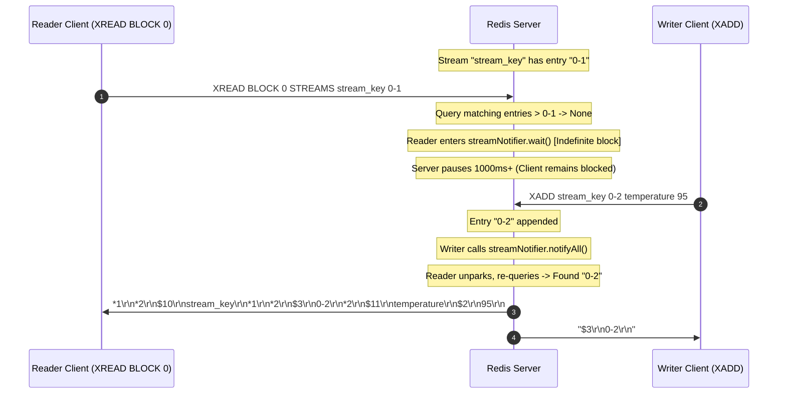

# Stage 30: Blocking reads without timeout

---

## Problem Solved

In Stage 29, `XREAD` was enhanced with the `BLOCK <milliseconds>` parameter to support bounded blocking timeouts (e.g. `BLOCK 1000`). If no new stream records arrived before the timeout elapsed, the server responded with a null array (`*-1\r\n`).

However, real-world stream consumer patterns—such as event-driven daemons, background microservice workers, and distributed log tailers (analogous to `tail -f`)—do not want to wake up, re-connect, or handle null responses when no data arrives. Instead, they require **indefinite blocking**:
- The client connection must remain suspended indefinitely until an entry matching the filter is produced to one of the monitored streams.
- The server must never prematurely time out or drop the connection while blocked.
- As soon as a producing client appends a matching entry via `XADD`, the waiting client must immediately unblock and receive the new entry.

In Redis, setting the `BLOCK` argument to `0` signifies an **indefinite timeout**:
```
XREAD BLOCK 0 STREAMS <stream_key> <id>
```

Key behaviors implemented and verified in this stage:
1. **Zero-Timeout Sentinel Handling**: When `BLOCK 0` is parsed, treat timeout as unbounded ($+\infty$) rather than an immediate expiration or zero-length wait.
2. **Indefinite Monitor Wait**: Instead of invoking timed wait methods like `wait(timeout)`, call unparameterized `streamNotifier.wait()`, parking the worker thread until explicitly notified.
3. **Graceful Wakeup on Mutation**: When any concurrent client executes `XADD` matching the stream cursor, `streamNotifier.notifyAll()` signals all blocked threads to wake up, re-evaluate their cursor queries, format the RESP response, and return data to the consumer.

---

## Thought Process & Architectural Model

**1. The `0` Value Semantics across Systems APIs:**

In many low-level networking and concurrency APIs (such as POSIX `poll`, `select`, or Java `Socket.setSoTimeout` / `Object.wait`):
- Passing `0` often denotes "block forever / infinite timeout", whereas in other frameworks it means "non-blocking / poll once".
- In Redis protocol specifications:
  - `BLOCK <ms>` with `ms > 0`: wait up to `ms` milliseconds.
  - `BLOCK 0`: wait indefinitely until data arrives.
  - No `BLOCK` flag: return immediately with matching data or `*-1\r\n` (null array) if none exist.

**2. Synchronizing Readers and Writers via Java Monitors:**

Using Java's intrinsic monitor on `streamNotifier`:
- When `blockTimeout == 0`:
  - `deadline = Long.MAX_VALUE`.
  - Inside `synchronized (streamNotifier)`:
    - Check if matching records already exist: `matching = queryMatchingEntries(keys, startIds)`.
    - If `matching.isEmpty()`, call `streamNotifier.wait()`.
    - Because `wait()` is called without arguments, the JVM suspends the thread indefinitely without scheduling a timer interrupt.
- When `XADD` executes on any thread:
  - After appending the entry to the stream in `streamStore`, it executes:
    ```java
    synchronized (streamNotifier) {
      streamNotifier.notifyAll();
    }
    ```
  - All blocked reader threads wake up, re-acquire the monitor lock, re-query their predicates (`queryMatchingEntries(...)`), and if new entries are found, break the wait loop and transmit the RESP response.



---

## Full Solution

```java
import java.io.BufferedReader;
import java.io.IOException;
import java.io.InputStream;
import java.io.InputStreamReader;
import java.io.OutputStream;
import java.net.ServerSocket;
import java.net.Socket;
import java.nio.charset.StandardCharsets;
import java.util.ArrayList;
import java.util.Collections;
import java.util.LinkedHashMap;
import java.util.List;
import java.util.Map;
import java.util.Queue;
import java.util.concurrent.CompletableFuture;
import java.util.concurrent.ConcurrentHashMap;
import java.util.concurrent.ConcurrentLinkedQueue;
import java.util.concurrent.TimeUnit;
import java.util.concurrent.TimeoutException;

public class Main {
  private static class Entry {
    final String value;
    final Long expiresAt;

    Entry(String value, Long expiresAt) {
      this.value = value;
      this.expiresAt = expiresAt;
    }

    boolean isExpired() {
      return expiresAt != null && System.currentTimeMillis() > expiresAt;
    }
  }

  private static class StreamEntry {
    final String id;
    final Map<String, String> fields;

    StreamEntry(String id, Map<String, String> fields) {
      this.id = id;
      this.fields = fields;
    }
  }

  private static class StreamResult {
    final String key;
    final List<StreamEntry> entries;

    StreamResult(String key, List<StreamEntry> entries) {
      this.key = key;
      this.entries = entries;
    }
  }

  private static final Map<String, Entry> store = new ConcurrentHashMap<>();
  private static final Map<String, List<String>> listStore = new ConcurrentHashMap<>();
  private static final Map<String, List<StreamEntry>> streamStore = new ConcurrentHashMap<>();
  private static final Map<String, Queue<CompletableFuture<String>>> blockedWaiters = new ConcurrentHashMap<>();
  private static final Map<String, Object> keyLocks = new ConcurrentHashMap<>();
  private static final Object streamNotifier = new Object();

  private static Object getLock(String key) {
    return keyLocks.computeIfAbsent(key, k -> new Object());
  }

  private static int compareStreamId(long ms1, long seq1, long ms2, long seq2) {
    if (ms1 != ms2) {
      return Long.compare(ms1, ms2);
    }
    return Long.compare(seq1, seq2);
  }

  private static List<StreamResult> queryMatchingEntries(String[] keys, String[] startIds) {
    List<StreamResult> results = new ArrayList<>();
    for (int i = 0; i < keys.length; i++) {
      String key = keys[i];
      String startIdStr = startIds[i];

      long startMs, startSeq;
      if (startIdStr.contains("-")) {
        String[] p = startIdStr.split("-");
        startMs = Long.parseLong(p[0]);
        startSeq = Long.parseLong(p[1]);
      } else {
        startMs = Long.parseLong(startIdStr);
        startSeq = 0;
      }

      List<StreamEntry> stream = streamStore.get(key);
      List<StreamEntry> matching = new ArrayList<>();
      if (stream != null) {
        synchronized (stream) {
          for (StreamEntry entry : stream) {
            String[] partsId = entry.id.split("-");
            long entryMs = Long.parseLong(partsId[0]);
            long entrySeq = Long.parseLong(partsId[1]);

            if (compareStreamId(entryMs, entrySeq, startMs, startSeq) > 0) {
              matching.add(entry);
            }
          }
        }
      }

      if (!matching.isEmpty()) {
        results.add(new StreamResult(key, matching));
      }
    }
    return results;
  }

  public static void main(String[] args) {
    System.out.println("Logs from your program will appear here!");

    int port = 6379;

    try {
      ServerSocket serverSocket = new ServerSocket(port);
      serverSocket.setReuseAddress(true);

      while (true) {
        Socket clientSocket = serverSocket.accept();

        new Thread(() -> {
          try {
            OutputStream out = clientSocket.getOutputStream();
            InputStream in = clientSocket.getInputStream();
            BufferedReader reader = new BufferedReader(new InputStreamReader(in));

            while (true) {
              String line = reader.readLine();
              if (line == null) break; // client disconnected

              int n = Integer.parseInt(line.substring(1));

              String[] parts = new String[n];
              for (int i = 0; i < n; i++) {
                reader.readLine();            // Skip "$<len>"
                parts[i] = reader.readLine(); // Payload
              }

              String command = parts[0];

              if (command.equalsIgnoreCase("PING")) {
                out.write("+PONG\r\n".getBytes(StandardCharsets.UTF_8));
              } else if (command.equalsIgnoreCase("ECHO")) {
                String arg = parts[1];
                byte[] bytes = arg.getBytes(StandardCharsets.UTF_8);
                String response = "$" + bytes.length + "\r\n" + arg + "\r\n";
                out.write(response.getBytes(StandardCharsets.UTF_8));
              } else if (command.equalsIgnoreCase("SET")) {
                String key = parts[1];
                String value = parts[2];
                Long expiresAt = null;

                if (parts.length >= 5) {
                  if (parts[3].equalsIgnoreCase("PX")) {
                    long pxMillis = Long.parseLong(parts[4]);
                    expiresAt = System.currentTimeMillis() + pxMillis;
                  } else if (parts[3].equalsIgnoreCase("EX")) {
                    long exSeconds = Long.parseLong(parts[4]);
                    expiresAt = System.currentTimeMillis() + (exSeconds * 1000);
                  }
                }

                store.put(key, new Entry(value, expiresAt));
                out.write("+OK\r\n".getBytes(StandardCharsets.UTF_8));
              } else if (command.equalsIgnoreCase("GET")) {
                String key = parts[1];
                Entry entry = store.get(key);

                if (entry != null && !entry.isExpired()) {
                  byte[] bytes = entry.value.getBytes(StandardCharsets.UTF_8);
                  String response = "$" + bytes.length + "\r\n" + entry.value + "\r\n";
                  out.write(response.getBytes(StandardCharsets.UTF_8));
                } else {
                  if (entry != null && entry.isExpired()) {
                    store.remove(key);
                  }
                  out.write("$-1\r\n".getBytes(StandardCharsets.UTF_8));
                }
              } else if (command.equalsIgnoreCase("TYPE")) {
                if (parts.length < 2) {
                  out.write("-ERR wrong number of arguments for 'type' command\r\n".getBytes(StandardCharsets.UTF_8));
                } else {
                  String key = parts[1];
                  Entry entry = store.get(key);
                  if (entry != null) {
                    if (entry.isExpired()) {
                      store.remove(key);
                      entry = null;
                    }
                  }

                  if (entry != null) {
                    out.write("+string\r\n".getBytes(StandardCharsets.UTF_8));
                  } else {
                    List<String> list = listStore.get(key);
                    if (list != null && !list.isEmpty()) {
                      out.write("+list\r\n".getBytes(StandardCharsets.UTF_8));
                    } else if (streamStore.containsKey(key)) {
                      out.write("+stream\r\n".getBytes(StandardCharsets.UTF_8));
                    } else {
                      out.write("+none\r\n".getBytes(StandardCharsets.UTF_8));
                    }
                  }
                }
              } else if (command.equalsIgnoreCase("XADD")) {
                if (parts.length < 5 || (parts.length - 3) % 2 != 0) {
                  out.write("-ERR wrong number of arguments for 'xadd' command\r\n".getBytes(StandardCharsets.UTF_8));
                } else {
                  String key = parts[1];
                  String id = parts[2];
                  Map<String, String> fields = new LinkedHashMap<>();
                  for (int i = 3; i < parts.length - 1; i += 2) {
                    fields.put(parts[i], parts[i + 1]);
                  }

                  List<StreamEntry> stream = streamStore.computeIfAbsent(key, k -> Collections.synchronizedList(new ArrayList<>()));

                  if (id.equals("*")) {
                    long time = System.currentTimeMillis();
                    synchronized (stream) {
                      long seq;
                      if (stream.isEmpty()) {
                        seq = 0;
                      } else {
                        StreamEntry lastEntry = stream.get(stream.size() - 1);
                        String[] lastParts = lastEntry.id.split("-");
                        long lastTime = Long.parseLong(lastParts[0]);
                        long lastSeq = Long.parseLong(lastParts[1]);

                        if (time == lastTime) {
                          seq = lastSeq + 1;
                        } else if (time > lastTime) {
                          seq = 0;
                        } else {
                          time = lastTime;
                          seq = lastSeq + 1;
                        }
                      }

                      String generatedId = time + "-" + seq;
                      stream.add(new StreamEntry(generatedId, fields));
                      synchronized (streamNotifier) {
                        streamNotifier.notifyAll();
                      }
                      byte[] idBytes = generatedId.getBytes(StandardCharsets.UTF_8);
                      String response = "$" + idBytes.length + "\r\n" + generatedId + "\r\n";
                      out.write(response.getBytes(StandardCharsets.UTF_8));
                      out.flush();
                    }
                  } else if (id.endsWith("-*")) {
                    long time = Long.parseLong(id.substring(0, id.length() - 2));
                    synchronized (stream) {
                      String generatedId = null;
                      if (stream.isEmpty()) {
                        long seq = (time == 0) ? 1 : 0;
                        generatedId = time + "-" + seq;
                      } else {
                        StreamEntry lastEntry = stream.get(stream.size() - 1);
                        String[] lastParts = lastEntry.id.split("-");
                        long lastTime = Long.parseLong(lastParts[0]);
                        long lastSeq = Long.parseLong(lastParts[1]);

                        if (time < lastTime) {
                          out.write("-ERR The ID specified in XADD is equal or smaller than the target stream top item\r\n".getBytes(StandardCharsets.UTF_8));
                          out.flush();
                        } else if (time == lastTime) {
                          long seq = lastSeq + 1;
                          generatedId = time + "-" + seq;
                        } else {
                          long seq = (time == 0) ? 1 : 0;
                          generatedId = time + "-" + seq;
                        }
                      }

                      if (generatedId != null) {
                        stream.add(new StreamEntry(generatedId, fields));
                        synchronized (streamNotifier) {
                          streamNotifier.notifyAll();
                        }
                        byte[] idBytes = generatedId.getBytes(StandardCharsets.UTF_8);
                        String response = "$" + idBytes.length + "\r\n" + generatedId + "\r\n";
                        out.write(response.getBytes(StandardCharsets.UTF_8));
                        out.flush();
                      }
                    }
                  } else {
                    String[] dash = id.split("-");
                    long time = Long.parseLong(dash[0]);
                    long seq = Long.parseLong(dash[1]);

                    if (time <= 0 && seq <= 0) {
                      out.write("-ERR The ID specified in XADD must be greater than 0-0\r\n".getBytes(StandardCharsets.UTF_8));
                      out.flush();
                    } else {
                      synchronized (stream) {
                        boolean valid = true;
                        if (!stream.isEmpty()) {
                          StreamEntry lastEntry = stream.get(stream.size() - 1);
                          String[] lastDash = lastEntry.id.split("-");
                          long lastTime = Long.parseLong(lastDash[0]);
                          long lastSeq = Long.parseLong(lastDash[1]);
                          if ((time < lastTime) || (time == lastTime && seq <= lastSeq)) {
                            valid = false;
                            out.write("-ERR The ID specified in XADD is equal or smaller than the target stream top item\r\n".getBytes(StandardCharsets.UTF_8));
                            out.flush();
                          }
                        }

                        if (valid) {
                          stream.add(new StreamEntry(id, fields));
                          synchronized (streamNotifier) {
                            streamNotifier.notifyAll();
                          }
                          byte[] idBytes = id.getBytes(StandardCharsets.UTF_8);
                          String response = "$" + idBytes.length + "\r\n" + id + "\r\n";
                          out.write(response.getBytes(StandardCharsets.UTF_8));
                          out.flush();
                        }
                      }
                    }
                  }
                }
              } else if (command.equalsIgnoreCase("XRANGE")) {
                if (parts.length < 4) {
                  out.write("-ERR wrong number of arguments for 'xrange' command\r\n".getBytes(StandardCharsets.UTF_8));
                } else {
                  String key = parts[1];
                  String start = parts[2];
                  String end = parts[3];

                  long startMs, startSeq;
                  if (start.equals("-")) {
                    startMs = 0;
                    startSeq = 0;
                  } else if (start.equals("+")) {
                    startMs = Long.MAX_VALUE;
                    startSeq = Long.MAX_VALUE;
                  } else if (start.contains("-")) {
                    String[] p = start.split("-");
                    startMs = Long.parseLong(p[0]);
                    startSeq = Long.parseLong(p[1]);
                  } else {
                    startMs = Long.parseLong(start);
                    startSeq = 0;
                  }

                  long endMs, endSeq;
                  if (end.equals("+")) {
                    endMs = Long.MAX_VALUE;
                    endSeq = Long.MAX_VALUE;
                  } else if (end.equals("-")) {
                    endMs = 0;
                    endSeq = 0;
                  } else if (end.contains("-")) {
                    String[] p = end.split("-");
                    endMs = Long.parseLong(p[0]);
                    endSeq = Long.parseLong(p[1]);
                  } else {
                    endMs = Long.parseLong(end);
                    endSeq = Long.MAX_VALUE;
                  }

                  List<StreamEntry> stream = streamStore.get(key);
                  if (stream == null || stream.isEmpty()) {
                    out.write("*0\r\n".getBytes(StandardCharsets.UTF_8));
                  } else {
                    List<StreamEntry> matching = new ArrayList<>();
                    synchronized (stream) {
                      for (StreamEntry entry : stream) {
                        String[] partsId = entry.id.split("-");
                        long entryMs = Long.parseLong(partsId[0]);
                        long entrySeq = Long.parseLong(partsId[1]);

                        if (compareStreamId(entryMs, entrySeq, startMs, startSeq) >= 0 &&
                            compareStreamId(entryMs, entrySeq, endMs, endSeq) <= 0) {
                          matching.add(entry);
                        }
                      }
                    }

                    StringBuilder sb = new StringBuilder();
                    sb.append("*").append(matching.size()).append("\r\n");
                    for (StreamEntry entry : matching) {
                      sb.append("*2\r\n");
                      byte[] idBytes = entry.id.getBytes(StandardCharsets.UTF_8);
                      sb.append("$").append(idBytes.length).append("\r\n").append(entry.id).append("\r\n");
                      sb.append("*").append(entry.fields.size() * 2).append("\r\n");
                      for (Map.Entry<String, String> field : entry.fields.entrySet()) {
                        byte[] kBytes = field.getKey().getBytes(StandardCharsets.UTF_8);
                        sb.append("$").append(kBytes.length).append("\r\n").append(field.getKey()).append("\r\n");
                        byte[] vBytes = field.getValue().getBytes(StandardCharsets.UTF_8);
                        sb.append("$").append(vBytes.length).append("\r\n").append(field.getValue()).append("\r\n");
                      }
                    }
                    out.write(sb.toString().getBytes(StandardCharsets.UTF_8));
                  }
                }
              } else if (command.equalsIgnoreCase("XREAD")) {
                int streamsIndex = -1;
                long blockTimeout = -1;

                for (int i = 1; i < parts.length; i++) {
                  if (parts[i].equalsIgnoreCase("BLOCK")) {
                    if (i + 1 < parts.length) {
                      blockTimeout = Long.parseLong(parts[i + 1]);
                      i++;
                    }
                  } else if (parts[i].equalsIgnoreCase("STREAMS")) {
                    streamsIndex = i;
                    break;
                  }
                }

                int rem = (streamsIndex == -1) ? 0 : parts.length - (streamsIndex + 1);
                if (streamsIndex == -1 || rem <= 0 || rem % 2 != 0) {
                  out.write("-ERR syntax error\r\n".getBytes(StandardCharsets.UTF_8));
                } else {
                  int numStreams = rem / 2;
                  String[] keys = new String[numStreams];
                  String[] startIds = new String[numStreams];
                  for (int i = 0; i < numStreams; i++) {
                    keys[i] = parts[streamsIndex + 1 + i];
                    startIds[i] = parts[streamsIndex + 1 + numStreams + i];
                  }

                  long deadline = (blockTimeout == 0) ? Long.MAX_VALUE : (System.currentTimeMillis() + blockTimeout);
                  List<StreamResult> matching = queryMatchingEntries(keys, startIds);

                  if (matching.isEmpty() && blockTimeout >= 0) {
                    synchronized (streamNotifier) {
                      matching = queryMatchingEntries(keys, startIds);
                      while (matching.isEmpty()) {
                        long remMs = deadline - System.currentTimeMillis();
                        if (blockTimeout > 0 && remMs <= 0) break;
                        try {
                          if (blockTimeout == 0) {
                            streamNotifier.wait();
                          } else {
                            streamNotifier.wait(Math.max(1, remMs));
                          }
                        } catch (InterruptedException e) {
                          Thread.currentThread().interrupt();
                          break;
                        }
                        matching = queryMatchingEntries(keys, startIds);
                      }
                    }
                  }

                  if (matching.isEmpty()) {
                    out.write("*-1\r\n".getBytes(StandardCharsets.UTF_8));
                  } else {
                    StringBuilder sb = new StringBuilder();
                    sb.append("*").append(matching.size()).append("\r\n");
                    for (StreamResult sr : matching) {
                      sb.append("*2\r\n");
                      byte[] keyBytes = sr.key.getBytes(StandardCharsets.UTF_8);
                      sb.append("$").append(keyBytes.length).append("\r\n").append(sr.key).append("\r\n");
                      sb.append("*").append(sr.entries.size()).append("\r\n");
                      for (StreamEntry entry : sr.entries) {
                        sb.append("*2\r\n");
                        byte[] idBytes = entry.id.getBytes(StandardCharsets.UTF_8);
                        sb.append("$").append(idBytes.length).append("\r\n").append(entry.id).append("\r\n");
                        sb.append("*").append(entry.fields.size() * 2).append("\r\n");
                        for (Map.Entry<String, String> field : entry.fields.entrySet()) {
                          byte[] kBytes = field.getKey().getBytes(StandardCharsets.UTF_8);
                          sb.append("$").append(kBytes.length).append("\r\n").append(field.getKey()).append("\r\n");
                          byte[] vBytes = field.getValue().getBytes(StandardCharsets.UTF_8);
                          sb.append("$").append(vBytes.length).append("\r\n").append(field.getValue()).append("\r\n");
                        }
                      }
                    }
                    out.write(sb.toString().getBytes(StandardCharsets.UTF_8));
                  }
                }
              } else if (command.equalsIgnoreCase("RPUSH")) {
                if (parts.length < 3) {
                  out.write("-ERR wrong number of arguments for 'rpush' command\r\n".getBytes(StandardCharsets.UTF_8));
                } else {
                  String key = parts[1];
                  Object lock = getLock(key);
                  int newLength;
                  synchronized (lock) {
                    List<String> list = listStore.computeIfAbsent(key, k -> new ArrayList<>());
                    for (int i = 2; i < parts.length; i++) {
                      list.add(parts[i]);
                    }
                    newLength = list.size();

                    Queue<CompletableFuture<String>> waiters = blockedWaiters.get(key);
                    if (waiters != null) {
                      while (!list.isEmpty() && !waiters.isEmpty()) {
                        CompletableFuture<String> waiter = waiters.poll();
                        if (waiter != null && !waiter.isDone()) {
                          String head = list.get(0);
                          if (waiter.complete(head)) {
                            list.remove(0);
                          }
                        }
                      }
                    }
                    if (list.isEmpty()) {
                      listStore.remove(key);
                    }
                  }
                  String response = ":" + newLength + "\r\n";
                  out.write(response.getBytes(StandardCharsets.UTF_8));
                }
              } else if (command.equalsIgnoreCase("LPUSH")) {
                if (parts.length < 3) {
                  out.write("-ERR wrong number of arguments for 'lpush' command\r\n".getBytes(StandardCharsets.UTF_8));
                } else {
                  String key = parts[1];
                  Object lock = getLock(key);
                  int newLength;
                  synchronized (lock) {
                    List<String> list = listStore.computeIfAbsent(key, k -> new ArrayList<>());
                    for (int i = 2; i < parts.length; i++) {
                      list.add(0, parts[i]);
                    }
                    newLength = list.size();

                    Queue<CompletableFuture<String>> waiters = blockedWaiters.get(key);
                    if (waiters != null) {
                      while (!list.isEmpty() && !waiters.isEmpty()) {
                        CompletableFuture<String> waiter = waiters.poll();
                        if (waiter != null && !waiter.isDone()) {
                          String head = list.get(0);
                          if (waiter.complete(head)) {
                            list.remove(0);
                          }
                        }
                      }
                    }
                    if (list.isEmpty()) {
                      listStore.remove(key);
                    }
                  }
                  String response = ":" + newLength + "\r\n";
                  out.write(response.getBytes(StandardCharsets.UTF_8));
                }
              } else if (command.equalsIgnoreCase("LLEN")) {
                if (parts.length < 2) {
                  out.write("-ERR wrong number of arguments for 'llen' command\r\n".getBytes(StandardCharsets.UTF_8));
                } else {
                  String key = parts[1];
                  Object lock = getLock(key);
                  int length = 0;
                  synchronized (lock) {
                    List<String> list = listStore.get(key);
                    if (list != null) {
                      length = list.size();
                    }
                  }
                  String response = ":" + length + "\r\n";
                  out.write(response.getBytes(StandardCharsets.UTF_8));
                }
              } else if (command.equalsIgnoreCase("LPOP")) {
                if (parts.length < 2) {
                  out.write("-ERR wrong number of arguments for 'lpop' command\r\n".getBytes(StandardCharsets.UTF_8));
                } else if (parts.length == 2) {
                  String key = parts[1];
                  Object lock = getLock(key);
                  String removedElement = null;
                  synchronized (lock) {
                    List<String> list = listStore.get(key);
                    if (list != null && !list.isEmpty()) {
                      removedElement = list.remove(0);
                      if (list.isEmpty()) {
                        listStore.remove(key);
                      }
                    }
                  }
                  if (removedElement == null) {
                    out.write("$-1\r\n".getBytes(StandardCharsets.UTF_8));
                  } else {
                    byte[] bytes = removedElement.getBytes(StandardCharsets.UTF_8);
                    String response = "$" + bytes.length + "\r\n" + removedElement + "\r\n";
                    out.write(response.getBytes(StandardCharsets.UTF_8));
                  }
                } else {
                  String key = parts[1];
                  try {
                    int count = Integer.parseInt(parts[2]);
                    if (count < 0) {
                      out.write("-ERR value is out of range, must be positive\r\n".getBytes(StandardCharsets.UTF_8));
                    } else {
                      Object lock = getLock(key);
                      List<String> removedElements = new ArrayList<>();
                      boolean keyExisted = false;
                      synchronized (lock) {
                        List<String> list = listStore.get(key);
                        if (list != null) {
                          keyExisted = true;
                          int toRemove = Math.min(count, list.size());
                          for (int i = 0; i < toRemove; i++) {
                            removedElements.add(list.remove(0));
                          }
                          if (list.isEmpty()) {
                            listStore.remove(key);
                          }
                        }
                      }
                      if (!keyExisted || (removedElements.isEmpty() && count > 0)) {
                        out.write("*-1\r\n".getBytes(StandardCharsets.UTF_8));
                      } else {
                        StringBuilder sb = new StringBuilder();
                        sb.append("*").append(removedElements.size()).append("\r\n");
                        for (String elem : removedElements) {
                          byte[] elemBytes = elem.getBytes(StandardCharsets.UTF_8);
                          sb.append("$").append(elemBytes.length).append("\r\n").append(elem).append("\r\n");
                        }
                        out.write(sb.toString().getBytes(StandardCharsets.UTF_8));
                      }
                    }
                  } catch (NumberFormatException e) {
                    out.write("-ERR value is not an integer or out of range\r\n".getBytes(StandardCharsets.UTF_8));
                  }
                }
              } else if (command.equalsIgnoreCase("BLPOP")) {
                if (parts.length < 3) {
                  out.write("-ERR wrong number of arguments for 'blpop' command\r\n".getBytes(StandardCharsets.UTF_8));
                } else {
                  try {
                    String key = parts[1];
                    double timeoutSec = Double.parseDouble(parts[2]);
                    if (timeoutSec < 0) {
                      out.write("-ERR timeout is negative\r\n".getBytes(StandardCharsets.UTF_8));
                    } else {
                      long timeoutMillis = (long) (timeoutSec * 1000);
                      Object lock = getLock(key);
                      String popped = null;
                      CompletableFuture<String> future = null;

                      synchronized (lock) {
                        List<String> list = listStore.get(key);
                        if (list != null && !list.isEmpty()) {
                          popped = list.remove(0);
                          if (list.isEmpty()) {
                            listStore.remove(key);
                          }
                        } else {
                          future = new CompletableFuture<>();
                          blockedWaiters.computeIfAbsent(key, k -> new ConcurrentLinkedQueue<>()).add(future);
                        }
                      }

                      if (popped != null) {
                        byte[] keyBytes = key.getBytes(StandardCharsets.UTF_8);
                        byte[] elemBytes = popped.getBytes(StandardCharsets.UTF_8);
                        String response = "*2\r\n$" + keyBytes.length + "\r\n" + key + "\r\n$" + elemBytes.length + "\r\n" + popped + "\r\n";
                        out.write(response.getBytes(StandardCharsets.UTF_8));
                      } else if (future != null) {
                        try {
                          if (timeoutMillis > 0) {
                            popped = future.get(timeoutMillis, TimeUnit.MILLISECONDS);
                          } else {
                            popped = future.get();
                          }
                          byte[] keyBytes = key.getBytes(StandardCharsets.UTF_8);
                          byte[] elemBytes = popped.getBytes(StandardCharsets.UTF_8);
                          String response = "*2\r\n$" + keyBytes.length + "\r\n" + key + "\r\n$" + elemBytes.length + "\r\n" + popped + "\r\n";
                          out.write(response.getBytes(StandardCharsets.UTF_8));
                        } catch (TimeoutException e) {
                          Queue<CompletableFuture<String>> waiters = blockedWaiters.get(key);
                          if (waiters != null) {
                            waiters.remove(future);
                          }
                          future.cancel(true);
                          out.write("*-1\r\n".getBytes(StandardCharsets.UTF_8));
                        } catch (Exception e) {
                          Queue<CompletableFuture<String>> waiters = blockedWaiters.get(key);
                          if (waiters != null) {
                            waiters.remove(future);
                          }
                          future.cancel(true);
                          out.write("*-1\r\n".getBytes(StandardCharsets.UTF_8));
                        }
                      }
                    }
                  } catch (NumberFormatException e) {
                    out.write("-ERR timeout is not a float or out of range\r\n".getBytes(StandardCharsets.UTF_8));
                  }
                }
              } else if (command.equalsIgnoreCase("LRANGE")) {
                if (parts.length < 4) {
                  out.write("-ERR wrong number of arguments for 'lrange' command\r\n".getBytes(StandardCharsets.UTF_8));
                } else {
                  String key = parts[1];
                  int start = Integer.parseInt(parts[2]);
                  int stop = Integer.parseInt(parts[3]);

                  Object lock = getLock(key);
                  List<String> elementsToReturn;
                  synchronized (lock) {
                    List<String> list = listStore.get(key);
                    if (list == null || list.isEmpty()) {
                      elementsToReturn = Collections.emptyList();
                    } else {
                      int size = list.size();
                      if (start < 0) start += size;
                      if (stop < 0) stop += size;
                      if (start < 0) start = 0;
                      if (stop < 0) stop = 0;

                      if (start >= size || start > stop) {
                        elementsToReturn = Collections.emptyList();
                      } else {
                        int stopIdx = Math.min(stop, size - 1);
                        elementsToReturn = new ArrayList<>(list.subList(start, stopIdx + 1));
                      }
                    }
                  }

                  if (elementsToReturn.isEmpty()) {
                    out.write("*0\r\n".getBytes(StandardCharsets.UTF_8));
                  } else {
                    StringBuilder sb = new StringBuilder();
                    sb.append("*").append(elementsToReturn.size()).append("\r\n");
                    for (String elem : elementsToReturn) {
                      byte[] elemBytes = elem.getBytes(StandardCharsets.UTF_8);
                      sb.append("$").append(elemBytes.length).append("\r\n").append(elem).append("\r\n");
                    }
                    out.write(sb.toString().getBytes(StandardCharsets.UTF_8));
                  }
                }
              }
              out.flush();
            }
          } catch (IOException e) {
            System.out.println("IOException: " + e.getMessage());
          }
        }).start();
      }
    } catch (IOException e) {
      System.out.println("IOException: " + e.getMessage());
    }
  }
}
```

---

## Concepts

**[CONCEPT] Sentinel Values for Unbounded Duration**  
In systems engineering, a value of `0` or `-1` is frequently chosen as a sentinel representing infinite duration rather than zero duration. In Redis `XREAD`, `BLOCK 0` signifies "do not time out; block indefinitely until an event arrives". A common bug in systems adopting this pattern is treating `0` as an immediate timeout (`wait(0)` vs `break if remMs <= 0`), accidentally turning long-polling connections into immediate empty responses.

**[CONCEPT] Unparameterized Monitor Wait (`wait()`) vs Timed Wait (`wait(timeout)`)**  
- In the JVM and underlying OS thread schedulers, `wait()` removes the thread from the runnable queue and places it on the object's wait set without arming an OS timer. The thread stays descheduled with zero CPU consumption until an explicit signal (`notify()` / `notifyAll()`) or interrupt occurs.
- In contrast, `wait(timeout)` arms a kernel timer. If `timeout` expires before a signal arrives, the kernel re-enqueues the thread onto the ready queue. For indefinite blocking, avoiding timer arming prevents spurious wakeups caused by timer expiry.

**[CONCEPT] Condition Re-evaluation Under Spurious Wakeups**  
Even when waiting indefinitely via `streamNotifier.wait()`, POSIX threads and JVM specifications permit spurious wakeups (where a thread awakens without an explicit notification). The wait MUST remain encapsulated in:
```java
while (matching.isEmpty()) {
  if (blockTimeout == 0) {
    streamNotifier.wait();
  } else { ... }
  matching = queryMatchingEntries(keys, startIds);
}
```
If a spurious wakeup or a notification for an unrelated stream occurs, the reader evaluates `matching.isEmpty()`, finds no relevant data, and seamlessly re-enters `streamNotifier.wait()`.

**[SYNTAX] Java specifics — lookup, don't memorize**  
- `streamNotifier.wait()`: Indefinitely releases the monitor lock on `streamNotifier` and halts the current thread until `streamNotifier.notify()` or `streamNotifier.notifyAll()` is called.
- `Long.MAX_VALUE`: Maximum possible signed 64-bit integer ($2^{63}-1$), used as the deadline for unbounded timeouts to prevent overflow when computing `deadline - System.currentTimeMillis()`.

---

## What Breaks It (Failure Modes)

- **Accidental Expiration Check for Zero Timeout**:
  - *Hazard*: If the loop termination logic checks `if (remMs <= 0) break;` without distinguishing `blockTimeout > 0` from `blockTimeout == 0`, a client sending `BLOCK 0` will instantly exit the wait loop and receive `*-1\r\n`.
  - *Mitigation*: Strictly guard deadline expiration checks with `if (blockTimeout > 0 && remMs <= 0) break;`.
- **Calling `wait(0)` on Some Concurrency Libraries**:
  - *Hazard*: In Java, `wait(0)` behaves identically to `wait()`. However, in many other libraries or future refactors (e.g. `CompletableFuture.get(0, TimeUnit.MILLISECONDS)`), `0` means zero delay (immediate timeout).
  - *Mitigation*: Explicitly branch on `blockTimeout == 0` and call parameterless `wait()`.
- **Missed Notification on Interleaved Appends**:
  - *Hazard*: If `queryMatchingEntries` runs before acquiring the lock and finds nothing, and another client commits `XADD` right then, the `notifyAll()` is lost if the reader does not re-query inside `synchronized (streamNotifier)` before calling `wait()`.
  - *Mitigation*: Re-run `matching = queryMatchingEntries(keys, startIds)` immediately after acquiring `synchronized (streamNotifier)`.

---

## Tradeoffs

| Approach | Advantages | Disadvantages |
|---|---|---|
| **Thread-per-client Indefinite Blocking (`wait()`)** | Simple, intuitive, minimal code footprint; leaves thread idle at zero CPU cost. | High memory footprint: 10,000 idle clients require 10,000 threads and stack allocations (~10GB+ memory unless virtual threads are used). |
| **Virtual Threads / Fibers (`Thread.startVirtualThread`)** | Millions of concurrent blocking readers with minimal memory overhead; keeps blocking synchronous code style. | Requires Java 21+ JVM features and careful avoidance of monitor pinning (synchronization pinning). |
| **Non-blocking Reactive Event Loop (Redis C Architecture)** | A single thread can monitor thousands of blocked streams and clients using client state lists without thread stacks. | High code complexity: state machines, stream watch tables, client pause/resume lifecycle management. |

---

## Wire Format / Protocol

| Scenario | Client Request Wire Format | Server Response Wire Format |
|---|---|---|
| Indefinite Blocking XREAD (`BLOCK 0`) waiting for `0-2` | `*6\r\n$5\r\n` `XREAD\r\n$5\r\n` `BLOCK\r\n$1\r\n` `0\r\n$7\r\n` `STREAMS\r\n$10\r\n` `stream_key\r\n$3\r\n0-1\r\n` | `*1\r\n*2\r\n$10\r\nstream_key\r\n*1\r\n*2\r\n$3\r\n0-2\r\n*2\r\n$11\r\ntemperature\r\n$2\r\n95\r\n` |
| Concurrent Producer `XADD` | `*5\r\n$4\r\n` `XADD\r\n$10\r\n` `stream_key\r\n$3\r\n0-2\r\n$11\r\ntemperature\r\n$2\r\n95\r\n` | `$3\r\n0-2\r\n` |

---

## How It Flows

```
1. Initial State:
   Stream "stream_key" has entry "0-1".

2. Client 1 issues indefinite blocking read:
   Client 1 -> "XREAD BLOCK 0 STREAMS stream_key 0-1"
   Server (Thread 1):
     blockTimeout = 0
     deadline = Long.MAX_VALUE
     matching = queryMatchingEntries("stream_key", "0-1") -> []
     synchronized (streamNotifier) {
       streamNotifier.wait(); // Thread 1 parks indefinitely
     }

3. Tester verifies client remains blocked:
   Tester sleeps 1000ms.
   Server Thread 1 stays parked; no response sent.

4. Client 2 writes new entry:
   Client 2 -> "XADD stream_key 0-2 temperature 95"
   Server (Thread 2):
     stream.add("0-2", {"temperature": "95"})
     synchronized (streamNotifier) {
       streamNotifier.notifyAll(); // Wakes Thread 1
     }
     Client 2 <- "$3\r\n0-2\r\n"

5. Client 1 wakes and responds:
   Server (Thread 1):
     matching = queryMatchingEntries("stream_key", "0-1") -> [StreamResult("stream_key", ["0-2"])]
     loop terminates.
     Client 1 <- RESP array with "0-2" and fields.
```

---

## Rebuild Checklist

- [ ] In `Main.java` inside the `XREAD` command handler:
  - [ ] Parse `blockTimeout` from arguments (`BLOCK <ms>`); recognize `0` as indefinite.
  - [ ] Set `deadline = (blockTimeout == 0) ? Long.MAX_VALUE : (System.currentTimeMillis() + blockTimeout);`.
  - [ ] In the blocking condition check:
    - [ ] Condition: `if (matching.isEmpty() && blockTimeout >= 0)` (0 is valid!).
    - [ ] Synchronize on `streamNotifier`.
    - [ ] While `matching.isEmpty()`:
      - [ ] Only break on deadline if `blockTimeout > 0 && remMs <= 0`.
      - [ ] If `blockTimeout == 0`, call parameterless `streamNotifier.wait()`.
      - [ ] Otherwise, call `streamNotifier.wait(Math.max(1, remMs))`.
      - [ ] Re-query `matching = queryMatchingEntries(keys, startIds)`.
- [ ] In `XADD` command handler:
  - [ ] Ensure `synchronized (streamNotifier) { streamNotifier.notifyAll(); }` is invoked on all successful insertions.
