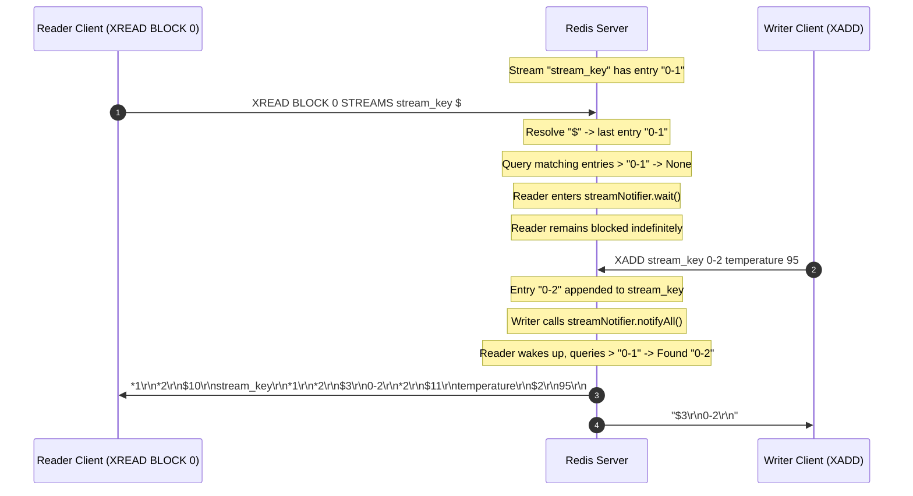

# Stage 31: Blocking reads using $

---

## Problem Solved

In previous stages, `XREAD` required consumers to specify an explicit starting entry ID (e.g. `0-0`, `0-1`, or `1526985054079-0`). Any entry with an ID strictly greater than that ID was returned immediately or after blocking.

However, in many real-time streaming architectures (such as notification dispatchers, live dashboard feeds, or event-driven consumers), a client does not care about past historical entries that were already appended before the client joined. Instead, the client only wants to receive **new entries added after the `XREAD` command is issued**.

In Redis, the special sentinel symbol `$` is supported as the starting ID in `XREAD`:
```bash
redis-cli XREAD BLOCK 1000 STREAMS stream_key $
redis-cli XREAD BLOCK 0 STREAMS stream_key $
```

Key behaviors implemented in this stage:
1. **Dynamic High-Water Mark Resolution**: When parsing the `startIds` for `XREAD`, any occurrence of `$` is resolved to the ID of the **last entry** currently in the stream.
2. **Empty Stream Fallback**: If the target stream is empty or does not exist yet, `$` resolves to the minimum possible cursor `"0-0"`, ensuring that the very first newly inserted entry (which must have an ID $> 0-0$) will match and unblock the client.
3. **Point-in-Time Snapshot**: The `$` resolution occurs **once** at the moment the command is received, prior to the wait loop. As subsequent `XADD` commands append records, the reader compares against this initial high-water mark.

---

## Thought Process & Architectural Model

**1. The `$` Sentinel as the Stream's High-Water Mark:**

In message broker topologies (Kafka, RabbitMQ, Redis Streams):
- Consuming from offset `0` / `earliest` plays back the entire retention log.
- Consuming from `latest` / `tail` skips existing history and only streams events produced after subscription begins.
- In Redis Streams, specifying `$` instructs the server: *"Set my cursor to whatever the highest ID is right now."*

**2. Snapshot Timing & Concurrency:**

It is critical that `$` is resolved **before** entering the blocking wait loop:
- If resolved once before the wait loop, the resolved ID becomes a stable cursor (e.g., `0-1`).
- When a writer appends `0-2`, `0-2 > 0-1` is true, so the reader sees `0-2`.
- If a naive implementation re-evaluated `$` inside the wait loop on each wakeup, `$` would jump to the newly added entry's ID and `queryMatchingEntries` (`id > startId`) would return empty, causing the reader to miss entries.



---

## Full Solution

```java
import java.io.BufferedReader;
import java.io.IOException;
import java.io.InputStream;
import java.io.InputStreamReader;
import java.io.OutputStream;
import java.net.ServerSocket;
import java.net.Socket;
import java.nio.charset.StandardCharsets;
import java.util.ArrayList;
import java.util.Collections;
import java.util.LinkedHashMap;
import java.util.List;
import java.util.Map;
import java.util.Queue;
import java.util.concurrent.CompletableFuture;
import java.util.concurrent.ConcurrentHashMap;
import java.util.concurrent.ConcurrentLinkedQueue;
import java.util.concurrent.TimeUnit;
import java.util.concurrent.TimeoutException;

public class Main {
  private static class Entry {
    final String value;
    final Long expiresAt;

    Entry(String value, Long expiresAt) {
      this.value = value;
      this.expiresAt = expiresAt;
    }

    boolean isExpired() {
      return expiresAt != null && System.currentTimeMillis() > expiresAt;
    }
  }

  private static class StreamEntry {
    final String id;
    final Map<String, String> fields;

    StreamEntry(String id, Map<String, String> fields) {
      this.id = id;
      this.fields = fields;
    }
  }

  private static class StreamResult {
    final String key;
    final List<StreamEntry> entries;

    StreamResult(String key, List<StreamEntry> entries) {
      this.key = key;
      this.entries = entries;
    }
  }

  private static final Map<String, Entry> store = new ConcurrentHashMap<>();
  private static final Map<String, List<String>> listStore = new ConcurrentHashMap<>();
  private static final Map<String, List<StreamEntry>> streamStore = new ConcurrentHashMap<>();
  private static final Map<String, Queue<CompletableFuture<String>>> blockedWaiters = new ConcurrentHashMap<>();
  private static final Map<String, Object> keyLocks = new ConcurrentHashMap<>();
  private static final Object streamNotifier = new Object();

  private static Object getLock(String key) {
    return keyLocks.computeIfAbsent(key, k -> new Object());
  }

  private static int compareStreamId(long ms1, long seq1, long ms2, long seq2) {
    if (ms1 != ms2) {
      return Long.compare(ms1, ms2);
    }
    return Long.compare(seq1, seq2);
  }

  private static List<StreamResult> queryMatchingEntries(String[] keys, String[] startIds) {
    List<StreamResult> results = new ArrayList<>();
    for (int i = 0; i < keys.length; i++) {
      String key = keys[i];
      String startIdStr = startIds[i];

      long startMs, startSeq;
      if (startIdStr.contains("-")) {
        String[] p = startIdStr.split("-");
        startMs = Long.parseLong(p[0]);
        startSeq = Long.parseLong(p[1]);
      } else {
        startMs = Long.parseLong(startIdStr);
        startSeq = 0;
      }

      List<StreamEntry> stream = streamStore.get(key);
      List<StreamEntry> matching = new ArrayList<>();
      if (stream != null) {
        synchronized (stream) {
          for (StreamEntry entry : stream) {
            String[] partsId = entry.id.split("-");
            long entryMs = Long.parseLong(partsId[0]);
            long entrySeq = Long.parseLong(partsId[1]);

            if (compareStreamId(entryMs, entrySeq, startMs, startSeq) > 0) {
              matching.add(entry);
            }
          }
        }
      }

      if (!matching.isEmpty()) {
        results.add(new StreamResult(key, matching));
      }
    }
    return results;
  }

  public static void main(String[] args) {
    System.out.println("Logs from your program will appear here!");

    int port = 6379;

    try {
      ServerSocket serverSocket = new ServerSocket(port);
      serverSocket.setReuseAddress(true);

      while (true) {
        Socket clientSocket = serverSocket.accept();

        new Thread(() -> {
          try {
            OutputStream out = clientSocket.getOutputStream();
            InputStream in = clientSocket.getInputStream();
            BufferedReader reader = new BufferedReader(new InputStreamReader(in));

            while (true) {
              String line = reader.readLine();
              if (line == null) break; // client disconnected

              int n = Integer.parseInt(line.substring(1));

              String[] parts = new String[n];
              for (int i = 0; i < n; i++) {
                reader.readLine();            // Skip "$<len>"
                parts[i] = reader.readLine(); // Payload
              }

              String command = parts[0];

              if (command.equalsIgnoreCase("PING")) {
                out.write("+PONG\r\n".getBytes(StandardCharsets.UTF_8));
              } else if (command.equalsIgnoreCase("ECHO")) {
                String arg = parts[1];
                byte[] bytes = arg.getBytes(StandardCharsets.UTF_8);
                String response = "$" + bytes.length + "\r\n" + arg + "\r\n";
                out.write(response.getBytes(StandardCharsets.UTF_8));
              } else if (command.equalsIgnoreCase("SET")) {
                String key = parts[1];
                String value = parts[2];
                Long expiresAt = null;

                if (parts.length >= 5) {
                  if (parts[3].equalsIgnoreCase("PX")) {
                    long pxMillis = Long.parseLong(parts[4]);
                    expiresAt = System.currentTimeMillis() + pxMillis;
                  } else if (parts[3].equalsIgnoreCase("EX")) {
                    long exSeconds = Long.parseLong(parts[4]);
                    expiresAt = System.currentTimeMillis() + (exSeconds * 1000);
                  }
                }

                store.put(key, new Entry(value, expiresAt));
                out.write("+OK\r\n".getBytes(StandardCharsets.UTF_8));
              } else if (command.equalsIgnoreCase("GET")) {
                String key = parts[1];
                Entry entry = store.get(key);

                if (entry != null && !entry.isExpired()) {
                  byte[] bytes = entry.value.getBytes(StandardCharsets.UTF_8);
                  String response = "$" + bytes.length + "\r\n" + entry.value + "\r\n";
                  out.write(response.getBytes(StandardCharsets.UTF_8));
                } else {
                  if (entry != null && entry.isExpired()) {
                    store.remove(key);
                  }
                  out.write("$-1\r\n".getBytes(StandardCharsets.UTF_8));
                }
              } else if (command.equalsIgnoreCase("TYPE")) {
                if (parts.length < 2) {
                  out.write("-ERR wrong number of arguments for 'type' command\r\n".getBytes(StandardCharsets.UTF_8));
                } else {
                  String key = parts[1];
                  Entry entry = store.get(key);
                  if (entry != null) {
                    if (entry.isExpired()) {
                      store.remove(key);
                      entry = null;
                    }
                  }

                  if (entry != null) {
                    out.write("+string\r\n".getBytes(StandardCharsets.UTF_8));
                  } else {
                    List<String> list = listStore.get(key);
                    if (list != null && !list.isEmpty()) {
                      out.write("+list\r\n".getBytes(StandardCharsets.UTF_8));
                    } else if (streamStore.containsKey(key)) {
                      out.write("+stream\r\n".getBytes(StandardCharsets.UTF_8));
                    } else {
                      out.write("+none\r\n".getBytes(StandardCharsets.UTF_8));
                    }
                  }
                }
              } else if (command.equalsIgnoreCase("XADD")) {
                if (parts.length < 5 || (parts.length - 3) % 2 != 0) {
                  out.write("-ERR wrong number of arguments for 'xadd' command\r\n".getBytes(StandardCharsets.UTF_8));
                } else {
                  String key = parts[1];
                  String id = parts[2];
                  Map<String, String> fields = new LinkedHashMap<>();
                  for (int i = 3; i < parts.length - 1; i += 2) {
                    fields.put(parts[i], parts[i + 1]);
                  }

                  List<StreamEntry> stream = streamStore.computeIfAbsent(key, k -> Collections.synchronizedList(new ArrayList<>()));

                  if (id.equals("*")) {
                    long time = System.currentTimeMillis();
                    synchronized (stream) {
                      long seq;
                      if (stream.isEmpty()) {
                        seq = 0;
                      } else {
                        StreamEntry lastEntry = stream.get(stream.size() - 1);
                        String[] lastParts = lastEntry.id.split("-");
                        long lastTime = Long.parseLong(lastParts[0]);
                        long lastSeq = Long.parseLong(lastParts[1]);

                        if (time == lastTime) {
                          seq = lastSeq + 1;
                        } else if (time > lastTime) {
                          seq = 0;
                        } else {
                          time = lastTime;
                          seq = lastSeq + 1;
                        }
                      }

                      String generatedId = time + "-" + seq;
                      stream.add(new StreamEntry(generatedId, fields));
                      synchronized (streamNotifier) {
                        streamNotifier.notifyAll();
                      }
                      byte[] idBytes = generatedId.getBytes(StandardCharsets.UTF_8);
                      String response = "$" + idBytes.length + "\r\n" + generatedId + "\r\n";
                      out.write(response.getBytes(StandardCharsets.UTF_8));
                      out.flush();
                    }
                  } else if (id.endsWith("-*")) {
                    long time = Long.parseLong(id.substring(0, id.length() - 2));
                    synchronized (stream) {
                      String generatedId = null;
                      if (stream.isEmpty()) {
                        long seq = (time == 0) ? 1 : 0;
                        generatedId = time + "-" + seq;
                      } else {
                        StreamEntry lastEntry = stream.get(stream.size() - 1);
                        String[] lastParts = lastEntry.id.split("-");
                        long lastTime = Long.parseLong(lastParts[0]);
                        long lastSeq = Long.parseLong(lastParts[1]);

                        if (time < lastTime) {
                          out.write("-ERR The ID specified in XADD is equal or smaller than the target stream top item\r\n".getBytes(StandardCharsets.UTF_8));
                          out.flush();
                        } else if (time == lastTime) {
                          long seq = lastSeq + 1;
                          generatedId = time + "-" + seq;
                        } else {
                          long seq = (time == 0) ? 1 : 0;
                          generatedId = time + "-" + seq;
                        }
                      }

                      if (generatedId != null) {
                        stream.add(new StreamEntry(generatedId, fields));
                        synchronized (streamNotifier) {
                          streamNotifier.notifyAll();
                        }
                        byte[] idBytes = generatedId.getBytes(StandardCharsets.UTF_8);
                        String response = "$" + idBytes.length + "\r\n" + generatedId + "\r\n";
                        out.write(response.getBytes(StandardCharsets.UTF_8));
                        out.flush();
                      }
                    }
                  } else {
                    String[] dash = id.split("-");
                    long time = Long.parseLong(dash[0]);
                    long seq = Long.parseLong(dash[1]);

                    if (time <= 0 && seq <= 0) {
                      out.write("-ERR The ID specified in XADD must be greater than 0-0\r\n".getBytes(StandardCharsets.UTF_8));
                      out.flush();
                    } else {
                      synchronized (stream) {
                        boolean valid = true;
                        if (!stream.isEmpty()) {
                          StreamEntry lastEntry = stream.get(stream.size() - 1);
                          String[] lastDash = lastEntry.id.split("-");
                          long lastTime = Long.parseLong(lastDash[0]);
                          long lastSeq = Long.parseLong(lastDash[1]);
                          if ((time < lastTime) || (time == lastTime && seq <= lastSeq)) {
                            valid = false;
                            out.write("-ERR The ID specified in XADD is equal or smaller than the target stream top item\r\n".getBytes(StandardCharsets.UTF_8));
                            out.flush();
                          }
                        }

                        if (valid) {
                          stream.add(new StreamEntry(id, fields));
                          synchronized (streamNotifier) {
                            streamNotifier.notifyAll();
                          }
                          byte[] idBytes = id.getBytes(StandardCharsets.UTF_8);
                          String response = "$" + idBytes.length + "\r\n" + id + "\r\n";
                          out.write(response.getBytes(StandardCharsets.UTF_8));
                          out.flush();
                        }
                      }
                    }
                  }
                }
              } else if (command.equalsIgnoreCase("XRANGE")) {
                if (parts.length < 4) {
                  out.write("-ERR wrong number of arguments for 'xrange' command\r\n".getBytes(StandardCharsets.UTF_8));
                } else {
                  String key = parts[1];
                  String start = parts[2];
                  String end = parts[3];

                  long startMs, startSeq;
                  if (start.equals("-")) {
                    startMs = 0;
                    startSeq = 0;
                  } else if (start.equals("+")) {
                    startMs = Long.MAX_VALUE;
                    startSeq = Long.MAX_VALUE;
                  } else if (start.contains("-")) {
                    String[] p = start.split("-");
                    startMs = Long.parseLong(p[0]);
                    startSeq = Long.parseLong(p[1]);
                  } else {
                    startMs = Long.parseLong(start);
                    startSeq = 0;
                  }

                  long endMs, endSeq;
                  if (end.equals("+")) {
                    endMs = Long.MAX_VALUE;
                    endSeq = Long.MAX_VALUE;
                  } else if (end.equals("-")) {
                    endMs = 0;
                    endSeq = 0;
                  } else if (end.contains("-")) {
                    String[] p = end.split("-");
                    endMs = Long.parseLong(p[0]);
                    endSeq = Long.parseLong(p[1]);
                  } else {
                    endMs = Long.parseLong(end);
                    endSeq = Long.MAX_VALUE;
                  }

                  List<StreamEntry> stream = streamStore.get(key);
                  if (stream == null || stream.isEmpty()) {
                    out.write("*0\r\n".getBytes(StandardCharsets.UTF_8));
                  } else {
                    List<StreamEntry> matching = new ArrayList<>();
                    synchronized (stream) {
                      for (StreamEntry entry : stream) {
                        String[] partsId = entry.id.split("-");
                        long entryMs = Long.parseLong(partsId[0]);
                        long entrySeq = Long.parseLong(partsId[1]);

                        if (compareStreamId(entryMs, entrySeq, startMs, startSeq) >= 0 &&
                            compareStreamId(entryMs, entrySeq, endMs, endSeq) <= 0) {
                          matching.add(entry);
                        }
                      }
                    }

                    StringBuilder sb = new StringBuilder();
                    sb.append("*").append(matching.size()).append("\r\n");
                    for (StreamEntry entry : matching) {
                      sb.append("*2\r\n");
                      byte[] idBytes = entry.id.getBytes(StandardCharsets.UTF_8);
                      sb.append("$").append(idBytes.length).append("\r\n").append(entry.id).append("\r\n");
                      sb.append("*").append(entry.fields.size() * 2).append("\r\n");
                      for (Map.Entry<String, String> field : entry.fields.entrySet()) {
                        byte[] kBytes = field.getKey().getBytes(StandardCharsets.UTF_8);
                        sb.append("$").append(kBytes.length).append("\r\n").append(field.getKey()).append("\r\n");
                        byte[] vBytes = field.getValue().getBytes(StandardCharsets.UTF_8);
                        sb.append("$").append(vBytes.length).append("\r\n").append(field.getValue()).append("\r\n");
                      }
                    }
                    out.write(sb.toString().getBytes(StandardCharsets.UTF_8));
                  }
                }
              } else if (command.equalsIgnoreCase("XREAD")) {
                int streamsIndex = -1;
                long blockTimeout = -1;

                for (int i = 1; i < parts.length; i++) {
                  if (parts[i].equalsIgnoreCase("BLOCK")) {
                    if (i + 1 < parts.length) {
                      blockTimeout = Long.parseLong(parts[i + 1]);
                      i++;
                    }
                  } else if (parts[i].equalsIgnoreCase("STREAMS")) {
                    streamsIndex = i;
                    break;
                  }
                }

                int rem = (streamsIndex == -1) ? 0 : parts.length - (streamsIndex + 1);
                if (streamsIndex == -1 || rem <= 0 || rem % 2 != 0) {
                  out.write("-ERR syntax error\r\n".getBytes(StandardCharsets.UTF_8));
                } else {
                  int numStreams = rem / 2;
                  String[] keys = new String[numStreams];
                  String[] startIds = new String[numStreams];
                  for (int i = 0; i < numStreams; i++) {
                    keys[i] = parts[streamsIndex + 1 + i];
                    startIds[i] = parts[streamsIndex + 1 + numStreams + i];
                  }

                  for (int i = 0; i < numStreams; i++) {
                    if (startIds[i].equals("$")) {
                      List<StreamEntry> stream = streamStore.get(keys[i]);
                      if (stream != null && !stream.isEmpty()) {
                        synchronized (stream) {
                          if (!stream.isEmpty()) {
                            startIds[i] = stream.get(stream.size() - 1).id;
                          } else {
                            startIds[i] = "0-0";
                          }
                        }
                      } else {
                        startIds[i] = "0-0";
                      }
                    }
                  }

                  long deadline = (blockTimeout == 0) ? Long.MAX_VALUE : (System.currentTimeMillis() + blockTimeout);
                  List<StreamResult> matching = queryMatchingEntries(keys, startIds);

                  if (matching.isEmpty() && blockTimeout >= 0) {
                    synchronized (streamNotifier) {
                      matching = queryMatchingEntries(keys, startIds);
                      while (matching.isEmpty()) {
                        long remMs = deadline - System.currentTimeMillis();
                        if (blockTimeout > 0 && remMs <= 0) break;
                        try {
                          if (blockTimeout == 0) {
                            streamNotifier.wait();
                          } else {
                            streamNotifier.wait(Math.max(1, remMs));
                          }
                        } catch (InterruptedException e) {
                          Thread.currentThread().interrupt();
                          break;
                        }
                        matching = queryMatchingEntries(keys, startIds);
                      }
                    }
                  }

                  if (matching.isEmpty()) {
                    out.write("*-1\r\n".getBytes(StandardCharsets.UTF_8));
                  } else {
                    StringBuilder sb = new StringBuilder();
                    sb.append("*").append(matching.size()).append("\r\n");
                    for (StreamResult sr : matching) {
                      sb.append("*2\r\n");
                      byte[] keyBytes = sr.key.getBytes(StandardCharsets.UTF_8);
                      sb.append("$").append(keyBytes.length).append("\r\n").append(sr.key).append("\r\n");
                      sb.append("*").append(sr.entries.size()).append("\r\n");
                      for (StreamEntry entry : sr.entries) {
                        sb.append("*2\r\n");
                        byte[] idBytes = entry.id.getBytes(StandardCharsets.UTF_8);
                        sb.append("$").append(idBytes.length).append("\r\n").append(entry.id).append("\r\n");
                        sb.append("*").append(entry.fields.size() * 2).append("\r\n");
                        for (Map.Entry<String, String> field : entry.fields.entrySet()) {
                          byte[] kBytes = field.getKey().getBytes(StandardCharsets.UTF_8);
                          sb.append("$").append(kBytes.length).append("\r\n").append(field.getKey()).append("\r\n");
                          byte[] vBytes = field.getValue().getBytes(StandardCharsets.UTF_8);
                          sb.append("$").append(vBytes.length).append("\r\n").append(field.getValue()).append("\r\n");
                        }
                      }
                    }
                    out.write(sb.toString().getBytes(StandardCharsets.UTF_8));
                  }
                }
              } else if (command.equalsIgnoreCase("RPUSH")) {
                if (parts.length < 3) {
                  out.write("-ERR wrong number of arguments for 'rpush' command\r\n".getBytes(StandardCharsets.UTF_8));
                } else {
                  String key = parts[1];
                  Object lock = getLock(key);
                  int newLength;
                  synchronized (lock) {
                    List<String> list = listStore.computeIfAbsent(key, k -> new ArrayList<>());
                    for (int i = 2; i < parts.length; i++) {
                      list.add(parts[i]);
                    }
                    newLength = list.size();

                    Queue<CompletableFuture<String>> waiters = blockedWaiters.get(key);
                    if (waiters != null) {
                      while (!list.isEmpty() && !waiters.isEmpty()) {
                        CompletableFuture<String> waiter = waiters.poll();
                        if (waiter != null && !waiter.isDone()) {
                          String head = list.get(0);
                          if (waiter.complete(head)) {
                            list.remove(0);
                          }
                        }
                      }
                    }
                    if (list.isEmpty()) {
                      listStore.remove(key);
                    }
                  }
                  String response = ":" + newLength + "\r\n";
                  out.write(response.getBytes(StandardCharsets.UTF_8));
                }
              } else if (command.equalsIgnoreCase("LPUSH")) {
                if (parts.length < 3) {
                  out.write("-ERR wrong number of arguments for 'lpush' command\r\n".getBytes(StandardCharsets.UTF_8));
                } else {
                  String key = parts[1];
                  Object lock = getLock(key);
                  int newLength;
                  synchronized (lock) {
                    List<String> list = listStore.computeIfAbsent(key, k -> new ArrayList<>());
                    for (int i = 2; i < parts.length; i++) {
                      list.add(0, parts[i]);
                    }
                    newLength = list.size();

                    Queue<CompletableFuture<String>> waiters = blockedWaiters.get(key);
                    if (waiters != null) {
                      while (!list.isEmpty() && !waiters.isEmpty()) {
                        CompletableFuture<String> waiter = waiters.poll();
                        if (waiter != null && !waiter.isDone()) {
                          String head = list.get(0);
                          if (waiter.complete(head)) {
                            list.remove(0);
                          }
                        }
                      }
                    }
                    if (list.isEmpty()) {
                      listStore.remove(key);
                    }
                  }
                  String response = ":" + newLength + "\r\n";
                  out.write(response.getBytes(StandardCharsets.UTF_8));
                }
              } else if (command.equalsIgnoreCase("LLEN")) {
                if (parts.length < 2) {
                  out.write("-ERR wrong number of arguments for 'llen' command\r\n".getBytes(StandardCharsets.UTF_8));
                } else {
                  String key = parts[1];
                  Object lock = getLock(key);
                  int length = 0;
                  synchronized (lock) {
                    List<String> list = listStore.get(key);
                    if (list != null) {
                      length = list.size();
                    }
                  }
                  String response = ":" + length + "\r\n";
                  out.write(response.getBytes(StandardCharsets.UTF_8));
                }
              } else if (command.equalsIgnoreCase("LPOP")) {
                if (parts.length < 2) {
                  out.write("-ERR wrong number of arguments for 'lpop' command\r\n".getBytes(StandardCharsets.UTF_8));
                } else if (parts.length == 2) {
                  String key = parts[1];
                  Object lock = getLock(key);
                  String removedElement = null;
                  synchronized (lock) {
                    List<String> list = listStore.get(key);
                    if (list != null && !list.isEmpty()) {
                      removedElement = list.remove(0);
                      if (list.isEmpty()) {
                        listStore.remove(key);
                      }
                    }
                  }
                  if (removedElement == null) {
                    out.write("$-1\r\n".getBytes(StandardCharsets.UTF_8));
                  } else {
                    byte[] bytes = removedElement.getBytes(StandardCharsets.UTF_8);
                    String response = "$" + bytes.length + "\r\n" + removedElement + "\r\n";
                    out.write(response.getBytes(StandardCharsets.UTF_8));
                  }
                } else {
                  String key = parts[1];
                  try {
                    int count = Integer.parseInt(parts[2]);
                    if (count < 0) {
                      out.write("-ERR value is out of range, must be positive\r\n".getBytes(StandardCharsets.UTF_8));
                    } else {
                      Object lock = getLock(key);
                      List<String> removedElements = new ArrayList<>();
                      boolean keyExisted = false;
                      synchronized (lock) {
                        List<String> list = listStore.get(key);
                        if (list != null) {
                          keyExisted = true;
                          int toRemove = Math.min(count, list.size());
                          for (int i = 0; i < toRemove; i++) {
                            removedElements.add(list.remove(0));
                          }
                          if (list.isEmpty()) {
                            listStore.remove(key);
                          }
                        }
                      }
                      if (!keyExisted || (removedElements.isEmpty() && count > 0)) {
                        out.write("*-1\r\n".getBytes(StandardCharsets.UTF_8));
                      } else {
                        StringBuilder sb = new StringBuilder();
                        sb.append("*").append(removedElements.size()).append("\r\n");
                        for (String elem : removedElements) {
                          byte[] elemBytes = elem.getBytes(StandardCharsets.UTF_8);
                          sb.append("$").append(elemBytes.length).append("\r\n").append(elem).append("\r\n");
                        }
                        out.write(sb.toString().getBytes(StandardCharsets.UTF_8));
                      }
                    }
                  } catch (NumberFormatException e) {
                    out.write("-ERR value is not an integer or out of range\r\n".getBytes(StandardCharsets.UTF_8));
                  }
                }
              } else if (command.equalsIgnoreCase("BLPOP")) {
                if (parts.length < 3) {
                  out.write("-ERR wrong number of arguments for 'blpop' command\r\n".getBytes(StandardCharsets.UTF_8));
                } else {
                  try {
                    String key = parts[1];
                    double timeoutSec = Double.parseDouble(parts[2]);
                    if (timeoutSec < 0) {
                      out.write("-ERR timeout is negative\r\n".getBytes(StandardCharsets.UTF_8));
                    } else {
                      long timeoutMillis = (long) (timeoutSec * 1000);
                      Object lock = getLock(key);
                      String popped = null;
                      CompletableFuture<String> future = null;

                      synchronized (lock) {
                        List<String> list = listStore.get(key);
                        if (list != null && !list.isEmpty()) {
                          popped = list.remove(0);
                          if (list.isEmpty()) {
                            listStore.remove(key);
                          }
                        } else {
                          future = new CompletableFuture<>();
                          blockedWaiters.computeIfAbsent(key, k -> new ConcurrentLinkedQueue<>()).add(future);
                        }
                      }

                      if (popped != null) {
                        byte[] keyBytes = key.getBytes(StandardCharsets.UTF_8);
                        byte[] elemBytes = popped.getBytes(StandardCharsets.UTF_8);
                        String response = "*2\r\n$" + keyBytes.length + "\r\n" + key + "\r\n$" + elemBytes.length + "\r\n" + popped + "\r\n";
                        out.write(response.getBytes(StandardCharsets.UTF_8));
                      } else if (future != null) {
                        try {
                          if (timeoutMillis > 0) {
                            popped = future.get(timeoutMillis, TimeUnit.MILLISECONDS);
                          } else {
                            popped = future.get();
                          }
                          byte[] keyBytes = key.getBytes(StandardCharsets.UTF_8);
                          byte[] elemBytes = popped.getBytes(StandardCharsets.UTF_8);
                          String response = "*2\r\n$" + keyBytes.length + "\r\n" + key + "\r\n$" + elemBytes.length + "\r\n" + popped + "\r\n";
                          out.write(response.getBytes(StandardCharsets.UTF_8));
                        } catch (TimeoutException e) {
                          Queue<CompletableFuture<String>> waiters = blockedWaiters.get(key);
                          if (waiters != null) {
                            waiters.remove(future);
                          }
                          future.cancel(true);
                          out.write("*-1\r\n".getBytes(StandardCharsets.UTF_8));
                        } catch (Exception e) {
                          Queue<CompletableFuture<String>> waiters = blockedWaiters.get(key);
                          if (waiters != null) {
                            waiters.remove(future);
                          }
                          future.cancel(true);
                          out.write("*-1\r\n".getBytes(StandardCharsets.UTF_8));
                        }
                      }
                    }
                  } catch (NumberFormatException e) {
                    out.write("-ERR timeout is not a float or out of range\r\n".getBytes(StandardCharsets.UTF_8));
                  }
                }
              } else if (command.equalsIgnoreCase("LRANGE")) {
                if (parts.length < 4) {
                  out.write("-ERR wrong number of arguments for 'lrange' command\r\n".getBytes(StandardCharsets.UTF_8));
                } else {
                  String key = parts[1];
                  int start = Integer.parseInt(parts[2]);
                  int stop = Integer.parseInt(parts[3]);

                  Object lock = getLock(key);
                  List<String> elementsToReturn;
                  synchronized (lock) {
                    List<String> list = listStore.get(key);
                    if (list == null || list.isEmpty()) {
                      elementsToReturn = Collections.emptyList();
                    } else {
                      int size = list.size();
                      if (start < 0) start += size;
                      if (stop < 0) stop += size;
                      if (start < 0) start = 0;
                      if (stop < 0) stop = 0;

                      if (start >= size || start > stop) {
                        elementsToReturn = Collections.emptyList();
                      } else {
                        int stopIdx = Math.min(stop, size - 1);
                        elementsToReturn = new ArrayList<>(list.subList(start, stopIdx + 1));
                      }
                    }
                  }

                  if (elementsToReturn.isEmpty()) {
                    out.write("*0\r\n".getBytes(StandardCharsets.UTF_8));
                  } else {
                    StringBuilder sb = new StringBuilder();
                    sb.append("*").append(elementsToReturn.size()).append("\r\n");
                    for (String elem : elementsToReturn) {
                      byte[] elemBytes = elem.getBytes(StandardCharsets.UTF_8);
                      sb.append("$").append(elemBytes.length).append("\r\n").append(elem).append("\r\n");
                    }
                    out.write(sb.toString().getBytes(StandardCharsets.UTF_8));
                  }
                }
              }
              out.flush();
            }
          } catch (IOException e) {
            System.out.println("IOException: " + e.getMessage());
          }
        }).start();
      }
    } catch (IOException e) {
      System.out.println("IOException: " + e.getMessage());
    }
  }
}

```

---

## Concepts

**[CONCEPT] High-Water Mark Dynamic Cursors (`$`)**  
In append-only log databases, consumers require mechanisms to subscribe either to historic replays or to live streams. The symbol `$` acts as a high-water mark alias that resolves at subscription time to the stream's current maximum ID. Any subsequent entry appended will have an ID strictly greater than this high-water mark, guaranteeing delivery of only subsequent writes.

**[CONCEPT] Point-in-Time Resolution vs Continuous Tail Tracking**  
A dynamic sentinel like `$` must be resolved to a concrete cursor value at the moment the request enters the server. Once translated into a concrete entry ID (e.g. `0-1`), the stream query predicate simplifies to standard monotonically increasing ID comparisons (`id > startId`). If the sentinel were evaluated dynamically on every poll cycle, it would chase the tail and skip newly appended items.

**[CONCEPT] Boundary Sentinel for Non-Existent or Empty Streams (`0-0`)**  
Redis stream entry IDs are strictly positive (minimum valid ID is `0-1` or `1-0`, with `0-0` being rejected by `XADD`). Therefore, initializing an empty stream's `$` cursor to `"0-0"` creates an ideal lower bound: any valid entry subsequently added to the stream is strictly greater than `0-0`, automatically matching and unblocking the reader.

**[SYNTAX] Java specifics — lookup, don't memorize**  
- `stream.get(stream.size() - 1)`: Accesses the tail element of an `ArrayList` in $O(1)$ time.
- `synchronized (stream)`: Ensures that inspecting `stream.size()` and fetching the tail element is atomic with respect to concurrent `XADD` mutations on that specific stream list.

---

## What Breaks It (Failure Modes)

- **Re-evaluating `$` Inside the Polling Loop**:
  - *Hazard*: If `$` is re-evaluated inside `synchronized (streamNotifier)` after waking up, `stream.get(stream.size() - 1).id` will return the newly added entry itself. Then `compareStreamId(entry, newTail) > 0` evaluates to false, causing the reader to miss the update and block again forever.
  - *Mitigation*: Resolve `$` once before the first call to `queryMatchingEntries` and before entering the wait loop.
- **Race Condition on Stream Tail Access**:
  - *Hazard*: While reading `stream.get(stream.size() - 1)`, another thread might execute `XADD` or modify the list, causing `IndexOutOfBoundsException` or concurrent read anomalies.
  - *Mitigation*: Acquire monitor lock on `synchronized (stream)` while checking `stream.isEmpty()` and retrieving the last item.
- **Null or Empty Stream Key**:
  - *Hazard*: Calling `streamStore.get(key)` for a key that has never been written returns `null`. Attempting `stream.get(...)` without checking for `null` throws `NullPointerException`.
  - *Mitigation*: Check `if (stream != null && !stream.isEmpty())` and fall back to `"0-0"`.

---

## Tradeoffs

| Approach | Advantages | Disadvantages |
|---|---|---|
| **Eager `$` Resolution at Command Ingestion (Adopted)** | Simple and performant; transforms dynamic `$` immediately into standard `startId` string, reusing identical query and blocking logic. | Must safely handle non-existent and empty streams using the `0-0` sentinel. |
| **Deferred Evaluation in Query Engine** | Leaves original argument intact for logging or inspection. | Adds conditional branches and complex edge-case logic inside every stream iteration and comparison function. |
| **Pub/Sub Channel Dedicated to Tail Readers** | Decouples stream storage from real-time notifications. | Subscriptions do not benefit from stream persistence or consumer-group recovery. |

---

## Wire Format / Protocol

| Scenario | Client Request Wire Format | Server Response Wire Format |
|---|---|---|
| `XREAD BLOCK 0 STREAMS stream_key $` | `*6\r\n$5\r\n` `XREAD\r\n$5\r\n` `BLOCK\r\n$1\r\n` `0\r\n$7\r\n` `STREAMS\r\n$10\r\n` `stream_key\r\n$1\r\n$\r\n` | `*1\r\n*2\r\n$10\r\nstream_key\r\n*1\r\n*2\r\n$3\r\n0-2\r\n*2\r\n$11\r\ntemperature\r\n$2\r\n95\r\n` |
| `XREAD BLOCK 1000 STREAMS stream_key $` (Timeout) | `*6\r\n$5\r\n` `XREAD\r\n$5\r\n` `BLOCK\r\n$4\r\n` `1000\r\n$7\r\n` `STREAMS\r\n$10\r\n` `stream_key\r\n$1\r\n$\r\n` | `*-1\r\n` |

---

## How It Flows

```
1. Initial Setup:
   Stream "stream_key" exists with entry "0-1".

2. Client 1 subscribes to new entries using $:
   Client 1 -> "XREAD BLOCK 0 STREAMS stream_key $"
   Server (Thread 1):
     startIds[0] == "$"
     stream contains ["0-1"]
     startIds[0] is resolved to "0-1"
     queryMatchingEntries("stream_key", "0-1") -> []
     Client 1 parks on streamNotifier.wait()

3. Client 2 appends new entry:
   Client 2 -> "XADD stream_key 0-2 temperature 95"
   Server (Thread 2):
     Appends "0-2" to "stream_key"
     Calls streamNotifier.notifyAll()
     Returns "$3
0-2
" to Client 2

4. Client 1 resumes:
   Server (Thread 1 wakes up):
     queryMatchingEntries("stream_key", "0-1") finds ["0-2"]
     Formats RESP array with "stream_key" and entry "0-2"
     Sends response to Client 1
```

---

## Rebuild Checklist

- [ ] In `Main.java` inside `XREAD` argument processing:
  - [ ] After extracting `keys` and `startIds` arrays, iterate over `startIds`:
    ```java
    for (int i = 0; i < numStreams; i++) {
      if (startIds[i].equals("$")) {
        List<StreamEntry> stream = streamStore.get(keys[i]);
        if (stream != null && !stream.isEmpty()) {
          synchronized (stream) {
            if (!stream.isEmpty()) {
              startIds[i] = stream.get(stream.size() - 1).id;
            } else {
              startIds[i] = "0-0";
            }
          }
        } else {
          startIds[i] = "0-0";
        }
      }
    }
    ```
  - [ ] Continue with `queryMatchingEntries(keys, startIds)` and blocking loop as normal.
- [ ] Confirm compilation passes with `javac -d target/classes src/main/java/Main.java`.
