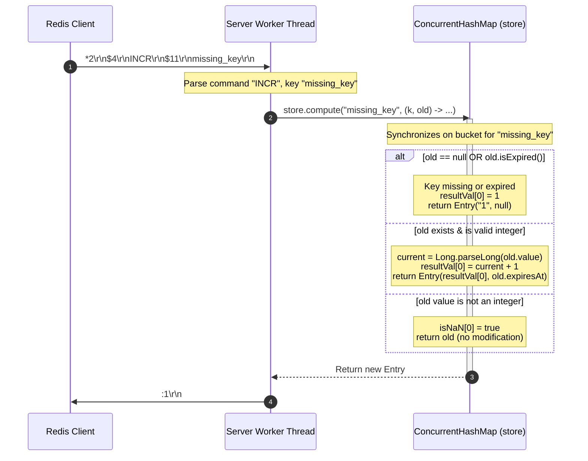

# Stage 33: The INCR command (2 of 3)

---

## Problem Solved

When implementing counters in distributed and networked systems, counters are almost never explicitly pre-initialized. In real-world workloads:
- **Rate Limiters**: An API gateway tracks IP request frequency per minute. Creating keys for every potential IPv4/IPv6 address beforehand is impossible; keys must be initialized on the first inbound request.
- **Page & Event Analytics**: An e-commerce product page counter starts tracking hits the first time an item is viewed.
- **Ephemeral Job Counters**: Transient workers increment progress counters on dynamically assigned tasks without a separate setup query.

If a server requires clients to first query `GET key`, check if it returns `nil`, and then issue `SET key 1`, distributed clients immediately hit a **Time-of-Check to Time-of-Use (TOCTOU) race condition**:
```
Client A: GET visits -> nil
Client B: GET visits -> nil
Client A: SET visits 1
Client B: SET visits 1  <-- Lost increment! Should have been 2.
```

Redis solves this by defining **implicit counter initialization (Upsert semantics)** for `INCR <key>`:
1. If `<key>` does not exist (or has expired according to its TTL), Redis sets its value to `0` and then immediately increments it to `1`.
2. Redis returns the integer `1` (`:1\r\n`).
3. Subsequent read commands (such as `GET <key>`) return the string representation `"1"` (`$1\r\n1\r\n`).

In this stage, we verify and harden our implementation for non-existent and expired keys, ensuring atomic initialization without race conditions under concurrent requests.

---

## Thought Process & Architectural Model

### 1. The Atomicity of "Create-or-Increment"

In standard multithreaded programming, a naive developer might write:
```java
// BROKEN: Race condition between containsKey and put
if (!store.containsKey(key)) {
  store.put(key, new Entry("1", null));
  out.write(":1\r\n".getBytes());
} else {
  // read and increment
}
```
If two worker threads receive `INCR counter` concurrently for a new key:
1. Thread 1 checks `!store.containsKey("counter")` -> `true`.
2. Context switch: Thread 2 checks `!store.containsKey("counter")` -> `true`.
3. Thread 1 executes `store.put("counter", new Entry("1", null))` and sends `:1\r\n`.
4. Thread 2 executes `store.put("counter", new Entry("1", null))` and sends `:1\r\n`.

Both clients received `:1\r\n`, and the final stored count is `1` instead of `2`.

### 2. Atomic Upsert with `ConcurrentHashMap.compute`

Java's `ConcurrentHashMap.compute(K key, BiFunction<? super K, ? super V, ? extends V> remappingFunction)` provides the exact atomic semantics required:
- The entire computation runs under synchronization on the target key's hash bucket table node.
- When the key is missing from the map, `old` is passed as `null`.
- When the key exists, `old` contains the current `Entry`.
- Expired keys (`old.isExpired()`) are treated identically to `null` (missing): the expired entry is replaced with a fresh counter set to `"1"` with no expiration (`expiresAt = null`).



---

## Full Solution

The complete, compilable source code for `codecrafters-redis-java/src/main/java/Main.java`:

```java
import java.io.BufferedReader;
import java.io.IOException;
import java.io.InputStream;
import java.io.InputStreamReader;
import java.io.OutputStream;
import java.net.ServerSocket;
import java.net.Socket;
import java.nio.charset.StandardCharsets;
import java.util.ArrayList;
import java.util.Collections;
import java.util.LinkedHashMap;
import java.util.List;
import java.util.Map;
import java.util.Queue;
import java.util.concurrent.CompletableFuture;
import java.util.concurrent.ConcurrentHashMap;
import java.util.concurrent.ConcurrentLinkedQueue;
import java.util.concurrent.TimeUnit;
import java.util.concurrent.TimeoutException;

public class Main {
  private static class Entry {
    final String value;
    final Long expiresAt;

    Entry(String value, Long expiresAt) {
      this.value = value;
      this.expiresAt = expiresAt;
    }

    boolean isExpired() {
      return expiresAt != null && System.currentTimeMillis() > expiresAt;
    }
  }

  private static class StreamEntry {
    final String id;
    final Map<String, String> fields;

    StreamEntry(String id, Map<String, String> fields) {
      this.id = id;
      this.fields = fields;
    }
  }

  private static class StreamResult {
    final String key;
    final List<StreamEntry> entries;

    StreamResult(String key, List<StreamEntry> entries) {
      this.key = key;
      this.entries = entries;
    }
  }

  private static final Map<String, Entry> store = new ConcurrentHashMap<>();
  private static final Map<String, List<String>> listStore = new ConcurrentHashMap<>();
  private static final Map<String, List<StreamEntry>> streamStore = new ConcurrentHashMap<>();
  private static final Map<String, Queue<CompletableFuture<String>>> blockedWaiters = new ConcurrentHashMap<>();
  private static final Map<String, Object> keyLocks = new ConcurrentHashMap<>();
  private static final Object streamNotifier = new Object();

  private static Object getLock(String key) {
    return keyLocks.computeIfAbsent(key, k -> new Object());
  }

  private static int compareStreamId(long ms1, long seq1, long ms2, long seq2) {
    if (ms1 != ms2) {
      return Long.compare(ms1, ms2);
    }
    return Long.compare(seq1, seq2);
  }

  private static List<StreamResult> queryMatchingEntries(String[] keys, String[] startIds) {
    List<StreamResult> results = new ArrayList<>();
    for (int i = 0; i < keys.length; i++) {
      String key = keys[i];
      String startIdStr = startIds[i];

      long startMs, startSeq;
      if (startIdStr.contains("-")) {
        String[] p = startIdStr.split("-");
        startMs = Long.parseLong(p[0]);
        startSeq = Long.parseLong(p[1]);
      } else {
        startMs = Long.parseLong(startIdStr);
        startSeq = 0;
      }

      List<StreamEntry> stream = streamStore.get(key);
      List<StreamEntry> matching = new ArrayList<>();
      if (stream != null) {
        synchronized (stream) {
          for (StreamEntry entry : stream) {
            String[] partsId = entry.id.split("-");
            long entryMs = Long.parseLong(partsId[0]);
            long entrySeq = Long.parseLong(partsId[1]);

            if (compareStreamId(entryMs, entrySeq, startMs, startSeq) > 0) {
              matching.add(entry);
            }
          }
        }
      }

      if (!matching.isEmpty()) {
        results.add(new StreamResult(key, matching));
      }
    }
    return results;
  }

  public static void main(String[] args) {
    System.out.println("Logs from your program will appear here!");

    int port = 6379;

    try {
      ServerSocket serverSocket = new ServerSocket(port);
      serverSocket.setReuseAddress(true);

      while (true) {
        Socket clientSocket = serverSocket.accept();

        new Thread(() -> {
          try {
            OutputStream out = clientSocket.getOutputStream();
            InputStream in = clientSocket.getInputStream();
            BufferedReader reader = new BufferedReader(new InputStreamReader(in));

            while (true) {
              String line = reader.readLine();
              if (line == null) break; // client disconnected

              int n = Integer.parseInt(line.substring(1));

              String[] parts = new String[n];
              for (int i = 0; i < n; i++) {
                reader.readLine();            // Skip "$<len>"
                parts[i] = reader.readLine(); // Payload
              }

              String command = parts[0];

              if (command.equalsIgnoreCase("PING")) {
                out.write("+PONG\r\n".getBytes(StandardCharsets.UTF_8));
              } else if (command.equalsIgnoreCase("ECHO")) {
                String arg = parts[1];
                byte[] bytes = arg.getBytes(StandardCharsets.UTF_8);
                String response = "$" + bytes.length + "\r\n" + arg + "\r\n";
                out.write(response.getBytes(StandardCharsets.UTF_8));
              } else if (command.equalsIgnoreCase("SET")) {
                String key = parts[1];
                String value = parts[2];
                Long expiresAt = null;

                if (parts.length >= 5) {
                  if (parts[3].equalsIgnoreCase("PX")) {
                    long pxMillis = Long.parseLong(parts[4]);
                    expiresAt = System.currentTimeMillis() + pxMillis;
                  } else if (parts[3].equalsIgnoreCase("EX")) {
                    long exSeconds = Long.parseLong(parts[4]);
                    expiresAt = System.currentTimeMillis() + (exSeconds * 1000);
                  }
                }

                store.put(key, new Entry(value, expiresAt));
                out.write("+OK\r\n".getBytes(StandardCharsets.UTF_8));
              } else if (command.equalsIgnoreCase("GET")) {
                String key = parts[1];
                Entry entry = store.get(key);

                if (entry != null && !entry.isExpired()) {
                  byte[] bytes = entry.value.getBytes(StandardCharsets.UTF_8);
                  String response = "$" + bytes.length + "\r\n" + entry.value + "\r\n";
                  out.write(response.getBytes(StandardCharsets.UTF_8));
                } else {
                  if (entry != null && entry.isExpired()) {
                    store.remove(key);
                  }
                  out.write("$-1\r\n".getBytes(StandardCharsets.UTF_8));
                }
              } else if (command.equalsIgnoreCase("INCR")) {
                if (parts.length < 2) {
                  out.write("-ERR wrong number of arguments for 'incr' command\r\n".getBytes(StandardCharsets.UTF_8));
                } else {
                  String key = parts[1];
                  final long[] resultVal = new long[1];
                  final boolean[] isNaN = new boolean[1];

                  store.compute(key, (k, old) -> {
                    if (old == null || old.isExpired()) {
                      resultVal[0] = 1;
                      return new Entry("1", null);
                    }
                    try {
                      long current = Long.parseLong(old.value);
                      resultVal[0] = current + 1;
                      return new Entry(String.valueOf(resultVal[0]), old.expiresAt);
                    } catch (NumberFormatException e) {
                      isNaN[0] = true;
                      return old;
                    }
                  });

                  if (isNaN[0]) {
                    out.write("-ERR value is not an integer or out of range\r\n".getBytes(StandardCharsets.UTF_8));
                  } else {
                    out.write((":" + resultVal[0] + "\r\n").getBytes(StandardCharsets.UTF_8));
                  }
                  out.flush();
                }
              } else if (command.equalsIgnoreCase("TYPE")) {
                if (parts.length < 2) {
                  out.write("-ERR wrong number of arguments for 'type' command\r\n".getBytes(StandardCharsets.UTF_8));
                } else {
                  String key = parts[1];
                  Entry entry = store.get(key);
                  if (entry != null) {
                    if (entry.isExpired()) {
                      store.remove(key);
                      entry = null;
                    }
                  }

                  if (entry != null) {
                    out.write("+string\r\n".getBytes(StandardCharsets.UTF_8));
                  } else {
                    List<String> list = listStore.get(key);
                    if (list != null && !list.isEmpty()) {
                      out.write("+list\r\n".getBytes(StandardCharsets.UTF_8));
                    } else if (streamStore.containsKey(key)) {
                      out.write("+stream\r\n".getBytes(StandardCharsets.UTF_8));
                    } else {
                      out.write("+none\r\n".getBytes(StandardCharsets.UTF_8));
                    }
                  }
                }
              } else if (command.equalsIgnoreCase("XADD")) {
                if (parts.length < 5 || (parts.length - 3) % 2 != 0) {
                  out.write("-ERR wrong number of arguments for 'xadd' command\r\n".getBytes(StandardCharsets.UTF_8));
                } else {
                  String key = parts[1];
                  String id = parts[2];
                  Map<String, String> fields = new LinkedHashMap<>();
                  for (int i = 3; i < parts.length - 1; i += 2) {
                    fields.put(parts[i], parts[i + 1]);
                  }

                  List<StreamEntry> stream = streamStore.computeIfAbsent(key, k -> Collections.synchronizedList(new ArrayList<>()));

                  if (id.equals("*")) {
                    long time = System.currentTimeMillis();
                    synchronized (stream) {
                      long seq;
                      if (stream.isEmpty()) {
                        seq = 0;
                      } else {
                        StreamEntry lastEntry = stream.get(stream.size() - 1);
                        String[] lastParts = lastEntry.id.split("-");
                        long lastTime = Long.parseLong(lastParts[0]);
                        long lastSeq = Long.parseLong(lastParts[1]);

                        if (time == lastTime) {
                          seq = lastSeq + 1;
                        } else if (time > lastTime) {
                          seq = 0;
                        } else {
                          time = lastTime;
                          seq = lastSeq + 1;
                        }
                      }

                      String generatedId = time + "-" + seq;
                      stream.add(new StreamEntry(generatedId, fields));
                      synchronized (streamNotifier) {
                        streamNotifier.notifyAll();
                      }
                      byte[] idBytes = generatedId.getBytes(StandardCharsets.UTF_8);
                      String response = "$" + idBytes.length + "\r\n" + generatedId + "\r\n";
                      out.write(response.getBytes(StandardCharsets.UTF_8));
                      out.flush();
                    }
                  } else if (id.endsWith("-*")) {
                    long time = Long.parseLong(id.substring(0, id.length() - 2));
                    synchronized (stream) {
                      String generatedId = null;
                      if (stream.isEmpty()) {
                        long seq = (time == 0) ? 1 : 0;
                        generatedId = time + "-" + seq;
                      } else {
                        StreamEntry lastEntry = stream.get(stream.size() - 1);
                        String[] lastParts = lastEntry.id.split("-");
                        long lastTime = Long.parseLong(lastParts[0]);
                        long lastSeq = Long.parseLong(lastParts[1]);

                        if (time < lastTime) {
                          out.write("-ERR The ID specified in XADD is equal or smaller than the target stream top item\r\n".getBytes(StandardCharsets.UTF_8));
                          out.flush();
                        } else if (time == lastTime) {
                          long seq = lastSeq + 1;
                          generatedId = time + "-" + seq;
                        } else {
                          long seq = (time == 0) ? 1 : 0;
                          generatedId = time + "-" + seq;
                        }
                      }

                      if (generatedId != null) {
                        stream.add(new StreamEntry(generatedId, fields));
                        synchronized (streamNotifier) {
                          streamNotifier.notifyAll();
                        }
                        byte[] idBytes = generatedId.getBytes(StandardCharsets.UTF_8);
                        String response = "$" + idBytes.length + "\r\n" + generatedId + "\r\n";
                        out.write(response.getBytes(StandardCharsets.UTF_8));
                        out.flush();
                      }
                    }
                  } else {
                    String[] dash = id.split("-");
                    long time = Long.parseLong(dash[0]);
                    long seq = Long.parseLong(dash[1]);

                    if (time <= 0 && seq <= 0) {
                      out.write("-ERR The ID specified in XADD must be greater than 0-0\r\n".getBytes(StandardCharsets.UTF_8));
                      out.flush();
                    } else {
                      synchronized (stream) {
                        boolean valid = true;
                        if (!stream.isEmpty()) {
                          StreamEntry lastEntry = stream.get(stream.size() - 1);
                          String[] lastDash = lastEntry.id.split("-");
                          long lastTime = Long.parseLong(lastDash[0]);
                          long lastSeq = Long.parseLong(lastDash[1]);
                          if ((time < lastTime) || (time == lastTime && seq <= lastSeq)) {
                            valid = false;
                            out.write("-ERR The ID specified in XADD is equal or smaller than the target stream top item\r\n".getBytes(StandardCharsets.UTF_8));
                            out.flush();
                          }
                        }

                        if (valid) {
                          stream.add(new StreamEntry(id, fields));
                          synchronized (streamNotifier) {
                            streamNotifier.notifyAll();
                          }
                          byte[] idBytes = id.getBytes(StandardCharsets.UTF_8);
                          String response = "$" + idBytes.length + "\r\n" + id + "\r\n";
                          out.write(response.getBytes(StandardCharsets.UTF_8));
                          out.flush();
                        }
                      }
                    }
                  }
                }
              } else if (command.equalsIgnoreCase("XRANGE")) {
                if (parts.length < 4) {
                  out.write("-ERR wrong number of arguments for 'xrange' command\r\n".getBytes(StandardCharsets.UTF_8));
                } else {
                  String key = parts[1];
                  String start = parts[2];
                  String end = parts[3];

                  long startMs, startSeq;
                  if (start.equals("-")) {
                    startMs = 0;
                    startSeq = 0;
                  } else if (start.equals("+")) {
                    startMs = Long.MAX_VALUE;
                    startSeq = Long.MAX_VALUE;
                  } else if (start.contains("-")) {
                    String[] p = start.split("-");
                    startMs = Long.parseLong(p[0]);
                    startSeq = Long.parseLong(p[1]);
                  } else {
                    startMs = Long.parseLong(start);
                    startSeq = 0;
                  }

                  long endMs, endSeq;
                  if (end.equals("+")) {
                    endMs = Long.MAX_VALUE;
                    endSeq = Long.MAX_VALUE;
                  } else if (end.equals("-")) {
                    endMs = 0;
                    endSeq = 0;
                  } else if (end.contains("-")) {
                    String[] p = end.split("-");
                    endMs = Long.parseLong(p[0]);
                    endSeq = Long.parseLong(p[1]);
                  } else {
                    endMs = Long.parseLong(end);
                    endSeq = Long.MAX_VALUE;
                  }

                  List<StreamEntry> stream = streamStore.get(key);
                  if (stream == null || stream.isEmpty()) {
                    out.write("*0\r\n".getBytes(StandardCharsets.UTF_8));
                  } else {
                    List<StreamEntry> matching = new ArrayList<>();
                    synchronized (stream) {
                      for (StreamEntry entry : stream) {
                        String[] partsId = entry.id.split("-");
                        long entryMs = Long.parseLong(partsId[0]);
                        long entrySeq = Long.parseLong(partsId[1]);

                        if (compareStreamId(entryMs, entrySeq, startMs, startSeq) >= 0 &&
                            compareStreamId(entryMs, entrySeq, endMs, endSeq) <= 0) {
                          matching.add(entry);
                        }
                      }
                    }

                    StringBuilder sb = new StringBuilder();
                    sb.append("*").append(matching.size()).append("\r\n");
                    for (StreamEntry entry : matching) {
                      sb.append("*2\r\n");
                      byte[] idBytes = entry.id.getBytes(StandardCharsets.UTF_8);
                      sb.append("$").append(idBytes.length).append("\r\n").append(entry.id).append("\r\n");
                      sb.append("*").append(entry.fields.size() * 2).append("\r\n");
                      for (Map.Entry<String, String> field : entry.fields.entrySet()) {
                        byte[] kBytes = field.getKey().getBytes(StandardCharsets.UTF_8);
                        sb.append("$").append(kBytes.length).append("\r\n").append(field.getKey()).append("\r\n");
                        byte[] vBytes = field.getValue().getBytes(StandardCharsets.UTF_8);
                        sb.append("$").append(vBytes.length).append("\r\n").append(field.getValue()).append("\r\n");
                      }
                    }
                    out.write(sb.toString().getBytes(StandardCharsets.UTF_8));
                  }
                }
              } else if (command.equalsIgnoreCase("XREAD")) {
                int streamsIndex = -1;
                long blockTimeout = -1;

                for (int i = 1; i < parts.length; i++) {
                  if (parts[i].equalsIgnoreCase("BLOCK")) {
                    if (i + 1 < parts.length) {
                      blockTimeout = Long.parseLong(parts[i + 1]);
                      i++;
                    }
                  } else if (parts[i].equalsIgnoreCase("STREAMS")) {
                    streamsIndex = i;
                    break;
                  }
                }

                int rem = (streamsIndex == -1) ? 0 : parts.length - (streamsIndex + 1);
                if (streamsIndex == -1 || rem <= 0 || rem % 2 != 0) {
                  out.write("-ERR syntax error\r\n".getBytes(StandardCharsets.UTF_8));
                } else {
                  int numStreams = rem / 2;
                  String[] keys = new String[numStreams];
                  String[] startIds = new String[numStreams];
                  for (int i = 0; i < numStreams; i++) {
                    keys[i] = parts[streamsIndex + 1 + i];
                    startIds[i] = parts[streamsIndex + 1 + numStreams + i];
                  }

                  for (int i = 0; i < numStreams; i++) {
                    if (startIds[i].equals("$")) {
                      List<StreamEntry> stream = streamStore.get(keys[i]);
                      if (stream != null && !stream.isEmpty()) {
                        synchronized (stream) {
                          if (!stream.isEmpty()) {
                            startIds[i] = stream.get(stream.size() - 1).id;
                          } else {
                            startIds[i] = "0-0";
                          }
                        }
                      } else {
                        startIds[i] = "0-0";
                      }
                    }
                  }

                  long deadline = (blockTimeout == 0) ? Long.MAX_VALUE : (System.currentTimeMillis() + blockTimeout);
                  List<StreamResult> matching = queryMatchingEntries(keys, startIds);

                  if (matching.isEmpty() && blockTimeout >= 0) {
                    synchronized (streamNotifier) {
                      matching = queryMatchingEntries(keys, startIds);
                      while (matching.isEmpty()) {
                        long remMs = deadline - System.currentTimeMillis();
                        if (blockTimeout > 0 && remMs <= 0) break;
                        try {
                          if (blockTimeout == 0) {
                            streamNotifier.wait();
                          } else {
                            streamNotifier.wait(Math.max(1, remMs));
                          }
                        } catch (InterruptedException e) {
                          Thread.currentThread().interrupt();
                          break;
                        }
                        matching = queryMatchingEntries(keys, startIds);
                      }
                    }
                  }

                  if (matching.isEmpty()) {
                    out.write("*-1\r\n".getBytes(StandardCharsets.UTF_8));
                  } else {
                    StringBuilder sb = new StringBuilder();
                    sb.append("*").append(matching.size()).append("\r\n");
                    for (StreamResult sr : matching) {
                      sb.append("*2\r\n");
                      byte[] keyBytes = sr.key.getBytes(StandardCharsets.UTF_8);
                      sb.append("$").append(keyBytes.length).append("\r\n").append(sr.key).append("\r\n");
                      sb.append("*").append(sr.entries.size()).append("\r\n");
                      for (StreamEntry entry : sr.entries) {
                        sb.append("*2\r\n");
                        byte[] idBytes = entry.id.getBytes(StandardCharsets.UTF_8);
                        sb.append("$").append(idBytes.length).append("\r\n").append(entry.id).append("\r\n");
                        sb.append("*").append(entry.fields.size() * 2).append("\r\n");
                        for (Map.Entry<String, String> field : entry.fields.entrySet()) {
                          byte[] kBytes = field.getKey().getBytes(StandardCharsets.UTF_8);
                          sb.append("$").append(kBytes.length).append("\r\n").append(field.getKey()).append("\r\n");
                          byte[] vBytes = field.getValue().getBytes(StandardCharsets.UTF_8);
                          sb.append("$").append(vBytes.length).append("\r\n").append(field.getValue()).append("\r\n");
                        }
                      }
                    }
                    out.write(sb.toString().getBytes(StandardCharsets.UTF_8));
                  }
                }
              } else if (command.equalsIgnoreCase("RPUSH")) {
                if (parts.length < 3) {
                  out.write("-ERR wrong number of arguments for 'rpush' command\r\n".getBytes(StandardCharsets.UTF_8));
                } else {
                  String key = parts[1];
                  Object lock = getLock(key);
                  int newLength;
                  synchronized (lock) {
                    List<String> list = listStore.computeIfAbsent(key, k -> new ArrayList<>());
                    for (int i = 2; i < parts.length; i++) {
                      list.add(parts[i]);
                    }
                    newLength = list.size();

                    Queue<CompletableFuture<String>> waiters = blockedWaiters.get(key);
                    if (waiters != null) {
                      while (!list.isEmpty() && !waiters.isEmpty()) {
                        CompletableFuture<String> waiter = waiters.poll();
                        if (waiter != null && !waiter.isDone()) {
                          String head = list.get(0);
                          if (waiter.complete(head)) {
                            list.remove(0);
                          }
                        }
                      }
                    }
                    if (list.isEmpty()) {
                      listStore.remove(key);
                    }
                  }
                  String response = ":" + newLength + "\r\n";
                  out.write(response.getBytes(StandardCharsets.UTF_8));
                }
              } else if (command.equalsIgnoreCase("LPUSH")) {
                if (parts.length < 3) {
                  out.write("-ERR wrong number of arguments for 'lpush' command\r\n".getBytes(StandardCharsets.UTF_8));
                } else {
                  String key = parts[1];
                  Object lock = getLock(key);
                  int newLength;
                  synchronized (lock) {
                    List<String> list = listStore.computeIfAbsent(key, k -> new ArrayList<>());
                    for (int i = 2; i < parts.length; i++) {
                      list.add(0, parts[i]);
                    }
                    newLength = list.size();

                    Queue<CompletableFuture<String>> waiters = blockedWaiters.get(key);
                    if (waiters != null) {
                      while (!list.isEmpty() && !waiters.isEmpty()) {
                        CompletableFuture<String> waiter = waiters.poll();
                        if (waiter != null && !waiter.isDone()) {
                          String head = list.get(0);
                          if (waiter.complete(head)) {
                            list.remove(0);
                          }
                        }
                      }
                    }
                    if (list.isEmpty()) {
                      listStore.remove(key);
                    }
                  }
                  String response = ":" + newLength + "\r\n";
                  out.write(response.getBytes(StandardCharsets.UTF_8));
                }
              } else if (command.equalsIgnoreCase("LLEN")) {
                if (parts.length < 2) {
                  out.write("-ERR wrong number of arguments for 'llen' command\r\n".getBytes(StandardCharsets.UTF_8));
                } else {
                  String key = parts[1];
                  Object lock = getLock(key);
                  int length = 0;
                  synchronized (lock) {
                    List<String> list = listStore.get(key);
                    if (list != null) {
                      length = list.size();
                    }
                  }
                  String response = ":" + length + "\r\n";
                  out.write(response.getBytes(StandardCharsets.UTF_8));
                }
              } else if (command.equalsIgnoreCase("LPOP")) {
                if (parts.length < 2) {
                  out.write("-ERR wrong number of arguments for 'lpop' command\r\n".getBytes(StandardCharsets.UTF_8));
                } else if (parts.length == 2) {
                  String key = parts[1];
                  Object lock = getLock(key);
                  String removedElement = null;
                  synchronized (lock) {
                    List<String> list = listStore.get(key);
                    if (list != null && !list.isEmpty()) {
                      removedElement = list.remove(0);
                      if (list.isEmpty()) {
                        listStore.remove(key);
                      }
                    }
                  }
                  if (removedElement == null) {
                    out.write("$-1\r\n".getBytes(StandardCharsets.UTF_8));
                  } else {
                    byte[] bytes = removedElement.getBytes(StandardCharsets.UTF_8);
                    String response = "$" + bytes.length + "\r\n" + removedElement + "\r\n";
                    out.write(response.getBytes(StandardCharsets.UTF_8));
                  }
                } else {
                  String key = parts[1];
                  try {
                    int count = Integer.parseInt(parts[2]);
                    if (count < 0) {
                      out.write("-ERR value is out of range, must be positive\r\n".getBytes(StandardCharsets.UTF_8));
                    } else {
                      Object lock = getLock(key);
                      List<String> removedElements = new ArrayList<>();
                      boolean keyExisted = false;
                      synchronized (lock) {
                        List<String> list = listStore.get(key);
                        if (list != null) {
                          keyExisted = true;
                          int toRemove = Math.min(count, list.size());
                          for (int i = 0; i < toRemove; i++) {
                            removedElements.add(list.remove(0));
                          }
                          if (list.isEmpty()) {
                            listStore.remove(key);
                          }
                        }
                      }
                      if (!keyExisted || (removedElements.isEmpty() && count > 0)) {
                        out.write("*-1\r\n".getBytes(StandardCharsets.UTF_8));
                      } else {
                        StringBuilder sb = new StringBuilder();
                        sb.append("*").append(removedElements.size()).append("\r\n");
                        for (String elem : removedElements) {
                          byte[] elemBytes = elem.getBytes(StandardCharsets.UTF_8);
                          sb.append("$").append(elemBytes.length).append("\r\n").append(elem).append("\r\n");
                        }
                        out.write(sb.toString().getBytes(StandardCharsets.UTF_8));
                      }
                    }
                  } catch (NumberFormatException e) {
                    out.write("-ERR value is not an integer or out of range\r\n".getBytes(StandardCharsets.UTF_8));
                  }
                }
              } else if (command.equalsIgnoreCase("BLPOP")) {
                if (parts.length < 3) {
                  out.write("-ERR wrong number of arguments for 'blpop' command\r\n".getBytes(StandardCharsets.UTF_8));
                } else {
                  try {
                    String key = parts[1];
                    double timeoutSec = Double.parseDouble(parts[2]);
                    if (timeoutSec < 0) {
                      out.write("-ERR timeout is negative\r\n".getBytes(StandardCharsets.UTF_8));
                    } else {
                      long timeoutMillis = (long) (timeoutSec * 1000);
                      Object lock = getLock(key);
                      String popped = null;
                      CompletableFuture<String> future = null;

                      synchronized (lock) {
                        List<String> list = listStore.get(key);
                        if (list != null && !list.isEmpty()) {
                          popped = list.remove(0);
                          if (list.isEmpty()) {
                            listStore.remove(key);
                          }
                        } else {
                          future = new CompletableFuture<>();
                          blockedWaiters.computeIfAbsent(key, k -> new ConcurrentLinkedQueue<>()).add(future);
                        }
                      }

                      if (popped != null) {
                        byte[] keyBytes = key.getBytes(StandardCharsets.UTF_8);
                        byte[] elemBytes = popped.getBytes(StandardCharsets.UTF_8);
                        String response = "*2\r\n$" + keyBytes.length + "\r\n" + key + "\r\n$" + elemBytes.length + "\r\n" + popped + "\r\n";
                        out.write(response.getBytes(StandardCharsets.UTF_8));
                      } else if (future != null) {
                        try {
                          if (timeoutMillis > 0) {
                            popped = future.get(timeoutMillis, TimeUnit.MILLISECONDS);
                          } else {
                            popped = future.get();
                          }
                          byte[] keyBytes = key.getBytes(StandardCharsets.UTF_8);
                          byte[] elemBytes = popped.getBytes(StandardCharsets.UTF_8);
                          String response = "*2\r\n$" + keyBytes.length + "\r\n" + key + "\r\n$" + elemBytes.length + "\r\n" + popped + "\r\n";
                          out.write(response.getBytes(StandardCharsets.UTF_8));
                        } catch (TimeoutException e) {
                          Queue<CompletableFuture<String>> waiters = blockedWaiters.get(key);
                          if (waiters != null) {
                            waiters.remove(future);
                          }
                          future.cancel(true);
                          out.write("*-1\r\n".getBytes(StandardCharsets.UTF_8));
                        } catch (Exception e) {
                          Queue<CompletableFuture<String>> waiters = blockedWaiters.get(key);
                          if (waiters != null) {
                            waiters.remove(future);
                          }
                          future.cancel(true);
                          out.write("*-1\r\n".getBytes(StandardCharsets.UTF_8));
                        }
                      }
                    }
                  } catch (NumberFormatException e) {
                    out.write("-ERR timeout is not a float or out of range\r\n".getBytes(StandardCharsets.UTF_8));
                  }
                }
              } else if (command.equalsIgnoreCase("LRANGE")) {
                if (parts.length < 4) {
                  out.write("-ERR wrong number of arguments for 'lrange' command\r\n".getBytes(StandardCharsets.UTF_8));
                } else {
                  String key = parts[1];
                  int start = Integer.parseInt(parts[2]);
                  int stop = Integer.parseInt(parts[3]);

                  Object lock = getLock(key);
                  List<String> elementsToReturn;
                  synchronized (lock) {
                    List<String> list = listStore.get(key);
                    if (list == null || list.isEmpty()) {
                      elementsToReturn = Collections.emptyList();
                    } else {
                      int size = list.size();
                      if (start < 0) start += size;
                      if (stop < 0) stop += size;
                      if (start < 0) start = 0;
                      if (stop < 0) stop = 0;

                      if (start >= size || start > stop) {
                        elementsToReturn = Collections.emptyList();
                      } else {
                        int stopIdx = Math.min(stop, size - 1);
                        elementsToReturn = new ArrayList<>(list.subList(start, stopIdx + 1));
                      }
                    }
                  }

                  if (elementsToReturn.isEmpty()) {
                    out.write("*0\r\n".getBytes(StandardCharsets.UTF_8));
                  } else {
                    StringBuilder sb = new StringBuilder();
                    sb.append("*").append(elementsToReturn.size()).append("\r\n");
                    for (String elem : elementsToReturn) {
                      byte[] elemBytes = elem.getBytes(StandardCharsets.UTF_8);
                      sb.append("$").append(elemBytes.length).append("\r\n").append(elem).append("\r\n");
                    }
                    out.write(sb.toString().getBytes(StandardCharsets.UTF_8));
                  }
                }
              }
              out.flush();
            }
          } catch (IOException e) {
            System.out.println("IOException: " + e.getMessage());
          }
        }).start();
      }
    } catch (IOException e) {
      System.out.println("IOException: " + e.getMessage());
    }
  }
}

```

---

## Concepts

- **Implicit Counter Initialization (Upsert)**: In key-value data stores, an upsert creates a record if it does not already exist, or updates it if it does. Redis `INCR` acts as an atomic upsert where default initialization starts at 0 before adding 1.
- **Zero-to-One Transition**: When `old == null`, the server must persist the value as string `"1"` so that standard string commands like `GET` immediately read `"1"`.
- **Atomic Remapping under Concurrency**: `ConcurrentHashMap.compute` serializes mutations to the same key bucket, preventing dual initialization where two threads might both see `null` and return `1`.
- **Lazy Expiration Handling in Mutations**: An expired key occupying table memory is logically non-existent. In `INCR`, encountering `old.isExpired()` clears the expired value and old expiration timestamp, restarting the counter at 1.

---

## What Breaks It (Failure Modes)

- **Check-then-Act Race Condition**:
  - *Hazard*: Writing `if (!store.containsKey(key)) { store.put(key, new Entry("1", null)); }`. Concurrent client threads will race, leading to duplicate initialization and lost increments.
  - *Mitigation*: Perform all state inspection and transformation within `store.compute(key, ...)`.
- **Failing to Clear TTL on Expired Keys**:
  - *Hazard*: If an expired key with an old timestamp is reused and only the value is changed (`new Entry("1", old.expiresAt)`), subsequent queries will immediately see the key as expired again.
  - *Mitigation*: Pass `null` as the expiration timestamp when creating the new entry on missing or expired keys (`new Entry("1", null)`).
- **Type Mismatch with Subsequent `GET`**:
  - *Hazard*: If `INCR` stores an internal primitive `Long` instead of an `Entry` containing a String, `GET` command branches could throw `ClassCastException`.
  - *Mitigation*: Maintain a unified `Entry(String value, Long expiresAt)` representation across `SET`, `GET`, and `INCR`.

---

## Tradeoffs

- **`store.compute` vs. `store.putIfAbsent` + retry**:
  - *`store.compute`*: One single pass. Locks only the bucket node during the lambda execution, handles missing, existing, and expired keys in a single unified branch.
  - *`store.putIfAbsent`*: Requires looping/retrying if a key was present or expired, increasing code complexity and overhead.
- **String Storage vs. Native Integer Storage**:
  - *String Storage (`Entry.value = "1"`)*: Matches Redis's internal SDS (Simple Dynamic String) architecture where integer values are stored in string format and parsed as needed.
  - *Native Long Storage*: Avoids `Long.parseLong` on increments, but requires polymorphic entry structures or union types across the store.

---

## Wire Format / Protocol

| Direction | Encoded Wire Data | Decoded Meaning |
|---|---|---|
| Client -> Server | `*2\r\n$4\r\nINCR\r\n$11\r\nmissing_key\r\n` | Execute `INCR missing_key` on non-existent key |
| Server -> Client | `:1\r\n` | RESP Integer `1` |
| Client -> Server | `*2\r\n$3\r\nGET\r\n$11\r\nmissing_key\r\n` | Subsequent read `GET missing_key` |
| Server -> Client | `$1\r\n1\r\n` | RESP Bulk String `"1"` |

---

## Java Specifics ? Lookup, Don't Memorize

- `ConcurrentHashMap.compute(K, BiFunction)`: Atomically computes a new mapping for the specified key and its current mapped value (or `null` if there is no current mapping).
- `final long[] resultVal = new long[1]`: Standard idiom in Java to allow a lambda expression to assign a value to a variable defined in the enclosing lexical scope.

---

## How It Flows

1. **Client Request**: Client sends RESP array `["INCR", "missing_key"]`.
2. **Command Handling**: The server thread checks `command.equalsIgnoreCase("INCR")`.
3. **Atomic Remap**:
   - `store.compute("missing_key", (k, old) -> ...)` executes.
   - Because `missing_key` does not exist in `store`, `old` is `null`.
   - The condition `if (old == null || old.isExpired())` evaluates to `true`.
   - `resultVal[0]` is assigned `1`.
   - A new `Entry("1", null)` is returned and stored in the map.
4. **Socket Write**:
   - Server formats the response `":1\r\n"` and flushes the socket.
5. **Subsequent Reads**:
   - When the client later calls `GET missing_key`, `store.get("missing_key")` returns the `Entry` with `value = "1"`.
   - The server returns `$1\r\n1\r\n`.

---

## Rebuild Checklist

- [ ] Support `INCR <key>` where `<key>` is absent from `store`.
- [ ] Initialize the key with value `"1"` and no expiration (`expiresAt = null`).
- [ ] Treat expired keys (`old.isExpired() == true`) as non-existent keys, resetting the counter to `1`.
- [ ] Respond with RESP Integer `:1\r\n`.
- [ ] Ensure subsequent `GET <key>` commands return Bulk String `"$1\r\n1\r\n"`.
- [ ] Maintain atomicity using `store.compute` to avoid race conditions during concurrent key initialization.
