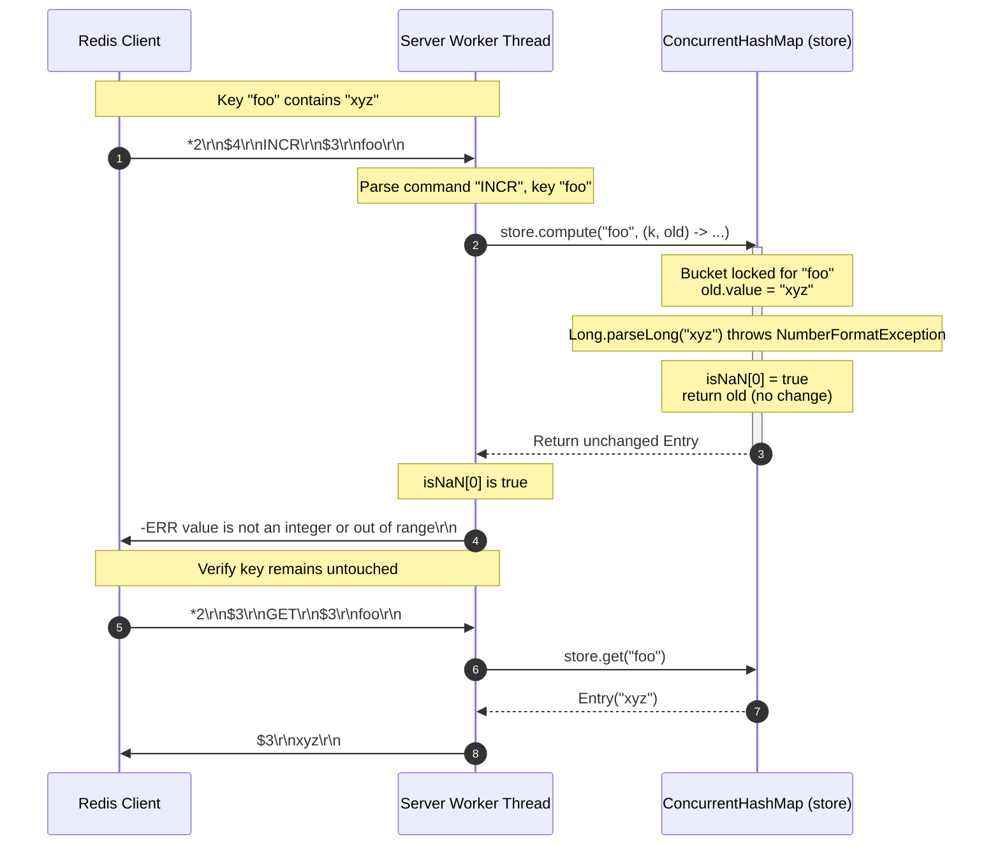

# Stage 34: The INCR command (3 of 3)

---

## Problem Solved

In Redis, strings are the fundamental building block of all data types. A string value is stored as a binary-safe byte sequence (internally using SDS - Simple Dynamic String). Redis does not have a dedicated, separate native "Integer" data type exposed in its top-level type hierarchy; commands like `TYPE <key>` return `+string\r\n` for both `"hello"` and `"42"`.

However, commands in the `INCR` and `DECR` family interpret these string byte sequences as 64-bit signed decimal integers. In a schema-less, distributed key-value store, this dual nature introduces significant hazards:
1. **Accidental Type Pollution**: A developer or client service might store arbitrary text or structured payloads (e.g., `SET session:100 "active"`, or `SET config:ratio "3.14"`) under a key, and another service might attempt to invoke `INCR session:100`.
2. **Numeric Range Limits**: An integer increment cannot exceed the bounds of a signed 64-bit integer (`-9223372036854775808` to `9223372036854775807`). Attempting to increment beyond `Long.MAX_VALUE` must not overflow silently or wrap around to negative numbers.
3. **Failure Semantics and Invariant Protection**: When `INCR` encounters a key whose value cannot be parsed as a 64-bit signed integer (or is out of range), the server must reject the operation without mutating or corrupting the existing string. The command must fail atomically and return a standard RESP error:
   ```
   -ERR value is not an integer or out of range\r\n
   ```
   Subsequent `GET` requests must continue to return the original uncorrupted value.

This stage implements and verifies strict type validation and atomic failure rollback for `INCR` when a key exists but does not contain a valid 64-bit decimal integer.

---

## Thought Process & Architectural Model

### 1. In-Band Type Deduction vs Pre-Validation

When an incoming command arrives, Redis does not maintain runtime type descriptors that restrict a string key to only string operations or numeric operations. Instead, Redis performs **in-band type deduction on mutation**:
- When reading a value in `INCR`, the server attempts to parse the payload as a base-10 signed integer.
- If parsing fails (e.g., characters other than leading digits or minus sign, floating points like `1.5`, empty strings `""`, or numeric values outside the 64-bit signed range), the operation halts immediately.

### 2. Atomic Mutation and Non-Destructive Failure

In a concurrent server where multiple threads execute commands against a shared key-value store, modifying state must be atomic.
Using Java's `ConcurrentHashMap.compute(key, remappingFunction)`, the remapping function is executed while holding the table bucket lock for that key:

```java
store.compute(key, (k, old) -> {
  if (old == null || old.isExpired()) {
    resultVal[0] = 1;
    return new Entry("1", null);
  }
  try {
    long current = Long.parseLong(old.value);
    resultVal[0] = current + 1;
    return new Entry(String.valueOf(resultVal[0]), old.expiresAt);
  } catch (NumberFormatException e) {
    isNaN[0] = true;
    return old; // CRITICAL: preserve existing uncorrupted entry!
  }
});
```

Key guarantees provided by this model:
- **Zero Corruption**: If `Long.parseLong` throws `NumberFormatException`, returning `old` guarantees that `ConcurrentHashMap` retains the exact existing `Entry` without modification.
- **Thread Safety**: Concurrent readers or writers cannot observe an intermediate state where the key was deleted, partially overwritten, or set to 0.
- **Explicit Signal Propagation**: The boolean flag `isNaN[0]` signals outside the lambda to write the RESP error `-ERR value is not an integer or out of range\r\n` to the socket output stream.



---

## Full Solution

The complete, compilable source code for `codecrafters-redis-java/src/main/java/Main.java`:

```java
import java.io.BufferedReader;
import java.io.IOException;
import java.io.InputStream;
import java.io.InputStreamReader;
import java.io.OutputStream;
import java.net.ServerSocket;
import java.net.Socket;
import java.nio.charset.StandardCharsets;
import java.util.ArrayList;
import java.util.Collections;
import java.util.LinkedHashMap;
import java.util.List;
import java.util.Map;
import java.util.Queue;
import java.util.concurrent.CompletableFuture;
import java.util.concurrent.ConcurrentHashMap;
import java.util.concurrent.ConcurrentLinkedQueue;
import java.util.concurrent.TimeUnit;
import java.util.concurrent.TimeoutException;

public class Main {
  private static class Entry {
    final String value;
    final Long expiresAt;

    Entry(String value, Long expiresAt) {
      this.value = value;
      this.expiresAt = expiresAt;
    }

    boolean isExpired() {
      return expiresAt != null && System.currentTimeMillis() > expiresAt;
    }
  }

  private static class StreamEntry {
    final String id;
    final Map<String, String> fields;

    StreamEntry(String id, Map<String, String> fields) {
      this.id = id;
      this.fields = fields;
    }
  }

  private static class StreamResult {
    final String key;
    final List<StreamEntry> entries;

    StreamResult(String key, List<StreamEntry> entries) {
      this.key = key;
      this.entries = entries;
    }
  }

  private static final Map<String, Entry> store = new ConcurrentHashMap<>();
  private static final Map<String, List<String>> listStore = new ConcurrentHashMap<>();
  private static final Map<String, List<StreamEntry>> streamStore = new ConcurrentHashMap<>();
  private static final Map<String, Queue<CompletableFuture<String>>> blockedWaiters = new ConcurrentHashMap<>();
  private static final Map<String, Object> keyLocks = new ConcurrentHashMap<>();
  private static final Object streamNotifier = new Object();

  private static Object getLock(String key) {
    return keyLocks.computeIfAbsent(key, k -> new Object());
  }

  private static int compareStreamId(long ms1, long seq1, long ms2, long seq2) {
    if (ms1 != ms2) {
      return Long.compare(ms1, ms2);
    }
    return Long.compare(seq1, seq2);
  }

  private static List<StreamResult> queryMatchingEntries(String[] keys, String[] startIds) {
    List<StreamResult> results = new ArrayList<>();
    for (int i = 0; i < keys.length; i++) {
      String key = keys[i];
      String startIdStr = startIds[i];

      long startMs, startSeq;
      if (startIdStr.contains("-")) {
        String[] p = startIdStr.split("-");
        startMs = Long.parseLong(p[0]);
        startSeq = Long.parseLong(p[1]);
      } else {
        startMs = Long.parseLong(startIdStr);
        startSeq = 0;
      }

      List<StreamEntry> stream = streamStore.get(key);
      List<StreamEntry> matching = new ArrayList<>();
      if (stream != null) {
        synchronized (stream) {
          for (StreamEntry entry : stream) {
            String[] partsId = entry.id.split("-");
            long entryMs = Long.parseLong(partsId[0]);
            long entrySeq = Long.parseLong(partsId[1]);

            if (compareStreamId(entryMs, entrySeq, startMs, startSeq) > 0) {
              matching.add(entry);
            }
          }
        }
      }

      if (!matching.isEmpty()) {
        results.add(new StreamResult(key, matching));
      }
    }
    return results;
  }

  public static void main(String[] args) {
    System.out.println("Logs from your program will appear here!");

    int port = 6379;

    try {
      ServerSocket serverSocket = new ServerSocket(port);
      serverSocket.setReuseAddress(true);

      while (true) {
        Socket clientSocket = serverSocket.accept();

        new Thread(() -> {
          try {
            OutputStream out = clientSocket.getOutputStream();
            InputStream in = clientSocket.getInputStream();
            BufferedReader reader = new BufferedReader(new InputStreamReader(in));

            while (true) {
              String line = reader.readLine();
              if (line == null) break; // client disconnected

              int n = Integer.parseInt(line.substring(1));

              String[] parts = new String[n];
              for (int i = 0; i < n; i++) {
                reader.readLine();            // Skip "$<len>"
                parts[i] = reader.readLine(); // Payload
              }

              String command = parts[0];

              if (command.equalsIgnoreCase("PING")) {
                out.write("+PONG\r\n".getBytes(StandardCharsets.UTF_8));
              } else if (command.equalsIgnoreCase("ECHO")) {
                String arg = parts[1];
                byte[] bytes = arg.getBytes(StandardCharsets.UTF_8));
                String response = "$" + bytes.length + "\r\n" + arg + "\r\n";
                out.write(response.getBytes(StandardCharsets.UTF_8));
              } else if (command.equalsIgnoreCase("SET")) {
                String key = parts[1];
                String value = parts[2];
                Long expiresAt = null;

                if (parts.length >= 5) {
                  if (parts[3].equalsIgnoreCase("PX")) {
                    long pxMillis = Long.parseLong(parts[4]);
                    expiresAt = System.currentTimeMillis() + pxMillis;
                  } else if (parts[3].equalsIgnoreCase("EX")) {
                    long exSeconds = Long.parseLong(parts[4]);
                    expiresAt = System.currentTimeMillis() + (exSeconds * 1000);
                  }
                }

                store.put(key, new Entry(value, expiresAt));
                out.write("+OK\r\n".getBytes(StandardCharsets.UTF_8));
              } else if (command.equalsIgnoreCase("GET")) {
                String key = parts[1];
                Entry entry = store.get(key);

                if (entry != null && !entry.isExpired()) {
                  byte[] bytes = entry.value.getBytes(StandardCharsets.UTF_8);
                  String response = "$" + bytes.length + "\r\n" + entry.value + "\r\n";
                  out.write(response.getBytes(StandardCharsets.UTF_8));
                } else {
                  if (entry != null && entry.isExpired()) {
                    store.remove(key);
                  }
                  out.write("$-1\r\n".getBytes(StandardCharsets.UTF_8));
                }
              } else if (command.equalsIgnoreCase("INCR")) {
                if (parts.length < 2) {
                  out.write("-ERR wrong number of arguments for 'incr' command\r\n".getBytes(StandardCharsets.UTF_8));
                } else {
                  String key = parts[1];
                  final long[] resultVal = new long[1];
                  final boolean[] isNaN = new boolean[1];

                  store.compute(key, (k, old) -> {
                    if (old == null || old.isExpired()) {
                      resultVal[0] = 1;
                      return new Entry("1", null);
                    }
                    try {
                      long current = Long.parseLong(old.value);
                      resultVal[0] = current + 1;
                      return new Entry(String.valueOf(resultVal[0]), old.expiresAt);
                    } catch (NumberFormatException e) {
                      isNaN[0] = true;
                      return old;
                    }
                  });

                  if (isNaN[0]) {
                    out.write("-ERR value is not an integer or out of range\r\n".getBytes(StandardCharsets.UTF_8));
                  } else {
                    out.write((":" + resultVal[0] + "\r\n").getBytes(StandardCharsets.UTF_8));
                  }
                  out.flush();
                }
              } else if (command.equalsIgnoreCase("TYPE")) {
                if (parts.length < 2) {
                  out.write("-ERR wrong number of arguments for 'type' command\r\n".getBytes(StandardCharsets.UTF_8));
                } else {
                  String key = parts[1];
                  Entry entry = store.get(key);
                  if (entry != null) {
                    if (entry.isExpired()) {
                      store.remove(key);
                      entry = null;
                    }
                  }

                  if (entry != null) {
                    out.write("+string\r\n".getBytes(StandardCharsets.UTF_8));
                  } else {
                    List<String> list = listStore.get(key);
                    if (list != null && !list.isEmpty()) {
                      out.write("+list\r\n".getBytes(StandardCharsets.UTF_8));
                    } else if (streamStore.containsKey(key)) {
                      out.write("+stream\r\n".getBytes(StandardCharsets.UTF_8));
                    } else {
                      out.write("+none\r\n".getBytes(StandardCharsets.UTF_8));
                    }
                  }
                }
              } else if (command.equalsIgnoreCase("XADD")) {
                if (parts.length < 5 || (parts.length - 3) % 2 != 0) {
                  out.write("-ERR wrong number of arguments for 'xadd' command\r\n".getBytes(StandardCharsets.UTF_8));
                } else {
                  String key = parts[1];
                  String id = parts[2];
                  Map<String, String> fields = new LinkedHashMap<>();
                  for (int i = 3; i < parts.length - 1; i += 2) {
                    fields.put(parts[i], parts[i + 1]);
                  }

                  List<StreamEntry> stream = streamStore.computeIfAbsent(key, k -> Collections.synchronizedList(new ArrayList<>()));

                  if (id.equals("*")) {
                    long time = System.currentTimeMillis();
                    synchronized (stream) {
                      long seq;
                      if (stream.isEmpty()) {
                        seq = 0;
                      } else {
                        StreamEntry lastEntry = stream.get(stream.size() - 1);
                        String[] lastParts = lastEntry.id.split("-");
                        long lastTime = Long.parseLong(lastParts[0]);
                        long lastSeq = Long.parseLong(lastParts[1]);

                        if (time == lastTime) {
                          seq = lastSeq + 1;
                        } else if (time > lastTime) {
                          seq = 0;
                        } else {
                          time = lastTime;
                          seq = lastSeq + 1;
                        }
                      }

                      String generatedId = time + "-" + seq;
                      stream.add(new StreamEntry(generatedId, fields));
                      synchronized (streamNotifier) {
                        streamNotifier.notifyAll();
                      }
                      byte[] idBytes = generatedId.getBytes(StandardCharsets.UTF_8);
                      String response = "$" + idBytes.length + "\r\n" + generatedId + "\r\n";
                      out.write(response.getBytes(StandardCharsets.UTF_8));
                      out.flush();
                    }
                  } else if (id.endsWith("-*")) {
                    long time = Long.parseLong(id.substring(0, id.length() - 2));
                    synchronized (stream) {
                      String generatedId = null;
                      if (stream.isEmpty()) {
                        long seq = (time == 0) ? 1 : 0;
                        generatedId = time + "-" + seq;
                      } else {
                        StreamEntry lastEntry = stream.get(stream.size() - 1);
                        String[] lastParts = lastEntry.id.split("-");
                        long lastTime = Long.parseLong(lastParts[0]);
                        long lastSeq = Long.parseLong(lastParts[1]);

                        if (time < lastTime) {
                          out.write("-ERR The ID specified in XADD is equal or smaller than the target stream top item\r\n".getBytes(StandardCharsets.UTF_8));
                          out.flush();
                        } else if (time == lastTime) {
                          long seq = lastSeq + 1;
                          generatedId = time + "-" + seq;
                        } else {
                          long seq = (time == 0) ? 1 : 0;
                          generatedId = time + "-" + seq;
                        }
                      }

                      if (generatedId != null) {
                        stream.add(new StreamEntry(generatedId, fields));
                        synchronized (streamNotifier) {
                          streamNotifier.notifyAll();
                        }
                        byte[] idBytes = generatedId.getBytes(StandardCharsets.UTF_8);
                        String response = "$" + idBytes.length + "\r\n" + generatedId + "\r\n";
                        out.write(response.getBytes(StandardCharsets.UTF_8));
                        out.flush();
                      }
                    }
                  } else {
                    String[] dash = id.split("-");
                    long time = Long.parseLong(dash[0]);
                    long seq = Long.parseLong(dash[1]);

                    if (time <= 0 && seq <= 0) {
                      out.write("-ERR The ID specified in XADD must be greater than 0-0\r\n".getBytes(StandardCharsets.UTF_8));
                      out.flush();
                    } else {
                      synchronized (stream) {
                        boolean valid = true;
                        if (!stream.isEmpty()) {
                          StreamEntry lastEntry = stream.get(stream.size() - 1);
                          String[] lastDash = lastEntry.id.split("-");
                          long lastTime = Long.parseLong(lastDash[0]);
                          long lastSeq = Long.parseLong(lastDash[1]);
                          if ((time < lastTime) || (time == lastTime && seq <= lastSeq)) {
                            valid = false;
                            out.write("-ERR The ID specified in XADD is equal or smaller than the target stream top item\r\n".getBytes(StandardCharsets.UTF_8));
                            out.flush();
                          }
                        }

                        if (valid) {
                          stream.add(new StreamEntry(id, fields));
                          synchronized (streamNotifier) {
                            streamNotifier.notifyAll();
                          }
                          byte[] idBytes = id.getBytes(StandardCharsets.UTF_8);
                          String response = "$" + idBytes.length + "\r\n" + id + "\r\n";
                          out.write(response.getBytes(StandardCharsets.UTF_8));
                          out.flush();
                        }
                      }
                    }
                  }
                }
              } else if (command.equalsIgnoreCase("XRANGE")) {
                if (parts.length < 4) {
                  out.write("-ERR wrong number of arguments for 'xrange' command\r\n".getBytes(StandardCharsets.UTF_8));
                } else {
                  String key = parts[1];
                  String start = parts[2];
                  String end = parts[3];

                  long startMs, startSeq;
                  if (start.equals("-")) {
                    startMs = 0;
                    startSeq = 0;
                  } else if (start.equals("+")) {
                    startMs = Long.MAX_VALUE;
                    startSeq = Long.MAX_VALUE;
                  } else if (start.contains("-")) {
                    String[] p = start.split("-");
                    startMs = Long.parseLong(p[0]);
                    startSeq = Long.parseLong(p[1]);
                  } else {
                    startMs = Long.parseLong(start);
                    startSeq = 0;
                  }

                  long endMs, endSeq;
                  if (end.equals("+")) {
                    endMs = Long.MAX_VALUE;
                    endSeq = Long.MAX_VALUE;
                  } else if (end.equals("-")) {
                    endMs = 0;
                    endSeq = 0;
                  } else if (end.contains("-")) {
                    String[] p = end.split("-");
                    endMs = Long.parseLong(p[0]);
                    endSeq = Long.parseLong(p[1]);
                  } else {
                    endMs = Long.parseLong(end);
                    endSeq = Long.MAX_VALUE;
                  }

                  List<StreamEntry> stream = streamStore.get(key);
                  if (stream == null || stream.isEmpty()) {
                    out.write("*0\r\n".getBytes(StandardCharsets.UTF_8));
                  } else {
                    List<StreamEntry> matching = new ArrayList<>();
                    synchronized (stream) {
                      for (StreamEntry entry : stream) {
                        String[] partsId = entry.id.split("-");
                        long entryMs = Long.parseLong(partsId[0]);
                        long entrySeq = Long.parseLong(partsId[1]);

                        if (compareStreamId(entryMs, entrySeq, startMs, startSeq) >= 0 &&
                            compareStreamId(entryMs, entrySeq, endMs, endSeq) <= 0) {
                          matching.add(entry);
                        }
                      }
                    }

                    StringBuilder sb = new StringBuilder();
                    sb.append("*").append(matching.size()).append("\r\n");
                    for (StreamEntry entry : matching) {
                      sb.append("*2\r\n");
                      byte[] idBytes = entry.id.getBytes(StandardCharsets.UTF_8);
                      sb.append("$").append(idBytes.length).append("\r\n").append(entry.id).append("\r\n");
                      sb.append("*").append(entry.fields.size() * 2).append("\r\n");
                      for (Map.Entry<String, String> field : entry.fields.entrySet()) {
                        byte[] kBytes = field.getKey().getBytes(StandardCharsets.UTF_8);
                        sb.append("$").append(kBytes.length).append("\r\n").append(field.getKey()).append("\r\n");
                        byte[] vBytes = field.getValue().getBytes(StandardCharsets.UTF_8);
                        sb.append("$").append(vBytes.length).append("\r\n").append(field.getValue()).append("\r\n");
                      }
                    }
                    out.write(sb.toString().getBytes(StandardCharsets.UTF_8));
                  }
                }
              } else if (command.equalsIgnoreCase("XREAD")) {
                int streamsIndex = -1;
                long blockTimeout = -1;

                for (int i = 1; i < parts.length; i++) {
                  if (parts[i].equalsIgnoreCase("BLOCK")) {
                    if (i + 1 < parts.length) {
                      blockTimeout = Long.parseLong(parts[i + 1]);
                      i++;
                    }
                  } else if (parts[i].equalsIgnoreCase("STREAMS")) {
                    streamsIndex = i;
                    break;
                  }
                }

                int rem = (streamsIndex == -1) ? 0 : parts.length - (streamsIndex + 1);
                if (streamsIndex == -1 || rem <= 0 || rem % 2 != 0) {
                  out.write("-ERR syntax error\r\n".getBytes(StandardCharsets.UTF_8));
                } else {
                  int numStreams = rem / 2;
                  String[] keys = new String[numStreams];
                  String[] startIds = new String[numStreams];
                  for (int i = 0; i < numStreams; i++) {
                    keys[i] = parts[streamsIndex + 1 + i];
                    startIds[i] = parts[streamsIndex + 1 + numStreams + i];
                  }

                  for (int i = 0; i < numStreams; i++) {
                    if (startIds[i].equals("$")) {
                      List<StreamEntry> stream = streamStore.get(keys[i]);
                      if (stream != null && !stream.isEmpty()) {
                        synchronized (stream) {
                          if (!stream.isEmpty()) {
                            startIds[i] = stream.get(stream.size() - 1).id;
                          } else {
                            startIds[i] = "0-0";
                          }
                        }
                      } else {
                        startIds[i] = "0-0";
                      }
                    }
                  }

                  long deadline = (blockTimeout == 0) ? Long.MAX_VALUE : (System.currentTimeMillis() + blockTimeout);
                  List<StreamResult> matching = queryMatchingEntries(keys, startIds);

                  if (matching.isEmpty() && blockTimeout >= 0) {
                    synchronized (streamNotifier) {
                      matching = queryMatchingEntries(keys, startIds);
                      while (matching.isEmpty()) {
                        long remMs = deadline - System.currentTimeMillis();
                        if (blockTimeout > 0 && remMs <= 0) break;
                        try {
                          if (blockTimeout == 0) {
                            streamNotifier.wait();
                          } else {
                            streamNotifier.wait(Math.max(1, remMs));
                          }
                        } catch (InterruptedException e) {
                          Thread.currentThread().interrupt();
                          break;
                        }
                        matching = queryMatchingEntries(keys, startIds);
                      }
                    }
                  }

                  if (matching.isEmpty()) {
                    out.write("*-1\r\n".getBytes(StandardCharsets.UTF_8));
                  } else {
                    StringBuilder sb = new StringBuilder();
                    sb.append("*").append(matching.size()).append("\r\n");
                    for (StreamResult sr : matching) {
                      sb.append("*2\r\n");
                      byte[] keyBytes = sr.key.getBytes(StandardCharsets.UTF_8);
                      sb.append("$").append(keyBytes.length).append("\r\n").append(sr.key).append("\r\n");
                      sb.append("*").append(sr.entries.size()).append("\r\n");
                      for (StreamEntry entry : sr.entries) {
                        sb.append("*2\r\n");
                        byte[] idBytes = entry.id.getBytes(StandardCharsets.UTF_8);
                        sb.append("$").append(idBytes.length).append("\r\n").append(entry.id).append("\r\n");
                        sb.append("*").append(entry.fields.size() * 2).append("\r\n");
                        for (Map.Entry<String, String> field : entry.fields.entrySet()) {
                          byte[] kBytes = field.getKey().getBytes(StandardCharsets.UTF_8);
                          sb.append("$").append(kBytes.length).append("\r\n").append(field.getKey()).append("\r\n");
                          byte[] vBytes = field.getValue().getBytes(StandardCharsets.UTF_8);
                          sb.append("$").append(vBytes.length).append("\r\n").append(field.getValue()).append("\r\n");
                        }
                      }
                    }
                    out.write(sb.toString().getBytes(StandardCharsets.UTF_8));
                  }
                }
              } else if (command.equalsIgnoreCase("RPUSH")) {
                if (parts.length < 3) {
                  out.write("-ERR wrong number of arguments for 'rpush' command\r\n".getBytes(StandardCharsets.UTF_8));
                } else {
                  String key = parts[1];
                  Object lock = getLock(key);
                  int newLength;
                  synchronized (lock) {
                    List<String> list = listStore.computeIfAbsent(key, k -> new ArrayList<>());
                    for (int i = 2; i < parts.length; i++) {
                      list.add(parts[i]);
                    }
                    newLength = list.size();

                    Queue<CompletableFuture<String>> waiters = blockedWaiters.get(key);
                    if (waiters != null) {
                      while (!list.isEmpty() && !waiters.isEmpty()) {
                        CompletableFuture<String> waiter = waiters.poll();
                        if (waiter != null && !waiter.isDone()) {
                          String head = list.get(0);
                          if (waiter.complete(head)) {
                            list.remove(0);
                          }
                        }
                      }
                    }
                    if (list.isEmpty()) {
                      listStore.remove(key);
                    }
                  }
                  String response = ":" + newLength + "\r\n";
                  out.write(response.getBytes(StandardCharsets.UTF_8));
                }
              } else if (command.equalsIgnoreCase("LPUSH")) {
                if (parts.length < 3) {
                  out.write("-ERR wrong number of arguments for 'lpush' command\r\n".getBytes(StandardCharsets.UTF_8));
                } else {
                  String key = parts[1];
                  Object lock = getLock(key);
                  int newLength;
                  synchronized (lock) {
                    List<String> list = listStore.computeIfAbsent(key, k -> new ArrayList<>());
                    for (int i = 2; i < parts.length; i++) {
                      list.add(0, parts[i]);
                    }
                    newLength = list.size();

                    Queue<CompletableFuture<String>> waiters = blockedWaiters.get(key);
                    if (waiters != null) {
                      while (!list.isEmpty() && !waiters.isEmpty()) {
                        CompletableFuture<String> waiter = waiters.poll();
                        if (waiter != null && !waiter.isDone()) {
                          String head = list.get(0);
                          if (waiter.complete(head)) {
                            list.remove(0);
                          }
                        }
                      }
                    }
                    if (list.isEmpty()) {
                      listStore.remove(key);
                    }
                  }
                  String response = ":" + newLength + "\r\n";
                  out.write(response.getBytes(StandardCharsets.UTF_8));
                }
              } else if (command.equalsIgnoreCase("LLEN")) {
                if (parts.length < 2) {
                  out.write("-ERR wrong number of arguments for 'llen' command\r\n".getBytes(StandardCharsets.UTF_8));
                } else {
                  String key = parts[1];
                  Object lock = getLock(key);
                  int length = 0;
                  synchronized (lock) {
                    List<String> list = listStore.get(key);
                    if (list != null) {
                      length = list.size();
                    }
                  }
                  String response = ":" + length + "\r\n";
                  out.write(response.getBytes(StandardCharsets.UTF_8));
                }
              } else if (command.equalsIgnoreCase("LPOP")) {
                if (parts.length < 2) {
                  out.write("-ERR wrong number of arguments for 'lpop' command\r\n".getBytes(StandardCharsets.UTF_8));
                } else if (parts.length == 2) {
                  String key = parts[1];
                  Object lock = getLock(key);
                  String removedElement = null;
                  synchronized (lock) {
                    List<String> list = listStore.get(key);
                    if (list != null && !list.isEmpty()) {
                      removedElement = list.remove(0);
                      if (list.isEmpty()) {
                        listStore.remove(key);
                      }
                    }
                  }
                  if (removedElement == null) {
                    out.write("$-1\r\n".getBytes(StandardCharsets.UTF_8));
                  } else {
                    byte[] bytes = removedElement.getBytes(StandardCharsets.UTF_8);
                    String response = "$" + bytes.length + "\r\n" + removedElement + "\r\n";
                    out.write(response.getBytes(StandardCharsets.UTF_8));
                  }
                } else {
                  String key = parts[1];
                  try {
                    int count = Integer.parseInt(parts[2]);
                    if (count < 0) {
                      out.write("-ERR value is out of range, must be positive\r\n".getBytes(StandardCharsets.UTF_8));
                    } else {
                      Object lock = getLock(key);
                      List<String> removedElements = new ArrayList<>();
                      boolean keyExisted = false;
                      synchronized (lock) {
                        List<String> list = listStore.get(key);
                        if (list != null) {
                          keyExisted = true;
                          int toRemove = Math.min(count, list.size());
                          for (int i = 0; i < toRemove; i++) {
                            removedElements.add(list.remove(0));
                          }
                          if (list.isEmpty()) {
                            listStore.remove(key);
                          }
                        }
                      }
                      if (!keyExisted || (removedElements.isEmpty() && count > 0)) {
                        out.write("*-1\r\n".getBytes(StandardCharsets.UTF_8));
                      } else {
                        StringBuilder sb = new StringBuilder();
                        sb.append("*").append(removedElements.size()).append("\r\n");
                        for (String elem : removedElements) {
                          byte[] elemBytes = elem.getBytes(StandardCharsets.UTF_8);
                          sb.append("$").append(elemBytes.length).append("\r\n").append(elem).append("\r\n");
                        }
                        out.write(sb.toString().getBytes(StandardCharsets.UTF_8));
                      }
                    }
                  } catch (NumberFormatException e) {
                    out.write("-ERR value is not an integer or out of range\r\n".getBytes(StandardCharsets.UTF_8));
                  }
                }
              } else if (command.equalsIgnoreCase("BLPOP")) {
                if (parts.length < 3) {
                  out.write("-ERR wrong number of arguments for 'blpop' command\r\n".getBytes(StandardCharsets.UTF_8));
                } else {
                  try {
                    String key = parts[1];
                    double timeoutSec = Double.parseDouble(parts[2]);
                    if (timeoutSec < 0) {
                      out.write("-ERR timeout is negative\r\n".getBytes(StandardCharsets.UTF_8));
                    } else {
                      long timeoutMillis = (long) (timeoutSec * 1000);
                      Object lock = getLock(key);
                      String popped = null;
                      CompletableFuture<String> future = null;

                      synchronized (lock) {
                        List<String> list = listStore.get(key);
                        if (list != null && !list.isEmpty()) {
                          popped = list.remove(0);
                          if (list.isEmpty()) {
                            listStore.remove(key);
                          }
                        } else {
                          future = new CompletableFuture<>();
                          blockedWaiters.computeIfAbsent(key, k -> new ConcurrentLinkedQueue<>()).add(future);
                        }
                      }

                      if (popped != null) {
                        byte[] keyBytes = key.getBytes(StandardCharsets.UTF_8);
                        byte[] elemBytes = popped.getBytes(StandardCharsets.UTF_8);
                        String response = "*2\r\n$" + keyBytes.length + "\r\n" + key + "\r\n$" + elemBytes.length + "\r\n" + popped + "\r\n";
                        out.write(response.getBytes(StandardCharsets.UTF_8));
                      } else if (future != null) {
                        try {
                          if (timeoutMillis > 0) {
                            popped = future.get(timeoutMillis, TimeUnit.MILLISECONDS);
                          } else {
                            popped = future.get();
                          }
                          byte[] keyBytes = key.getBytes(StandardCharsets.UTF_8);
                          byte[] elemBytes = popped.getBytes(StandardCharsets.UTF_8);
                          String response = "*2\r\n$" + keyBytes.length + "\r\n" + key + "\r\n$" + elemBytes.length + "\r\n" + popped + "\r\n";
                          out.write(response.getBytes(StandardCharsets.UTF_8));
                        } catch (TimeoutException e) {
                          Queue<CompletableFuture<String>> waiters = blockedWaiters.get(key);
                          if (waiters != null) {
                            waiters.remove(future);
                          }
                          future.cancel(true);
                          out.write("*-1\r\n".getBytes(StandardCharsets.UTF_8));
                        } catch (Exception e) {
                          Queue<CompletableFuture<String>> waiters = blockedWaiters.get(key);
                          if (waiters != null) {
                            waiters.remove(future);
                          }
                          future.cancel(true);
                          out.write("*-1\r\n".getBytes(StandardCharsets.UTF_8));
                        }
                      }
                    }
                  } catch (NumberFormatException e) {
                    out.write("-ERR timeout is not a float or out of range\r\n".getBytes(StandardCharsets.UTF_8));
                  }
                }
              } else if (command.equalsIgnoreCase("LRANGE")) {
                if (parts.length < 4) {
                  out.write("-ERR wrong number of arguments for 'lrange' command\r\n".getBytes(StandardCharsets.UTF_8));
                } else {
                  String key = parts[1];
                  int start = Integer.parseInt(parts[2]);
                  int stop = Integer.parseInt(parts[3]);

                  Object lock = getLock(key);
                  List<String> elementsToReturn;
                  synchronized (lock) {
                    List<String> list = listStore.get(key);
                    if (list == null || list.isEmpty()) {
                      elementsToReturn = Collections.emptyList();
                    } else {
                      int size = list.size();
                      if (start < 0) start += size;
                      if (stop < 0) stop += size;
                      if (start < 0) start = 0;
                      if (stop < 0) stop = 0;

                      if (start >= size || start > stop) {
                        elementsToReturn = Collections.emptyList();
                      } else {
                        int stopIdx = Math.min(stop, size - 1);
                        elementsToReturn = new ArrayList<>(list.subList(start, stopIdx + 1));
                      }
                    }
                  }

                  if (elementsToReturn.isEmpty()) {
                    out.write("*0\r\n".getBytes(StandardCharsets.UTF_8));
                  } else {
                    StringBuilder sb = new StringBuilder();
                    sb.append("*").append(elementsToReturn.size()).append("\r\n");
                    for (String elem : elementsToReturn) {
                      byte[] elemBytes = elem.getBytes(StandardCharsets.UTF_8);
                      sb.append("$").append(elemBytes.length).append("\r\n").append(elem).append("\r\n");
                    }
                    out.write(sb.toString().getBytes(StandardCharsets.UTF_8));
                  }
                }
              }
              out.flush();
            }
          } catch (IOException e) {
            System.out.println("IOException: " + e.getMessage());
          }
        }).start();
      }
    } catch (IOException e) {
      System.out.println("IOException: " + e.getMessage());
    }
  }
}
```

---

## Concepts

- **String Polymorphism / Dynamic In-Band Typing**: Redis does not have a separate `INTEGER` data type at the storage layer. Values are strings that can be interpreted dynamically as integers by commands like `INCR`, `DECR`, `INCRBY`, etc.
- **Fail-Safe Mutation (Atomic Rollback / No-Op)**: When an operation on an existing key cannot be completed due to invalid data format, the existing value must not be touched or corrupted. The function returns the unmodified existing entry.
- **Strict Base-10 Integer Domain**: `Long.parseLong` parses signed base-10 numbers within $[-2^{63}, 2^{63}-1]$. Any non-digit characters (including spaces, trailing dots, scientific exponents, or values exceeding 64-bit limits) throw `NumberFormatException`, matching Redis integer validation rules.
- **RESP Simple Error Protocol**: Unrecoverable command-level client errors are transmitted using the `-` prefix: `-ERR <message>\r\n`.

---

## What Breaks It (Failure Modes)

- **Overwriting Key on Parse Failure**:
  - *Hazard*: A naive implementation catches `NumberFormatException` and does `return new Entry("1", null);` or deletes the key.
  - *Mitigation*: Within `store.compute`, explicitly return the original `old` reference, preserving the value and TTL.
- **Silent Integer Overflow or Wrapping**:
  - *Hazard*: If a client stores a number larger than `9223372036854775807` (e.g. `99999999999999999999`), parsing as primitive or wrapping around produces negative numbers or invalid state.
  - *Mitigation*: `Long.parseLong` detects out-of-range strings and throws `NumberFormatException`, resulting in the standard `-ERR value is not an integer or out of range\r\n`.
- **Floating Point Reinterpretation**:
  - *Hazard*: Trying to parse with `Double.parseDouble` and then casting to `long` would mistakenly allow strings like `"3.14"` or `"1e6"` to be truncated or converted.
  - *Mitigation*: Use strict integer parsing (`Long.parseLong`). Redis `INCR` requires strictly integer-formatted strings; floating-point increments require `INCRBYFLOAT`.
- **Partial Wire Response**:
  - *Hazard*: Writing the error string without ending with `\r\n` or omitting `out.flush()` leaves the client connection hanging.
  - *Mitigation*: Write `-ERR value is not an integer or out of range\r\n` followed by `out.flush()`.

---

## Tradeoffs

- **`Long.parseLong` with `try-catch` vs Custom ASCII Character Scanning**:
  - *`Long.parseLong` with `try-catch`*: Idiomatic Java standard library approach. Handles negative signs, digit parsing, and 64-bit overflow validation out of the box. Zero maintenance overhead.
  - *Custom ASCII character scanning*: Avoids exception creation overhead when non-integers are frequently supplied. In practice, `INCR` on invalid strings is an exceptional/error path, making `try-catch` simpler, safer, and cleaner.
- **64-bit Signed Long vs `BigInteger`**:
  - *64-bit Signed Long*: Matches standard Redis specifications (`REDIS_SHARED_INTEGERS` and 64-bit signed integer math).
  - *`BigInteger`*: Adds arbitrary precision, but violates standard Redis protocol specs which cap `INCR` at 64-bit integers.

---

## Wire Format / Protocol

| Step | Direction | Wire Data | Decoded Meaning |
|---|---|---|---|
| 1 | Client -> Server | `*3\r\n$3\r\nSET\r\n$3\r\nfoo\r\n$3\r\nxyz\r\n` | `SET foo xyz` |
| 2 | Server -> Client | `+OK\r\n` | Success response |
| 3 | Client -> Server | `*2\r\n$4\r\nINCR\r\n$3\r\nfoo\r\n` | Attempt to `INCR foo` |
| 4 | Server -> Client | `-ERR value is not an integer or out of range\r\n` | RESP Simple Error |
| 5 | Client -> Server | `*2\r\n$3\r\nGET\r\n$3\r\nfoo\r\n` | Read back `foo` |
| 6 | Server -> Client | `$3\r\nxyz\r\n` | Bulk String `"xyz"` preserved intact |

---

## Java Specifics — Lookup, Don't Memorize

- `Long.parseLong(String s)`: Parses the string argument as a signed decimal `long`. Throws `NumberFormatException` if the string does not contain a parsable `long` or exceeds 64-bit signed range limits.
- `final boolean[] isNaN = new boolean[1]`: Single-element boolean array used as a mutable closure wrapper to carry failure flags out of lambda expressions in `store.compute`.

---

## How It Flows

1. **Client Sends `SET foo xyz`**:
   - The key `"foo"` is inserted into `store` with value `"xyz"`. Server responds `+OK\r\n`.
2. **Client Sends `INCR foo`**:
   - Command parser identifies `INCR` with target key `"foo"`.
   - `store.compute("foo", ...)` is called.
   - `old` is not null and not expired (`old.value = "xyz"`).
   - Inside `try`, `Long.parseLong("xyz")` is invoked.
   - `NumberFormatException` is caught: `isNaN[0]` is set to `true`, and `old` is returned unmodified to preserve the storage mapping.
3. **Server Response**:
   - Inspecting `isNaN[0]`, the server writes `-ERR value is not an integer or out of range\r\n` to the client socket and flushes.
4. **Data Integrity Maintained**:
   - The stored entry for `"foo"` remains `"xyz"`. Subsequent `GET` or `TYPE` commands continue to return `"xyz"` and `+string`.

---

## Rebuild Checklist

- [ ] Inspect existing `Entry.value` when `INCR` is executed on an existing key.
- [ ] Attempt to parse `old.value` as a signed 64-bit integer using `Long.parseLong`.
- [ ] Catch `NumberFormatException` for non-numeric strings or out-of-range numbers.
- [ ] Ensure the existing map entry is left completely unchanged upon catch (`return old`).
- [ ] Format and send RESP error: `-ERR value is not an integer or out of range\r\n`.
- [ ] Call `out.flush()` after transmitting error responses.
- [ ] Verify existing keys remain queryable via `GET` without mutation.
