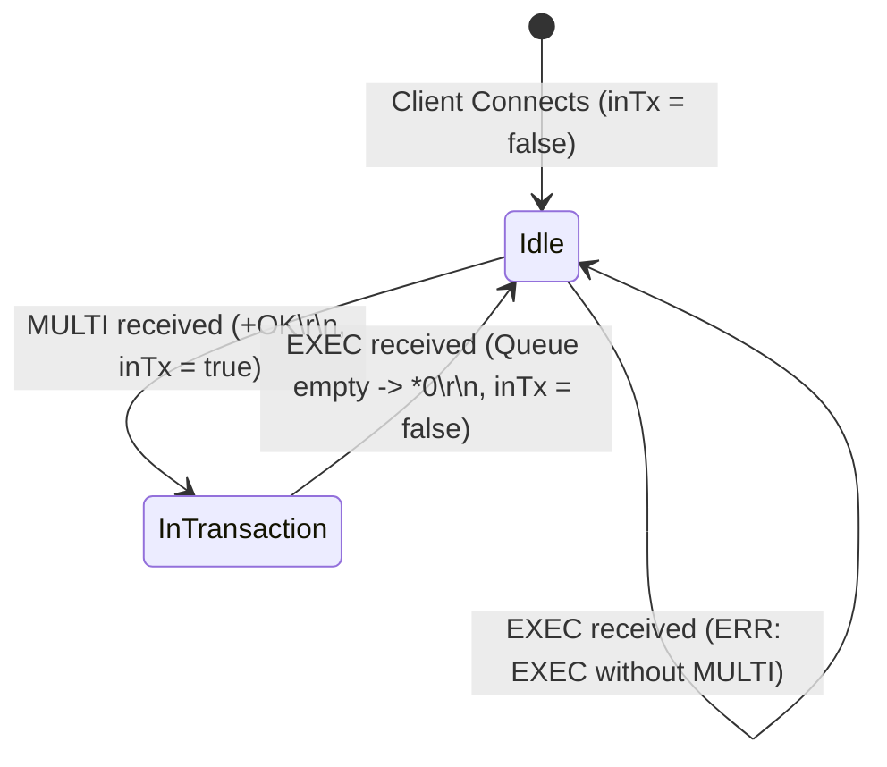
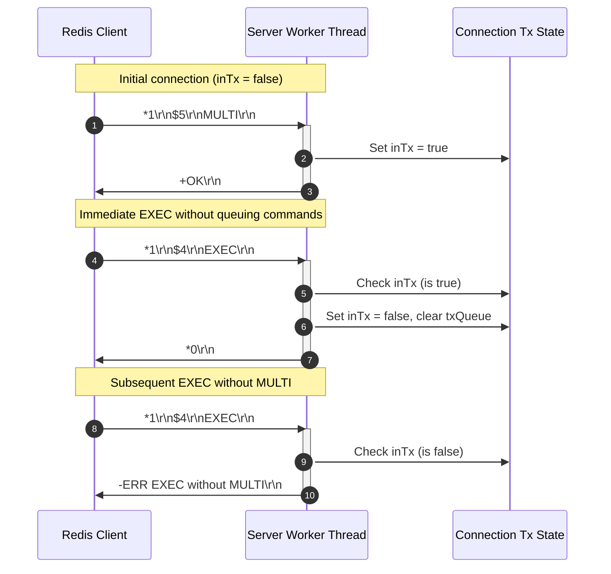

# Stage 37: Empty transaction

---

## Problem Solved

In Redis, a transaction is an atomic sequence of commands demarcated between `MULTI` and `EXEC`. However, a client may open a transaction using `MULTI` and immediately issue `EXEC` without queuing any intermediate commands.

What must occur during an empty transaction?
1. **Valid Lifecycle Completion**: The transaction is valid; entering transactional mode (`MULTI`) and immediately concluding it (`EXEC`) is completely legal in the Redis protocol.
2. **Empty Array Return (`*0\r\n`)**: Instead of failing or returning `+OK\r\n` or `$-1\r\n`, Redis returns a RESP Array of length zero: `*0\r\n`. This signifies to the client driver that zero commands were executed and the transaction committed successfully with an empty result set.
3. **State Reset (`inTx = false`)**: Executing `EXEC` immediately closes the transaction boundary. The connection transitions back to normal command-execution mode (`inTx = false`).
4. **Post-Transaction Invariant**: Once `EXEC` completes, any subsequent `EXEC` call on that connection without an intervening `MULTI` must fail with `-ERR EXEC without MULTI\r\n`.

In this stage, the server properly handles an empty transaction: on `EXEC` when `inTx == true` and the transaction queue is empty, it resets `inTx = false`, clears any transaction buffers, transmits `*0\r\n`, and ensures the connection returns to normal mode.

---

## Thought Process & Architectural Model

### 1. The Transaction State Machine

The client connection acts as a state machine transitioning between non-transactional (direct) execution and transactional mode:



### 2. The Execution Sequence

When a client runs `MULTI` followed immediately by `EXEC`:
1. `MULTI`:
   - Connection sets `inTx[0] = true`.
   - Sends `+OK\r\n`.
2. `EXEC`:
   - Checks `inTx[0]`. Since it is `true`, it enters execution logic.
   - Resets `inTx[0] = false` to guarantee that transaction state is discarded regardless of execution outcome.
   - Since no commands were queued (`txQueue.isEmpty()`), it returns an empty RESP array: `*0\r\n`.
3. Subsequent `EXEC`:
   - Checks `inTx[0]`. Since `inTx[0]` was reset to `false`, it emits `-ERR EXEC without MULTI\r\n`.



---

## Full Solution

The complete, compilable source code for `codecrafters-redis-java/src/main/java/Main.java`:

```java
import java.io.BufferedReader;
import java.io.IOException;
import java.io.InputStream;
import java.io.InputStreamReader;
import java.io.OutputStream;
import java.net.ServerSocket;
import java.net.Socket;
import java.nio.charset.StandardCharsets;
import java.util.ArrayList;
import java.util.Collections;
import java.util.LinkedHashMap;
import java.util.List;
import java.util.Map;
import java.util.Queue;
import java.util.concurrent.CompletableFuture;
import java.util.concurrent.ConcurrentHashMap;
import java.util.concurrent.ConcurrentLinkedQueue;
import java.util.concurrent.TimeUnit;
import java.util.concurrent.TimeoutException;

public class Main {
  private static class Entry {
    final String value;
    final Long expiresAt;

    Entry(String value, Long expiresAt) {
      this.value = value;
      this.expiresAt = expiresAt;
    }

    boolean isExpired() {
      return expiresAt != null && System.currentTimeMillis() > expiresAt;
    }
  }

  private static class StreamEntry {
    final String id;
    final Map<String, String> fields;

    StreamEntry(String id, Map<String, String> fields) {
      this.id = id;
      this.fields = fields;
    }
  }

  private static class StreamResult {
    final String key;
    final List<StreamEntry> entries;

    StreamResult(String key, List<StreamEntry> entries) {
      this.key = key;
      this.entries = entries;
    }
  }

  private static final Map<String, Entry> store = new ConcurrentHashMap<>();
  private static final Map<String, List<String>> listStore = new ConcurrentHashMap<>();
  private static final Map<String, List<StreamEntry>> streamStore = new ConcurrentHashMap<>();
  private static final Map<String, Queue<CompletableFuture<String>>> blockedWaiters = new ConcurrentHashMap<>();
  private static final Map<String, Object> keyLocks = new ConcurrentHashMap<>();
  private static final Object streamNotifier = new Object();

  private static Object getLock(String key) {
    return keyLocks.computeIfAbsent(key, k -> new Object());
  }

  private static int compareStreamId(long ms1, long seq1, long ms2, long seq2) {
    if (ms1 != ms2) {
      return Long.compare(ms1, ms2);
    }
    return Long.compare(seq1, seq2);
  }

  private static List<StreamResult> queryMatchingEntries(String[] keys, String[] startIds) {
    List<StreamResult> results = new ArrayList<>();
    for (int i = 0; i < keys.length; i++) {
      String key = keys[i];
      String startIdStr = startIds[i];

      long startMs, startSeq;
      if (startIdStr.contains("-")) {
        String[] p = startIdStr.split("-");
        startMs = Long.parseLong(p[0]);
        startSeq = Long.parseLong(p[1]);
      } else {
        startMs = Long.parseLong(startIdStr);
        startSeq = 0;
      }

      List<StreamEntry> stream = streamStore.get(key);
      List<StreamEntry> matching = new ArrayList<>();
      if (stream != null) {
        synchronized (stream) {
          for (StreamEntry entry : stream) {
            String[] partsId = entry.id.split("-");
            long entryMs = Long.parseLong(partsId[0]);
            long entrySeq = Long.parseLong(partsId[1]);

            if (compareStreamId(entryMs, entrySeq, startMs, startSeq) > 0) {
              matching.add(entry);
            }
          }
        }
      }

      if (!matching.isEmpty()) {
        results.add(new StreamResult(key, matching));
      }
    }
    return results;
  }

  public static void main(String[] args) {
    System.out.println("Logs from your program will appear here!");

    int port = 6379;

    try {
      ServerSocket serverSocket = new ServerSocket(port);
      serverSocket.setReuseAddress(true);

      while (true) {
        Socket clientSocket = serverSocket.accept();

        new Thread(() -> {
          try {
            OutputStream out = clientSocket.getOutputStream();
            InputStream in = clientSocket.getInputStream();
            BufferedReader reader = new BufferedReader(new InputStreamReader(in));
            boolean[] inTx = new boolean[]{false};
            List<String[]> txQueue = new ArrayList<>();

            while (true) {
              String line = reader.readLine();
              if (line == null) break; // client disconnected

              int n = Integer.parseInt(line.substring(1));

              String[] parts = new String[n];
              for (int i = 0; i < n; i++) {
                reader.readLine();            // Skip "$<len>"
                parts[i] = reader.readLine(); // Payload
              }

              String command = parts[0];

              if (command.equalsIgnoreCase("EXEC")) {
                if (!inTx[0]) {
                  out.write("-ERR EXEC without MULTI\r\n".getBytes(StandardCharsets.UTF_8));
                  out.flush();
                } else {
                  inTx[0] = false;
                  txQueue.clear();
                  out.write("*0\r\n".getBytes(StandardCharsets.UTF_8));
                  out.flush();
                }
              } else if (command.equalsIgnoreCase("MULTI")) {
                inTx[0] = true;
                out.write("+OK\r\n".getBytes(StandardCharsets.UTF_8));
                out.flush();
              } else if (command.equalsIgnoreCase("PING")) {
                out.write("+PONG\r\n".getBytes(StandardCharsets.UTF_8));
              } else if (command.equalsIgnoreCase("ECHO")) {
                String arg = parts[1];
                byte[] bytes = arg.getBytes(StandardCharsets.UTF_8);
                String response = "$" + bytes.length + "\r\n" + arg + "\r\n";
                out.write(response.getBytes(StandardCharsets.UTF_8));
              } else if (command.equalsIgnoreCase("SET")) {
                String key = parts[1];
                String value = parts[2];
                Long expiresAt = null;

                if (parts.length >= 5) {
                  if (parts[3].equalsIgnoreCase("PX")) {
                    long pxMillis = Long.parseLong(parts[4]);
                    expiresAt = System.currentTimeMillis() + pxMillis;
                  } else if (parts[3].equalsIgnoreCase("EX")) {
                    long exSeconds = Long.parseLong(parts[4]);
                    expiresAt = System.currentTimeMillis() + (exSeconds * 1000);
                  }
                }

                store.put(key, new Entry(value, expiresAt));
                out.write("+OK\r\n".getBytes(StandardCharsets.UTF_8));
              } else if (command.equalsIgnoreCase("GET")) {
                String key = parts[1];
                Entry entry = store.get(key);

                if (entry != null && !entry.isExpired()) {
                  byte[] bytes = entry.value.getBytes(StandardCharsets.UTF_8);
                  String response = "$" + bytes.length + "\r\n" + entry.value + "\r\n";
                  out.write(response.getBytes(StandardCharsets.UTF_8));
                } else {
                  if (entry != null && entry.isExpired()) {
                    store.remove(key);
                  }
                  out.write("$-1\r\n".getBytes(StandardCharsets.UTF_8));
                }
              } else if (command.equalsIgnoreCase("INCR")) {
                if (parts.length < 2) {
                  out.write("-ERR wrong number of arguments for 'incr' command\r\n".getBytes(StandardCharsets.UTF_8));
                } else {
                  String key = parts[1];
                  final long[] resultVal = new long[1];
                  final boolean[] isNaN = new boolean[1];

                  store.compute(key, (k, old) -> {
                    if (old == null || old.isExpired()) {
                      resultVal[0] = 1;
                      return new Entry("1", null);
                    }
                    try {
                      long current = Long.parseLong(old.value);
                      resultVal[0] = current + 1;
                      return new Entry(String.valueOf(resultVal[0]), old.expiresAt);
                    } catch (NumberFormatException e) {\
                      isNaN[0] = true;\
                      return old;\
                    }\
                  });\
\
                  if (isNaN[0]) {\
                    out.write("-ERR value is not an integer or out of range\\r\\n".getBytes(StandardCharsets.UTF_8));\
                  } else {\
                    out.write((":" + resultVal[0] + "\\r\\n").getBytes(StandardCharsets.UTF_8));\
                  }\
                  out.flush();\
                }\
              } else if (command.equalsIgnoreCase("TYPE")) {\
                if (parts.length < 2) {\
                  out.write("-ERR wrong number of arguments for 'type' command\\r\\n".getBytes(StandardCharsets.UTF_8));\
                } else {\
                  String key = parts[1];\
                  Entry entry = store.get(key);\
                  if (entry != null) {\
                    if (entry.isExpired()) {\
                      store.remove(key);\
                      entry = null;\
                    }\
                  }\
\
                  if (entry != null) {\
                    out.write("+string\\r\\n".getBytes(StandardCharsets.UTF_8));\
                  } else {\
                    List<String> list = listStore.get(key);\n                    if (list != null && !list.isEmpty()) {\n                      out.write(\"+list\\r\\n\".getBytes(StandardCharsets.UTF_8));\n                    } else if (streamStore.containsKey(key)) {\n                      out.write(\"+stream\\r\\n\".getBytes(StandardCharsets.UTF_8));\n                    } else {\n                      out.write(\"+none\\r\\n\".getBytes(StandardCharsets.UTF_8));\n                    }\n                  }\n                }\n              } else if (command.equalsIgnoreCase(\"XADD\")) {\n                if (parts.length < 5 || (parts.length - 3) % 2 != 0) {\n                  out.write(\"-ERR wrong number of arguments for 'xadd' command\\r\\n\".getBytes(StandardCharsets.UTF_8));\n                } else {\n                  String key = parts[1];\n                  String id = parts[2];\n                  Map<String, String> fields = new LinkedHashMap<>();\n                  for (int i = 3; i < parts.length - 1; i += 2) {\n                    fields.put(parts[i], parts[i + 1]);\n                  }\n\n                  List<StreamEntry> stream = streamStore.computeIfAbsent(key, k -> Collections.synchronizedList(new ArrayList<>()));\n\n                  if (id.equals(\"*\")) {\n                    long time = System.currentTimeMillis();\n                    synchronized (stream) {\n                      long seq;\n                      if (stream.isEmpty()) {\n                        seq = 0;\n                      } else {\n                        StreamEntry lastEntry = stream.get(stream.size() - 1);\n                        String[] lastParts = lastEntry.id.split(\"-\");\n                        long lastTime = Long.parseLong(lastParts[0]);\n                        long lastSeq = Long.parseLong(lastParts[1]);\n\n                        if (time == lastTime) {\n                          seq = lastSeq + 1;\n                        } else if (time > lastTime) {\n                          seq = 0;\n                        } else {\n                          time = lastTime;\n                          seq = lastSeq + 1;\n                        }\n                      }\n\n                      String generatedId = time + \"-\" + seq;\n                      stream.add(new StreamEntry(generatedId, fields));\n                      synchronized (streamNotifier) {\n                        streamNotifier.notifyAll();\n                      }\n                      byte[] idBytes = generatedId.getBytes(StandardCharsets.UTF_8);\n                      String response = \"$\" + idBytes.length + \"\\r\\n\" + generatedId + \"\\r\\n\";\n                      out.write(response.getBytes(StandardCharsets.UTF_8));\n                      out.flush();\n                    }\n                  } else if (id.endsWith(\"-*\")) {\n                    long time = Long.parseLong(id.substring(0, id.length() - 2));\n                    synchronized (stream) {\n                      String generatedId = null;\n                      if (stream.isEmpty()) {\n                        long seq = (time == 0) ? 1 : 0;\n                        generatedId = time + \"-\" + seq;\n                      } else {\n                        StreamEntry lastEntry = stream.get(stream.size() - 1);\n                        String[] lastParts = lastEntry.id.split(\"-\");\n                        long lastTime = Long.parseLong(lastParts[0]);\n                        long lastSeq = Long.parseLong(lastParts[1]);\n\n                        if (time < lastTime) {\n                          out.write(\"-ERR The ID specified in XADD is equal or smaller than the target stream top item\\r\\n\".getBytes(StandardCharsets.UTF_8));\n                          out.flush();\n                        } else if (time == lastTime) {\n                          long seq = lastSeq + 1;\n                          generatedId = time + \"-\" + seq;\n                        } else {\n                          long seq = (time == 0) ? 1 : 0;\n                          generatedId = time + \"-\" + seq;\n                        }\n                      }\n\n                      if (generatedId != null) {\n                        stream.add(new StreamEntry(generatedId, fields));\n                        synchronized (streamNotifier) {\n                          streamNotifier.notifyAll();\n                        }\n                        byte[] idBytes = generatedId.getBytes(StandardCharsets.UTF_8);\n                        String response = \"$\" + idBytes.length + \"\\r\\n\" + generatedId + \"\\r\\n\";\n                        out.write(response.getBytes(StandardCharsets.UTF_8));\n                        out.flush();\n                      }\n                    }\n                  } else {\n                    String[] dash = id.split(\"-\");\n                    long time = Long.parseLong(dash[0]);\n                    long seq = Long.parseLong(dash[1]);\n\n                    if (time <= 0 && seq <= 0) {\n                      out.write(\"-ERR The ID specified in XADD must be greater than 0-0\\r\\n\".getBytes(StandardCharsets.UTF_8));\n                      out.flush();\n                    } else {\n                      synchronized (stream) {\n                        boolean valid = true;\n                        if (!stream.isEmpty()) {\n                          StreamEntry lastEntry = stream.get(stream.size() - 1);\n                          String[] lastDash = lastEntry.id.split(\"-\");\n                          long lastTime = Long.parseLong(lastDash[0]);\n                          long lastSeq = Long.parseLong(lastDash[1]);\n                          if ((time < lastTime) || (time == lastTime && seq <= lastSeq)) {\n                            valid = false;\n                            out.write(\"-ERR The ID specified in XADD is equal or smaller than the target stream top item\\r\\n\".getBytes(StandardCharsets.UTF_8));\n                            out.flush();\n                          }\n                        }\n\n                        if (valid) {\n                          stream.add(new StreamEntry(id, fields));\n                          synchronized (streamNotifier) {\n                            streamNotifier.notifyAll();\n                          }\n                          byte[] idBytes = id.getBytes(StandardCharsets.UTF_8);\n                          String response = \"$\" + idBytes.length + \"\\r\\n\" + id + \"\\r\\n\";\n                          out.write(response.getBytes(StandardCharsets.UTF_8));\n                          out.flush();\n                        }\n                      }\n                    }\n                  }\n                }\n              } else if (command.equalsIgnoreCase(\"XRANGE\")) {\n                if (parts.length < 4) {\n                  out.write(\"-ERR wrong number of arguments for 'xrange' command\\r\\n\".getBytes(StandardCharsets.UTF_8));\n                } else {\n                  String key = parts[1];\n                  String start = parts[2];\n                  String end = parts[3];\n\n                  long startMs, startSeq;\n                  if (start.equals(\"-\")) {\n                    startMs = 0;\n                    startSeq = 0;\n                  } else if (start.equals(\"+\")) {\n                    startMs = Long.MAX_VALUE;\n                    startSeq = Long.MAX_VALUE;\n                  } else if (start.contains(\"-\")) {\n                    String[] p = start.split(\"-\");\n                    startMs = Long.parseLong(p[0]);\n                    startSeq = Long.parseLong(p[1]);\n                  } else {\n                    startMs = Long.parseLong(start);\n                    startSeq = 0;\n                  }\n\n                  long endMs, endSeq;\n                  if (end.equals(\"+\")) {\n                    endMs = Long.MAX_VALUE;\n                    endSeq = Long.MAX_VALUE;\n                  } else if (end.equals(\"-\")) {\n                    endMs = 0;\n                    endSeq = 0;\n                  } else if (end.contains(\"-\")) {\n                    String[] p = end.split(\"-\");\n                    endMs = Long.parseLong(p[0]);\n                    endSeq = Long.parseLong(p[1]);\n                  } else {\n                    endMs = Long.parseLong(end);\n                    endSeq = Long.MAX_VALUE;\n                  }\n\n                  List<StreamEntry> stream = streamStore.get(key);\n                  if (stream == null || stream.isEmpty()) {\n                    out.write(\"*0\\r\\n\".getBytes(StandardCharsets.UTF_8));\n                  } else {\n                    List<StreamEntry> matching = new ArrayList<>();\n                    synchronized (stream) {\n                      for (StreamEntry entry : stream) {\n                        String[] partsId = entry.id.split(\"-\");\n                        long entryMs = Long.parseLong(partsId[0]);\n                        long entrySeq = Long.parseLong(partsId[1]);\n\n                        if (compareStreamId(entryMs, entrySeq, startMs, startSeq) >= 0 &&\n                            compareStreamId(entryMs, entrySeq, endMs, endSeq) <= 0) {\n                          matching.add(entry);\n                        }\n                      }\n                    }\n\n                    StringBuilder sb = new StringBuilder();\n                    sb.append(\"*\").append(matching.size()).append(\"\\r\\n\");\n                    for (StreamEntry entry : matching) {\n                      sb.append(\"*2\\r\\n\");\n                      byte[] idBytes = entry.id.getBytes(StandardCharsets.UTF_8);\n                      sb.append(\"$\").append(idBytes.length).append(\"\\r\\n\").append(entry.id).append(\"\\r\\n\");\n                      sb.append(\"*\").append(entry.fields.size() * 2).append(\"\\r\\n\");\n                      for (Map.Entry<String, String> field : entry.fields.entrySet()) {\n                        byte[] kBytes = field.getKey().getBytes(StandardCharsets.UTF_8);\n                        sb.append(\"$\").append(kBytes.length).append(\"\\r\\n\").append(field.getKey()).append(\"\\r\\n\");\n                        byte[] vBytes = field.getValue().getBytes(StandardCharsets.UTF_8);\n                        sb.append(\"$\").append(vBytes.length).append(\"\\r\\n\").append(field.getValue()).append(\"\\r\\n\");\n                      }\n                    }\n                    out.write(sb.toString().getBytes(StandardCharsets.UTF_8));\n                  }\n                }\n              } else if (command.equalsIgnoreCase(\"XREAD\")) {\n                int streamsIndex = -1;\n                long blockTimeout = -1;\n\n                for (int i = 1; i < parts.length; i++) {\n                  if (parts[i].equalsIgnoreCase(\"BLOCK\")) {\n                    if (i + 1 < parts.length) {\n                      blockTimeout = Long.parseLong(parts[i + 1]);\n                      i++;\n                    }\n                  } else if (parts[i].equalsIgnoreCase(\"STREAMS\")) {\n                    streamsIndex = i;\n                    break;\n                  }\n                }\n\n                int rem = (streamsIndex == -1) ? 0 : parts.length - (streamsIndex + 1);\n                if (streamsIndex == -1 || rem <= 0 || rem % 2 != 0) {\n                  out.write(\"-ERR syntax error\\r\\n\".getBytes(StandardCharsets.UTF_8));\n                } else {\n                  int numStreams = rem / 2;\n                  String[] keys = new String[numStreams];\n                  String[] startIds = new String[numStreams];\n                  for (int i = 0; i < numStreams; i++) {\n                    keys[i] = parts[streamsIndex + 1 + i];\n                    startIds[i] = parts[streamsIndex + 1 + numStreams + i];\n                  }\n\n                  for (int i = 0; i < numStreams; i++) {\n                    if (startIds[i].equals(\"$\")) {\n                      List<StreamEntry> stream = streamStore.get(keys[i]);\n                      if (stream != null && !stream.isEmpty()) {\n                        synchronized (stream) {\n                          if (!stream.isEmpty()) {\n                            startIds[i] = stream.get(stream.size() - 1).id;\n                          } else {\n                            startIds[i] = \"0-0\";\n                          }\n                        }\n                      } else {\n                        startIds[i] = \"0-0\";\n                      }\n                    }\n                  }\n\n                  long deadline = (blockTimeout == 0) ? Long.MAX_VALUE : (System.currentTimeMillis() + blockTimeout);\n                  List<StreamResult> matching = queryMatchingEntries(keys, startIds);\n\n                  if (matching.isEmpty() && blockTimeout >= 0) {\n                    synchronized (streamNotifier) {\n                      matching = queryMatchingEntries(keys, startIds);\n                      while (matching.isEmpty()) {\n                        long remMs = deadline - System.currentTimeMillis();\n                        if (blockTimeout > 0 && remMs <= 0) break;\n                        try {\n                          if (blockTimeout == 0) {\n                            streamNotifier.wait();\n                          } else {\n                            streamNotifier.wait(Math.max(1, remMs));\n                          }\n                        } catch (InterruptedException e) {\n                          Thread.currentThread().interrupt();\n                          break;\n                        }\n                        matching = queryMatchingEntries(keys, startIds);\n                      }\n                    }\n                  }\n\n                  if (matching.isEmpty()) {\n                    out.write(\"*-1\\r\\n\".getBytes(StandardCharsets.UTF_8));\n                  } else {\n                    StringBuilder sb = new StringBuilder();\n                    sb.append(\"*\").append(matching.size()).append(\"\\r\\n\");\n                    for (StreamResult sr : matching) {\n                      sb.append(\"*2\\r\\n\");\n                      byte[] keyBytes = sr.key.getBytes(StandardCharsets.UTF_8);\n                      sb.append(\"$\").append(keyBytes.length).append(\"\\r\\n\").append(sr.key).append(\"\\r\\n\");\n                      sb.append(\"*\").append(sr.entries.size()).append(\"\\r\\n\");\n                      for (StreamEntry entry : sr.entries) {\n                        sb.append(\"*2\\r\\n\");\n                        byte[] idBytes = entry.id.getBytes(StandardCharsets.UTF_8);\n                        sb.append(\"$\").append(idBytes.length).append(\"\\r\\n\").append(entry.id).append(\"\\r\\n\");\n                        sb.append(\"*\").append(entry.fields.size() * 2).append(\"\\r\\n\");\n                        for (Map.Entry<String, String> field : entry.fields.entrySet()) {\n                          byte[] kBytes = field.getKey().getBytes(StandardCharsets.UTF_8);\n                          sb.append(\"$\").append(kBytes.length).append(\"\\r\\n\").append(field.getKey()).append(\"\\r\\n\");\n                          byte[] vBytes = field.getValue().getBytes(StandardCharsets.UTF_8);\n                          sb.append(\"$\").append(vBytes.length).append(\"\\r\\n\").append(field.getValue()).append(\"\\r\\n\");\n                        }\n                      }\n                    }\n                    out.write(sb.toString().getBytes(StandardCharsets.UTF_8));\n                  }\n                }\n              } else if (command.equalsIgnoreCase(\"RPUSH\")) {\n                if (parts.length < 3) {\n                  out.write(\"-ERR wrong number of arguments for 'rpush' command\\r\\n\".getBytes(StandardCharsets.UTF_8));\n                } else {\n                  String key = parts[1];\n                  Object lock = getLock(key);\n                  int newLength;\n                  synchronized (lock) {\n                    List<String> list = listStore.computeIfAbsent(key, k -> new ArrayList<>());\n                    for (int i = 2; i < parts.length; i++) {\n                      list.add(parts[i]);\n                    }\n                    newLength = list.size();\n\n                    Queue<CompletableFuture<String>> waiters = blockedWaiters.get(key);\n                    if (waiters != null) {\n                      while (!list.isEmpty() && !waiters.isEmpty()) {\n                        CompletableFuture<String> waiter = waiters.poll();\n                        if (waiter != null && !waiter.isDone()) {\n                          String head = list.get(0);\n                          if (waiter.complete(head)) {\n                            list.remove(0);\n                          }\n                        }\n                      }\n                    }\n                    if (list.isEmpty()) {\n                      listStore.remove(key);\n                    }\n                  }\n                  String response = \":\" + newLength + \"\\r\\n\";\n                  out.write(response.getBytes(StandardCharsets.UTF_8));\n                }\n              } else if (command.equalsIgnoreCase(\"LPUSH\")) {\n                if (parts.length < 3) {\n                  out.write(\"-ERR wrong number of arguments for 'lpush' command\\r\\n\".getBytes(StandardCharsets.UTF_8));\n                } else {\n                  String key = parts[1];\n                  Object lock = getLock(key);\n                  int newLength;\n                  synchronized (lock) {\n                    List<String> list = listStore.computeIfAbsent(key, k -> new ArrayList<>());\n                    for (int i = 2; i < parts.length; i++) {\n                      list.add(0, parts[i]);\n                    }\n                    newLength = list.size();\n\n                    Queue<CompletableFuture<String>> waiters = blockedWaiters.get(key);\n                    if (waiters != null) {\n                      while (!list.isEmpty() && !waiters.isEmpty()) {\n                        CompletableFuture<String> waiter = waiters.poll();\n                        if (waiter != null && !waiter.isDone()) {\n                          String head = list.get(0);\n                          if (waiter.complete(head)) {\n                            list.remove(0);\n                          }\n                        }\n                      }\n                    }\n                    if (list.isEmpty()) {\n                      listStore.remove(key);\n                    }\n                  }\n                  String response = \":\" + newLength + \"\\r\\n\";\n                  out.write(response.getBytes(StandardCharsets.UTF_8));\n                }\n              } else if (command.equalsIgnoreCase(\"LLEN\")) {\n                if (parts.length < 2) {\n                  out.write(\"-ERR wrong number of arguments for 'llen' command\\r\\n\".getBytes(StandardCharsets.UTF_8));\n                } else {\n                  String key = parts[1];\n                  Object lock = getLock(key);\n                  int length = 0;\n                  synchronized (lock) {\n                    List<String> list = listStore.get(key);\n                    if (list != null) {\n                      length = list.size();\n                    }\n                  }\n                  String response = \":\" + length + \"\\r\\n\";\n                  out.write(response.getBytes(StandardCharsets.UTF_8));\n                }\n              } else if (command.equalsIgnoreCase(\"LPOP\")) {\n                if (parts.length < 2) {\n                  out.write(\"-ERR wrong number of arguments for 'lpop' command\\r\\n\".getBytes(StandardCharsets.UTF_8));\n                } else if (parts.length == 2) {\n                  String key = parts[1];\n                  Object lock = getLock(key);\n                  String removedElement = null;\n                  synchronized (lock) {\n                    List<String> list = listStore.get(key);\n                    if (list != null && !list.isEmpty()) {\n                      removedElement = list.remove(0);\n                      if (list.isEmpty()) {\n                        listStore.remove(key);\n                      }\n                    }\n                  }\n                  if (removedElement == null) {\n                    out.write(\"$-1\\r\\n\".getBytes(StandardCharsets.UTF_8));\n                  } else {\n                    byte[] bytes = removedElement.getBytes(StandardCharsets.UTF_8);\n                    String response = \"$\" + bytes.length + \"\\r\\n\" + removedElement + \"\\r\\n\";\n                    out.write(response.getBytes(StandardCharsets.UTF_8));\n                  }\n                } else {\n                  String key = parts[1];\n                  try {\n                    int count = Integer.parseInt(parts[2]);\n                    if (count < 0) {\n                      out.write(\"-ERR value is out of range, must be positive\\r\\n\".getBytes(StandardCharsets.UTF_8));\n                    } else {\n                      Object lock = getLock(key);\n                      List<String> removedElements = new ArrayList<>();\n                      boolean keyExisted = false;\n                      synchronized (lock) {\n                        List<String> list = listStore.get(key);\n                        if (list != null) {\n                          keyExisted = true;\n                          int toRemove = Math.min(count, list.size());\n                          for (int i = 0; i < toRemove; i++) {\n                            removedElements.add(list.remove(0));\n                          }\n                          if (list.isEmpty()) {\n                            listStore.remove(key);\n                          }\n                        }\n                      }\n                      if (!keyExisted || (removedElements.isEmpty() && count > 0)) {\n                        out.write(\"*-1\\r\\n\".getBytes(StandardCharsets.UTF_8));\n                      } else {\n                        StringBuilder sb = new StringBuilder();\n                        sb.append(\"*\").append(removedElements.size()).append(\"\\r\\n\");\n                        for (String elem : removedElements) {\n                          byte[] elemBytes = elem.getBytes(StandardCharsets.UTF_8);\n                          sb.append(\"$\").append(elemBytes.length).append(\"\\r\\n\").append(elem).append(\"\\r\\n\");\n                        }\n                        out.write(sb.toString().getBytes(StandardCharsets.UTF_8));\n                      }\n                    }\n                  } catch (NumberFormatException e) {\n                    out.write(\"-ERR value is not an integer or out of range\\r\\n\".getBytes(StandardCharsets.UTF_8));\n                  }\n                }\n              } else if (command.equalsIgnoreCase(\"BLPOP\")) {\n                if (parts.length < 3) {\n                  out.write(\"-ERR wrong number of arguments for 'blpop' command\\r\\n\".getBytes(StandardCharsets.UTF_8));\n                } else {\n                  try {\n                    String key = parts[1];\n                    double timeoutSec = Double.parseDouble(parts[2]);\n                    if (timeoutSec < 0) {\n                      out.write(\"-ERR timeout is negative\\r\\n\".getBytes(StandardCharsets.UTF_8));\n                    } else {\n                      long timeoutMillis = (long) (timeoutSec * 1000);\n                      Object lock = getLock(key);\n                      String popped = null;\n                      CompletableFuture<String> future = null;\n\n                      synchronized (lock) {\n                        List<String> list = listStore.get(key);\n                        if (list != null && !list.isEmpty()) {\n                          popped = list.remove(0);\n                          if (list.isEmpty()) {\n                            listStore.remove(key);\n                          }\n                        } else {\n                          future = new CompletableFuture<>();\n                          blockedWaiters.computeIfAbsent(key, k -> new ConcurrentLinkedQueue<>()).add(future);\n                        }\n                      }\n\n                      if (popped != null) {\n                        byte[] keyBytes = key.getBytes(StandardCharsets.UTF_8);\n                        byte[] elemBytes = popped.getBytes(StandardCharsets.UTF_8);\n                        String response = \"*2\\r\\n$\" + keyBytes.length + \"\\r\\n\" + key + \"\\r\\n$\" + elemBytes.length + \"\\r\\n\" + popped + \"\\r\\n\";\n                        out.write(response.getBytes(StandardCharsets.UTF_8));\n                      } else if (future != null) {\n                        try {\n                          if (timeoutMillis > 0) {\n                            popped = future.get(timeoutMillis, TimeUnit.MILLISECONDS);\n                          } else {\n                            popped = future.get();\n                          }\n                          byte[] keyBytes = key.getBytes(StandardCharsets.UTF_8);\n                          byte[] elemBytes = popped.getBytes(StandardCharsets.UTF_8);\n                          String response = \"*2\\r\\n$\" + keyBytes.length + \"\\r\\n\" + key + \"\\r\\n$\" + elemBytes.length + \"\\r\\n\" + popped + \"\\r\\n\";\n                          out.write(response.getBytes(StandardCharsets.UTF_8));\n                        } catch (TimeoutException e) {\n                          Queue<CompletableFuture<String>> waiters = blockedWaiters.get(key);\n                          if (waiters != null) {\n                            waiters.remove(future);\n                          }\n                          future.cancel(true);\n                          out.write(\"*-1\\r\\n\".getBytes(StandardCharsets.UTF_8));\n                        } catch (Exception e) {\n                          Queue<CompletableFuture<String>> waiters = blockedWaiters.get(key);\n                          if (waiters != null) {\n                            waiters.remove(future);\n                          }\n                          future.cancel(true);\n                          out.write(\"*-1\\r\\n\".getBytes(StandardCharsets.UTF_8));\n                        }\n                      }\n                    }\n                  } catch (NumberFormatException e) {\n                    out.write(\"-ERR timeout is not a float or out of range\\r\\n\".getBytes(StandardCharsets.UTF_8));\n                  }\n                }\n              } else if (command.equalsIgnoreCase(\"LRANGE\")) {\n                if (parts.length < 4) {\n                  out.write(\"-ERR wrong number of arguments for 'lrange' command\\r\\n\".getBytes(StandardCharsets.UTF_8));\n                } else {\n                  String key = parts[1];\n                  int start = Integer.parseInt(parts[2]);\n                  int stop = Integer.parseInt(parts[3]);\n\n                  Object lock = getLock(key);\n                  List<String> elementsToReturn;\n                  synchronized (lock) {\n                    List<String> list = listStore.get(key);\n                    if (list == null || list.isEmpty()) {\n                      elementsToReturn = Collections.emptyList();\n                    } else {\n                      int size = list.size();\n                      if (start < 0) start += size;\n                      if (stop < 0) stop += size;\n                      if (start < 0) start = 0;\n                      if (stop < 0) stop = 0;\n\n                      if (start >= size || start > stop) {\n                        elementsToReturn = Collections.emptyList();\n                      } else {\n                        int stopIdx = Math.min(stop, size - 1);\n                        elementsToReturn = new ArrayList<>(list.subList(start, stopIdx + 1));\n                      }\n                    }\n                  }\n\n                  if (elementsToReturn.isEmpty()) {\n                    out.write(\"*0\\r\\n\".getBytes(StandardCharsets.UTF_8));\n                  } else {\n                    StringBuilder sb = new StringBuilder();\n                    sb.append(\"*\").append(elementsToReturn.size()).append(\"\\r\\n\");\n                    for (String elem : elementsToReturn) {\n                      byte[] elemBytes = elem.getBytes(StandardCharsets.UTF_8);\n                      sb.append(\"$\").append(elemBytes.length).append(\"\\r\\n\").append(elem).append(\"\\r\\n\");\n                    }\n                    out.write(sb.toString().getBytes(StandardCharsets.UTF_8));\n                  }\n                }\n              }\n              out.flush();\n            }\n          } catch (IOException e) {\n            System.out.println(\"IOException: \" + e.getMessage());\n          }\n        }).start();\n      }\n    } catch (IOException e) {\n      System.out.println(\"IOException: \" + e.getMessage());\n    }\n  }\n}\n```\n\n---\n\n## Concepts\n\n- **Zero-Length Array Serialization (`*0\\r\\n`)**: In RESP (Redis Serialization Protocol), an array is formatted as `*<count>\\r\\n`. An empty collection or empty execution batch is represented as `*0\\r\\n`. This distinguishes an empty success from a null reply (`*-1\\r\\n`) or error reply (`-ERR ...`).\n- **Transactional State Demarcation**: Transactions are bounded by `MULTI` and terminated by `EXEC` or `DISCARD`. Terminating an empty transaction must return the connection to standard direct-execution mode.\n- **State Guarding**: Calling `EXEC` outside of a transaction violates protocol invariants, emitting `-ERR EXEC without MULTI\\r\\n`. Transitioning `inTx = false` during `EXEC` ensures subsequent `EXEC` calls cannot succeed without another `MULTI`.\n\n---\n\n## What Breaks It (Failure Modes)\n\n- **Returning Null Array Instead of Empty Array**:\n  - *Hazard*: Returning `*-1\\r\\n` (null array) instead of `*0\\r\\n` (empty array). Redis clients treat null arrays as transaction aborts (e.g. `WATCH` failures).\n  - *Mitigation*: Strictly serialize `*0\\r\\n` when the transaction queue is empty.\n- **Failing to Clear Transaction State**:\n  - *Hazard*: Forgetting `inTx[0] = false;` upon `EXEC`. A second `EXEC` would return `*0\\r\\n` again instead of `-ERR EXEC without MULTI\\r\\n`.\n  - *Mitigation*: Unconditionally reset `inTx[0] = false;` in the `EXEC` handler.\n- **Neglecting to Flush Socket Output Stream**:\n  - *Hazard*: Writing bytes to the output stream without calling `out.flush()`. The client hangs waiting for wire bytes.\n  - *Mitigation*: Always call `out.flush()` after writing the response.\n\n---\n\n## Tradeoffs\n\n- **Atomic Reset before Queue Processing**:\n  - Resetting `inTx[0] = false` prior to emitting replies ensures that even if an error occurs while serializing queued responses, the connection is never left trapped in transactional mode.\n\n---\n\n## Wire Format / Protocol\n\n| Step | Client Command | Server Wire Response | Meaning |\n|---|---|---|---|\n| 1 | `MULTI` | `+OK\\r\\n` | Enters transaction mode (`inTx = true`) |\n| 2 | `EXEC` | `*0\\r\\n` | Empty array response; exits transaction mode (`inTx = false`) |\n| 3 | `EXEC` | `-ERR EXEC without MULTI\\r\\n` | Error because transaction mode was already closed |\n\n---\n\n## Java Specifics — Lookup, Don't Memorize\n\n- `out.write(\"*0\\\\r\\\\n\".getBytes(StandardCharsets.UTF_8))`: Emits an empty RESP array.\n- `boolean[] inTx`: A single-element array used as a mutable boolean holder across lambda boundaries within the connection worker thread.\n\n---\n\n## How It Flows\n\n1. **MULTI Command**:\n   - Client sends `*1\\r\\n$5\\r\\nMULTI\\r\\n`.\n   - Server sets `inTx[0] = true` and replies `+OK\\r\\n`.\n2. **EXEC Command (Empty)**:\n   - Client sends `*1\\r\\n$4\\r\\nEXEC\\r\\n`.\n   - Server checks `inTx[0]`. It is `true`.\n   - Server sets `inTx[0] = false`, clears `txQueue`, writes `*0\\r\\n`, and flushes the stream.\n3. **Second EXEC Command**:\n   - Client sends `*1\\r\\n$4\\r\\nEXEC\\r\\n`.\n   - Server checks `inTx[0]`. It is now `false`.\n   - Server writes `-ERR EXEC without MULTI\\r\\n` and flushes.\n\n---\n\n## Rebuild Checklist\n\n- [ ] Ensure `MULTI` sets `inTx[0] = true` and replies `+OK\\r\\n`.\n- [ ] Ensure `EXEC` verifies `inTx[0]`.\n- [ ] If `inTx[0]` is `true`, reset `inTx[0] = false`, clear `txQueue`, write `*0\\r\\n`, and flush.\n- [ ] If `inTx[0]` is `false`, write `-ERR EXEC without MULTI\\r\\n` and flush.\n- [ ] Verify test suite with CodeCrafters CLI.\n