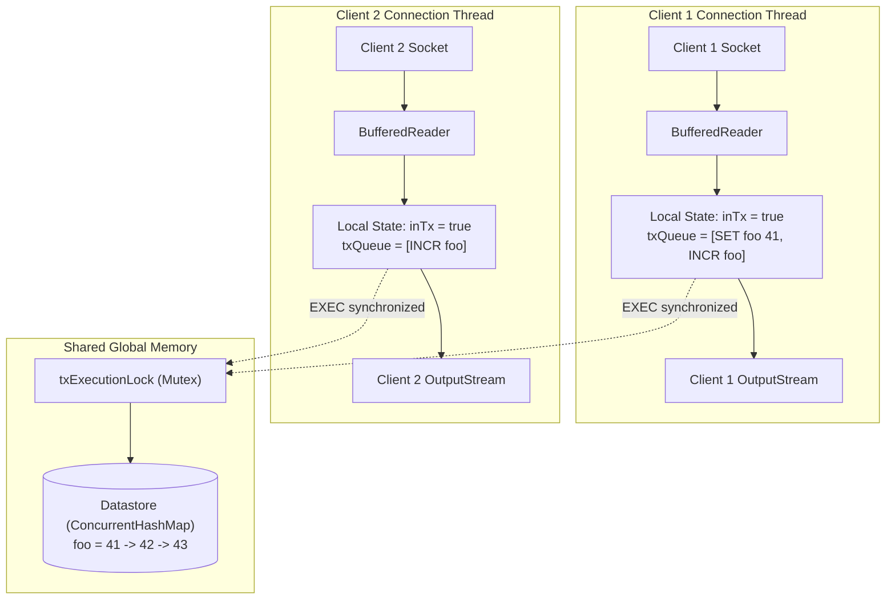
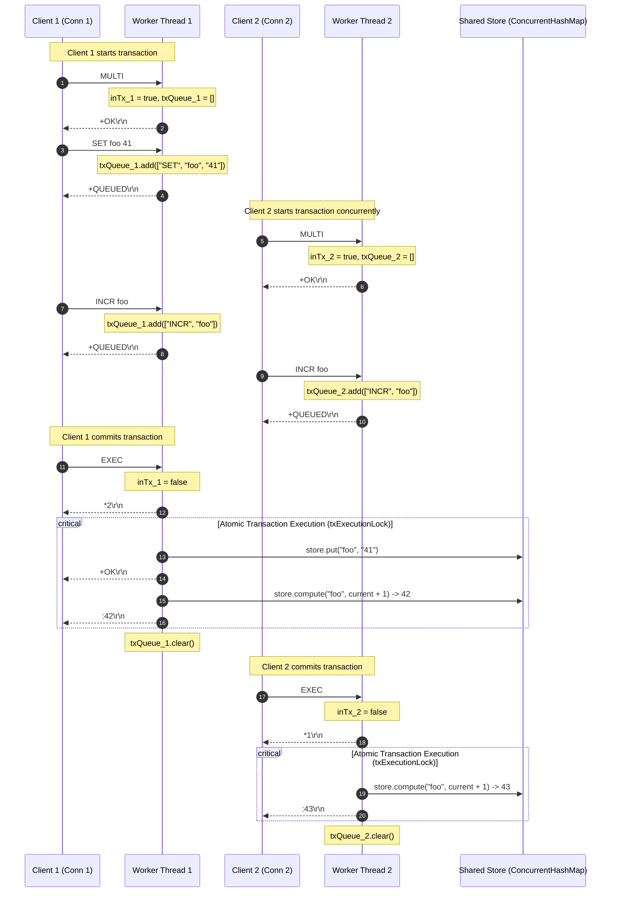

# Stage 42: Multiple transactions

---

## In one line
Isolate transaction queues to individual client connections while serializing `EXEC` execution against the shared datastore to guarantee atomic, concurrent transactions without state leakage.

---

## Self-test (cover the answers below and answer these first)
1. **Why does each client connection require its own `txQueue` and `inTx` flag instead of sharing global server variables?**
2. **If Client 1 begins a transaction with `MULTI` and queues commands, and Client 2 simultaneously sends non-transactional commands or starts its own transaction, what does Client 2 observe?**
3. **What hazard arises if two clients call `EXEC` simultaneously on transactions that modify the same keys, and how is serializability maintained in a multi-threaded architecture?**
4. **If a client opens a transaction (`MULTI`), queues five commands, and abruptly closes its TCP socket before sending `EXEC` or `DISCARD`, what happens to the queued commands and the datastore?**

---

## Problem Solved

In previous transaction stages, we implemented single-client transaction primitives:
- Initializing a transaction block (`MULTI`).
- Queuing commands into a FIFO buffer (`+QUEUED\r\n`).
- Aborting and clearing queued commands (`DISCARD`).
- Executing buffered commands sequentially and returning a RESP array (`EXEC`), even when individual commands fail at runtime.

However, real-world Redis servers handle hundreds or thousands of concurrent client connections simultaneously. Multiple clients can:
1. Open transactions concurrently (Client A and Client B both issue `MULTI`).
2. Queue independent commands without interfering with each other's pending operations.
3. Commit their transactions (`EXEC`) independently at different points in time.

If transaction state (`inTx` and `txQueue`) were erroneously stored in shared or static variables at the server level:
- Client B issuing `MULTI` while Client A has an active transaction would trigger `-ERR MULTI calls can not be nested\r\n`.
- Commands sent by Client B would be appended to Client A's queue, cross-contaminating operations across clients.
- Calling `DISCARD` or `EXEC` on one connection would purge or prematurely execute another connection's commands.

In Stage 42, we verify and harden our architecture for **multiple concurrent transactions**:
- Every client connection maintains its own isolated transaction context (`boolean[] inTx` and `List<String[]> txQueue`).
- Multiple transactions can remain open simultaneously in memory without crosstalk.
- When any client executes `EXEC`, its queued commands execute atomically against the shared datastore without interleaving with concurrent transactions.
- State mutations from an earlier committed transaction (e.g. `INCR foo` producing `42`) are immediately visible to a subsequently executed transaction (e.g. `INCR foo` producing `43`).

```text
Connection 1: MULTI -> SET foo 41 (QUEUED) -> INCR foo (QUEUED)
Connection 2: MULTI -> INCR foo (QUEUED)
Connection 1: EXEC  -> [OK, 42]
Connection 2: EXEC  -> [43]
```

---

## Thought Process & Architectural Model

### 1. Connection-Scoped State vs Shared Datastore

A Redis server architecture consists of two primary operational domains:
1. **Per-Connection State (Private)**:
   - Client TCP Socket input/output streams and line readers.
   - Transaction mode flag (`inTx`).
   - Connection command buffer (`txQueue`).
   - Subscription lists (for Pub/Sub) or tracking metadata.
2. **Shared Datastore State (Global)**:
   - Key-value mappings (`store`).
   - List structures (`listStore`).
   - Stream structures (`streamStore`).
   - Blocking waiters (`blockedWaiters`).



### 2. Multi-Client Concurrency and Execution Isolation

In standard C Redis, the server executes commands on a single-threaded event loop. When a client issues `EXEC`, all commands in that transaction are processed sequentially in a single turn of the event loop. No commands from any other client can interleave during that execution.

In our multi-threaded Java server, each incoming client socket is handled on an independent worker thread (`new Thread(...)`). To faithfully mirror Redis's transaction serializability:
- Command queuing is entirely non-blocking and isolated because `txQueue` is thread-local/connection-local.
- When a connection calls `EXEC`, the iteration over `txQueue` acquiring and mutating datastore keys is synchronized on `txExecutionLock`.
- This ensures that if two clients call `EXEC` simultaneously, one transaction completes in its entirety before the second transaction begins, preventing race conditions or interleaved partial writes.

### 3. Execution Sequence Diagram

The following sequence diagram illustrates two concurrent client sessions interleaving `MULTI`, command queueing, and `EXEC`:



---

## Full Solution

The complete source code in `codecrafters-redis-java/src/main/java/Main.java`:

```java
import java.io.BufferedReader;
import java.io.IOException;
import java.io.InputStream;
import java.io.InputStreamReader;
import java.io.OutputStream;
import java.net.ServerSocket;
import java.net.Socket;
import java.nio.charset.StandardCharsets;
import java.util.ArrayList;
import java.util.Collections;
import java.util.LinkedHashMap;
import java.util.List;
import java.util.Map;
import java.util.Queue;
import java.util.concurrent.CompletableFuture;
import java.util.concurrent.ConcurrentHashMap;
import java.util.concurrent.ConcurrentLinkedQueue;
import java.util.concurrent.TimeUnit;
import java.util.concurrent.TimeoutException;

public class Main {
  private static class Entry {
    final String value;
    final Long expiresAt;

    Entry(String value, Long expiresAt) {
      this.value = value;
      this.expiresAt = expiresAt;
    }

    boolean isExpired() {
      return expiresAt != null && System.currentTimeMillis() > expiresAt;
    }
  }

  private static class StreamEntry {
    final String id;
    final Map<String, String> fields;

    StreamEntry(String id, Map<String, String> fields) {
      this.id = id;
      this.fields = fields;
    }
  }

  private static class StreamResult {
    final String key;
    final List<StreamEntry> entries;

    StreamResult(String key, List<StreamEntry> entries) {
      this.key = key;
      this.entries = entries;
    }
  }

  private static final Map<String, Entry> store = new ConcurrentHashMap<>();
  private static final Map<String, List<String>> listStore = new ConcurrentHashMap<>();
  private static final Map<String, List<StreamEntry>> streamStore = new ConcurrentHashMap<>();
  private static final Map<String, Queue<CompletableFuture<String>>> blockedWaiters = new ConcurrentHashMap<>();
  private static final Map<String, Object> keyLocks = new ConcurrentHashMap<>();
  private static final Object streamNotifier = new Object();
  private static final Object txExecutionLock = new Object();

  private static Object getLock(String key) {
    return keyLocks.computeIfAbsent(key, k -> new Object());
  }

  private static int compareStreamId(long ms1, long seq1, long ms2, long seq2) {
    if (ms1 != ms2) {
      return Long.compare(ms1, ms2);
    }
    return Long.compare(seq1, seq2);
  }

  private static List<StreamResult> queryMatchingEntries(String[] keys, String[] startIds) {
    List<StreamResult> results = new ArrayList<>();
    for (int i = 0; i < keys.length; i++) {
      String key = keys[i];
      String startIdStr = startIds[i];

      long startMs, startSeq;
      if (startIdStr.contains("-")) {
        String[] p = startIdStr.split("-");
        startMs = Long.parseLong(p[0]);
        startSeq = Long.parseLong(p[1]);
      } else {
        startMs = Long.parseLong(startIdStr);
        startSeq = 0;
      }

      List<StreamEntry> stream = streamStore.get(key);
      List<StreamEntry> matching = new ArrayList<>();
      if (stream != null) {
        synchronized (stream) {
          for (StreamEntry entry : stream) {
            String[] partsId = entry.id.split("-");
            long entryMs = Long.parseLong(partsId[0]);
            long entrySeq = Long.parseLong(partsId[1]);

            if (compareStreamId(entryMs, entrySeq, startMs, startSeq) > 0) {
              matching.add(entry);
            }
          }
        }
      }

      if (!matching.isEmpty()) {
        results.add(new StreamResult(key, matching));
      }
    }
    return results;
  }

  private static void handleCommand(String[] parts, OutputStream out) throws IOException {
    String command = parts[0];

    if (command.equalsIgnoreCase("PING")) {
      out.write("+PONG\r\n".getBytes(StandardCharsets.UTF_8));
    } else if (command.equalsIgnoreCase("ECHO")) {
      String arg = parts[1];
      byte[] bytes = arg.getBytes(StandardCharsets.UTF_8);
      String response = "$" + bytes.length + "\r\n" + arg + "\r\n";
      out.write(response.getBytes(StandardCharsets.UTF_8));
    } else if (command.equalsIgnoreCase("SET")) {
      String key = parts[1];
      String value = parts[2];
      Long expiresAt = null;

      if (parts.length >= 5) {
        if (parts[3].equalsIgnoreCase("PX")) {
          long pxMillis = Long.parseLong(parts[4]);
          expiresAt = System.currentTimeMillis() + pxMillis;
        } else if (parts[3].equalsIgnoreCase("EX")) {
          long exSeconds = Long.parseLong(parts[4]);
          expiresAt = System.currentTimeMillis() + (exSeconds * 1000);
        }
      }

      store.put(key, new Entry(value, expiresAt));
      out.write("+OK\r\n".getBytes(StandardCharsets.UTF_8));
    } else if (command.equalsIgnoreCase("GET")) {
      String key = parts[1];
      Entry entry = store.get(key);

      if (entry != null && !entry.isExpired()) {
        byte[] bytes = entry.value.getBytes(StandardCharsets.UTF_8);
        String response = "$" + bytes.length + "\r\n" + entry.value + "\r\n";
        out.write(response.getBytes(StandardCharsets.UTF_8));
      } else {
        if (entry != null && entry.isExpired()) {
          store.remove(key);
        }
        out.write("$-1\r\n".getBytes(StandardCharsets.UTF_8));
      }
    } else if (command.equalsIgnoreCase("INCR")) {
      if (parts.length < 2) {
        out.write("-ERR wrong number of arguments for 'incr' command\r\n".getBytes(StandardCharsets.UTF_8));
      } else {
        String key = parts[1];
        final long[] resultVal = new long[1];
        final boolean[] isNaN = new boolean[1];

        store.compute(key, (k, old) -> {
          if (old == null || old.isExpired()) {
            resultVal[0] = 1;
            return new Entry("1", null);
          }
          try {
            long current = Long.parseLong(old.value);
            resultVal[0] = current + 1;
            return new Entry(String.valueOf(resultVal[0]), old.expiresAt);
          } catch (NumberFormatException e) {
            isNaN[0] = true;
            return old;
          }
        });

        if (isNaN[0]) {
          out.write("-ERR value is not an integer or out of range\r\n".getBytes(StandardCharsets.UTF_8));
        } else {
          out.write((":" + resultVal[0] + "\r\n").getBytes(StandardCharsets.UTF_8));
        }
        out.flush();
      }
    } else if (command.equalsIgnoreCase("TYPE")) {
      if (parts.length < 2) {
        out.write("-ERR wrong number of arguments for 'type' command\r\n".getBytes(StandardCharsets.UTF_8));
      } else {
        String key = parts[1];
        Entry entry = store.get(key);
        if (entry != null) {
          if (entry.isExpired()) {
            store.remove(key);
            entry = null;
          }
        }

        if (entry != null) {
          out.write("+string\r\n".getBytes(StandardCharsets.UTF_8));
        } else {
          List<String> list = listStore.get(key);
          if (list != null && !list.isEmpty()) {
            out.write("+list\r\n".getBytes(StandardCharsets.UTF_8));
          } else if (streamStore.containsKey(key)) {
            out.write("+stream\r\n".getBytes(StandardCharsets.UTF_8));
          } else {
            out.write("+none\r\n".getBytes(StandardCharsets.UTF_8));
          }
        }
      }
    } else if (command.equalsIgnoreCase("XADD")) {
      if (parts.length < 5 || (parts.length - 3) % 2 != 0) {
        out.write("-ERR wrong number of arguments for 'xadd' command\r\n".getBytes(StandardCharsets.UTF_8));
      } else {
        String key = parts[1];
        String id = parts[2];
        Map<String, String> fields = new LinkedHashMap<>();
        for (int i = 3; i < parts.length - 1; i += 2) {
          fields.put(parts[i], parts[i + 1]);
        }

        List<StreamEntry> stream = streamStore.computeIfAbsent(key, k -> Collections.synchronizedList(new ArrayList<>()));

        if (id.equals("*")) {
          long time = System.currentTimeMillis();
          synchronized (stream) {
            long seq;
            if (stream.isEmpty()) {
              seq = 0;
            } else {
              StreamEntry lastEntry = stream.get(stream.size() - 1);
              String[] lastParts = lastEntry.id.split("-");
              long lastTime = Long.parseLong(lastParts[0]);
              long lastSeq = Long.parseLong(lastParts[1]);

              if (time == lastTime) {
                seq = lastSeq + 1;
              } else if (time > lastTime) {
                seq = 0;
              } else {
                time = lastTime;
                seq = lastSeq + 1;
              }
            }

            String generatedId = time + "-" + seq;
            stream.add(new StreamEntry(generatedId, fields));
            synchronized (streamNotifier) {
              streamNotifier.notifyAll();
            }
            byte[] idBytes = generatedId.getBytes(StandardCharsets.UTF_8);
            String response = "$" + idBytes.length + "\r\n" + generatedId + "\r\n";
            out.write(response.getBytes(StandardCharsets.UTF_8));
            out.flush();
          }
        } else if (id.endsWith("-*")) {
          long time = Long.parseLong(id.substring(0, id.length() - 2));
          synchronized (stream) {
            String generatedId = null;
            if (stream.isEmpty()) {
              long seq = (time == 0) ? 1 : 0;
              generatedId = time + "-" + seq;
            } else {
              StreamEntry lastEntry = stream.get(stream.size() - 1);
              String[] lastParts = lastEntry.id.split("-");
              long lastTime = Long.parseLong(lastParts[0]);
              long lastSeq = Long.parseLong(lastParts[1]);

              if (time < lastTime) {
                out.write("-ERR The ID specified in XADD is equal or smaller than the target stream top item\r\n".getBytes(StandardCharsets.UTF_8));
                out.flush();
              } else if (time == lastTime) {
                long seq = lastSeq + 1;
                generatedId = time + "-" + seq;
              } else {
                long seq = (time == 0) ? 1 : 0;
                generatedId = time + "-" + seq;
              }
            }

            if (generatedId != null) {
              stream.add(new StreamEntry(generatedId, fields));
              synchronized (streamNotifier) {
                streamNotifier.notifyAll();
              }
              byte[] idBytes = generatedId.getBytes(StandardCharsets.UTF_8);
              String response = "$" + idBytes.length + "\r\n" + generatedId + "\r\n";
              out.write(response.getBytes(StandardCharsets.UTF_8));
              out.flush();
            }
          }
        } else {
          String[] dash = id.split("-");
          long time = Long.parseLong(dash[0]);
          long seq = Long.parseLong(dash[1]);

          if (time <= 0 && seq <= 0) {
            out.write("-ERR The ID specified in XADD must be greater than 0-0\r\n".getBytes(StandardCharsets.UTF_8));
            out.flush();
          } else {
            synchronized (stream) {
              boolean valid = true;
              if (!stream.isEmpty()) {
                StreamEntry lastEntry = stream.get(stream.size() - 1);
                String[] lastDash = lastEntry.id.split("-");
                long lastTime = Long.parseLong(lastDash[0]);
                long lastSeq = Long.parseLong(lastDash[1]);
                if ((time < lastTime) || (time == lastTime && seq <= lastSeq)) {
                  valid = false;
                  out.write("-ERR The ID specified in XADD is equal or smaller than the target stream top item\r\n".getBytes(StandardCharsets.UTF_8));
                  out.flush();
                }
              }

              if (valid) {
                stream.add(new StreamEntry(id, fields));
                synchronized (streamNotifier) {
                  streamNotifier.notifyAll();
                }
                byte[] idBytes = id.getBytes(StandardCharsets.UTF_8);
                String response = "$" + idBytes.length + "\r\n" + id + "\r\n";
                out.write(response.getBytes(StandardCharsets.UTF_8));
                out.flush();
              }
            }
          }
        }
      }
    } else if (command.equalsIgnoreCase("XRANGE")) {
      if (parts.length < 4) {
        out.write("-ERR wrong number of arguments for 'xrange' command\r\n".getBytes(StandardCharsets.UTF_8));
      } else {
        String key = parts[1];
        String start = parts[2];
        String end = parts[3];

        long startMs, startSeq;
        if (start.equals("-")) {
          startMs = 0;
          startSeq = 0;
        } else if (start.equals("+")) {
          startMs = Long.MAX_VALUE;
          startSeq = Long.MAX_VALUE;
        } else if (start.contains("-")) {
          String[] p = start.split("-");
          startMs = Long.parseLong(p[0]);
          startSeq = Long.parseLong(p[1]);
        } else {
          startMs = Long.parseLong(start);
          startSeq = 0;
        }

        long endMs, endSeq;
        if (end.equals("+")) {
          endMs = Long.MAX_VALUE;
          endSeq = Long.MAX_VALUE;
        } else if (end.equals("-")) {
          endMs = 0;
          endSeq = 0;
        } else if (end.contains("-")) {
          String[] p = end.split("-");
          endMs = Long.parseLong(p[0]);
          endSeq = Long.parseLong(p[1]);
        } else {
          endMs = Long.parseLong(end);
          endSeq = Long.MAX_VALUE;
        }

        List<StreamEntry> stream = streamStore.get(key);
        if (stream == null || stream.isEmpty()) {
          out.write("*0\r\n".getBytes(StandardCharsets.UTF_8));
        } else {
          List<StreamEntry> matching = new ArrayList<>();
          synchronized (stream) {
            for (StreamEntry entry : stream) {
              String[] partsId = entry.id.split("-");
              long entryMs = Long.parseLong(partsId[0]);
              long entrySeq = Long.parseLong(partsId[1]);

              if (compareStreamId(entryMs, entrySeq, startMs, startSeq) >= 0 &&
                  compareStreamId(entryMs, entrySeq, endMs, endSeq) <= 0) {
                matching.add(entry);
              }
            }
          }

          StringBuilder sb = new StringBuilder();
          sb.append("*").append(matching.size()).append("\r\n");
          for (StreamEntry entry : matching) {
            sb.append("*2\r\n");
            byte[] idBytes = entry.id.getBytes(StandardCharsets.UTF_8);
            sb.append("$").append(idBytes.length).append("\r\n").append(entry.id).append("\r\n");
            sb.append("*").append(entry.fields.size() * 2).append("\r\n");
            for (Map.Entry<String, String> field : entry.fields.entrySet()) {
              byte[] kBytes = field.getKey().getBytes(StandardCharsets.UTF_8);
              sb.append("$").append(kBytes.length).append("\r\n").append(field.getKey()).append("\r\n");
              byte[] vBytes = field.getValue().getBytes(StandardCharsets.UTF_8);
              sb.append("$").append(vBytes.length).append("\r\n").append(field.getValue()).append("\r\n");
            }
          }
          out.write(sb.toString().getBytes(StandardCharsets.UTF_8));
        }
      }
    } else if (command.equalsIgnoreCase("XREAD")) {
      int streamsIndex = -1;
      long blockTimeout = -1;

      for (int i = 1; i < parts.length; i++) {
        if (parts[i].equalsIgnoreCase("BLOCK")) {
          if (i + 1 < parts.length) {
            blockTimeout = Long.parseLong(parts[i + 1]);
            i++;
          }
        } else if (parts[i].equalsIgnoreCase("STREAMS")) {
          streamsIndex = i;
          break;
        }
      }

      int rem = (streamsIndex == -1) ? 0 : parts.length - (streamsIndex + 1);
      if (streamsIndex == -1 || rem <= 0 || rem % 2 != 0) {
        out.write("-ERR syntax error\r\n".getBytes(StandardCharsets.UTF_8));
      } else {
        int numStreams = rem / 2;
        String[] keys = new String[numStreams];
        String[] startIds = new String[numStreams];
        for (int i = 0; i < numStreams; i++) {
          keys[i] = parts[streamsIndex + 1 + i];
          startIds[i] = parts[streamsIndex + 1 + numStreams + i];
        }

        for (int i = 0; i < numStreams; i++) {
          if (startIds[i].equals("$")) {
            List<StreamEntry> stream = streamStore.get(keys[i]);
            if (stream != null && !stream.isEmpty()) {
              synchronized (stream) {
                if (!stream.isEmpty()) {
                  startIds[i] = stream.get(stream.size() - 1).id;
                } else {
                  startIds[i] = "0-0";
                }
              }
            } else {
              startIds[i] = "0-0";
            }
          }
        }

        long deadline = (blockTimeout == 0) ? Long.MAX_VALUE : (System.currentTimeMillis() + blockTimeout);
        List<StreamResult> matching = queryMatchingEntries(keys, startIds);

        if (matching.isEmpty() && blockTimeout >= 0) {
          synchronized (streamNotifier) {
            matching = queryMatchingEntries(keys, startIds);
            while (matching.isEmpty()) {
              long remMs = deadline - System.currentTimeMillis();
              if (blockTimeout > 0 && remMs <= 0) break;
              try {
                if (blockTimeout == 0) {
                  streamNotifier.wait();
                } else {
                  streamNotifier.wait(Math.max(1, remMs));
                }
              } catch (InterruptedException e) {
                Thread.currentThread().interrupt();
                break;
              }
              matching = queryMatchingEntries(keys, startIds);
            }
          }
        }

        if (matching.isEmpty()) {
          out.write("*-1\r\n".getBytes(StandardCharsets.UTF_8));
        } else {
          StringBuilder sb = new StringBuilder();
          sb.append("*").append(matching.size()).append("\r\n");
          for (StreamResult sr : matching) {
            sb.append("*2\r\n");
            byte[] keyBytes = sr.key.getBytes(StandardCharsets.UTF_8);
            sb.append("$").append(keyBytes.length).append("\r\n").append(sr.key).append("\r\n");
            sb.append("*").append(sr.entries.size()).append("\r\n");
            for (StreamEntry entry : sr.entries) {
              sb.append("*2\r\n");
              byte[] idBytes = entry.id.getBytes(StandardCharsets.UTF_8);
              sb.append("$").append(idBytes.length).append("\r\n").append(entry.id).append("\r\n");
              sb.append("*").append(entry.fields.size() * 2).append("\r\n");
              for (Map.Entry<String, String> field : entry.fields.entrySet()) {
                byte[] kBytes = field.getKey().getBytes(StandardCharsets.UTF_8);
                sb.append("$").append(kBytes.length).append("\r\n").append(field.getKey()).append("\r\n");
                byte[] vBytes = field.getValue().getBytes(StandardCharsets.UTF_8);
                sb.append("$").append(vBytes.length).append("\r\n").append(field.getValue()).append("\r\n");
              }
            }
          }
          out.write(sb.toString().getBytes(StandardCharsets.UTF_8));
        }
      }
    } else if (command.equalsIgnoreCase("RPUSH")) {
      if (parts.length < 3) {
        out.write("-ERR wrong number of arguments for 'rpush' command\r\n".getBytes(StandardCharsets.UTF_8));
      } else {
        String key = parts[1];
        Object lock = getLock(key);
        int newLength;
        synchronized (lock) {
          List<String> list = listStore.computeIfAbsent(key, k -> new ArrayList<>());
          for (int i = 2; i < parts.length; i++) {
            list.add(parts[i]);
          }
          newLength = list.size();

          Queue<CompletableFuture<String>> waiters = blockedWaiters.get(key);
          if (waiters != null) {
            while (!list.isEmpty() && !waiters.isEmpty()) {
              CompletableFuture<String> waiter = waiters.poll();
              if (waiter != null && !waiter.isDone()) {
                String head = list.get(0);
                if (waiter.complete(head)) {
                  list.remove(0);
                }
              }
            }
          }
          if (list.isEmpty()) {
            listStore.remove(key);
          }
        }
        String response = ":" + newLength + "\r\n";
        out.write(response.getBytes(StandardCharsets.UTF_8));
      }
    } else if (command.equalsIgnoreCase("LPUSH")) {
      if (parts.length < 3) {
        out.write("-ERR wrong number of arguments for 'lpush' command\r\n".getBytes(StandardCharsets.UTF_8));
      } else {
        String key = parts[1];
        Object lock = getLock(key);
        int newLength;
        synchronized (lock) {
          List<String> list = listStore.computeIfAbsent(key, k -> new ArrayList<>());
          for (int i = 2; i < parts.length; i++) {
            list.add(0, parts[i]);
          }
          newLength = list.size();

          Queue<CompletableFuture<String>> waiters = blockedWaiters.get(key);
          if (waiters != null) {
            while (!list.isEmpty() && !waiters.isEmpty()) {
              CompletableFuture<String> waiter = waiters.poll();
              if (waiter != null && !waiter.isDone()) {
                String head = list.get(0);
                if (waiter.complete(head)) {
                  list.remove(0);
                }
              }
            }
          }
          if (list.isEmpty()) {
            listStore.remove(key);
          }
        }
        String response = ":" + newLength + "\r\n";
        out.write(response.getBytes(StandardCharsets.UTF_8));
      }
    } else if (command.equalsIgnoreCase("LLEN")) {
      if (parts.length < 2) {
        out.write("-ERR wrong number of arguments for 'llen' command\r\n".getBytes(StandardCharsets.UTF_8));
      } else {
        String key = parts[1];
        Object lock = getLock(key);
        int length = 0;
        synchronized (lock) {
          List<String> list = listStore.get(key);
          if (list != null) {
            length = list.size();
          }
        }
        String response = ":" + length + "\r\n";
        out.write(response.getBytes(StandardCharsets.UTF_8));
      }
    } else if (command.equalsIgnoreCase("LPOP")) {
      if (parts.length < 2) {
        out.write("-ERR wrong number of arguments for 'lpop' command\r\n".getBytes(StandardCharsets.UTF_8));
      } else if (parts.length == 2) {
        String key = parts[1];
        Object lock = getLock(key);
        String removedElement = null;
        synchronized (lock) {
          List<String> list = listStore.get(key);
          if (list != null && !list.isEmpty()) {
            removedElement = list.remove(0);
            if (list.isEmpty()) {
              listStore.remove(key);
            }
          }
        }
        if (removedElement == null) {
          out.write("$-1\r\n".getBytes(StandardCharsets.UTF_8));
        } else {
          byte[] bytes = removedElement.getBytes(StandardCharsets.UTF_8);
          String response = "$" + bytes.length + "\r\n" + removedElement + "\r\n";
          out.write(response.getBytes(StandardCharsets.UTF_8));
        }
      } else {
        String key = parts[1];
        try {
          int count = Integer.parseInt(parts[2]);
          if (count < 0) {
            out.write("-ERR value is out of range, must be positive\r\n".getBytes(StandardCharsets.UTF_8));
          } else {
            Object lock = getLock(key);
            List<String> removedElements = new ArrayList<>();
            boolean keyExisted = false;
            synchronized (lock) {
              List<String> list = listStore.get(key);
              if (list != null) {
                keyExisted = true;
                int toRemove = Math.min(count, list.size());
                for (int i = 0; i < toRemove; i++) {
                  removedElements.add(list.remove(0));
                }
                if (list.isEmpty()) {
                  listStore.remove(key);
                }
              }
            }
            if (!keyExisted || (removedElements.isEmpty() && count > 0)) {
              out.write("*-1\r\n".getBytes(StandardCharsets.UTF_8));
            } else {
              StringBuilder sb = new StringBuilder();
              sb.append("*").append(removedElements.size()).append("\r\n");
              for (String elem : removedElements) {
                byte[] elemBytes = elem.getBytes(StandardCharsets.UTF_8);
                sb.append("$").append(elemBytes.length).append("\r\n").append(elem).append("\r\n");
              }
              out.write(sb.toString().getBytes(StandardCharsets.UTF_8));
            }
          }
        } catch (NumberFormatException e) {
          out.write("-ERR value is not an integer or out of range\r\n".getBytes(StandardCharsets.UTF_8));
        }
      }
    } else if (command.equalsIgnoreCase("BLPOP")) {
      if (parts.length < 3) {
        out.write("-ERR wrong number of arguments for 'blpop' command\r\n".getBytes(StandardCharsets.UTF_8));
      } else {
        try {
          String key = parts[1];
          double timeoutSec = Double.parseDouble(parts[2]);
          if (timeoutSec < 0) {
            out.write("-ERR timeout is negative\r\n".getBytes(StandardCharsets.UTF_8));
          } else {
            long timeoutMillis = (long) (timeoutSec * 1000);
            Object lock = getLock(key);
            String popped = null;
            CompletableFuture<String> future = null;

            synchronized (lock) {
              List<String> list = listStore.get(key);
              if (list != null && !list.isEmpty()) {
                popped = list.remove(0);
                if (list.isEmpty()) {
                  listStore.remove(key);
                }
              } else {
                future = new CompletableFuture<>();
                blockedWaiters.computeIfAbsent(key, k -> new ConcurrentLinkedQueue<>()).add(future);
              }
            }

            if (popped != null) {
              byte[] keyBytes = key.getBytes(StandardCharsets.UTF_8);
              byte[] elemBytes = popped.getBytes(StandardCharsets.UTF_8);
              String response = "*2\r\n$" + keyBytes.length + "\r\n" + key + "\r\n$" + elemBytes.length + "\r\n" + popped + "\r\n";
              out.write(response.getBytes(StandardCharsets.UTF_8));
            } else if (future != null) {
              try {
                if (timeoutMillis > 0) {
                  popped = future.get(timeoutMillis, TimeUnit.MILLISECONDS);
                } else {
                  popped = future.get();
                }
                byte[] keyBytes = key.getBytes(StandardCharsets.UTF_8);
                byte[] elemBytes = popped.getBytes(StandardCharsets.UTF_8);
                String response = "*2\r\n$" + keyBytes.length + "\r\n" + key + "\r\n$" + elemBytes.length + "\r\n" + popped + "\r\n";
                out.write(response.getBytes(StandardCharsets.UTF_8));
              } catch (TimeoutException e) {
                Queue<CompletableFuture<String>> waiters = blockedWaiters.get(key);
                if (waiters != null) {
                  waiters.remove(future);
                }
                future.cancel(true);
                out.write("*-1\r\n".getBytes(StandardCharsets.UTF_8));
              } catch (Exception e) {
                Queue<CompletableFuture<String>> waiters = blockedWaiters.get(key);
                if (waiters != null) {
                  waiters.remove(future);
                }
                future.cancel(true);
                out.write("*-1\r\n".getBytes(StandardCharsets.UTF_8));
              }
            }
          }
        } catch (NumberFormatException e) {
          out.write("-ERR timeout is not a float or out of range\r\n".getBytes(StandardCharsets.UTF_8));
        }
      }
    } else if (command.equalsIgnoreCase("LRANGE")) {
      if (parts.length < 4) {
        out.write("-ERR wrong number of arguments for 'lrange' command\r\n".getBytes(StandardCharsets.UTF_8));
      } else {
        String key = parts[1];
        int start = Integer.parseInt(parts[2]);
        int stop = Integer.parseInt(parts[3]);

        Object lock = getLock(key);
        List<String> elementsToReturn;
        synchronized (lock) {
          List<String> list = listStore.get(key);
          if (list == null || list.isEmpty()) {
            elementsToReturn = Collections.emptyList();
          } else {
            int size = list.size();
            if (start < 0) start += size;
            if (stop < 0) stop += size;
            if (start < 0) start = 0;
            if (stop < 0) stop = 0;

            if (start >= size || start > stop) {
              elementsToReturn = Collections.emptyList();
            } else {
              int stopIdx = Math.min(stop, size - 1);
              elementsToReturn = new ArrayList<>(list.subList(start, stopIdx + 1));
            }
          }
        }

        if (elementsToReturn.isEmpty()) {
          out.write("*0\r\n".getBytes(StandardCharsets.UTF_8));
        } else {
          StringBuilder sb = new StringBuilder();
          sb.append("*").append(elementsToReturn.size()).append("\r\n");
          for (String elem : elementsToReturn) {
            byte[] elemBytes = elem.getBytes(StandardCharsets.UTF_8);
            sb.append("$").append(elemBytes.length).append("\r\n").append(elem).append("\r\n");
          }
          out.write(sb.toString().getBytes(StandardCharsets.UTF_8));
        }
      }
    }
  }

  public static void main(String[] args) {
    System.out.println("Logs from your program will appear here!");

    int port = 6379;

    try {
      ServerSocket serverSocket = new ServerSocket(port);
      serverSocket.setReuseAddress(true);

      while (true) {
        Socket clientSocket = serverSocket.accept();

        new Thread(() -> {
          try {
            OutputStream out = clientSocket.getOutputStream();
            InputStream in = clientSocket.getInputStream();
            BufferedReader reader = new BufferedReader(new InputStreamReader(in));
            boolean[] inTx = new boolean[]{false};
            List<String[]> txQueue = new ArrayList<>();

            while (true) {
              String line = reader.readLine();
              if (line == null) break; // client disconnected

              int n = Integer.parseInt(line.substring(1));

              String[] parts = new String[n];
              for (int i = 0; i < n; i++) {
                reader.readLine();            // Skip "$<len>"
                parts[i] = reader.readLine(); // Payload
              }

              String command = parts[0];

              if (inTx[0]) {
                if (command.equalsIgnoreCase("EXEC")) {
                  inTx[0] = false;
                  // Multiple concurrent transactions: emit array header and execute queued commands atomically
                  out.write(("*" + txQueue.size() + "\r\n").getBytes(StandardCharsets.UTF_8));
                  synchronized (txExecutionLock) {
                    for (String[] cmd : txQueue) {
                      handleCommand(cmd, out);
                    }
                  }
                  out.flush();
                  txQueue.clear();
                  continue;
                } else if (command.equalsIgnoreCase("DISCARD")) {
                  inTx[0] = false;
                  txQueue.clear();
                  out.write("+OK\r\n".getBytes(StandardCharsets.UTF_8));
                  out.flush();
                  continue;
                } else if (command.equalsIgnoreCase("MULTI")) {
                  out.write("-ERR MULTI calls can not be nested\r\n".getBytes(StandardCharsets.UTF_8));
                  out.flush();
                  continue;
                } else {
                  txQueue.add(parts);
                  out.write("+QUEUED\r\n".getBytes(StandardCharsets.UTF_8));
                  out.flush();
                  continue;
                }
              }

              if (command.equalsIgnoreCase("EXEC")) {
                out.write("-ERR EXEC without MULTI\r\n".getBytes(StandardCharsets.UTF_8));
                out.flush();
              } else if (command.equalsIgnoreCase("DISCARD")) {
                out.write("-ERR DISCARD without MULTI\r\n".getBytes(StandardCharsets.UTF_8));
                out.flush();
              } else if (command.equalsIgnoreCase("MULTI")) {
                inTx[0] = true;
                out.write("+OK\r\n".getBytes(StandardCharsets.UTF_8));
                out.flush();
              } else {
                handleCommand(parts, out);
                out.flush();
              }
            }
          } catch (IOException e) {
            System.out.println("IOException: " + e.getMessage());
          }
        }).start();
      }
    } catch (IOException e) {
      System.out.println("IOException: " + e.getMessage());
    }
  }
}
```

---

## Concepts (the transferable part)

### 1. Connection-Scoped State vs Shared Storage
In networked server architectures (HTTP, database servers, message brokers), state is partitioned into two clear scopes:
- **Connection Scope / Session Scope**: Data private to a single socket connection (e.g. authentication credentials, current transaction queue, client flags, active database cursor). Allocating this state on the connection's worker stack or session object ensures total isolation without synchronization overhead.
- **Application / Datastore Scope**: Shared structures accessed by all concurrent sessions (e.g. table data, key-value stores, global indexes). This requires thread-safe collections or serialization locks to guarantee data consistency.

### 2. Queued Command Pipelines and Deferred Execution
Transactions in Redis act as client-driven command pipelines:
- Rather than acquiring pessimistic database row/table locks when `MULTI` is issued, Redis allows arbitrary commands to accumulate in a cheap in-memory list (`txQueue`).
- No changes touch the datastore until `EXEC` is received.
- This design avoids long-lived locks, deadlocks, and blocking during network communication between client and server.

### 3. Transaction Serializability
- **Serializability** is the strongest consistency level in database transaction theory. It guarantees that the outcome of executing multiple transactions concurrently is identical to some purely serial execution order (Transaction 1 completely before Transaction 2, or vice versa).
- In our multi-threaded Java implementation, wrapping the execution loop inside `synchronized (txExecutionLock)` enforces that each transaction executes from start to finish without interleaving commands from another client's `EXEC`.

### 4. Event Loop vs Thread-Per-Connection Locking
- **Redis (Single-Threaded Event Loop)**: The event loop naturally serializes all command execution. An `EXEC` command runs to completion before the event loop reads the next socket.
- **Java (Thread-Per-Client)**: Since each socket read runs on an independent OS thread, explicit synchronization (`synchronized (txExecutionLock)`) is required during batch command execution to match the single-threaded atomicity guarantees of Redis.

---

## Wire Format / Protocol

The following table demonstrates the exact wire-level protocol interchange for two concurrent clients (`C1` and `C2`):

| Step | Connection | Client Sends (Wire Bytes) | Server Response (Wire Bytes) | Datastore State (`foo`) |
|---|---|---|---|---|
| 1 | C1 | `*1\r\n$5\r\nMULTI\r\n` | `+OK\r\n` | Key does not exist |
| 2 | C1 | `*3\r\n$3\r\nSET\r\n$3\r\nfoo\r\n$2\r\n41\r\n` | `+QUEUED\r\n` | Key does not exist (`txQueue_1` = [SET]) |
| 3 | C2 | `*1\r\n$5\r\nMULTI\r\n` | `+OK\r\n` | Key does not exist (`txQueue_2` = []) |
| 4 | C1 | `*2\r\n$4\r\nINCR\r\n$3\r\nfoo\r\n` | `+QUEUED\r\n` | Key does not exist (`txQueue_1` = [SET, INCR]) |
| 5 | C2 | `*2\r\n$4\r\nINCR\r\n$3\r\nfoo\r\n` | `+QUEUED\r\n` | Key does not exist (`txQueue_2` = [INCR]) |
| 6 | C1 | `*1\r\n$4\r\nEXEC\r\n` | `*2\r\n+OK\r\n:42\r\n` | `foo = "42"` |
| 7 | C2 | `*1\r\n$4\r\nEXEC\r\n` | `*1\r\n:43\r\n` | `foo = "43"` |

---

## What Breaks It (Failure Modes)

### 1. Static Transaction Queues (State Bleed)
- *Hazard*: Declaring `txQueue` or `inTx` as `static` class fields on `Main`.
- *Why it breaks*: When Client 1 issues `MULTI`, the global server enters transaction mode. When Client 2 connects and issues `MULTI`, the server rejects it with `-ERR MULTI calls can not be nested\r\n`. Any commands sent by Client 2 are queued into Client 1's queue, corrupting both transactions.
- *Mitigation*: Allocate `boolean[] inTx = new boolean[]{false};` and `List<String[]> txQueue = new ArrayList<>();` as local variables inside the client connection handler thread.

### 2. Command Interleaving During Concurrent `EXEC`
- *Hazard*: Multiple worker threads iterating over their respective `txQueue`s and modifying keys without execution synchronization.
- *Why it breaks*: If Client 1 executes `SET foo 10` followed by `INCR foo`, while Client 2 executes `INCR foo`, lack of synchronization allows Client 2's `INCR` to slip between Client 1's `SET` and `INCR`, resulting in non-serializable outputs (`foo = 11` instead of `foo = 12`).
- *Mitigation*: Enclose the command execution loop inside `synchronized (txExecutionLock)` to guarantee serial execution of all transaction batches.

### 3. Abrupt Socket Disconnection Mid-Transaction
- *Hazard*: A client opens `MULTI`, buffers 50 write commands, and its network connection drops before sending `EXEC`.
- *Why it breaks*: If uncommitted transaction state is maintained globally or partially applied to the datastore, orphan commands could execute or leak memory.
- *Mitigation*: In our architecture, commands in `txQueue` never touch the datastore until `EXEC`. If `reader.readLine()` returns `null`, the worker loop exits cleanly and `txQueue` is immediately reclaimed by the Java garbage collector without any datastore corruption.

### 4. Deadlocks with Blocking Primitives
- *Hazard*: Synchronizing the entire `handleCommand` method or holding `txExecutionLock` while waiting on a blocking primitive (e.g. `BLPOP` waiting on `CompletableFuture`).
- *Why it breaks*: If a blocking operation held the global execution lock, no other thread could execute an `RPUSH` or `LPUSH` to satisfy the condition, causing an unrecoverable server deadlock.
- *Mitigation*: Keep `txExecutionLock` strictly scoped to transaction iteration (`EXEC`), and ensure blocking primitives release datastore locks before parking.

---

## Tradeoffs

### 1. Per-Thread Stack Allocation vs Session Object Model
- **Per-Thread Stack Allocation (Our Choice)**:
  - Storing `inTx` and `txQueue` directly as local variables in the runnable lambda is minimal, highly readable, and zero-boilerplate.
  - State is automatically collected when the socket closes and the thread terminates.
- **Session Object / Client Context**:
  - Encapsulating connection state in a dedicated `ClientConnection` class (`class ClientConnection { Socket socket; boolean inTx; List<String[]> txQueue; }`).
  - Useful in large production codebases with NIO event loops (Netty / non-blocking selectors) where multiple connections share worker threads. For our thread-per-connection architecture, local stack variables provide equivalent isolation with fewer indirections.

### 2. Global Execution Lock vs Key-Level Row Locking
- **Global Execution Lock (`txExecutionLock`)**:
  - Mirrors Redis's single-threaded serializability model directly: transactions execute in isolation with zero interleaved commands from other transactions.
  - Trivial to reason about, completely immune to distributed multi-key deadlocks.
- **Key-Level Locking (Fine-grained Lock Ordering)**:
  - Would lock only the specific keys accessed by the transaction.
  - Requires pre-parsing all keys in `txQueue`, sorting lock acquisitions to avoid dining philosophers deadlocks, and dynamic key escalation. Unnecessary complexity for Redis semantics where in-memory transactions execute in microseconds.

---

## Java Specifics — Lookup, Don't Memorize

- `synchronized (txExecutionLock) { ... }`: A Java intrinsic monitor lock (mutual exclusion). Only one thread can enter this block at any given time, ensuring atomic batch execution.
- `ConcurrentHashMap.compute(key, (k, old) -> ...)`: Performs an atomic read-modify-write operation on a single bucket in the map.
- `StandardCharsets.UTF_8`: The standard charset used to encode RESP protocol strings into raw byte arrays for socket transmission.
- `Socket.getOutputStream()` / `InputStream`: Low-level TCP byte streams provided by Java standard networking (`java.net.Socket`).

---

## How It Flows

1. **Client 1 Connects**:
   - Spawns worker thread with its own `inTx_1 = false` and `txQueue_1 = []`.
   - Sends `MULTI`: `inTx_1` is set to `true`, server returns `+OK\r\n`.
   - Sends `SET foo 41`: Server appends `["SET", "foo", "41"]` to `txQueue_1` and returns `+QUEUED\r\n`.
   - Sends `INCR foo`: Server appends `["INCR", "foo"]` to `txQueue_1` and returns `+QUEUED\r\n`.

2. **Client 2 Connects Concurrently**:
   - Spawns a second worker thread with its own `inTx_2 = false` and `txQueue_2 = []`.
   - Sends `MULTI`: `inTx_2` is set to `true`, server returns `+OK\r\n`.
   - Sends `INCR foo`: Server appends `["INCR", "foo"]` to `txQueue_2` and returns `+QUEUED\r\n`.

3. **Client 1 Commits (`EXEC`)**:
   - Server writes RESP array header `*2\r\n`.
   - Enters `synchronized (txExecutionLock)`.
   - Executes `SET foo 41` -> puts `foo = "41"`, writes `+OK\r\n`.
   - Executes `INCR foo` -> increments `foo` from `41` to `42`, writes `:42\r\n`.
   - Flushes output stream to Client 1 and clears `txQueue_1`.

4. **Client 2 Commits (`EXEC`)**:
   - Server writes RESP array header `*1\r\n`.
   - Enters `synchronized (txExecutionLock)`.
   - Executes `INCR foo` -> reads `foo` (`"42"`), increments to `43`, stores `"43"`, writes `:43\r\n`.
   - Flushes output stream to Client 2 and clears `txQueue_2`.

---

## Rebuild Checklist

- [ ] Ensure `boolean[] inTx` and `List<String[]> txQueue` are scoped to each connection thread and never shared as static class variables.
- [ ] In `MULTI`, verify `inTx[0]` is set to `true` and returns `+OK\r\n` without affecting any other connection.
- [ ] In command dispatch loop, if `inTx[0]` is active, buffer commands into the connection's own `txQueue` and emit `+QUEUED\r\n`.
- [ ] In `EXEC`, reset `inTx[0] = false` and output `*<txQueue.size()>\r\n`.
- [ ] Enclose the execution of queued commands inside `synchronized (txExecutionLock)` to guarantee isolated, atomic transaction execution across threads.
- [ ] Flush the output stream and call `txQueue.clear()`.
- [ ] In `DISCARD`, reset `inTx[0] = false`, clear `txQueue`, and return `+OK\r\n`.
