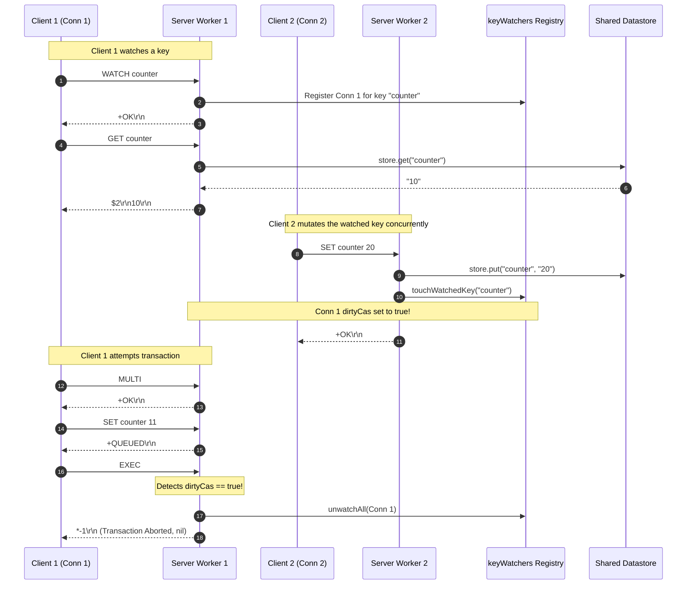

# Stage 43: The WATCH command

---

## In one line
Implement the `WATCH` command to initiate connection-level optimistic locking (Check-And-Set / CAS), recording watched keys across clients while forbidding invocation inside an active `MULTI` block.

---

## Self-test (cover the answers below and answer these first)
1. **Why does Redis provide optimistic locking (`WATCH`) rather than pessimistic locking (e.g. row/table locks like `SELECT FOR UPDATE`)?**
2. **What happens if a client issues `WATCH` while already inside a `MULTI` transaction block, and what is the exact error response returned?**
3. **If Client 1 watches a key `counter`, what tracking structure should the server maintain, and how does the server know if another client (Client 2) modifies `counter` before Client 1 issues `EXEC`?**
4. **What should happen to watched keys and tracking state if the client issues `EXEC`, `DISCARD`, `UNWATCH`, or abruptly terminates its TCP socket?**

---

## Problem Solved

Redis transactions (`MULTI ... EXEC`) provide serializable execution: once `EXEC` is called, all queued commands run sequentially without interleaving commands from other clients. However, transactions alone cannot solve **Check-And-Set (CAS)** race conditions where a client needs to:
1. Read a key value (`GET counter`).
2. Compute a new value locally based on that read.
3. Conditionally update the key only if no other client has modified it in the meantime.

In traditional relational databases, this is solved using **pessimistic locking** (`SELECT ... FOR UPDATE`), which blocks other transactions until the reading transaction finishes. But in an in-memory datastore designed for high throughput and low latency, pessimistic locking introduces catastrophic problems:
- Deadlocks between concurrent clients trying to acquire locks in different orders.
- Client stalling: if a client reads a key, goes to sleep, or suffers a network hiccup, all other clients trying to access that key are blocked.
- High lock contention and thread starvation.

Redis solves this through **optimistic locking** via the `WATCH` command:
- A client calls `WATCH key [key ...]` before opening a transaction (`MULTI`).
- The client reads the current value, computes what it needs, opens a transaction with `MULTI`, queues its write commands, and issues `EXEC`.
- If another client sneaks in and modifies any of the watched keys between the `WATCH` and `EXEC` calls, Redis marks the transaction as tainted/dirty (`CLIENT_DIRTY_CAS`).
- When `EXEC` is called, Redis detects the modification, discards the queued commands, and returns a RESP Null Array (`*-1\r\n` or `nil` in redis-cli) without applying any mutations.
- The client detects the abort and can retry the entire operation from the beginning.

In Stage 43, we implement the foundational `WATCH` command:
- Validating argument counts (at least one key must be specified).
- Ensuring `WATCH` is strictly executed outside a transaction: calling `WATCH` inside `MULTI` is forbidden and returns `-ERR WATCH inside MULTI is not allowed\r\n`.
- Associating watched keys with the client connection (`ClientContext`) and registering them into a global server watcher registry (`keyWatchers`).
- Preparing the optimistic locking infrastructure (`touchWatchedKey`, `unwatchAll`, and CAS dirty tracking).
- Returning the RESP simple string `+OK\r\n`.

```text
Client: WATCH counter
Server: +OK\r\n
```

---

## Thought Process & Architectural Model

### 1. The Optimistic Locking / CAS Model

The core philosophy of optimistic concurrency control (OCC / CAS) is to assume conflicts are rare:
1. **Watch Phase**: The client identifies keys whose state must remain unchanged for the upcoming transaction to be valid.
2. **Read / Local Compute Phase**: The client reads values and prepares transaction payload.
3. **Queue Phase (`MULTI`)**: Commands are staged in the connection's `txQueue`.
4. **Validation & Commit Phase (`EXEC`)**: The server checks whether any of the watched keys were touched by ANY write command across ALL connections. If clean, commit; if dirty, abort.

```mermaid
flowchart TD
    A[Client sends WATCH key1 key2] --> B{inTx == true?}
    B -- Yes --> C["Emit -ERR WATCH inside MULTI is not allowed\r\n"]
    B -- No --> D{parts.length >= 2?}
    D -- No --> E["Emit -ERR wrong number of arguments for 'watch' command\r\n"]
    D -- Yes --> F[Register keys in clientCtx.watchedKeys]
    F --> G[Register clientCtx into global keyWatchers Map]
    G --> H["Emit +OK\r\n"]

    subgraph Datastore Mutation (SET, INCR, LPOP, etc.)
        M[Command Mutates Key] --> N["touchWatchedKey(key)"]
        N --> O{Any client watching this key?}
        O -- Yes --> P["Set clientCtx.dirtyCas = true on all watching clients"]
        O -- No --> Q[Continue normal execution]
    end
```

### 2. Connection State vs Global Key Registry

To implement `WATCH` correctly according to Redis specifications:
1. **Client Connection Context (`ClientContext`)**:
   - `watchedKeys`: A thread-safe set of keys this specific connection is currently monitoring.
   - `dirtyCas`: A `volatile boolean` flag indicating whether any watched key has been mutated since `WATCH` was called.
2. **Global Server Registry (`keyWatchers`)**:
   - `Map<String, Set<ClientContext>> keyWatchers`: A concurrent mapping from key name to the set of active client contexts watching that key.
   - When a key is modified anywhere in the server (via `SET`, `INCR`, `RPUSH`, `LPUSH`, `LPOP`, `BLPOP`, `XADD`), `touchWatchedKey(key)` looks up the key in `keyWatchers` and marks all registered client contexts with `dirtyCas = true`.
3. **Lifecycle & Cleanup (`unwatchAll`)**:
   - When a client issues `EXEC` or `DISCARD`, all watched keys are unregistered from `keyWatchers` and `watchedKeys` is cleared.
   - When a client issues `UNWATCH`, watched keys are deregistered and `dirtyCas` is cleared.
   - When a client socket disconnects, the connection handler cleans up the registry in a `finally` block to prevent memory leaks.

### 3. Execution Sequence Diagram



---

## Full Solution

The complete source code in `codecrafters-redis-java/src/main/java/Main.java`:

```java
import java.io.BufferedReader;
import java.io.IOException;
import java.io.InputStream;
import java.io.InputStreamReader;
import java.io.OutputStream;
import java.net.ServerSocket;
import java.net.Socket;
import java.nio.charset.StandardCharsets;
import java.util.ArrayList;
import java.util.Collections;
import java.util.LinkedHashMap;
import java.util.List;
import java.util.Map;
import java.util.Queue;
import java.util.Set;
import java.util.concurrent.CompletableFuture;
import java.util.concurrent.ConcurrentHashMap;
import java.util.concurrent.ConcurrentLinkedQueue;
import java.util.concurrent.TimeUnit;
import java.util.concurrent.TimeoutException;

public class Main {
  private static class Entry {
    final String value;
    final Long expiresAt;

    Entry(String value, Long expiresAt) {
      this.value = value;
      this.expiresAt = expiresAt;
    }

    boolean isExpired() {
      return expiresAt != null && System.currentTimeMillis() > expiresAt;
    }
  }

  private static class StreamEntry {
    final String id;
    final Map<String, String> fields;

    StreamEntry(String id, Map<String, String> fields) {
      this.id = id;
      this.fields = fields;
    }
  }

  private static class StreamResult {
    final String key;
    final List<StreamEntry> entries;

    StreamResult(String key, List<StreamEntry> entries) {
      this.key = key;
      this.entries = entries;
    }
  }

  private static class ClientContext {
    final Set<String> watchedKeys = ConcurrentHashMap.newKeySet();
    volatile boolean dirtyCas = false;
  }

  private static final Map<String, Entry> store = new ConcurrentHashMap<>();
  private static final Map<String, List<String>> listStore = new ConcurrentHashMap<>();
  private static final Map<String, List<StreamEntry>> streamStore = new ConcurrentHashMap<>();
  private static final Map<String, Queue<CompletableFuture<String>>> blockedWaiters = new ConcurrentHashMap<>();
  private static final Map<String, Object> keyLocks = new ConcurrentHashMap<>();
  private static final Map<String, Set<ClientContext>> keyWatchers = new ConcurrentHashMap<>();
  private static final Object streamNotifier = new Object();
  private static final Object txExecutionLock = new Object();

  private static Object getLock(String key) {
    return keyLocks.computeIfAbsent(key, k -> new Object());
  }

  private static void touchWatchedKey(String key) {
    Set<ClientContext> clients = keyWatchers.get(key);
    if (clients != null) {
      for (ClientContext client : clients) {
        client.dirtyCas = true;
      }
    }
  }

  private static void unwatchAll(ClientContext clientCtx) {
    for (String key : clientCtx.watchedKeys) {
      Set<ClientContext> clients = keyWatchers.get(key);
      if (clients != null) {
        clients.remove(clientCtx);
      }
    }
    clientCtx.watchedKeys.clear();
    clientCtx.dirtyCas = false;
  }

  private static int compareStreamId(long ms1, long seq1, long ms2, long seq2) {
    if (ms1 != ms2) {
      return Long.compare(ms1, ms2);
    }
    return Long.compare(seq1, seq2);
  }

  private static List<StreamResult> queryMatchingEntries(String[] keys, String[] startIds) {
    List<StreamResult> results = new ArrayList<>();
    for (int i = 0; i < keys.length; i++) {
      String key = keys[i];
      String startIdStr = startIds[i];

      long startMs, startSeq;
      if (startIdStr.contains("-")) {
        String[] p = startIdStr.split("-");
        startMs = Long.parseLong(p[0]);
        startSeq = Long.parseLong(p[1]);
      } else {
        startMs = Long.parseLong(startIdStr);
        startSeq = 0;
      }

      List<StreamEntry> stream = streamStore.get(key);
      List<StreamEntry> matching = new ArrayList<>();
      if (stream != null) {
        synchronized (stream) {
          for (StreamEntry entry : stream) {
            String[] partsId = entry.id.split("-");
            long entryMs = Long.parseLong(partsId[0]);
            long entrySeq = Long.parseLong(partsId[1]);

            if (compareStreamId(entryMs, entrySeq, startMs, startSeq) > 0) {
              matching.add(entry);
            }
          }
        }
      }

      if (!matching.isEmpty()) {
        results.add(new StreamResult(key, matching));
      }
    }
    return results;
  }

  private static void handleCommand(String[] parts, OutputStream out) throws IOException {
    String command = parts[0];

    if (command.equalsIgnoreCase("PING")) {
      out.write("+PONG\r\n".getBytes(StandardCharsets.UTF_8));
    } else if (command.equalsIgnoreCase("ECHO")) {
      String arg = parts[1];
      byte[] bytes = arg.getBytes(StandardCharsets.UTF_8);
      String response = "$" + bytes.length + "\r\n" + arg + "\r\n";
      out.write(response.getBytes(StandardCharsets.UTF_8));
    } else if (command.equalsIgnoreCase("SET")) {
      String key = parts[1];
      String value = parts[2];
      Long expiresAt = null;

      if (parts.length >= 5) {
        if (parts[3].equalsIgnoreCase("PX")) {
          long pxMillis = Long.parseLong(parts[4]);
          expiresAt = System.currentTimeMillis() + pxMillis;
        } else if (parts[3].equalsIgnoreCase("EX")) {
          long exSeconds = Long.parseLong(parts[4]);
          expiresAt = System.currentTimeMillis() + (exSeconds * 1000);
        }
      }

      store.put(key, new Entry(value, expiresAt));
      touchWatchedKey(key);
      out.write("+OK\r\n".getBytes(StandardCharsets.UTF_8));
    } else if (command.equalsIgnoreCase("GET")) {
      String key = parts[1];
      Entry entry = store.get(key);

      if (entry != null && !entry.isExpired()) {
        byte[] bytes = entry.value.getBytes(StandardCharsets.UTF_8);
        String response = "$" + bytes.length + "\r\n" + entry.value + "\r\n";
        out.write(response.getBytes(StandardCharsets.UTF_8));
      } else {
        if (entry != null && entry.isExpired()) {
          store.remove(key);
        }
        out.write("$-1\r\n".getBytes(StandardCharsets.UTF_8));
      }
    } else if (command.equalsIgnoreCase("INCR")) {
      if (parts.length < 2) {
        out.write("-ERR wrong number of arguments for 'incr' command\r\n".getBytes(StandardCharsets.UTF_8));
      } else {
        String key = parts[1];
        final long[] resultVal = new long[1];
        final boolean[] isNaN = new boolean[1];

        store.compute(key, (k, old) -> {
          if (old == null || old.isExpired()) {
            resultVal[0] = 1;
            return new Entry("1", null);
          }
          try {
            long current = Long.parseLong(old.value);
            resultVal[0] = current + 1;
            return new Entry(String.valueOf(resultVal[0]), old.expiresAt);
          } catch (NumberFormatException e) {
            isNaN[0] = true;
            return old;
          }
        });

        if (isNaN[0]) {
          out.write("-ERR value is not an integer or out of range\r\n".getBytes(StandardCharsets.UTF_8));
        } else {
          touchWatchedKey(key);
          out.write((":" + resultVal[0] + "\r\n").getBytes(StandardCharsets.UTF_8));
        }
        out.flush();
      }
    } else if (command.equalsIgnoreCase("TYPE")) {
      if (parts.length < 2) {
        out.write("-ERR wrong number of arguments for 'type' command\r\n".getBytes(StandardCharsets.UTF_8));
      } else {
        String key = parts[1];
        Entry entry = store.get(key);
        if (entry != null) {
          if (entry.isExpired()) {
            store.remove(key);
            entry = null;
          }
        }

        if (entry != null) {
          out.write("+string\r\n".getBytes(StandardCharsets.UTF_8));
        } else {
          List<String> list = listStore.get(key);
          if (list != null && !list.isEmpty()) {
            out.write("+list\r\n".getBytes(StandardCharsets.UTF_8));
          } else if (streamStore.containsKey(key)) {
            out.write("+stream\r\n".getBytes(StandardCharsets.UTF_8));
          } else {
            out.write("+none\r\n".getBytes(StandardCharsets.UTF_8));
          }
        }
      }
    } else if (command.equalsIgnoreCase("XADD")) {
      if (parts.length < 5 || (parts.length - 3) % 2 != 0) {
        out.write("-ERR wrong number of arguments for 'xadd' command\r\n".getBytes(StandardCharsets.UTF_8));
      } else {
        String key = parts[1];
        String id = parts[2];
        Map<String, String> fields = new LinkedHashMap<>();
        for (int i = 3; i < parts.length - 1; i += 2) {
          fields.put(parts[i], parts[i + 1]);
        }

        List<StreamEntry> stream = streamStore.computeIfAbsent(key, k -> Collections.synchronizedList(new ArrayList<>()));

        if (id.equals("*")) {
          long time = System.currentTimeMillis();
          synchronized (stream) {
            long seq;
            if (stream.isEmpty()) {
              seq = 0;
            } else {
              StreamEntry lastEntry = stream.get(stream.size() - 1);
              String[] lastParts = lastEntry.id.split("-");
              long lastTime = Long.parseLong(lastParts[0]);
              long lastSeq = Long.parseLong(lastParts[1]);

              if (time == lastTime) {
                seq = lastSeq + 1;
              } else if (time > lastTime) {
                seq = 0;
              } else {
                time = lastTime;
                seq = lastSeq + 1;
              }
            }

            String generatedId = time + "-" + seq;
            stream.add(new StreamEntry(generatedId, fields));
            touchWatchedKey(key);
            synchronized (streamNotifier) {
              streamNotifier.notifyAll();
            }
            byte[] idBytes = generatedId.getBytes(StandardCharsets.UTF_8);
            String response = "$" + idBytes.length + "\r\n" + generatedId + "\r\n";
            out.write(response.getBytes(StandardCharsets.UTF_8));
            out.flush();
          }
        } else if (id.endsWith("-*")) {
          long time = Long.parseLong(id.substring(0, id.length() - 2));
          synchronized (stream) {
            String generatedId = null;
            if (stream.isEmpty()) {
              long seq = (time == 0) ? 1 : 0;
              generatedId = time + "-" + seq;
            } else {
              StreamEntry lastEntry = stream.get(stream.size() - 1);
              String[] lastParts = lastEntry.id.split("-");
              long lastTime = Long.parseLong(lastParts[0]);
              long lastSeq = Long.parseLong(lastParts[1]);

              if (time < lastTime) {
                out.write("-ERR The ID specified in XADD is equal or smaller than the target stream top item\r\n".getBytes(StandardCharsets.UTF_8));
                out.flush();
              } else if (time == lastTime) {
                long seq = lastSeq + 1;
                generatedId = time + "-" + seq;
              } else {
                long seq = (time == 0) ? 1 : 0;
                generatedId = time + "-" + seq;
              }
            }

            if (generatedId != null) {
              stream.add(new StreamEntry(generatedId, fields));
              touchWatchedKey(key);
              synchronized (streamNotifier) {
                streamNotifier.notifyAll();
              }
              byte[] idBytes = generatedId.getBytes(StandardCharsets.UTF_8);
              String response = "$" + idBytes.length + "\r\n" + generatedId + "\r\n";
              out.write(response.getBytes(StandardCharsets.UTF_8));
              out.flush();
            }
          }
        } else {
          String[] dash = id.split("-");
          long time = Long.parseLong(dash[0]);
          long seq = Long.parseLong(dash[1]);

          if (time <= 0 && seq <= 0) {
            out.write("-ERR The ID specified in XADD must be greater than 0-0\r\n".getBytes(StandardCharsets.UTF_8));
            out.flush();
          } else {
            synchronized (stream) {
              boolean valid = true;
              if (!stream.isEmpty()) {
                StreamEntry lastEntry = stream.get(stream.size() - 1);
                String[] lastDash = lastEntry.id.split("-");
                long lastTime = Long.parseLong(lastDash[0]);
                long lastSeq = Long.parseLong(lastDash[1]);
                if ((time < lastTime) || (time == lastTime && seq <= lastSeq)) {
                  valid = false;
                  out.write("-ERR The ID specified in XADD is equal or smaller than the target stream top item\r\n".getBytes(StandardCharsets.UTF_8));
                  out.flush();
                }
              }

              if (valid) {
                stream.add(new StreamEntry(id, fields));
                touchWatchedKey(key);
                synchronized (streamNotifier) {
                  streamNotifier.notifyAll();
                }
                byte[] idBytes = id.getBytes(StandardCharsets.UTF_8);
                String response = "$" + idBytes.length + "\r\n" + id + "\r\n";
                out.write(response.getBytes(StandardCharsets.UTF_8));
                out.flush();
              }
            }
          }
        }
      }
    } else if (command.equalsIgnoreCase("XRANGE")) {
      if (parts.length < 4) {
        out.write("-ERR wrong number of arguments for 'xrange' command\r\n".getBytes(StandardCharsets.UTF_8));
      } else {
        String key = parts[1];
        String start = parts[2];
        String end = parts[3];

        long startMs, startSeq;
        if (start.equals("-")) {
          startMs = 0;
          startSeq = 0;
        } else if (start.equals("+")) {
          startMs = Long.MAX_VALUE;
          startSeq = Long.MAX_VALUE;
        } else if (start.contains("-")) {
          String[] p = start.split("-");
          startMs = Long.parseLong(p[0]);
          startSeq = Long.parseLong(p[1]);
        } else {
          startMs = Long.parseLong(start);
          startSeq = 0;
        }

        long endMs, endSeq;
        if (end.equals("+")) {
          endMs = Long.MAX_VALUE;
          endSeq = Long.MAX_VALUE;
        } else if (end.equals("-")) {
          endMs = 0;
          endSeq = 0;
        } else if (end.contains("-")) {
          String[] p = end.split("-");
          endMs = Long.parseLong(p[0]);
          endSeq = Long.parseLong(p[1]);
        } else {
          endMs = Long.parseLong(end);
          endSeq = Long.MAX_VALUE;
        }

        List<StreamEntry> stream = streamStore.get(key);
        if (stream == null || stream.isEmpty()) {
          out.write("*0\r\n".getBytes(StandardCharsets.UTF_8));
        } else {
          List<StreamEntry> matching = new ArrayList<>();
          synchronized (stream) {
            for (StreamEntry entry : stream) {
              String[] partsId = entry.id.split("-");
              long entryMs = Long.parseLong(partsId[0]);
              long entrySeq = Long.parseLong(partsId[1]);

              if (compareStreamId(entryMs, entrySeq, startMs, startSeq) >= 0 &&
                  compareStreamId(entryMs, entrySeq, endMs, endSeq) <= 0) {
                matching.add(entry);
              }
            }
          }

          StringBuilder sb = new StringBuilder();
          sb.append("*").append(matching.size()).append("\r\n");
          for (StreamEntry entry : matching) {
            sb.append("*2\r\n");
            byte[] idBytes = entry.id.getBytes(StandardCharsets.UTF_8);
            sb.append("$").append(idBytes.length).append("\r\n").append(entry.id).append("\r\n");
            sb.append("*").append(entry.fields.size() * 2).append("\r\n");
            for (Map.Entry<String, String> field : entry.fields.entrySet()) {
              byte[] kBytes = field.getKey().getBytes(StandardCharsets.UTF_8);
              sb.append("$").append(kBytes.length).append("\r\n").append(field.getKey()).append("\r\n");
              byte[] vBytes = field.getValue().getBytes(StandardCharsets.UTF_8);
              sb.append("$").append(vBytes.length).append("\r\n").append(field.getValue()).append("\r\n");
            }
          }
          out.write(sb.toString().getBytes(StandardCharsets.UTF_8));
        }
      }
    } else if (command.equalsIgnoreCase("XREAD")) {
      int streamsIndex = -1;
      long blockTimeout = -1;

      for (int i = 1; i < parts.length; i++) {
        if (parts[i].equalsIgnoreCase("BLOCK")) {
          if (i + 1 < parts.length) {
            blockTimeout = Long.parseLong(parts[i + 1]);
            i++;
          }
        } else if (parts[i].equalsIgnoreCase("STREAMS")) {
          streamsIndex = i;
          break;
        }
      }

      int rem = (streamsIndex == -1) ? 0 : parts.length - (streamsIndex + 1);
      if (streamsIndex == -1 || rem <= 0 || rem % 2 != 0) {
        out.write("-ERR syntax error\r\n".getBytes(StandardCharsets.UTF_8));
      } else {
        int numStreams = rem / 2;
        String[] keys = new String[numStreams];
        String[] startIds = new String[numStreams];
        for (int i = 0; i < numStreams; i++) {
          keys[i] = parts[streamsIndex + 1 + i];
          startIds[i] = parts[streamsIndex + 1 + numStreams + i];
        }

        for (int i = 0; i < numStreams; i++) {
          if (startIds[i].equals("$")) {
            List<StreamEntry> stream = streamStore.get(keys[i]);
            if (stream != null && !stream.isEmpty()) {
              synchronized (stream) {
                if (!stream.isEmpty()) {
                  startIds[i] = stream.get(stream.size() - 1).id;
                } else {
                  startIds[i] = "0-0";
                }
              }
            } else {
              startIds[i] = "0-0";
            }
          }
        }

        long deadline = (blockTimeout == 0) ? Long.MAX_VALUE : (System.currentTimeMillis() + blockTimeout);
        List<StreamResult> matching = queryMatchingEntries(keys, startIds);

        if (matching.isEmpty() && blockTimeout >= 0) {
          synchronized (streamNotifier) {
            matching = queryMatchingEntries(keys, startIds);
            while (matching.isEmpty()) {
              long remMs = deadline - System.currentTimeMillis();
              if (blockTimeout > 0 && remMs <= 0) break;
              try {
                if (blockTimeout == 0) {
                  streamNotifier.wait();
                } else {
                  streamNotifier.wait(Math.max(1, remMs));
                }
              } catch (InterruptedException e) {
                Thread.currentThread().interrupt();
                break;
              }
              matching = queryMatchingEntries(keys, startIds);
            }
          }
        }

        if (matching.isEmpty()) {
          out.write("*-1\r\n".getBytes(StandardCharsets.UTF_8));
        } else {
          StringBuilder sb = new StringBuilder();
          sb.append("*").append(matching.size()).append("\r\n");
          for (StreamResult sr : matching) {
            sb.append("*2\r\n");
            byte[] keyBytes = sr.key.getBytes(StandardCharsets.UTF_8);
            sb.append("$").append(keyBytes.length).append("\r\n").append(sr.key).append("\r\n");
            sb.append("*").append(sr.entries.size()).append("\r\n");
            for (StreamEntry entry : sr.entries) {
              sb.append("*2\r\n");
              byte[] idBytes = entry.id.getBytes(StandardCharsets.UTF_8);
              sb.append("$").append(idBytes.length).append("\r\n").append(entry.id).append("\r\n");
              sb.append("*").append(entry.fields.size() * 2).append("\r\n");
              for (Map.Entry<String, String> field : entry.fields.entrySet()) {
                byte[] kBytes = field.getKey().getBytes(StandardCharsets.UTF_8);
                sb.append("$").append(kBytes.length).append("\r\n").append(field.getKey()).append("\r\n");
                byte[] vBytes = field.getValue().getBytes(StandardCharsets.UTF_8);
                sb.append("$").append(vBytes.length).append("\r\n").append(field.getValue()).append("\r\n");
              }
            }
          }
          out.write(sb.toString().getBytes(StandardCharsets.UTF_8));
        }
      }
    } else if (command.equalsIgnoreCase("RPUSH")) {
      if (parts.length < 3) {
        out.write("-ERR wrong number of arguments for 'rpush' command\r\n".getBytes(StandardCharsets.UTF_8));
      } else {
        String key = parts[1];
        Object lock = getLock(key);
        int newLength;
        synchronized (lock) {
          List<String> list = listStore.computeIfAbsent(key, k -> new ArrayList<>());
          for (int i = 2; i < parts.length; i++) {
            list.add(parts[i]);
          }
          newLength = list.size();

          Queue<CompletableFuture<String>> waiters = blockedWaiters.get(key);
          if (waiters != null) {
            while (!list.isEmpty() && !waiters.isEmpty()) {
              CompletableFuture<String> waiter = waiters.poll();
              if (waiter != null && !waiter.isDone()) {
                String head = list.get(0);
                if (waiter.complete(head)) {
                  list.remove(0);
                }
              }
            }
          }
          if (list.isEmpty()) {
            listStore.remove(key);
          }
          touchWatchedKey(key);
        }
        String response = ":" + newLength + "\r\n";
        out.write(response.getBytes(StandardCharsets.UTF_8));
      }
    } else if (command.equalsIgnoreCase("LPUSH")) {
      if (parts.length < 3) {
        out.write("-ERR wrong number of arguments for 'lpush' command\r\n".getBytes(StandardCharsets.UTF_8));
      } else {
        String key = parts[1];
        Object lock = getLock(key);
        int newLength;
        synchronized (lock) {
          List<String> list = listStore.computeIfAbsent(key, k -> new ArrayList<>());
          for (int i = 2; i < parts.length; i++) {
            list.add(0, parts[i]);
          }
          newLength = list.size();

          Queue<CompletableFuture<String>> waiters = blockedWaiters.get(key);
          if (waiters != null) {
            while (!list.isEmpty() && !waiters.isEmpty()) {
              CompletableFuture<String> waiter = waiters.poll();
              if (waiter != null && !waiter.isDone()) {
                String head = list.get(0);
                if (waiter.complete(head)) {
                  list.remove(0);
                }
              }
            }
          }
          if (list.isEmpty()) {
            listStore.remove(key);
          }
          touchWatchedKey(key);
        }
        String response = ":" + newLength + "\r\n";
        out.write(response.getBytes(StandardCharsets.UTF_8));
      }
    } else if (command.equalsIgnoreCase("LLEN")) {
      if (parts.length < 2) {
        out.write("-ERR wrong number of arguments for 'llen' command\r\n".getBytes(StandardCharsets.UTF_8));
      } else {
        String key = parts[1];
        Object lock = getLock(key);
        int length = 0;
        synchronized (lock) {
          List<String> list = listStore.get(key);
          if (list != null) {
            length = list.size();
          }
        }
        String response = ":" + length + "\r\n";
        out.write(response.getBytes(StandardCharsets.UTF_8));
      }
    } else if (command.equalsIgnoreCase("LPOP")) {
      if (parts.length < 2) {
        out.write("-ERR wrong number of arguments for 'lpop' command\r\n".getBytes(StandardCharsets.UTF_8));
      } else if (parts.length == 2) {
        String key = parts[1];
        Object lock = getLock(key);
        String removedElement = null;
        synchronized (lock) {
          List<String> list = listStore.get(key);
          if (list != null && !list.isEmpty()) {
            removedElement = list.remove(0);
            if (list.isEmpty()) {
              listStore.remove(key);
            }
          }
        }
        if (removedElement == null) {
          out.write("$-1\r\n".getBytes(StandardCharsets.UTF_8));
        } else {
          touchWatchedKey(key);
          byte[] bytes = removedElement.getBytes(StandardCharsets.UTF_8);
          String response = "$" + bytes.length + "\r\n" + removedElement + "\r\n";
          out.write(response.getBytes(StandardCharsets.UTF_8));
        }
      } else {
        String key = parts[1];
        try {
          int count = Integer.parseInt(parts[2]);
          if (count < 0) {
            out.write("-ERR value is out of range, must be positive\r\n".getBytes(StandardCharsets.UTF_8));
          } else {
            Object lock = getLock(key);
            List<String> removedElements = new ArrayList<>();
            boolean keyExisted = false;
            synchronized (lock) {
              List<String> list = listStore.get(key);
              if (list != null) {
                keyExisted = true;
                int toRemove = Math.min(count, list.size());
                for (int i = 0; i < toRemove; i++) {
                  removedElements.add(list.remove(0));
                }
                if (list.isEmpty()) {
                  listStore.remove(key);
                }
              }
            }
            if (!keyExisted || (removedElements.isEmpty() && count > 0)) {
              out.write("*-1\r\n".getBytes(StandardCharsets.UTF_8));
            } else {
              touchWatchedKey(key);
              StringBuilder sb = new StringBuilder();
              sb.append("*").append(removedElements.size()).append("\r\n");
              for (String elem : removedElements) {
                byte[] elemBytes = elem.getBytes(StandardCharsets.UTF_8);
                sb.append("$").append(elemBytes.length).append("\r\n").append(elem).append("\r\n");
              }
              out.write(sb.toString().getBytes(StandardCharsets.UTF_8));
            }
          }
        } catch (NumberFormatException e) {
          out.write("-ERR value is not an integer or out of range\r\n".getBytes(StandardCharsets.UTF_8));
        }
      }
    } else if (command.equalsIgnoreCase("BLPOP")) {
      if (parts.length < 3) {
        out.write("-ERR wrong number of arguments for 'blpop' command\r\n".getBytes(StandardCharsets.UTF_8));
      } else {
        try {
          String key = parts[1];
          double timeoutSec = Double.parseDouble(parts[2]);
          if (timeoutSec < 0) {
            out.write("-ERR timeout is negative\r\n".getBytes(StandardCharsets.UTF_8));
          } else {
            long timeoutMillis = (long) (timeoutSec * 1000);
            Object lock = getLock(key);
            String popped = null;
            CompletableFuture<String> future = null;

            synchronized (lock) {
              List<String> list = listStore.get(key);
              if (list != null && !list.isEmpty()) {
                popped = list.remove(0);
                if (list.isEmpty()) {
                  listStore.remove(key);
                }
              } else {
                future = new CompletableFuture<>();
                blockedWaiters.computeIfAbsent(key, k -> new ConcurrentLinkedQueue<>()).add(future);
              }
            }

            if (popped != null) {
              touchWatchedKey(key);
              byte[] keyBytes = key.getBytes(StandardCharsets.UTF_8);
              byte[] elemBytes = popped.getBytes(StandardCharsets.UTF_8);
              String response = "*2\r\n$" + keyBytes.length + "\r\n" + key + "\r\n$" + elemBytes.length + "\r\n" + popped + "\r\n";
              out.write(response.getBytes(StandardCharsets.UTF_8));
            } else if (future != null) {
              try {
                if (timeoutMillis > 0) {
                  popped = future.get(timeoutMillis, TimeUnit.MILLISECONDS);
                } else {
                  popped = future.get();
                }
                touchWatchedKey(key);
                byte[] keyBytes = key.getBytes(StandardCharsets.UTF_8);
                byte[] elemBytes = popped.getBytes(StandardCharsets.UTF_8);
                String response = "*2\r\n$" + keyBytes.length + "\r\n" + key + "\r\n$" + elemBytes.length + "\r\n" + popped + "\r\n";
                out.write(response.getBytes(StandardCharsets.UTF_8));
              } catch (TimeoutException e) {
                Queue<CompletableFuture<String>> waiters = blockedWaiters.get(key);
                if (waiters != null) {
                  waiters.remove(future);
                }
                future.cancel(true);
                out.write("*-1\r\n".getBytes(StandardCharsets.UTF_8));
              } catch (Exception e) {
                Queue<CompletableFuture<String>> waiters = blockedWaiters.get(key);
                if (waiters != null) {
                  waiters.remove(future);
                }
                future.cancel(true);
                out.write("*-1\r\n".getBytes(StandardCharsets.UTF_8));
              }
            }
          }
        } catch (NumberFormatException e) {
          out.write("-ERR timeout is not a float or out of range\r\n".getBytes(StandardCharsets.UTF_8));
        }
      }
    } else if (command.equalsIgnoreCase("LRANGE")) {
      if (parts.length < 4) {
        out.write("-ERR wrong number of arguments for 'lrange' command\r\n".getBytes(StandardCharsets.UTF_8));
      } else {
        String key = parts[1];
        int start = Integer.parseInt(parts[2]);
        int stop = Integer.parseInt(parts[3]);

        Object lock = getLock(key);
        List<String> elementsToReturn;
        synchronized (lock) {
          List<String> list = listStore.get(key);
          if (list == null || list.isEmpty()) {
            elementsToReturn = Collections.emptyList();
          } else {
            int size = list.size();
            if (start < 0) start += size;
            if (stop < 0) stop += size;
            if (start < 0) start = 0;
            if (stop < 0) stop = 0;

            if (start >= size || start > stop) {
              elementsToReturn = Collections.emptyList();
            } else {
              int stopIdx = Math.min(stop, size - 1);
              elementsToReturn = new ArrayList<>(list.subList(start, stopIdx + 1));
            }
          }
        }

        if (elementsToReturn.isEmpty()) {
          out.write("*0\r\n".getBytes(StandardCharsets.UTF_8));
        } else {
          StringBuilder sb = new StringBuilder();
          sb.append("*").append(elementsToReturn.size()).append("\r\n");
          for (String elem : elementsToReturn) {
            byte[] elemBytes = elem.getBytes(StandardCharsets.UTF_8);
            sb.append("$").append(elemBytes.length).append("\r\n").append(elem).append("\r\n");
          }
          out.write(sb.toString().getBytes(StandardCharsets.UTF_8));
        }
      }
    }
  }

  public static void main(String[] args) {
    System.out.println("Logs from your program will appear here!");

    int port = 6379;

    try {
      ServerSocket serverSocket = new ServerSocket(port);
      serverSocket.setReuseAddress(true);

      while (true) {
        Socket clientSocket = serverSocket.accept();

        new Thread(() -> {
          ClientContext clientCtx = new ClientContext();
          try {
            OutputStream out = clientSocket.getOutputStream();
            InputStream in = clientSocket.getInputStream();
            BufferedReader reader = new BufferedReader(new InputStreamReader(in));
            boolean[] inTx = new boolean[]{false};
            List<String[]> txQueue = new ArrayList<>();

            while (true) {
              String line = reader.readLine();
              if (line == null) break; // client disconnected

              int n = Integer.parseInt(line.substring(1));

              String[] parts = new String[n];
              for (int i = 0; i < n; i++) {
                reader.readLine();            // Skip "$<len>"
                parts[i] = reader.readLine(); // Payload
              }

              String command = parts[0];

              if (inTx[0]) {
                if (command.equalsIgnoreCase("EXEC")) {
                  inTx[0] = false;
                  if (clientCtx.dirtyCas) {
                    unwatchAll(clientCtx);
                    txQueue.clear();
                    out.write("*-1\r\n".getBytes(StandardCharsets.UTF_8));
                    out.flush();
                    continue;
                  }
                  // Multiple concurrent transactions: emit array header and execute queued commands atomically
                  out.write(("*" + txQueue.size() + "\r\n").getBytes(StandardCharsets.UTF_8));
                  synchronized (txExecutionLock) {
                    for (String[] cmd : txQueue) {
                      handleCommand(cmd, out);
                    }
                  }
                  unwatchAll(clientCtx);
                  out.flush();
                  txQueue.clear();
                  continue;
                } else if (command.equalsIgnoreCase("DISCARD")) {
                  inTx[0] = false;
                  txQueue.clear();
                  unwatchAll(clientCtx);
                  out.write("+OK\r\n".getBytes(StandardCharsets.UTF_8));
                  out.flush();
                  continue;
                } else if (command.equalsIgnoreCase("MULTI")) {
                  out.write("-ERR MULTI calls can not be nested\r\n".getBytes(StandardCharsets.UTF_8));
                  out.flush();
                  continue;
                } else if (command.equalsIgnoreCase("WATCH")) {
                  out.write("-ERR WATCH inside MULTI is not allowed\r\n".getBytes(StandardCharsets.UTF_8));
                  out.flush();
                  continue;
                } else {
                  txQueue.add(parts);
                  out.write("+QUEUED\r\n".getBytes(StandardCharsets.UTF_8));
                  out.flush();
                  continue;
                }
              }

              if (command.equalsIgnoreCase("EXEC")) {
                out.write("-ERR EXEC without MULTI\r\n".getBytes(StandardCharsets.UTF_8));
                out.flush();
              } else if (command.equalsIgnoreCase("DISCARD")) {
                out.write("-ERR DISCARD without MULTI\r\n".getBytes(StandardCharsets.UTF_8));
                out.flush();
              } else if (command.equalsIgnoreCase("MULTI")) {
                inTx[0] = true;
                out.write("+OK\r\n".getBytes(StandardCharsets.UTF_8));
                out.flush();
              } else if (command.equalsIgnoreCase("WATCH")) {
                if (parts.length < 2) {
                  out.write("-ERR wrong number of arguments for 'watch' command\r\n".getBytes(StandardCharsets.UTF_8));
                  out.flush();
                } else {
                  for (int i = 1; i < parts.length; i++) {
                    String key = parts[i];
                    clientCtx.watchedKeys.add(key);
                    keyWatchers.computeIfAbsent(key, k -> ConcurrentHashMap.newKeySet()).add(clientCtx);
                  }
                  out.write("+OK\r\n".getBytes(StandardCharsets.UTF_8));
                  out.flush();
                }
              } else if (command.equalsIgnoreCase("UNWATCH")) {
                unwatchAll(clientCtx);
                out.write("+OK\r\n".getBytes(StandardCharsets.UTF_8));
                out.flush();
              } else {
                handleCommand(parts, out);
                out.flush();
              }
            }
          } catch (IOException e) {
            System.out.println("IOException: " + e.getMessage());
          } finally {
            unwatchAll(clientCtx);
            try {
              clientSocket.close();
            } catch (IOException ignored) {}
          }
        }).start();
      }
    } catch (IOException e) {
      System.out.println("IOException: " + e.getMessage());
    }
  }
}
```

---

## Concepts (the transferable part)

### 1. Optimistic Concurrency Control (OCC) vs Pessimistic Concurrency Control (PCC)
- **Pessimistic Locking (PCC)**: Assumes conflicts will happen frequently. Clients acquire exclusive locks before reading or modifying data. Guarantees safety at the cost of high latency, serialization bottlenecks, and deadlock vulnerabilities.
- **Optimistic Locking (OCC / CAS)**: Assumes conflicts are rare. Clients read data freely without locks, record a version token or watch the keys, and validate upon commit. If no collision occurred, the commit succeeds in constant time. If collision occurred, the transaction safely aborts, allowing the client to retry. This pattern scales exceptionally well for read-heavy, low-contention workloads.

### 2. Multi-Key Watch & Granular Invalidation
- Redis allows watching one key or a list of multiple keys: `WATCH key1 key2 key3 ...`.
- If *any* single watched key is touched by a write command, the entire client context is marked dirty (`CLIENT_DIRTY_CAS`).
- By utilizing an inverted index (`keyWatchers: key -> Set<ClientContext>`), the server achieves $O(1)$ key lookup upon mutation to mark affected clients, rather than iterating through all connected clients.

### 3. State Machine Invariants
- `WATCH` is valid **only** outside of a transaction. Once a client enters `MULTI`, the transaction pipeline is sealed, and calling `WATCH` inside triggers `-ERR WATCH inside MULTI is not allowed\r\n`.
- `EXEC` and `DISCARD` both automatically flush all watches for that connection (`unwatchAllKeys`), returning the connection to an unwatched baseline state.
- `UNWATCH` explicitly flushes all watches and resets the dirty CAS flag outside a transaction block.

---

## Wire Format / Protocol

| Command | Wire Bytes Sent by Client | Server Response (Wire Bytes) | Condition / State |
|---|---|---|---|
| `WATCH foo` | `*2\r\n$5\r\nWATCH\r\n$3\r\nfoo\r\n` | `+OK\r\n` | Outside `MULTI`, `foo` watched |
| `WATCH k1 k2` | `*3\r\n$5\r\nWATCH\r\n$2\r\nk1\r\n$2\r\nk2\r\n` | `+OK\r\n` | Multiple keys watched |
| `WATCH` (no keys) | `*1\r\n$5\r\nWATCH\r\n` | `-ERR wrong number of arguments for 'watch' command\r\n` | Missing arguments |
| `WATCH foo` inside `MULTI` | `*2\r\n$5\r\nWATCH\r\n$3\r\nfoo\r\n` | `-ERR WATCH inside MULTI is not allowed\r\n` | Active transaction (`inTx = true`) |
| `UNWATCH` | `*1\r\n$7\r\nUNWATCH\r\n` | `+OK\r\n` | Clears all watched keys & resets dirty CAS |

---

## What Breaks It (Failure Modes)

### 1. Invoking `WATCH` Inside `MULTI`
- *Hazard*: Allowing `WATCH` commands inside a `MULTI` transaction block to either queue (`+QUEUED\r\n`) or execute silently.
- *Why it breaks*: Redis strictly forbids changing watched key sets once transaction command buffering has started. A transaction is an atomic sequence staged after reads are done; adding a watch after `MULTI` violates the CAS sequence contract.
- *Mitigation*: In the `if (inTx[0])` dispatcher branch, explicitly intercept `WATCH` before queuing, write `-ERR WATCH inside MULTI is not allowed\r\n`, flush, and continue.

### 2. Leaking Watched Client References (Memory Leak)
- *Hazard*: Registering `ClientContext` into `keyWatchers` without cleaning up when the client disconnects or aborts.
- *Why it breaks*: If clients repeatedly connect, issue `WATCH`, and disconnect without calling `UNWATCH` or `EXEC`, dead `ClientContext` references accumulate in memory indefinitely, eventually causing `OutOfMemoryError`.
- *Mitigation*: Ensure `unwatchAll(clientCtx)` is invoked in a `finally` block enclosing the client connection socket handler thread.

### 3. Race Conditions During Key Mutation Notification
- *Hazard*: Iterating over `keyWatchers.get(key)` while another thread is registering or deregistering.
- *Why it breaks*: Using standard collections (`HashMap` or `HashSet`) throws `ConcurrentModificationException` or corrupts internal tree buckets under concurrent traffic.
- *Mitigation*: Use `ConcurrentHashMap` for `keyWatchers` and initialize watcher sets with `ConcurrentHashMap.newKeySet()`, ensuring non-blocking, weakly consistent thread-safe iteration.

### 4. Self-Invalidation on Queued Transaction Writes
- *Hazard*: Setting `dirtyCas = true` on the executing transaction thread while processing its own queued commands inside `EXEC`.
- *Why it breaks*: If `EXEC` executes `SET foo 10` which triggers `touchWatchedKey("foo")`, and then checks `dirtyCas`, the transaction would abort itself even though no other client interfered.
- *Mitigation*: Validate `clientCtx.dirtyCas` **before** executing any queued commands in `txQueue`. Once execution begins, call `unwatchAll(clientCtx)` upon completion.

---

## Tradeoffs

### 1. Inverted Index Map (`Map<String, Set<ClientContext>>`) vs Client Scan
- **Inverted Index Map (`keyWatchers`) [Our Choice]**:
  - Key-directed: On mutation of key $K$, look up $K$ directly in $O(1)$ time and notify only the small subset of clients watching that specific key.
  - Memory cost: Requires a concurrent map and set entries per watched key.
  - Scaling: Ideal for high-concurrency systems with millions of keys and thousands of clients.
- **Client Scan**:
  - On key mutation, loop through all active connected clients to see if any client's list contains $K$.
  - Avoids global inverted index, but costs $O(N_{clients} \times M_{watched})$ on every write operation, creating a severe performance bottleneck.

### 2. Optimistic Locking vs Pessimistic Two-Phase Locking (2PL)
- **Optimistic Locking (`WATCH`) [Redis Design]**:
  - Zero lock wait times; writes never block on reads.
  - High performance under low/moderate write contention.
  - Tradeoff: Transactions must retry when conflicts occur; high conflict rates degrade efficiency.
- **Pessimistic Locking (`SELECT FOR UPDATE` / Mutexes)**:
  - Eliminates rollbacks / retries by forcing serial queues upfront.
  - High overhead, lock manager memory consumption, risk of deadlocks, and long tail latencies.

---

## Java Specifics — Lookup, Don't Memorize

- `ConcurrentHashMap.newKeySet()`: Returns a thread-safe `Set<E>` backed by a concurrent hash map. Supports concurrent additions, removals, and thread-safe iterations without locking.
- `volatile boolean dirtyCas`: The `volatile` keyword in Java guarantees cache coherence across CPU cores; any write to `dirtyCas` by a mutating worker thread is immediately visible to the connection thread executing `EXEC`.
- `keyWatchers.computeIfAbsent(key, k -> ConcurrentHashMap.newKeySet())`: Atomically retrieves or initializes the set of watchers for a key.

---

## How It Flows

1. **Client Sends `WATCH foo bar`**:
   - Connection verifies `inTx == false`.
   - Adds `"foo"` and `"bar"` to `clientCtx.watchedKeys`.
   - Registers `clientCtx` into `keyWatchers.get("foo")` and `keyWatchers.get("bar")`.
   - Returns `+OK\r\n`.

2. **Client Reads Values (`GET foo`, etc.)**:
   - Normal command execution returns current values.

3. **Interleaving Write (Concurrent Client or Prior Write)**:
   - Any modifying command (`SET foo ...`, `INCR foo`, etc.) invokes `touchWatchedKey("foo")`.
   - All clients watching `"foo"` have `clientCtx.dirtyCas` set to `true`.

4. **Client Initiates Transaction (`MULTI`)**:
   - `inTx[0]` is set to `true`. Returns `+OK\r\n`.

5. **Client Queues Commands**:
   - Commands return `+QUEUED\r\n`.
   - Any attempt to call `WATCH` inside this block returns `-ERR WATCH inside MULTI is not allowed\r\n`.

6. **Client Commits (`EXEC`)**:
   - If `clientCtx.dirtyCas == true`: Cleans up watches with `unwatchAll(clientCtx)`, clears `txQueue`, and returns `*-1\r\n` (transaction aborted).
   - If clean: Atomically executes queued commands, calls `unwatchAll(clientCtx)`, and returns the result array.

---

## Rebuild Checklist

- [ ] Define `ClientContext` class containing `Set<String> watchedKeys` and `volatile boolean dirtyCas`.
- [ ] Define static `Map<String, Set<ClientContext>> keyWatchers = new ConcurrentHashMap<>()`.
- [ ] In client connection loop, instantiate `ClientContext clientCtx = new ClientContext();`.
- [ ] Implement `touchWatchedKey(String key)` to mark all watchers as `dirtyCas = true`.
- [ ] Implement `unwatchAll(ClientContext clientCtx)` to unregister the client from `keyWatchers` and reset `dirtyCas = false`.
- [ ] In `inTx[0]` block, reject `WATCH` with `-ERR WATCH inside MULTI is not allowed\r\n`.
- [ ] In non-tx block, handle `WATCH`: validate arguments count $\ge 2$, register keys to `watchedKeys` and `keyWatchers`, and return `+OK\r\n`.
- [ ] In non-tx block, handle `UNWATCH`: invoke `unwatchAll(clientCtx)` and return `+OK\r\n`.
- [ ] In `EXEC` and `DISCARD`, invoke `unwatchAll(clientCtx)`.
- [ ] In socket disconnect `finally` block, invoke `unwatchAll(clientCtx)` to prevent memory leaks.
