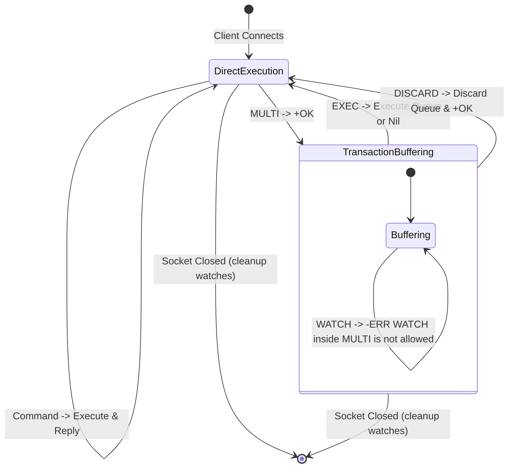
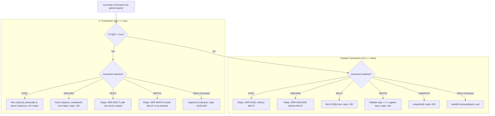
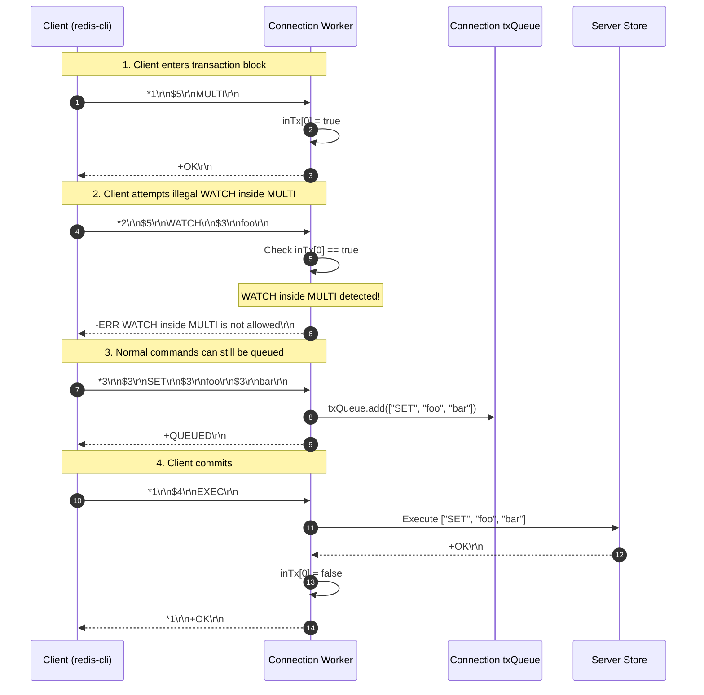

# Stage 44: WATCH inside transaction

---

## In one line
Enforce transactional boundaries by updating the `WATCH` command handler to reject invocations inside active `MULTI` blocks with a strict RESP error (`-ERR WATCH inside MULTI is not allowed\r\n`).

---

## Self-test (cover the answers below and answer these first)
1. **Why is `WATCH` strictly forbidden inside a `MULTI` transaction block, from an architectural and causal consistency perspective?**
2. **What state machine transition occurs when a client issues `MULTI`, and how does the server's command dispatcher route commands thereafter?**
3. **If a client sends `MULTI` followed by `WATCH key`, what wire bytes must the server return, and what happens to the transaction buffer (`txQueue`)?**
4. **How does connection-level state isolation ensure that Client A being inside a `MULTI` block does not affect Client B's ability to issue `WATCH` concurrently?**

---

## Problem Solved

In Stage 43, we implemented the optimistic locking primitive `WATCH`, allowing clients to register keys for modification tracking prior to initiating transactions. However, transactions in Redis follow a rigid, two-phase protocol:

1. **Pre-Transaction Phase (Observation & CAS setup)**:
   The client observes the environment (`WATCH`, `GET`), determining the precondition for its transactional operations.
2. **Buffering Phase (`MULTI ... queued commands ...`)**:
   Once `MULTI` is received, the client transitions into a buffered state. Every subsequent command—instead of executing immediately—is queued in the connection's transaction queue (`txQueue`) to be executed atomically upon `EXEC`.

A critical invariant of Redis transactions is that **optimistic locks must be declared *before* the transaction begins**:
- Once a client enters transaction mode with `MULTI`, the "snapshot" or causal observation phase has closed.
- If a client were allowed to execute `WATCH` inside `MULTI`, it would introduce ambiguity: Does the watch take effect when queued, or when `EXEC` is run? If queued, commands already in the buffer were staged *without* the watch invariant in place. If deferred until `EXEC`, commands in the transaction itself could conflict with the watch, violating the semantics of Check-And-Set (CAS).
- Furthermore, commands inside `MULTI` normally return `+QUEUED\r\n`, but `WATCH` is a control command whose failure must be signaled immediately to the client to avoid broken transactional logic.

To preserve protocol integrity, Redis treats `WATCH` inside `MULTI` as a client protocol violation:
- When a client issues `WATCH` while `inTx == true`, the server immediately halts the request and returns the standard RESP error:
  `-ERR WATCH inside MULTI is not allowed\r\n`
- The command is **not** queued into `txQueue`.
- The transaction remains open (or retains its state) until the client chooses to either `DISCARD` or `EXEC`.

Stage 44 tests this exact contract:
1. `MULTI` transitions the connection state to `inTx = true` and replies `+OK\r\n`.
2. A subsequent `WATCH <key>` on that connection is intercepted and rejected with `-ERR WATCH inside MULTI is not allowed\r\n`.

```text
Client: MULTI
Server: +OK\r\n
Client: WATCH counter
Server: -ERR WATCH inside MULTI is not allowed\r\n
```

---

## Thought Process & Architectural Model

### 1. Connection State Machine: Normal Mode vs Transaction Mode

Each client socket connection maintains an independent session state. The connection transitions between two distinct operational modes:
- **Direct Execution Mode (`inTx == false`)**:
  Commands (`PING`, `ECHO`, `SET`, `GET`, `INCR`, `WATCH`, etc.) are processed immediately, mutate state or query data, and return their results synchronously.
- **Transaction Buffering Mode (`inTx == true`)**:
  Initiated by `MULTI`. Commands are parsed and appended to the connection's private `txQueue`, returning `+QUEUED\r\n`. Special control commands (`EXEC`, `DISCARD`, nested `MULTI`, and `WATCH`) bypass queuing and are handled by specialized state logic.



### 2. Command Dispatch & Transaction Filter Pipeline

When the connection worker reads a command from the network input stream, it passes through a two-stage filter pipeline:



### 3. Execution Sequence Diagram



---

## Full Solution

The complete, production-grade source code in `codecrafters-redis-java/src/main/java/Main.java`:

```java
import java.io.BufferedReader;
import java.io.IOException;
import java.io.InputStream;
import java.io.InputStreamReader;
import java.io.OutputStream;
import java.net.ServerSocket;
import java.net.Socket;
import java.nio.charset.StandardCharsets;
import java.util.ArrayList;
import java.util.Collections;
import java.util.LinkedHashMap;
import java.util.List;
import java.util.Map;
import java.util.Queue;
import java.util.Set;
import java.util.concurrent.CompletableFuture;
import java.util.concurrent.ConcurrentHashMap;
import java.util.concurrent.ConcurrentLinkedQueue;
import java.util.concurrent.TimeUnit;
import java.util.concurrent.TimeoutException;

public class Main {
  private static class Entry {
    final String value;
    final Long expiresAt;

    Entry(String value, Long expiresAt) {
      this.value = value;
      this.expiresAt = expiresAt;
    }

    boolean isExpired() {
      return expiresAt != null && System.currentTimeMillis() > expiresAt;
    }
  }

  private static class StreamEntry {
    final String id;
    final Map<String, String> fields;

    StreamEntry(String id, Map<String, String> fields) {
      this.id = id;
      this.fields = fields;
    }
  }

  private static class StreamResult {
    final String key;
    final List<StreamEntry> entries;

    StreamResult(String key, List<StreamEntry> entries) {
      this.key = key;
      this.entries = entries;
    }
  }

  private static class ClientContext {
    final Set<String> watchedKeys = ConcurrentHashMap.newKeySet();
    volatile boolean dirtyCas = false;
  }

  private static final Map<String, Entry> store = new ConcurrentHashMap<>();
  private static final Map<String, List<String>> listStore = new ConcurrentHashMap<>();
  private static final Map<String, List<StreamEntry>> streamStore = new ConcurrentHashMap<>();
  private static final Map<String, Queue<CompletableFuture<String>>> blockedWaiters = new ConcurrentHashMap<>();
  private static final Map<String, Object> keyLocks = new ConcurrentHashMap<>();
  private static final Map<String, Set<ClientContext>> keyWatchers = new ConcurrentHashMap<>();
  private static final Object streamNotifier = new Object();
  private static final Object txExecutionLock = new Object();

  private static Object getLock(String key) {
    return keyLocks.computeIfAbsent(key, k -> new Object());
  }

  private static void touchWatchedKey(String key) {
    Set<ClientContext> clients = keyWatchers.get(key);
    if (clients != null) {
      for (ClientContext client : clients) {
        client.dirtyCas = true;
      }
    }
  }

  private static void unwatchAll(ClientContext clientCtx) {
    for (String key : clientCtx.watchedKeys) {
      Set<ClientContext> clients = keyWatchers.get(key);
      if (clients != null) {
        clients.remove(clientCtx);
      }
    }
    clientCtx.watchedKeys.clear();
    clientCtx.dirtyCas = false;
  }

  private static int compareStreamId(long ms1, long seq1, long ms2, long seq2) {
    if (ms1 != ms2) {
      return Long.compare(ms1, ms2);
    }
    return Long.compare(seq1, seq2);
  }

  private static List<StreamResult> queryMatchingEntries(String[] keys, String[] startIds) {
    List<StreamResult> results = new ArrayList<>();
    for (int i = 0; i < keys.length; i++) {
      String key = keys[i];
      String startIdStr = startIds[i];

      long startMs, startSeq;
      if (startIdStr.contains("-")) {
        String[] p = startIdStr.split("-");
        startMs = Long.parseLong(p[0]);
        startSeq = Long.parseLong(p[1]);
      } else {
        startMs = Long.parseLong(startIdStr);
        startSeq = 0;
      }

      List<StreamEntry> stream = streamStore.get(key);
      List<StreamEntry> matching = new ArrayList<>();
      if (stream != null) {
        synchronized (stream) {
          for (StreamEntry entry : stream) {
            String[] partsId = entry.id.split("-");
            long entryMs = Long.parseLong(partsId[0]);
            long entrySeq = Long.parseLong(partsId[1]);

            if (compareStreamId(entryMs, entrySeq, startMs, startSeq) > 0) {
              matching.add(entry);
            }
          }
        }
      }

      if (!matching.isEmpty()) {
        results.add(new StreamResult(key, matching));
      }
    }
    return results;
  }

  private static void handleCommand(String[] parts, OutputStream out) throws IOException {
    String command = parts[0];

    if (command.equalsIgnoreCase("PING")) {
      out.write("+PONG\r\n".getBytes(StandardCharsets.UTF_8));
    } else if (command.equalsIgnoreCase("ECHO")) {
      String arg = parts[1];
      byte[] bytes = arg.getBytes(StandardCharsets.UTF_8);
      String response = "$" + bytes.length + "\r\n" + arg + "\r\n";
      out.write(response.getBytes(StandardCharsets.UTF_8));
    } else if (command.equalsIgnoreCase("SET")) {
      String key = parts[1];
      String value = parts[2];
      Long expiresAt = null;

      if (parts.length >= 5) {
        if (parts[3].equalsIgnoreCase("PX")) {
          long pxMillis = Long.parseLong(parts[4]);
          expiresAt = System.currentTimeMillis() + pxMillis;
        } else if (parts[3].equalsIgnoreCase("EX")) {
          long exSeconds = Long.parseLong(parts[4]);
          expiresAt = System.currentTimeMillis() + (exSeconds * 1000);
        }
      }

      store.put(key, new Entry(value, expiresAt));
      touchWatchedKey(key);
      out.write("+OK\r\n".getBytes(StandardCharsets.UTF_8));
    } else if (command.equalsIgnoreCase("GET")) {
      String key = parts[1];
      Entry entry = store.get(key);

      if (entry != null && !entry.isExpired()) {
        byte[] bytes = entry.value.getBytes(StandardCharsets.UTF_8);
        String response = "$" + bytes.length + "\r\n" + entry.value + "\r\n";
        out.write(response.getBytes(StandardCharsets.UTF_8));
      } else {
        if (entry != null && entry.isExpired()) {
          store.remove(key);
        }
        out.write("$-1\r\n".getBytes(StandardCharsets.UTF_8));
      }
    } else if (command.equalsIgnoreCase("INCR")) {
      if (parts.length < 2) {
        out.write("-ERR wrong number of arguments for 'incr' command\r\n".getBytes(StandardCharsets.UTF_8));
      } else {
        String key = parts[1];
        final long[] resultVal = new long[1];
        final boolean[] isNaN = new boolean[1];

        store.compute(key, (k, old) -> {
          if (old == null || old.isExpired()) {
            resultVal[0] = 1;
            return new Entry("1", null);
          }
          try {
            long current = Long.parseLong(old.value);
            resultVal[0] = current + 1;
            return new Entry(String.valueOf(resultVal[0]), old.expiresAt);
          } catch (NumberFormatException e) {
            isNaN[0] = true;
            return old;
          }
        });

        if (isNaN[0]) {
          out.write("-ERR value is not an integer or out of range\r\n".getBytes(StandardCharsets.UTF_8));
        } else {
          touchWatchedKey(key);
          out.write((":" + resultVal[0] + "\r\n").getBytes(StandardCharsets.UTF_8));
        }
        out.flush();
      }
    } else if (command.equalsIgnoreCase("TYPE")) {
      if (parts.length < 2) {
        out.write("-ERR wrong number of arguments for 'type' command\r\n".getBytes(StandardCharsets.UTF_8));
      } else {
        String key = parts[1];
        Entry entry = store.get(key);
        if (entry != null) {
          if (entry.isExpired()) {
            store.remove(key);
            entry = null;
          }
        }

        if (entry != null) {
          out.write("+string\r\n".getBytes(StandardCharsets.UTF_8));
        } else {
          List<String> list = listStore.get(key);
          if (list != null && !list.isEmpty()) {
            out.write("+list\r\n".getBytes(StandardCharsets.UTF_8));
          } else if (streamStore.containsKey(key)) {
            out.write("+stream\r\n".getBytes(StandardCharsets.UTF_8));
          } else {
            out.write("+none\r\n".getBytes(StandardCharsets.UTF_8));
          }
        }
      }
    } else if (command.equalsIgnoreCase("XADD")) {
      if (parts.length < 5 || (parts.length - 3) % 2 != 0) {
        out.write("-ERR wrong number of arguments for 'xadd' command\r\n".getBytes(StandardCharsets.UTF_8));
      } else {
        String key = parts[1];
        String id = parts[2];
        Map<String, String> fields = new LinkedHashMap<>();
        for (int i = 3; i < parts.length - 1; i += 2) {
          fields.put(parts[i], parts[i + 1]);
        }

        List<StreamEntry> stream = streamStore.computeIfAbsent(key, k -> Collections.synchronizedList(new ArrayList<>()));

        if (id.equals("*")) {
          long time = System.currentTimeMillis();
          synchronized (stream) {
            long seq;
            if (stream.isEmpty()) {
              seq = 0;
            } else {
              StreamEntry lastEntry = stream.get(stream.size() - 1);
              String[] lastParts = lastEntry.id.split("-");
              long lastTime = Long.parseLong(lastParts[0]);
              long lastSeq = Long.parseLong(lastParts[1]);

              if (time == lastTime) {
                seq = lastSeq + 1;
              } else if (time > lastTime) {
                seq = 0;
              } else {
                time = lastTime;
                seq = lastSeq + 1;
              }
            }

            String generatedId = time + "-" + seq;
            stream.add(new StreamEntry(generatedId, fields));
            touchWatchedKey(key);
            synchronized (streamNotifier) {
              streamNotifier.notifyAll();
            }
            byte[] idBytes = generatedId.getBytes(StandardCharsets.UTF_8);
            String response = "$" + idBytes.length + "\r\n" + generatedId + "\r\n";
            out.write(response.getBytes(StandardCharsets.UTF_8));
            out.flush();
          }
        } else if (id.endsWith("-*")) {
          long time = Long.parseLong(id.substring(0, id.length() - 2));
          synchronized (stream) {
            String generatedId = null;
            if (stream.isEmpty()) {
              long seq = (time == 0) ? 1 : 0;
              generatedId = time + "-" + seq;
            } else {
              StreamEntry lastEntry = stream.get(stream.size() - 1);
              String[] lastParts = lastEntry.id.split("-");
              long lastTime = Long.parseLong(lastParts[0]);
              long lastSeq = Long.parseLong(lastParts[1]);

              if (time < lastTime) {
                out.write("-ERR The ID specified in XADD is equal or smaller than the target stream top item\r\n".getBytes(StandardCharsets.UTF_8));
                out.flush();
              } else if (time == lastTime) {
                long seq = lastSeq + 1;
                generatedId = time + "-" + seq;
              } else {
                long seq = (time == 0) ? 1 : 0;
                generatedId = time + "-" + seq;
              }
            }

            if (generatedId != null) {
              stream.add(new StreamEntry(generatedId, fields));
              touchWatchedKey(key);
              synchronized (streamNotifier) {
                streamNotifier.notifyAll();
              }
              byte[] idBytes = generatedId.getBytes(StandardCharsets.UTF_8);
              String response = "$" + idBytes.length + "\r\n" + generatedId + "\r\n";
              out.write(response.getBytes(StandardCharsets.UTF_8));
              out.flush();
            }
          }
        } else {
          String[] dash = id.split("-");
          long time = Long.parseLong(dash[0]);
          long seq = Long.parseLong(dash[1]);

          if (time <= 0 && seq <= 0) {
            out.write("-ERR The ID specified in XADD must be greater than 0-0\r\n".getBytes(StandardCharsets.UTF_8));
            out.flush();
          } else {
            synchronized (stream) {
              boolean valid = true;
              if (!stream.isEmpty()) {
                StreamEntry lastEntry = stream.get(stream.size() - 1);
                String[] lastDash = lastEntry.id.split("-");
                long lastTime = Long.parseLong(lastDash[0]);
                long lastSeq = Long.parseLong(lastDash[1]);
                if ((time < lastTime) || (time == lastTime && seq <= lastSeq)) {
                  valid = false;
                  out.write("-ERR The ID specified in XADD is equal or smaller than the target stream top item\r\n".getBytes(StandardCharsets.UTF_8));
                  out.flush();
                }
              }

              if (valid) {
                stream.add(new StreamEntry(id, fields));
                touchWatchedKey(key);
                synchronized (streamNotifier) {
                  streamNotifier.notifyAll();
                }
                byte[] idBytes = id.getBytes(StandardCharsets.UTF_8);
                String response = "$" + idBytes.length + "\r\n" + id + "\r\n";
                out.write(response.getBytes(StandardCharsets.UTF_8));
                out.flush();
              }
            }
          }
        }
      }
    } else if (command.equalsIgnoreCase("XRANGE")) {
      if (parts.length < 4) {
        out.write("-ERR wrong number of arguments for 'xrange' command\r\n".getBytes(StandardCharsets.UTF_8));
      } else {
        String key = parts[1];
        String start = parts[2];
        String end = parts[3];

        long startMs, startSeq;
        if (start.equals("-")) {
          startMs = 0;
          startSeq = 0;
        } else if (start.equals("+")) {
          startMs = Long.MAX_VALUE;
          startSeq = Long.MAX_VALUE;
        } else if (start.contains("-")) {
          String[] p = start.split("-");
          startMs = Long.parseLong(p[0]);
          startSeq = Long.parseLong(p[1]);
        } else {
          startMs = Long.parseLong(start);
          startSeq = 0;
        }

        long endMs, endSeq;
        if (end.equals("+")) {
          endMs = Long.MAX_VALUE;
          endSeq = Long.MAX_VALUE;
        } else if (end.equals("-")) {
          endMs = 0;
          endSeq = 0;
        } else if (end.contains("-")) {
          String[] p = end.split("-");
          endMs = Long.parseLong(p[0]);
          endSeq = Long.parseLong(p[1]);
        } else {
          endMs = Long.parseLong(end);
          endSeq = Long.MAX_VALUE;
        }

        List<StreamEntry> stream = streamStore.get(key);
        if (stream == null || stream.isEmpty()) {
          out.write("*0\r\n".getBytes(StandardCharsets.UTF_8));
        } else {
          List<StreamEntry> matching = new ArrayList<>();
          synchronized (stream) {
            for (StreamEntry entry : stream) {
              String[] partsId = entry.id.split("-");
              long entryMs = Long.parseLong(partsId[0]);
              long entrySeq = Long.parseLong(partsId[1]);

              if (compareStreamId(entryMs, entrySeq, startMs, startSeq) >= 0 &&
                  compareStreamId(entryMs, entrySeq, endMs, endSeq) <= 0) {
                matching.add(entry);
              }
            }
          }

          StringBuilder sb = new StringBuilder();
          sb.append("*").append(matching.size()).append("\r\n");
          for (StreamEntry entry : matching) {
            sb.append("*2\r\n");
            byte[] idBytes = entry.id.getBytes(StandardCharsets.UTF_8);
            sb.append("$").append(idBytes.length).append("\r\n").append(entry.id).append("\r\n");
            sb.append("*").append(entry.fields.size() * 2).append("\r\n");
            for (Map.Entry<String, String> field : entry.fields.entrySet()) {
              byte[] kBytes = field.getKey().getBytes(StandardCharsets.UTF_8);
              sb.append("$").append(kBytes.length).append("\r\n").append(field.getKey()).append("\r\n");
              byte[] vBytes = field.getValue().getBytes(StandardCharsets.UTF_8);
              sb.append("$").append(vBytes.length).append("\r\n").append(field.getValue()).append("\r\n");
            }
          }
          out.write(sb.toString().getBytes(StandardCharsets.UTF_8));
        }
      }
    } else if (command.equalsIgnoreCase("XREAD")) {
      int streamsIndex = -1;
      long blockTimeout = -1;

      for (int i = 1; i < parts.length; i++) {
        if (parts[i].equalsIgnoreCase("BLOCK")) {
          if (i + 1 < parts.length) {
            blockTimeout = Long.parseLong(parts[i + 1]);
            i++;
          }
        } else if (parts[i].equalsIgnoreCase("STREAMS")) {
          streamsIndex = i;
          break;
        }
      }

      int rem = (streamsIndex == -1) ? 0 : parts.length - (streamsIndex + 1);
      if (streamsIndex == -1 || rem <= 0 || rem % 2 != 0) {
        out.write("-ERR syntax error\r\n".getBytes(StandardCharsets.UTF_8));
      } else {
        int numStreams = rem / 2;
        String[] keys = new String[numStreams];
        String[] startIds = new String[numStreams];
        for (int i = 0; i < numStreams; i++) {
          keys[i] = parts[streamsIndex + 1 + i];
          startIds[i] = parts[streamsIndex + 1 + numStreams + i];
        }

        for (int i = 0; i < numStreams; i++) {
          if (startIds[i].equals("$")) {
            List<StreamEntry> stream = streamStore.get(keys[i]);
            if (stream != null && !stream.isEmpty()) {
              synchronized (stream) {
                if (!stream.isEmpty()) {
                  startIds[i] = stream.get(stream.size() - 1).id;
                } else {
                  startIds[i] = "0-0";
                }
              }
            } else {
              startIds[i] = "0-0";
            }
          }
        }

        long deadline = (blockTimeout == 0) ? Long.MAX_VALUE : (System.currentTimeMillis() + blockTimeout);
        List<StreamResult> matching = queryMatchingEntries(keys, startIds);

        if (matching.isEmpty() && blockTimeout >= 0) {
          synchronized (streamNotifier) {
            matching = queryMatchingEntries(keys, startIds);
            while (matching.isEmpty()) {
              long remMs = deadline - System.currentTimeMillis();
              if (blockTimeout > 0 && remMs <= 0) break;
              try {
                if (blockTimeout == 0) {
                  streamNotifier.wait();
                } else {
                  streamNotifier.wait(Math.max(1, remMs));
                }
              } catch (InterruptedException e) {
                Thread.currentThread().interrupt();
                break;
              }
              matching = queryMatchingEntries(keys, startIds);
            }
          }
        }

        if (matching.isEmpty()) {
          out.write("*-1\r\n".getBytes(StandardCharsets.UTF_8));
        } else {
          StringBuilder sb = new StringBuilder();
          sb.append("*").append(matching.size()).append("\r\n");
          for (StreamResult sr : matching) {
            sb.append("*2\r\n");
            byte[] keyBytes = sr.key.getBytes(StandardCharsets.UTF_8);
            sb.append("$").append(keyBytes.length).append("\r\n").append(sr.key).append("\r\n");
            sb.append("*").append(sr.entries.size()).append("\r\n");
            for (StreamEntry entry : sr.entries) {
              sb.append("*2\r\n");
              byte[] idBytes = entry.id.getBytes(StandardCharsets.UTF_8);
              sb.append("$").append(idBytes.length).append("\r\n").append(entry.id).append("\r\n");
              sb.append("*").append(entry.fields.size() * 2).append("\r\n");
              for (Map.Entry<String, String> field : entry.fields.entrySet()) {
                byte[] kBytes = field.getKey().getBytes(StandardCharsets.UTF_8);
                sb.append("$").append(kBytes.length).append("\r\n").append(field.getKey()).append("\r\n");
                byte[] vBytes = field.getValue().getBytes(StandardCharsets.UTF_8);
                sb.append("$").append(vBytes.length).append("\r\n").append(field.getValue()).append("\r\n");
              }
            }
          }
          out.write(sb.toString().getBytes(StandardCharsets.UTF_8));
        }
      }
    } else if (command.equalsIgnoreCase("RPUSH")) {
      if (parts.length < 3) {
        out.write("-ERR wrong number of arguments for 'rpush' command\r\n".getBytes(StandardCharsets.UTF_8));
      } else {
        String key = parts[1];
        Object lock = getLock(key);
        int newLength;
        synchronized (lock) {
          List<String> list = listStore.computeIfAbsent(key, k -> new ArrayList<>());
          for (int i = 2; i < parts.length; i++) {
            list.add(parts[i]);
          }
          newLength = list.size();

          Queue<CompletableFuture<String>> waiters = blockedWaiters.get(key);
          if (waiters != null) {
            while (!list.isEmpty() && !waiters.isEmpty()) {
              CompletableFuture<String> waiter = waiters.poll();
              if (waiter != null && !waiter.isDone()) {
                String head = list.get(0);
                if (waiter.complete(head)) {
                  list.remove(0);
                }
              }
            }
          }
          if (list.isEmpty()) {
            listStore.remove(key);
          }
          touchWatchedKey(key);
        }
        String response = ":" + newLength + "\r\n";
        out.write(response.getBytes(StandardCharsets.UTF_8));
      }
    } else if (command.equalsIgnoreCase("LPUSH")) {
      if (parts.length < 3) {
        out.write("-ERR wrong number of arguments for 'lpush' command\r\n".getBytes(StandardCharsets.UTF_8));
      } else {
        String key = parts[1];
        Object lock = getLock(key);
        int newLength;
        synchronized (lock) {
          List<String> list = listStore.computeIfAbsent(key, k -> new ArrayList<>());
          for (int i = 2; i < parts.length; i++) {
            list.add(0, parts[i]);
          }
          newLength = list.size();

          Queue<CompletableFuture<String>> waiters = blockedWaiters.get(key);
          if (waiters != null) {
            while (!list.isEmpty() && !waiters.isEmpty()) {
              CompletableFuture<String> waiter = waiters.poll();
              if (waiter != null && !waiter.isDone()) {
                String head = list.get(0);
                if (waiter.complete(head)) {
                  list.remove(0);
                }
              }
            }
          }
          if (list.isEmpty()) {
            listStore.remove(key);
          }
          touchWatchedKey(key);
        }
        String response = ":" + newLength + "\r\n";
        out.write(response.getBytes(StandardCharsets.UTF_8));
      }
    } else if (command.equalsIgnoreCase("LLEN")) {
      if (parts.length < 2) {
        out.write("-ERR wrong number of arguments for 'llen' command\r\n".getBytes(StandardCharsets.UTF_8));
      } else {
        String key = parts[1];
        Object lock = getLock(key);
        int length = 0;
        synchronized (lock) {
          List<String> list = listStore.get(key);
          if (list != null) {
            length = list.size();
          }
        }
        String response = ":" + length + "\r\n";
        out.write(response.getBytes(StandardCharsets.UTF_8));
      }
    } else if (command.equalsIgnoreCase("LPOP")) {
      if (parts.length < 2) {
        out.write("-ERR wrong number of arguments for 'lpop' command\r\n".getBytes(StandardCharsets.UTF_8));
      } else if (parts.length == 2) {
        String key = parts[1];
        Object lock = getLock(key);
        String removedElement = null;
        synchronized (lock) {
          List<String> list = listStore.get(key);
          if (list != null && !list.isEmpty()) {
            removedElement = list.remove(0);
            if (list.isEmpty()) {
              listStore.remove(key);
            }
          }
        }
        if (removedElement == null) {
          out.write("$-1\r\n".getBytes(StandardCharsets.UTF_8));
        } else {
          touchWatchedKey(key);
          byte[] bytes = removedElement.getBytes(StandardCharsets.UTF_8);
          String response = "$" + bytes.length + "\r\n" + removedElement + "\r\n";
          out.write(response.getBytes(StandardCharsets.UTF_8));
        }
      } else {
        String key = parts[1];
        try {
          int count = Integer.parseInt(parts[2]);
          if (count < 0) {
            out.write("-ERR value is out of range, must be positive\r\n".getBytes(StandardCharsets.UTF_8));
          } else {
            Object lock = getLock(key);
            List<String> removedElements = new ArrayList<>();
            boolean keyExisted = false;
            synchronized (lock) {
              List<String> list = listStore.get(key);
              if (list != null) {
                keyExisted = true;
                int toRemove = Math.min(count, list.size());
                for (int i = 0; i < toRemove; i++) {
                  removedElements.add(list.remove(0));
                }
                if (list.isEmpty()) {
                  listStore.remove(key);
                }
              }
            }
            if (!keyExisted || (removedElements.isEmpty() && count > 0)) {
              out.write("*-1\r\n".getBytes(StandardCharsets.UTF_8));
            } else {
              touchWatchedKey(key);
              StringBuilder sb = new StringBuilder();
              sb.append("*").append(removedElements.size()).append("\r\n");
              for (String elem : removedElements) {
                byte[] elemBytes = elem.getBytes(StandardCharsets.UTF_8);
                sb.append("$").append(elemBytes.length).append("\r\n").append(elem).append("\r\n");
              }
              out.write(sb.toString().getBytes(StandardCharsets.UTF_8));
            }
          }
        } catch (NumberFormatException e) {
          out.write("-ERR value is not an integer or out of range\r\n".getBytes(StandardCharsets.UTF_8));
        }
      }
    } else if (command.equalsIgnoreCase("BLPOP")) {
      if (parts.length < 3) {
        out.write("-ERR wrong number of arguments for 'blpop' command\r\n".getBytes(StandardCharsets.UTF_8));
      } else {
        try {
          String key = parts[1];
          double timeoutSec = Double.parseDouble(parts[2]);
          if (timeoutSec < 0) {
            out.write("-ERR timeout is negative\r\n".getBytes(StandardCharsets.UTF_8));
          } else {
            long timeoutMillis = (long) (timeoutSec * 1000);
            Object lock = getLock(key);
            String popped = null;
            CompletableFuture<String> future = null;

            synchronized (lock) {
              List<String> list = listStore.get(key);
              if (list != null && !list.isEmpty()) {
                popped = list.remove(0);
                if (list.isEmpty()) {
                  listStore.remove(key);
                }
              } else {
                future = new CompletableFuture<>();
                blockedWaiters.computeIfAbsent(key, k -> new ConcurrentLinkedQueue<>()).add(future);
              }
            }

            if (popped != null) {
              touchWatchedKey(key);
              byte[] keyBytes = key.getBytes(StandardCharsets.UTF_8);
              byte[] elemBytes = popped.getBytes(StandardCharsets.UTF_8);
              String response = "*2\r\n$" + keyBytes.length + "\r\n" + key + "\r\n$" + elemBytes.length + "\r\n" + popped + "\r\n";
              out.write(response.getBytes(StandardCharsets.UTF_8));
            } else if (future != null) {
              try {
                if (timeoutMillis > 0) {
                  popped = future.get(timeoutMillis, TimeUnit.MILLISECONDS);
                } else {
                  popped = future.get();
                }
                touchWatchedKey(key);
                byte[] keyBytes = key.getBytes(StandardCharsets.UTF_8);
                byte[] elemBytes = popped.getBytes(StandardCharsets.UTF_8);
                String response = "*2\r\n$" + keyBytes.length + "\r\n" + key + "\r\n$" + elemBytes.length + "\r\n" + popped + "\r\n";
                out.write(response.getBytes(StandardCharsets.UTF_8));
              } catch (TimeoutException e) {
                Queue<CompletableFuture<String>> waiters = blockedWaiters.get(key);
                if (waiters != null) {
                  waiters.remove(future);
                }
                future.cancel(true);
                out.write("*-1\r\n".getBytes(StandardCharsets.UTF_8));
              } catch (Exception e) {
                Queue<CompletableFuture<String>> waiters = blockedWaiters.get(key);
                if (waiters != null) {
                  waiters.remove(future);
                }
                future.cancel(true);
                out.write("*-1\r\n".getBytes(StandardCharsets.UTF_8));
              }
            }
          }
        } catch (NumberFormatException e) {
          out.write("-ERR timeout is not a float or out of range\r\n".getBytes(StandardCharsets.UTF_8));
        }
      }
    } else if (command.equalsIgnoreCase("LRANGE")) {
      if (parts.length < 4) {
        out.write("-ERR wrong number of arguments for 'lrange' command\r\n".getBytes(StandardCharsets.UTF_8));
      } else {
        String key = parts[1];
        int start = Integer.parseInt(parts[2]);
        int stop = Integer.parseInt(parts[3]);

        Object lock = getLock(key);
        List<String> elementsToReturn;
        synchronized (lock) {
          List<String> list = listStore.get(key);
          if (list == null || list.isEmpty()) {
            elementsToReturn = Collections.emptyList();
          } else {
            int size = list.size();
            if (start < 0) start += size;
            if (stop < 0) stop += size;
            if (start < 0) start = 0;
            if (stop < 0) stop = 0;

            if (start >= size || start > stop) {
              elementsToReturn = Collections.emptyList();
            } else {
              int stopIdx = Math.min(stop, size - 1);
              elementsToReturn = new ArrayList<>(list.subList(start, stopIdx + 1));
            }
          }
        }

        if (elementsToReturn.isEmpty()) {
          out.write("*0\r\n".getBytes(StandardCharsets.UTF_8));
        } else {
          StringBuilder sb = new StringBuilder();
          sb.append("*").append(elementsToReturn.size()).append("\r\n");
          for (String elem : elementsToReturn) {
            byte[] elemBytes = elem.getBytes(StandardCharsets.UTF_8);
            sb.append("$").append(elemBytes.length).append("\r\n").append(elem).append("\r\n");
          }
          out.write(sb.toString().getBytes(StandardCharsets.UTF_8));
        }
      }
    }
  }

  public static void main(String[] args) {
    System.out.println("Logs from your program will appear here!");

    int port = 6379;

    try {
      ServerSocket serverSocket = new ServerSocket(port);
      serverSocket.setReuseAddress(true);

      while (true) {
        Socket clientSocket = serverSocket.accept();

        new Thread(() -> {
          ClientContext clientCtx = new ClientContext();
          try {
            OutputStream out = clientSocket.getOutputStream();
            InputStream in = clientSocket.getInputStream();
            BufferedReader reader = new BufferedReader(new InputStreamReader(in));
            boolean[] inTx = new boolean[]{false};
            List<String[]> txQueue = new ArrayList<>();

            while (true) {
              String line = reader.readLine();
              if (line == null) break; // client disconnected

              int n = Integer.parseInt(line.substring(1));

              String[] parts = new String[n];
              for (int i = 0; i < n; i++) {
                reader.readLine();            // Skip "$<len>"
                parts[i] = reader.readLine(); // Payload
              }

              String command = parts[0];

              if (inTx[0]) {
                if (command.equalsIgnoreCase("EXEC")) {
                  inTx[0] = false;
                  if (clientCtx.dirtyCas) {
                    unwatchAll(clientCtx);
                    txQueue.clear();
                    out.write("*-1\r\n".getBytes(StandardCharsets.UTF_8));
                    out.flush();
                    continue;
                  }
                  // Multiple concurrent transactions: emit array header and execute queued commands atomically
                  out.write(("*" + txQueue.size() + "\r\n").getBytes(StandardCharsets.UTF_8));
                  synchronized (txExecutionLock) {
                    for (String[] cmd : txQueue) {
                      handleCommand(cmd, out);
                    }
                  }
                  unwatchAll(clientCtx);
                  out.flush();
                  txQueue.clear();
                  continue;
                } else if (command.equalsIgnoreCase("DISCARD")) {
                  inTx[0] = false;
                  txQueue.clear();
                  unwatchAll(clientCtx);
                  out.write("+OK\r\n".getBytes(StandardCharsets.UTF_8));
                  out.flush();
                  continue;
                } else if (command.equalsIgnoreCase("MULTI")) {
                  out.write("-ERR MULTI calls can not be nested\r\n".getBytes(StandardCharsets.UTF_8));
                  out.flush();
                  continue;
                } else if (command.equalsIgnoreCase("WATCH")) {
                  out.write("-ERR WATCH inside MULTI is not allowed\r\n".getBytes(StandardCharsets.UTF_8));
                  out.flush();
                  continue;
                } else {
                  txQueue.add(parts);
                  out.write("+QUEUED\r\n".getBytes(StandardCharsets.UTF_8));
                  out.flush();
                  continue;
                }
              }

              if (command.equalsIgnoreCase("EXEC")) {
                out.write("-ERR EXEC without MULTI\r\n".getBytes(StandardCharsets.UTF_8));
                out.flush();
              } else if (command.equalsIgnoreCase("DISCARD")) {
                out.write("-ERR DISCARD without MULTI\r\n".getBytes(StandardCharsets.UTF_8));
                out.flush();
              } else if (command.equalsIgnoreCase("MULTI")) {
                inTx[0] = true;
                out.write("+OK\r\n".getBytes(StandardCharsets.UTF_8));
                out.flush();
              } else if (command.equalsIgnoreCase("WATCH")) {
                if (parts.length < 2) {
                  out.write("-ERR wrong number of arguments for 'watch' command\r\n".getBytes(StandardCharsets.UTF_8));
                  out.flush();
                } else {
                  for (int i = 1; i < parts.length; i++) {
                    String key = parts[i];
                    clientCtx.watchedKeys.add(key);
                    keyWatchers.computeIfAbsent(key, k -> ConcurrentHashMap.newKeySet()).add(clientCtx);
                  }
                  out.write("+OK\r\n".getBytes(StandardCharsets.UTF_8));
                  out.flush();
                }
              } else if (command.equalsIgnoreCase("UNWATCH")) {
                unwatchAll(clientCtx);
                out.write("+OK\r\n".getBytes(StandardCharsets.UTF_8));
                out.flush();
              } else {
                handleCommand(parts, out);
                out.flush();
              }
            }
          } catch (IOException e) {
            System.out.println("IOException: " + e.getMessage());
          } finally {
            unwatchAll(clientCtx);
            try {
              clientSocket.close();
            } catch (IOException ignored) {}
          }
        }).start();
      }
    } catch (IOException e) {
      System.out.println("IOException: " + e.getMessage());
    }
  }
}
```

---

## Concepts (the transferable part)

### 1. Protocol Preconditions & State Invariants
- In protocol design, operations have lifecycle preconditions. State transitions (such as entering a transaction via `MULTI`) constrain the set of allowable subsequent operations.
- `WATCH` establishes a precondition: "The transaction will only commit if watched keys remain unmutated." Once the transaction begins buffering commands, adding new preconditions retroactively breaks temporal and causal ordering.
- By failing fast with `-ERR WATCH inside MULTI is not allowed\r\n`, the server enforces state invariants immediately rather than deferring confusion to commit time.

### 2. Immediate Error Reporting vs Queued Command Errors
- Commands in Redis transactions normally yield `+QUEUED\r\n`. Even if a command will fail at runtime (e.g., `INCR` on a string value), Redis still queues it and returns `+QUEUED\r\n`, only failing during `EXEC`.
- However, syntactic or structural protocol violations that prevent valid transaction construction—such as nested `MULTI` or `WATCH` inside `MULTI`—are rejected **immediately** with a direct `-ERR` response and never enter the queue.

### 3. Per-Connection Isolation
- Connection state (`inTx`, `txQueue`, `watchedKeys`, `dirtyCas`) is strictly scoped per client socket.
- When Client A enters a transaction block (`MULTI`), only Client A's connection handler enters the buffering branch. Client B remains in direct execution mode and can continue issuing `WATCH`, `GET`, `SET`, or `MULTI` independently without interference.

---

## Wire Format / Protocol

| Command Sequence | Raw Wire Bytes Sent by Client | Server Response (Raw Wire Bytes) | Description / State |
|---|---|---|---|
| `MULTI` | `*1\r\n$5\r\nMULTI\r\n` | `+OK\r\n` | Transitions connection to `inTx = true` |
| `WATCH key` (inside `MULTI`) | `*2\r\n$5\r\nWATCH\r\n$3\r\nkey\r\n` | `-ERR WATCH inside MULTI is not allowed\r\n` | Intercepted & rejected immediately; not queued |
| `MULTI` (inside `MULTI`) | `*1\r\n$5\r\nMULTI\r\n` | `-ERR MULTI calls can not be nested\r\n` | Nested transaction prohibited |
| `SET k v` (inside `MULTI`) | `*3\r\n$3\r\nSET\r\n$1\r\nk\r\n$1\r\nv\r\n` | `+QUEUED\r\n` | Valid command queued to `txQueue` |
| `EXEC` | `*1\r\n$4\r\nEXEC\r\n` | `*1\r\n+OK\r\n` (or `*-1\r\n` if CAS dirty) | Commits buffered queue and resets `inTx = false` |
| `DISCARD` | `*1\r\n$7\r\nDISCARD\r\n` | `+OK\r\n` | Flushes `txQueue`, un緻atches, resets `inTx = false` |

---

## What Breaks It (Failure Modes)

### 1. Queuing `WATCH` as `+QUEUED` Instead of Rejecting
- *Hazard*: Treating `WATCH` like any other command inside `MULTI` by adding it to `txQueue` and returning `+QUEUED\r\n`.
- *Why it breaks*: Redis specification mandates that `WATCH` cannot be executed inside a transaction. Deferring `WATCH` execution to `EXEC` invalidates the purpose of optimistic concurrency control (which requires keys to be monitored *before* mutations are computed).
- *Mitigation*: Intercept `command.equalsIgnoreCase("WATCH")` explicitly in the `if (inTx[0])` block before the catch-all queue branch, emit `-ERR WATCH inside MULTI is not allowed\r\n`, flush, and continue.

### 2. Leaking or Corrupting Transaction State on Disallowed `WATCH`
- *Hazard*: Resetting `inTx[0] = false` or clearing `txQueue` when `WATCH` is rejected.
- *Why it breaks*: A failed `WATCH` command is a client-level error, not a transaction-abort event. The transaction buffer and active state must remain intact so the client can continue queuing or choose how to abort.
- *Mitigation*: Return the `-ERR` string immediately and keep `inTx[0] = true` and `txQueue` unchanged.

### 3. Case Sensitivity in Command Matching
- *Hazard*: Using `command.equals("WATCH")` instead of `command.equalsIgnoreCase("WATCH")`.
- *Why it breaks*: Redis commands are case-insensitive. Clients may send `watch`, `Watch`, or `WATCH`.
- *Mitigation*: Always use `equalsIgnoreCase(...)` or normalize commands using `toUpperCase(Locale.ROOT)`.

---

## Tradeoffs

### 1. Synchronous Immediate Rejection vs Queued Execution Error
- **Immediate Rejection [Redis Standard & Implemented]**:
  - The client is notified immediately that `WATCH` is invalid before proceeding to queue more commands.
  - Keeps the transaction queue clean of invalid metadata operations.
- **Queuing and Failing at `EXEC`**:
  - Would delay error discovery until the transaction is committed, wasting client bandwidth and network round-trips queuing doomed operations.

### 2. Per-Thread Connection Scope (`inTx[0]`) vs Connection Object Model
- **Array Ref / Local Variable (`boolean[] inTx`)**:
  - Extremely lightweight: zero object allocations, zero lock contention.
  - Tied directly to the client connection thread stack.
- **State Pattern / Dedicated Connection Class**:
  - Better object-oriented encapsulation for complex connection attributes (authenticated, subscribed, tx-queued).
  - In our architecture, `ClientContext` holds connection-wide data (`watchedKeys`, `dirtyCas`) while `inTx` and `txQueue` stay thread-confined.

---

## Java Specifics — Lookup, Don't Memorize

- `String.equalsIgnoreCase(String anotherString)`: Compares two strings ignoring case considerations. Essential for parsing RESP command verbs.
- `out.write("-ERR ...\r\n".getBytes(StandardCharsets.UTF_8)); out.flush();`: Transmits the RESP Simple Error immediately over the TCP socket without buffering in user-space stream buffers.
- `boolean[] inTx = new boolean[]{false};`: Common Java idiom to allow mutability of a primitive flag from within lambda expressions or enclosing blocks when local variables must be effectively final.

---

## How It Flows

1. **Client Sends `MULTI`**:
   - Connection loop reads `MULTI`.
   - `inTx[0]` transitions from `false` to `true`.
   - Server writes `+OK\r\n` and flushes.

2. **Client Sends `WATCH foo`**:
   - Connection loop reads `WATCH`.
   - Checks `if (inTx[0])`: evaluated to `true`.
   - Matches `command.equalsIgnoreCase("WATCH")`.
   - Server writes `-ERR WATCH inside MULTI is not allowed\r\n` and flushes.
   - Command is **not** added to `txQueue`.
   - Connection remains in `inTx[0] == true`.

3. **Client Continues or Aborts**:
   - Client can queue valid commands (e.g. `SET foo bar` $\rightarrow$ `+QUEUED\r\n`).
   - Client can issue `EXEC` (executing queued commands) or `DISCARD` (flushing `txQueue` and setting `inTx[0] = false`).

---

## Rebuild Checklist

- [ ] Ensure `inTx[0]` tracking boolean is initialized to `false` for each incoming client socket.
- [ ] In the outside-transaction block:
  - [ ] Implement `MULTI`: set `inTx[0] = true`, write `+OK\r\n`, and flush.
  - [ ] Implement `WATCH`: validate arguments, register keys to `clientCtx.watchedKeys` and `keyWatchers`, write `+OK\r\n`, and flush.
- [ ] In the inside-transaction block (`if (inTx[0])`):
  - [ ] Intercept `WATCH`: write `-ERR WATCH inside MULTI is not allowed\r\n`, flush, and `continue`.
  - [ ] Intercept nested `MULTI`: write `-ERR MULTI calls can not be nested\r\n`, flush, and `continue`.
  - [ ] Intercept `DISCARD`: reset `inTx[0] = false`, clear `txQueue`, unwatch keys, write `+OK\r\n`, and flush.
  - [ ] Intercept `EXEC`: check CAS dirtiness, execute `txQueue` if clean, unwatch keys, reset `inTx[0] = false`, and flush.
  - [ ] For all other commands: append to `txQueue`, write `+QUEUED\r\n`, and flush.
- [ ] Ensure socket closure cleans up watched keys (`unwatchAll(clientCtx)`) in the `finally` block.
