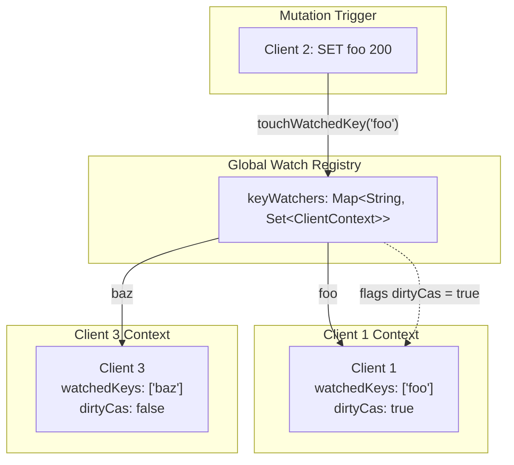
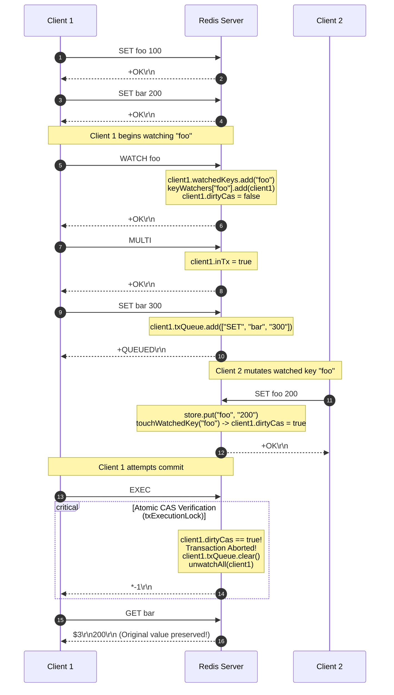
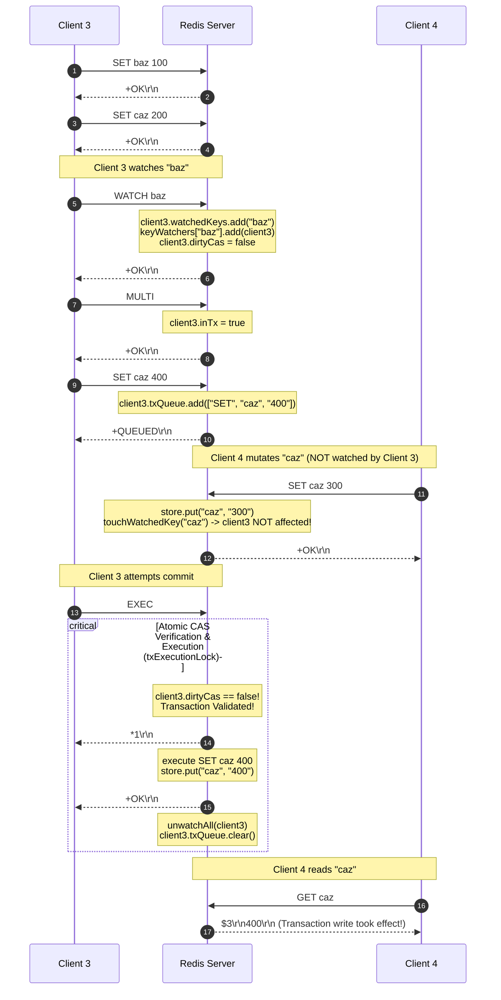

# Stage 45: Tracking key modifications

---

## In one line
Implement transaction abort and Check-And-Set (CAS) validation in `EXEC`: if any watched key was modified (touched) between `WATCH` and `EXEC`, abort the transaction, discard all queued commands, and return a RESP Null Array (`*-1\r\n`), always clearing watch state after `EXEC`.

---

## Self-test (cover the answers below and answer these first)
1. **How does Redis implement optimistic concurrency control (OCC / Check-And-Set), and what exact wire response signals an aborted transaction at `EXEC`?**
2. **Why does Redis track whether a key was *touched* (modified) rather than comparing the key's value at `WATCH` time versus `EXEC` time? What famous concurrency anomaly does this avoid?**
3. **If Client 1 watches key `foo`, begins a transaction with `MULTI`, and queues `SET bar 300`, and Client 2 executes `SET foo 200` before Client 1 calls `EXEC`: what does Client 1 receive on `EXEC`, and what is the subsequent value of `bar`?**
4. **If Client 3 watches key `baz` and queues `SET caz 400`, while Client 4 executes `SET caz 300` before Client 3 calls `EXEC`: why does Client 3's transaction succeed, and what is the final value of `caz`?**
5. **Why must a client's watch state (registered watched keys and dirty CAS flag) be unconditionally cleared after `EXEC`, regardless of whether the transaction succeeded or aborted?**
6. **In a multi-threaded server architecture, why must the CAS dirty check, queued command execution, and watch cleanup be wrapped within an atomic execution lock (`synchronized (txExecutionLock)`)?**

---

## Problem Solved

In previous stages, we established command queuing (`MULTI`), transaction abort/reset (`DISCARD`), atomic batch execution (`EXEC`), error handling inside transaction pipelines, and the `WATCH` registration mechanism.

However, `WATCH` alone is merely a registration step. The true power of Redis transactions lies in **optimistic concurrency control (OCC)** via **Check-And-Set (CAS)**:
1. **The Concurrency Gap**: Between the moment a client reads state and decides what commands to queue (`WATCH key` ... `GET key` ... `MULTI` ... `SET other_key val`), another concurrent client could alter `key`. If the first client proceeds to execute its queued commands unconditionally, it would act on stale data, violating consistency (lost updates, double spends, dirty writes).
2. **Optimistic Validation at `EXEC`**: Instead of locking keys pessimistically during the entire observation and queuing phase (which would stall concurrent clients and risk deadlocks), Redis lets clients observe and queue without locking. When the client finally sends `EXEC`, Redis performs an instant, zero-cost validation:
   - Has **any** watched key been touched by any write command on any connection since `WATCH` was called?
   - **If Dirty (`dirtyCas == true`)**: The transaction is immediately aborted. None of the queued commands are executed. The queue is cleared, all watches are released, and the server returns a RESP Null Array (`*-1\r\n`).
   - **If Clean (`dirtyCas == false`)**: The transaction commits. All queued commands execute sequentially and atomically, returning a RESP array with each command's individual response. All watches are released.

Stage 45 tests this dual-contract across concurrent clients:

### Scenario 1: Watched Key Was Modified (Abort)
```text
Client 1: SET foo 100        -> +OK
Client 1: SET bar 200        -> +OK
Client 1: WATCH foo          -> +OK
Client 1: MULTI              -> +OK
Client 1: SET bar 300        -> +QUEUED

Client 2: SET foo 200        -> +OK (Touches watched key 'foo'!)

Client 1: EXEC               -> *-1\r\n (Null Array: Transaction Aborted)
Client 1: GET bar            -> "200" (SET bar 300 was never executed!)
```

### Scenario 2: Unrelated Key Was Modified (Commit)
```text
Client 3: SET baz 100        -> +OK
Client 3: SET caz 200        -> +OK
Client 3: WATCH baz          -> +OK
Client 3: MULTI              -> +OK
Client 3: SET caz 400        -> +QUEUED

Client 4: SET caz 300        -> +OK (Modifies 'caz', but Client 3 only watched 'baz'!)

Client 3: EXEC               -> *1\r\n+OK\r\n (Committed! 'baz' was untouched)
Client 4: GET caz            -> "400" (Client 3's write took effect!)
```

---

## Thought Process & Architectural Model

### 1. Architectural Components: Global Registry and Connection State

To support efficient, non-blocking modification tracking across arbitrary keys and connections:
- **`ClientContext` (Per-Connection)**:
  - `watchedKeys`: A thread-safe set of keys this specific connection is watching.
  - `dirtyCas`: A `volatile boolean` flag indicating whether any watched key has been touched. Initialized to `false`.
- **`keyWatchers` (Global Server Map)**:
  - A `ConcurrentHashMap<String, Set<ClientContext>>` mapping each watched key to the set of `ClientContext`s currently monitoring it.
- **`touchWatchedKey(String key)`**:
  - Whenever *any* command mutates `key` (`SET`, `INCR`, `XADD`, `RPUSH`, `LPUSH`, `LPOP`, `BLPOP`), it calls `touchWatchedKey(key)`.
  - It looks up `keyWatchers.get(key)`. If non-null, it flags `client.dirtyCas = true` on all watching clients.
- **`unwatchAll(ClientContext clientCtx)`**:
  - Removes `clientCtx` from all entries in `keyWatchers`, clears `clientCtx.watchedKeys`, and resets `clientCtx.dirtyCas = false`.
  - Called unconditionally on `EXEC`, `DISCARD`, `UNWATCH`, and TCP socket disconnects.



---

### 2. Sequence Diagram: Scenario 1 (Watched Key Modified -> Abort)

The diagram below traces Scenario 1 where Client 2 modifies Client 1's watched key `foo`:



---

### 3. Sequence Diagram: Scenario 2 (Unrelated Key Modified -> Commit)

The diagram below traces Scenario 2 where Client 4 modifies `caz`, while Client 3 is watching `baz`:



---

## Full Solution

The complete source code in `codecrafters-redis-java/src/main/java/Main.java`:

```java
import java.io.BufferedReader;
import java.io.IOException;
import java.io.InputStream;
import java.io.InputStreamReader;
import java.io.OutputStream;
import java.net.ServerSocket;
import java.net.Socket;
import java.nio.charset.StandardCharsets;
import java.util.ArrayList;
import java.util.Collections;
import java.util.LinkedHashMap;
import java.util.List;
import java.util.Map;
import java.util.Queue;
import java.util.Set;
import java.util.concurrent.CompletableFuture;
import java.util.concurrent.ConcurrentHashMap;
import java.util.concurrent.ConcurrentLinkedQueue;
import java.util.concurrent.TimeUnit;
import java.util.concurrent.TimeoutException;

public class Main {
  private static class Entry {
    final String value;
    final Long expiresAt;

    Entry(String value, Long expiresAt) {
      this.value = value;
      this.expiresAt = expiresAt;
    }

    boolean isExpired() {
      return expiresAt != null && System.currentTimeMillis() > expiresAt;
    }
  }

  private static class StreamEntry {
    final String id;
    final Map<String, String> fields;

    StreamEntry(String id, Map<String, String> fields) {
      this.id = id;
      this.fields = fields;
    }
  }

  private static class StreamResult {
    final String key;
    final List<StreamEntry> entries;

    StreamResult(String key, List<StreamEntry> entries) {
      this.key = key;
      this.entries = entries;
    }
  }

  private static class ClientContext {
    final Set<String> watchedKeys = ConcurrentHashMap.newKeySet();
    volatile boolean dirtyCas = false;
  }

  private static final Map<String, Entry> store = new ConcurrentHashMap<>();
  private static final Map<String, List<String>> listStore = new ConcurrentHashMap<>();
  private static final Map<String, List<StreamEntry>> streamStore = new ConcurrentHashMap<>();
  private static final Map<String, Queue<CompletableFuture<String>>> blockedWaiters = new ConcurrentHashMap<>();
  private static final Map<String, Object> keyLocks = new ConcurrentHashMap<>();
  private static final Map<String, Set<ClientContext>> keyWatchers = new ConcurrentHashMap<>();
  private static final Object streamNotifier = new Object();
  private static final Object txExecutionLock = new Object();

  private static Object getLock(String key) {
    return keyLocks.computeIfAbsent(key, k -> new Object());
  }

  private static void touchWatchedKey(String key) {
    Set<ClientContext> clients = keyWatchers.get(key);
    if (clients != null) {
      for (ClientContext client : clients) {
        client.dirtyCas = true;
      }
    }
  }

  private static void unwatchAll(ClientContext clientCtx) {
    for (String key : clientCtx.watchedKeys) {
      Set<ClientContext> clients = keyWatchers.get(key);
      if (clients != null) {
        clients.remove(clientCtx);
      }
    }
    clientCtx.watchedKeys.clear();
    clientCtx.dirtyCas = false;
  }

  private static int compareStreamId(long ms1, long seq1, long ms2, long seq2) {
    if (ms1 != ms2) {
      return Long.compare(ms1, ms2);
    }
    return Long.compare(seq1, seq2);
  }

  private static List<StreamResult> queryMatchingEntries(String[] keys, String[] startIds) {
    List<StreamResult> results = new ArrayList<>();
    for (int i = 0; i < keys.length; i++) {
      String key = keys[i];
      String startIdStr = startIds[i];

      long startMs, startSeq;
      if (startIdStr.contains("-")) {
        String[] p = startIdStr.split("-");
        startMs = Long.parseLong(p[0]);
        startSeq = Long.parseLong(p[1]);
      } else {
        startMs = Long.parseLong(startIdStr);
        startSeq = 0;
      }

      List<StreamEntry> stream = streamStore.get(key);
      List<StreamEntry> matching = new ArrayList<>();
      if (stream != null) {
        synchronized (stream) {
          for (StreamEntry entry : stream) {
            String[] partsId = entry.id.split("-");
            long entryMs = Long.parseLong(partsId[0]);
            long entrySeq = Long.parseLong(partsId[1]);

            if (compareStreamId(entryMs, entrySeq, startMs, startSeq) > 0) {
              matching.add(entry);
            }
          }
        }
      }

      if (!matching.isEmpty()) {
        results.add(new StreamResult(key, matching));
      }
    }
    return results;
  }

  private static void handleCommand(String[] parts, OutputStream out) throws IOException {
    String command = parts[0];

    if (command.equalsIgnoreCase("PING")) {
      out.write("+PONG\r\n".getBytes(StandardCharsets.UTF_8));
    } else if (command.equalsIgnoreCase("ECHO")) {
      String arg = parts[1];
      byte[] bytes = arg.getBytes(StandardCharsets.UTF_8);
      String response = "$" + bytes.length + "\r\n" + arg + "\r\n";
      out.write(response.getBytes(StandardCharsets.UTF_8));
    } else if (command.equalsIgnoreCase("SET")) {
      String key = parts[1];
      String value = parts[2];
      Long expiresAt = null;

      if (parts.length >= 5) {
        if (parts[3].equalsIgnoreCase("PX")) {
          long pxMillis = Long.parseLong(parts[4]);
          expiresAt = System.currentTimeMillis() + pxMillis;
        } else if (parts[3].equalsIgnoreCase("EX")) {
          long exSeconds = Long.parseLong(parts[4]);
          expiresAt = System.currentTimeMillis() + (exSeconds * 1000);
        }
      }

      store.put(key, new Entry(value, expiresAt));
      touchWatchedKey(key);
      out.write("+OK\r\n".getBytes(StandardCharsets.UTF_8));
    } else if (command.equalsIgnoreCase("GET")) {
      String key = parts[1];
      Entry entry = store.get(key);

      if (entry != null && !entry.isExpired()) {
        byte[] bytes = entry.value.getBytes(StandardCharsets.UTF_8);
        String response = "$" + bytes.length + "\r\n" + entry.value + "\r\n";
        out.write(response.getBytes(StandardCharsets.UTF_8));
      } else {
        if (entry != null && entry.isExpired()) {
          store.remove(key);
        }
        out.write("$-1\r\n".getBytes(StandardCharsets.UTF_8));
      }
    } else if (command.equalsIgnoreCase("INCR")) {
      if (parts.length < 2) {
        out.write("-ERR wrong number of arguments for 'incr' command\r\n".getBytes(StandardCharsets.UTF_8));
      } else {
        String key = parts[1];
        final long[] resultVal = new long[1];
        final boolean[] isNaN = new boolean[1];

        store.compute(key, (k, old) -> {
          if (old == null || old.isExpired()) {
            resultVal[0] = 1;
            return new Entry("1", null);
          }
          try {
            long current = Long.parseLong(old.value);
            resultVal[0] = current + 1;
            return new Entry(String.valueOf(resultVal[0]), old.expiresAt);
          } catch (NumberFormatException e) {
            isNaN[0] = true;
            return old;
          }
        });

        if (isNaN[0]) {
          out.write("-ERR value is not an integer or out of range\r\n".getBytes(StandardCharsets.UTF_8));
        } else {
          touchWatchedKey(key);
          out.write((":" + resultVal[0] + "\r\n").getBytes(StandardCharsets.UTF_8));
        }
        out.flush();
      }
    } else if (command.equalsIgnoreCase("TYPE")) {
      if (parts.length < 2) {
        out.write("-ERR wrong number of arguments for 'type' command\r\n".getBytes(StandardCharsets.UTF_8));
      } else {
        String key = parts[1];
        Entry entry = store.get(key);
        if (entry != null) {
          if (entry.isExpired()) {
            store.remove(key);
            entry = null;
          }
        }

        if (entry != null) {
          out.write("+string\r\n".getBytes(StandardCharsets.UTF_8));
        } else {
          List<String> list = listStore.get(key);
          if (list != null && !list.isEmpty()) {
            out.write("+list\r\n".getBytes(StandardCharsets.UTF_8));
          } else if (streamStore.containsKey(key)) {
            out.write("+stream\r\n".getBytes(StandardCharsets.UTF_8));
          } else {
            out.write("+none\r\n".getBytes(StandardCharsets.UTF_8));
          }
        }
      }
    } else if (command.equalsIgnoreCase("XADD")) {
      if (parts.length < 5 || (parts.length - 3) % 2 != 0) {
        out.write("-ERR wrong number of arguments for 'xadd' command\r\n".getBytes(StandardCharsets.UTF_8));
      } else {
        String key = parts[1];
        String id = parts[2];
        Map<String, String> fields = new LinkedHashMap<>();
        for (int i = 3; i < parts.length - 1; i += 2) {
          fields.put(parts[i], parts[i + 1]);
        }

        List<StreamEntry> stream = streamStore.computeIfAbsent(key, k -> Collections.synchronizedList(new ArrayList<>()));

        if (id.equals("*")) {
          long time = System.currentTimeMillis();
          synchronized (stream) {
            long seq;
            if (stream.isEmpty()) {
              seq = 0;
            } else {
              StreamEntry lastEntry = stream.get(stream.size() - 1);
              String[] lastParts = lastEntry.id.split("-");
              long lastTime = Long.parseLong(lastParts[0]);
              long lastSeq = Long.parseLong(lastParts[1]);

              if (time == lastTime) {
                seq = lastSeq + 1;
              } else if (time > lastTime) {
                seq = 0;
              } else {
                time = lastTime;
                seq = lastSeq + 1;
              }
            }

            String generatedId = time + "-" + seq;
            stream.add(new StreamEntry(generatedId, fields));
            touchWatchedKey(key);
            synchronized (streamNotifier) {
              streamNotifier.notifyAll();
            }
            byte[] idBytes = generatedId.getBytes(StandardCharsets.UTF_8);
            String response = "$" + idBytes.length + "\r\n" + generatedId + "\r\n";
            out.write(response.getBytes(StandardCharsets.UTF_8));
            out.flush();
          }
        } else if (id.endsWith("-*")) {
          long time = Long.parseLong(id.substring(0, id.length() - 2));
          synchronized (stream) {
            String generatedId = null;
            if (stream.isEmpty()) {
              long seq = (time == 0) ? 1 : 0;
              generatedId = time + "-" + seq;
            } else {
              StreamEntry lastEntry = stream.get(stream.size() - 1);
              String[] lastParts = lastEntry.id.split("-");
              long lastTime = Long.parseLong(lastParts[0]);
              long lastSeq = Long.parseLong(lastParts[1]);

              if (time < lastTime) {
                out.write("-ERR The ID specified in XADD is equal or smaller than the target stream top item\r\n".getBytes(StandardCharsets.UTF_8));
                out.flush();
              } else if (time == lastTime) {
                long seq = lastSeq + 1;
                generatedId = time + "-" + seq;
              } else {
                long seq = (time == 0) ? 1 : 0;
                generatedId = time + "-" + seq;
              }
            }

            if (generatedId != null) {
              stream.add(new StreamEntry(generatedId, fields));
              touchWatchedKey(key);
              synchronized (streamNotifier) {
                streamNotifier.notifyAll();
              }
              byte[] idBytes = generatedId.getBytes(StandardCharsets.UTF_8);
              String response = "$" + idBytes.length + "\r\n" + generatedId + "\r\n";
              out.write(response.getBytes(StandardCharsets.UTF_8));
              out.flush();
            }
          }
        } else {
          String[] dash = id.split("-");
          long time = Long.parseLong(dash[0]);
          long seq = Long.parseLong(dash[1]);

          if (time <= 0 && seq <= 0) {
            out.write("-ERR The ID specified in XADD must be greater than 0-0\r\n".getBytes(StandardCharsets.UTF_8));
            out.flush();
          } else {
            synchronized (stream) {
              boolean valid = true;
              if (!stream.isEmpty()) {
                StreamEntry lastEntry = stream.get(stream.size() - 1);
                String[] lastDash = lastEntry.id.split("-");
                long lastTime = Long.parseLong(lastDash[0]);
                long lastSeq = Long.parseLong(lastDash[1]);
                if ((time < lastTime) || (time == lastTime && seq <= lastSeq)) {
                  valid = false;
                  out.write("-ERR The ID specified in XADD is equal or smaller than the target stream top item\r\n".getBytes(StandardCharsets.UTF_8));
                  out.flush();
                }
              }

              if (valid) {
                stream.add(new StreamEntry(id, fields));
                touchWatchedKey(key);
                synchronized (streamNotifier) {
                  streamNotifier.notifyAll();
                }
                byte[] idBytes = id.getBytes(StandardCharsets.UTF_8);
                String response = "$" + idBytes.length + "\r\n" + id + "\r\n";
                out.write(response.getBytes(StandardCharsets.UTF_8));
                out.flush();
              }
            }
          }
        }
      }
    } else if (command.equalsIgnoreCase("XRANGE")) {
      if (parts.length < 4) {
        out.write("-ERR wrong number of arguments for 'xrange' command\r\n".getBytes(StandardCharsets.UTF_8));
      } else {
        String key = parts[1];
        String start = parts[2];
        String end = parts[3];

        long startMs, startSeq;
        if (start.equals("-")) {
          startMs = 0;
          startSeq = 0;
        } else if (start.equals("+")) {
          startMs = Long.MAX_VALUE;
          startSeq = Long.MAX_VALUE;
        } else if (start.contains("-")) {
          String[] p = start.split("-");
          startMs = Long.parseLong(p[0]);
          startSeq = Long.parseLong(p[1]);
        } else {
          startMs = Long.parseLong(start);
          startSeq = 0;
        }

        long endMs, endSeq;
        if (end.equals("+")) {
          endMs = Long.MAX_VALUE;
          endSeq = Long.MAX_VALUE;
        } else if (end.equals("-")) {
          endMs = 0;
          endSeq = 0;
        } else if (end.contains("-")) {
          String[] p = end.split("-");
          endMs = Long.parseLong(p[0]);
          endSeq = Long.parseLong(p[1]);
        } else {
          endMs = Long.parseLong(end);
          endSeq = Long.MAX_VALUE;
        }

        List<StreamEntry> stream = streamStore.get(key);
        if (stream == null || stream.isEmpty()) {
          out.write("*0\r\n".getBytes(StandardCharsets.UTF_8));
        } else {
          List<StreamEntry> matching = new ArrayList<>();
          synchronized (stream) {
            for (StreamEntry entry : stream) {
              String[] partsId = entry.id.split("-");
              long entryMs = Long.parseLong(partsId[0]);
              long entrySeq = Long.parseLong(partsId[1]);

              if (compareStreamId(entryMs, entrySeq, startMs, startSeq) >= 0 &&
                  compareStreamId(entryMs, entrySeq, endMs, endSeq) <= 0) {
                matching.add(entry);
              }
            }
          }

          StringBuilder sb = new StringBuilder();
          sb.append("*").append(matching.size()).append("\r\n");
          for (StreamEntry entry : matching) {
            sb.append("*2\r\n");
            byte[] idBytes = entry.id.getBytes(StandardCharsets.UTF_8);
            sb.append("$").append(idBytes.length).append("\r\n").append(entry.id).append("\r\n");
            sb.append("*").append(entry.fields.size() * 2).append("\r\n");
            for (Map.Entry<String, String> field : entry.fields.entrySet()) {
              byte[] kBytes = field.getKey().getBytes(StandardCharsets.UTF_8);
              sb.append("$").append(kBytes.length).append("\r\n").append(field.getKey()).append("\r\n");
              byte[] vBytes = field.getValue().getBytes(StandardCharsets.UTF_8);
              sb.append("$").append(vBytes.length).append("\r\n").append(field.getValue()).append("\r\n");
            }
          }
          out.write(sb.toString().getBytes(StandardCharsets.UTF_8));
        }
      }
    } else if (command.equalsIgnoreCase("XREAD")) {
      int streamsIndex = -1;
      long blockTimeout = -1;

      for (int i = 1; i < parts.length; i++) {
        if (parts[i].equalsIgnoreCase("BLOCK")) {
          if (i + 1 < parts.length) {
            blockTimeout = Long.parseLong(parts[i + 1]);
            i++;
          }
        } else if (parts[i].equalsIgnoreCase("STREAMS")) {
          streamsIndex = i;
          break;
        }
      }

      int rem = (streamsIndex == -1) ? 0 : parts.length - (streamsIndex + 1);
      if (streamsIndex == -1 || rem <= 0 || rem % 2 != 0) {
        out.write("-ERR syntax error\r\n".getBytes(StandardCharsets.UTF_8));
      } else {
        int numStreams = rem / 2;
        String[] keys = new String[numStreams];
        String[] startIds = new String[numStreams];
        for (int i = 0; i < numStreams; i++) {
          keys[i] = parts[streamsIndex + 1 + i];
          startIds[i] = parts[streamsIndex + 1 + numStreams + i];
        }

        for (int i = 0; i < numStreams; i++) {
          if (startIds[i].equals("$")) {
            List<StreamEntry> stream = streamStore.get(keys[i]);
            if (stream != null && !stream.isEmpty()) {
              synchronized (stream) {
                if (!stream.isEmpty()) {
                  startIds[i] = stream.get(stream.size() - 1).id;
                } else {
                  startIds[i] = "0-0";
                }
              }
            } else {
              startIds[i] = "0-0";
            }
          }
        }

        long deadline = (blockTimeout == 0) ? Long.MAX_VALUE : (System.currentTimeMillis() + blockTimeout);
        List<StreamResult> matching = queryMatchingEntries(keys, startIds);

        if (matching.isEmpty() && blockTimeout >= 0) {
          synchronized (streamNotifier) {
            matching = queryMatchingEntries(keys, startIds);
            while (matching.isEmpty()) {
              long remMs = deadline - System.currentTimeMillis();
              if (blockTimeout > 0 && remMs <= 0) break;
              try {
                if (blockTimeout == 0) {
                  streamNotifier.wait();
                } else {
                  streamNotifier.wait(Math.max(1, remMs));
                }
              } catch (InterruptedException e) {
                Thread.currentThread().interrupt();
                break;
              }
              matching = queryMatchingEntries(keys, startIds);
            }
          }
        }

        if (matching.isEmpty()) {
          out.write("*-1\r\n".getBytes(StandardCharsets.UTF_8));
        } else {
          StringBuilder sb = new StringBuilder();
          sb.append("*").append(matching.size()).append("\r\n");
          for (StreamResult sr : matching) {
            sb.append("*2\r\n");
            byte[] keyBytes = sr.key.getBytes(StandardCharsets.UTF_8);
            sb.append("$").append(keyBytes.length).append("\r\n").append(sr.key).append("\r\n");
            sb.append("*").append(sr.entries.size()).append("\r\n");
            for (StreamEntry entry : sr.entries) {
              sb.append("*2\r\n");
              byte[] idBytes = entry.id.getBytes(StandardCharsets.UTF_8);
              sb.append("$").append(idBytes.length).append("\r\n").append(entry.id).append("\r\n");
              sb.append("*").append(entry.fields.size() * 2).append("\r\n");
              for (Map.Entry<String, String> field : entry.fields.entrySet()) {
                byte[] kBytes = field.getKey().getBytes(StandardCharsets.UTF_8);
                sb.append("$").append(kBytes.length).append("\r\n").append(field.getKey()).append("\r\n");
                byte[] vBytes = field.getValue().getBytes(StandardCharsets.UTF_8);
                sb.append("$").append(vBytes.length).append("\r\n").append(field.getValue()).append("\r\n");
              }
            }
          }
          out.write(sb.toString().getBytes(StandardCharsets.UTF_8));
        }
      }
    } else if (command.equalsIgnoreCase("RPUSH")) {
      if (parts.length < 3) {
        out.write("-ERR wrong number of arguments for 'rpush' command\r\n".getBytes(StandardCharsets.UTF_8));
      } else {
        String key = parts[1];
        Object lock = getLock(key);
        int newLength;
        synchronized (lock) {
          List<String> list = listStore.computeIfAbsent(key, k -> new ArrayList<>());
          for (int i = 2; i < parts.length; i++) {
            list.add(parts[i]);
          }
          newLength = list.size();

          Queue<CompletableFuture<String>> waiters = blockedWaiters.get(key);
          if (waiters != null) {
            while (!list.isEmpty() && !waiters.isEmpty()) {
              CompletableFuture<String> waiter = waiters.poll();
              if (waiter != null && !waiter.isDone()) {
                String head = list.get(0);
                if (waiter.complete(head)) {
                  list.remove(0);
                }
              }
            }
          }
          if (list.isEmpty()) {
            listStore.remove(key);
          }
          touchWatchedKey(key);
        }
        String response = ":" + newLength + "\r\n";
        out.write(response.getBytes(StandardCharsets.UTF_8));
      }
    } else if (command.equalsIgnoreCase("LPUSH")) {
      if (parts.length < 3) {
        out.write("-ERR wrong number of arguments for 'lpush' command\r\n".getBytes(StandardCharsets.UTF_8));
      } else {
        String key = parts[1];
        Object lock = getLock(key);
        int newLength;
        synchronized (lock) {
          List<String> list = listStore.computeIfAbsent(key, k -> new ArrayList<>());
          for (int i = 2; i < parts.length; i++) {
            list.add(0, parts[i]);
          }
          newLength = list.size();

          Queue<CompletableFuture<String>> waiters = blockedWaiters.get(key);
          if (waiters != null) {
            while (!list.isEmpty() && !waiters.isEmpty()) {
              CompletableFuture<String> waiter = waiters.poll();
              if (waiter != null && !waiter.isDone()) {
                String head = list.get(0);
                if (waiter.complete(head)) {
                  list.remove(0);
                }
              }
            }
          }
          if (list.isEmpty()) {
            listStore.remove(key);
          }
          touchWatchedKey(key);
        }
        String response = ":" + newLength + "\r\n";
        out.write(response.getBytes(StandardCharsets.UTF_8));
      }
    } else if (command.equalsIgnoreCase("LLEN")) {
      if (parts.length < 2) {
        out.write("-ERR wrong number of arguments for 'llen' command\r\n".getBytes(StandardCharsets.UTF_8));
      } else {
        String key = parts[1];
        Object lock = getLock(key);
        int length = 0;
        synchronized (lock) {
          List<String> list = listStore.get(key);
          if (list != null) {
            length = list.size();
          }
        }
        String response = ":" + length + "\r\n";
        out.write(response.getBytes(StandardCharsets.UTF_8));
      }
    } else if (command.equalsIgnoreCase("LPOP")) {
      if (parts.length < 2) {
        out.write("-ERR wrong number of arguments for 'lpop' command\r\n".getBytes(StandardCharsets.UTF_8));
      } else if (parts.length == 2) {
        String key = parts[1];
        Object lock = getLock(key);
        String removedElement = null;
        synchronized (lock) {
          List<String> list = listStore.get(key);
          if (list != null && !list.isEmpty()) {
            removedElement = list.remove(0);
            if (list.isEmpty()) {
              listStore.remove(key);
            }
          }
        }
        if (removedElement == null) {
          out.write("$-1\r\n".getBytes(StandardCharsets.UTF_8));
        } else {
          touchWatchedKey(key);
          byte[] bytes = removedElement.getBytes(StandardCharsets.UTF_8);
          String response = "$" + bytes.length + "\r\n" + removedElement + "\r\n";
          out.write(response.getBytes(StandardCharsets.UTF_8));
        }
      } else {
        String key = parts[1];
        try {
          int count = Integer.parseInt(parts[2]);
          if (count < 0) {
            out.write("-ERR value is out of range, must be positive\r\n".getBytes(StandardCharsets.UTF_8));
          } else {
            Object lock = getLock(key);
            List<String> removedElements = new ArrayList<>();
            boolean keyExisted = false;
            synchronized (lock) {
              List<String> list = listStore.get(key);
              if (list != null) {
                keyExisted = true;
                int toRemove = Math.min(count, list.size());
                for (int i = 0; i < toRemove; i++) {
                  removedElements.add(list.remove(0));
                }
                if (list.isEmpty()) {
                  listStore.remove(key);
                }
              }
            }
            if (!keyExisted || (removedElements.isEmpty() && count > 0)) {
              out.write("*-1\r\n".getBytes(StandardCharsets.UTF_8));
            } else {
              touchWatchedKey(key);
              StringBuilder sb = new StringBuilder();
              sb.append("*").append(removedElements.size()).append("\r\n");
              for (String elem : removedElements) {
                byte[] elemBytes = elem.getBytes(StandardCharsets.UTF_8);
                sb.append("$").append(elemBytes.length).append("\r\n").append(elem).append("\r\n");
              }
              out.write(sb.toString().getBytes(StandardCharsets.UTF_8));
            }
          }
        } catch (NumberFormatException e) {
          out.write("-ERR value is not an integer or out of range\r\n".getBytes(StandardCharsets.UTF_8));
        }
      }
    } else if (command.equalsIgnoreCase("BLPOP")) {
      if (parts.length < 3) {
        out.write("-ERR wrong number of arguments for 'blpop' command\r\n".getBytes(StandardCharsets.UTF_8));
      } else {
        try {
          String key = parts[1];
          double timeoutSec = Double.parseDouble(parts[2]);
          if (timeoutSec < 0) {
            out.write("-ERR timeout is negative\r\n".getBytes(StandardCharsets.UTF_8));
          } else {
            long timeoutMillis = (long) (timeoutSec * 1000);
            Object lock = getLock(key);
            String popped = null;
            CompletableFuture<String> future = null;

            synchronized (lock) {
              List<String> list = listStore.get(key);
              if (list != null && !list.isEmpty()) {
                popped = list.remove(0);
                if (list.isEmpty()) {
                  listStore.remove(key);
                }
              } else {
                future = new CompletableFuture<>();
                blockedWaiters.computeIfAbsent(key, k -> new ConcurrentLinkedQueue<>()).add(future);
              }
            }

            if (popped != null) {
              touchWatchedKey(key);
              byte[] keyBytes = key.getBytes(StandardCharsets.UTF_8);
              byte[] elemBytes = popped.getBytes(StandardCharsets.UTF_8);
              String response = "*2\r\n$" + keyBytes.length + "\r\n" + key + "\r\n$" + elemBytes.length + "\r\n" + popped + "\r\n";
              out.write(response.getBytes(StandardCharsets.UTF_8));
            } else if (future != null) {
              try {
                if (timeoutMillis > 0) {
                  popped = future.get(timeoutMillis, TimeUnit.MILLISECONDS);
                } else {
                  popped = future.get();
                }
                touchWatchedKey(key);
                byte[] keyBytes = key.getBytes(StandardCharsets.UTF_8);
                byte[] elemBytes = popped.getBytes(StandardCharsets.UTF_8);
                String response = "*2\r\n$" + keyBytes.length + "\r\n" + key + "\r\n$" + elemBytes.length + "\r\n" + popped + "\r\n";
                out.write(response.getBytes(StandardCharsets.UTF_8));
              } catch (TimeoutException e) {
                Queue<CompletableFuture<String>> waiters = blockedWaiters.get(key);
                if (waiters != null) {
                  waiters.remove(future);
                }
                future.cancel(true);
                out.write("*-1\r\n".getBytes(StandardCharsets.UTF_8));
              } catch (Exception e) {
                Queue<CompletableFuture<String>> waiters = blockedWaiters.get(key);
                if (waiters != null) {
                  waiters.remove(future);
                }
                future.cancel(true);
                out.write("*-1\r\n".getBytes(StandardCharsets.UTF_8));
              }
            }
          }
        } catch (NumberFormatException e) {
          out.write("-ERR timeout is not a float or out of range\r\n".getBytes(StandardCharsets.UTF_8));
        }
      }
    } else if (command.equalsIgnoreCase("LRANGE")) {
      if (parts.length < 4) {
        out.write("-ERR wrong number of arguments for 'lrange' command\r\n".getBytes(StandardCharsets.UTF_8));
      } else {
        String key = parts[1];
        int start = Integer.parseInt(parts[2]);
        int stop = Integer.parseInt(parts[3]);

        Object lock = getLock(key);
        List<String> elementsToReturn;
        synchronized (lock) {
          List<String> list = listStore.get(key);
          if (list == null || list.isEmpty()) {
            elementsToReturn = Collections.emptyList();
          } else {
            int size = list.size();
            if (start < 0) start += size;
            if (stop < 0) stop += size;
            if (start < 0) start = 0;
            if (stop < 0) stop = 0;

            if (start >= size || start > stop) {
              elementsToReturn = Collections.emptyList();
            } else {
              int stopIdx = Math.min(stop, size - 1);
              elementsToReturn = new ArrayList<>(list.subList(start, stopIdx + 1));
            }
          }
        }

        if (elementsToReturn.isEmpty()) {
          out.write("*0\r\n".getBytes(StandardCharsets.UTF_8));
        } else {
          StringBuilder sb = new StringBuilder();
          sb.append("*").append(elementsToReturn.size()).append("\r\n");
          for (String elem : elementsToReturn) {
            byte[] elemBytes = elem.getBytes(StandardCharsets.UTF_8);
            sb.append("$").append(elemBytes.length).append("\r\n").append(elem).append("\r\n");
          }
          out.write(sb.toString().getBytes(StandardCharsets.UTF_8));
        }
      }
    }
  }

  public static void main(String[] args) {
    System.out.println("Logs from your program will appear here!");

    int port = 6379;

    try {
      ServerSocket serverSocket = new ServerSocket(port);
      serverSocket.setReuseAddress(true);

      while (true) {
        Socket clientSocket = serverSocket.accept();

        new Thread(() -> {
          ClientContext clientCtx = new ClientContext();
          try {
            OutputStream out = clientSocket.getOutputStream();
            InputStream in = clientSocket.getInputStream();
            BufferedReader reader = new BufferedReader(new InputStreamReader(in));
            boolean[] inTx = new boolean[]{false};
            List<String[]> txQueue = new ArrayList<>();

            while (true) {
              String line = reader.readLine();
              if (line == null) break; // client disconnected

              int n = Integer.parseInt(line.substring(1));

              String[] parts = new String[n];
              for (int i = 0; i < n; i++) {
                reader.readLine();            // Skip "$<len>"
                parts[i] = reader.readLine(); // Payload
              }

              String command = parts[0];

              if (inTx[0]) {
                if (command.equalsIgnoreCase("EXEC")) {
                  inTx[0] = false;
                  synchronized (txExecutionLock) {
                    if (clientCtx.dirtyCas) {
                      unwatchAll(clientCtx);
                      txQueue.clear();
                      out.write("*-1\r\n".getBytes(StandardCharsets.UTF_8));
                      out.flush();
                      continue;
                    }
                    // Multiple concurrent transactions: emit array header and execute queued commands atomically
                    out.write(("*" + txQueue.size() + "\r\n").getBytes(StandardCharsets.UTF_8));
                    for (String[] cmd : txQueue) {
                      handleCommand(cmd, out);
                    }
                    unwatchAll(clientCtx);
                    out.flush();
                    txQueue.clear();
                  }
                  continue;
                } else if (command.equalsIgnoreCase("DISCARD")) {
                  inTx[0] = false;
                  txQueue.clear();
                  unwatchAll(clientCtx);
                  out.write("+OK\r\n".getBytes(StandardCharsets.UTF_8));
                  out.flush();
                  continue;
                } else if (command.equalsIgnoreCase("MULTI")) {
                  out.write("-ERR MULTI calls can not be nested\r\n".getBytes(StandardCharsets.UTF_8));
                  out.flush();
                  continue;
                } else if (command.equalsIgnoreCase("WATCH")) {
                  out.write("-ERR WATCH inside MULTI is not allowed\r\n".getBytes(StandardCharsets.UTF_8));
                  out.flush();
                  continue;
                } else {
                  txQueue.add(parts);
                  out.write("+QUEUED\r\n".getBytes(StandardCharsets.UTF_8));
                  out.flush();
                  continue;
                }
              }

              if (command.equalsIgnoreCase("EXEC")) {
                out.write("-ERR EXEC without MULTI\r\n".getBytes(StandardCharsets.UTF_8));
                out.flush();
              } else if (command.equalsIgnoreCase("DISCARD")) {
                out.write("-ERR DISCARD without MULTI\r\n".getBytes(StandardCharsets.UTF_8));
                out.flush();
              } else if (command.equalsIgnoreCase("MULTI")) {
                inTx[0] = true;
                out.write("+OK\r\n".getBytes(StandardCharsets.UTF_8));
                out.flush();
              } else if (command.equalsIgnoreCase("WATCH")) {
                if (parts.length < 2) {
                  out.write("-ERR wrong number of arguments for 'watch' command\r\n".getBytes(StandardCharsets.UTF_8));
                  out.flush();
                } else {
                  for (int i = 1; i < parts.length; i++) {
                    String key = parts[i];
                    clientCtx.watchedKeys.add(key);
                    keyWatchers.computeIfAbsent(key, k -> ConcurrentHashMap.newKeySet()).add(clientCtx);
                  }
                  out.write("+OK\r\n".getBytes(StandardCharsets.UTF_8));
                  out.flush();
                }
              } else if (command.equalsIgnoreCase("UNWATCH")) {
                unwatchAll(clientCtx);
                out.write("+OK\r\n".getBytes(StandardCharsets.UTF_8));
                out.flush();
              } else {
                handleCommand(parts, out);
                out.flush();
              }
            }
          } catch (IOException e) {
            System.out.println("IOException: " + e.getMessage());
          } finally {
            unwatchAll(clientCtx);
            try {
              clientSocket.close();
            } catch (IOException ignored) {}
          }
        }).start();
      }
    } catch (IOException e) {
      System.out.println("IOException: " + e.getMessage());
    }
  }
}
```

---

## Concepts (the transferable part)

### 1. Optimistic Concurrency Control (OCC) vs Pessimistic Concurrency Control (PCC)
- **Pessimistic Locking (PCC)**:
  - Assumes conflicts will happen frequently.
  - Acquires exclusive write locks on rows/keys before doing any computation (e.g. `SELECT FOR UPDATE` in SQL).
  - *Costs*: Severe thread blocking, serialization bottlenecks, deadlock detection overhead, and vulnerability to slow or dead clients holding locks indefinitely.
- **Optimistic Concurrency Control (OCC)**:
  - Assumes conflicts are rare.
  - Allows clients to read data and stage commands without holding any locks.
  - At commit time (`EXEC`), the system validates whether the tracked dataset was modified during the transaction's lifetime.
  - If a conflict occurred, the transaction is cleanly aborted, leaving state untainted. The client retries if desired.
  - *Benefits*: Maximizes throughput, eliminates locks during network I/O, completely prevents deadlocks.

### 2. The ABA Problem and "Touched" Tracking vs Value Comparison
In classic CAS lock-free algorithms, comparing values ($A \rightarrow B \rightarrow A$) can cause a false positive: a memory location originally held $A$, was changed to $B$, and then restored back to $A$. A naive value comparison would conclude nothing changed, even though intermediate side effects may invalidate assumptions (e.g., an account balance went $100 \rightarrow 50 \rightarrow 100$, hiding a deposit and withdrawal).

Redis sidesteps the ABA problem completely:
- Redis **never compares key values** at `EXEC` time.
- Instead, Redis tracks whether a key was **touched** (written to).
- Any write operation (`SET`, `INCR`, `LPOP`, etc.) unconditionally flags `client.dirtyCas = true` on all watching clients, even if the new value happens to equal the old value.
- This guarantees strict causal linearizability: any write event is detected.

### 3. Check-And-Set (CAS) Invalidation Graph
When a client watches keys, the server creates a bipartite graph between keys and client contexts:

$$\text{Key} \longleftrightarrow \{\text{Client}_1, \text{Client}_2, \dots\}$$

- When a key is modified, the server visits all attached edges and sets the `dirtyCas` bit to 1.
- Invalidation is $O(M)$ where $M$ is the number of clients watching the touched key, completely decoupled from datastore size $N$.

### 4. Unconditional Cleanup Invariant
Regardless of how an active watch session concludes:
- `EXEC` succeeded $\rightarrow$ `unwatchAll`
- `EXEC` aborted (`dirtyCas == true`) $\rightarrow$ `unwatchAll`
- `DISCARD` $\rightarrow$ `unwatchAll`
- `UNWATCH` $\rightarrow$ `unwatchAll`
- Client abruptly disconnects $\rightarrow$ `unwatchAll` (in `finally` block)

Failing to clean up watches creates a memory leak (retaining `ClientContext` instances in `keyWatchers`) and corrupts future transactions on the same connection.

---

## Wire Format / Protocol

### Scenario 1: Watched Key Modified (Aborted Transaction)

| Step | Connection | Client Sends (RESP) | Server Responds (RESP) | Notes |
|---|---|---|---|---|
| 1 | C1 | `*3\r\n$3\r\nSET\r\n$3\r\nfoo\r\n$3\r\n100\r\n` | `+OK\r\n` | `foo` = 100 |
| 2 | C1 | `*3\r\n$3\r\nSET\r\n$3\r\nbar\r\n$3\r\n200\r\n` | `+OK\r\n` | `bar` = 200 |
| 3 | C1 | `*2\r\n$5\r\nWATCH\r\n$3\r\nfoo\r\n` | `+OK\r\n` | C1 registers watch on `foo` |
| 4 | C1 | `*1\r\n$5\r\nMULTI\r\n` | `+OK\r\n` | C1 enters transaction |
| 5 | C1 | `*3\r\n$3\r\nSET\r\n$3\r\nbar\r\n$3\r\n300\r\n` | `+QUEUED\r\n` | Buffered in C1's `txQueue` |
| 6 | C2 | `*3\r\n$3\r\nSET\r\n$3\r\nfoo\r\n$3\r\n200\r\n` | `+OK\r\n` | Mutates `foo`; C1 marked dirty! |
| 7 | C1 | `*1\r\n$4\r\nEXEC\r\n` | `*-1\r\n` | **RESP Null Array**: Aborted! |
| 8 | C1 | `*2\r\n$3\r\nGET\r\n$3\r\nbar\r\n` | `$3\r\n200\r\n` | `bar` unchanged (queued command discarded) |

### Scenario 2: Unrelated Key Modified (Committed Transaction)

| Step | Connection | Client Sends (RESP) | Server Responds (RESP) | Notes |
|---|---|---|---|---|
| 1 | C3 | `*3\r\n$3\r\nSET\r\n$3\r\nbaz\r\n$3\r\n100\r\n` | `+OK\r\n` | `baz` = 100 |
| 2 | C3 | `*3\r\n$3\r\nSET\r\n$3\r\ncaz\r\n$3\r\n200\r\n` | `+OK\r\n` | `caz` = 200 |
| 3 | C3 | `*2\r\n$5\r\nWATCH\r\n$3\r\nbaz\r\n` | `+OK\r\n` | C3 registers watch on `baz` |
| 4 | C3 | `*1\r\n$5\r\nMULTI\r\n` | `+OK\r\n` | C3 enters transaction |
| 5 | C3 | `*3\r\n$3\r\nSET\r\n$3\r\ncaz\r\n$3\r\n400\r\n` | `+QUEUED\r\n` | Buffered in C3's `txQueue` |
| 6 | C4 | `*3\r\n$3\r\nSET\r\n$3\r\ncaz\r\n$3\r\n300\r\n` | `+OK\r\n` | Mutates `caz`; C3 only watched `baz` |
| 7 | C3 | `*1\r\n$4\r\nEXEC\r\n` | `*1\r\n+OK\r\n` | **RESP Array**: Committed! |
| 8 | C4 | `*2\r\n$3\r\nGET\r\n$3\r\ncaz\r\n` | `$3\r\n400\r\n` | C3's write overwritten `caz` to 400 |

---

## What Breaks It (Failure Modes)

### 1. Value-Equality False Negatives (The ABA Bug)
- *Hazard*: Saving the value of `key` at `WATCH` time (e.g. `prevValue = store.get(key)`), and at `EXEC` time checking `if (store.get(key).equals(prevValue))`.
- *Why it breaks*: If another client sets `key` to a different value and then resets it back to the original value, the value comparison incorrectly assumes no modification occurred, allowing the transaction to commit with corrupted intermediate assumptions.
- *Mitigation*: Track the modification event via `touchWatchedKey` whenever any write command touches the key. Never compare values.

### 2. Check-Then-Act Race Condition at `EXEC`
- *Hazard*: Checking `if (clientCtx.dirtyCas)` outside the transaction execution lock (`synchronized (txExecutionLock)`).
- *Why it breaks*: Client 1 checks `dirtyCas == false`. Right after this check, Client 2 mutates `foo` and sets `client1.dirtyCas = true`. Then Client 1 enters `txExecutionLock` and executes its queued commands, failing to abort despite concurrent modification.
- *Mitigation*: Keep the `if (clientCtx.dirtyCas)` inspection and the entire queued loop execution inside the same atomic `synchronized (txExecutionLock)` block.

### 3. Lingering Watches After Abort or Commit (State Bleed)
- *Hazard*: Forgetting to call `unwatchAll(clientCtx)` when an `EXEC` aborts or succeeds.
- *Why it breaks*: The connection remains registered in `keyWatchers`. A subsequent write by another client will set `clientCtx.dirtyCas = true` on this connection, causing the client's *next, unrelated* transaction to unexpectedly abort.
- *Mitigation*: Unconditionally call `unwatchAll(clientCtx)` in both the abort branch and commit branch of `EXEC`, as well as in `DISCARD`, `UNWATCH`, and the socket disconnect `finally` block.

### 4. Memory Leaks from Dead Connections
- *Hazard*: Clients disconnecting without sending `UNWATCH` or `EXEC`.
- *Why it breaks*: If `keyWatchers` continues holding references to `ClientContext` instances of closed sockets, memory leaks accumulate over time and dead references are traversed in `touchWatchedKey`.
- *Mitigation*: Ensure the connection worker thread's outer `finally` block invokes `unwatchAll(clientCtx)`.

---

## Tradeoffs

### 1. CAS / Optimistic Tracking vs Multi-Version Concurrency Control (MVCC)
- **Redis OCC (Check-And-Set)**:
  - Single active version in memory. If a write conflict occurs, the transaction fails fast (`*-1\r\n`).
  - Zero storage overhead for previous versions, snapshot isolation, or rollback logs.
  - Best suited for high-throughput in-memory stores with low write contention on identical keys.
- **MVCC (e.g. PostgreSQL, RocksDB)**:
  - Maintains multiple versions of records with transaction IDs and read views. Readers do not block writers, and transactions see a consistent snapshot without aborting.
  - Requires substantial memory for vacuuming old versions, tuple headers, and transaction ID management. Overkill for Redis's ultra-fast in-memory semantics.

### 2. Invalidation Graph (`keyWatchers`) vs Key Version / Revision Counter
- **Invalidation Graph (`keyWatchers: Map<Key, Set<Client>>`)**:
  - The server explicitly notifies watching clients when a key is touched.
  - *Tradeoff*: Requires memory per watch registration, but `EXEC` dirty check is an instant $O(1)$ read of `clientCtx.dirtyCas`.
- **Key Version Counters (`Map<Key, Long> versionMap`)**:
  - Each key maintains a monotonically increasing 64-bit revision number.
  - At `WATCH`, the client saves `watchedVersions[key] = currentVersion`.
  - At `EXEC`, the server compares each watched key's current version against saved version.
  - *Tradeoff*: Saves memory by not storing client sets in keys, but requires $O(K)$ iteration at `EXEC` where $K$ is the number of watched keys.

---

## Java Specifics — Lookup, Don't Memorize

- `ConcurrentHashMap.newKeySet()`: Creates a thread-safe `Set` backed by a `ConcurrentHashMap`. Iterations over this set are weakly consistent and will not throw `ConcurrentModificationException` during concurrent additions/removals.
- `volatile boolean dirtyCas`: The `volatile` modifier ensures that writes to `dirtyCas` by one thread (calling `touchWatchedKey`) are immediately visible to the connection thread executing `EXEC` without cache inconsistency.
- `synchronized (txExecutionLock)`: Re-entrant monitor lock providing atomic exclusion around transaction verification and batch command execution across threads.
- `StandardCharsets.UTF_8`: Character set encoding for converting wire strings (like `"*-1\r\n"`) to byte arrays.

---

## How It Flows

1. **Client 1 Watches and Starts Transaction**:
   - Client 1 sends `WATCH foo`: `foo` is registered in `clientCtx.watchedKeys`, and `clientCtx` is added to `keyWatchers.get("foo")`.
   - Client 1 sends `MULTI`: `inTx[0]` becomes `true`.
   - Client 1 sends `SET bar 300`: server appends `["SET", "bar", "300"]` to `txQueue` and returns `+QUEUED\r\n`.

2. **Client 2 Mutates Watched Key**:
   - Client 2 sends `SET foo 200`.
   - `handleCommand` updates `store` with `foo = "200"`.
   - `touchWatchedKey("foo")` is triggered: it looks up `keyWatchers.get("foo")` and sets `clientCtx.dirtyCas = true` on Client 1's context.

3. **Client 1 Executes (`EXEC`)**:
   - Client 1 sends `EXEC`: `inTx[0]` is cleared.
   - Enters `synchronized (txExecutionLock)`.
   - Checks `clientCtx.dirtyCas`: it is `true`!
   - Invokes `unwatchAll(clientCtx)`: removes Client 1 from `keyWatchers`, clears `watchedKeys`, resets `dirtyCas = false`.
   - Clears `txQueue`: `SET bar 300` is discarded without executing.
   - Writes `*-1\r\n` to Client 1's output stream and flushes.

4. **Client 1 Verifies Datastore Integrity**:
   - Client 1 sends `GET bar`: server returns `$3\r\n200\r\n` (the original value before the aborted transaction).

---

## Rebuild Checklist

- [ ] In `ClientContext`, define `final Set<String> watchedKeys` and `volatile boolean dirtyCas = false`.
- [ ] In `Main`, maintain `static final Map<String, Set<ClientContext>> keyWatchers = new ConcurrentHashMap<>()`.
- [ ] Implement `touchWatchedKey(String key)` to iterate through `keyWatchers.get(key)` and set `dirtyCas = true` on all watching clients.
- [ ] Call `touchWatchedKey(key)` in all mutating commands (`SET`, `INCR`, `XADD`, `RPUSH`, `LPUSH`, `LPOP`, `BLPOP`).
- [ ] In `EXEC` (when `inTx` is true), acquire `synchronized (txExecutionLock)` before checking `clientCtx.dirtyCas`.
- [ ] If `clientCtx.dirtyCas == true`:
  - [ ] Call `unwatchAll(clientCtx)`.
  - [ ] Clear `txQueue`.
  - [ ] Write RESP Null Array `*-1\r\n` and flush.
- [ ] If `clientCtx.dirtyCas == false`:
  - [ ] Write `*<txQueue.size()>\r\n`.
  - [ ] Execute each command in `txQueue` sequentially.
  - [ ] Call `unwatchAll(clientCtx)`.
  - [ ] Flush output and clear `txQueue`.
- [ ] Ensure `unwatchAll(clientCtx)` is also called in `DISCARD`, `UNWATCH`, and the socket cleanup `finally` block.
