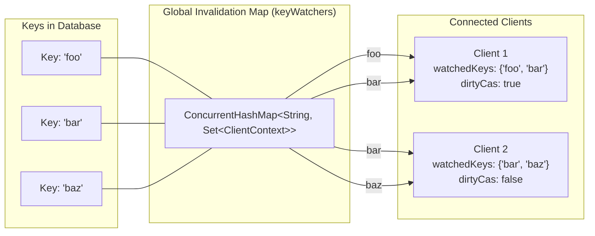
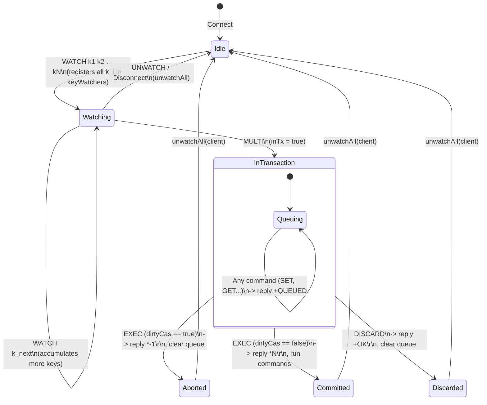
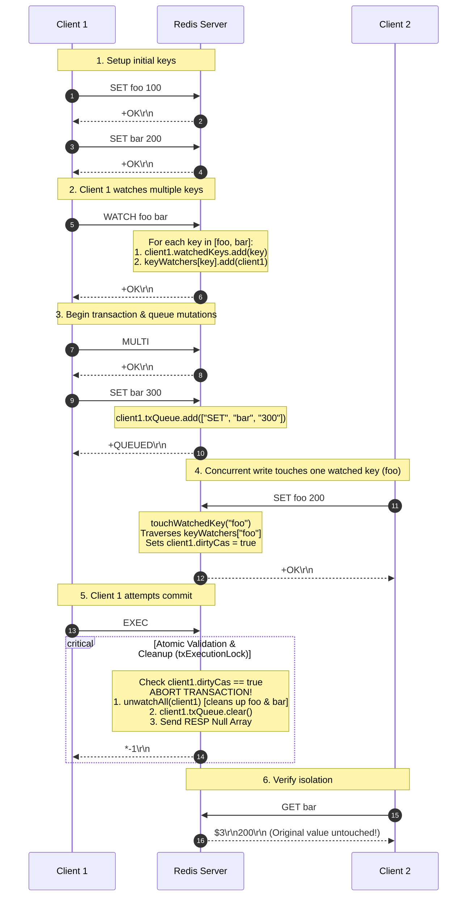

# Stage 46: Watching multiple keys

---

## In one line
Extend optimistic concurrency control (OCC) to multiple keys by registering arbitrary keys (`WATCH key1 key2 ... keyN`) into client-tracking sets, invalidating the transaction (`dirtyCas = true`) if *any* watched key is touched by a write before `EXEC`, and guaranteeing atomic abort with RESP Null Array (`*-1\r\n`).

---

## Self-test (cover the answers below and answer these first)
1. **How does the multi-key syntax of `WATCH` (`WATCH foo bar baz`) alter the internal registration compared to single-key `WATCH`?**
2. **If a transaction monitors multiple keys (`foo`, `bar`, `baz`), what is the mathematical condition for `EXEC` to succeed vs abort? (Express in terms of modification sets).**
3. **If a client executes `WATCH foo` and then subsequently calls `WATCH bar` before calling `MULTI`, are both keys watched or does the second command overwrite the first?**
4. **What happens if a client watches a non-existent key (e.g., `WATCH newkey`), and another client later executes `SET newkey 100` before `EXEC`?**
5. **How does the time complexity of invalidation change when multiple keys are watched per transaction? In particular, what is the complexity of `touchWatchedKey(key)` vs `unwatchAll(client)`?**
6. **Why must `unwatchAll` unregister the client from *every* key in `clientCtx.watchedKeys`, and what happens if even a single key is skipped during cleanup?**

---

## Problem Solved

In Stage 45, we introduced optimistic concurrency control (OCC) by tracking modifications to a single key between `WATCH` and `EXEC`. However, real-world business transactions rarely involve only a single entity or key:
- **Financial Transfers**: Moving balance from Account A to Account B requires reading and checking balances on *both* `account:1` and `account:2`. If *either* account balance changes concurrently, the transfer must abort to prevent overdrafts or double-spending.
- **Inventory & Order Processing**: Reserving stock across multiple items (`item:101`, `item:102`) requires watching all items in the basket before committing the checkout.
- **State Machine Transitions**: Dependent state flags spread across multiple keys require multi-variable invariant checking.

The Redis specification allows `WATCH` to accept **one or more keys** in a single invocation:
```text
WATCH key [key ...]
```
Furthermore, clients can call `WATCH` multiple times consecutively before starting a transaction with `MULTI`; the watched keys accumulate.

### The Contract of Watching Multiple Keys
1. **Multi-Key Registration**: `WATCH key1 key2 ... keyN` must register every key argument into the client's watched set and map each key to this client in the global registry.
2. **Any-Key Invalidation (OR Logic)**: If **any one or more** of the watched keys is modified (touched by `SET`, `INCR`, `XADD`, `LPUSH`, `LPOP`, etc.) by any client before `EXEC`, the entire transaction must abort.
3. **Atomicity of Abort**: On abort, `EXEC` must return a RESP Null Array (`*-1\r\n`), discard all queued commands without executing any of them, and clean up all registered watches.
4. **State Integrity**: Commands queued in an aborted transaction must have zero side effects on the database.

### Test Scenario
```text
# Client 1: Seed initial state
Client 1: SET foo 100        -> +OK
Client 1: SET bar 200        -> +OK

# Client 1: Watch multiple keys at once and queue mutations
Client 1: WATCH foo bar      -> +OK
Client 1: MULTI              -> +OK
Client 1: SET bar 300        -> +QUEUED

# Client 2: Mutate one of the watched keys (foo)
Client 2: SET foo 200        -> +OK

# Client 1: Attempt commit
Client 1: EXEC               -> *-1\r\n (Aborted because 'foo' was touched!)

# Client 2: Verify zero side-effects
Client 2: GET bar            -> "200" (Unchanged; 'SET bar 300' was discarded!)
```

---

## Thought Process & Architectural Model

### 1. The Bipartite Watch Graph
The relationship between monitored keys and observing clients forms a **bipartite graph**:
- Left partition: Keys ($\mathcal{K}$)
- Right partition: Client Contexts ($\mathcal{C}$)



When Client 1 executes `WATCH foo bar`:
1. Both `"foo"` and `"bar"` are added to `client1.watchedKeys`.
2. `client1` is added to `keyWatchers["foo"]` and `keyWatchers["bar"]`.

When any client executes `SET foo 200`:
1. `touchWatchedKey("foo")` looks up `keyWatchers["foo"]`.
2. Every client in that set (here, `client1`) has its `dirtyCas` flag set to `true`.
3. Client 2's `dirtyCas` remains `false` because Client 2 only watched `bar` and `baz`.

---

### 2. Multi-Key State Transition
A client connection progresses through well-defined lifecycle states when watching multiple keys:



---

### 3. Execution Sequence: Multi-Key Detection & Abort



---

## Full Solution

The complete implementation in `codecrafters-redis-java/src/main/java/Main.java`:

```java
import java.io.BufferedReader;
import java.io.IOException;
import java.io.InputStream;
import java.io.InputStreamReader;
import java.io.OutputStream;
import java.net.ServerSocket;
import java.net.Socket;
import java.nio.charset.StandardCharsets;
import java.util.ArrayList;
import java.util.Collections;
import java.util.LinkedHashMap;
import java.util.List;
import java.util.Map;
import java.util.Queue;
import java.util.Set;
import java.util.concurrent.CompletableFuture;
import java.util.concurrent.ConcurrentHashMap;
import java.util.concurrent.ConcurrentLinkedQueue;
import java.util.concurrent.TimeUnit;
import java.util.concurrent.TimeoutException;

public class Main {
  private static class Entry {
    final String value;
    final Long expiresAt;

    Entry(String value, Long expiresAt) {
      this.value = value;
      this.expiresAt = expiresAt;
    }

    boolean isExpired() {
      return expiresAt != null && System.currentTimeMillis() > expiresAt;
    }
  }

  private static class StreamEntry {
    final String id;
    final Map<String, String> fields;

    StreamEntry(String id, Map<String, String> fields) {
      this.id = id;
      this.fields = fields;
    }
  }

  private static class StreamResult {
    final String key;
    final List<StreamEntry> entries;

    StreamResult(String key, List<StreamEntry> entries) {
      this.key = key;
      this.entries = entries;
    }
  }

  private static class ClientContext {
    final Set<String> watchedKeys = ConcurrentHashMap.newKeySet();
    volatile boolean dirtyCas = false;
  }

  private static final Map<String, Entry> store = new ConcurrentHashMap<>();
  private static final Map<String, List<String>> listStore = new ConcurrentHashMap<>();
  private static final Map<String, List<StreamEntry>> streamStore = new ConcurrentHashMap<>();
  private static final Map<String, Queue<CompletableFuture<String>>> blockedWaiters = new ConcurrentHashMap<>();
  private static final Map<String, Object> keyLocks = new ConcurrentHashMap<>();
  private static final Map<String, Set<ClientContext>> keyWatchers = new ConcurrentHashMap<>();
  private static final Object streamNotifier = new Object();
  private static final Object txExecutionLock = new Object();

  private static Object getLock(String key) {
    return keyLocks.computeIfAbsent(key, k -> new Object());
  }

  private static void touchWatchedKey(String key) {
    Set<ClientContext> clients = keyWatchers.get(key);
    if (clients != null) {
      for (ClientContext client : clients) {
        client.dirtyCas = true;
      }
    }
  }

  private static void unwatchAll(ClientContext clientCtx) {
    for (String key : clientCtx.watchedKeys) {
      Set<ClientContext> clients = keyWatchers.get(key);
      if (clients != null) {
        clients.remove(clientCtx);
      }
    }
    clientCtx.watchedKeys.clear();
    clientCtx.dirtyCas = false;
  }

  private static int compareStreamId(long ms1, long seq1, long ms2, long seq2) {
    if (ms1 != ms2) {
      return Long.compare(ms1, ms2);
    }
    return Long.compare(seq1, seq2);
  }

  private static List<StreamResult> queryMatchingEntries(String[] keys, String[] startIds) {
    List<StreamResult> results = new ArrayList<>();
    for (int i = 0; i < keys.length; i++) {
      String key = keys[i];
      String startIdStr = startIds[i];

      long startMs, startSeq;
      if (startIdStr.contains("-")) {
        String[] p = startIdStr.split("-");
        startMs = Long.parseLong(p[0]);
        startSeq = Long.parseLong(p[1]);
      } else {
        startMs = Long.parseLong(startIdStr);
        startSeq = 0;
      }

      List<StreamEntry> stream = streamStore.get(key);
      List<StreamEntry> matching = new ArrayList<>();
      if (stream != null) {
        synchronized (stream) {
          for (StreamEntry entry : stream) {
            String[] partsId = entry.id.split("-");
            long entryMs = Long.parseLong(partsId[0]);
            long entrySeq = Long.parseLong(partsId[1]);

            if (compareStreamId(entryMs, entrySeq, startMs, startSeq) > 0) {
              matching.add(entry);
            }
          }
        }
      }
      if (!matching.isEmpty()) {
        results.add(new StreamResult(key, matching));
      }
    }
    return results;
  }

  private static void handleCommand(String[] parts, OutputStream out) throws IOException {
    String command = parts[0];

    if (command.equalsIgnoreCase("PING")) {
      out.write("+PONG\r\n".getBytes(StandardCharsets.UTF_8));
    } else if (command.equalsIgnoreCase("ECHO")) {
      String message = parts[1];
      out.write(("+" + message + "\r\n").getBytes(StandardCharsets.UTF_8));
    } else if (command.equalsIgnoreCase("SET")) {
      String key = parts[1];
      String value = parts[2];
      Long expiresAt = null;

      for (int i = 3; i < parts.length; i++) {
        if (parts[i].equalsIgnoreCase("PX") && i + 1 < parts.length) {
          long px = Long.parseLong(parts[i + 1]);
          expiresAt = System.currentTimeMillis() + px;
          i++;
        }
      }

      store.put(key, new Entry(value, expiresAt));
      touchWatchedKey(key);
      out.write("+OK\r\n".getBytes(StandardCharsets.UTF_8));
    } else if (command.equalsIgnoreCase("GET")) {
      String key = parts[1];
      Entry entry = store.get(key);

      if (entry == null || entry.isExpired()) {
        if (entry != null && entry.isExpired()) {
          store.remove(key);
        }
        out.write("$-1\r\n".getBytes(StandardCharsets.UTF_8));
      } else {
        String val = entry.value;
        out.write(("$" + val.length() + "\r\n" + val + "\r\n").getBytes(StandardCharsets.UTF_8));
      }
    } else if (command.equalsIgnoreCase("INCR")) {
      if (parts.length < 2) {
        out.write("-ERR wrong number of arguments for 'incr' command\r\n".getBytes(StandardCharsets.UTF_8));
      } else {
        String key = parts[1];
        Object lock = getLock(key);
        synchronized (lock) {
          Entry entry = store.get(key);
          if (entry == null || entry.isExpired()) {
            if (entry != null && entry.isExpired()) {
              store.remove(key);
            }
            store.put(key, new Entry("1", null));
            touchWatchedKey(key);
            out.write(":1\r\n".getBytes(StandardCharsets.UTF_8));
          } else {
            try {
              long val = Long.parseLong(entry.value);
              val++;
              store.put(key, new Entry(String.valueOf(val), entry.expiresAt));
              touchWatchedKey(key);
              out.write((":" + val + "\r\n").getBytes(StandardCharsets.UTF_8));
            } catch (NumberFormatException e) {
              out.write("-ERR value is not an integer or out of range\r\n".getBytes(StandardCharsets.UTF_8));
            }
          }
        }
      }
    } else if (command.equalsIgnoreCase("TYPE")) {
      String key = parts[1];
      Entry entry = store.get(key);
      if (entry != null && !entry.isExpired()) {
        out.write("+string\r\n".getBytes(StandardCharsets.UTF_8));
      } else if (listStore.containsKey(key)) {
        out.write("+list\r\n".getBytes(StandardCharsets.UTF_8));
      } else if (streamStore.containsKey(key)) {
        out.write("+stream\r\n".getBytes(StandardCharsets.UTF_8));
      } else {
        out.write("+none\r\n".getBytes(StandardCharsets.UTF_8));
      }
    } else if (command.equalsIgnoreCase("XADD")) {
      String key = parts[1];
      String id = parts[2];

      long currentMs;
      long currentSeq;

      List<StreamEntry> stream = streamStore.computeIfAbsent(key, k -> new ArrayList<>());

      synchronized (stream) {
        if (id.equals("*")) {
          currentMs = System.currentTimeMillis();
          currentSeq = 0;
          if (!stream.isEmpty()) {
            StreamEntry last = stream.get(stream.size() - 1);
            String[] lastParts = last.id.split("-");
            long lastMs = Long.parseLong(lastParts[0]);
            long lastSeq = Long.parseLong(lastParts[1]);
            if (currentMs == lastMs) {
              currentSeq = lastSeq + 1;
            } else if (currentMs < lastMs) {
              currentMs = lastMs;
              currentSeq = lastSeq + 1;
            }
          }
          id = currentMs + "-" + currentSeq;
        } else if (id.endsWith("-*")) {
          currentMs = Long.parseLong(id.substring(0, id.indexOf("-*")));
          currentSeq = (currentMs == 0) ? 1 : 0;
          if (!stream.isEmpty()) {
            StreamEntry last = stream.get(stream.size() - 1);
            String[] lastParts = last.id.split("-");
            long lastMs = Long.parseLong(lastParts[0]);
            long lastSeq = Long.parseLong(lastParts[1]);
            if (currentMs == lastMs) {
              currentSeq = lastSeq + 1;
            }
          }
          id = currentMs + "-" + currentSeq;
        } else {
          String[] idParts = id.split("-");
          currentMs = Long.parseLong(idParts[0]);
          currentSeq = Long.parseLong(idParts[1]);

          if (currentMs == 0 && currentSeq <= 0) {
            out.write("-ERR The ID specified in XADD must be greater than 0-0\r\n".getBytes(StandardCharsets.UTF_8));
            return;
          }

          if (!stream.isEmpty()) {
            StreamEntry last = stream.get(stream.size() - 1);
            String[] lastParts = last.id.split("-");
            long lastMs = Long.parseLong(lastParts[0]);
            long lastSeq = Long.parseLong(lastParts[1]);

            if (currentMs < lastMs || (currentMs == lastMs && currentSeq <= lastSeq)) {
              out.write("-ERR The ID specified in XADD is equal or smaller than the target stream top item ID\r\n".getBytes(StandardCharsets.UTF_8));
              return;
            }
          }
        }

        Map<String, String> fields = new LinkedHashMap<>();
        for (int i = 3; i < parts.length; i += 2) {
          fields.put(parts[i], parts[i + 1]);
        }

        stream.add(new StreamEntry(id, fields));
        touchWatchedKey(key);
      }

      synchronized (streamNotifier) {
        streamNotifier.notifyAll();
      }

      out.write(("$" + id.length() + "\r\n" + id + "\r\n").getBytes(StandardCharsets.UTF_8));
    } else if (command.equalsIgnoreCase("XRANGE")) {
      String key = parts[1];
      String start = parts[2];
      String end = parts[3];

      long startMs, startSeq;
      if (start.equals("-")) {
        startMs = 0;
        startSeq = 0;
      } else if (start.contains("-")) {
        String[] p = start.split("-");
        startMs = Long.parseLong(p[0]);
        startSeq = Long.parseLong(p[1]);
      } else {
        startMs = Long.parseLong(start);
        startSeq = 0;
      }

      long endMs, endSeq;
      if (end.equals("+")) {
        endMs = Long.MAX_VALUE;
        endSeq = Long.MAX_VALUE;
      } else if (end.contains("-")) {
        String[] p = end.split("-");
        endMs = Long.parseLong(p[0]);
        endSeq = Long.parseLong(p[1]);
      } else {
        endMs = Long.parseLong(end);
        endSeq = Long.MAX_VALUE;
      }

      List<StreamEntry> stream = streamStore.get(key);
      List<StreamEntry> result = new ArrayList<>();
      if (stream != null) {
        synchronized (stream) {
          for (StreamEntry entry : stream) {
            String[] partsId = entry.id.split("-");
            long entryMs = Long.parseLong(partsId[0]);
            long entrySeq = Long.parseLong(partsId[1]);

            if (compareStreamId(entryMs, entrySeq, startMs, startSeq) >= 0 &&
                compareStreamId(entryMs, entrySeq, endMs, endSeq) <= 0) {
              result.add(entry);
            }
          }
        }
      }

      StringBuilder sb = new StringBuilder();
      sb.append("*").append(result.size()).append("\r\n");
      for (StreamEntry entry : result) {
        sb.append("*2\r\n");
        sb.append("$").append(entry.id.length()).append("\r\n").append(entry.id).append("\r\n");
        sb.append("*").append(entry.fields.size() * 2).append("\r\n");
        for (Map.Entry<String, String> f : entry.fields.entrySet()) {
          sb.append("$").append(f.getKey().length()).append("\r\n").append(f.getKey()).append("\r\n");
          sb.append("$").append(f.getValue().length()).append("\r\n").append(f.getValue()).append("\r\n");
        }
      }
      out.write(sb.toString().getBytes(StandardCharsets.UTF_8));
    } else if (command.equalsIgnoreCase("XREAD")) {
      int blockIdx = -1;
      long blockMs = -1;
      int streamsIdx = 1;

      for (int i = 1; i < parts.length; i++) {
        if (parts[i].equalsIgnoreCase("block") && i + 1 < parts.length) {
          blockIdx = i;
          blockMs = Long.parseLong(parts[i + 1]);
          i++;
        } else if (parts[i].equalsIgnoreCase("streams")) {
          streamsIdx = i;
          break;
        }
      }

      int numKeys = (parts.length - (streamsIdx + 1)) / 2;
      String[] keys = new String[numKeys];
      String[] startIds = new String[numKeys];

      for (int i = 0; i < numKeys; i++) {
        keys[i] = parts[streamsIdx + 1 + i];
        startIds[i] = parts[streamsIdx + 1 + numKeys + i];
      }

      for (int i = 0; i < numKeys; i++) {
        if (startIds[i].equals("$")) {
          List<StreamEntry> stream = streamStore.get(keys[i]);
          if (stream == null || stream.isEmpty()) {
            startIds[i] = "0-0";
          } else {
            synchronized (stream) {
              startIds[i] = stream.get(stream.size() - 1).id;
            }
          }
        }
      }

      List<StreamResult> results;
      if (blockIdx != -1) {
        long startTime = System.currentTimeMillis();
        while (true) {
          results = queryMatchingEntries(keys, startIds);
          if (!results.isEmpty()) {
            break;
          }

          long elapsed = System.currentTimeMillis() - startTime;
          long remaining = (blockMs == 0) ? Long.MAX_VALUE : (blockMs - elapsed);
          if (blockMs != 0 && remaining <= 0) {
            break;
          }

          synchronized (streamNotifier) {
            try {
              if (blockMs == 0) {
                streamNotifier.wait();
              } else {
                streamNotifier.wait(Math.min(remaining, 50));
              }
            } catch (InterruptedException e) {
              break;
            }
          }
        }
      } else {
        results = queryMatchingEntries(keys, startIds);
      }

      if (results.isEmpty()) {
        out.write("*-1\r\n".getBytes(StandardCharsets.UTF_8));
      } else {
        StringBuilder sb = new StringBuilder();
        sb.append("*").append(results.size()).append("\r\n");
        for (StreamResult sr : results) {
          sb.append("*2\r\n");
          sb.append("$").append(sr.key.length()).append("\r\n").append(sr.key).append("\r\n");
          sb.append("*").append(sr.entries.size()).append("\r\n");
          for (StreamEntry entry : sr.entries) {
            sb.append("*2\r\n");
            sb.append("$").append(entry.id.length()).append("\r\n").append(entry.id).append("\r\n");
            sb.append("*").append(entry.fields.size() * 2).append("\r\n");
            for (Map.Entry<String, String> f : entry.fields.entrySet()) {
              sb.append("$").append(f.getKey().length()).append("\r\n").append(f.getKey()).append("\r\n");
              sb.append("$").append(f.getValue().length()).append("\r\n").append(f.getValue()).append("\r\n");
            }
          }
        }
        out.write(sb.toString().getBytes(StandardCharsets.UTF_8));
      }
    } else if (command.equalsIgnoreCase("RPUSH")) {
      if (parts.length < 3) {
        out.write("-ERR wrong number of arguments for 'rpush' command\r\n".getBytes(StandardCharsets.UTF_8));
      } else {
        String key = parts[1];
        Object lock = getLock(key);
        int newSize;
        synchronized (lock) {
          List<String> list = listStore.computeIfAbsent(key, k -> new ArrayList<>());
          for (int i = 2; i < parts.length; i++) {
            list.add(parts[i]);
          }
          newSize = list.size();
          touchWatchedKey(key);
        }

        Queue<CompletableFuture<String>> waiters = blockedWaiters.get(key);
        if (waiters != null) {
          while (true) {
            CompletableFuture<String> waiter;
            synchronized (waiters) {
              waiter = waiters.poll();
            }
            if (waiter == null) break;

            String popped = null;
            synchronized (lock) {
              List<String> list = listStore.get(key);
              if (list != null && !list.isEmpty()) {
                popped = list.remove(0);
                touchWatchedKey(key);
              }
            }
            if (popped != null) {
              if (waiter.complete(popped)) {
                break;
              } else {
                synchronized (lock) {
                  List<String> list = listStore.computeIfAbsent(key, k -> new ArrayList<>());
                  list.add(0, popped);
                }
              }
            }
          }
        }

        out.write((":" + newSize + "\r\n").getBytes(StandardCharsets.UTF_8));
      }
    } else if (command.equalsIgnoreCase("LPUSH")) {
      if (parts.length < 3) {
        out.write("-ERR wrong number of arguments for 'lpush' command\r\n".getBytes(StandardCharsets.UTF_8));
      } else {
        String key = parts[1];
        Object lock = getLock(key);
        int newSize;
        synchronized (lock) {
          List<String> list = listStore.computeIfAbsent(key, k -> new ArrayList<>());
          for (int i = 2; i < parts.length; i++) {
            list.add(0, parts[i]);
          }
          newSize = list.size();
          touchWatchedKey(key);
        }

        Queue<CompletableFuture<String>> waiters = blockedWaiters.get(key);
        if (waiters != null) {
          while (true) {
            CompletableFuture<String> waiter;
            synchronized (waiters) {
              waiter = waiters.poll();
            }
            if (waiter == null) break;

            String popped = null;
            synchronized (lock) {
              List<String> list = listStore.get(key);
              if (list != null && !list.isEmpty()) {
                popped = list.remove(0);
                touchWatchedKey(key);
              }
            }
            if (popped != null) {
              if (waiter.complete(popped)) {
                break;
              } else {
                synchronized (lock) {
                  List<String> list = listStore.computeIfAbsent(key, k -> new ArrayList<>());
                  list.add(0, popped);
                }
              }
            }
          }
        }

        out.write((":" + newSize + "\r\n").getBytes(StandardCharsets.UTF_8));
      }
    } else if (command.equalsIgnoreCase("LPOP")) {
      if (parts.length < 2) {
        out.write("-ERR wrong number of arguments for 'lpop' command\r\n".getBytes(StandardCharsets.UTF_8));
      } else {
        String key = parts[1];
        int count = 1;
        boolean hasCount = parts.length >= 3;
        if (hasCount) {
          count = Integer.parseInt(parts[2]);
        }

        Object lock = getLock(key);
        List<String> poppedElements = new ArrayList<>();
        synchronized (lock) {
          List<String> list = listStore.get(key);
          if (list != null && !list.isEmpty()) {
            int toPop = Math.min(count, list.size());
            for (int i = 0; i < toPop; i++) {
              poppedElements.add(list.remove(0));
            }
            touchWatchedKey(key);
          }
        }

        if (poppedElements.isEmpty()) {
          out.write("$-1\r\n".getBytes(StandardCharsets.UTF_8));
        } else if (!hasCount) {
          String elem = poppedElements.get(0);
          byte[] elemBytes = elem.getBytes(StandardCharsets.UTF_8);
          out.write(("$" + elemBytes.length + "\r\n").getBytes(StandardCharsets.UTF_8));
          out.write(elemBytes);
          out.write("\r\n".getBytes(StandardCharsets.UTF_8));
        } else {
          StringBuilder sb = new StringBuilder();
          sb.append("*").append(poppedElements.size()).append("\r\n");
          for (String elem : poppedElements) {
            byte[] elemBytes = elem.getBytes(StandardCharsets.UTF_8);
            sb.append("$").append(elemBytes.length).append("\r\n").append(elem).append("\r\n");
          }
          out.write(sb.toString().getBytes(StandardCharsets.UTF_8));
        }
      }
    } else if (command.equalsIgnoreCase("RPOP")) {
      if (parts.length < 2) {
        out.write("-ERR wrong number of arguments for 'rpop' command\r\n".getBytes(StandardCharsets.UTF_8));
      } else {
        String key = parts[1];
        int count = 1;
        boolean hasCount = parts.length >= 3;
        if (hasCount) {
          count = Integer.parseInt(parts[2]);
        }

        Object lock = getLock(key);
        List<String> poppedElements = new ArrayList<>();
        synchronized (lock) {
          List<String> list = listStore.get(key);
          if (list != null && !list.isEmpty()) {
            int toPop = Math.min(count, list.size());
            for (int i = 0; i < toPop; i++) {
              poppedElements.add(list.remove(list.size() - 1));
            }
            touchWatchedKey(key);
          }
        }

        if (poppedElements.isEmpty()) {
          out.write("$-1\r\n".getBytes(StandardCharsets.UTF_8));
        } else if (!hasCount) {
          String elem = poppedElements.get(0);
          byte[] elemBytes = elem.getBytes(StandardCharsets.UTF_8);
          out.write(("$" + elemBytes.length + "\r\n").getBytes(StandardCharsets.UTF_8));
          out.write(elemBytes);
          out.write("\r\n".getBytes(StandardCharsets.UTF_8));
        } else {
          StringBuilder sb = new StringBuilder();
          sb.append("*").append(poppedElements.size()).append("\r\n");
          for (String elem : poppedElements) {
            byte[] elemBytes = elem.getBytes(StandardCharsets.UTF_8);
            sb.append("$").append(elemBytes.length).append("\r\n").append(elem).append("\r\n");
          }
          out.write(sb.toString().getBytes(StandardCharsets.UTF_8));
        }
      }
    } else if (command.equalsIgnoreCase("LLEN")) {
      if (parts.length < 2) {
        out.write("-ERR wrong number of arguments for 'llen' command\r\n".getBytes(StandardCharsets.UTF_8));
      } else {
        String key = parts[1];
        Object lock = getLock(key);
        int size = 0;
        synchronized (lock) {
          List<String> list = listStore.get(key);
          if (list != null) {
            size = list.size();
          }
        }
        out.write((":" + size + "\r\n").getBytes(StandardCharsets.UTF_8));
      }
    } else if (command.equalsIgnoreCase("BLPOP")) {
      if (parts.length < 3) {
        out.write("-ERR wrong number of arguments for 'blpop' command\r\n".getBytes(StandardCharsets.UTF_8));
      } else {
        String key = parts[1];
        try {
          double timeoutSec = Double.parseDouble(parts[2]);
          long timeoutMs = (long) (timeoutSec * 1000);

          Object lock = getLock(key);
          String popped = null;
          synchronized (lock) {
            List<String> list = listStore.get(key);
            if (list != null && !list.isEmpty()) {
              popped = list.remove(0);
              touchWatchedKey(key);
            }
          }

          if (popped != null) {
            StringBuilder sb = new StringBuilder();
            sb.append("*2\r\n");
            sb.append("$").append(key.length()).append("\r\n").append(key).append("\r\n");
            byte[] elemBytes = popped.getBytes(StandardCharsets.UTF_8);
            sb.append("$").append(elemBytes.length).append("\r\n").append(popped).append("\r\n");
            out.write(sb.toString().getBytes(StandardCharsets.UTF_8));
          } else {
            CompletableFuture<String> future = new CompletableFuture<>();
            Queue<CompletableFuture<String>> waiters = blockedWaiters.computeIfAbsent(key, k -> new ConcurrentLinkedQueue<>());
            synchronized (waiters) {
              waiters.add(future);
            }

            try {
              String elem;
              if (timeoutMs == 0) {
                elem = future.get();
              } else {
                elem = future.get(timeoutMs, TimeUnit.MILLISECONDS);
              }

              StringBuilder sb = new StringBuilder();
              sb.append("*2\r\n");
              sb.append("$").append(key.length()).append("\r\n").append(key).append("\r\n");
              byte[] elemBytes = elem.getBytes(StandardCharsets.UTF_8);
              sb.append("$").append(elemBytes.length).append("\r\n").append(elem).append("\r\n");
              out.write(sb.toString().getBytes(StandardCharsets.UTF_8));
            } catch (TimeoutException e) {
              future.cancel(true);
              synchronized (waiters) {
                waiters.remove(future);
              }
              out.write("*-1\r\n".getBytes(StandardCharsets.UTF_8));
            } catch (Exception e) {
              out.write("*-1\r\n".getBytes(StandardCharsets.UTF_8));
            }
          }
        } catch (NumberFormatException e) {
          out.write("-ERR timeout is not a float or out of range\r\n".getBytes(StandardCharsets.UTF_8));
        }
      }
    } else if (command.equalsIgnoreCase("LRANGE")) {
      if (parts.length < 4) {
        out.write("-ERR wrong number of arguments for 'lrange' command\r\n".getBytes(StandardCharsets.UTF_8));
      } else {
        String key = parts[1];
        int start = Integer.parseInt(parts[2]);
        int stop = Integer.parseInt(parts[3]);

        Object lock = getLock(key);
        List<String> elementsToReturn;
        synchronized (lock) {
          List<String> list = listStore.get(key);
          if (list == null || list.isEmpty()) {
            elementsToReturn = Collections.emptyList();
          } else {
            int size = list.size();
            if (start < 0) start += size;
            if (stop < 0) stop += size;
            if (start < 0) start = 0;
            if (stop < 0) stop = 0;

            if (start >= size || start > stop) {
              elementsToReturn = Collections.emptyList();
            } else {
              int stopIdx = Math.min(stop, size - 1);
              elementsToReturn = new ArrayList<>(list.subList(start, stopIdx + 1));
            }
          }
        }

        if (elementsToReturn.isEmpty()) {
          out.write("*0\r\n".getBytes(StandardCharsets.UTF_8));
        } else {
          StringBuilder sb = new StringBuilder();
          sb.append("*").append(elementsToReturn.size()).append("\r\n");
          for (String elem : elementsToReturn) {
            byte[] elemBytes = elem.getBytes(StandardCharsets.UTF_8);
            sb.append("$").append(elemBytes.length).append("\r\n").append(elem).append("\r\n");
          }
          out.write(sb.toString().getBytes(StandardCharsets.UTF_8));
        }
      }
    }
  }

  public static void main(String[] args) {
    System.out.println("Logs from your program will appear here!");

    int port = 6379;

    try {
      ServerSocket serverSocket = new ServerSocket(port);
      serverSocket.setReuseAddress(true);

      while (true) {
        Socket clientSocket = serverSocket.accept();

        new Thread(() -> {
          ClientContext clientCtx = new ClientContext();
          try {
            OutputStream out = clientSocket.getOutputStream();
            InputStream in = clientSocket.getInputStream();
            BufferedReader reader = new BufferedReader(new InputStreamReader(in));
            boolean[] inTx = new boolean[]{false};
            List<String[]> txQueue = new ArrayList<>();

            while (true) {
              String line = reader.readLine();
              if (line == null) break; // client disconnected

              int n = Integer.parseInt(line.substring(1));

              String[] parts = new String[n];
              for (int i = 0; i < n; i++) {
                reader.readLine();            // Skip "$<len>"
                parts[i] = reader.readLine(); // Payload
              }

              String command = parts[0];

              if (inTx[0]) {
                if (command.equalsIgnoreCase("EXEC")) {
                  inTx[0] = false;
                  synchronized (txExecutionLock) {
                    if (clientCtx.dirtyCas) {
                      unwatchAll(clientCtx);
                      txQueue.clear();
                      out.write("*-1\r\n".getBytes(StandardCharsets.UTF_8));
                      out.flush();
                      continue;
                    }
                    // Multiple concurrent transactions: emit array header and execute queued commands atomically
                    out.write(("*" + txQueue.size() + "\r\n").getBytes(StandardCharsets.UTF_8));
                    for (String[] cmd : txQueue) {
                      handleCommand(cmd, out);
                    }
                    unwatchAll(clientCtx);
                    out.flush();
                    txQueue.clear();
                  }
                  continue;
                } else if (command.equalsIgnoreCase("DISCARD")) {
                  inTx[0] = false;
                  txQueue.clear();
                  unwatchAll(clientCtx);
                  out.write("+OK\r\n".getBytes(StandardCharsets.UTF_8));
                  out.flush();
                  continue;
                } else if (command.equalsIgnoreCase("MULTI")) {
                  out.write("-ERR MULTI calls can not be nested\r\n".getBytes(StandardCharsets.UTF_8));
                  out.flush();
                  continue;
                } else if (command.equalsIgnoreCase("WATCH")) {
                  out.write("-ERR WATCH inside MULTI is not allowed\r\n".getBytes(StandardCharsets.UTF_8));
                  out.flush();
                  continue;
                } else {
                  txQueue.add(parts);
                  out.write("+QUEUED\r\n".getBytes(StandardCharsets.UTF_8));
                  out.flush();
                  continue;
                }
              }

              if (command.equalsIgnoreCase("EXEC")) {
                out.write("-ERR EXEC without MULTI\r\n".getBytes(StandardCharsets.UTF_8));
                out.flush();
              } else if (command.equalsIgnoreCase("DISCARD")) {
                out.write("-ERR DISCARD without MULTI\r\n".getBytes(StandardCharsets.UTF_8));
                out.flush();
              } else if (command.equalsIgnoreCase("MULTI")) {
                inTx[0] = true;
                out.write("+OK\r\n".getBytes(StandardCharsets.UTF_8));
                out.flush();
              } else if (command.equalsIgnoreCase("WATCH")) {
                if (parts.length < 2) {
                  out.write("-ERR wrong number of arguments for 'watch' command\r\n".getBytes(StandardCharsets.UTF_8));
                  out.flush();
                } else {
                  for (int i = 1; i < parts.length; i++) {
                    String key = parts[i];
                    clientCtx.watchedKeys.add(key);
                    keyWatchers.computeIfAbsent(key, k -> ConcurrentHashMap.newKeySet()).add(clientCtx);
                  }
                  out.write("+OK\r\n".getBytes(StandardCharsets.UTF_8));
                  out.flush();
                }
              } else if (command.equalsIgnoreCase("UNWATCH")) {
                unwatchAll(clientCtx);
                out.write("+OK\r\n".getBytes(StandardCharsets.UTF_8));
                out.flush();
              } else {
                handleCommand(parts, out);
                out.flush();
              }
            }
          } catch (IOException e) {
            System.out.println("IOException: " + e.getMessage());
          } finally {
            unwatchAll(clientCtx);
            try {
              clientSocket.close();
            } catch (IOException ignored) {}
          }
        }).start();
      }
    } catch (IOException e) {
      System.out.println("IOException: " + e.getMessage());
    }
  }
}
```

---

## Concepts (the transferable part)

### 1. Multi-Variable Optimistic Concurrency Control (OCC)
In optimistic locking across multiple resources:
- Let $\mathcal{W} = \{k_1, k_2, \dots, k_n\}$ be the set of watched keys.
- Let $\Delta$ be the set of all keys modified by any transaction/client between `WATCH` and `EXEC`.
- **Validation Predicate**:
  $$\text{Commit}(\mathcal{W}, \Delta) \iff \mathcal{W} \cap \Delta = \emptyset$$
  If the intersection is non-empty ($\mathcal{W} \cap \Delta \neq \emptyset$), at least one monitored dependency was altered. The transaction cannot preserve consistency and must abort.

### 2. Dual-Index Graph (Forward & Inverted Index)
To make both invalidation and cleanup efficient:
- **Inverted Index (`keyWatchers: Map<Key, Set<Client>>`)**:
  - Maps each key to all interested clients.
  - When a write modifies `key`, finding who to invalidate takes $O(1)$ map lookup + $O(M)$ notification iterations where $M$ is the number of clients watching that specific key.
- **Forward Index (`clientCtx.watchedKeys: Set<Key>`)**:
  - Tracks all keys watched by this specific client connection.
  - When the client executes `EXEC`, `DISCARD`, `UNWATCH`, or disconnects, the server uses this set to quickly unregister the client from `keyWatchers` without scanning the entire global map ($O(K)$ cleanup where $K$ is the number of keys watched by this client).

### 3. Accumulative Watch Invariant
Successive `WATCH` commands are cumulative:
```text
WATCH foo bar
WATCH baz
```
The client is now monitoring `{"foo", "bar", "baz"}`. An update to *any* of the three keys invalidates the transaction. The set of watched keys is only reset when `EXEC`, `DISCARD`, or `UNWATCH` is called.

### 4. Non-Existent Key Watching
Watching a key that does not exist in the datastore is valid and standard. If another client subsequently creates the key (via `SET`, `RPUSH`, etc.), this mutation constitutes a modification event and must trigger `touchWatchedKey(key)`. OCC monitors *state transitions*, including $0 \rightarrow 1$ (creation).

---

## Wire Format / Protocol

### Multi-Key WATCH and Abort Flow

| Step | Conn | Client Sends (RESP) | Server Responds (RESP) | Explanation |
|---|---|---|---|---|
| 1 | C1 | `*3\r\n$3\r\nSET\r\n$3\r\nfoo\r\n$3\r\n100\r\n` | `+OK\r\n` | Initialize `foo` = 100 |
| 2 | C1 | `*3\r\n$3\r\nSET\r\n$3\r\nbar\r\n$3\r\n200\r\n` | `+OK\r\n` | Initialize `bar` = 200 |
| 3 | C1 | `*3\r\n$5\r\nWATCH\r\n$3\r\nfoo\r\n$3\r\nbar\r\n` | `+OK\r\n` | C1 registers watch on **both** `foo` and `bar` |
| 4 | C1 | `*1\r\n$5\r\nMULTI\r\n` | `+OK\r\n` | C1 enters transaction mode |
| 5 | C1 | `*3\r\n$3\r\nSET\r\n$3\r\nbar\r\n$3\r\n300\r\n` | `+QUEUED\r\n` | `SET bar 300` buffered in `txQueue` |
| 6 | C2 | `*3\r\n$3\r\nSET\r\n$3\r\nfoo\r\n$3\r\n200\r\n` | `+OK\r\n` | C2 modifies `foo` $\rightarrow$ marks C1 `dirtyCas = true` |
| 7 | C1 | `*1\r\n$4\r\nEXEC\r\n` | `*-1\r\n` | **RESP Null Array**: Transaction aborted! All watches cleared |
| 8 | C2 | `*2\r\n$3\r\nGET\r\n$3\r\nbar\r\n` | `$3\r\n200\r\n` | `bar` unchanged (`SET bar 300` discarded) |

---

## What Breaks It (Failure Modes)

### 1. Incomplete Argument Parsing in Multi-Key `WATCH`
- *Hazard*: Only reading `parts[1]` (the first key) when parsing `WATCH foo bar baz`.
- *Why it breaks*: If the server only registers `foo`, mutations to `bar` or `baz` are never detected. The transaction commits despite concurrent modification of its dependent keys, leading to data corruption and lost updates.
- *Mitigation*: Loop through all arguments from index `1` to `parts.length - 1`, registering each key in both `clientCtx.watchedKeys` and `keyWatchers`.

### 2. Overwriting Watches Across Successive Calls
- *Hazard*: Doing `clientCtx.watchedKeys = new HashSet<>()` inside the `WATCH` command handler.
- *Why it breaks*: If a client calls `WATCH foo` and then `WATCH bar`, replacing the set discards the watch on `foo`. A modification to `foo` would then fail to trigger an abort.
- *Mitigation*: Always append/insert into the existing set: `clientCtx.watchedKeys.add(key)`.

### 3. Partial Cleanup Leaks (Dangling Watchers)
- *Hazard*: Clearing `clientCtx.watchedKeys` before removing `clientCtx` from `keyWatchers`.
- *Why it breaks*: Once `clientCtx.watchedKeys` is empty, the server loses track of which sets in `keyWatchers` still contain `clientCtx`. The client context remains indefinitely in those sets, leaking memory and causing ghost invalidations if contexts are recycled.
- *Mitigation*: Iterate through `clientCtx.watchedKeys` to remove `clientCtx` from every entry in `keyWatchers` *before* clearing `watchedKeys`.

### 4. Race Condition Between Key Mutation and Registration
- *Hazard*: A client reads a key before calling `WATCH`, while another client modifies it in between.
- *Why it breaks*: OCC only protects the window between `WATCH` and `EXEC`. If `WATCH` is issued after reading state, intermediate writes are missed.
- *Mitigation*: Clients must follow the strict idiom: `WATCH key1 key2 ...` $\rightarrow$ `GET key1, GET key2` $\rightarrow$ compute $\rightarrow$ `MULTI` $\rightarrow$ queue writes $\rightarrow$ `EXEC`.

---

## Tradeoffs

### 1. Granular Key Watching vs Coarse Table/Database Locking
- **Fine-Grained Multi-Key Watching (Redis)**:
  - Clients only declare the specific keys they depend on.
  - Transactions on disjoint key sets (`{foo, bar}` vs `{baz, qux}`) execute concurrently without contention.
  - High concurrency throughput; low abort rate under distributed key workloads.
- **Coarse Table/DB Locking**:
  - Locks the entire partition or namespace.
  - High contention and serialization bottlenecks for high-throughput microservices.

### 2. Eager Invalidation vs Lazy Validation
- **Eager Invalidation (Used here)**:
  - Mutating commands (`SET`, `INCR`) proactively flip `dirtyCas = true` on all watching clients via `touchWatchedKey`.
  - `EXEC` check is an immediate $O(1)$ read of `clientCtx.dirtyCas`.
  - *Tradeoff*: Small write overhead on mutating commands, but near-zero cost during transaction execution.
- **Lazy Validation (Version Comparison at `EXEC`)**:
  - Each key stores a 64-bit monotonically increasing version number.
  - At `WATCH`, the client snapshots `{k_1: v_1, k_2: v_2, ...}`.
  - At `EXEC`, the server checks whether `currentVersion(k_i) == v_i` for all $k_i \in \mathcal{W}$.
  - *Tradeoff*: No overhead during writes, but `EXEC` requires $O(K)$ hash table lookups and version checks.

---

## Java Specifics — Lookup, Don't Memorize

- `ConcurrentHashMap.newKeySet()`: Factory method returning a concurrent, thread-safe set backed by a `ConcurrentHashMap` with boolean values. Perfect for storing sets of keys and sets of client contexts without requiring explicit external locks during reads.
- `computeIfAbsent(K key, Function<? super K, ? extends V> mappingFunction)`: Atomically computes and inserts a new set into `keyWatchers` if the key is not already present, avoiding race conditions where two threads try to initialize the set simultaneously.
- `volatile boolean dirtyCas`: Guarantees memory visibility across threads. When connection thread B calls `touchWatchedKey` and writes `client1.dirtyCas = true`, connection thread A executing `EXEC` immediately sees the update without reading a stale CPU cache value.
- `synchronized (txExecutionLock)`: Ensures total mutual exclusion during transaction verification, queued command execution, and cleanup, preventing interleaved command execution between multiple concurrent clients.

---

## How It Flows

1. **Client 1 Issues Multi-Key WATCH**:
   - Client 1 sends `WATCH foo bar`.
   - The server splits the command into `["WATCH", "foo", "bar"]`.
   - Loop over indices $i = 1, 2$:
     - For `"foo"`: adds `"foo"` to `clientCtx.watchedKeys`; registers `clientCtx` into `keyWatchers.get("foo")`.
     - For `"bar"`: adds `"bar"` to `clientCtx.watchedKeys`; registers `clientCtx` into `keyWatchers.get("bar")`.
   - Server returns `+OK\r\n`.

2. **Client 1 Begins Transaction**:
   - Client 1 sends `MULTI` $\rightarrow$ Server responds `+OK\r\n` and sets `inTx[0] = true`.
   - Client 1 sends `SET bar 300` $\rightarrow$ Server queues command in `txQueue` and returns `+QUEUED\r\n`.

3. **Client 2 Mutates a Watched Key**:
   - Client 2 sends `SET foo 200`.
   - Datastore updates `foo` to `"200"`.
   - Server calls `touchWatchedKey("foo")`.
   - Server retrieves `keyWatchers.get("foo")`, finds Client 1, and marks `client1.dirtyCas = true`.

4. **Client 1 Calls EXEC**:
   - Client 1 sends `EXEC`.
   - Server acquires `synchronized (txExecutionLock)`.
   - Server checks `clientCtx.dirtyCas`: it is `true`!
   - Transaction abort path:
     - `unwatchAll(clientCtx)` iterates through `{"foo", "bar"}` and removes Client 1 from `keyWatchers["foo"]` and `keyWatchers["bar"]`.
     - Clears `clientCtx.watchedKeys` and resets `dirtyCas = false`.
     - Clears `txQueue` (discarding `SET bar 300`).
     - Transmits RESP Null Array `*-1\r\n` to Client 1 and flushes.

5. **Client 2 Checks Value**:
   - Client 2 sends `GET bar` $\rightarrow$ Server returns `$3\r\n200\r\n`. The aborted transaction had zero side effects.

---

## Rebuild Checklist

- [ ] In `Main.java`, handle `WATCH` with arbitrary key arguments:
  ```java
  for (int i = 1; i < parts.length; i++) {
    String key = parts[i];
    clientCtx.watchedKeys.add(key);
    keyWatchers.computeIfAbsent(key, k -> ConcurrentHashMap.newKeySet()).add(clientCtx);
  }
  ```
- [ ] Return `+OK\r\n` on successful watch registration of all keys.
- [ ] Ensure `touchWatchedKey(key)` sets `dirtyCas = true` for all clients registered in `keyWatchers.get(key)`.
- [ ] Verify that `touchWatchedKey(key)` is invoked across all mutating commands (`SET`, `INCR`, `XADD`, `RPUSH`, `LPUSH`, `LPOP`, `RPOP`, `BLPOP`).
- [ ] In `EXEC`, verify `clientCtx.dirtyCas` within `synchronized (txExecutionLock)`.
- [ ] If `dirtyCas` is true:
  - [ ] Call `unwatchAll(clientCtx)`.
  - [ ] Clear `txQueue`.
  - [ ] Send `*-1\r\n` and flush.
- [ ] In `unwatchAll(clientCtx)`:
  - [ ] Iterate over every key in `clientCtx.watchedKeys`.
  - [ ] Remove `clientCtx` from `keyWatchers.get(key)`.
  - [ ] Clear `clientCtx.watchedKeys`.
  - [ ] Reset `clientCtx.dirtyCas = false`.
- [ ] Call `unwatchAll(clientCtx)` on `EXEC`, `DISCARD`, `UNWATCH`, and socket disconnect `finally`.
