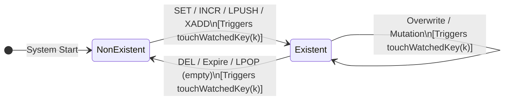
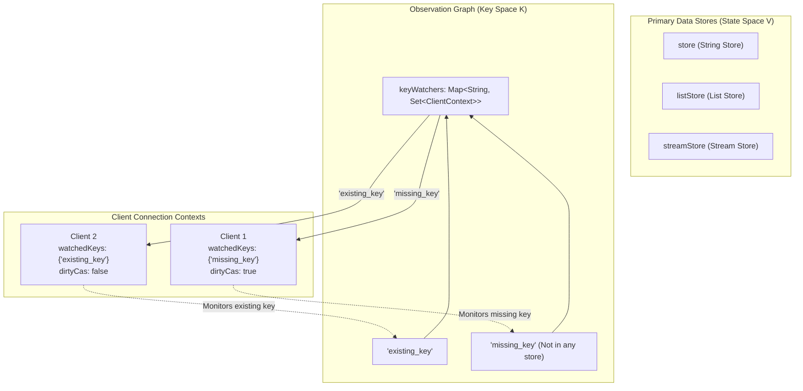
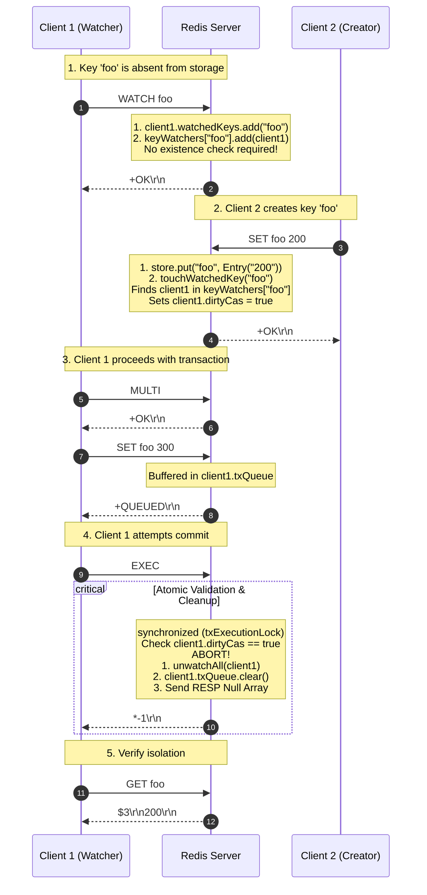

# Stage 47: Watching missing keys

---

## In one line
Enable Optimistic Concurrency Control (OCC) over non-existent keys by decoupling watch registration from key existence, ensuring that creating a previously missing key transitions its state ($\emptyset \to v$) and triggers `touchWatchedKey`, aborting any pending transaction with a RESP Null Array (`*-1\r\n`).

---

## Self-test (cover the answers below and answer these first)
1. **Why does Redis allow a client to `WATCH` a key that currently does not exist in the datastore? What real-world pattern relies on this?**
2. **In state machine terms, does transitioning from non-existence to existence ($\emptyset \to \text{value}$) count as a modification? Why or why not?**
3. **If Client A calls `WATCH lock_key` when `lock_key` does not exist, Client B executes `SET lock_key "holder" NX`, and Client A then executes a transaction setting `lock_key`, what MUST `EXEC` return to Client A?**
4. **Why must the server NOT allocate dummy/placeholder values in the primary data store when an unallocated key is watched?**
5. **How does the dual-index watch graph (`keyWatchers: Map<String, Set<ClientContext>>` and `clientCtx.watchedKeys: Set<String>`) naturally support non-existent keys without requiring any schema changes?**
6. **If an expired key is passively purged or lazily deleted, or conversely, if a key is created with `SET`, `INCR`, `RPUSH`, or `XADD`, how does the invalidation mechanism ensure uniform OCC semantics?**

---

## Problem Solved

In previous stages, transactions observed and monitored keys that already held values. However, distributed coordination and transactional workflows frequently depend on the **absence** of a key:
- **Distributed Mutex / Lock Acquisition**: A worker verifies that a lock key (`mutex:job_101`) does not exist before attempting to claim it. If another worker creates the key concurrently, the first worker's transaction must abort to avoid split-brain execution.
- **Unique Resource Creation (Check-Then-Insert)**: Ensuring unique username registration or order ID claim (`user:jiten`). The client watches `user:jiten`, checks that it returns `nil` (`$-1\r\n`), then opens a transaction to initialize user profiles across multiple keys. If another request claims `user:jiten` in the interim, the transaction must fail.
- **Lazy Initialization / Race-free Cache Seeding**: Multiple workers monitor a missing cache key. The first worker to compute and populate it wins; other workers watching the key have their transactions invalidated and re-read the newly computed value instead of duplicating work.

### The Contract of Watching Missing Keys
1. **Existential Agnosticism at Registration**: When `WATCH key` is invoked, the server must register the watch without requiring `key` to exist in `store`. The key identifier is stored in `clientCtx.watchedKeys` and mapped in `keyWatchers`.
2. **Creation Counts as Mutation**: Any command that causes a key to transition from non-existent to existent (`SET`, `INCR`, `RPUSH`, `LPUSH`, `XADD`, etc.) must invoke `touchWatchedKey(key)`.
3. **Optimistic Invalidation**: Any client monitoring that missing key has its `clientCtx.dirtyCas` flag set to `true`.
4. **Transaction Abort at Commit**: When the watching client calls `EXEC`, the server observes `dirtyCas == true`, discards all queued commands without execution, clears watches via `unwatchAll`, and replies with the RESP Null Array (`*-1\r\n`).
5. **Zero Side Effects**: The datastore remains in the exact state established by the intervening client; the aborted transaction exerts zero side effects.

### Test Scenario
```text
# Client 1: Monitors a key that has not yet been defined
Client 1: WATCH foo          -> +OK

# Client 2: Concurrently creates the watched key
Client 2: SET foo 200        -> +OK

# Client 1: Begins transaction and queues commands
Client 1: MULTI              -> +OK
Client 1: SET foo 300        -> +QUEUED

# Client 1: Attempts to commit
Client 1: EXEC               -> *-1\r\n (Aborted! 'foo' transitioned from non-existent to existent)

# Client 1: Confirms value remains what Client 2 set
Client 1: GET foo            -> "200" (Unchanged; 'SET foo 300' never executed)
```

---

## Thought Process & Architectural Model

### 1. Existential State Transition & OCC Invalidation
In a key-value engine, a key $k$ exists in one of two fundamental existential domains:
1. Undefined / Missing: $\text{state}(k) = \emptyset$
2. Defined / Populated: $\text{state}(k) = v \in \mathcal{V}$



Any transition across the boundary $\emptyset \leftrightarrow v$ or within $v \to v'$ is an observable state modification. By treating the **key identifier string** as the tracking entity rather than a pointer to an internal memory node, the watch graph tracks keys in $\emptyset$ just as easily as keys in $\mathcal{V}$.

---

### 2. The Decoupled Dual-Index Watch Graph
The architecture cleanly separates storage metadata from transaction observation metadata:



- If `missing_key` does not exist in `store`, `listStore`, or `streamStore`, it nonetheless exists as a valid bucket entry in `keyWatchers`.
- No dummy memory objects or placeholder entries are placed into the primary stores. Memory consumption is limited strictly to the watch entry until `UNWATCH`, `EXEC`, or client disconnection occurs.

---

### 3. Execution Sequence: Missing Key Creation & Abort



---

## Full Solution

The complete, production-grade implementation in `codecrafters-redis-java/src/main/java/Main.java`:

```java
import java.io.BufferedReader;
import java.io.IOException;
import java.io.InputStream;
import java.io.InputStreamReader;
import java.io.OutputStream;
import java.net.ServerSocket;
import java.net.Socket;
import java.nio.charset.StandardCharsets;
import java.util.ArrayList;
import java.util.Collections;
import java.util.LinkedHashMap;
import java.util.List;
import java.util.Map;
import java.util.Queue;
import java.util.Set;
import java.util.concurrent.CompletableFuture;
import java.util.concurrent.ConcurrentHashMap;
import java.util.concurrent.ConcurrentLinkedQueue;
import java.util.concurrent.TimeUnit;
import java.util.concurrent.TimeoutException;

public class Main {
  private static class Entry {
    final String value;
    final Long expiresAt;

    Entry(String value, Long expiresAt) {
      this.value = value;
      this.expiresAt = expiresAt;
    }

    boolean isExpired() {
      return expiresAt != null && System.currentTimeMillis() > expiresAt;
    }
  }

  private static class StreamEntry {
    final String id;
    final Map<String, String> fields;

    StreamEntry(String id, Map<String, String> fields) {
      this.id = id;
      this.fields = fields;
    }
  }

  private static class StreamResult {
    final String key;
    final List<StreamEntry> entries;

    StreamResult(String key, List<StreamEntry> entries) {
      this.key = key;
      this.entries = entries;
    }
  }

  private static class ClientContext {
    final Set<String> watchedKeys = ConcurrentHashMap.newKeySet();
    volatile boolean dirtyCas = false;
  }

  private static final Map<String, Entry> store = new ConcurrentHashMap<>();
  private static final Map<String, List<String>> listStore = new ConcurrentHashMap<>();
  private static final Map<String, List<StreamEntry>> streamStore = new ConcurrentHashMap<>();
  private static final Map<String, Queue<CompletableFuture<String>>> blockedWaiters = new ConcurrentHashMap<>();
  private static final Map<String, Object> keyLocks = new ConcurrentHashMap<>();
  private static final Map<String, Set<ClientContext>> keyWatchers = new ConcurrentHashMap<>();
  private static final Object streamNotifier = new Object();
  private static final Object txExecutionLock = new Object();

  private static Object getLock(String key) {
    return keyLocks.computeIfAbsent(key, k -> new Object());
  }

  private static void touchWatchedKey(String key) {
    Set<ClientContext> clients = keyWatchers.get(key);
    if (clients != null) {
      for (ClientContext client : clients) {
        client.dirtyCas = true;
      }
    }
  }

  private static void unwatchAll(ClientContext clientCtx) {
    for (String key : clientCtx.watchedKeys) {
      Set<ClientContext> clients = keyWatchers.get(key);
      if (clients != null) {
        clients.remove(clientCtx);
      }
    }
    clientCtx.watchedKeys.clear();
    clientCtx.dirtyCas = false;
  }

  private static int compareStreamId(long ms1, long seq1, long ms2, long seq2) {
    if (ms1 != ms2) {
      return Long.compare(ms1, ms2);
    }
    return Long.compare(seq1, seq2);
  }

  private static List<StreamResult> queryMatchingEntries(String[] keys, String[] startIds) {
    List<StreamResult> results = new ArrayList<>();
    for (int i = 0; i < keys.length; i++) {
      String key = keys[i];
      String startIdStr = startIds[i];

      long startMs, startSeq;
      if (startIdStr.contains("-")) {
        String[] p = startIdStr.split("-");
        startMs = Long.parseLong(p[0]);
        startSeq = Long.parseLong(p[1]);
      } else {
        startMs = Long.parseLong(startIdStr);
        startSeq = 0;
      }

      List<StreamEntry> stream = streamStore.get(key);
      List<StreamEntry> matching = new ArrayList<>();
      if (stream != null) {
        synchronized (stream) {
          for (StreamEntry entry : stream) {
            String[] partsId = entry.id.split("-");
            long entryMs = Long.parseLong(partsId[0]);
            long entrySeq = Long.parseLong(partsId[1]);

            if (compareStreamId(entryMs, entrySeq, startMs, startSeq) > 0) {
              matching.add(entry);
            }
          }
        }
      }

      if (!matching.isEmpty()) {
        results.add(new StreamResult(key, matching));
      }
    }
    return results;
  }

  private static void handleCommand(String[] parts, OutputStream out) throws IOException {
    String command = parts[0];

    if (command.equalsIgnoreCase("PING")) {
      out.write("+PONG\r\n".getBytes(StandardCharsets.UTF_8));
    } else if (command.equalsIgnoreCase("ECHO")) {
      String arg = parts[1];
      byte[] bytes = arg.getBytes(StandardCharsets.UTF_8);
      String response = "$" + bytes.length + "\r\n" + arg + "\r\n";
      out.write(response.getBytes(StandardCharsets.UTF_8));
    } else if (command.equalsIgnoreCase("SET")) {
      String key = parts[1];
      String value = parts[2];
      Long expiresAt = null;

      if (parts.length >= 5) {
        if (parts[3].equalsIgnoreCase("PX")) {
          long pxMillis = Long.parseLong(parts[4]);
          expiresAt = System.currentTimeMillis() + pxMillis;
        } else if (parts[3].equalsIgnoreCase("EX")) {
          long exSeconds = Long.parseLong(parts[4]);
          expiresAt = System.currentTimeMillis() + (exSeconds * 1000);
        }
      }

      store.put(key, new Entry(value, expiresAt));
      touchWatchedKey(key);
      out.write("+OK\r\n".getBytes(StandardCharsets.UTF_8));
    } else if (command.equalsIgnoreCase("GET")) {
      String key = parts[1];
      Entry entry = store.get(key);

      if (entry != null && !entry.isExpired()) {
        byte[] bytes = entry.value.getBytes(StandardCharsets.UTF_8);
        String response = "$" + bytes.length + "\r\n" + entry.value + "\r\n";
        out.write(response.getBytes(StandardCharsets.UTF_8));
      } else {
        if (entry != null && entry.isExpired()) {
          store.remove(key);
        }
        out.write("$-1\r\n".getBytes(StandardCharsets.UTF_8));
      }
    } else if (command.equalsIgnoreCase("INCR")) {
      if (parts.length < 2) {
        out.write("-ERR wrong number of arguments for 'incr' command\r\n".getBytes(StandardCharsets.UTF_8));
      } else {
        String key = parts[1];
        final long[] resultVal = new long[1];
        final boolean[] isNaN = new boolean[1];

        store.compute(key, (k, old) -> {
          if (old == null || old.isExpired()) {
            resultVal[0] = 1;
            return new Entry("1", null);
          }
          try {
            long current = Long.parseLong(old.value);
            resultVal[0] = current + 1;
            return new Entry(String.valueOf(resultVal[0]), old.expiresAt);
          } catch (NumberFormatException e) {
            isNaN[0] = true;
            return old;
          }
        });

        if (isNaN[0]) {
          out.write("-ERR value is not an integer or out of range\r\n".getBytes(StandardCharsets.UTF_8));
        } else {
          touchWatchedKey(key);
          out.write((":" + resultVal[0] + "\r\n").getBytes(StandardCharsets.UTF_8));
        }
        out.flush();
      }
    } else if (command.equalsIgnoreCase("TYPE")) {
      if (parts.length < 2) {
        out.write("-ERR wrong number of arguments for 'type' command\r\n".getBytes(StandardCharsets.UTF_8));
      } else {
        String key = parts[1];
        Entry entry = store.get(key);
        if (entry != null) {
          if (entry.isExpired()) {
            store.remove(key);
            entry = null;
          }
        }

        if (entry != null) {
          out.write("+string\r\n".getBytes(StandardCharsets.UTF_8));
        } else {
          List<String> list = listStore.get(key);
          if (list != null && !list.isEmpty()) {
            out.write("+list\r\n".getBytes(StandardCharsets.UTF_8));
          } else if (streamStore.containsKey(key)) {
            out.write("+stream\r\n".getBytes(StandardCharsets.UTF_8));
          } else {
            out.write("+none\r\n".getBytes(StandardCharsets.UTF_8));
          }
        }
      }
    } else if (command.equalsIgnoreCase("XADD")) {
      if (parts.length < 5 || (parts.length - 3) % 2 != 0) {
        out.write("-ERR wrong number of arguments for 'xadd' command\r\n".getBytes(StandardCharsets.UTF_8));
      } else {
        String key = parts[1];
        String id = parts[2];
        Map<String, String> fields = new LinkedHashMap<>();
        for (int i = 3; i < parts.length - 1; i += 2) {
          fields.put(parts[i], parts[i + 1]);
        }

        List<StreamEntry> stream = streamStore.computeIfAbsent(key, k -> Collections.synchronizedList(new ArrayList<>()));

        if (id.equals("*")) {
          long time = System.currentTimeMillis();
          synchronized (stream) {
            long seq;
            if (stream.isEmpty()) {
              seq = 0;
            } else {
              StreamEntry lastEntry = stream.get(stream.size() - 1);
              String[] lastParts = lastEntry.id.split("-");
              long lastTime = Long.parseLong(lastParts[0]);
              long lastSeq = Long.parseLong(lastParts[1]);

              if (time == lastTime) {
                seq = lastSeq + 1;
              } else if (time > lastTime) {
                seq = 0;
              } else {
                time = lastTime;
                seq = lastSeq + 1;
              }
            }

            String generatedId = time + "-" + seq;
            stream.add(new StreamEntry(generatedId, fields));
            touchWatchedKey(key);
            synchronized (streamNotifier) {
              streamNotifier.notifyAll();
            }
            byte[] idBytes = generatedId.getBytes(StandardCharsets.UTF_8);
            String response = "$" + idBytes.length + "\r\n" + generatedId + "\r\n";
            out.write(response.getBytes(StandardCharsets.UTF_8));
            out.flush();
          }
        } else if (id.endsWith("-*")) {
          long time = Long.parseLong(id.substring(0, id.length() - 2));
          synchronized (stream) {
            String generatedId = null;
            if (stream.isEmpty()) {
              long seq = (time == 0) ? 1 : 0;
              generatedId = time + "-" + seq;
            } else {
              StreamEntry lastEntry = stream.get(stream.size() - 1);
              String[] lastParts = lastEntry.id.split("-");
              long lastTime = Long.parseLong(lastParts[0]);
              long lastSeq = Long.parseLong(lastParts[1]);

              if (time < lastTime) {
                out.write("-ERR The ID specified in XADD is equal or smaller than the target stream top item\r\n".getBytes(StandardCharsets.UTF_8));
                out.flush();
              } else if (time == lastTime) {
                long seq = lastSeq + 1;
                generatedId = time + "-" + seq;
              } else {
                long seq = (time == 0) ? 1 : 0;
                generatedId = time + "-" + seq;
              }
            }

            if (generatedId != null) {
              stream.add(new StreamEntry(generatedId, fields));
              touchWatchedKey(key);
              synchronized (streamNotifier) {
                streamNotifier.notifyAll();
              }
              byte[] idBytes = generatedId.getBytes(StandardCharsets.UTF_8);
              String response = "$" + idBytes.length + "\r\n" + generatedId + "\r\n";
              out.write(response.getBytes(StandardCharsets.UTF_8));
              out.flush();
            }
          }
        } else {
          String[] dash = id.split("-");
          long time = Long.parseLong(dash[0]);
          long seq = Long.parseLong(dash[1]);

          if (time <= 0 && seq <= 0) {
            out.write("-ERR The ID specified in XADD must be greater than 0-0\r\n".getBytes(StandardCharsets.UTF_8));
            out.flush();
          } else {
            synchronized (stream) {
              boolean valid = true;
              if (!stream.isEmpty()) {
                StreamEntry lastEntry = stream.get(stream.size() - 1);
                String[] lastDash = lastEntry.id.split("-");
                long lastTime = Long.parseLong(lastDash[0]);
                long lastSeq = Long.parseLong(lastDash[1]);
                if ((time < lastTime) || (time == lastTime && seq <= lastSeq)) {
                  valid = false;
                  out.write("-ERR The ID specified in XADD is equal or smaller than the target stream top item\r\n".getBytes(StandardCharsets.UTF_8));
                  out.flush();
                }
              }

              if (valid) {
                stream.add(new StreamEntry(id, fields));
                touchWatchedKey(key);
                synchronized (streamNotifier) {
                  streamNotifier.notifyAll();
                }
                byte[] idBytes = id.getBytes(StandardCharsets.UTF_8);
                String response = "$" + idBytes.length + "\r\n" + id + "\r\n";
                out.write(response.getBytes(StandardCharsets.UTF_8));
                out.flush();
              }
            }
          }
        }
      }
    } else if (command.equalsIgnoreCase("XRANGE")) {
      if (parts.length < 4) {
        out.write("-ERR wrong number of arguments for 'xrange' command\r\n".getBytes(StandardCharsets.UTF_8));
      } else {
        String key = parts[1];
        String start = parts[2];
        String end = parts[3];

        long startMs, startSeq;
        if (start.equals("-")) {
          startMs = 0;
          startSeq = 0;
        } else if (start.equals("+")) {
          startMs = Long.MAX_VALUE;
          startSeq = Long.MAX_VALUE;
        } else if (start.contains("-")) {
          String[] p = start.split("-");
          startMs = Long.parseLong(p[0]);
          startSeq = Long.parseLong(p[1]);
        } else {
          startMs = Long.parseLong(start);
          startSeq = 0;
        }

        long endMs, endSeq;
        if (end.equals("+")) {
          endMs = Long.MAX_VALUE;
          endSeq = Long.MAX_VALUE;
        } else if (end.equals("-")) {
          endMs = 0;
          endSeq = 0;
        } else if (end.contains("-")) {
          String[] p = end.split("-");
          endMs = Long.parseLong(p[0]);
          endSeq = Long.parseLong(p[1]);
        } else {
          endMs = Long.parseLong(end);
          endSeq = Long.MAX_VALUE;
        }

        List<StreamEntry> stream = streamStore.get(key);
        if (stream == null || stream.isEmpty()) {
          out.write("*0\r\n".getBytes(StandardCharsets.UTF_8));
        } else {
          List<StreamEntry> matching = new ArrayList<>();
          synchronized (stream) {
            for (StreamEntry entry : stream) {
              String[] partsId = entry.id.split("-");
              long entryMs = Long.parseLong(partsId[0]);
              long entrySeq = Long.parseLong(partsId[1]);

              if (compareStreamId(entryMs, entrySeq, startMs, startSeq) >= 0 &&
                  compareStreamId(entryMs, entrySeq, endMs, endSeq) <= 0) {
                matching.add(entry);
              }
            }
          }

          StringBuilder sb = new StringBuilder();
          sb.append("*").append(matching.size()).append("\r\n");
          for (StreamEntry entry : matching) {
            sb.append("*2\r\n");
            byte[] idBytes = entry.id.getBytes(StandardCharsets.UTF_8);
            sb.append("$").append(idBytes.length).append("\r\n").append(entry.id).append("\r\n");
            sb.append("*").append(entry.fields.size() * 2).append("\r\n");
            for (Map.Entry<String, String> field : entry.fields.entrySet()) {
              byte[] kBytes = field.getKey().getBytes(StandardCharsets.UTF_8);
              sb.append("$").append(kBytes.length).append("\r\n").append(field.getKey()).append("\r\n");
              byte[] vBytes = field.getValue().getBytes(StandardCharsets.UTF_8);
              sb.append("$").append(vBytes.length).append("\r\n").append(field.getValue()).append("\r\n");
            }
          }
          out.write(sb.toString().getBytes(StandardCharsets.UTF_8));
        }
      }
    } else if (command.equalsIgnoreCase("XREAD")) {
      int streamsIndex = -1;
      long blockTimeout = -1;

      for (int i = 1; i < parts.length; i++) {
        if (parts[i].equalsIgnoreCase("BLOCK")) {
          if (i + 1 < parts.length) {
            blockTimeout = Long.parseLong(parts[i + 1]);
            i++;
          }
        } else if (parts[i].equalsIgnoreCase("STREAMS")) {
          streamsIndex = i;
          break;
        }
      }

      int rem = (streamsIndex == -1) ? 0 : parts.length - (streamsIndex + 1);
      if (streamsIndex == -1 || rem <= 0 || rem % 2 != 0) {
        out.write("-ERR syntax error\r\n".getBytes(StandardCharsets.UTF_8));
      } else {
        int numStreams = rem / 2;
        String[] keys = new String[numStreams];
        String[] startIds = new String[numStreams];
        for (int i = 0; i < numStreams; i++) {
          keys[i] = parts[streamsIndex + 1 + i];
          startIds[i] = parts[streamsIndex + 1 + numStreams + i];
        }

        for (int i = 0; i < numStreams; i++) {
          if (startIds[i].equals("$")) {
            List<StreamEntry> stream = streamStore.get(keys[i]);
            if (stream != null && !stream.isEmpty()) {
              synchronized (stream) {
                if (!stream.isEmpty()) {
                  startIds[i] = stream.get(stream.size() - 1).id;
                } else {
                  startIds[i] = "0-0";
                }
              }
            } else {
              startIds[i] = "0-0";
            }
          }
        }

        long deadline = (blockTimeout == 0) ? Long.MAX_VALUE : (System.currentTimeMillis() + blockTimeout);
        List<StreamResult> matching = queryMatchingEntries(keys, startIds);

        if (matching.isEmpty() && blockTimeout >= 0) {
          synchronized (streamNotifier) {
            matching = queryMatchingEntries(keys, startIds);
            while (matching.isEmpty()) {
              long remMs = deadline - System.currentTimeMillis();
              if (blockTimeout > 0 && remMs <= 0) break;
              try {
                if (blockTimeout == 0) {
                  streamNotifier.wait();
                } else {
                  streamNotifier.wait(Math.max(1, remMs));
                }
              } catch (InterruptedException e) {
                Thread.currentThread().interrupt();
                break;
              }
              matching = queryMatchingEntries(keys, startIds);
            }
          }
        }

        if (matching.isEmpty()) {
          out.write("*-1\r\n".getBytes(StandardCharsets.UTF_8));
        } else {
          StringBuilder sb = new StringBuilder();
          sb.append("*").append(matching.size()).append("\r\n");
          for (StreamResult sr : matching) {
            sb.append("*2\r\n");
            byte[] keyBytes = sr.key.getBytes(StandardCharsets.UTF_8);
            sb.append("$").append(keyBytes.length).append("\r\n").append(sr.key).append("\r\n");
            sb.append("*").append(sr.entries.size()).append("\r\n");
            for (StreamEntry entry : sr.entries) {
              sb.append("*2\r\n");
              byte[] idBytes = entry.id.getBytes(StandardCharsets.UTF_8);
              sb.append("$").append(idBytes.length).append("\r\n").append(entry.id).append("\r\n");
              sb.append("*").append(entry.fields.size() * 2).append("\r\n");
              for (Map.Entry<String, String> field : entry.fields.entrySet()) {
                byte[] kBytes = field.getKey().getBytes(StandardCharsets.UTF_8);
                sb.append("$").append(kBytes.length).append("\r\n").append(field.getKey()).append("\r\n");
                byte[] vBytes = field.getValue().getBytes(StandardCharsets.UTF_8);
                sb.append("$").append(vBytes.length).append("\r\n").append(field.getValue()).append("\r\n");
              }
            }
          }
          out.write(sb.toString().getBytes(StandardCharsets.UTF_8));
        }
      }
    } else if (command.equalsIgnoreCase("RPUSH")) {
      if (parts.length < 3) {
        out.write("-ERR wrong number of arguments for 'rpush' command\r\n".getBytes(StandardCharsets.UTF_8));
      } else {
        String key = parts[1];
        Object lock = getLock(key);
        int newLength;
        synchronized (lock) {
          List<String> list = listStore.computeIfAbsent(key, k -> new ArrayList<>());
          for (int i = 2; i < parts.length; i++) {
            list.add(parts[i]);
          }
          newLength = list.size();

          Queue<CompletableFuture<String>> waiters = blockedWaiters.get(key);
          if (waiters != null) {
            while (!list.isEmpty() && !waiters.isEmpty()) {
              CompletableFuture<String> waiter = waiters.poll();
              if (waiter != null && !waiter.isDone()) {
                String head = list.get(0);
                if (waiter.complete(head)) {
                  list.remove(0);
                }
              }
            }
          }
          if (list.isEmpty()) {
            listStore.remove(key);
          }
          touchWatchedKey(key);
        }
        String response = ":" + newLength + "\r\n";
        out.write(response.getBytes(StandardCharsets.UTF_8));
      }
    } else if (command.equalsIgnoreCase("LPUSH")) {
      if (parts.length < 3) {
        out.write("-ERR wrong number of arguments for 'lpush' command\r\n".getBytes(StandardCharsets.UTF_8));
      } else {
        String key = parts[1];
        Object lock = getLock(key);
        int newLength;
        synchronized (lock) {
          List<String> list = listStore.computeIfAbsent(key, k -> new ArrayList<>());
          for (int i = 2; i < parts.length; i++) {
            list.add(0, parts[i]);
          }
          newLength = list.size();

          Queue<CompletableFuture<String>> waiters = blockedWaiters.get(key);
          if (waiters != null) {
            while (!list.isEmpty() && !waiters.isEmpty()) {
              CompletableFuture<String> waiter = waiters.poll();
              if (waiter != null && !waiter.isDone()) {
                String head = list.get(0);
                if (waiter.complete(head)) {
                  list.remove(0);
                }
              }
            }
          }
          if (list.isEmpty()) {
            listStore.remove(key);
          }
          touchWatchedKey(key);
        }
        String response = ":" + newLength + "\r\n";
        out.write(response.getBytes(StandardCharsets.UTF_8));
      }
    } else if (command.equalsIgnoreCase("LLEN")) {
      if (parts.length < 2) {
        out.write("-ERR wrong number of arguments for 'llen' command\r\n".getBytes(StandardCharsets.UTF_8));
      } else {
        String key = parts[1];
        Object lock = getLock(key);
        int length = 0;
        synchronized (lock) {
          List<String> list = listStore.get(key);
          if (list != null) {
            length = list.size();
          }
        }
        String response = ":" + length + "\r\n";
        out.write(response.getBytes(StandardCharsets.UTF_8));
      }
    } else if (command.equalsIgnoreCase("LPOP")) {
      if (parts.length < 2) {
        out.write("-ERR wrong number of arguments for 'lpop' command\r\n".getBytes(StandardCharsets.UTF_8));
      } else if (parts.length == 2) {
        String key = parts[1];
        Object lock = getLock(key);
        String removedElement = null;
        synchronized (lock) {
          List<String> list = listStore.get(key);
          if (list != null && !list.isEmpty()) {
            removedElement = list.remove(0);
            if (list.isEmpty()) {
              listStore.remove(key);
            }
          }
        }
        if (removedElement == null) {
          out.write("$-1\r\n".getBytes(StandardCharsets.UTF_8));
        } else {
          touchWatchedKey(key);
          byte[] bytes = removedElement.getBytes(StandardCharsets.UTF_8);
          String response = "$" + bytes.length + "\r\n" + removedElement + "\r\n";
          out.write(response.getBytes(StandardCharsets.UTF_8));
        }
      } else {
        String key = parts[1];
        try {
          int count = Integer.parseInt(parts[2]);
          if (count < 0) {
            out.write("-ERR value is out of range, must be positive\r\n".getBytes(StandardCharsets.UTF_8));
          } else {
            Object lock = getLock(key);
            List<String> removedElements = new ArrayList<>();
            boolean keyExisted = false;
            synchronized (lock) {
              List<String> list = listStore.get(key);
              if (list != null) {
                keyExisted = true;
                int toRemove = Math.min(count, list.size());
                for (int i = 0; i < toRemove; i++) {
                  removedElements.add(list.remove(0));
                }
                if (list.isEmpty()) {
                  listStore.remove(key);
                }
              }
            }
            if (!keyExisted || (removedElements.isEmpty() && count > 0)) {
              out.write("*-1\r\n".getBytes(StandardCharsets.UTF_8));
            } else {
              touchWatchedKey(key);
              StringBuilder sb = new StringBuilder();
              sb.append("*").append(removedElements.size()).append("\r\n");
              for (String elem : removedElements) {
                byte[] elemBytes = elem.getBytes(StandardCharsets.UTF_8);
                sb.append("$").append(elemBytes.length).append("\r\n").append(elem).append("\r\n");
              }
              out.write(sb.toString().getBytes(StandardCharsets.UTF_8));
            }
          }
        } catch (NumberFormatException e) {
          out.write("-ERR value is not an integer or out of range\r\n".getBytes(StandardCharsets.UTF_8));
        }
      }
    } else if (command.equalsIgnoreCase("BLPOP")) {
      if (parts.length < 3) {
        out.write("-ERR wrong number of arguments for 'blpop' command\r\n".getBytes(StandardCharsets.UTF_8));
      } else {
        try {
          String key = parts[1];
          double timeoutSec = Double.parseDouble(parts[2]);
          if (timeoutSec < 0) {
            out.write("-ERR timeout is negative\r\n".getBytes(StandardCharsets.UTF_8));
          } else {
            long timeoutMillis = (long) (timeoutSec * 1000);
            Object lock = getLock(key);
            String popped = null;
            CompletableFuture<String> future = null;

            synchronized (lock) {
              List<String> list = listStore.get(key);
              if (list != null && !list.isEmpty()) {
                popped = list.remove(0);
                if (list.isEmpty()) {
                  listStore.remove(key);
                }
              } else {
                future = new CompletableFuture<>();
                blockedWaiters.computeIfAbsent(key, k -> new ConcurrentLinkedQueue<>()).add(future);
              }
            }

            if (popped != null) {
              touchWatchedKey(key);
              byte[] keyBytes = key.getBytes(StandardCharsets.UTF_8);
              byte[] elemBytes = popped.getBytes(StandardCharsets.UTF_8);
              String response = "*2\r\n$" + keyBytes.length + "\r\n" + key + "\r\n$" + elemBytes.length + "\r\n" + popped + "\r\n";
              out.write(response.getBytes(StandardCharsets.UTF_8));
            } else if (future != null) {
              try {
                if (timeoutMillis > 0) {
                  popped = future.get(timeoutMillis, TimeUnit.MILLISECONDS);
                } else {
                  popped = future.get();
                }
                touchWatchedKey(key);
                byte[] keyBytes = key.getBytes(StandardCharsets.UTF_8);
                byte[] elemBytes = popped.getBytes(StandardCharsets.UTF_8);
                String response = "*2\r\n$" + keyBytes.length + "\r\n" + key + "\r\n$" + elemBytes.length + "\r\n" + popped + "\r\n";
                out.write(response.getBytes(StandardCharsets.UTF_8));
              } catch (TimeoutException e) {
                Queue<CompletableFuture<String>> waiters = blockedWaiters.get(key);
                if (waiters != null) {
                  waiters.remove(future);
                }
                future.cancel(true);
                out.write("*-1\r\n".getBytes(StandardCharsets.UTF_8));
              } catch (Exception e) {
                Queue<CompletableFuture<String>> waiters = blockedWaiters.get(key);
                if (waiters != null) {
                  waiters.remove(future);
                }
                future.cancel(true);
                out.write("*-1\r\n".getBytes(StandardCharsets.UTF_8));
              }
            }
          }
        } catch (NumberFormatException e) {
          out.write("-ERR timeout is not a float or out of range\r\n".getBytes(StandardCharsets.UTF_8));
        }
      }
    } else if (command.equalsIgnoreCase("LRANGE")) {
      if (parts.length < 4) {
        out.write("-ERR wrong number of arguments for 'lrange' command\r\n".getBytes(StandardCharsets.UTF_8));
      } else {
        String key = parts[1];
        int start = Integer.parseInt(parts[2]);
        int stop = Integer.parseInt(parts[3]);

        Object lock = getLock(key);
        List<String> elementsToReturn;
        synchronized (lock) {
          List<String> list = listStore.get(key);
          if (list == null || list.isEmpty()) {
            elementsToReturn = Collections.emptyList();
          } else {
            int size = list.size();
            if (start < 0) start += size;
            if (stop < 0) stop += size;
            if (start < 0) start = 0;
            if (stop < 0) stop = 0;

            if (start >= size || start > stop) {
              elementsToReturn = Collections.emptyList();
            } else {
              int stopIdx = Math.min(stop, size - 1);
              elementsToReturn = new ArrayList<>(list.subList(start, stopIdx + 1));
            }
          }
        }

        if (elementsToReturn.isEmpty()) {
          out.write("*0\r\n".getBytes(StandardCharsets.UTF_8));
        } else {
          StringBuilder sb = new StringBuilder();
          sb.append("*").append(elementsToReturn.size()).append("\r\n");
          for (String elem : elementsToReturn) {
            byte[] elemBytes = elem.getBytes(StandardCharsets.UTF_8);
            sb.append("$").append(elemBytes.length).append("\r\n").append(elem).append("\r\n");
          }
          out.write(sb.toString().getBytes(StandardCharsets.UTF_8));
        }
      }
    }
  }

  public static void main(String[] args) {
    System.out.println("Logs from your program will appear here!");

    int port = 6379;

    try {
      ServerSocket serverSocket = new ServerSocket(port);
      serverSocket.setReuseAddress(true);

      while (true) {
        Socket clientSocket = serverSocket.accept();

        new Thread(() -> {
          ClientContext clientCtx = new ClientContext();
          try {
            OutputStream out = clientSocket.getOutputStream();
            InputStream in = clientSocket.getInputStream();
            BufferedReader reader = new BufferedReader(new InputStreamReader(in));
            boolean[] inTx = new boolean[]{false};
            List<String[]> txQueue = new ArrayList<>();

            while (true) {
              String line = reader.readLine();
              if (line == null) break; // client disconnected

              int n = Integer.parseInt(line.substring(1));

              String[] parts = new String[n];
              for (int i = 0; i < n; i++) {
                reader.readLine();            // Skip "$<len>"
                parts[i] = reader.readLine(); // Payload
              }

              String command = parts[0];

              if (inTx[0]) {
                if (command.equalsIgnoreCase("EXEC")) {
                  inTx[0] = false;
                  synchronized (txExecutionLock) {
                    if (clientCtx.dirtyCas) {
                      unwatchAll(clientCtx);
                      txQueue.clear();
                      out.write("*-1\r\n".getBytes(StandardCharsets.UTF_8));
                      out.flush();
                      continue;
                    }
                    // Atomic execution of transaction queue
                    out.write(("*" + txQueue.size() + "\r\n").getBytes(StandardCharsets.UTF_8));
                    for (String[] cmd : txQueue) {
                      handleCommand(cmd, out);
                    }
                    unwatchAll(clientCtx);
                    out.flush();
                    txQueue.clear();
                  }
                  continue;
                } else if (command.equalsIgnoreCase("DISCARD")) {
                  inTx[0] = false;
                  txQueue.clear();
                  unwatchAll(clientCtx);
                  out.write("+OK\r\n".getBytes(StandardCharsets.UTF_8));
                  out.flush();
                  continue;
                } else if (command.equalsIgnoreCase("MULTI")) {
                  out.write("-ERR MULTI calls can not be nested\r\n".getBytes(StandardCharsets.UTF_8));
                  out.flush();
                  continue;
                } else if (command.equalsIgnoreCase("WATCH")) {
                  out.write("-ERR WATCH inside MULTI is not allowed\r\n".getBytes(StandardCharsets.UTF_8));
                  out.flush();
                  continue;
                } else {
                  txQueue.add(parts);
                  out.write("+QUEUED\r\n".getBytes(StandardCharsets.UTF_8));
                  out.flush();
                  continue;
                }
              }

              if (command.equalsIgnoreCase("EXEC")) {
                out.write("-ERR EXEC without MULTI\r\n".getBytes(StandardCharsets.UTF_8));
                out.flush();
              } else if (command.equalsIgnoreCase("DISCARD")) {
                out.write("-ERR DISCARD without MULTI\r\n".getBytes(StandardCharsets.UTF_8));
                out.flush();
              } else if (command.equalsIgnoreCase("MULTI")) {
                inTx[0] = true;
                out.write("+OK\r\n".getBytes(StandardCharsets.UTF_8));
                out.flush();
              } else if (command.equalsIgnoreCase("WATCH")) {
                if (parts.length < 2) {
                  out.write("-ERR wrong number of arguments for 'watch' command\r\n".getBytes(StandardCharsets.UTF_8));
                  out.flush();
                } else {
                  // Register watch on keys regardless of whether they exist in store yet.
                  // Any subsequent write that creates the key triggers touchWatchedKey,
                  // setting dirtyCas = true and causing EXEC to abort.
                  for (int i = 1; i < parts.length; i++) {
                    String key = parts[i];
                    clientCtx.watchedKeys.add(key);
                    keyWatchers.computeIfAbsent(key, k -> ConcurrentHashMap.newKeySet()).add(clientCtx);
                  }
                  out.write("+OK\r\n".getBytes(StandardCharsets.UTF_8));
                  out.flush();
                }
              } else if (command.equalsIgnoreCase("UNWATCH")) {
                unwatchAll(clientCtx);
                out.write("+OK\r\n".getBytes(StandardCharsets.UTF_8));
                out.flush();
              } else {
                handleCommand(parts, out);
                out.flush();
              }
            }
          } catch (IOException e) {
            System.out.println("IOException: " + e.getMessage());
          } finally {
            unwatchAll(clientCtx);
            try {
              clientSocket.close();
            } catch (IOException ignored) {}
          }
        }).start();
      }
    } catch (IOException e) {
      System.out.println("IOException: " + e.getMessage());
    }
  }
}
```

---

## Concepts (the transferable part)

### 1. Existential State Transitions as Observable Mutations
In transactional theory, the state space $\mathcal{S}$ of an entity includes the bottom/null element $\bot$ (non-existence).
$$\mathcal{S} = \mathcal{V} \cup \{\bot\}$$
An update is defined as any transition:
$$T: s_t \to s_{t+1}, \quad \text{where } s_t \neq s_{t+1}$$
There are three fundamental mutation classes:
1. **Creation**: $\bot \to v$ ($v \in \mathcal{V}$)
2. **Modification**: $v_1 \to v_2$ ($v_1, v_2 \in \mathcal{V}$)
3. **Deletion / Eviction**: $v \to \bot$

An Optimistic Concurrency Control validator that only checks for $v_1 \to v_2$ commits an **existential blind spot bug**. A transition from $\bot \to v$ alters the predicate on which the client based its decisions (e.g., "key does not exist, so I am safe to insert"). Therefore, creation *must* trigger CAS invalidation.

### 2. Decoupling the Observer Graph from the Entity Store
A common pitfall in naive OCC designs is embedding the watcher list inside the data record itself:
```java
// Anti-pattern: Watchers stored on the value object
class ValueRecord {
    String value;
    List<Client> watchers;
}
```
Under this coupled design, watching a non-existent key forces the engine to either:
1. Allocate an artificial "tombstone" or placeholder record in the database, polluting the keyspace and adding complexity to iteration/count commands (`DBSIZE`, `KEYS`), or
2. Reject watching unallocated keys with an error.

By decoupling into an external inverted index (`keyWatchers: Map<Key, Set<Client>>`), the registration is purely relational. The engine observes the *identity* of the key, completely indifferent to whether the key currently holds data.

### 3. Phantom Protection in Key-Value Stores
In relational databases with serializable isolation, reading a table where `WHERE id = 5` returns nothing requires **Predicate Locking** or **Next-Key Locking** to prevent another transaction from inserting row 5 (the "Phantom Read" anomaly).
In a key-value store, `WATCH` on a missing key serves as the exact point-lookup equivalent of a Next-Key/Predicate Lock under OCC:
- Client verifies absence of $k$.
- Client sets watch on $k$.
- If another worker inserts $k$, the phantom insert is caught at validation time (`EXEC`), and the transaction aborts.

---

## Wire Format / Protocol

### Missing Key Watch & Creation Abort Flow

| Step | Conn | Client Sends (RESP) | Server Responds (RESP) | Internal Server Action |
|---|---|---|---|---|
| 1 | C1 | `*2\r\n$5\r\nWATCH\r\n$3\r\nfoo\r\n` | `+OK\r\n` | `client1.watchedKeys.add("foo")`<br/>`keyWatchers["foo"].add(client1)`<br/>*(Key 'foo' is non-existent)* |
| 2 | C2 | `*3\r\n$3\r\nSET\r\n$3\r\nfoo\r\n$3\r\n200\r\n` | `+OK\r\n` | `store.put("foo", "200")`<br/>`touchWatchedKey("foo")`<br/>$\implies$ `client1.dirtyCas = true` |
| 3 | C1 | `*1\r\n$5\r\nMULTI\r\n` | `+OK\r\n` | `client1.inTx = true` |
| 4 | C1 | `*3\r\n$3\r\nSET\r\n$3\r\nfoo\r\n$3\r\n300\r\n` | `+QUEUED\r\n` | `client1.txQueue.add(["SET", "foo", "300"])` |
| 5 | C1 | `*1\r\n$4\r\nEXEC\r\n` | `*-1\r\n` | **RESP Null Array** (Cas violation detected)<br/>`txQueue.clear()`, `unwatchAll(client1)` |
| 6 | C1 | `*2\r\n$3\r\nGET\r\n$3\r\nfoo\r\n` | `$3\r\n200\r\n` | Confirms value remains 200; aborted commands had no effect |

---

## What Breaks It (Failure Modes)

### 1. Rejecting or Ignoring Non-Existent Keys in `WATCH`
- *Hazard*: Checking `if (!store.containsKey(key)) return;` before registering in `keyWatchers`.
- *Why it breaks*: If missing keys are ignored, Client 1 never gets added to `keyWatchers["foo"]`. When Client 2 creates `foo`, `touchWatchedKey("foo")` finds no registered clients. Client 1 commits its transaction without error, overwriting Client 2's value and corrupting the invariant.
- *Mitigation*: Register the watch unconditionally in `keyWatchers` regardless of whether the key is present in `store`, `listStore`, or `streamStore`.

### 2. Creation Command Bypassing Invalidation
- *Hazard*: Only calling `touchWatchedKey(key)` when replacing an *existing* value (e.g. `if (old != null) touchWatchedKey(key)`).
- *Why it breaks*: Key insertion ($\bot \to v$) is omitted from notification. Transactions watching for key creation will miss concurrent creations, breaking unique constraints and distributed lock implementations.
- *Mitigation*: Trigger `touchWatchedKey(key)` on every write path unconditionally (`SET`, `INCR`, `LPUSH`, `RPUSH`, `XADD`), including initial allocation.

### 3. Memory Leak from Abandoned Missing Keys
- *Hazard*: Creating a permanent set in `keyWatchers` for arbitrary missing keys requested by misbehaved clients.
- *Why it breaks*: If an attacker sends `WATCH nonexistent_<random_uuid>` on millions of non-existent keys and disconnects, memory in `keyWatchers` grows unbounded if not cleaned up.
- *Mitigation*:
  1. `unwatchAll` must be executed in a `finally` block upon socket disconnect or connection closure.
  2. In high-volume production systems, prune empty sets from `keyWatchers` when `set.isEmpty()`.

### 4. Spurious Aborts from Read-Only Commands
- *Hazard*: Calling `touchWatchedKey(key)` on read-only commands (`GET`, `TYPE`, `EXISTS`, `LLEN`) when a missing key is queried.
- *Why it breaks*: Reads do not mutate data. Falsely marking `dirtyCas = true` on reads aborts transactions unnecessarily, degrading throughput.
- *Mitigation*: Restrict `touchWatchedKey(key)` strictly to mutating write operations.

---

## Tradeoffs

### 1. Inverted Index (`keyWatchers`) vs Key Placeholders in Datastore
- **Inverted Index (Chosen Architecture)**:
  - `keyWatchers` is an independent metadata layer mapping key strings to clients.
  - Zero pollution in `store`; commands like `DBSIZE`, `KEYS *`, or expiration sweeps do not need special filters for dummy keys.
  - *Tradeoff*: Requires independent memory management for `keyWatchers`.
- **Placeholder / Tombstone Entries in Primary Store**:
  - Insert a `DummyEntry(WATCHED)` directly into `store`.
  - Simplifies single-map lookups.
  - *Disadvantage*: Corrupts standard store operations (`GET` must handle dummy types, `TYPE` must return `none`, list/stream stores must share the placeholder).

### 2. Eager Invalidation vs Versioned Check at EXEC
- **Eager Flag Invalidation (`dirtyCas = true`)**:
  - Mutating command immediately flags watching clients.
  - `EXEC` is an instantaneous $O(1)$ boolean check.
  - Natural handling of missing keys: non-existent keys start with `dirtyCas = false`; creation flips the flag.
- **Monotonic Versioning (64-bit counter per key)**:
  - Key maintains a sequence/version number ($0$ for missing).
  - Client snapshots version at `WATCH`; `EXEC` validates if current version matches snapshot.
  - *Tradeoff*: Requires managing version state even for keys that have been deleted or never existed.

---

## Java Specifics — lookup, don't memorize

- `ConcurrentHashMap.computeIfAbsent(K, Function)` — Atomically computes and registers a new `Set` or bucket if the key does not already have an associated mapping.
- `ConcurrentHashMap.newKeySet()` — Creates a thread-safe `Set<E>` backed by a concurrent hash map with $O(1)$ add, remove, and contains operations.
- `volatile boolean dirtyCas` — Memory visibility guarantee ensuring that writes to `dirtyCas` by one client thread are immediately visible to the connection thread executing `EXEC` without full monitor locking.
- `synchronized (txExecutionLock)` — Reentrant mutual exclusion lock that serializes transaction execution and CAS validation, preventing race conditions between concurrent `EXEC` commands.

---

## Rebuild Checklist

- [ ] Support arbitrary keys in `WATCH`:
  - [ ] Do not check whether `store.containsKey(key)` in the `WATCH` command handler.
  - [ ] Add the key name string directly to `clientCtx.watchedKeys`.
  - [ ] Add `clientCtx` to `keyWatchers.computeIfAbsent(key, k -> ConcurrentHashMap.newKeySet())`.
- [ ] Ensure all key-creating commands invoke `touchWatchedKey(key)`:
  - [ ] `SET`: calls `touchWatchedKey(key)` after storing value.
  - [ ] `INCR`: calls `touchWatchedKey(key)` even when initializing missing key to `"1"`.
  - [ ] `RPUSH` / `LPUSH`: calls `touchWatchedKey(key)` when creating the new list.
  - [ ] `XADD`: calls `touchWatchedKey(key)` when initializing the new stream.
- [ ] Validate `EXEC` handling:
  - [ ] When `clientCtx.dirtyCas` is `true`, reply with `*-1\r\n`.
  - [ ] Discard and clear `txQueue` without executing any queued commands.
  - [ ] Unregister watches using `unwatchAll(clientCtx)`.
- [ ] Guarantee cleanup:
  - [ ] In the client handler's `finally` block, invoke `unwatchAll(clientCtx)` to prevent memory leaks from dangling watched missing keys.
