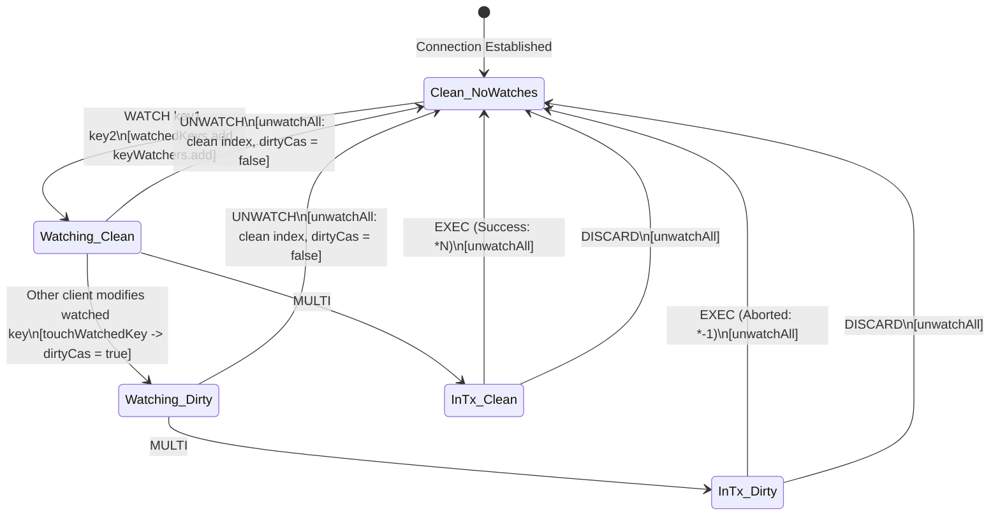
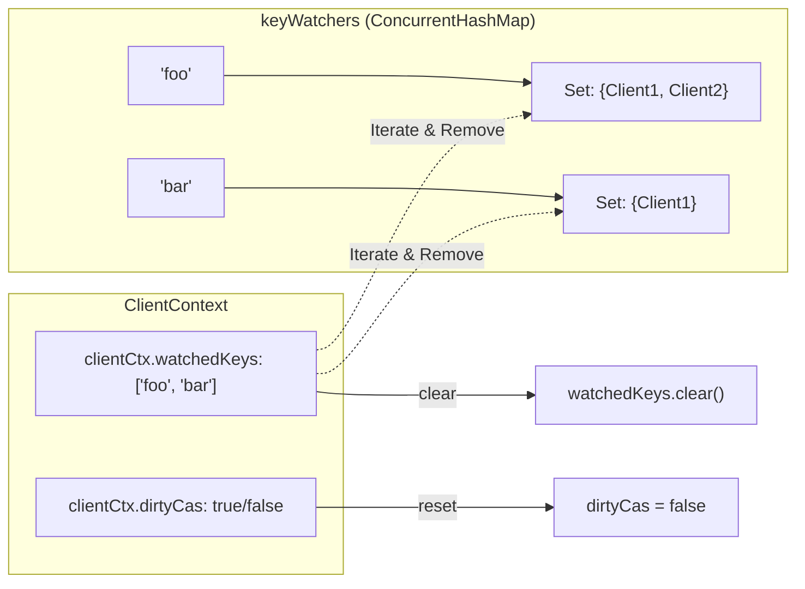

# Stage 48: The UNWATCH command

---

## In one line
Implement the `UNWATCH` command to explicitly tear down Optimistic Concurrency Control (OCC) subscriptions, purging connection registrations from the global inverted index (`keyWatchers`), clearing `clientCtx.watchedKeys`, and resetting `dirtyCas = false` to guarantee that subsequent transactions proceed cleanly.

---

## Self-test (cover the answers below and answer these first)
1. **What is the dual responsibility of `UNWATCH` with respect to a client's transaction state?**
   - *Answer*: (1) It unregisters the client from all watched keys in the global `keyWatchers` inverted index and clears `clientCtx.watchedKeys`, and (2) it resets `clientCtx.dirtyCas` back to `false`, discarding any CAS invalidations that occurred while those keys were being watched.
2. **If Client A watches `k1`, Client B modifies `k1` (causing Client A's `dirtyCas` to become `true`), and Client A executes `UNWATCH` followed by `MULTI ... EXEC`, what does `EXEC` return and why?**
   - *Answer*: `EXEC` succeeds and returns the array of command results (e.g. `*1\r\n...`). Because `UNWATCH` explicitly clears `dirtyCas = false`, the modification that occurred prior to `UNWATCH` is forgiven and no longer invalidates future transactions.
3. **What must `UNWATCH` return when invoked on a client that has NOT watched any keys?**
   - *Answer*: It returns simple string `+OK\r\n` without error. The operation is idempotent.
4. **Why must `unwatchAll` remove the client from `keyWatchers[k]` rather than simply clearing `clientCtx.watchedKeys`?**
   - *Answer*: If the client is not removed from `keyWatchers[k]`, future modifications to `k` by other clients will still find the client in `keyWatchers[k]` and falsely flip `clientCtx.dirtyCas = true`, silently corrupting future transactions or causing memory leaks.
5. **How does Redis handle `UNWATCH` inside an open `MULTI` block compared to `WATCH` inside `MULTI`?**
   - *Answer*: `WATCH` inside `MULTI` is explicitly forbidden and immediately returns `-ERR WATCH inside MULTI is not allowed\r\n`. In contrast, `UNWATCH` inside `MULTI` is queued (`+QUEUED\r\n`) and executed when `EXEC` commits (where it returns `+OK\r\n`, though all watches are cleared by `EXEC` regardless).
6. **Where else in the connection lifecycle must `unwatchAll` be called unconditionally, and why?**
   - *Answer*: Inside the `finally` block of the connection handler thread upon client socket disconnect, as well as during `EXEC` and `DISCARD`. This prevents orphaned client references from persisting indefinitely in `keyWatchers`, which would cause unbounded memory leaks.

---

## Problem Solved

In Stages 43–47, we implemented `WATCH`, multi-key tracking, mutation invalidation (`touchWatchedKey`), and tracking missing keys. Once a key is watched, any intervening modification sets `clientCtx.dirtyCas = true`.

However, optimistic workflows frequently encounter conditions where the client decides **not** to proceed with the planned transaction:
- **Condition Check Failed**: A client calls `WATCH account:100 balance:100`, reads both values, and discovers that the user has insufficient funds or business criteria are not met. The client decides *not* to transfer money.
- **Rollback / Retry Logic**: A worker watches a resource queue, but another worker claims it first. The worker wishes to cancel its watch and switch to a different queue without having to open a bogus `MULTI` and immediately call `DISCARD`.
- **Connection Pooling**: In pooled connections (e.g., Jedis, Lettuce), a client borrowed from a pool may have leftover watches from a previous operation. The connection pooler issues `UNWATCH` (or `RESET`) before returning the connection to the pool to prevent cross-request contamination.

### The Contract of UNWATCH
1. **Argument Count**: `UNWATCH` takes 0 arguments.
2. **Immediate Reply**: Returns `+OK\r\n` under all conditions (even if no keys were monitored).
3. **Inverted Index Deregistration**: For every key in `clientCtx.watchedKeys`, remove `clientCtx` from `keyWatchers.get(key)`.
4. **Local Set Cleared**: `clientCtx.watchedKeys.clear()`.
5. **CAS State Reset**: `clientCtx.dirtyCas = false`.
6. **Subsequent Immunity**: Any mutations made to previously watched keys (before or after `UNWATCH`) will **not** cause subsequent `MULTI ... EXEC` blocks to fail.

### Test Scenario
```text
# Client 1: Sets initial values and watches keys
Client 1: SET foo 100        -> +OK
Client 1: SET bar 200        -> +OK
Client 1: WATCH foo bar      -> +OK

# Client 2: Modifies one of the watched keys
Client 2: SET foo 200        -> +OK
# (Internally, Client 1's dirtyCas becomes true)

# Client 1: Cancels watches and resets CAS state
Client 1: UNWATCH            -> +OK
# (Internally, Client 1's watchedKeys cleared, removed from keyWatchers, dirtyCas reset to false)

# Client 1: Executes transaction
Client 1: MULTI              -> +OK
Client 1: SET foo 400        -> +QUEUED
Client 1: EXEC               -> *1\r\n+OK\r\n (Succeeds! Invalidation was erased by UNWATCH)

# Client 2: Confirms the transaction took effect
Client 2: GET foo            -> "400"
```

---

## Thought Process & Architectural Model

### 1. The Watch Life Cycle & State Transitions
A client connection moves through clear OCC states based on commands received:



### 2. The Dual-Index Deregistration Problem
Our storage engine maintains two complementary data structures for OCC:
1. **Global Inverted Index**: `keyWatchers: Map<String, Set<ClientContext>>`
   - Maps each key to all client sessions currently monitoring it.
   - Used by writers in `touchWatchedKey(key)` to find which clients to invalidate.
2. **Local Session Index**: `clientCtx.watchedKeys: Set<String>`
   - Tracks which keys this particular client is currently watching.
   - Used during `UNWATCH`, `EXEC`, `DISCARD`, and connection teardown.



When `unwatchAll(clientCtx)` executes:
```java
private static void unwatchAll(ClientContext clientCtx) {
  for (String key : clientCtx.watchedKeys) {
    Set<ClientContext> clients = keyWatchers.get(key);
    if (clients != null) {
      clients.remove(clientCtx);
    }
  }
  clientCtx.watchedKeys.clear();
  clientCtx.dirtyCas = false;
}
```
Every edge between `clientCtx` and the global `keyWatchers` map is severed. Even if `dirtyCas` was previously set to `true` by an earlier write from another client, `clientCtx.dirtyCas = false;` restores the connection to a clean baseline.

---

## Full Solution

### Core Additions to `Main.java`

#### 1. In Connection Event Loop: Handling `UNWATCH`
```java
} else if (command.equalsIgnoreCase("UNWATCH")) {
  unwatchAll(clientCtx);
  out.write("+OK\r\n".getBytes(StandardCharsets.UTF_8));
  out.flush();
}
```

#### 2. Inside `handleCommand`: Queued `UNWATCH` Execution Support
If `UNWATCH` is queued inside a `MULTI ... EXEC` block, it executes during `EXEC` and returns `+OK\r\n`:
```java
} else if (command.equalsIgnoreCase("UNWATCH")) {
  out.write("+OK\r\n".getBytes(StandardCharsets.UTF_8));
}
```

#### 3. Complete Transaction Lifecycle Integration
`unwatchAll(clientCtx)` is invoked across all lifecycle events:
- **`UNWATCH` command**: Explicit cancellation by client.
- **`EXEC` command**: Automatic unwatch upon commit/abort (Redis specification: `EXEC` unconditionally clears all watched keys).
- **`DISCARD` command**: Automatic unwatch upon transaction cancellation.
- **`finally` block**: Connection cleanup when socket disconnects to prevent memory leaks.

```java
// Sockets disconnect handler
} finally {
  unwatchAll(clientCtx);
  try {
    clientSocket.close();
  } catch (IOException ignored) {}
}
```

---

## Concepts (the transferable part)

### 1. Explicit Lease Cancellation in Distributed Coordination
In systems featuring Optimistic Concurrency Control, distributed locking, or watch leases (e.g., ZooKeeper ephemeral nodes, etcd watch streams, Consul sessions):
- Acquiring a watch/lease incurs state tracking overhead on both the broker and client.
- Relying purely on transaction completion or lease timeouts for cleanup creates latency windows and resource bloat.
- Providing an explicit, lightweight cancellation primitive (`UNWATCH`) allows clients to release interest immediately, reducing false CAS conflicts and conserving server indexing memory.

### 2. State Reset vs Accumulator Invalidation
When an OCC conflict occurs, some systems mark the transaction session permanently poisoned until reconnect. Redis's design separates the **subscription phase** (`WATCH`/`UNWATCH`) from the **execution phase** (`MULTI`/`EXEC`):
- `dirtyCas` is a transient invalidation indicator tied to the active set of watches.
- Calling `UNWATCH` resets the accumulator to its identity state (`false`), meaning the client does not need to close and reopen the TCP connection to recover from a conflict.

### 3. Dual-Index Consistency in Relational Subsystems
When maintaining bidirectional references between entities ($Client \leftrightarrow Key$):
- Removing from one side without removing from the other causes dangling pointer bugs or phantom notifications.
- The iteration pattern must guarantee thread safety during simultaneous removal and traversal.

---

## Wire Format / Protocol

### UNWATCH Protocol Flow

| Step | Conn | Client Sends (RESP) | Server Responds (RESP) | Server Internal State Transition |
|---|---|---|---|---|
| 1 | C1 | `*3\r\n$3\r\nSET\r\n$3\r\nfoo\r\n$3\r\n100\r\n` | `+OK\r\n` | `store["foo"] = 100` |
| 2 | C1 | `*3\r\n$3\r\nSET\r\n$3\r\nbar\r\n$3\r\n200\r\n` | `+OK\r\n` | `store["bar"] = 200` |
| 3 | C1 | `*3\r\n$5\r\nWATCH\r\n$3\r\nfoo\r\n$3\r\nbar\r\n` | `+OK\r\n` | `C1.watchedKeys = {"foo", "bar"}`<br/>`keyWatchers["foo"].add(C1)`<br/>`keyWatchers["bar"].add(C1)`<br/>`C1.dirtyCas = false` |
| 4 | C2 | `*3\r\n$3\r\nSET\r\n$3\r\nfoo\r\n$3\r\n200\r\n` | `+OK\r\n` | `store["foo"] = 200`<br/>`touchWatchedKey("foo")`<br/>$\implies$ **`C1.dirtyCas = true`** |
| 5 | C1 | `*1\r\n$7\r\nUNWATCH\r\n` | `+OK\r\n` | **`unwatchAll(C1)`**:<br/>`keyWatchers["foo"].remove(C1)`<br/>`keyWatchers["bar"].remove(C1)`<br/>`C1.watchedKeys.clear()`<br/>$\implies$ **`C1.dirtyCas = false`** |
| 6 | C1 | `*1\r\n$5\r\nMULTI\r\n` | `+OK\r\n` | `C1.inTx = true` |
| 7 | C1 | `*3\r\n$3\r\nSET\r\n$3\r\nfoo\r\n$3\r\n400\r\n` | `+QUEUED\r\n` | `C1.txQueue.add(["SET", "foo", "400"])` |
| 8 | C1 | `*1\r\n$4\r\nEXEC\r\n` | `*1\r\n+OK\r\n` | `C1.dirtyCas == false` $\implies$ **Commit!**<br/>`store["foo"] = 400` |
| 9 | C2 | `*2\r\n$3\r\nGET\r\n$3\r\nfoo\r\n` | `$3\r\n400\r\n` | Confirms value updated |

---

## What Breaks It (Failure Modes)

### 1. Failing to Reset `dirtyCas = false`
- *Hazard*: Clearing `clientCtx.watchedKeys` and removing entries from `keyWatchers`, but forgetting `clientCtx.dirtyCas = false;`.
- *Why it breaks*: If another client modified `foo` during the watch window, `dirtyCas` is `true`. Even though the client called `UNWATCH`, when they subsequently execute `MULTI ... EXEC`, `EXEC` inspects `dirtyCas`, sees `true`, and erroneously aborts the transaction with `*-1\r\n`.
- *Mitigation*: Unconditionally reset `clientCtx.dirtyCas = false` inside `unwatchAll`.

### 2. Partial Deregistration in `keyWatchers`
- *Hazard*: Clearing `clientCtx.watchedKeys.clear()` without iterating through `keyWatchers.get(key).remove(clientCtx)`.
- *Why it breaks*: The client is still present in the global `keyWatchers` bucket for those keys. When another client writes to that key in the future, `touchWatchedKey` iterates through `keyWatchers.get(key)` and sets `clientCtx.dirtyCas = true` on the unsuspecting client, poisoning future transactions!
- *Mitigation*: Always retrieve the `Set<ClientContext>` from `keyWatchers` for every key in `watchedKeys` and remove the client before clearing `watchedKeys`.

### 3. Throwing Error when No Keys are Watched
- *Hazard*: Checking `if (clientCtx.watchedKeys.isEmpty())` and returning `-ERR no keys watched`.
- *Why it breaks*: Redis specification mandates that `UNWATCH` is a safe, idempotent no-op returning `+OK\r\n`. Connection pools and client libraries emit `UNWATCH` defensively at the end of sessions regardless of whether watches were registered.
- *Mitigation*: Execute `unwatchAll` (which safely iterates over an empty set) and immediately return `+OK\r\n`.

### 4. Memory Leaks on Dead Connections
- *Hazard*: Only unwatching when the client explicitly sends `UNWATCH` or `EXEC`.
- *Why it breaks*: If a client sends `WATCH`, encounters an exception, and closes the TCP connection without sending `UNWATCH` or `EXEC`, the client object remains permanently referenced in `keyWatchers`. Over time, this leads to memory exhaustion and degraded iterate performance in `touchWatchedKey`.
- *Mitigation*: Enforce `unwatchAll(clientCtx)` in the `finally` block enclosing the socket reader loop.

---

## Tradeoffs

### 1. Synchronous Map Cleanup vs Tombstone Garbage Collection
- **Synchronous Cleanup (Chosen Architecture)**:
  - When `UNWATCH` runs, the client immediately removes itself from `keyWatchers` for all monitored keys ($O(W)$ where $W$ is the number of watched keys).
  - *Pros*: Immediate memory reclamation; `touchWatchedKey` never processes stale clients.
  - *Cons*: Slightly higher latency on `UNWATCH` if a client watched thousands of keys.
- **Lazy Tombstoning**:
  - `UNWATCH` simply sets an epoch or boolean flag on `clientCtx`. `keyWatchers` cleans up stale references lazily when `touchWatchedKey` traverses them.
  - *Pros*: $O(1)$ `UNWATCH`.
  - *Cons*: Memory bloat in `keyWatchers` for keys that are rarely modified; extra complexity during key mutations.

### 2. Granular Key UNWATCH (`UNWATCH key1`) vs Blanket UNWATCH
- Real Redis only supports blanket `UNWATCH` (clearing all watched keys for the connection).
- *Pros*: Simple client state model; guarantees transactions either commit under a holistic snapshot or are completely detached from past assumptions.
- *Cons*: A client watching 5 keys that only wants to release 1 key must `UNWATCH` all 5 and re-`WATCH` the remaining 4.

---

## Java Specifics — lookup, don't memorize

- `ConcurrentHashMap.newKeySet()` — Creates a thread-safe `Set` backed by a concurrent hash map. Supports concurrent removals without throwing `ConcurrentModificationException`.
- `Set.remove(Object o)` — Removes the specified element from this set if it is present ($O(1)$ expected time complexity).
- `Set.clear()` — Removes all elements from the set.
- `volatile boolean dirtyCas` — Ensures cross-thread memory visibility; when a worker thread modifies a watched key and flips `dirtyCas = true`, or connection thread flips `dirtyCas = false` during `UNWATCH`, the updated value is immediately visible to the executing thread.

---

## Rebuild Checklist

- [ ] Implement `UNWATCH` in connection loop:
  - [ ] Recognize `command.equalsIgnoreCase("UNWATCH")`.
  - [ ] Invoke `unwatchAll(clientCtx)`.
  - [ ] Write `+OK\r\n` to client output stream and flush.
- [ ] Implement robust `unwatchAll(ClientContext clientCtx)`:
  - [ ] Iterate through `clientCtx.watchedKeys`.
  - [ ] Retrieve `keyWatchers.get(key)` and remove `clientCtx`.
  - [ ] Clear `clientCtx.watchedKeys`.
  - [ ] Set `clientCtx.dirtyCas = false`.
- [ ] Connect `unwatchAll` across transaction lifecycle:
  - [ ] On `EXEC` completion (whether aborted or committed).
  - [ ] On `DISCARD` execution.
  - [ ] In the connection thread `finally` block on socket termination.
- [ ] Add `UNWATCH` handling in `handleCommand` for queued transaction execution compatibility.
