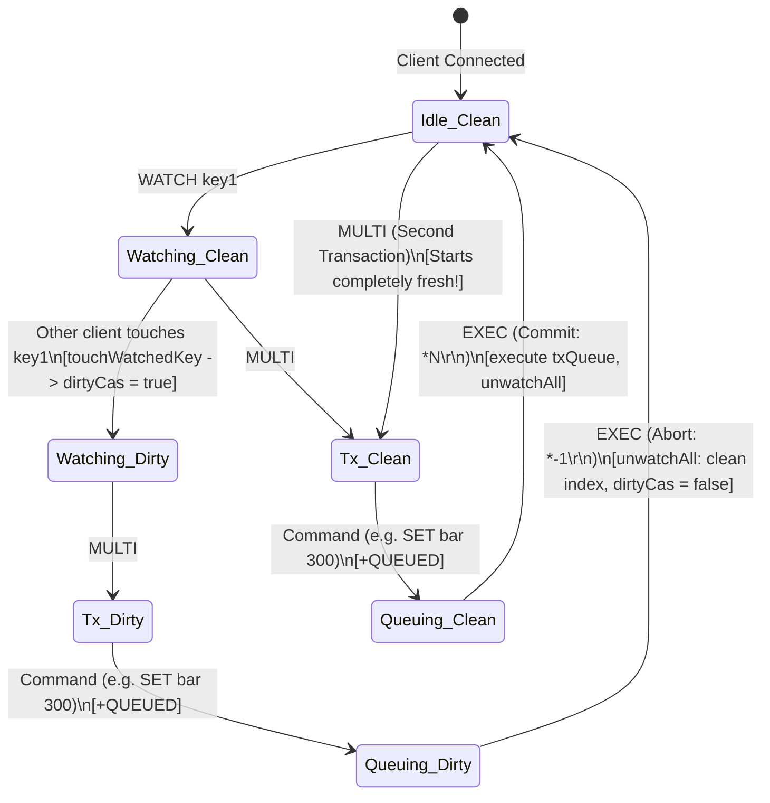
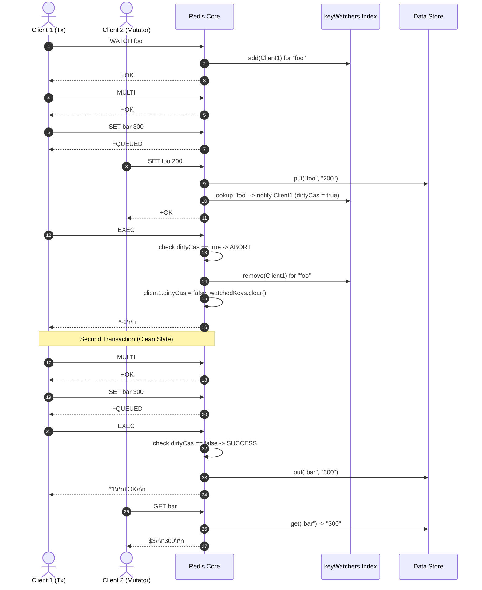

# Stage 49: Unwatch on EXEC

---

## In one line
Ensure that `EXEC` unconditionally clears all watched keys, unregisters the client from the global `keyWatchers` inverted index, and resets `dirtyCas = false` regardless of whether the transaction commits or aborts, preventing stale watch state from leaking into subsequent transactions on the same connection.

---

## Self-test (cover the answers below and answer these first)
1. **Why is `WATCH` defined in Redis as a single-shot transaction guard rather than a persistent subscription?**
   - *Answer*: `WATCH` is designed specifically for Optimistic Concurrency Control (OCC) during a check-then-act sequence. Once the transaction completes (via `EXEC` or `DISCARD`), the conditioned decision has either executed or failed. If watches persisted, every subsequent transaction on that connection would be hostage to mutations on keys monitored for an earlier, unrelated operation, causing rampant false-positive aborts.
2. **When an `EXEC` command encounters `dirtyCas == true` and aborts (returning `*-1\r\n`), must `unwatchAll` be called? What happens if it is not?**
   - *Answer*: Yes, absolutely. If `unwatchAll` is not called on abort, the client remains registered in `keyWatchers` and `dirtyCas` remains `true`. Any subsequent transaction executed by the client without an intervening `UNWATCH` or `WATCH` would immediately abort, even if the keys modified had nothing to do with the new transaction.
3. **When an `EXEC` command succeeds and executes all queued commands, at what point should `unwatchAll` run, and what happens if one of the queued commands modifies a watched key?**
   - *Answer*: The CAS check (`if (clientCtx.dirtyCas)`) occurs *before* executing the queued commands. During the execution of queued commands inside the `synchronized (txExecutionLock)` block, any internal modifications by the client itself may trigger `touchWatchedKey`. However, because the check has already completed, and because `unwatchAll` runs at the conclusion of `EXEC` (wrapped in a `try ... finally` block), all watch registrations and `dirtyCas` are cleared cleanly before the next command is processed.
4. **What is the difference between `UNWATCH` and the automatic unwatch performed by `EXEC`?**
   - *Answer*: Both perform the exact same state teardown (`unwatchAll`: unregister from global `keyWatchers`, clear local `watchedKeys`, reset `dirtyCas = false`). However, `UNWATCH` is an explicit command invoked before a transaction starts (or when abandoning a watch sequence without calling `MULTI`), whereas `EXEC` performs this teardown automatically and unconditionally upon transaction termination.
5. **How does connection pooling in production Redis clients (e.g., Jedis, Lettuce, redis-py) rely on `EXEC` clearing watch state?**
   - *Answer*: Pooled connections are checked out by worker threads, used to execute transactions, and returned to the pool for reuse by other threads. Automatic cleanup on `EXEC` ensures that transactions do not leave residual watch listeners or dirty flags on the connection, avoiding cross-request race conditions and data corruption.
6. **Why must `unwatchAll` remove the client from the global `keyWatchers` set for each key, rather than just clearing `clientCtx.watchedKeys`?**
   - *Answer*: If the client is not purged from `keyWatchers.get(key)`, future write operations by other clients to that key will still look up the set, find the stale `ClientContext`, and set its `dirtyCas` flag to `true`. This would corrupt future transactions on that connection and lead to memory leaks by retaining orphaned `ClientContext` objects.

---

## Problem Solved

In Stages 43 through 48, we built an Optimistic Concurrency Control (OCC) engine using `WATCH`, multi-key monitoring, inverted index tracking (`keyWatchers`), and explicit teardown via `UNWATCH`.

In Redis, `WATCH` is strictly **single-shot**. Its purpose is to monitor keys between the moment `WATCH` is invoked and the moment the conditioned transaction finishes execution with `EXEC` (or is explicitly cancelled via `DISCARD` or `UNWATCH`).

Consider what happens if `EXEC` does **not** clear the watch state:
1. **False-Positive Aborts on Reused Connections**:
   - Client watches `foo` and executes a transaction.
   - The transaction aborts because another client updated `foo`.
   - Client attempts a new, unrelated transaction on `bar`.
   - Because `dirtyCas` is still `true` from the previous failure, the new transaction unexpectedly aborts!
2. **Interference from Past Watches**:
   - Client watches `foo`, executes a successful transaction touching `bar`.
   - Later, Client starts another transaction only touching `bar`.
   - Another client modifies `foo`.
   - The old watch on `foo` triggers, dirtying Client's CAS state and aborting the second transaction even though `foo` was not relevant to it.
3. **Memory Leaks**:
   - Long-lived persistent connections accumulated in `keyWatchers` sets indefinitely, consuming memory and slowing down `touchWatchedKey` loops.

### The Contract for EXEC Cleanup
1. **On Abort (`dirtyCas == true`)**:
   - Clear client's watch registrations from `keyWatchers`.
   - Clear client's local `watchedKeys` set.
   - Reset `dirtyCas = false`.
   - Discard queued commands (`txQueue.clear()`).
   - Emit RESP Null Array: `*-1\r\n`.
2. **On Commit (`dirtyCas == false`)**:
   - Emit RESP Array header: `*<count>\r\n`.
   - Execute all queued commands in order.
   - Clear client's watch registrations from `keyWatchers`.
   - Clear client's local `watchedKeys` set.
   - Reset `dirtyCas = false`.
   - Discard queued commands (`txQueue.clear()`).
3. **Subsequent Transactions**:
   - A subsequent `MULTI ... EXEC` block on the same connection starts with a completely clean CAS state (`dirtyCas == false`, `watchedKeys.isEmpty()`).

### Test Scenario Walkthrough
```text
# Step 1: Client 1 sets initial values
Client 1: SET foo 100         -> +OK\r\n
Client 1: SET bar 200         -> +OK\r\n

# Step 2: Client 1 watches 'foo' and queues a transaction
Client 1: WATCH foo           -> +OK\r\n
Client 1: MULTI               -> +OK\r\n
Client 1: SET bar 300         -> +QUEUED\r\n

# Step 3: Client 2 modifies watched key 'foo'
Client 2: SET foo 200         -> +OK\r\n
# (touchWatchedKey("foo") sets Client 1's dirtyCas = true)

# Step 4: Client 1 attempts EXEC -> Aborts and cleans up!
Client 1: EXEC                -> *-1\r\n
# (Internally: unwatchAll(clientCtx) removes Client 1 from keyWatchers["foo"],
#              clears watchedKeys, resets dirtyCas = false)

# Step 5: Client 1 immediately begins a second transaction without WATCH
Client 1: MULTI               -> +OK\r\n
Client 1: SET bar 300         -> +QUEUED\r\n
Client 1: EXEC                -> *1\r\n+OK\r\n
# (Succeeds! Because the previous EXEC cleared dirtyCas, no past watch interferes)

# Step 6: Client 2 verifies that bar was updated
Client 2: GET bar             -> $3\r\n300\r\n
```

---

## Thought Process & Architectural Model

### 1. The OCC Lifecycle with Single-Shot Watch Cleanup
A client connection transitions across states, with `EXEC` acting as a convergence point that resets all OCC metadata back to clean:



### 2. Multi-Client Execution Flow & Index Deregistration
The interaction between two concurrent clients and the shared memory indexes:



### 3. Dual-Index Structural Integrity During Cleanup
Our architecture maintains consistency between client-local state and the global inverted index:

```mermaid
flowchart TD
    subgraph ClientContext [ClientContext]
        WK["watchedKeys: ['foo']"]
        DC["dirtyCas: true"]
    end

    subgraph GlobalStore [Global keyWatchers Map]
        K_foo["'foo'"] --> CSet["Set: { Client1, Client2 }"]
    end

    EXEC_CALL["EXEC Invocation"] --> CHECK{"dirtyCas == true?"}
    
    CHECK -->|Yes (Abort)| ABORT_BLOCK["unwatchAll(clientCtx)\ntxQueue.clear()\nout.write('*-1\\r\\n')"]
    CHECK -->|No (Commit)| COMMIT_BLOCK["out.write('*len\\r\\n')\nexecute commands\ntry...finally unwatchAll(clientCtx)"]

    ABORT_BLOCK --> UNWATCH_ACTION
    COMMIT_BLOCK --> UNWATCH_ACTION

    subgraph UNWATCH_ACTION ["unwatchAll(clientCtx)"]
        DEREG["For each key in watchedKeys:\nkeyWatchers.get(key).remove(clientCtx)"]
        CLEAR_LOCAL["watchedKeys.clear()"]
        RESET_CAS["dirtyCas = false"]
    end

    DEREG -.->|Removes Client1| CSet
    CLEAR_LOCAL -.->|Empties| WK
    RESET_CAS -.->|Resets| DC
```

---

## Full Solution

### Implementation in `Main.java`

```java
  private static class ClientContext {
    final Set<String> watchedKeys = ConcurrentHashMap.newKeySet();
    volatile boolean dirtyCas = false;
  }

  private static final Map<String, Set<ClientContext>> keyWatchers = new ConcurrentHashMap<>();
  private static final Object txExecutionLock = new Object();

  // Deregisters the client from the inverted index and resets CAS tracking
  private static void unwatchAll(ClientContext clientCtx) {
    for (String key : clientCtx.watchedKeys) {
      Set<ClientContext> clients = keyWatchers.get(key);
      if (clients != null) {
        clients.remove(clientCtx);
      }
    }
    clientCtx.watchedKeys.clear();
    clientCtx.dirtyCas = false;
  }
```

### Transaction Execution in the Client Loop

```java
              if (inTx[0]) {
                if (command.equalsIgnoreCase("EXEC")) {
                  inTx[0] = false;
                  synchronized (txExecutionLock) {
                    if (clientCtx.dirtyCas) {
                      // Abort path: unwatch unconditionally and return *-1\r\n
                      unwatchAll(clientCtx);
                      txQueue.clear();
                      out.write("*-1\r\n".getBytes(StandardCharsets.UTF_8));
                      out.flush();
                      continue;
                    }

                    // Success path: emit array header and execute queued commands atomically
                    out.write(("*" + txQueue.size() + "\r\n").getBytes(StandardCharsets.UTF_8));
                    try {
                      for (String[] cmd : txQueue) {
                        handleCommand(cmd, out);
                      }
                    } finally {
                      // Guarantee watch teardown and queue clearance even on I/O failure
                      unwatchAll(clientCtx);
                      out.flush();
                      txQueue.clear();
                    }
                  }
                  continue;
                } else if (command.equalsIgnoreCase("DISCARD")) {
                  inTx[0] = false;
                  txQueue.clear();
                  unwatchAll(clientCtx);
                  out.write("+OK\r\n".getBytes(StandardCharsets.UTF_8));
                  out.flush();
                  continue;
                }
                // ...
              }
```

---

## Concepts (the transferable part)

- **Single-Shot Transaction Guards**:
  In contrast to Pub/Sub subscriptions (which persist across multiple messages until explicitly unsubscribed), OCC watches are scoped to a single transaction attempt. Once the transaction resolves (commits or aborts), the condition has been evaluated, and the guard expires.
- **Connection Reuse Hygiene**:
  Stateful protocols over persistent TCP sockets require meticulous state hygiene. Any per-transaction metadata (transaction buffers, watch sets, CAS failure flags) must be guaranteed to reset at transaction exit. Failing to reset connection state results in bugs that only manifest under connection pooling or reuse.
- **Inverted Index Deregistration**:
  When maintaining bidirectional or inverted indexes (such as key $\to$ Set of listeners), cleaning up the child entity requires removing references from all parent containers. Failure to do so causes both memory leaks (retaining disconnected or idle clients) and computational waste during mutation broadcasts (`touchWatchedKey`).
- **Idempotent Cleanup**:
  `unwatchAll` must be safe to call repeatedly: when `watchedKeys` is empty, it is a no-op; when keys are populated, it drains them safely without throwing `ConcurrentModificationException`.

---

## What Breaks It (failure modes)

- **Failing to Clear on Abort**:
  A common bug is calling `unwatchAll` only in the success branch of `EXEC`. If `EXEC` aborts with `*-1\r\n`, `dirtyCas` stays `true`, permanently disabling all future transactions on that connection.
- **Self-Dirtying During Transaction Execution**:
  If a queued command inside `MULTI ... EXEC` updates a key that was watched prior to `MULTI`, the mutation will invoke `touchWatchedKey(key)`. If `unwatchAll` is called *before* the commands execute, `touchWatchedKey` won't find the client. If called *after*, `dirtyCas` will be flipped to `true` during execution. By having `unwatchAll` reset `dirtyCas = false` at the very end of `EXEC`, any self-modifications are erased, leaving the client clean for future transactions.
- **Concurrent Modification During unwatchAll**:
  Another client might be iterating over `keyWatchers.get(key)` in `touchWatchedKey` while this client is calling `remove(clientCtx)` in `unwatchAll`. Using thread-safe collections (`ConcurrentHashMap.newKeySet()`) prevents `ConcurrentModificationException`.
- **Unhandled Exceptions in Command Execution**:
  If an exception occurs during the execution of a queued command (e.g. an I/O socket error), failing to wrap the execution loop in a `try ... finally` block would leave the connection in `keyWatchers`.

---

## Tradeoffs

- **Single-Shot vs Persistent Watch**:
  - *Single-Shot (Redis design)*: Automatically clears watches on `EXEC`/`DISCARD`. Simplifies client logic, guarantees that stale watches do not poison future transactions, and prevents memory leaks.
  - *Persistent Watch*: Requires clients to explicitly manage lifecycle. Highly error-prone; a single forgotten unwatch can silently break subsequent transactions.
- **Global txExecutionLock vs Fine-Grained Locking**:
  - *Global txExecutionLock*: Simple, completely prevents interleaving of multi-key transactions with other transactions, preventing transaction isolation violations.
  - *Fine-Grained Key Locking*: Higher concurrency, but requires lock ordering (e.g., sorting keys lexicographically) to avoid deadlocks. In Redis, the event loop is single-threaded, so transactions run sequentially without locks.

---

## Wire Format / Protocol

The test executes the following RESP communication sequence:

| Step | Client $\to$ Server (Raw Bytes) | Server $\to$ Client (Raw Bytes) | Description |
| :--- | :--- | :--- | :--- |
| 1 | `*3\r\n$3\r\nSET\r\n$3\r\nfoo\r\n$3\r\n100\r\n` | `+OK\r\n` | Setup initial key `foo` |
| 2 | `*3\r\n$3\r\nSET\r\n$3\r\nbar\r\n$3\r\n200\r\n` | `+OK\r\n` | Setup initial key `bar` |
| 3 | `*2\r\n$5\r\nWATCH\r\n$3\r\nfoo\r\n` | `+OK\r\n` | Client 1 watches `foo` |
| 4 | `*1\r\n$5\r\nMULTI\r\n` | `+OK\r\n` | Client 1 opens transaction block |
| 5 | `*3\r\n$3\r\nSET\r\n$3\r\nbar\r\n$3\r\n300\r\n` | `+QUEUED\r\n` | Queued in Client 1's transaction |
| 6 | *(Client 2)* `*3\r\n$3\r\nSET\r\n$3\r\nfoo\r\n$3\r\n200\r\n` | `+OK\r\n` | Client 2 mutates watched key `foo` |
| 7 | `*1\r\n$4\r\nEXEC\r\n` | `*-1\r\n` | Aborted! Watched key was mutated. Watch cleared! |
| 8 | `*1\r\n$5\r\nMULTI\r\n` | `+OK\r\n` | Client 1 opens a second transaction |
| 9 | `*3\r\n$3\r\nSET\r\n$3\r\nbar\r\n$3\r\n300\r\n` | `+QUEUED\r\n` | Queued in second transaction |
| 10 | `*1\r\n$4\r\nEXEC\r\n` | `*1\r\n+OK\r\n` | **Succeeds!** Past watch did not poison new transaction |
| 11 | *(Client 2)* `*2\r\n$3\r\nGET\r\n$3\r\nbar\r\n` | `$3\r\n300\r\n` | Confirms transaction mutation committed |

---

## Java Specifics \u2014 lookup, don't memorize

- `ConcurrentHashMap.newKeySet()`: Returns a thread-safe `Set<E>` backed by a concurrent hash map. Safe for concurrent additions, removals, and traversals without external synchronization.
- `volatile boolean dirtyCas`: Ensures cross-thread memory visibility for writes performed by worker threads invoking `touchWatchedKey` when mutations occur.
- `try ... finally`: Guarantees execution of cleanup blocks (`unwatchAll`, `txQueue.clear()`, `out.flush()`) even when unchecked exceptions or IO errors occur.

---

## Rebuild Checklist

- [ ] Declare `ClientContext` with `watchedKeys = ConcurrentHashMap.newKeySet()` and `volatile boolean dirtyCas = false`.
- [ ] Maintain a global `keyWatchers = new ConcurrentHashMap<String, Set<ClientContext>>()`.
- [ ] Implement helper `unwatchAll(ClientContext ctx)`:
  - [ ] Iterate through `ctx.watchedKeys` and remove `ctx` from `keyWatchers.get(key)`.
  - [ ] Clear `ctx.watchedKeys`.
  - [ ] Set `ctx.dirtyCas = false`.
- [ ] In `EXEC` handler when `inTx` is true:
  - [ ] Set `inTx = false`.
  - [ ] If `clientCtx.dirtyCas == true`:
    - [ ] Call `unwatchAll(clientCtx)`.
    - [ ] Call `txQueue.clear()`.
    - [ ] Send `*-1\r\n`.
  - [ ] If `clientCtx.dirtyCas == false`:
    - [ ] Emit `*<size>\r\n`.
    - [ ] Execute commands inside `try ... finally`.
    - [ ] In `finally`: call `unwatchAll(clientCtx)`, flush output, and clear `txQueue`.
- [ ] In connection teardown (`finally` block of client socket worker), call `unwatchAll(clientCtx)`.
- [ ] Verify that a subsequent `MULTI ... EXEC` block executes successfully on the same connection.
